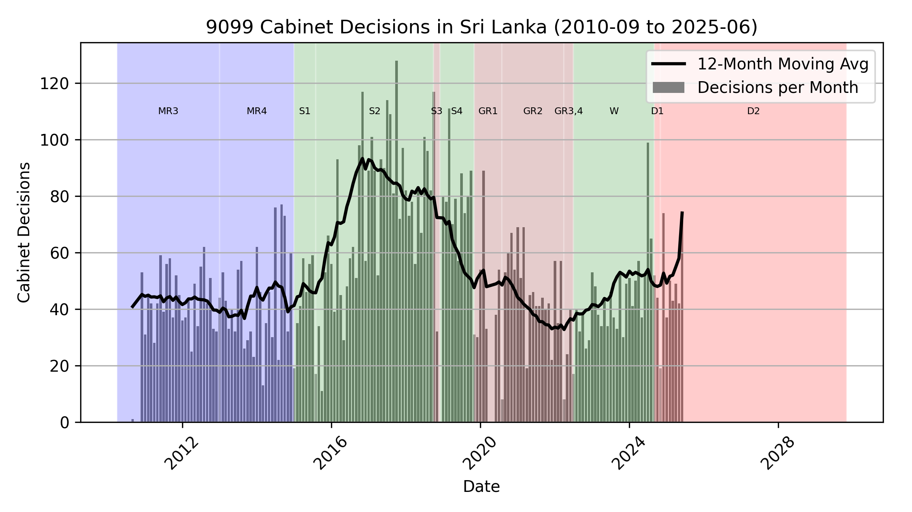

# 🇱🇰 Cabinet Decisions – Sri Lanka

A structured, real-time feed of official cabinet
decisions from Sri Lanka.

Data is available in TSV and JSON formats.

This is **public data** — free to use, share, and
build on.

Perfect for researchers, journalists, civic tech
projects, or anyone curious about governance in
Sri Lanka.

## Data Summary

| | |
|:--|--:|
<<<<<<< HEAD
| Last Updated   | **2025-06-16 10:34:39**     |
| nDecisions   | **6,819**     |
=======
| Last Updated   | **2025-06-16 10:15:40**     |
| nDecisions   | **6,722**     |
>>>>>>> 210d659 (pipeline)
| Latest   | **2025-06-09** |
| Earliest | **2010-12-29** |



## Example JSON Data for a single Cabinet Decision

```json
{
  "date_str": "2025-06-09",
  "decision_num": 15,
  "title": "An Act to amend the Penal Code (Corporal Punishment) (Chapter 19)",
  "source_url": "https://www.cabinetoffice.gov.lk/cab/index.php?option=com_content&view=article&id=16&Itemid=49&lang=en&dID=13230",
  "decision_details": "- It has been scientifically proven that physical and psychological abuse caused to a child by corporal punishment is extensive. Therefore, approval has been granted at the Cabinet meeting held on 2024-04-29 to amend the Penal Code (Chapter 19) to prohibit the corporal punishment in all spheres and to make provisions for the imposition of punishment for physical abuse. Although the Cabinet of Ministers has previously granted approval to publish the Penal Code (Amendment) Bill prepared by the Legal Draftsman for the relevant purpose, in the Government Gazette and present the same in Parliament, it has not been possible to act accordingly. The need for the expeditious enactment of the said Bill has been identified. Accordingly, the proposal made by the Minister of Justice and National Integration to publish the said Bill in the Government Gazette and thereafter to submit the same to Parliament, was approved by the Cabinet.",
  "key": "2025-06-09-015-9905"
}
```

[JSON Source](data/cabinet_decisions/2025/2025-06/2025-06-09-015-9905.json)

## Example TSV Data

<<<<<<< HEAD
[Complete TSV](data/cabinet_decisions.tsv) (6.84 MB)
=======
[Complete TSV](data/cabinet_decisions.tsv) (6.73 MB)
>>>>>>> 210d659 (pipeline)

| date_str | decision_num | title | source_url | decision_details | key |
|:--|--:|:--|:--|:--|:--|
| 2025-06-09 | 15 | An Act to amend the ... | [https://www.cabineto...](https://www.cabinetoffice.gov.lk/cab/index.php?option=com_content&view=article&id=16&Itemid=49&lang=en&dID=13230) | - It has been scient... | 2025-06-09-015-9905 |
| 2025-06-09 | 14 | Amendment to the Cod... | [https://www.cabineto...](https://www.cabinetoffice.gov.lk/cab/index.php?option=com_content&view=article&id=16&Itemid=49&lang=en&dID=13229) | - Approval has been ... | 2025-06-09-014-f943 |
| 2025-06-09 | 13 | Preparation of the '... | [https://www.cabineto...](https://www.cabinetoffice.gov.lk/cab/index.php?option=com_content&view=article&id=16&Itemid=49&lang=en&dID=13228) | - Sri Lanka ranks am... | 2025-06-09-013-d36e |

<<<<<<< HEAD
(These are the first 3 of **6,819** rows of the full TSV data)
=======
(These are the first 3 of **6,722** rows of the full TSV data)
>>>>>>> 210d659 (pipeline)

## Last 3 Cabinet Decisions

### 1) An Act to amend the Penal Code (Corporal Punishment) (Chapter 19)

*2025-06-09*, *#15*

[https://www.cabinetoffice.gov.lk/cab/index.php?option=com_content&view=article&id=16&Itemid=49&lang=en&dID=13230](https://www.cabinetoffice.gov.lk/cab/index.php?option=com_content&view=article&id=16&Itemid=49&lang=en&dID=13230)

It has been scientifically proven that physical and psychological abuse caused to a child by corporal punishment is extensive. Therefore, approval has been granted at the Cabinet meeting held on 2024-04-29 to amend the Penal Code (Chapter 19) to prohibit the corporal punishment in all spheres and to make provisions for the imposition of punishment for physical abuse. Although the Cabinet of Ministers has previously granted approval to publish the Penal Code (Amendment) Bill prepared by the Legal Draftsman for the relevant purpose, in the Government Gazette and present the same in Parliament, it has not been possible to act accordingly. The need for the expeditious enactment of the said Bill has been identified. Accordingly, the proposal made by the Minister of Justice and National Integration to publish the said Bill in the Government Gazette and thereafter to submit the same to Parliament, was approved by the Cabinet.

### 2) Amendment to the Code of Criminal Procedure Act, No.15 of 1979 (Corporal Punishment)

*2025-06-09*, *#14*

[https://www.cabinetoffice.gov.lk/cab/index.php?option=com_content&view=article&id=16&Itemid=49&lang=en&dID=13229](https://www.cabinetoffice.gov.lk/cab/index.php?option=com_content&view=article&id=16&Itemid=49&lang=en&dID=13229)

Approval has been granted at the Cabinet meeting held on 2024-04-29 to  amend the Code of Criminal Procedure Act, No. 15 of 1979 to make provisions for the prohibition of Corporal Punishment in all spheres. Accordingly, the proposal made by the Minister of Justice and National Integration to grant policy approval of the present Cabinet to prepare an amending Bill for the relevant purpose, was approved by the Cabinet.

### 3) Preparation of the 'Promotion of Breastfeeding' Bill

*2025-06-09*, *#13*

[https://www.cabinetoffice.gov.lk/cab/index.php?option=com_content&view=article&id=16&Itemid=49&lang=en&dID=13228](https://www.cabinetoffice.gov.lk/cab/index.php?option=com_content&view=article&id=16&Itemid=49&lang=en&dID=13228)

Sri Lanka ranks among the highest in the world in terms of breastfeeding indicators and has become the first country to be awarded ‘Green Status’ by the World Breastfeeding Trends initiative (WBTi). Approval has been granted by the Cabinet of Ministers on 2018-10-16 to introduce legal provisions through an Act to promote breastfeeding, with the aim of protecting the health and nutrition of children by protecting children from the unethical and harmful effects of the milk powder industry on children for commercial purposes,, protecting breastfeeding as a key intervention that is scientifically proven, and ensuring that the country continues to be recognized as a global leader in breastfeeding. Accordingly, the proposal made by the Minister of Health and Mass Media to grant policy approval of the present Cabinet for the preparation of the relevant Bill, was approved by the Cabinet.

<<<<<<< HEAD
## All Cabinet Decisions (6,819)
=======
## All Cabinet Decisions (6,722)
>>>>>>> 210d659 (pipeline)

- [2025-06-09] [An Act to amend the Penal Code (Corporal Punishment) (Chapter 19)](data/cabinet_decisions/2025/2025-06/2025-06-09-015-9905.json)
- [2025-06-09] [Amendment to the Code of Criminal Procedure Act, No.15 of 1979 (Corporal Punishment)](data/cabinet_decisions/2025/2025-06/2025-06-09-014-f943.json)
- [2025-06-09] [Preparation of the 'Promotion of Breastfeeding' Bill](data/cabinet_decisions/2025/2025-06/2025-06-09-013-d36e.json)
- [2025-06-09] [Formulation of an Act for the establishment of the Matara Cultural and Development Board](data/cabinet_decisions/2025/2025-06/2025-06-09-012-ae5e.json)
- [2025-06-09] [Amendment of the Sri Lanka Institute of Architects (SLIA) Law No.1 of 1976](data/cabinet_decisions/2025/2025-06/2025-06-09-011-7919.json)
- [2025-06-09] [Construction of a new residential building at the Treatment and Rehabilitation Centre for young people with drug addiction](data/cabinet_decisions/2025/2025-06/2025-06-09-010-6345.json)
- [2025-06-09] [Purchase of Waste Compactor Vehicles for regularizing transport of Waste in Local Authorities](data/cabinet_decisions/2025/2025-06/2025-06-09-009-4360.json)
- [2025-06-09] [Improving and maintaining the broadcasting activities of the Independent Television Network](data/cabinet_decisions/2025/2025-06/2025-06-09-008-1fb9.json)
- [2025-06-09] [Allocation of provisions for the projects identified in the industrial and enterprise development sectors](data/cabinet_decisions/2025/2025-06/2025-06-09-007-86dd.json)
- [2025-06-09] [Preparation of the Master Plan for the Bandaranaike International Airport](data/cabinet_decisions/2025/2025-06/2025-06-09-006-28f3.json)
- [2025-06-09] [Construction of Section IV (from Kurunegala to Dambulla) of the Central 	Expressway](data/cabinet_decisions/2025/2025-06/2025-06-09-005-05f3.json)
- [2025-06-09] [Establishment of the Faculty of Medicine of the Uva Wellassa University](data/cabinet_decisions/2025/2025-06/2025-06-09-004-7fa3.json)
- [2025-06-09] [Entering into a Memorandum of Understanding between the Australian Federal Police and the Sri Lanka Police on Combating Transnational Crime and Police Cooperation](data/cabinet_decisions/2025/2025-06/2025-06-09-003-56b1.json)
- [2025-06-09] [Ratification of the First Phase of the Agreement on Fisheries Subsidies 	of 	the World Trade Organization](data/cabinet_decisions/2025/2025-06/2025-06-09-002-cdeb.json)
- [2025-06-09] [Operating the Sri Lanka Broadcasting Corporation and the Sri Lanka Rupavahini Corporation as separate public enterprises with their own distinct identities](data/cabinet_decisions/2025/2025-06/2025-06-09-001-9710.json)
- [2025-06-02] [Importation of standardized maize required for Thriposha production](data/cabinet_decisions/2025/2025-06/2025-06-02-022-9307.json)
- [2025-06-02] [Appointment of a Task Force to restore the Swine Industry severely impacted by the African Swine Fever Viral Disease](data/cabinet_decisions/2025/2025-06/2025-06-02-021-8cf5.json)
- [2025-06-02] [Appointment to the Post of District Secretary/Government Agent in the Administrative District of Matale](data/cabinet_decisions/2025/2025-06/2025-06-02-020-7568.json)
- [2025-06-02] [Appointment to the Post of Director General of the Department of Buildings](data/cabinet_decisions/2025/2025-06/2025-06-02-019-1118.json)
- [2025-06-02] [Sign Language Bill](data/cabinet_decisions/2025/2025-06/2025-06-02-018-f52e.json)
- [2025-06-02] [Mediation (Civil and Commercial Disputes) Bill](data/cabinet_decisions/2025/2025-06/2025-06-02-017-221e.json)
- [2025-06-02] [Agreement for the Transfer of Sentenced Persons between the Democratic Socialist Republic of Sri Lanka and the Republic of Latvia](data/cabinet_decisions/2025/2025-06/2025-06-02-016-1e55.json)
- [2025-06-02] [Introduction of a new Apartment Ownership (Special Provisions) Act](data/cabinet_decisions/2025/2025-06/2025-06-02-015-5b2a.json)
- [2025-06-02] [Appointment of a committee to review the drafted Employment Bill](data/cabinet_decisions/2025/2025-06/2025-06-02-014-07e0.json)
- [2025-06-02] [Procurement for the supply of 270,000 Vials of Meropenem Injection 1g vial](data/cabinet_decisions/2025/2025-06/2025-06-02-013-2ef7.json)
- [2025-06-02] [Project to construct permanent houses for families displaced by conflict in the Northern and Eastern Provinces](data/cabinet_decisions/2025/2025-06/2025-06-02-012-65bd.json)
- [2025-06-02] [Development of the Myliddy Fishery Harbour - Phase III](data/cabinet_decisions/2025/2025-06/2025-06-02-011-c924.json)
- [2025-06-02] [Hosting the Seventh Meeting of the SAARC Inter-Governmental Group on Transport](data/cabinet_decisions/2025/2025-06/2025-06-02-010-f780.json)
- [2025-06-02] [Establishment of a Metro Bus Unit for Urban Transportation](data/cabinet_decisions/2025/2025-06/2025-06-02-009-5a08.json)
- [2025-06-02] [Declaration of a portion of the Nikkandupola Stream, a natural habitat of the rare Bandula Pethiya Fish as a Sanctuary under the Fauna and Flora Protection Ordinance](data/cabinet_decisions/2025/2025-06/2025-06-02-008-cb9b.json)
- [2025-06-02] [Calling for Expressions of Interest to set apart the old Bogambara Prison Land located in Kandy, on 50 year lease basis](data/cabinet_decisions/2025/2025-06/2025-06-02-007-4f7e.json)
- [2025-06-02] [Providing underutilized lands/properties to suitable investors for optimal use](data/cabinet_decisions/2025/2025-06/2025-06-02-006-ecb0.json)
- [2025-06-02] [Establishment of the Ingiriya Industrial Estate and implementation of the Second Phase of the Raigama, Millaniya Industrial Estate](data/cabinet_decisions/2025/2025-06/2025-06-02-005-ed99.json)
- [2025-06-02] [Memorandum of Understanding on the Establishment of a Political Consultations Mechanism between Guatemala and 	Sri Lanka](data/cabinet_decisions/2025/2025-06/2025-06-02-004-fef7.json)
- [2025-06-02] [Implementation of the Country Strategic Plan for Sri Lanka of the World 	Food Programme](data/cabinet_decisions/2025/2025-06/2025-06-02-003-8f25.json)
- [2025-06-02] [Establishment of a Task Force on Digital Transformation of Education](data/cabinet_decisions/2025/2025-06/2025-06-02-002-341a.json)
- [2025-06-02] [Establishment of a New Unit for Public - Private Partnership](data/cabinet_decisions/2025/2025-06/2025-06-02-001-3396.json)
- [2025-05-26] [Establishment of the Revenue Administration Reform and Modernization Bureau](data/cabinet_decisions/2025/2025-05/2025-05-26-021-7225.json)
- [2025-05-26] [Amendment to the Online Safety Act No.9 of 2024](data/cabinet_decisions/2025/2025-05/2025-05-26-020-7b44.json)
- [2025-05-26] [Memorandum of Understanding (MoU) on Strengthening Economic 	Cooperation in Industrial and Supply Chains between the Ministry of 	Industry and Entrepreneurship Development and the Ministry of 	Commerce of the People's Republic of China](data/cabinet_decisions/2025/2025-05/2025-05-26-019-ba1b.json)
- [2025-05-26] [Term contract for the Procurement of 05 shipments of Gas Oil  (0.05% M.S.) during the period from 2025.06.01 to 2025.11.30](data/cabinet_decisions/2025/2025-05/2025-05-26-018-3583.json)
- [2025-05-26] [Signing a Memorandum of Understanding to establish a Working Group for the promotion of smooth bilateral trade between Sri Lanka and China](data/cabinet_decisions/2025/2025-05/2025-05-26-017-8d52.json)
- [2025-05-26] [Implementation of the recommendations of the Committee appointed to review the recruitment process and cadre management in the Public Service](data/cabinet_decisions/2025/2025-05/2025-05-26-016-3cae.json)
- [2025-05-26] [Appointment to the Post of Director General of Agriculture](data/cabinet_decisions/2025/2025-05/2025-05-26-015-6787.json)
- [2025-05-26] [Submission of Regulations made under the Convention against Doping in Sport Act No.33 of 2013 to Parliament](data/cabinet_decisions/2025/2025-05/2025-05-26-014-8fa5.json)
- [2025-05-26] [Submission of Order made under the Reciprocal Recognition, Registration and Enforcement of Foreign Judgments Act, No.49 of 2024, for approval of Parliament](data/cabinet_decisions/2025/2025-05/2025-05-26-013-c635.json)
- [2025-05-26] [Submission of Regulations made under the Anti-Dumping and Countervailing Duties Act, No.2 of 2018, for approval of Parliament](data/cabinet_decisions/2025/2025-05/2025-05-26-012-da12.json)
- [2025-05-26] [Introducing an effective legal framework for Countering Foreign 	Terrorist Fighters](data/cabinet_decisions/2025/2025-05/2025-05-26-011-a858.json)
- [2025-05-26] [Awarding the term contract for the Procurement of four (04) shipments of Murban Crude Oil during the period from 2025.09.01 to 2025.12.31](data/cabinet_decisions/2025/2025-05/2025-05-26-010-ce01.json)
- [2025-05-26] [Project for organizing and empowering dairy farmers to enhance 	their productivity and improve the Dairy Value Chain](data/cabinet_decisions/2025/2025-05/2025-05-26-009-4280.json)
- [2025-05-26] [Procurement of 15,000 MT of Urea by State Fertilizer Company Limited](data/cabinet_decisions/2025/2025-05/2025-05-26-008-773d.json)
- [2025-05-26] [Implementation of Stage 2 of the Mahaweli Water Security Investment Programme](data/cabinet_decisions/2025/2025-05/2025-05-26-007-e87d.json)
- [2025-05-26] [Establishing a multi-sectoral mechanism with an integrated approach to protect children from abuse](data/cabinet_decisions/2025/2025-05/2025-05-26-006-16eb.json)
- [2025-05-26] [Incorporation of a Limited Liability Company to manage the Dedicated Economic Centers](data/cabinet_decisions/2025/2025-05/2025-05-26-005-6b77.json)
- [2025-05-26] [“Marine Nights :Awakening Colombo” Project](data/cabinet_decisions/2025/2025-05/2025-05-26-004-6fcc.json)
- [2025-05-26] [Divestiture of Canwill Holdings (Pvt) Ltd.](data/cabinet_decisions/2025/2025-05/2025-05-26-003-d201.json)
- [2025-05-26] [Establishment of Institutional Framework for acceleration of digital transformation and digital economy development in Sri Lanka](data/cabinet_decisions/2025/2025-05/2025-05-26-002-b8af.json)
- [2025-05-26] [Appointment of a Technical Evaluation Committee for evaluation of Project Proposals submitted to the National Initiative for Research and Development Commercialization](data/cabinet_decisions/2025/2025-05/2025-05-26-001-d25d.json)
- [2025-05-19] [Amendments to the Inland Revenue Act, No.24 of 2017](data/cabinet_decisions/2025/2025-05/2025-05-19-007-608f.json)
- [2025-05-19] [Appointment to the Post of Director General of Commerce](data/cabinet_decisions/2025/2025-05/2025-05-19-006-b825.json)
- [2025-05-19] [Amendment to the Code of Criminal Procedure Act, No.15 of 1979 	(Conduct of Inquest of Death)](data/cabinet_decisions/2025/2025-05/2025-05-19-005-4ff1.json)
- [2025-05-19] [Implementation of the "Take Care - Surekemu Magathota" Project](data/cabinet_decisions/2025/2025-05/2025-05-19-004-8998.json)
- [2025-05-19] [Obtaining the service of a Consulting Company for improvement of infrastructure facilities of the Head Office and Regional Centres of the Meteorology Department under the Climatic Resilience Multi-Phase Programme Approach](data/cabinet_decisions/2025/2025-05/2025-05-19-003-cf77.json)
- [2025-05-19] [Signing of a Memorandum of Understanding between the Chongqing Broadcasting Group of the People's Republic of China and the Sri Lanka Rupavahini Corporation](data/cabinet_decisions/2025/2025-05/2025-05-19-002-5d7f.json)
- [2025-05-19] [Memorandum of Understanding on Cooperation between the 	Bandaranaike International Diplomatic Training Institute and the Rio 	Branco Institute of the Ministry of Foreign Affairs of the Federative 	Republic of 	Brazil](data/cabinet_decisions/2025/2025-05/2025-05-19-001-333a.json)
- [2025-05-07] [Amendment of the Budgetary Relief Allowance of Workers Acts, No. 36 of 2005 and No. 4 of 2016, and the National Minimum Wage of Workers Act, No. 3 of 2016](data/cabinet_decisions/2025/2025-05/2025-05-07-014-357f.json)
- [2025-05-07] [Appointment to the Post of Surveyor General](data/cabinet_decisions/2025/2025-05/2025-05-07-013-8c70.json)
- [2025-05-07] [Appointment to the Post of Commissioner General of Examinations](data/cabinet_decisions/2025/2025-05/2025-05-07-012-25d9.json)
- [2025-05-07] [Making the Samurdhi Community based Banks and Samurdhi 	Community based Banking Societies subject to the Government 	Audit](data/cabinet_decisions/2025/2025-05/2025-05-07-011-4275.json)
- [2025-05-07] [The Act of Parliament for the Establishment of the Institute of Food Science and Technology Sri Lanka](data/cabinet_decisions/2025/2025-05/2025-05-07-010-ce01.json)
- [2025-05-07] [Amending the Control of Pesticides Act, No.33 of 1980](data/cabinet_decisions/2025/2025-05/2025-05-07-009-79a7.json)
- [2025-05-07] [Amendments to the Bills of Exchange Ordinance](data/cabinet_decisions/2025/2025-05/2025-05-07-008-3276.json)
- [2025-05-07] [Calling for investment proposals for exploration and production of petroleum and natural gas in four (04) blocks 	within the Mannar Basin and obtaining the service of a Marketing Consultant](data/cabinet_decisions/2025/2025-05/2025-05-07-007-e07b.json)
- [2025-05-07] [Implementation of High Priority Transmission Development Projects under Full Mutual Reliance Framework of the World Bank and the Asian Development Bank](data/cabinet_decisions/2025/2025-05/2025-05-07-006-3174.json)
- [2025-05-07] [Procurement for the supply of 3000 sets of TKR Implant Component for the Total Knee Replacement (TKR) System](data/cabinet_decisions/2025/2025-05/2025-05-07-005-ba54.json)
- [2025-05-07] [Procurement for the supply of 30,000 vials of 50 mg Liposomal form of Amphotericin B](data/cabinet_decisions/2025/2025-05/2025-05-07-004-73a0.json)
- [2025-05-07] [Review the functioning of Sri Lanka Institute of Nanotechnology Private Limited (SLINTEC) and Sri Lanka Institute of Biotechnology Private Limited (SLIBTEC)](data/cabinet_decisions/2025/2025-05/2025-05-07-003-0a5e.json)
- [2025-05-07] [Establishment of the Office of Public Prosecutor](data/cabinet_decisions/2025/2025-05/2025-05-07-002-ee8d.json)
- [2025-05-07] [Statement on financial performance of the Government - 1st Quarter 2025](data/cabinet_decisions/2025/2025-05/2025-05-07-001-3684.json)
- [2025-04-28] [Public Commercial Business Management Bill](data/cabinet_decisions/2025/2025-04/2025-04-28-014-5787.json)
- [2025-04-28] [Signing of a Memorandum of Understanding for Agricultural Cooperation between the Department of Agriculture of Sri Lanka and the Viet Nam Academy of 	Agricultural Sciences](data/cabinet_decisions/2025/2025-04/2025-04-28-013-1ec0.json)
- [2025-04-28] [Procurement of 152 MW electricity from Ground-mounted Solar PV Plants under International Competitive Bidding](data/cabinet_decisions/2025/2025-04/2025-04-28-012-3680.json)
- [2025-04-28] [Signing of a Memorandum of Understanding between the the Viet Nam Trade Promotion Agency and the Sri Lanka Export Development Board](data/cabinet_decisions/2025/2025-04/2025-04-28-011-ff6a.json)
- [2025-04-28] [Renewal of the Memorandum of Understanding (MoU) on Machinery  Manufacturing Cooperation between the Ministry of Industry and Entrepreneurship Development of Sri Lanka 	and the Ministry of Industry and Trade of Viet Nam](data/cabinet_decisions/2025/2025-04/2025-04-28-010-e08b.json)
- [2025-04-28] [Memorandum of Understanding (MoU) between the Bandaranaike International Diplomatic Training Institute of Sri Lanka and the Diplomatic Academy of Viet Nam "](data/cabinet_decisions/2025/2025-04/2025-04-28-009-36be.json)
- [2025-04-28] [Appointment to the Post of Commissioner General of Official Languages](data/cabinet_decisions/2025/2025-04/2025-04-28-008-499f.json)
- [2025-04-28] [Introducing new Laws and amendments to the existing Acts in respect of the scope of the Ministry of Plantation and Community Infrastructure](data/cabinet_decisions/2025/2025-04/2025-04-28-007-5955.json)
- [2025-04-28] [Amendment of the Rubber Control Act, No. 11 of 1956](data/cabinet_decisions/2025/2025-04/2025-04-28-006-ece8.json)
- [2025-04-28] [Amendment of Acts falling under the purview of the institutions under the Ministry of Industry and Entrepreneurship Development](data/cabinet_decisions/2025/2025-04/2025-04-28-005-79a0.json)
- [2025-04-28] [State Vesak Festival of 2569 B.E.](data/cabinet_decisions/2025/2025-04/2025-04-28-004-d9d9.json)
- [2025-04-28] [Establishment of a fully atomated income generating system for the Colombo Municipal Council under the aid of the Korea International Cooperation Agency](data/cabinet_decisions/2025/2025-04/2025-04-28-003-90ce.json)
- [2025-04-28] [Economic Census - 2025/26](data/cabinet_decisions/2025/2025-04/2025-04-28-002-3879.json)
- [2025-04-28] [Memorandum of Understanding between the Ministry of Education, Higher Education and Vocational Education and the National University of Singapore for Higher Education Collaboration](data/cabinet_decisions/2025/2025-04/2025-04-28-001-4f45.json)
- [2025-04-21] [Establishment of the Cabinet Appointed Special Committee on Economic Management](data/cabinet_decisions/2025/2025-04/2025-04-21-009-b7ed.json)
- [2025-04-21] [Appointment to the Post of Commissioner General of the Department of Motor Traffic](data/cabinet_decisions/2025/2025-04/2025-04-21-008-f80d.json)
- [2025-04-21] [Regulations under the provisions of the Anti-Corruption Act, No.9 of 2023](data/cabinet_decisions/2025/2025-04/2025-04-21-007-5a15.json)
- [2025-04-21] [Making provisions for the registration of electric motor tricycles (three-wheelers)](data/cabinet_decisions/2025/2025-04/2025-04-21-006-f05c.json)
- [2025-04-21] [Establishment of the Gambling Regulatory Authority](data/cabinet_decisions/2025/2025-04/2025-04-21-005-9b7b.json)
- [2025-04-21] [Renovation of the Karainagar Boatyard, owned by Cey-Nor Foundation Limited](data/cabinet_decisions/2025/2025-04/2025-04-21-004-2646.json)
- [2025-04-21] [Awarding of contract for Ground Handling Services of SriLankan Airlines Limited at Melbourne Airport in Australia](data/cabinet_decisions/2025/2025-04/2025-04-21-003-1768.json)
- [2025-04-21] [Increasing the grant provided for a Housing Unit under "Obata Geyak - Ratata Hetak" Housing Programme](data/cabinet_decisions/2025/2025-04/2025-04-21-002-9692.json)
- [2025-04-21] [Promoting tourism and passenger transportation activities using 	waterways under Public-Private Partnership](data/cabinet_decisions/2025/2025-04/2025-04-21-001-33f4.json)
- [2025-04-07] [Submission of the Report on Annual Economic Review of the Central Bank of Sri Lanka for the year 2024](data/cabinet_decisions/2025/2025-04/2025-04-07-015-77e3.json)
- [2025-04-07] [Recruitment of 30,000 graduates and youths to fill in essential vacancies in the Public Service](data/cabinet_decisions/2025/2025-04/2025-04-07-014-104e.json)
- [2025-04-07] [Amendment to the National Archives Act No.48 of 1973](data/cabinet_decisions/2025/2025-04/2025-04-07-013-2272.json)
- [2025-04-07] [Amendment to the Community Based Corrections Act, No.46 of 1999](data/cabinet_decisions/2025/2025-04/2025-04-07-012-913c.json)
- [2025-04-07] [Bill to establish the Chartered Institute of Media Professionals of Sri Lanka](data/cabinet_decisions/2025/2025-04/2025-04-07-011-f3ec.json)
- [2025-04-07] [Amending the National Minimum Wage of Workers Act, No.3 of  2016](data/cabinet_decisions/2025/2025-04/2025-04-07-010-c446.json)
- [2025-04-07] [Obtaining approval of the new Cabinet for the Bill for the Protection of New Plant Variety Rights](data/cabinet_decisions/2025/2025-04/2025-04-07-009-556a.json)
- [2025-04-07] [Submission of the Gazette Notifications for the approval of Parliament](data/cabinet_decisions/2025/2025-04/2025-04-07-008-affe.json)
- [2025-04-07] [Procurement for the supply of 70,000 vials of 5g-6g Human 	Immunoglobulin for Intravenous use](data/cabinet_decisions/2025/2025-04/2025-04-07-007-42b4.json)
- [2025-04-07] [Procurement for the supply of 3 million inactivated doses of Rabies Vaccine (Human Use) in 0.5ml/1 ml](data/cabinet_decisions/2025/2025-04/2025-04-07-006-271e.json)
- [2025-04-07] [Procurement process for the purchase of Pre-Printed Polycarbonate 	Cards for the issuance of National Identity Cards](data/cabinet_decisions/2025/2025-04/2025-04-07-005-bccb.json)
- [2025-04-07] [Awarding the contract for the purchase of 05 shipments of  Gasoline 92 Unl during the period from 2025 04 15 to 2025 10 14](data/cabinet_decisions/2025/2025-04/2025-04-07-004-7f80.json)
- [2025-04-07] [Selection of investors for the development of lands belonging to the Urban Development Authority](data/cabinet_decisions/2025/2025-04/2025-04-07-003-5c0c.json)
- [2025-04-07] [Submission of the Report on the Deviation of Headline Inflation from the Inflation Target set out in the Monetary Policy Framework Agreement during the Third and Fourth Quarters of 2024  to Parliament](data/cabinet_decisions/2025/2025-04/2025-04-07-002-1a8d.json)
- [2025-04-07] [Signing of a Tripartite Memorandum of Understanding among 	the South Asian Centre for Teacher Development (SACTD), 	UNESCO South Asia Regional Office (SARO) and Indira Gandhi 	National Open University (IGNOU)](data/cabinet_decisions/2025/2025-04/2025-04-07-001-1a51.json)
- [2025-04-01] [Providing relief to the people affected by the earthquake in Myanmar](data/cabinet_decisions/2025/2025-04/2025-04-01-011-cb64.json)
- [2025-04-01] [UK Sanctions on four Sri Lankans](data/cabinet_decisions/2025/2025-04/2025-04-01-010-c5c8.json)
- [2025-04-01] [Submission of the revised Welfare Benefits Payment Scheme for approval of Parliament](data/cabinet_decisions/2025/2025-04/2025-04-01-009-b564.json)
- [2025-04-01] [Appointment to the Post of Director of the Department of Cultural      Affairs](data/cabinet_decisions/2025/2025-04/2025-04-01-008-58ab.json)
- [2025-04-01] [Appointment to a Post of Additional Secretary of the Prime Minister's   Office](data/cabinet_decisions/2025/2025-04/2025-04-01-007-589d.json)
- [2025-04-01] [Revisiting the existing Electricity Act No.36 of 2024](data/cabinet_decisions/2025/2025-04/2025-04-01-006-79a6.json)
- [2025-04-01] [Procurement for the supply of 18,000 Vials of Trastuzumab Injection 440mg in 20 ml  Vials (with solvent)](data/cabinet_decisions/2025/2025-04/2025-04-01-005-3bd5.json)
- [2025-04-01] [Procurement of Surgical Gauze required for the Medical 	Supplies Division for the year 2025](data/cabinet_decisions/2025/2025-04/2025-04-01-004-99e8.json)
- [2025-04-01] [Procurement for the supply of 150,000 vials of 1,000,000 IU Vial Colistimethate Sodium for injection](data/cabinet_decisions/2025/2025-04/2025-04-01-003-c0ba.json)
- [2025-04-01] [Procurement for the supply of 340,000 Bottles of Human Albumin Solution 20% in 50ml Bottle](data/cabinet_decisions/2025/2025-04/2025-04-01-002-e695.json)
- [2025-04-01] [Establishment of a Regional Office of the Department of Immigration and Immigration in the Jaffna District](data/cabinet_decisions/2025/2025-04/2025-04-01-001-02ff.json)
- [2025-03-24] [Revision of Salaries of the Public Service - 2025](data/cabinet_decisions/2025/2025-03/2025-03-24-011-8453.json)
- [2025-03-24] [Implementation of the “Seasonal Food Package” Distribution Programme](data/cabinet_decisions/2025/2025-03/2025-03-24-010-5344.json)
- [2025-03-24] [Amendment of the Tower Hall Theatre Foundation Act, No.01 of 1978](data/cabinet_decisions/2025/2025-03/2025-03-24-009-8e27.json)
- [2025-03-24] [Amendment of the Companies Act, No.7 of 2007](data/cabinet_decisions/2025/2025-03/2025-03-24-008-6e50.json)
- [2025-03-24] [Submission of Regulations imposed under the Regulation of Fertilizer Act, No.68 of 1988 for approval of Parliament](data/cabinet_decisions/2025/2025-03/2025-03-24-007-7f56.json)
- [2025-03-24] [Amending the Land Acquisition Act, No.9 of 1950](data/cabinet_decisions/2025/2025-03/2025-03-24-006-7a3d.json)
- [2025-03-24] [Repeal of Foreign Loan Act, No.29 of 1957 and its subsequent amendments](data/cabinet_decisions/2025/2025-03/2025-03-24-005-347d.json)
- [2025-03-24] [Procurement for the supply of Lubricants for the Sapugaskanda Power Station](data/cabinet_decisions/2025/2025-03/2025-03-24-004-8150.json)
- [2025-03-24] [Reactivation of the Co operative Wholesale Establishment](data/cabinet_decisions/2025/2025-03/2025-03-24-003-8cbf.json)
- [2025-03-24] [ASEAN Sectoral Dialogue Partnership (SDP)](data/cabinet_decisions/2025/2025-03/2025-03-24-002-4092.json)
- [2025-03-24] [National Anti-Corruption Action Plan 2025 - 2029](data/cabinet_decisions/2025/2025-03/2025-03-24-001-b30b.json)
- [2025-03-17] [Regulations under section 156 of the Anti-Corruption Act, No.9 of 2023](data/cabinet_decisions/2025/2025-03/2025-03-17-014-2e01.json)
- [2025-03-17] [Appointment to the Post of Commissioner General of Labour](data/cabinet_decisions/2025/2025-03/2025-03-17-013-6199.json)
- [2025-03-17] [Appointment to the Post of Commissioner General of Inland Revenue](data/cabinet_decisions/2025/2025-03/2025-03-17-012-ecaa.json)
- [2025-03-17] [Submission of the Gazette Notifications published under the Revenue Protection Act, No.19 of 1962 and the Customs Ordinance (Chapter 235) for approval of Parliament](data/cabinet_decisions/2025/2025-03/2025-03-17-011-21a0.json)
- [2025-03-17] [Repealing the Sri Lanka Accounting and Auditing Standards Act, No.15 of 1995, and Finalizing the Draft Financial Reporting Regulatory Bill](data/cabinet_decisions/2025/2025-03/2025-03-17-010-5c68.json)
- [2025-03-17] [Submission of the amendments to the Personal Data Protection Act, No.9 of 2022](data/cabinet_decisions/2025/2025-03/2025-03-17-009-bc76.json)
- [2025-03-17] [Procurement of Project Implementation Consultants under the Power System Strengthening and Renewable Energy Integration Project](data/cabinet_decisions/2025/2025-03/2025-03-17-008-b466.json)
- [2025-03-17] [Procurement for the supply of 6,000 Vials of 40mg Tenecteplase Injection](data/cabinet_decisions/2025/2025-03/2025-03-17-007-7d08.json)
- [2025-03-17] [Implementation of Phase II of the Project for the Supply of High-quality Radiotherapy Equipment with High-Power Radiations](data/cabinet_decisions/2025/2025-03/2025-03-17-006-57f3.json)
- [2025-03-17] [Providing Financial Fertilizer Subsidy to farmers cultivating in paddy lands for the Yala season 2025](data/cabinet_decisions/2025/2025-03/2025-03-17-005-cd41.json)
- [2025-03-17] [Terms of Reference for the National Tariff Policy Committee](data/cabinet_decisions/2025/2025-03/2025-03-17-004-f4ad.json)
- [2025-03-17] [Revising the Aswesuma Welfare Benefits Payment Scheme](data/cabinet_decisions/2025/2025-03/2025-03-17-003-ae85.json)
- [2025-03-17] [Establishment of Firefighting Units and upgrading of equipment in Export Processing Zones of the Board of Investment of Sri Lanka under the Economic and Social Development Programme of the Government of Japan](data/cabinet_decisions/2025/2025-03/2025-03-17-002-ee49.json)
- [2025-03-17] [Submission of the Review Report on State-owned Non-Commercial Entities](data/cabinet_decisions/2025/2025-03/2025-03-17-001-a665.json)
- [2025-03-10] [Appointment to the post of District Secretary/Government Agent of the Administrative District of Kurunegala](data/cabinet_decisions/2025/2025-03/2025-03-10-008-766c.json)
- [2025-03-10] [Appointment to the Post of District Secretary/Government Agent in the 	Administrative District of Kegalle](data/cabinet_decisions/2025/2025-03/2025-03-10-007-b6ee.json)
- [2025-03-10] [Implementation of the recommendations of the Committee appointed to review the recruitment process and cadre management in the public service](data/cabinet_decisions/2025/2025-03/2025-03-10-006-b362.json)
- [2025-03-10] [Amendments to the Tea Control Act, No.51 of 1957](data/cabinet_decisions/2025/2025-03/2025-03-10-005-ff3c.json)
- [2025-03-10] [Amendment to the Industrial Promotion Act No.46 of 1990](data/cabinet_decisions/2025/2025-03/2025-03-10-004-8432.json)
- [2025-03-10] [Payment of annual contributions to the International Solar Alliance (ISA) and signing of the Country Partnership Framework (CPF) between Sri Lanka and ISA](data/cabinet_decisions/2025/2025-03/2025-03-10-003-fce0.json)
- [2025-03-10] [Construction of a Lawyers' Office Complex acquired adjacent to the New Galle Courts Complex](data/cabinet_decisions/2025/2025-03/2025-03-10-002-b20a.json)
- [2025-03-10] [Legal status regarding changing the design and modification of buses](data/cabinet_decisions/2025/2025-03/2025-03-10-001-2a57.json)
- [2025-03-03] [Acceptance of the Manifesto 'A Thriving Nation - A Beautiful Life ' as the National Policy Framework of the Government](data/cabinet_decisions/2025/2025-03/2025-03-03-010-dfb7.json)
- [2025-03-03] [Appointment to the Post of Director General of the Disaster Management Centre](data/cabinet_decisions/2025/2025-03/2025-03-03-009-d335.json)
- [2025-03-03] [Ratification of UNESCO (2005) Convention on the Protection and Promotion of the Diversity of Cultural Expressions by Sri Lanka](data/cabinet_decisions/2025/2025-03/2025-03-03-008-6a78.json)
- [2025-03-03] [Legislation Programme of the Government](data/cabinet_decisions/2025/2025-03/2025-03-03-007-4f63.json)
- [2025-03-03] [Extension of the validity period of the Asian Development Bank Loan and Grant for the Health System Enhancement Project](data/cabinet_decisions/2025/2025-03/2025-03-03-006-e488.json)
- [2025-03-03] [Allocating lands required for the Siyabalanduwa 100MW Solar Power Project, to the Sustainable Energy Authority of Sri Lanka on Grant Basis](data/cabinet_decisions/2025/2025-03/2025-03-03-005-b125.json)
- [2025-03-03] [Development of twenty-four (24) Nos. of Tanks in the Trincomalee Upper Tank Farm](data/cabinet_decisions/2025/2025-03/2025-03-03-004-e3fa.json)
- [2025-03-03] [The Project for Strengthening Surveillance of Cancer through Population Based Cancer Registry (PBCR) Programme in selected districts](data/cabinet_decisions/2025/2025-03/2025-03-03-003-3868.json)
- [2025-03-03] [Conducting the International Water Conference (IWC) and 9th Research Symposium and Celebration of the World Water Day 2025](data/cabinet_decisions/2025/2025-03/2025-03-03-002-5b75.json)
- [2025-03-03] [Appointing a Committee to oversee the implementation of the 	recommendations proposed to control the flood situation in Kolonnawa](data/cabinet_decisions/2025/2025-03/2025-03-03-001-d84e.json)
- [2025-02-24] [Amending the Convention against Doping in Sports Act, No.33 of 2013](data/cabinet_decisions/2025/2025-02/2025-02-24-011-203f.json)
- [2025-02-24] [Establishment of the Gambling Regulatory Authority](data/cabinet_decisions/2025/2025-02/2025-02-24-010-9b7b.json)
- [2025-02-24] [Awarding the contracts for supplying fuel required for the Aircraft of SriLankan Airlines](data/cabinet_decisions/2025/2025-02/2025-02-24-009-966e.json)
- [2025-02-24] [Construction of Hostels for the National College of Education for the Technology Stream to be established in Narangalla, Kuliyapitiya](data/cabinet_decisions/2025/2025-02/2025-02-24-008-3541.json)
- [2025-02-24] [Implementation of the “Praja Shakthi” programme as an Integrated programme including multiple approaches to alleviate poverty](data/cabinet_decisions/2025/2025-02/2025-02-24-007-1704.json)
- [2025-02-24] [Declaration of “National Women's Week” concurrently with the celebration of the International Women's Day](data/cabinet_decisions/2025/2025-02/2025-02-24-006-5696.json)
- [2025-02-24] [Signing of a Memorandum of Understanding (MoU) between the Department of Posts, Sri Lanka and the Postal Institute of Pakistan for the issuance of stamps to commemorate the Sri Lanka - Pakistan diplomatic relations](data/cabinet_decisions/2025/2025-02/2025-02-24-005-c227.json)
- [2025-02-24] [Enacting laws to give effect to the Convention on the Suppression of Unlawful Acts relating to the International Civil Aviation (Beijing Convention, 2010), in Sri Lanka](data/cabinet_decisions/2025/2025-02/2025-02-24-004-bcee.json)
- [2025-02-24] [Granting policy approval of the present Cabinet of Ministers to accede to the Article 3 bis - Protocol relating to the Amendment of the Convention on International Civil Aviation](data/cabinet_decisions/2025/2025-02/2025-02-24-003-5668.json)
- [2025-02-24] [Memorandum of Understanding between the Bandaranaike International Diplomatic Training Institute (BIDTI) and the Foreign Service Institute (FSI) of the Republic of Philippines](data/cabinet_decisions/2025/2025-02/2025-02-24-002-7147.json)
- [2025-02-24] [Extension of the term of the Project Management Unit of the Colombo Port City Development Project](data/cabinet_decisions/2025/2025-02/2025-02-24-001-9722.json)
- [2025-02-19] [Amendments to the Value Added Tax Act, No. 14 of 2002 and the Inland Revenue Act, No.24 of 2017](data/cabinet_decisions/2025/2025-02/2025-02-19-015-5a9c.json)
- [2025-02-19] [Recommendations of the Committee appointed to review the recruitment process and cadre management in the public service](data/cabinet_decisions/2025/2025-02/2025-02-19-014-6344.json)
- [2025-02-19] [Introduction of a Comprehensive Legislation for Counter Terrorism](data/cabinet_decisions/2025/2025-02/2025-02-19-013-ac31.json)
- [2025-02-19] [Order imposed under the Code of Criminal Procedure (Special Provisions) Act, No.2 of 2013](data/cabinet_decisions/2025/2025-02/2025-02-19-012-c26d.json)
- [2025-02-19] [Amendment of the National Transport Commission Act, No.37 of 1991](data/cabinet_decisions/2025/2025-02/2025-02-19-011-b25f.json)
- [2025-02-19] [Submission of Imports and Exports (Control) Regulations, issued under the Imports and Exports (Control) Act, No.1 of 1969, for approval of Parliament](data/cabinet_decisions/2025/2025-02/2025-02-19-010-7c09.json)
- [2025-02-19] [Submission of the Orders published in the Gazette under the Special Commodity Levy Act, No.48 of 2007 for approval of Parliament](data/cabinet_decisions/2025/2025-02/2025-02-19-009-c281.json)
- [2025-02-19] [Implementation of a pilot project for the Non-Revenue Water Reduction and Management of the Galle Water Supply Scheme with the participation of the private sector](data/cabinet_decisions/2025/2025-02/2025-02-19-008-9006.json)
- [2025-02-19] [Renewal of the membership of the Centre on Integrated Rural 	Development for Asia and the Pacific (CIRDAP)](data/cabinet_decisions/2025/2025-02/2025-02-19-007-5416.json)
- [2025-02-19] [Establishment of 50 MW (Phase I) and 70 MW (Phase II) Solar Power 	Plants at Sampoor, Trincomalee](data/cabinet_decisions/2025/2025-02/2025-02-19-006-cfd8.json)
- [2025-02-19] [Administration of temporary shelters for providing protection for female victims of violence](data/cabinet_decisions/2025/2025-02/2025-02-19-005-6893.json)
- [2025-02-19] [National Productivity Awards Competition](data/cabinet_decisions/2025/2025-02/2025-02-19-004-d038.json)
- [2025-02-19] [Implementation of the Seasonal Worker Programme of the Republic of Korea as a Pilot Project](data/cabinet_decisions/2025/2025-02/2025-02-19-003-427d.json)
- [2025-02-19] [Agreement on Debt Restructuring between Hungarian Export Credit Insurance Private Limited Company and the Government of Sri Lanka pertaining to the External Debt Restructuring Process](data/cabinet_decisions/2025/2025-02/2025-02-19-002-fb3c.json)
- [2025-02-19] [Entering into a Memorandum of Understanding between the University of Colombo and the National Korea Maritime and Ocean University of the Republic of Korea, for Academic Cooperation](data/cabinet_decisions/2025/2025-02/2025-02-19-001-a754.json)
- [2025-02-09] [Implementation of the recommendations of the Committee appointed to review the recruitment process and cadre management of the Public Service](data/cabinet_decisions/2025/2025-02/2025-02-09-010-5976.json)
- [2025-02-09] [Amending the Paddy Marketing Board Act, No.14 of 1971](data/cabinet_decisions/2025/2025-02/2025-02-09-009-3c2e.json)
- [2025-02-09] [Submission of the Order issued as per the provisions of the Excise (Special Provisions) Act and the Notification issued as per the Excise Ordinance, to Parliament for approval](data/cabinet_decisions/2025/2025-02/2025-02-09-008-d2a7.json)
- [2025-02-09] [Rehabilitation and Improvement of Rural Roads in the Northern and Eastern Provinces in Sri Lanka](data/cabinet_decisions/2025/2025-02/2025-02-09-007-7be2.json)
- [2025-02-09] [Operation of International Food Chain Outlets in the Departure/Transit area at the Bandaranaike International Airport (BIA), Katunayake](data/cabinet_decisions/2025/2025-02/2025-02-09-006-6e76.json)
- [2025-02-09] [Designing and implementation of a new Employees' Provident Fund Management System - Central Bank of Sri Lanka](data/cabinet_decisions/2025/2025-02/2025-02-09-005-2b4a.json)
- [2025-02-09] [Developing and Expanding the Sapugaskanda Oil Refining Complex](data/cabinet_decisions/2025/2025-02/2025-02-09-004-c7ff.json)
- [2025-02-09] [Digitization of the documents of the National Intellectual Property Office of Sri Lanka](data/cabinet_decisions/2025/2025-02/2025-02-09-003-5d23.json)
- [2025-02-09] [Proposed Agreement on Promotion and Reciprocal Protection of Investments between Sri Lanka and the United Arab Emirates](data/cabinet_decisions/2025/2025-02/2025-02-09-002-ff4f.json)
- [2025-02-09] [Statement on Financial Performance of the Government - 4th Quarter 2024](data/cabinet_decisions/2025/2025-02/2025-02-09-001-311a.json)
- [2025-02-03] [Taking measures to protect local coconut kernel-related industries and consumers](data/cabinet_decisions/2025/2025-02/2025-02-03-014-56d9.json)
- [2025-02-03] [Obtaining additional staff required to expedite the printing of passports](data/cabinet_decisions/2025/2025-02/2025-02-03-013-47c3.json)
- [2025-02-03] [Revision of the sub-section 8:5, Chapter XII, Volume I of the Establishments Code](data/cabinet_decisions/2025/2025-02/2025-02-03-012-88a6.json)
- [2025-02-03] [Appointment to the Post of District Secretary/Government Agent in the Administrative District of Matara](data/cabinet_decisions/2025/2025-02/2025-02-03-011-5659.json)
- [2025-02-03] [Appointment to the Post of District Secretary/Government Agent in the Administrative District of Nuwara Eliya](data/cabinet_decisions/2025/2025-02/2025-02-03-010-2646.json)
- [2025-02-03] [Appointment to the Post of Commissioner General of Educational Publications](data/cabinet_decisions/2025/2025-02/2025-02-03-009-f4a3.json)
- [2025-02-03] [Amendment to the Intellectual Property Act No. 36 of 2003](data/cabinet_decisions/2025/2025-02/2025-02-03-008-ec19.json)
- [2025-02-03] [Contract for CFM 56-5B Engine repair and the Contract for maintenance, repair and operating overhaul of SriLankan Airlines Ltd.](data/cabinet_decisions/2025/2025-02/2025-02-03-007-f1e6.json)
- [2025-02-03] [Completion of the midway stopped construction works of the Universities of Moratuwa, Peradeniya, Buddhist and Pali, Sabaragamuwa, Kelaniya and Sri Jayewardenepura](data/cabinet_decisions/2025/2025-02/2025-02-03-006-84e1.json)
- [2025-02-03] [Implementation of the Rural Development Programme](data/cabinet_decisions/2025/2025-02/2025-02-03-005-85b4.json)
- [2025-02-03] [Reviewing and simplifying the rules and regulations pertaining to the public service](data/cabinet_decisions/2025/2025-02/2025-02-03-004-7f55.json)
- [2025-02-03] [Construction of the Accident and Emergency Unit of the District General Hospital, Mannar and supply of Medical Equipment](data/cabinet_decisions/2025/2025-02/2025-02-03-003-c0ae.json)
- [2025-02-03] [Integrated Rurban Development and Climate Resilience Project](data/cabinet_decisions/2025/2025-02/2025-02-03-002-d8ee.json)
- [2025-02-03] [Signing the Exchange of Notes between the Government of Sri Lanka and the Government of Japan and the Amendment Agreement between the Government of Sri Lanka and the Japan International Cooperation Agency in relation to External Debt Restructuring Process](data/cabinet_decisions/2025/2025-02/2025-02-03-001-1ad9.json)
- [2025-01-27] [Drafting of the Land Use Policy Planning Department Act](data/cabinet_decisions/2025/2025-01/2025-01-27-009-c898.json)
- [2025-01-27] [Extension of the project period of the Project for Upgrading of Health Facilities in Selected Hospitals](data/cabinet_decisions/2025/2025-01/2025-01-27-008-ef56.json)
- [2025-01-27] [Holding the Fourth Ministerial Conference of the Institution of Regional Integrated Multi Hazard Early Warning System (RIMES)](data/cabinet_decisions/2025/2025-01/2025-01-27-007-3302.json)
- [2025-01-27] [Memorandum of Understanding on the Establishment of a Political Consultations Mechanism between the Ministry of Foreign Affairs, Foreign Employment and Tourism of Sri Lanka and the Ministry of Foreign Affairs and International Cooperation of the Italian Republic](data/cabinet_decisions/2025/2025-01/2025-01-27-006-bf6f.json)
- [2025-01-27] [Implementation of the “New Comprehensive Rural Credit Scheme - Sarusara” Interest Subsidy Scheme as an annual programme from the year 2025](data/cabinet_decisions/2025/2025-01/2025-01-27-005-e450.json)
- [2025-01-27] [Obtaining a Grant Assistance of Japanese Yen Three Hundred Million to purchase Garbage Compactors for garbage transportation](data/cabinet_decisions/2025/2025-01/2025-01-27-004-cf67.json)
- [2025-01-27] [Entering into Memoranda of Understanding between Sri Lankan Universities and Foreign Universities](data/cabinet_decisions/2025/2025-01/2025-01-27-003-1d9d.json)
- [2025-01-27] [Development of the Sri Palee Campus affiliated to the University of Colombo](data/cabinet_decisions/2025/2025-01/2025-01-27-002-3627.json)
- [2025-01-27] [Recommendations submitted by the Finance Commission for the year 2025](data/cabinet_decisions/2025/2025-01/2025-01-27-001-fdff.json)
- [2025-01-20] [Appointment to the Post of Director General of Agriculture](data/cabinet_decisions/2025/2025-01/2025-01-20-011-6787.json)
- [2025-01-20] [Appointment to the post of Land Commissioner General](data/cabinet_decisions/2025/2025-01/2025-01-20-010-a77e.json)
- [2025-01-20] [Appointment of the Director General of the Civil Security Department](data/cabinet_decisions/2025/2025-01/2025-01-20-009-cb9c.json)
- [2025-01-20] [Proceeds of Crime Bill](data/cabinet_decisions/2025/2025-01/2025-01-20-008-0993.json)
- [2025-01-20] [Consultancy services for conducting the detailed design of the extension of the Western Breakwater for the West Container Terminal II of the Colombo Port Expansion Project Phase II](data/cabinet_decisions/2025/2025-01/2025-01-20-007-e23e.json)
- [2025-01-20] [Implementation of the Government Nutrition Programme of providing meals for school children in the year 2025](data/cabinet_decisions/2025/2025-01/2025-01-20-006-3a08.json)
- [2025-01-20] [Implementation of the programme for providing a pair of footwear to the selected school students, lay and clergy students and Seelamathas in Pirivenas - 2025](data/cabinet_decisions/2025/2025-01/2025-01-20-005-d9f7.json)
- [2025-01-20] [Implementation of the Community Asset Management Project by the National Water Supply and Drainage Board (NWSDB) and the IHE-Delft Institute for Water Education](data/cabinet_decisions/2025/2025-01/2025-01-20-004-3ea8.json)
- [2025-01-20] [Relocation of the unauthorized dwellers in the Kelani Valley Railway Reservation](data/cabinet_decisions/2025/2025-01/2025-01-20-003-f26f.json)
- [2025-01-20] [Bilateral Air Services Agreement between the Government of Sri Lanka and the Government of Italy](data/cabinet_decisions/2025/2025-01/2025-01-20-002-1dcc.json)
- [2025-01-20] [Establishment of the Faculty of Medicine of the University of Moratuwa](data/cabinet_decisions/2025/2025-01/2025-01-20-001-f6b4.json)
- [2025-01-06] [Granting the Stationery Allowance to the children in families that do not receive the Aswesuma but meet the other qualifications, under the Programme for Providing Stationery to School Children.](data/cabinet_decisions/2025/2025-01/2025-01-06-017-58d0.json)
- [2025-01-06] [Signing of Memoranda of Understanding/Cooperation Agreement between the Ministry of Health and Mass Media and the Institutions of the People's Republic of China](data/cabinet_decisions/2025/2025-01/2025-01-06-016-1492.json)
- [2025-01-06] [Signing of Certificate of Handover between Sri Lanka and China on Emergency Humanitarian Assistance Project to Sri Lanka (Rice, Fishing Nets and Housing Facilities)](data/cabinet_decisions/2025/2025-01/2025-01-06-015-729a.json)
- [2025-01-06] [Signing the Agreement related to the Protocol for Exporting Poultry Meat to the Chinese Market](data/cabinet_decisions/2025/2025-01/2025-01-06-014-2a6c.json)
- [2025-01-06] [Signing of a Memorandum of Understanding (MoU) between China Media Group (CMG) and Sri Lanka Tourism Promotion Bureau](data/cabinet_decisions/2025/2025-01/2025-01-06-013-0431.json)
- [2025-01-06] [The Government of Sri Lanka continuing to follow the “One China Policy”](data/cabinet_decisions/2025/2025-01/2025-01-06-012-d56b.json)
- [2025-01-06] [Appointment of Mr. P.B. Terney Pradeep Kumara to the Post of Director General of the Department of Coast Conservation and Coastal Resources Management](data/cabinet_decisions/2025/2025-01/2025-01-06-011-2fb6.json)
- [2025-01-06] [Appointment of the Commissioner and Assistant Commissioners of the Sri Lanka Inventors Commission](data/cabinet_decisions/2025/2025-01/2025-01-06-010-631d.json)
- [2025-01-06] [Appointment to the Post of District Secretary/Government Agent of the Administrative District of Trincomalee](data/cabinet_decisions/2025/2025-01/2025-01-06-009-c519.json)
- [2025-01-06] [Amendment to the Criminal Procedure Act, No.15 of 1979](data/cabinet_decisions/2025/2025-01/2025-01-06-008-ee3a.json)
- [2025-01-06] [Construction of New Anuradhapura - New Habarana 220 KV Transmission Line](data/cabinet_decisions/2025/2025-01/2025-01-06-007-5b54.json)
- [2025-01-06] [Renovation and Conservation of “Richmond Castle” under Public-Private Partnership](data/cabinet_decisions/2025/2025-01/2025-01-06-006-b399.json)
- [2025-01-06] [Time Charter of two Harbour Tugs for the Sri lanka Ports Authority for operations at the Port of Colombo](data/cabinet_decisions/2025/2025-01/2025-01-06-005-df1e.json)
- [2025-01-06] [Payment of compensation pertaining to the loss of vision in several patients who has undergone eye surgeries at the Nuwara Eliya District General Hospital](data/cabinet_decisions/2025/2025-01/2025-01-06-004-bac6.json)
- [2025-01-06] [Handover of Papers discarded from the Government Institutions to the Valaichchenai Paper Mill owned by National Paper Company Limited](data/cabinet_decisions/2025/2025-01/2025-01-06-003-58e2.json)
- [2025-01-06] [Granting of incentives for the promotion of International Airports in the Country](data/cabinet_decisions/2025/2025-01/2025-01-06-002-b6b3.json)
- [2025-01-06] [Agreement on Co-operation and Mutual Assistance in Customs Matters between Sri Lanka and Vietnam](data/cabinet_decisions/2025/2025-01/2025-01-06-001-a06e.json)
- [2024-12-30] [Establishment of Investigation Units in Ministries to ensure the accountability of Public Institutions to the General Public](data/cabinet_decisions/2024/2024-12/2024-12-30-016-63fb.json)
- [2024-12-30] [Amendment to the Anti-Corruption Act, No.9 of 2023](data/cabinet_decisions/2024/2024-12/2024-12-30-015-b6db.json)
- [2024-12-30] [Appointment to the Post of Government Printer](data/cabinet_decisions/2024/2024-12/2024-12-30-014-eadf.json)
- [2024-12-30] [Reviewing the Recruitment Process and Cadre Management in the Public Service](data/cabinet_decisions/2024/2024-12/2024-12-30-013-bff9.json)
- [2024-12-30] [Reconsideration of the Electricity Act, No.36 of 2024](data/cabinet_decisions/2024/2024-12/2024-12-30-012-d8c7.json)
- [2024-12-30] [Amendments to the Public Officers' Security Ordinance](data/cabinet_decisions/2024/2024-12/2024-12-30-011-d9ef.json)
- [2024-12-30] [Regulations promulgated under the Intellectual Property Act, No.36 of 2003 for Registration of Geographical Indications](data/cabinet_decisions/2024/2024-12/2024-12-30-010-ee7a.json)
- [2024-12-30] [Construction of two storied steel structure warehouse for the State Pharmaceuticals Manufacturing Corporation](data/cabinet_decisions/2024/2024-12/2024-12-30-009-8a7c.json)
- [2024-12-30] [Procurement for the supply of 9,000 Tenecteplase Injection 40mg Vials](data/cabinet_decisions/2024/2024-12/2024-12-30-008-f857.json)
- [2024-12-30] [Procurement for the supply of 900,000 Vials of 1g of Meropenem Injections](data/cabinet_decisions/2024/2024-12/2024-12-30-007-9113.json)
- [2024-12-30] [Operation of Unisex Branded Apparel Shops in the Departure/Transit area at Bandaranaike International Airport, Katunayake](data/cabinet_decisions/2024/2024-12/2024-12-30-006-b953.json)
- [2024-12-30] [Implementation of the Pledge Loan Scheme carried out previously for the purchase of paddy, as an Annual Programme from the Maha Season - 2024/25](data/cabinet_decisions/2024/2024-12/2024-12-30-005-fa52.json)
- [2024-12-30] [Submission of the First Biennial Transparency Report of Sri Lanka to the 	United Nations Framework Convention on Climate Change](data/cabinet_decisions/2024/2024-12/2024-12-30-004-5623.json)
- [2024-12-30] [Appointment of an Officials' Committee for expeditious strategic decision?making on the implementation of public investment projects](data/cabinet_decisions/2024/2024-12/2024-12-30-003-81a0.json)
- [2024-12-30] [Submission of the Report to Parliament on the Deviation of Headline Inflation from the Inflation Target set out in the Monetary Policy Framework Agreement](data/cabinet_decisions/2024/2024-12/2024-12-30-002-6a66.json)
- [2024-12-30] [Submission of the Appropriation Bill for the Financial Year 2025 to Parliament](data/cabinet_decisions/2024/2024-12/2024-12-30-001-7766.json)
- [2024-12-23] [Appointment to the Post of Director General of Pensions](data/cabinet_decisions/2024/2024-12/2024-12-23-013-56b4.json)
- [2024-12-23] [Appointment of an Officer to the post of Director General of Combined Services](data/cabinet_decisions/2024/2024-12/2024-12-23-012-0153.json)
- [2024-12-23] [Expediting the container clearance activities at the Sri Lanka Ports Authority](data/cabinet_decisions/2024/2024-12/2024-12-23-011-dc6e.json)
- [2024-12-23] [Repealing the Fisheries and Aquatic Resources Act No.2 of 1996](data/cabinet_decisions/2024/2024-12/2024-12-23-010-a693.json)
- [2024-12-23] [Submission of Orders published in the Gazettes under the Special Commodity Levy Act, No.48 of 2007 to Parliament for approval](data/cabinet_decisions/2024/2024-12/2024-12-23-009-015f.json)
- [2024-12-23] [Term Contract for the purchase of 06 shipments of Murban Crude Oil during the period from 2025 .04.01 to 2025.08.31](data/cabinet_decisions/2024/2024-12/2024-12-23-008-ae88.json)
- [2024-12-23] [The Project for Providing Grants for Income Generating Projects of Local Authorities based on performance](data/cabinet_decisions/2024/2024-12/2024-12-23-007-dcf0.json)
- [2024-12-23] [Fulfilling the responsibility of Local Authorities in creating a circular economy by streamlining their solid waste management activities](data/cabinet_decisions/2024/2024-12/2024-12-23-006-131c.json)
- [2024-12-23] [Approval for importation/procurement of rice](data/cabinet_decisions/2024/2024-12/2024-12-23-005-c393.json)
- [2024-12-23] [Damage caused to agricultural sector of the country due to adverse weather condition and programme for payment of compensation](data/cabinet_decisions/2024/2024-12/2024-12-23-004-724f.json)
- [2024-12-23] [Agreement on Biodiversity of the areas beyond the National Jurisdiction](data/cabinet_decisions/2024/2024-12/2024-12-23-003-5d7d.json)
- [2024-12-23] [Memorandum of Understanding between the United Nations Institute for Training and Research and the Ministry of Foreign Affairs, Foreign Employment and Tourism](data/cabinet_decisions/2024/2024-12/2024-12-23-002-4566.json)
- [2024-12-23] [Memorandum of Understanding on implementation of Multisectoral Grant Assistance between India and Sri Lanka](data/cabinet_decisions/2024/2024-12/2024-12-23-001-45bd.json)
- [2024-12-18] [Continuation of the implementation of the Special Commodity Levy Act, No.48 of 2007](data/cabinet_decisions/2024/2024-12/2024-12-18-015-348b.json)
- [2024-12-18] [Importation of salt to address the shortage of salt](data/cabinet_decisions/2024/2024-12/2024-12-18-014-1b4f.json)
- [2024-12-18] [Amendments to the Trusts Ordinance](data/cabinet_decisions/2024/2024-12/2024-12-18-013-345d.json)
- [2024-12-18] [Submission of an Order published under the Sri Lanka Export Development 	Act, No. 40 of 1979 to Parliament for approval](data/cabinet_decisions/2024/2024-12/2024-12-18-012-6d5f.json)
- [2024-12-18] [Issuance of a New Order under section 22 of the Foreign Exchange Act, No.12 of 2017](data/cabinet_decisions/2024/2024-12/2024-12-18-011-9793.json)
- [2024-12-18] [Resurfacing of the Synthetic Running Tracks of the Sugathadasa National Sports Complex in keeping with International Standards](data/cabinet_decisions/2024/2024-12/2024-12-18-010-54af.json)
- [2024-12-18] [Administration of Temporary Shelters for providing Protection to Female Victims of Violence](data/cabinet_decisions/2024/2024-12/2024-12-18-009-9b0f.json)
- [2024-12-18] [Programme for providing morning meal to children in Early Childhood Development Centres/Pre-schools](data/cabinet_decisions/2024/2024-12/2024-12-18-008-8ee1.json)
- [2024-12-18] [Securing additional provisions for the completion of the balance works of the Water Supply and Sanitation Improvement Project](data/cabinet_decisions/2024/2024-12/2024-12-18-007-ddb3.json)
- [2024-12-18] [Purchase of spare parts, goods and materials required for the Sri Lanka Transport Board for the year 2025](data/cabinet_decisions/2024/2024-12/2024-12-18-006-bf7d.json)
- [2024-12-18] [Importation of High Bread Bulls to enhance the Local Milk Production](data/cabinet_decisions/2024/2024-12/2024-12-18-005-7441.json)
- [2024-12-18] [Financial Grant provided by the Government of India to fulfill the vehicle requirement of the Sri Lanka Police](data/cabinet_decisions/2024/2024-12/2024-12-18-004-de60.json)
- [2024-12-18] [Memorandum of Understanding (MoU) between the Government of India (GoI) and the Government of Sri Lanka (GoSL) on Cooperation in the field of sharing successful Digital Solutions for Digital Transformation](data/cabinet_decisions/2024/2024-12/2024-12-18-003-8731.json)
- [2024-12-18] [Review on State-Owned Non-commercial Entities](data/cabinet_decisions/2024/2024-12/2024-12-18-002-299b.json)
- [2024-12-18] [The Procurement Guidelines on Goods, Works and Non-Consulting Services - 2024](data/cabinet_decisions/2024/2024-12/2024-12-18-001-0571.json)
- [2024-12-09] [Granting 55,000 MT of Muriate of Potash Fertilizer to the Government of Sri Lanka as a donation under the World Food Programme](data/cabinet_decisions/2024/2024-12/2024-12-09-016-5a67.json)
- [2024-12-09] [The draft protocol between Sri Lanka and India for the avoidance of double taxation and prevention of fiscal evasion with respect to taxes on income](data/cabinet_decisions/2024/2024-12/2024-12-09-015-cbc9.json)
- [2024-12-09] [Extension of the Suspension Period of Parate Execution by the Banks](data/cabinet_decisions/2024/2024-12/2024-12-09-014-3269.json)
- [2024-12-09] [Obtaining support from the OPEC Fund for International Development for the Economic Stabilization and Recovery Programme](data/cabinet_decisions/2024/2024-12/2024-12-09-013-6a5c.json)
- [2024-12-09] [Introducing an appropriate methodology to utilize the Government Bungalows, Visumpaya and President’s Houses located in various areas, under the purview of the Ministry of Public Administration, Provincial Councils and Local Government](data/cabinet_decisions/2024/2024-12/2024-12-09-012-a2dc.json)
- [2024-12-09] [Appointment of Officers to the Higher Management in the Departments of the Ministry of Finance, Planning and Economic Development](data/cabinet_decisions/2024/2024-12/2024-12-09-011-bd07.json)
- [2024-12-09] [Proceeds of Crime Bill](data/cabinet_decisions/2024/2024-12/2024-12-09-010-0993.json)
- [2024-12-09] [Revision of the Total Cost Estimate of the Pugoda Court Complex Construction Project and Payment for the Price Escalations](data/cabinet_decisions/2024/2024-12/2024-12-09-009-6fcf.json)
- [2024-12-09] [Issuance of a New Digital Driving License](data/cabinet_decisions/2024/2024-12/2024-12-09-008-75f6.json)
- [2024-12-09] [Obtaining 22 ALCO diesel engines for the Department of Sri Lanka Railways as a Grant from the Government of India](data/cabinet_decisions/2024/2024-12/2024-12-09-007-4cce.json)
- [2024-12-09] [Augmentation of the Common Wastewater Treatment Plant at the Horana Export Procession Zone](data/cabinet_decisions/2024/2024-12/2024-12-09-006-d3e0.json)
- [2024-12-09] [Resolution to be submitted to the Conference of Parties of the International Convention on Wetlands (Ramsar) by Sri Lanka](data/cabinet_decisions/2024/2024-12/2024-12-09-005-9050.json)
- [2024-12-09] [The Programme for the Revival of Fishery Industry by mitigating the impact caused to it due to the economic crisis](data/cabinet_decisions/2024/2024-12/2024-12-09-004-5bc3.json)
- [2024-12-09] [Renovation of the Karainagar Boat Yard of Cey-Nor Foundation Limited](data/cabinet_decisions/2024/2024-12/2024-12-09-003-d7b5.json)
- [2024-12-09] [Securing Funds from the Asian Development Bank for the Power System Strengthening and Renewable Energy Integration Project](data/cabinet_decisions/2024/2024-12/2024-12-09-002-41fd.json)
- [2024-12-09] [Establishment of the Food Policy and Security Committee](data/cabinet_decisions/2024/2024-12/2024-12-09-001-0bd4.json)
- [2024-12-02] [Granting permission to import rice without obtaining Import Control Licenses](data/cabinet_decisions/2024/2024-12/2024-12-02-014-bf5b.json)
- [2024-12-02] [Provision of an allowance for School- Age Children to purchase stationery](data/cabinet_decisions/2024/2024-12/2024-12-02-013-7639.json)
- [2024-12-02] [Vote on Account - 2025](data/cabinet_decisions/2024/2024-12/2024-12-02-012-66c0.json)
- [2024-12-02] [Introduction of amendments to the Aswesuma Welfare Benefits Scheme](data/cabinet_decisions/2024/2024-12/2024-12-02-011-5f9b.json)
- [2024-12-02] [Implementation of the 'Clean Sri Lanka' Programme](data/cabinet_decisions/2024/2024-12/2024-12-02-010-d5e0.json)
- [2024-12-02] [Disposal of super luxury vehicles that incur a heavy burden on the Public 	Institutions following a proper procedure](data/cabinet_decisions/2024/2024-12/2024-12-02-009-1df5.json)
- [2024-12-02] [Making provisions for recalling nominations and for calling fresh nominations for the Local Authorities Election which was due to be held in the year 2023](data/cabinet_decisions/2024/2024-12/2024-12-02-008-c1a8.json)
- [2024-12-02] [Identification and resolving of existing issues regarding Development Officers, Officers of Allied Service Categories, and Officers already in various Posts in the Public Service with a degree although the degree is not considered as a basic qualification for entry into the Public Service, and graduates expecting to join the Public Service](data/cabinet_decisions/2024/2024-12/2024-12-02-007-695d.json)
- [2024-12-02] [Appointment to the post of Secretary to the Leader of the Opposition in Parliament](data/cabinet_decisions/2024/2024-12/2024-12-02-006-2ec3.json)
- [2024-12-02] [Appointment to the Post of District Secretary/Government Agent of the Administrative District of Kandy](data/cabinet_decisions/2024/2024-12/2024-12-02-005-f7a2.json)
- [2024-12-02] [Appointments for the Posts of Additional Secretary in the Prime Minister's	Office](data/cabinet_decisions/2024/2024-12/2024-12-02-004-7da5.json)
- [2024-12-02] [Procurement of Essential Medical Supplies from the State Pharmaceuticals Manufacturing Corporation and Local Manufactures](data/cabinet_decisions/2024/2024-12/2024-12-02-003-cc04.json)
- [2024-12-02] [Request for Supplementary Budget allocation for the year 2024 for the Road Projects under the Ministry of Transport, Highways, Ports and Civil Aviation](data/cabinet_decisions/2024/2024-12/2024-12-02-002-fbe0.json)
- [2024-12-02] [77th Independence Day Ceremony falling on February 04, 2025](data/cabinet_decisions/2024/2024-12/2024-12-02-001-8e70.json)
- [2024-11-25] [Implementation of the Restructuring of International Sovereign Bonds to restore Sovereign Debt Sustainability](data/cabinet_decisions/2024/2024-11/2024-11-25-008-9e80.json)
- [2024-11-25] [Statement on financial performance of the Government submitted as stipulated in the provisions of Public Management Act, No.44 of 2024 - 3rd Quarter 2024](data/cabinet_decisions/2024/2024-11/2024-11-25-007-c998.json)
- [2024-11-25] [Pre-election Budgetary Position Report - 2024 and the Mid Year Fiscal Position Report - 2024](data/cabinet_decisions/2024/2024-11/2024-11-25-006-6a37.json)
- [2024-11-25] [Preparation of the Budget for the year 2025](data/cabinet_decisions/2024/2024-11/2024-11-25-005-adfd.json)
- [2024-11-25] [Awarding the Contract for the procurement of 04 shipments of Gas Oil (0.05% M.S)](data/cabinet_decisions/2024/2024-11/2024-11-25-004-9cfc.json)
- [2024-11-25] [Nadu Rice shortage in the local market and the importation of rice in order to control the price of rice](data/cabinet_decisions/2024/2024-11/2024-11-25-003-bc4a.json)
- [2024-11-25] [Submission of a Supplementary Estimate to Parliament](data/cabinet_decisions/2024/2024-11/2024-11-25-002-05af.json)
- [2024-11-25] [Submission of a Vote on Account to Parliament to continue the functions and Debt Servicing of the Government from January to April 2025](data/cabinet_decisions/2024/2024-11/2024-11-25-001-6dca.json)
- [2024-11-05] [Appointment of Officers to the Higher Management of the General Treasury](data/cabinet_decisions/2024/2024-11/2024-11-05-011-04ce.json)
- [2024-11-05] [Implementing the Project on Development of a Sustainable Integrated Solid Waste Management and a Circular Economy proposed to be implemented focusing the Uva Province and the Northern Province on the Technical and Financial Assistance of Korea International Cooperation Agency](data/cabinet_decisions/2024/2024-11/2024-11-05-010-2643.json)
- [2024-11-05] [Term Contract for the Procurement of 05 Shipments of Gasoline 92 Unl during the Period from 2024-12-01 to 2025-05-31](data/cabinet_decisions/2024/2024-11/2024-11-05-009-bbdd.json)
- [2024-11-05] [Granting a Service Extension of 06 months to Ms. Preethi Anoma Siriwardena, Director General of the National Child Protection Authority](data/cabinet_decisions/2024/2024-11/2024-11-05-008-4d7d.json)
- [2024-11-05] [Appointment of an Officer to Act in the Post of Director General of Combined Services](data/cabinet_decisions/2024/2024-11/2024-11-05-007-acfe.json)
- [2024-11-05] [Construction of 1,996 Housing Units under the Chinese Government's Aid Programme for Low-Income earners](data/cabinet_decisions/2024/2024-11/2024-11-05-006-1337.json)
- [2024-11-05] [Rehabilitation and Improvement of (B452) Walgama - Diyagama road section from 0+000km - 7+000km](data/cabinet_decisions/2024/2024-11/2024-11-05-005-6d54.json)
- [2024-11-05] [Procurement for the operation of Currency Exchange Counters at the Departure Walkway of the Bandaranaike International Airport, Katunayake](data/cabinet_decisions/2024/2024-11/2024-11-05-004-9726.json)
- [2024-11-05] [Payments for certified bills under the 100,000km Road Rehabilitation Programme](data/cabinet_decisions/2024/2024-11/2024-11-05-003-5a43.json)
- [2024-11-05] [Distributing Uniform Materials provided as a Grant from the People's Republic of China, to School and Pirivena Students for the year 2025](data/cabinet_decisions/2024/2024-11/2024-11-05-002-8929.json)
- [2024-11-05] [Administrative and Operational activities of the Galle Face Green](data/cabinet_decisions/2024/2024-11/2024-11-05-001-7bf8.json)
- [2024-10-28] [Awarding the Contract for the supply of Liquefied Petroleum Gas (LPG) for the year 2025](data/cabinet_decisions/2024/2024-10/2024-10-28-006-de10.json)
- [2024-10-28] [Completion of the remaining work of the Auditorium in the Police Welfare Building](data/cabinet_decisions/2024/2024-10/2024-10-28-005-837d.json)
- [2024-10-28] [Granting the land where the Southern Provincial Advisory and Extension Centre of the Tea Research Institute of Sri Lanka is functioning, on long term lease basis](data/cabinet_decisions/2024/2024-10/2024-10-28-004-ca86.json)
- [2024-10-28] [Submission of a Joint Application by Sri Lanka and Indonesia to obtain 	benefits under the 'Inter Regional Cumulation' included in the Developing 	Countries Trading Scheme of the United Kingdom](data/cabinet_decisions/2024/2024-10/2024-10-28-003-cb44.json)
- [2024-10-28] [Signing a Memorandum of Understanding between the Sri Lanka Institute of Biotechnology (Pvt) Ltd. and the Ohio State University of the United States of America](data/cabinet_decisions/2024/2024-10/2024-10-28-002-a07f.json)
- [2024-10-28] [Introduction of a Dispute Prevention and Resolution Mechanism to the Public Service](data/cabinet_decisions/2024/2024-10/2024-10-28-001-a49d.json)
- [2024-10-21] [Securing Funds through the Small Expenditure Financing Facility for Large Scale projects financed by the Asian Development Bank](data/cabinet_decisions/2024/2024-10/2024-10-21-014-7052.json)
- [2024-10-21] [Revision of the Limits of Raid Advance Account of the Commission to 	Investigate Allegations of Bribery or Corruption](data/cabinet_decisions/2024/2024-10/2024-10-21-013-f63f.json)
- [2024-10-21] [Appointment of Chairman and Members of the Board of Directors of the National Transport Commission](data/cabinet_decisions/2024/2024-10/2024-10-21-012-163a.json)
- [2024-10-21] [Appointment of Dr. T.M.J.Nilan Cooray to the post of Director General of the Central Cultural Fund](data/cabinet_decisions/2024/2024-10/2024-10-21-011-42b5.json)
- [2024-10-21] [Appointment of Officers to the Higher Management of the General Treasury](data/cabinet_decisions/2024/2024-10/2024-10-21-010-04ce.json)
- [2024-10-21] [Appointment to the Post of Director General of the Department of Coast Guard](data/cabinet_decisions/2024/2024-10/2024-10-21-009-8a80.json)
- [2024-10-21] [Renovation of the Ekgaloya Circuit Bungalow, Ampara and the Riverstone  Circuit Bungalow (Dumbara Forest Resort)](data/cabinet_decisions/2024/2024-10/2024-10-21-008-f95b.json)
- [2024-10-21] [Renovation of the Communication Towers in Mirihana, Kikiliyamana and Vavuniya owned by the Sri Lanka Police](data/cabinet_decisions/2024/2024-10/2024-10-21-007-097e.json)
- [2024-10-21] [Cooperative Development of Operational Safety and Continuing Airworthiness Programme](data/cabinet_decisions/2024/2024-10/2024-10-21-006-80a3.json)
- [2024-10-21] [Declaration of East Container Terminal Project as a Specified Project](data/cabinet_decisions/2024/2024-10/2024-10-21-005-d93a.json)
- [2024-10-21] [Disposal of scrap metals available in the Department of Sri Lanka Railways and the Sri Lanka Transport Board](data/cabinet_decisions/2024/2024-10/2024-10-21-004-3535.json)
- [2024-10-21] [Renovation of the Mahanayaka Charikaramaya managed under the Department of Buddhist Affairs](data/cabinet_decisions/2024/2024-10/2024-10-21-003-4e62.json)
- [2024-10-21] [The Commonwealth Heads of Government Meeting (CHOGM)](data/cabinet_decisions/2024/2024-10/2024-10-21-002-b07e.json)
- [2024-10-21] [Issuance of Commemorative Stamps to celebrate Pakistan-Sri Lanka Diplomatic Relations](data/cabinet_decisions/2024/2024-10/2024-10-21-001-92f4.json)
- [2024-10-14] [Providing relief to pensioners, paddy farmers and fishermen](data/cabinet_decisions/2024/2024-10/2024-10-14-014-76ce.json)
- [2024-10-14] [Food Policy Committee - Meeting No.01](data/cabinet_decisions/2024/2024-10/2024-10-14-013-621a.json)
- [2024-10-14] [Programme for the revival of the fishery sector by mitigating the impact caused to the fishery industry due to the economic crisis](data/cabinet_decisions/2024/2024-10/2024-10-14-012-1831.json)
- [2024-10-14] [Purchase of a Debt Management Software System required for the Public Debt Management in Sri Lanka](data/cabinet_decisions/2024/2024-10/2024-10-14-011-95f0.json)
- [2024-10-14] [Appointment for the post of District Secretary/Government Agent in the	Administrative District of Hambantota](data/cabinet_decisions/2024/2024-10/2024-10-14-010-87f2.json)
- [2024-10-14] [Appointment to the post of Government Analyst](data/cabinet_decisions/2024/2024-10/2024-10-14-009-b9b1.json)
- [2024-10-14] [Resignation from the Post of Secretary to the Leader of the Opposition of 	Parliament](data/cabinet_decisions/2024/2024-10/2024-10-14-008-ab71.json)
- [2024-10-14] [Completion of the remaining work of the construction project of quarters complex for married personnel of the Special Task Force at Kalapaluwawa](data/cabinet_decisions/2024/2024-10/2024-10-14-007-d878.json)
- [2024-10-14] [Enhancing the productivity of the Sri Lanka Broadcasting Corporation by 	utilizing the finance received from transferring the land in Ekala	Transmission Station of the said Corporation](data/cabinet_decisions/2024/2024-10/2024-10-14-006-be41.json)
- [2024-10-14] [Procurement for the supply of Security Service for Hospitals/Institutions falling under the purview the Ministry of Health for the years 2024/25](data/cabinet_decisions/2024/2024-10/2024-10-14-005-9370.json)
- [2024-10-14] [Procurement of Medical Supplies from Local Manufacturers](data/cabinet_decisions/2024/2024-10/2024-10-14-004-358e.json)
- [2024-10-14] [Grant awarded from the International Council on Archives to the National	Archives](data/cabinet_decisions/2024/2024-10/2024-10-14-003-c0f4.json)
- [2024-10-14] [Transferring a plot of land belonging to the Sri Lanka Broadcasting Corporation to the Ceylon Electricity Board for the construction of the proposed grid substation at Ekala](data/cabinet_decisions/2024/2024-10/2024-10-14-002-e552.json)
- [2024-10-14] [77th Independence Day Ceremony](data/cabinet_decisions/2024/2024-10/2024-10-14-001-b9e6.json)
- [2024-10-07] [Appointment to the Post of Commissioner General of Excise](data/cabinet_decisions/2024/2024-10/2024-10-07-010-bab5.json)
- [2024-10-07] [Appointment to act in the Post of Commissioner General for Registration of Persons](data/cabinet_decisions/2024/2024-10/2024-10-07-009-5143.json)
- [2024-10-07] [Extension of the service of the Director General of the Civil Security Department](data/cabinet_decisions/2024/2024-10/2024-10-07-008-3f46.json)
- [2024-10-07] [Cancellation of Appointments made on the approval of the Cabinet of Ministers](data/cabinet_decisions/2024/2024-10/2024-10-07-007-94d6.json)
- [2024-10-07] [Digitization of Terrestrial Television Broadcasting Project to be implemented under the Japanese Loan Facility](data/cabinet_decisions/2024/2024-10/2024-10-07-006-e124.json)
- [2024-10-07] [Installation of Exhibition Stall representing Sri Lanka at the TTG - 2024 Tourism Exhibition to be held in Milan, Italy from 9th to 11th October 2024](data/cabinet_decisions/2024/2024-10/2024-10-07-005-f5e2.json)
- [2024-10-07] [Awarding the Procurement for the supply, installation, commissioning and 	maintenance of Core Banking Solution for the Merchant Bank of Sri Lanka & 	Finance PLC (MBSL)](data/cabinet_decisions/2024/2024-10/2024-10-07-004-df4a.json)
- [2024-10-07] [Regional Project on strengthening resilience of vulnerable	communications in Sri Lanka and India to increased impacts of climate	change](data/cabinet_decisions/2024/2024-10/2024-10-07-003-e69b.json)
- [2024-10-07] [57th Session of the United Nations Human Rights Council](data/cabinet_decisions/2024/2024-10/2024-10-07-002-f04d.json)
- [2024-10-07] [Agreement on Cooperation and Mutual Administrative Assistance related to 	Custom Matters between Sri Lanka and Russia](data/cabinet_decisions/2024/2024-10/2024-10-07-001-49ed.json)
- [2024-09-30] [Cabinet Spokesman](data/cabinet_decisions/2024/2024-09/2024-09-30-007-c968.json)
- [2024-09-30] [Appointment to act in the Post of Controller General of Immigration and Emigration](data/cabinet_decisions/2024/2024-09/2024-09-30-006-6136.json)
- [2024-09-30] [Appointment to the Post of Director General of Government Information](data/cabinet_decisions/2024/2024-09/2024-09-30-005-1fb4.json)
- [2024-09-30] [Appointment of Senior Advisors to the President](data/cabinet_decisions/2024/2024-09/2024-09-30-004-c788.json)
- [2024-09-30] [Removal of existing restrictions on release of imprest](data/cabinet_decisions/2024/2024-09/2024-09-30-003-7c16.json)
- [2024-09-30] [Revisiting the Entitlements, Allowances and Privileges of the Members of Parliament, Ministers and Former Presidents](data/cabinet_decisions/2024/2024-09/2024-09-30-002-10b0.json)
- [2024-09-30] [Making Provisions for the General Election 2024](data/cabinet_decisions/2024/2024-09/2024-09-30-001-069b.json)
- [2024-09-13] [Granting Pardon to Mr. Diyunuge Edward Henry Pedris who was executed 109 years ago by an unjustifiable judgment of the Colonial Court Martial](data/cabinet_decisions/2024/2024-09/2024-09-13-013-2a66.json)
- [2024-09-13] [Amending the Proposed Personal Income Tax Structure](data/cabinet_decisions/2024/2024-09/2024-09-13-012-7d92.json)
- [2024-09-13] [Penal Code (Amendment) Act](data/cabinet_decisions/2024/2024-09/2024-09-13-011-266e.json)
- [2024-09-13] [Removal of the temporary suspension on the importation of Motor Vehicles](data/cabinet_decisions/2024/2024-09/2024-09-13-010-04f0.json)
- [2024-09-13] [Implementation of Floating Solar Projects on Reservoirs belonging to the Mahaweli Authority of Sri Lanka](data/cabinet_decisions/2024/2024-09/2024-09-13-009-cfd8.json)
- [2024-09-13] [Establishment of 165MW, AC Ground Mounted Solar PV Power Plants in 1-5 MW, AC capacity](data/cabinet_decisions/2024/2024-09/2024-09-13-008-c5cd.json)
- [2024-09-13] [Providing uniforms for Dhamma school teachers](data/cabinet_decisions/2024/2024-09/2024-09-13-007-4662.json)
- [2024-09-13] [Selection of a Handling Agent for SriLankan Airlines Connecting Point	Services](data/cabinet_decisions/2024/2024-09/2024-09-13-006-0479.json)
- [2024-09-13] [Setting apart of the plot of land located at the Assessment No.135, Perahera Mawatha, Kollupitiya, Colombo 03 belonging to the Urban Development Authority for a mixed development projection a  99-year lease  basis](data/cabinet_decisions/2024/2024-09/2024-09-13-005-a3f3.json)
- [2024-09-13] [Conducting a study to improve Tuberculosis preventive therapy among the infected individuals](data/cabinet_decisions/2024/2024-09/2024-09-13-004-e5a5.json)
- [2024-09-13] [Designating the IFC Colombo 1 and Gateway International Campus as Primary Businesses of Strategic Importance](data/cabinet_decisions/2024/2024-09/2024-09-13-003-ff0d.json)
- [2024-09-13] [Signing the Memorandum of Understanding between the Sri Lanka Export Development Board and the International Trade Centre (ITC) to launch the ITC SheTrades Hub in Sri Lanka](data/cabinet_decisions/2024/2024-09/2024-09-13-002-eae8.json)
- [2024-09-13] [The Trade Facilitation Roadmap for Sri Lanka](data/cabinet_decisions/2024/2024-09/2024-09-13-001-0a59.json)
- [2024-09-09] [Expansion of Benefits under the Agrahara Medical Insurance Scheme](data/cabinet_decisions/2024/2024-09/2024-09-09-017-b2af.json)
- [2024-09-09] [Potential for Sri Lanka's Accession to BRICS](data/cabinet_decisions/2024/2024-09/2024-09-09-016-0de1.json)
- [2024-09-09] [Introduction of an integrated electronic solution for implementation of the system of collecting fines charged for the offenses not taken to the courts on the occasions of violation of road traffic rules and the driver demerit point system](data/cabinet_decisions/2024/2024-09/2024-09-09-015-2ae7.json)
- [2024-09-09] [Development of Railway Station Buildings as Commercial Centres](data/cabinet_decisions/2024/2024-09/2024-09-09-014-c98f.json)
- [2024-09-09] [Information Technology Strategic Plan for the Inland Revenue	Department](data/cabinet_decisions/2024/2024-09/2024-09-09-013-a3fa.json)
- [2024-09-09] [Increasing Mahapola and Bursaries of University Students](data/cabinet_decisions/2024/2024-09/2024-09-09-012-7acd.json)
- [2024-09-09] [Submission of Imports Control Regulations on Payment Terms No.11 of 2024 issued under the Imports and Exports (Control) Act, No.1 of 1969 for approval of Parliament (Open Account for Colombo Port City)](data/cabinet_decisions/2024/2024-09/2024-09-09-011-372a.json)
- [2024-09-09] [Revision of the Import Duties levied on importation of goods](data/cabinet_decisions/2024/2024-09/2024-09-09-010-6525.json)
- [2024-09-09] [Establishment of a Financial Stability Fund](data/cabinet_decisions/2024/2024-09/2024-09-09-009-7514.json)
- [2024-09-09] [International Interests in Mobile Equipment (Cape Town Convention) Bill](data/cabinet_decisions/2024/2024-09/2024-09-09-008-c312.json)
- [2024-09-09] [Proposal to dredge the sand deposits in the fishery harbour basins	managed by the Ceylon Fishery Harbour Corporation](data/cabinet_decisions/2024/2024-09/2024-09-09-007-d61d.json)
- [2024-09-09] [Introduction of New Regulator for the Petroleum Sector](data/cabinet_decisions/2024/2024-09/2024-09-09-006-3e30.json)
- [2024-09-09] [Ratification of the UNESCO Convention on the Protection and Promotion of the Diversity of Cultural Expressions (2005) by Sri Lanka](data/cabinet_decisions/2024/2024-09/2024-09-09-005-fc42.json)
- [2024-09-09] [Signing a Memorandum of Understanding (MoU) for the Protocol of exporting Wheat Bran Pellets from Sri Lanka to the Chinese Market](data/cabinet_decisions/2024/2024-09/2024-09-09-004-d393.json)
- [2024-09-09] [Obtaining a loan from the Asian Development Bank to implement the Water Supply and Sanitation Reform Programme](data/cabinet_decisions/2024/2024-09/2024-09-09-003-e122.json)
- [2024-09-09] [Securing funds from the Asian Development Bank (ADB) for the Mahaweli Water Security Investment Program (MWSIP)](data/cabinet_decisions/2024/2024-09/2024-09-09-002-e6a8.json)
- [2024-09-09] [Obtaining a loan facility from the Asian Development Bank for the Financial Sector Stability and Reform Programme of Sri Lanka](data/cabinet_decisions/2024/2024-09/2024-09-09-001-0a0a.json)
- [2024-09-02] [Making necessary provisions to re-call of nominations for protecting the Fundamental Rights of Voters who have been deprived of the Right to Vote and the Election Candidature at the Local Authorities Elections](data/cabinet_decisions/2024/2024-09/2024-09-02-015-289f.json)
- [2024-09-02] [Burial and Cremation Rights Act](data/cabinet_decisions/2024/2024-09/2024-09-02-014-7c59.json)
- [2024-09-02] [Submission of the Registration of Persons (Amendment) Bill to Parliament](data/cabinet_decisions/2024/2024-09/2024-09-02-013-834f.json)
- [2024-09-02] [Memorandum of Understanding on Cooperation between the Bandaranaike International Diplomatic Training Institute of the Ministry of Foreign Affairs of Sri Lanka and the Rio Branco Institute of the Ministry of the Foreign Affairs of the Fedarative Republic of Brazil](data/cabinet_decisions/2024/2024-09/2024-09-02-012-3368.json)
- [2024-09-02] [Submission of Orders made under the Colombo Port City Economic Commission 	Act, No. 11 of 2021 to Parliament](data/cabinet_decisions/2024/2024-09/2024-09-02-011-30f7.json)
- [2024-09-02] [Rescue, Rehabilitation and Insolvency Bill](data/cabinet_decisions/2024/2024-09/2024-09-02-010-e1cb.json)
- [2024-09-02] [Establishment of 165MW, AC Ground Mounted Solar PV Power Plants in	(1-5)MW, AC capacity](data/cabinet_decisions/2024/2024-09/2024-09-02-009-de83.json)
- [2024-09-02] [Awarding the Contracts for supplying of Aviation fuel for SriLankan Airlines](data/cabinet_decisions/2024/2024-09/2024-09-02-008-c91f.json)
- [2024-09-02] [Provisioning of high-speed satellite internet connection for SriLankan Airlines fleet](data/cabinet_decisions/2024/2024-09/2024-09-02-007-fc74.json)
- [2024-09-02] [Procurement for supply of Soy Bean and Maize for Sri Lanka Thriposha	Limited](data/cabinet_decisions/2024/2024-09/2024-09-02-006-5ece.json)
- [2024-09-02] [Adoption of the Charter for the Upcountry Plantation Community of Sri Lanka](data/cabinet_decisions/2024/2024-09/2024-09-02-005-f3c9.json)
- [2024-09-02] [Implementation of the 8th Intake of the Interest Free Student Loans Scheme](data/cabinet_decisions/2024/2024-09/2024-09-02-004-bce5.json)
- [2024-09-02] [Training of 7,500 Teachers on Robotics and Artificial Intelligence](data/cabinet_decisions/2024/2024-09/2024-09-02-003-558b.json)
- [2024-09-02] [The Convention between the Government of Sri Lanka and the Government of Austria for the Elimination of Double Taxation and Prevention of Fiscal Evasion and Avoidance](data/cabinet_decisions/2024/2024-09/2024-09-02-002-81c5.json)
- [2024-09-02] [The Strategy to Promote the Commercial Fishing Industry in Sri Lanka](data/cabinet_decisions/2024/2024-09/2024-09-02-001-4e7d.json)
- [2024-08-26] [Implementation of the proposed Skills Development Programme from the year 2025 onwards](data/cabinet_decisions/2024/2024-08/2024-08-26-014-c07b.json)
- [2024-08-26] [Providing the opportunity to the employees attached to the Samurdhi Development Authority to be absorbed into the Department of Samurdhi Development](data/cabinet_decisions/2024/2024-08/2024-08-26-013-0172.json)
- [2024-08-26] [Introduction of a new Legislation on the Rights of the Indigenous People in Sri Lanka](data/cabinet_decisions/2024/2024-08/2024-08-26-012-03a7.json)
- [2024-08-26] [Colombo Port City (Management of Condominium Property) Regulations No.03 of 2024](data/cabinet_decisions/2024/2024-08/2024-08-26-011-b54b.json)
- [2024-08-26] [Reconstruction of Kurinchakerny Bridge on Kinniya-Kurinchakerny	Road](data/cabinet_decisions/2024/2024-08/2024-08-26-010-b9f4.json)
- [2024-08-26] [Printing of School Textbooks required for free distribution in the year	2025](data/cabinet_decisions/2024/2024-08/2024-08-26-009-a91d.json)
- [2024-08-26] [Administrative Arrangement between the Delegation of the European	Union arriving in Sri Lanka for observation of the Presidential Election -	2024, and the Ministry of Foreign Affairs](data/cabinet_decisions/2024/2024-08/2024-08-26-008-492f.json)
- [2024-08-26] [Entering into a Memorandum of Undertanding between the United	Nations Institute for Training and Research and the Ministry of Foreign	Affairs](data/cabinet_decisions/2024/2024-08/2024-08-26-007-5994.json)
- [2024-08-26] [Purchase of Paddy by the Paddy Marketing Board - Yala 2024](data/cabinet_decisions/2024/2024-08/2024-08-26-006-522a.json)
- [2024-08-26] [Alienation of a plot of Land of the Polonthalawa Farm belonging to the National Livestock Development Board to the Geoffrey Bawa Foundation](data/cabinet_decisions/2024/2024-08/2024-08-26-005-5483.json)
- [2024-08-26] [The Cooperation Agreement between the Sri Lanka Export Development Board and the International Finance Corporation (IFC) to facilitate Small and Medium Enterprises (SMEs) to become Exporters](data/cabinet_decisions/2024/2024-08/2024-08-26-004-8179.json)
- [2024-08-26] [Transfer a plot of land for the Rights to Servitude and Services of the buyers of Condominium Units residing in Waterfront Properties (Private) Limited](data/cabinet_decisions/2024/2024-08/2024-08-26-003-388b.json)
- [2024-08-26] [Sri Lanka’s National Strategy on Artificial Intelligence](data/cabinet_decisions/2024/2024-08/2024-08-26-002-d8f5.json)
- [2024-08-26] [Signing of the Financing Agreement for the Second Phase of the Development Policy Financing Programme](data/cabinet_decisions/2024/2024-08/2024-08-26-001-6673.json)
- [2024-08-21] [The Programme of mitigating the impact on the Fisheries Industry caused	due to the economic crisis and revival of the Fisheries Industry](data/cabinet_decisions/2024/2024-08/2024-08-21-013-e6b9.json)
- [2024-08-21] [Extension of the Project implementation period of CHEC PORT CITY	COLOMBO (PRIVATE) LIMITED](data/cabinet_decisions/2024/2024-08/2024-08-21-012-484b.json)
- [2024-08-21] [Term contract for the procurement of 03 shipments (2,100,000 Bbls+/-5%)of Murban Crude Oil during the period from 2024-11-15 to 2025-04-14](data/cabinet_decisions/2024/2024-08/2024-08-21-011-e038.json)
- [2024-08-21] [Term contract for the procurement of 03 shipments (2,100,000 Bbls+/-5%) of Murban Crude Oil through a Letter of Credit issued by the Bank	of Ceylon on the basis of payment in 30 days during the period from 2024-11-15 to 2025-04-14](data/cabinet_decisions/2024/2024-08/2024-08-21-010-fefa.json)
- [2024-08-21] [Expert Committee Report on the issuance of Tourists Visas Free-of-Charge](data/cabinet_decisions/2024/2024-08/2024-08-21-009-46a8.json)
- [2024-08-21] [Submission of Orders issued as per the provisions of the Ports and Airports Development Levy Act, No.18 of 2011 to Parliament for approval](data/cabinet_decisions/2024/2024-08/2024-08-21-008-0907.json)
- [2024-08-21] [Providing the fertilizer subsidy for farmers cultivating in paddy lands for Maha Season 2024/25](data/cabinet_decisions/2024/2024-08/2024-08-21-007-5df8.json)
- [2024-08-21] [Providing a Fertilizer Subsidy to the tea growers for rehabilitation of tea cultivation](data/cabinet_decisions/2024/2024-08/2024-08-21-006-6e40.json)
- [2024-08-21] [The Contract for Rehabilitation and Improvement of Access Roads to Kandy Multimodal Transport Terminal (KMTT)](data/cabinet_decisions/2024/2024-08/2024-08-21-005-43d3.json)
- [2024-08-21] [Awarding Contracts for Passenger and Ramp Handling Services of SriLankan Airlines](data/cabinet_decisions/2024/2024-08/2024-08-21-004-e5ea.json)
- [2024-08-21] [Operation of Travel Services Counters at the Arrival Public Concourse (Lobby) at the Bandaranaike International Airport (BIA), Katunayake](data/cabinet_decisions/2024/2024-08/2024-08-21-003-bd8a.json)
- [2024-08-21] [Construction of a new building for the National Institute of Business Management](data/cabinet_decisions/2024/2024-08/2024-08-21-002-5ab6.json)
- [2024-08-21] [Introduction of “Students' Artificial Intelligence (AI) Clubs” to the Education System](data/cabinet_decisions/2024/2024-08/2024-08-21-001-db98.json)
- [2024-08-12] [Application of 'Aswesuma' Welfare Benefits Criteria for the Plantation Worker Families living in Line Rooms](data/cabinet_decisions/2024/2024-08/2024-08-12-020-99ed.json)
- [2024-08-12] [Proposals to revise salaries in the Public Service](data/cabinet_decisions/2024/2024-08/2024-08-12-019-c8e1.json)
- [2024-08-12] [Revision of Water Tariff](data/cabinet_decisions/2024/2024-08/2024-08-12-018-541e.json)
- [2024-08-12] [Designate COLOMBO MARINA DEVELOPMENT (PRIVATE) LIMITED as a Primary Business of Strategic Importance](data/cabinet_decisions/2024/2024-08/2024-08-12-017-7538.json)
- [2024-08-12] [Proceeds of Crime Bill](data/cabinet_decisions/2024/2024-08/2024-08-12-016-0993.json)
- [2024-08-12] [Publishing the National Water Supply and Drainage Board (Amendment)	Bill](data/cabinet_decisions/2024/2024-08/2024-08-12-015-4a3a.json)
- [2024-08-12] [Development of Pinnawala - Kitulgala Tourism Zone](data/cabinet_decisions/2024/2024-08/2024-08-12-014-b07f.json)
- [2024-08-12] [Proposed Framework for leasing of lands to develop an internationally	recognized School, University and Hospital in Colombo Port City](data/cabinet_decisions/2024/2024-08/2024-08-12-013-7721.json)
- [2024-08-12] [Repatriation of Export Proceeds into Sri Lanka Rules No. 01 of 2024 under the Central Bank of Sri Lanka Act, No. 16 of 2023](data/cabinet_decisions/2024/2024-08/2024-08-12-012-9877.json)
- [2024-08-12] [Submission of Imports and Exports (Control) Regulations No.10 of 2024,	issued under the Imports and Exports (Control) Act, No. 1 of 1969, for	approval of Parliament - (Importation of Spices by Approved Enterprises	for Processing and Re-export)](data/cabinet_decisions/2024/2024-08/2024-08-12-011-46ad.json)
- [2024-08-12] [Ratification of the Sri Lanka - Thailand Free Trade Agreement](data/cabinet_decisions/2024/2024-08/2024-08-12-010-073a.json)
- [2024-08-12] [Award of the Contract of Package 1R and 1S of Section 03 of the Central	Expressway Project](data/cabinet_decisions/2024/2024-08/2024-08-12-009-af1c.json)
- [2024-08-12] [Installation and maintenance of solar panels on the roofs of railway	stations and buildings belonging to the Department of Sri Lanka Railways](data/cabinet_decisions/2024/2024-08/2024-08-12-008-687b.json)
- [2024-08-12] [Construction and Renovation of Houses damaged by disasters including floods and strong winds due to the activation of the Southwest Monsoon](data/cabinet_decisions/2024/2024-08/2024-08-12-007-efb3.json)
- [2024-08-12] [Selection Criteria Framework for Investments in Drinking Water Sector in 	Sri Lanka](data/cabinet_decisions/2024/2024-08/2024-08-12-006-da5d.json)
- [2024-08-12] [Protection of the site associated with Miocene Limestone deposit with 	archaeological value at Aruvakkalu, Puttalam](data/cabinet_decisions/2024/2024-08/2024-08-12-005-5d99.json)
- [2024-08-12] [Implementation of the Sri Lanka Coastal Zone and Coastal Resources Management Plan - 2024-2029](data/cabinet_decisions/2024/2024-08/2024-08-12-004-9121.json)
- [2024-08-12] [Providing new Housing Units on resettlement basis for the houses of estate workers located irregularly within the Urban Development Project Site at Millewawatta, Horana](data/cabinet_decisions/2024/2024-08/2024-08-12-003-fe2c.json)
- [2024-08-12] [Domestic Ginger Production and Price Regulation](data/cabinet_decisions/2024/2024-08/2024-08-12-002-e850.json)
- [2024-08-12] [Entering into Memoranda of Understanding / Collaboration Agreements between Sri Lankan Universities and Overseas Universities](data/cabinet_decisions/2024/2024-08/2024-08-12-001-68f8.json)
- [2024-08-05] [National Climate Spatial Data Development Project](data/cabinet_decisions/2024/2024-08/2024-08-05-018-2e83.json)
- [2024-08-05] [Eliminate the Pension Anomalies in the Public Sector](data/cabinet_decisions/2024/2024-08/2024-08-05-017-290a.json)
- [2024-08-05] [Re activating a Special Interest Scheme on Fixed Deposits of Senior Citizens](data/cabinet_decisions/2024/2024-08/2024-08-05-016-0226.json)
- [2024-08-05] [Submission of the Regulations made under the Colombo Port City Economic Commission Act, No.11 of 2021, to Parliament](data/cabinet_decisions/2024/2024-08/2024-08-05-015-2790.json)
- [2024-08-05] [Memorandum of Understanding between the Bandaranaike International Diplomatic Training Institute and the Institute for Diplomatic Studies of Egypt](data/cabinet_decisions/2024/2024-08/2024-08-05-014-588f.json)
- [2024-08-05] [Awarding the contract of site clearing at the Kankasanthurai Cement Factory by removing unusable materials scattered in the factory premises](data/cabinet_decisions/2024/2024-08/2024-08-05-013-9225.json)
- [2024-08-05] [Entering into a Memorandum of Understanding between the Sri Lanka Institute of Development Administration and the National Centre for the Good Governance of India to train the Executive Officers belonging to All Island Services](data/cabinet_decisions/2024/2024-08/2024-08-05-012-bfe6.json)
- [2024-08-05] [Extension of the Project implementation period granted to CHEC PORT CITY COLOMBO (PRIVATE) LIMITED with Strategic Development Project Concession](data/cabinet_decisions/2024/2024-08/2024-08-05-011-d437.json)
- [2024-08-05] [Establishment of the National Building Research Organization by an Actin Parliament](data/cabinet_decisions/2024/2024-08/2024-08-05-010-607d.json)
- [2024-08-05] [Proposed City Campus of Technology, Dambulla of General Sir John	Kotelawala Defence University](data/cabinet_decisions/2024/2024-08/2024-08-05-009-3903.json)
- [2024-08-05] [Establishment of Futsal Indoor Stadiums at Commercial Level](data/cabinet_decisions/2024/2024-08/2024-08-05-008-a2c3.json)
- [2024-08-05] [Agreement on assigning equipment between the International Centre forResearch in Agroforestry and the Department of Export Agriculture](data/cabinet_decisions/2024/2024-08/2024-08-05-007-04df.json)
- [2024-08-05] [Resettlement of unauthorized dwellers residing in Kelaniweli Railway Reserve from Pagiriwatta Railway Station to Padukka Railway Station](data/cabinet_decisions/2024/2024-08/2024-08-05-006-5dbe.json)
- [2024-08-05] [National Policy on Child Day Care Facilities](data/cabinet_decisions/2024/2024-08/2024-08-05-005-a566.json)
- [2024-08-05] [Increasing the efficiency and quality of the Public Service](data/cabinet_decisions/2024/2024-08/2024-08-05-004-0935.json)
- [2024-08-05] [Establishment of a Regional Centre for Maritime Studies in Sri Lanka](data/cabinet_decisions/2024/2024-08/2024-08-05-003-29d5.json)
- [2024-08-05] [Indonesia - Sri Lanka Preferential Trade Agreement (ISLPTA)](data/cabinet_decisions/2024/2024-08/2024-08-05-002-6fac.json)
- [2024-08-05] [Flood Situation in Kolonnawa](data/cabinet_decisions/2024/2024-08/2024-08-05-001-2458.json)
- [2024-07-29] [Introducing a new Act for the National Agency for Public-Private	Partnership](data/cabinet_decisions/2024/2024-07/2024-07-29-013-95cc.json)
- [2024-07-29] [Importation of eggs for the price stabilization of the local market](data/cabinet_decisions/2024/2024-07/2024-07-29-012-819f.json)
- [2024-07-29] [Enactment of the new Constitution for Sri Lanka Cricket](data/cabinet_decisions/2024/2024-07/2024-07-29-011-872a.json)
- [2024-07-29] [Amendments to the Colombo Port City Economic Commission Act, No. 11	of 2021](data/cabinet_decisions/2024/2024-07/2024-07-29-010-a5d4.json)
- [2024-07-29] [Commission for Truth, Unity and Reconciliation in Sri Lanka Bill](data/cabinet_decisions/2024/2024-07/2024-07-29-009-ccbe.json)
- [2024-07-29] [Amending the National Transport Commission Act, No.37 of 1991](data/cabinet_decisions/2024/2024-07/2024-07-29-008-d173.json)
- [2024-07-29] [Tabling the Report of the Commission appointed in terms of the provisions of the Commission of Inquiry Act, No.17 of 1948 (Chapter 393)](data/cabinet_decisions/2024/2024-07/2024-07-29-007-2e2d.json)
- [2024-07-29] [Procurement for the Supply of 45 Sets of Distal Femoral Nailing Set with Tan Implants](data/cabinet_decisions/2024/2024-07/2024-07-29-006-058a.json)
- [2024-07-29] [Procurement for the supply of Non Ionic Contrast Media](data/cabinet_decisions/2024/2024-07/2024-07-29-005-f24f.json)
- [2024-07-29] [Procurement for the operation of Tea Sales Shops at the Bandaranaike International Airport, Katunayake](data/cabinet_decisions/2024/2024-07/2024-07-29-004-35b6.json)
- [2024-07-29] [Building Complex belonging to the National Social Development Institute 	to be constructed in the Seeduwa area](data/cabinet_decisions/2024/2024-07/2024-07-29-003-10b5.json)
- [2024-07-29] [Making the Kelaniya Vidyalankara Buddhist Conference Hall to the implementation condition](data/cabinet_decisions/2024/2024-07/2024-07-29-002-2e2e.json)
- [2024-07-29] [Improving the infrastructure facilities in plantation schools under the Indian Government Aid](data/cabinet_decisions/2024/2024-07/2024-07-29-001-2df1.json)
- [2024-07-22] [Providing relief for people who have pawned jewellery in Banks](data/cabinet_decisions/2024/2024-07/2024-07-22-023-4448.json)
- [2024-07-22] [Amendment of the National Minimum Wage of Workers Act, No.3 of 2016](data/cabinet_decisions/2024/2024-07/2024-07-22-022-766d.json)
- [2024-07-22] [Establishment of the National Electricity Advisory Council and National	System Operator as per the provisions of the Act, No.36 of 2024](data/cabinet_decisions/2024/2024-07/2024-07-22-021-a691.json)
- [2024-07-22] [Tabling of Order gazetted under Colombo Port City Economic	Commission Act, No.11 of 2021 in Parliament](data/cabinet_decisions/2024/2024-07/2024-07-22-020-5603.json)
- [2024-07-22] [Submission of Imports and Exports (Control) Regulations No.09 of 2024	issued under the Imports and Exports (Control) Act, No.1 of 1969, for	approval in Parliament](data/cabinet_decisions/2024/2024-07/2024-07-22-019-c377.json)
- [2024-07-22] [Public Assets Management Bill](data/cabinet_decisions/2024/2024-07/2024-07-22-018-bb60.json)
- [2024-07-22] [National Agenda for Anti-Corruption](data/cabinet_decisions/2024/2024-07/2024-07-22-017-685f.json)
- [2024-07-22] [Amendments to the Online Safety Act No.9 of 2024](data/cabinet_decisions/2024/2024-07/2024-07-22-016-6ecd.json)
- [2024-07-22] [Establishment of a Regulatory Institution in the Name of "Films Sri Lanka" 	instead of the proposed "National Films Development Commission"](data/cabinet_decisions/2024/2024-07/2024-07-22-015-fbed.json)
- [2024-07-22] [Amendments to the Inland Revenue Act, No.24 of 2017 to expedite the Tax Appeals Process](data/cabinet_decisions/2024/2024-07/2024-07-22-014-230c.json)
- [2024-07-22] [Conserving the 'Gedige' tradition Statue Chamber in the Gadaladeniya Sadhdarmathilaka Rajamaha Viharaya](data/cabinet_decisions/2024/2024-07/2024-07-22-013-b582.json)
- [2024-07-22] [Implementation of a special programme for the economic empowerment of women and youth engaged in the handloom industry](data/cabinet_decisions/2024/2024-07/2024-07-22-012-38e8.json)
- [2024-07-22] [Deployment of Dry-bulk Carriers belonging to the Ceylon Shipping Corporation during the years from 2024 - 2027](data/cabinet_decisions/2024/2024-07/2024-07-22-011-eb62.json)
- [2024-07-22] [Maintenance of the Mahinda Rajapaksa National Tele-Cinema Park under the Public-Private Partnership](data/cabinet_decisions/2024/2024-07/2024-07-22-010-8157.json)
- [2024-07-22] [Proposed Act on Burial and Cremation according to Religious Wishes](data/cabinet_decisions/2024/2024-07/2024-07-22-009-b1d9.json)
- [2024-07-22] [Tendering an apology for the Mandatory Cremation Policy enforced in Sri Lanka during the COVID-19 pandemic](data/cabinet_decisions/2024/2024-07/2024-07-22-008-0d8c.json)
- [2024-07-22] [Granting the plot of land located at Kurulu Island, Beira Lake to the 'Sri Jinarathana Bhikku Abhyasa Vidyalaya' Committee on long term lease basis](data/cabinet_decisions/2024/2024-07/2024-07-22-007-66a7.json)
- [2024-07-22] [Vest the plots of land with old canals at New Hospital Road, Thalapathpitiya, Maharagama with the Urban Development Authority](data/cabinet_decisions/2024/2024-07/2024-07-22-006-e5aa.json)
- [2024-07-22] [Importation of Cup Lumps and Cup Lump Sheets under the Scheme for Temporary Import for Export Processing (TIEP)](data/cabinet_decisions/2024/2024-07/2024-07-22-005-a0a6.json)
- [2024-07-22] [Upgrading Diploma Programmes of the Institute of Engineering Technology (IET), Katunayaka to Degree Level](data/cabinet_decisions/2024/2024-07/2024-07-22-004-fdb5.json)
- [2024-07-22] [Vesting a plot of Land with the University of Colombo for residential requirements of the Faculty of Indigenous Medicine](data/cabinet_decisions/2024/2024-07/2024-07-22-003-7d32.json)
- [2024-07-22] [Preparation of Reports to be submitted to the United Nations Framework Convention on Climate Change (UNFCCC)](data/cabinet_decisions/2024/2024-07/2024-07-22-002-9ed3.json)
- [2024-07-22] [National Social Protection Policy of Sri Lanka](data/cabinet_decisions/2024/2024-07/2024-07-22-001-421f.json)
- [2024-07-15] [Suraksha  Student  Insurance-2024](data/cabinet_decisions/2024/2024-07/2024-07-15-022-adcb.json)
- [2024-07-15] [Amendments  to  the  Companies  Act,  No.  07  of  2007](data/cabinet_decisions/2024/2024-07/2024-07-15-021-533b.json)
- [2024-07-15] [Amendments  to  the  Code  of  Criminal  Procedure  Act  (Increase  of  Fines)](data/cabinet_decisions/2024/2024-07/2024-07-15-020-4fdd.json)
- [2024-07-15] [Colombo  Port  City  (Fees)  Regulations  No.2  of  2024](data/cabinet_decisions/2024/2024-07/2024-07-15-019-d79f.json)
- [2024-07-15] [Amendments  to  the  Bank  of  Ceylon  Ordinance,  No.  53  of  1938](data/cabinet_decisions/2024/2024-07/2024-07-15-018-b957.json)
- [2024-07-15] [Amendments  to  the  Bills  of  Exchange  Ordinance](data/cabinet_decisions/2024/2024-07/2024-07-15-017-3530.json)
- [2024-07-15] [Commission  for  Truth,  Unity  and  Reconciliation  in  Sri  Lanka  Bill](data/cabinet_decisions/2024/2024-07/2024-07-15-016-0656.json)
- [2024-07-15] [Agriculture  Modernization  Programme](data/cabinet_decisions/2024/2024-07/2024-07-15-015-5f08.json)
- [2024-07-15] [Amendment  of  the  Constitution  of  the  Democratic  Socialist  Republic  of  Sri  Lanka](data/cabinet_decisions/2024/2024-07/2024-07-15-014-b4bd.json)
- [2024-07-15] [Amendments  to  the  Primary  Court's  Procedure  Act,  No.44  of  1979](data/cabinet_decisions/2024/2024-07/2024-07-15-013-cfb6.json)
- [2024-07-15] [Obtaining  approval  for  the  amendments  proposed  to  the  Animal  Welfare  Bill  by  the  Sectoral  Oversight  Committee](data/cabinet_decisions/2024/2024-07/2024-07-15-012-9b7a.json)
- [2024-07-15] [Procuring  medicinal  Ginger  required  for  manufacturing  purposes  in  the  Sri  Lanka  Ayurvedic  Drugs  Corporation](data/cabinet_decisions/2024/2024-07/2024-07-15-011-b11f.json)
- [2024-07-15] [Launching  the  SMART  Youth  Exhibitions  &  Nights-2024  Programme  implemented  by  the  National  Youth  Services  Council,  islandwide](data/cabinet_decisions/2024/2024-07/2024-07-15-010-b324.json)
- [2024-07-15] [Completion  of  the  work  of  the  Nanu  Oya  Railway  Station  Modernization  Project](data/cabinet_decisions/2024/2024-07/2024-07-15-009-ee20.json)
- [2024-07-15] [Allocation  of  Funds  from  the  Saudi  Fund  for  Development  to  complete  	the  	section  I  of  the  half  completed  work  of  the  Godagama-Homagama  	Road](data/cabinet_decisions/2024/2024-07/2024-07-15-008-7e41.json)
- [2024-07-15] [Awarding  the  Contract  for  provisioning  of  Automated  Seat  Upgrade	Bidding  Services  and  Associated  Ancillary  Services  for  SriLankan  	Airlines  	Limited](data/cabinet_decisions/2024/2024-07/2024-07-15-007-0db4.json)
- [2024-07-15] [Implementation  of  Currency  Exchange  Counters  at  Arrival  Post  Customs	Area  at  Bandaranaike  International  Airport  (BIA),  Katunayake](data/cabinet_decisions/2024/2024-07/2024-07-15-006-d3b4.json)
- [2024-07-15] [Implementation   of  the  Tariff  Policy  and  Formula  to  review  the  tariff  for  	the  National  Water  Supply  and  Drainage  Board](data/cabinet_decisions/2024/2024-07/2024-07-15-005-1f56.json)
- [2024-07-15] [Leasing  out  a  plot  of  land  located  at  Mudun  Ela,  Kelaniya  to  Storight	Logistics  (Pvt)  Ltd.](data/cabinet_decisions/2024/2024-07/2024-07-15-004-0123.json)
- [2024-07-15] [Providing  a  land  located  at  Wedamulla,  Kelaniya  to  H.M.K.  Property	Developers  (Pvt)  Ltd.  for  a  Housing  Project  approved  by  Board  of	Investment  of  Sri  Lanka](data/cabinet_decisions/2024/2024-07/2024-07-15-003-0642.json)
- [2024-07-15] [Provision  of  facilities  for  the  admission  of  Foreign  Students  to  Degree	Awarding  Institutes](data/cabinet_decisions/2024/2024-07/2024-07-15-002-bf93.json)
- [2024-07-15] [The National Traditional Medicine Policy of Sri Lanka 2024-2034](data/cabinet_decisions/2024/2024-07/2024-07-15-001-c47b.json)
- [2024-07-09] [Uninterrupted  functioning  of  teaching  in  schools  and  patient  care	services  in  	hospitals](data/cabinet_decisions/2024/2024-07/2024-07-09-023-4f5d.json)
- [2024-07-09] [Difficulties  encountered  by  certain  Regional  Plantation  Companies	pertaining  to  the  payment  of  a  reasonable  remuneration  to  the	plantation  	workers](data/cabinet_decisions/2024/2024-07/2024-07-09-022-b198.json)
- [2024-07-09] [Amendment  to  the  Constitution  of  the  Democratic  Socialist  Republic  of  	Sri  	Lanka](data/cabinet_decisions/2024/2024-07/2024-07-09-021-fee4.json)
- [2024-07-09] [Appraisal  of  the  Public  Servants  of  Non-Executive  Service  Category	reported  for  duty  on  08th  and  09th  July  2024  without  engaging  in  	Trade	Union  Actions](data/cabinet_decisions/2024/2024-07/2024-07-09-020-ac35.json)
- [2024-07-09] [Establishment  of  new  Settlement  Villages  in  the  Plantation  Sector](data/cabinet_decisions/2024/2024-07/2024-07-09-019-5e83.json)
- [2024-07-09] [The  First  Programme  of  Cooperation  in  the  fields  of  Education,  	Science,	Culture,  Mass  Media,  Youth  and  Sports  between  Sri  Lanka  	and  	Romania](data/cabinet_decisions/2024/2024-07/2024-07-09-018-1998.json)
- [2024-07-09] [Protection  of  Occupants  Bill](data/cabinet_decisions/2024/2024-07/2024-07-09-017-bced.json)
- [2024-07-09] [An  Act  to  repeal  Rent  Act,  No.  7  of  1972](data/cabinet_decisions/2024/2024-07/2024-07-09-016-821f.json)
- [2024-07-09] [Mid  -Year  Fiscal  Position  Report  -  2024](data/cabinet_decisions/2024/2024-07/2024-07-09-015-e2b5.json)
- [2024-07-09] [Launching  the  "Vidyawardhana/Arivezhchi/Empower  STEM"  Teacher  Training  Programme  for  Teachers  in  the  Plantation  Sector](data/cabinet_decisions/2024/2024-07/2024-07-09-014-4828.json)
- [2024-07-09] [Designating  Businesses  as  Secondary  Businesses  of  Strategic  Importance](data/cabinet_decisions/2024/2024-07/2024-07-09-013-0911.json)
- [2024-07-09] [Submission  of  Regulations  to  Parliament  for  approval](data/cabinet_decisions/2024/2024-07/2024-07-09-012-aa6f.json)
- [2024-07-09] [Commemoration  of  the  100th  year  after  the  establishment  of  Berlin  	Buddhist  Centre  in  Germany](data/cabinet_decisions/2024/2024-07/2024-07-09-011-e45e.json)
- [2024-07-09] [Introduction  of  a  Special  Provisions  Act  to  provide  for  re-registration  of  Companies  incorporated  or  registered  under  the  Companies  Act  No.  7  of  2007](data/cabinet_decisions/2024/2024-07/2024-07-09-010-c3e6.json)
- [2024-07-09] [Supply  of  Equipment  of  High-Quality  Radiotherapy  with  High  Energy  Radiation  for  Cancer  Patients  in  Sri  Lanka](data/cabinet_decisions/2024/2024-07/2024-07-09-009-d6af.json)
- [2024-07-09] [Obtaining  Ambulances  for  the  1990  Suwa  Seriya  Foundation  as  Free  	Grants](data/cabinet_decisions/2024/2024-07/2024-07-09-008-846a.json)
- [2024-07-09] [Expansion  of  the  Sisu  Seriya  Service  Project  implemented  by  the  National  Transport  Commission](data/cabinet_decisions/2024/2024-07/2024-07-09-007-69ba.json)
- [2024-07-09] [Establishing  60  smart  classrooms  in  selected  Plantation  Schools  located  in  Nuwara  Eliya,  Kandy  and  Badulla  districts](data/cabinet_decisions/2024/2024-07/2024-07-09-006-1095.json)
- [2024-07-09] [Providing  a  land  plot  in  Kollupitiya  area  to  Expo  Property  Developers  (Pvt)  Limited  for  a  housing  project](data/cabinet_decisions/2024/2024-07/2024-07-09-005-b9ab.json)
- [2024-07-09] [Development  of  a  water  retention  land  portion  located  adjacent  to  Buthgamuwa  Road,  Rajagiriya,  as  an  Urban  Park](data/cabinet_decisions/2024/2024-07/2024-07-09-004-f9d9.json)
- [2024-07-09] [Implementation  of  the  Green  Hydrogen  Technology  for  Development](data/cabinet_decisions/2024/2024-07/2024-07-09-003-d26b.json)
- [2024-07-09] [Multi-Sectoral  National  Action  Plan  to  address  Sexual  and  Gender-based  Violence  in  Sri  Lanka  -  II  (2024  -  2028)](data/cabinet_decisions/2024/2024-07/2024-07-09-002-470c.json)
- [2024-07-09] [Construction  of  the  Historical  Kelani  River  Udakukkepa  Seema  Malaka](data/cabinet_decisions/2024/2024-07/2024-07-09-001-f142.json)
- [2024-07-01] [Implementing the “Work Culture” Project to motivate Sri Lankan young	entrepreneurs and workforce](data/cabinet_decisions/2024/2024-07/2024-07-01-018-f84f.json)
- [2024-07-01] [Third Amendment of the Assistance Agreement No.383-128 signed with the Government of the United States of America](data/cabinet_decisions/2024/2024-07/2024-07-01-017-298c.json)
- [2024-07-01] [Conducting “Wigamanika Harasara” Programme](data/cabinet_decisions/2024/2024-07/2024-07-01-016-0d34.json)
- [2024-07-01] [Obtaining Asian Development Bank Funds to implement the Power Sector	Reforms and Financial Sustainability Programme](data/cabinet_decisions/2024/2024-07/2024-07-01-015-2005.json)
- [2024-07-01] [Comprehensive Strategies to uplift the Small and Medium Scale Enterprise Sector in Sri Lanka](data/cabinet_decisions/2024/2024-07/2024-07-01-014-c585.json)
- [2024-07-01] [Amendment of the Employees' Provident Fund Act, No.15 of 1958](data/cabinet_decisions/2024/2024-07/2024-07-01-013-a263.json)
- [2024-07-01] [Criminal Procedure (Special Provisions) Bill](data/cabinet_decisions/2024/2024-07/2024-07-01-012-638f.json)
- [2024-07-01] [Submission of Orders made under the Colombo Port City Economic Commission Act, No. 11 of 2021](data/cabinet_decisions/2024/2024-07/2024-07-01-011-a78a.json)
- [2024-07-01] [Obtaining additional allocations for youth development activities implemented by the Youth Services Council](data/cabinet_decisions/2024/2024-07/2024-07-01-010-5997.json)
- [2024-07-01] [Construction of 934 Rainwater Harvesting Tanks in Jaffna District by the Government of India](data/cabinet_decisions/2024/2024-07/2024-07-01-009-844d.json)
- [2024-07-01] [Establishment of the National Quality Council](data/cabinet_decisions/2024/2024-07/2024-07-01-008-e6b9.json)
- [2024-07-01] [Revision of the Renewable Energy Purchase Tariff under the Standardized Power Purchase Agreement](data/cabinet_decisions/2024/2024-07/2024-07-01-007-f35f.json)
- [2024-07-01] [Vesting a portion of Land in Kalmunai with the Urban Development Authority](data/cabinet_decisions/2024/2024-07/2024-07-01-006-0df3.json)
- [2024-07-01] [Handing over the Henry Pedris Ground to the Isipathana College for Sports Activities](data/cabinet_decisions/2024/2024-07/2024-07-01-005-68cf.json)
- [2024-07-01] [Project on sustainable and efficient Electric Mobility System in Sri Lanka](data/cabinet_decisions/2024/2024-07/2024-07-01-004-37f5.json)
- [2024-07-01] [Project Agreement between the Sri Lanka Export Development Board and the Swiss State Secretariat for Economic Affairs on Global Textile and Clothing Programme](data/cabinet_decisions/2024/2024-07/2024-07-01-003-b479.json)
- [2024-07-01] [Allocating a plot of land for the establishment of the Mahabage Police Station](data/cabinet_decisions/2024/2024-07/2024-07-01-002-acf0.json)
- [2024-07-01] [Economic Empowerment of Women in the Micro, Small and Medium-sized Enterprises (MSME) Sector](data/cabinet_decisions/2024/2024-07/2024-07-01-001-84ca.json)
- [2024-06-24] [Amending the Mediation Boards Act, No.72 of 1988](data/cabinet_decisions/2024/2024-06/2024-06-24-015-b34f.json)
- [2024-06-24] [Amendment to the National innovation Agency Act No. 22 of 2019](data/cabinet_decisions/2024/2024-06/2024-06-24-014-b67e.json)
- [2024-06-24] [Completion of the remaining works of the Construction Projects of the Sri Lanka Police](data/cabinet_decisions/2024/2024-06/2024-06-24-013-85b8.json)
- [2024-06-24] [Awarding the Term Contract for the procurement of four (04) shipments of Gas Oil (0.05% M.S.)](data/cabinet_decisions/2024/2024-06/2024-06-24-012-1b60.json)
- [2024-06-24] [200MW Natural Gas Fired Internal Combustion Engine Power Plant with Duel Fuel Capacity at Kerawalapitiya](data/cabinet_decisions/2024/2024-06/2024-06-24-011-d995.json)
- [2024-06-24] [Renewal of Warranty, Operation and Maintenance Contract at Thambapavani Wind Power Station](data/cabinet_decisions/2024/2024-06/2024-06-24-010-557f.json)
- [2024-06-24] [Renovation of Diyagama Mahinda Rajapaksa Sports Complex](data/cabinet_decisions/2024/2024-06/2024-06-24-009-fc87.json)
- [2024-06-24] [75th Anniversary of Sri Lanka UNESCO partnership](data/cabinet_decisions/2024/2024-06/2024-06-24-008-f137.json)
- [2024-06-24] [Extension of the project period of the Gandara Fishery Harbour Construction Project and revision of the Total Cost Estimate](data/cabinet_decisions/2024/2024-06/2024-06-24-007-bd3c.json)
- [2024-06-24] [Introduction of Digital Technology for Pirivena Education](data/cabinet_decisions/2024/2024-06/2024-06-24-006-5a61.json)
- [2024-06-24] [Development of Hingurakgoda Airport](data/cabinet_decisions/2024/2024-06/2024-06-24-005-4ca3.json)
- [2024-06-24] [Leasing out the land located at Rajagiriya which has been leased out to the Ceylon College of Physicians again, for a period of 50 years](data/cabinet_decisions/2024/2024-06/2024-06-24-004-7fd4.json)
- [2024-06-24] [Providing a plot of land located at Pitipana, Homagama to the Ceylon	Electricity Board](data/cabinet_decisions/2024/2024-06/2024-06-24-003-8836.json)
- [2024-06-24] [Entering into an agreement on Educational Cooperation between Sri	Lanka and Vietnam for the period 2024 - 2026](data/cabinet_decisions/2024/2024-06/2024-06-24-002-2fe6.json)
- [2024-06-24] [Implementation of Mangrove Conservation projects through donations from the Commonwealth Blue Charter Project Incubator](data/cabinet_decisions/2024/2024-06/2024-06-24-001-5a1d.json)
- [2024-06-19] [Implementation of a Pledge Loan Scheme at a concessionary interest 	rate	through Banks to purchase paddy for Yala season 2024](data/cabinet_decisions/2024/2024-06/2024-06-19-011-99b9.json)
- [2024-06-19] [Purchasing Pre-printed Policarbonate cards for printing National 	Identity Cards](data/cabinet_decisions/2024/2024-06/2024-06-19-010-78e7.json)
- [2024-06-19] [Re-implementation of the continued programmes implemented under the 'Samata Sewana' housing programme during the period 2015-2019](data/cabinet_decisions/2024/2024-06/2024-06-19-009-c166.json)
- [2024-06-19] [Paving works of Jaya Container Terminal-V Yard in the Colombo Port](data/cabinet_decisions/2024/2024-06/2024-06-19-008-aca6.json)
- [2024-06-19] [Procurement of Printing and Supply of computerized draw lottery tickets for the Development Lotteries Board](data/cabinet_decisions/2024/2024-06/2024-06-19-007-fcd6.json)
- [2024-06-19] [Plantation Youth Conference](data/cabinet_decisions/2024/2024-06/2024-06-19-006-6adf.json)
- [2024-06-19] [Colombo International Film Festival - 2024](data/cabinet_decisions/2024/2024-06/2024-06-19-005-d859.json)
- [2024-06-19] [Admission of Children for Grade One of Schools - 2025](data/cabinet_decisions/2024/2024-06/2024-06-19-004-868a.json)
- [2024-06-19] [Cooperation between the Virginia Ports Authority and the Sri Lanka Ports 	Authority](data/cabinet_decisions/2024/2024-06/2024-06-19-003-d837.json)
- [2024-06-19] [Entering into a Memorandum of Understanding between Sri Lanka and 	the Kingdom of Saudi Arabia on Cooperation of Promotion of Direct 	Investment](data/cabinet_decisions/2024/2024-06/2024-06-19-002-98f2.json)
- [2024-06-19] [Agreement on the Maritime Transport Cooperation among the Member Countries of the Bay of Bengal Initiative for Multi-Sectoral Technical and Economic Cooperation (BIMSTEC)](data/cabinet_decisions/2024/2024-06/2024-06-19-001-3d1a.json)
- [2024-06-11] [Final Budget Position Report - 2023 of the Ministry of Finance, Economic Stabilization and National Policies](data/cabinet_decisions/2024/2024-06/2024-06-11-014-750a.json)
- [2024-06-11] [Issuance of a new Order under section 22 of the Foreign Exchange Act, No.12 of 2017](data/cabinet_decisions/2024/2024-06/2024-06-11-013-460b.json)
- [2024-06-11] [Awarding the term contract for the procurement of 05 shipments of Gasoline 92 Unl](data/cabinet_decisions/2024/2024-06/2024-06-11-012-942b.json)
- [2024-06-11] [Submission of the Imports and Exports (Control) Regulations No.07 of 2024 and Standardization and Quality Control Regulations issued under the Imports and Exports (Control) Act, No.1 of 1969 to Parliament for approval](data/cabinet_decisions/2024/2024-06/2024-06-11-011-3cd5.json)
- [2024-06-11] [Amending the Consumer Affairs Authority Act, No.9 of 2003](data/cabinet_decisions/2024/2024-06/2024-06-11-010-d774.json)
- [2024-06-11] [Submission of the New Immigration and Emigration Bill to Parliament](data/cabinet_decisions/2024/2024-06/2024-06-11-009-3e21.json)
- [2024-06-11] [Amendments to the Penal Code to strengthen the legal provisions to prohibit sexual harassment and sexual assault](data/cabinet_decisions/2024/2024-06/2024-06-11-008-2360.json)
- [2024-06-11] [Bill to establish the Institute for Food Science & Technology of Sri Lanka](data/cabinet_decisions/2024/2024-06/2024-06-11-007-aea2.json)
- [2024-06-11] [Signing the Protocol of Agreement on Accession of the Republic of Uzbekistan to the World Trade Organization (WTO)](data/cabinet_decisions/2024/2024-06/2024-06-11-006-37b0.json)
- [2024-06-11] [Vesting the Gampola Old Court Complex land with the Urban Development Authority](data/cabinet_decisions/2024/2024-06/2024-06-11-005-3b2d.json)
- [2024-06-11] [Establishment of 'District Industry Promotion Councils'](data/cabinet_decisions/2024/2024-06/2024-06-11-004-2679.json)
- [2024-06-11] [National Tariff Policy of Sri Lanka](data/cabinet_decisions/2024/2024-06/2024-06-11-003-b596.json)
- [2024-06-11] [Issuance of Import Control Regulations under Imports and Export (Control) Act, No.1 of 1969 to enable the import of selected spices for reprocessing and re-exporting for businesses approved by the Board of Investment of Sri Lanka](data/cabinet_decisions/2024/2024-06/2024-06-11-002-9890.json)
- [2024-06-11] [Proposed Sri Lanka - Malaysia Free Trade Agreement](data/cabinet_decisions/2024/2024-06/2024-06-11-001-8b49.json)
- [2024-06-03] [Providing relief to the communities who are affected by the flood situation	in Kolonnawa area](data/cabinet_decisions/2024/2024-06/2024-06-03-012-608f.json)
- [2024-06-03] [Providing relief to the communities who are affected by the SouthWest	Monsoon](data/cabinet_decisions/2024/2024-06/2024-06-03-011-15c6.json)
- [2024-06-03] [Amendments to the Value Added Tax Act, No.14 of 2002](data/cabinet_decisions/2024/2024-06/2024-06-03-010-c240.json)
- [2024-06-03] [Establishment of the Enterprise Sri Lanka](data/cabinet_decisions/2024/2024-06/2024-06-03-009-d244.json)
- [2024-06-03] [Amendment to the Criminal Procedure Code](data/cabinet_decisions/2024/2024-06/2024-06-03-008-bd12.json)
- [2024-06-03] [Obtaining the Technical Assistance of the World Meteorological Organization to improve forecasts on high impact weather, flood, landslides and early warnings in Sri Lanka](data/cabinet_decisions/2024/2024-06/2024-06-03-007-c5fa.json)
- [2024-06-03] [Progress of Mega Scale Development Projects by the end of First Quarter 2024](data/cabinet_decisions/2024/2024-06/2024-06-03-006-3e71.json)
- [2024-06-03] [Vesting a block of land located in the New Town Ratnapura with the Sabaragamuwa Provincial Council](data/cabinet_decisions/2024/2024-06/2024-06-03-005-efb2.json)
- [2024-06-03] [Implementation of a Public Private Partnership Programme on improving 	sport skills of school level athletes targeting the Brisbane Olympic Games 	in 2032](data/cabinet_decisions/2024/2024-06/2024-06-03-004-c57b.json)
- [2024-06-03] [Reforming the Education Administration System for Drastic Transformative Change in Education](data/cabinet_decisions/2024/2024-06/2024-06-03-003-0b11.json)
- [2024-06-03] [Implementation of the Article 6 of the Paris Agreement in Sri Lanka](data/cabinet_decisions/2024/2024-06/2024-06-03-002-d531.json)
- [2024-06-03] [Removal of the requirement of Import Control License for importation of selected edible grains](data/cabinet_decisions/2024/2024-06/2024-06-03-001-bdda.json)
- [2024-05-27] [Appointment of a Committee to deal with the salary anomalies in the Public Sector](data/cabinet_decisions/2024/2024-05/2024-05-27-008-e152.json)
- [2024-05-27] [Amending the Anti-Dumping and Countervailing Duties Act, No.2 of 2018 and the Safeguard Measures Act, No.3 of 2018](data/cabinet_decisions/2024/2024-05/2024-05-27-007-2ea5.json)
- [2024-05-27] [Receiving financial Provisions to Construct the General Hospital and the 	Hospital for Children in Biyagama, Gampaha](data/cabinet_decisions/2024/2024-05/2024-05-27-006-b69a.json)
- [2024-05-27] [Compulsory Retirement Compensation Scheme to be implemented with 	the amalgamation of Ceylon Fertilizer Company Limited (CFC) and 	Colombo Commercial Fertilizer Company Limited (CCFC)](data/cabinet_decisions/2024/2024-05/2024-05-27-005-f21f.json)
- [2024-05-27] [Subjecting the Samurdhi Community Based Banks and Samurdhi	Community Based Banking Societies to the Government Audit](data/cabinet_decisions/2024/2024-05/2024-05-27-004-03dc.json)
- [2024-05-27] [Settling the outstanding statutory dues of Sri Lanka State Plantation	Corporation, Janatha Estates Development Board and Elkaduwa	Plantation 	Company Limited](data/cabinet_decisions/2024/2024-05/2024-05-27-003-3184.json)
- [2024-05-27] [Hosting the 60th Session of the International Coconut Community (ICC) and Ministerial Meeting in Sri Lanka in the year 2024](data/cabinet_decisions/2024/2024-05/2024-05-27-002-ea74.json)
- [2024-05-27] [Improvement of infrastructure in the Wildlife Circuit Bungalows belonging 	to the Department of Wildlife Conversations](data/cabinet_decisions/2024/2024-05/2024-05-27-001-63fa.json)
- [2024-05-22] [Payment of Wages for Plantation Workers](data/cabinet_decisions/2024/2024-05/2024-05-22-015-8304.json)
- [2024-05-22] [Amendments to the Anti-Dumping and Countervailing Duties Act No. 2 of 2018 and the Safeguard Measures Act No. 3 of 2018](data/cabinet_decisions/2024/2024-05/2024-05-22-014-61af.json)
- [2024-05-22] [Integrated Development Plan for Bingiriya Area](data/cabinet_decisions/2024/2024-05/2024-05-22-013-41f7.json)
- [2024-05-22] [Updating and revising the license fees prescribed by the Firearms Ordinance (Chapter 182) No. 33 of 1916 and the Firearms (Amendment) Act No.22 of 1996](data/cabinet_decisions/2024/2024-05/2024-05-22-012-6fb5.json)
- [2024-05-22] [Establishment of a Revenue Administration System for Sri Lanka Excise 	Department (RASED)](data/cabinet_decisions/2024/2024-05/2024-05-22-011-8838.json)
- [2024-05-22] [Awarding the Construction Supervision and Contract Administration Consultancy Contract for 28 sites in Phase II of the Reduction of Landslide Vulnerability by Mitigation Measures Project](data/cabinet_decisions/2024/2024-05/2024-05-22-010-5652.json)
- [2024-05-22] [Introduction of a new law on Reciprocal Recognition, Registration and Enforcement of Foreign Judgments](data/cabinet_decisions/2024/2024-05/2024-05-22-009-0c5f.json)
- [2024-05-22] [Rescue, Rehabilitation and Insolvency Bill](data/cabinet_decisions/2024/2024-05/2024-05-22-008-e1cb.json)
- [2024-05-22] [Procurement for the Supply, Delivery and Construction of 220kV 2nd underground Cable from Kerawalapitiya Grid Sub Station to Colombo Port Grid Sub Station](data/cabinet_decisions/2024/2024-05/2024-05-22-007-9fe1.json)
- [2024-05-22] [Implementation of Capacities of Battery Energy Storage System (BESS) 	under the Long Term Generation Expansion Plan (LTGEP)](data/cabinet_decisions/2024/2024-05/2024-05-22-006-2021.json)
- [2024-05-22] [Obtaining the Affiliated membership of the Foundation for Environmental	Education for the project of establishing Blue Flag Beaches in Sri Lanka](data/cabinet_decisions/2024/2024-05/2024-05-22-005-deeb.json)
- [2024-05-22] [Establishment of the National Hospital, Galle](data/cabinet_decisions/2024/2024-05/2024-05-22-004-303e.json)
- [2024-05-22] [Taking over the Base Hospital, Pottuvil by the Central Government and	developing as a specialized hospital for Medical Tourism in Sri Lanka](data/cabinet_decisions/2024/2024-05/2024-05-22-003-9701.json)
- [2024-05-22] [Tripartite Agreement between the Government of Sri Lanka and CHEC 	Port	City Colombo (Pvt) Ltd](data/cabinet_decisions/2024/2024-05/2024-05-22-002-e39a.json)
- [2024-05-22] [Japanese Grant Aid for Human Resources Development Scholarship	Programme - 2024](data/cabinet_decisions/2024/2024-05/2024-05-22-001-35ef.json)
- [2024-05-13] [Economic Transformation Bill](data/cabinet_decisions/2024/2024-05/2024-05-13-010-df5e.json)
- [2024-05-13] [Project to Grant State lands to war heroes for residential purposes](data/cabinet_decisions/2024/2024-05/2024-05-13-009-9db2.json)
- [2024-05-13] [Acceleration of Rural Development Programmes](data/cabinet_decisions/2024/2024-05/2024-05-13-008-9c38.json)
- [2024-05-13] [Technology Promotion Bill](data/cabinet_decisions/2024/2024-05/2024-05-13-007-2c2e.json)
- [2024-05-13] [Appointment of 1,000 Officers belonging to the Sri Lanka Education Administrative Service, the Sri Lanka Teacher Educators' Service and the Sri Lanka Principals' Service to the Post of Commissioned Officer of the National Cadet Corps](data/cabinet_decisions/2024/2024-05/2024-05-13-006-ed12.json)
- [2024-05-13] [Implementation of Power Wheeling Facility for Electricity Customers](data/cabinet_decisions/2024/2024-05/2024-05-13-005-b3e2.json)
- [2024-05-13] [Commencement of G.C.E (Advanced Level) classes immediately after the completion of the G.C.E (Ordinary Level) Examination](data/cabinet_decisions/2024/2024-05/2024-05-13-004-bc2f.json)
- [2024-05-13] [Giving priority for the students of the Advanced Level Vocational Stream when providing vocational training in National Vocational Qualifications (NVQ level 4)](data/cabinet_decisions/2024/2024-05/2024-05-13-003-1d72.json)
- [2024-05-13] [Implementation of a Voluntary Retirement Scheme for the Staff of the Sri Lanka Savings Bank](data/cabinet_decisions/2024/2024-05/2024-05-13-002-7415.json)
- [2024-05-13] [Institutionalizing the Results-based Management in the Public Sector](data/cabinet_decisions/2024/2024-05/2024-05-13-001-2b00.json)
- [2024-05-06] [Development of the 484 MW of Wind Power Plants in Mannar and Pooneryn](data/cabinet_decisions/2024/2024-05/2024-05-06-004-e191.json)
- [2024-05-06] [Amendment to the Medical Ordinance](data/cabinet_decisions/2024/2024-05/2024-05-06-003-dc90.json)
- [2024-05-06] [Establishment of the National Teachers Council](data/cabinet_decisions/2024/2024-05/2024-05-06-002-48d2.json)
- [2024-05-06] [Digitization of the General Education in Sri Lanka](data/cabinet_decisions/2024/2024-05/2024-05-06-001-626c.json)
- [2024-04-29] [Amendment of the Penal Code and the Code of Criminal Procedure Act to	prohibit Corporal punishment in all spheres](data/cabinet_decisions/2024/2024-04/2024-04-29-013-fb56.json)
- [2024-04-29] [Amendment of the Sri Lanka Telecommunications Act, No.25 of 1991](data/cabinet_decisions/2024/2024-04/2024-04-29-012-8f93.json)
- [2024-04-29] [Designating CHINA HARBOUR ENGINEERING COMPANY (LANKA)	LIMITED as a Secondary Business of Strategic Importance](data/cabinet_decisions/2024/2024-04/2024-04-29-011-9bc1.json)
- [2024-04-29] [Extension of the Project period of the Technological Education Development Programme under the loan from OPEC Fund for International Development](data/cabinet_decisions/2024/2024-04/2024-04-29-010-269c.json)
- [2024-04-29] [Development of Self-sustained Culture-based Inland Fisheries](data/cabinet_decisions/2024/2024-04/2024-04-29-009-ab7c.json)
- [2024-04-29] [Utilization of resources of the Sri Lanka Forestry Institute of the Department of Forest Conservation to popularize forestry education](data/cabinet_decisions/2024/2024-04/2024-04-29-008-11c6.json)
- [2024-04-29] [Signing a Memorandum of Understanding (MoU) between Rwanda and Sri Lanka for exemption of Diplomatic, Official or Service Passport Holders from obtaining Visa](data/cabinet_decisions/2024/2024-04/2024-04-29-007-fad2.json)
- [2024-04-29] [Rehabilitation of the Karainagar Boat Yard of Cey-Nor Foundation Limited](data/cabinet_decisions/2024/2024-04/2024-04-29-006-39bc.json)
- [2024-04-29] [Operation of a Gold Shop at Departure/Transit Area of the Bandaranaike 	International Airport (BIA), Katunayaka](data/cabinet_decisions/2024/2024-04/2024-04-29-005-953a.json)
- [2024-04-29] [Bilateral Air Services Agreement between Sri Lanka and Kazakhstan](data/cabinet_decisions/2024/2024-04/2024-04-29-004-ec89.json)
- [2024-04-29] [Kankesanthurai Harbour Rehabilitation Project](data/cabinet_decisions/2024/2024-04/2024-04-29-003-de11.json)
- [2024-04-29] [Transforming the Mirissa Marine Zone into a Blue Flag Coastal Zone that meets international standards and a Marine Wildlife Sanctuary](data/cabinet_decisions/2024/2024-04/2024-04-29-002-a65e.json)
- [2024-04-29] [Indonesia - Sri Lanka Preferential Trade Agreement (ISLPTA)](data/cabinet_decisions/2024/2024-04/2024-04-29-001-6fac.json)
- [2024-04-25] [Appointment of Community Advisory Committees at Local Government	Institutions Level to monitor the implementation of Government	Development Programmes](data/cabinet_decisions/2024/2024-04/2024-04-25-012-151c.json)
- [2024-04-25] [Submission of the Annual Economic Review of the Central Bank of Sri Lanka	and the Financial Statements and Operations of the Central Bank of Sri Lanka	for the year 2023 to Parliament](data/cabinet_decisions/2024/2024-04/2024-04-25-011-1249.json)
- [2024-04-25] [Proceeds of Crime Bill](data/cabinet_decisions/2024/2024-04/2024-04-25-010-0993.json)
- [2024-04-25] [Handing over the Management of Mattala Rajapaksa International Airport](data/cabinet_decisions/2024/2024-04/2024-04-25-009-4dfe.json)
- [2024-04-25] [Amendment of the Civil Aviation Authority of Sri Lanka Act, No.34 of 2002 and the Civil Aviation Act, No.14 of 2010](data/cabinet_decisions/2024/2024-04/2024-04-25-008-db59.json)
- [2024-04-25] [Duties to be performed by Sri Lanka within the year 2024 after accepting the Chairmanship of the Indian Ocean Rim Association (IORA)](data/cabinet_decisions/2024/2024-04/2024-04-25-007-d708.json)
- [2024-04-25] [Introduction of a New Regulator for the Petroleum Sector](data/cabinet_decisions/2024/2024-04/2024-04-25-006-f08a.json)
- [2024-04-25] [Providing Two (02) Land Lots located in Pitipana, Homagama to National School of Business Management Limited (NSBM)](data/cabinet_decisions/2024/2024-04/2024-04-25-005-9c25.json)
- [2024-04-25] [Holding the First Conference of the Wetland Link International - Asia Oceania at Diyasaru Park, Colombo](data/cabinet_decisions/2024/2024-04/2024-04-25-004-6e8a.json)
- [2024-04-25] [Vesting the Land where the Negombo Eththukala Beach Park is located with the Urban Development Authority for the development of the said Park](data/cabinet_decisions/2024/2024-04/2024-04-25-003-ca63.json)
- [2024-04-25] [Expansion of the Mindfulness Training Programme being implemented 	for school children islandwide](data/cabinet_decisions/2024/2024-04/2024-04-25-002-60f6.json)
- [2024-04-25] [Entering into Memoranda of Understanding/Agreements in view of Educational Collaboration](data/cabinet_decisions/2024/2024-04/2024-04-25-001-52fb.json)
- [2024-04-08] [Memorandum of Understanding between the Samastha Lanka	Sasanarakshaka Mandalaya and Vietnam Buddhist Sangha](data/cabinet_decisions/2024/2024-04/2024-04-08-017-a74c.json)
- [2024-04-08] [Introduction of Indicative Price for selected Essential Food Commodities](data/cabinet_decisions/2024/2024-04/2024-04-08-016-80b4.json)
- [2024-04-08] [Sri Lanka Electricity Bill](data/cabinet_decisions/2024/2024-04/2024-04-08-015-8af2.json)
- [2024-04-08] [“Nakathata Pelayak” - National Tree Planting Programme](data/cabinet_decisions/2024/2024-04/2024-04-08-014-d5a1.json)
- [2024-04-08] [Modernization of Automobile Workshops in Colleges of Technology and	Technical Colleges under the Grant Aid by Korea International Cooperation	Agency of the Republic of Korea (KOICA)](data/cabinet_decisions/2024/2024-04/2024-04-08-013-4439.json)
- [2024-04-08] [Implementation of the proposed reforms of State-Owned Banks](data/cabinet_decisions/2024/2024-04/2024-04-08-012-a3a9.json)
- [2024-04-08] [Revision of Security Deposits at Elections](data/cabinet_decisions/2024/2024-04/2024-04-08-011-36f4.json)
- [2024-04-08] [Recruitment of 2,500 English Medium Teachers under the Programme on 	"English for All"](data/cabinet_decisions/2024/2024-04/2024-04-08-010-519c.json)
- [2024-04-08] [Designating as Secondary Businesses of Strategic Importance](data/cabinet_decisions/2024/2024-04/2024-04-08-009-4274.json)
- [2024-04-08] [Submission of an Order under the Sri Lanka Export Development Act No. 40 of 1979 to Parliament for approval](data/cabinet_decisions/2024/2024-04/2024-04-08-008-59bd.json)
- [2024-04-08] [Establishment of Diplomatic Relations between the Sri Lanka and the Republic of Chad](data/cabinet_decisions/2024/2024-04/2024-04-08-007-5442.json)
- [2024-04-08] [Project for the establishment of Youth Agri-Entrepreneurship Villages to advance the Agriculture Modernization Programme](data/cabinet_decisions/2024/2024-04/2024-04-08-006-ced8.json)
- [2024-04-08] [Memorandum of Understanding (MoU) between Sri Lanka Institute of Biotechnology Private Limited (SLIBTEC) and the Monash University, Australia](data/cabinet_decisions/2024/2024-04/2024-04-08-005-b69b.json)
- [2024-04-08] [Vesting of Lands to the Sri Lanka Ports Authority under the provisions of the State Lands Ordinance](data/cabinet_decisions/2024/2024-04/2024-04-08-004-ae36.json)
- [2024-04-08] [National Policy on Drinking Water and National Policy on Water Safety](data/cabinet_decisions/2024/2024-04/2024-04-08-003-7f38.json)
- [2024-04-08] [Commencing a Ship in the Box Project in the Advanced Training Institute, Kirinda of the Sri Lanka Coast Guard](data/cabinet_decisions/2024/2024-04/2024-04-08-002-1a63.json)
- [2024-04-08] [Enrollment of Students (Day Scholars) for the Degree in Medicine at the General Sir John Kotelawala Defence University, on Payment Basis](data/cabinet_decisions/2024/2024-04/2024-04-08-001-5e08.json)
- [2024-04-01] [Provision of essential transport facilities for the rapid development in the Tourism Sector](data/cabinet_decisions/2024/2024-04/2024-04-01-015-f46c.json)
- [2024-04-01] [Granting Land Titles to the Plantation Community](data/cabinet_decisions/2024/2024-04/2024-04-01-014-fd79.json)
- [2024-04-01] [Providing Sanitary Pads for School Girls](data/cabinet_decisions/2024/2024-04/2024-04-01-013-7819.json)
- [2024-04-01] [Establishment of a Cyclotron Based Pharmaceutical Production Facility in Sri Lanka on Build, Own and Operate (BOO) basis](data/cabinet_decisions/2024/2024-04/2024-04-01-012-55a8.json)
- [2024-04-01] [Identified Scope of Work in the Main Terminal Building (MTB), Pier 02 and Pier 03 of the Bandaranaike International Airport Development Project (BIADP) Phase II Stage 2](data/cabinet_decisions/2024/2024-04/2024-04-01-011-16dc.json)
- [2024-04-01] [Awarding the contract for the Operating Lease of four (04) Wide-body Aircraft for SriLankan Airlines Limited](data/cabinet_decisions/2024/2024-04/2024-04-01-010-8111.json)
- [2024-04-01] [Submission of Orders published in the Gazettes for approval of Parliament](data/cabinet_decisions/2024/2024-04/2024-04-01-009-ceaf.json)
- [2024-04-01] [Presentation of Regulations made by the Minister of Sports and Youth Affairs under section 34(1) of the Convention Against Doping in Sport Act, No.33 of 2013, in Parliament](data/cabinet_decisions/2024/2024-04/2024-04-01-008-c82c.json)
- [2024-04-01] [Submission of the Gazette Notifications for approval of Parliament](data/cabinet_decisions/2024/2024-04/2024-04-01-007-3afc.json)
- [2024-04-01] [Establishment of 09MW solar PV Power Plants with 1-5 MW capacity in 	Pallekele](data/cabinet_decisions/2024/2024-04/2024-04-01-006-1b21.json)
- [2024-04-01] [Obtaining Permission to import Black gram](data/cabinet_decisions/2024/2024-04/2024-04-01-005-5cd0.json)
- [2024-04-01] [Establishment of Energy Efficiency Testing Laboratory for Air Conditioners in Sri Lanka](data/cabinet_decisions/2024/2024-04/2024-04-01-004-375e.json)
- [2024-04-01] [State Vesak Celebration of B.E. 2568](data/cabinet_decisions/2024/2024-04/2024-04-01-003-7003.json)
- [2024-04-01] [Memorandum of Understanding between the Ocean University of Sri Lanka	and the University of Notre Dame, United States of America](data/cabinet_decisions/2024/2024-04/2024-04-01-002-c2a3.json)
- [2024-04-01] [Vesting the Ehelepola Walawwa with the Temple of the Sacred Tooth Relic](data/cabinet_decisions/2024/2024-04/2024-04-01-001-92b0.json)
- [2024-03-25] [Economic Transformation Bill](data/cabinet_decisions/2024/2024-03/2024-03-25-012-df5e.json)
- [2024-03-25] [National Digital Economy Strategy for Sri Lanka](data/cabinet_decisions/2024/2024-03/2024-03-25-011-dfd7.json)
- [2024-03-25] [Amendment of the National Minimum Wage of Workers Act](data/cabinet_decisions/2024/2024-03/2024-03-25-010-2d6e.json)
- [2024-03-25] [Repeal of the Prevention of Domestic Violence Act, No.34 of 2005](data/cabinet_decisions/2024/2024-03/2024-03-25-009-9c36.json)
- [2024-03-25] [Repealing the Special Commodity Levy Act, No.48 of 2007](data/cabinet_decisions/2024/2024-03/2024-03-25-008-84ae.json)
- [2024-03-25] [Submission of an Order to Parliament for approval as per the provisions of the Revenue Protection Act No.19 of 1962](data/cabinet_decisions/2024/2024-03/2024-03-25-007-4741.json)
- [2024-03-25] [Project for the establishment 70 MW, AC ground mounted solar PV power 	plants in 1 to 5 MW, AC capacity](data/cabinet_decisions/2024/2024-03/2024-03-25-006-a5f8.json)
- [2024-03-25] [Hosting the International Conference conducted annually by the	International Pepper Community, in Sri Lanka in the year 2024](data/cabinet_decisions/2024/2024-03/2024-03-25-005-d6ec.json)
- [2024-03-25] [Conferring the Expressways being in operation under the Road Development Authority to Sahasya Investments Ltd. (SIL)](data/cabinet_decisions/2024/2024-03/2024-03-25-004-1a8d.json)
- [2024-03-25] [Improvement of training courses and other facilities of the Korea National Vocational Training Institute (K-TEC)](data/cabinet_decisions/2024/2024-03/2024-03-25-003-f454.json)
- [2024-03-25] [Promotion of registration of vessels under the Flag of Sri Lanka](data/cabinet_decisions/2024/2024-03/2024-03-25-002-baa6.json)
- [2024-03-25] [Designate CODEGEN INNOVATIONS (PRIVATE) LIMITED as a Secondary Business of Strategic Importance](data/cabinet_decisions/2024/2024-03/2024-03-25-001-806c.json)
- [2024-03-18] [Importing eggs required for providing eggs to the consumers at a reasonable	price](data/cabinet_decisions/2024/2024-03/2024-03-18-014-1af0.json)
- [2024-03-18] [Providing relief to Low-income families](data/cabinet_decisions/2024/2024-03/2024-03-18-013-4e4e.json)
- [2024-03-18] [Awarding the Procurement for the implementation of Rooftop Solar Power	projects implemented in Religious places under Indian Government Funds](data/cabinet_decisions/2024/2024-03/2024-03-18-012-aef6.json)
- [2024-03-18] [Acceleration of Rural Development Programmes](data/cabinet_decisions/2024/2024-03/2024-03-18-011-9c38.json)
- [2024-03-18] [Providing Fertilizer Subsidy to the farmers for Yala Season 2024](data/cabinet_decisions/2024/2024-03/2024-03-18-010-7086.json)
- [2024-03-18] [Establishment of an Inter-Ministerial Tourism Committee](data/cabinet_decisions/2024/2024-03/2024-03-18-009-5734.json)
- [2024-03-18] [Civil Procedure Code (Amendment) Bill (Issue and Service of summons)](data/cabinet_decisions/2024/2024-03/2024-03-18-008-c62a.json)
- [2024-03-18] [Amendment to the Primary Courts Procedure Act](data/cabinet_decisions/2024/2024-03/2024-03-18-007-f57b.json)
- [2024-03-18] [Preparing a Bill to amend the Constitution](data/cabinet_decisions/2024/2024-03/2024-03-18-006-719a.json)
- [2024-03-18] [Amendment of the Sri Lanka Foundation Act, No.31 of 1973](data/cabinet_decisions/2024/2024-03/2024-03-18-005-d796.json)
- [2024-03-18] [Establishment of the Sapugaskanda Oil Refinery as a State-owned Enterprise separated from the Ceylon Petroleum Corporation (CPC)](data/cabinet_decisions/2024/2024-03/2024-03-18-004-6a06.json)
- [2024-03-18] [The island-wide programme of collecting information relevant to the issuance of Free Grants with absolute ownership under the "Urumaya" Programme and information relevant to young entrepreneurs under the programme of raising a million young entrepreneurs nationwide](data/cabinet_decisions/2024/2024-03/2024-03-18-003-86bd.json)
- [2024-03-18] [Signing a Memorandum of Understanding (MoU) between the Democratic Socialist Republic of Sri Lanka and the Government of Hungary for Sports and Sports Education](data/cabinet_decisions/2024/2024-03/2024-03-18-002-7acf.json)
- [2024-03-18] [Meeting National Obligations to Montreal Protocol in Consistent with the Kigali Amendment on Phase-Down of Hydrofluorocarbon](data/cabinet_decisions/2024/2024-03/2024-03-18-001-426a.json)
- [2024-03-11] [The Recovery of Loans by Banks (Special Provisions) No.4 of 1990	(Amendment) Bill](data/cabinet_decisions/2024/2024-03/2024-03-11-011-6a41.json)
- [2024-03-11] [Glocal Fair District Mobile Service Programme Series 2024 - Jayagamu	Sri 	Lanka](data/cabinet_decisions/2024/2024-03/2024-03-11-010-c39f.json)
- [2024-03-11] [Gender Equality Bill](data/cabinet_decisions/2024/2024-03/2024-03-11-009-bb5a.json)
- [2024-03-11] [Donation of Japanese Yen One Thousand and Six Hundred Million (JPY1600 million) by the Government of Japan under the Japanese Economic and Social Development Programme](data/cabinet_decisions/2024/2024-03/2024-03-11-008-0ad3.json)
- [2024-03-11] [Publication of Standardization and Quality Control Regulations Under the Imports and Exports Control Act, No. 1 of 1969](data/cabinet_decisions/2024/2024-03/2024-03-11-007-98b9.json)
- [2024-03-11] [Establishment of 100MW, Oddamawadi, Baticaloa Solar Power Project on 	Build, Own and Operate basis](data/cabinet_decisions/2024/2024-03/2024-03-11-006-df85.json)
- [2024-03-11] [Establishment of ground mounted/floating solar PV power plants on Build, Own and Operate basis](data/cabinet_decisions/2024/2024-03/2024-03-11-005-04ec.json)
- [2024-03-11] [Disposition of a block of land belonging to the Urban Development Authority for a health and related activities development project](data/cabinet_decisions/2024/2024-03/2024-03-11-004-65e4.json)
- [2024-03-11] [Memorandum of Understanding between the Sri Lanka Standards 	Institution and the Standardization Administration of China](data/cabinet_decisions/2024/2024-03/2024-03-11-003-29c5.json)
- [2024-03-11] [Programme for empowering families receiving benefits under the Aswesuma Social Welfare Benefit Scheme](data/cabinet_decisions/2024/2024-03/2024-03-11-002-b4d4.json)
- [2024-03-11] [Establishment of a Faculty of Medicine at the National School of Business 	Management (NSBM)](data/cabinet_decisions/2024/2024-03/2024-03-11-001-4d48.json)
- [2024-03-04] [Developing the main railway station buildings in the city of Colombo as	Commercial Centres](data/cabinet_decisions/2024/2024-03/2024-03-04-013-364d.json)
- [2024-03-04] [Implementation of the “School Meals Programme” for the students from Grade	1 - 5 in Government Schools](data/cabinet_decisions/2024/2024-03/2024-03-04-012-75b9.json)
- [2024-03-04] [Development of Port of Galle as a commercial and leisure harbour by an	investor](data/cabinet_decisions/2024/2024-03/2024-03-04-011-0325.json)
- [2024-03-04] [Submission of Imports and Exports (Control) Regulations No. 02 of 2024, 	issued	under the Imports and Exports (Control) Act, No.1 of 1969, for 	approval of	Parliament](data/cabinet_decisions/2024/2024-03/2024-03-04-010-7e9d.json)
- [2024-03-04] [Establishment of a museum in the historical Seethawaka area](data/cabinet_decisions/2024/2024-03/2024-03-04-009-b6a3.json)
- [2024-03-04] [Implementation of the Agriculture Modernization Programme](data/cabinet_decisions/2024/2024-03/2024-03-04-008-46ab.json)
- [2024-03-04] [Justices of the Peace (Appointment, Suspension, Cancellation and Code of Conduct) Regulations No. 3 of 2023](data/cabinet_decisions/2024/2024-03/2024-03-04-007-0da8.json)
- [2024-03-04] [Renewal of the Memorandum of Understanding (MoU) between the Bandaranaike International Diplomatic Training Institute (BIDTI) of Sri Lanka and the Institute of Foreign  Affairs (IFA) of Nepal](data/cabinet_decisions/2024/2024-03/2024-03-04-006-9365.json)
- [2024-03-04] [Initiation of two floating solar power generation pilot projects with a 	capacity of 1 MW each on the surface of Chandrika Wewa Reservoir and 	Kiriibban Wewa Reservoir](data/cabinet_decisions/2024/2024-03/2024-03-04-005-d9bd.json)
- [2024-03-04] [International Counter Ransomware Initiative Summit](data/cabinet_decisions/2024/2024-03/2024-03-04-004-7216.json)
- [2024-03-04] [Approval for Policy Framework for appointing  Public Customs Bonded Warehouses -  (Chapter 235)](data/cabinet_decisions/2024/2024-03/2024-03-04-003-c0bd.json)
- [2024-03-04] [Development of the Telecommunications Industry through Advancement of Information and Communication Technology (ICT) Education](data/cabinet_decisions/2024/2024-03/2024-03-04-002-b189.json)
- [2024-03-04] [Establishment of the Land Management Trust for regulation of the disposition of lands owned by the State and Government Statutory Institutions for investment purposes](data/cabinet_decisions/2024/2024-03/2024-03-04-001-39df.json)
- [2024-02-26] [Amendment to the Recovery of Loans by Banks (Special Provisions) Act, No.4 of 1990](data/cabinet_decisions/2024/2024-02/2024-02-26-008-9fb4.json)
- [2024-02-26] [Drafting the Public Financial Management Bill](data/cabinet_decisions/2024/2024-02/2024-02-26-007-321a.json)
- [2024-02-26] [Amendments to the Rubber Control Act No.11 of 1956](data/cabinet_decisions/2024/2024-02/2024-02-26-006-03fe.json)
- [2024-02-26] [Setting apart of two portions of lands located in the premises of Waters Edge,	Battaramulla to Sri Lanka Navy and Asoka Vidyalaya, Colombo - 10 on lease basis](data/cabinet_decisions/2024/2024-02/2024-02-26-005-5899.json)
- [2024-02-26] [Signing the Work Plan for the year 2024-2026 under the Memorandum of Understanding between Sri Lanka and Vietnam for Cooperation in the field of Agriculture](data/cabinet_decisions/2024/2024-02/2024-02-26-004-9d42.json)
- [2024-02-26] [Enhancement of Border Health Capacities at the Bandaranaike International Airport and the Port of Colombo](data/cabinet_decisions/2024/2024-02/2024-02-26-003-3cef.json)
- [2024-02-26] [The National Tourism Policy](data/cabinet_decisions/2024/2024-02/2024-02-26-002-6c4f.json)
- [2024-02-26] [Stimulating Loan Scheme for Re-energize the Micro, Small and Medium-sized Enterprise Sector](data/cabinet_decisions/2024/2024-02/2024-02-26-001-e051.json)
- [2024-02-19] [Drafting the Rights of Child Compact Act](data/cabinet_decisions/2024/2024-02/2024-02-19-010-b48e.json)
- [2024-02-19] [Introducing an Act to establish a Public Performance Classification Board by repealing the Public Performance Ordinance No.7 of 1912](data/cabinet_decisions/2024/2024-02/2024-02-19-009-6d49.json)
- [2024-02-19] [Current status of negotiations on the proposed India-Sri Lanka Economic 	and Technology Cooperation Agreement (ETCA)](data/cabinet_decisions/2024/2024-02/2024-02-19-008-7641.json)
- [2024-02-19] [Obtaining approval of the Cabinet of Ministers for the Ayurveda Code](data/cabinet_decisions/2024/2024-02/2024-02-19-007-5ebd.json)
- [2024-02-19] [Maintaining Records and conducting Proceedings in certain Courts in English Language](data/cabinet_decisions/2024/2024-02/2024-02-19-006-ff00.json)
- [2024-02-19] [Procurement for supplying uniforms for Police Inspectors and Junior Grade Officers and supplying shoes for Police Sergeant / Police Constables of the Sri Lanka Police](data/cabinet_decisions/2024/2024-02/2024-02-19-005-ae1e.json)
- [2024-02-19] [Commemoration of IORA Day 2024 of the Indian Ocean Rim Association 	(IORA)](data/cabinet_decisions/2024/2024-02/2024-02-19-004-de14.json)
- [2024-02-19] [Harnessing of offshore wind potential of Sri Lanka](data/cabinet_decisions/2024/2024-02/2024-02-19-003-383c.json)
- [2024-02-19] [Providing a block of land on long term lease basis to construct an 	Ashram for the Hundredth Anniversary of Sree Narayana Guru](data/cabinet_decisions/2024/2024-02/2024-02-19-002-bc81.json)
- [2024-02-19] [Promotion of Maritime Passenger Transport between Sri Lanka and 	India](data/cabinet_decisions/2024/2024-02/2024-02-19-001-a5c6.json)
- [2024-02-12] [Amendment to the Online Safety Act No. 9 of 2024](data/cabinet_decisions/2024/2024-02/2024-02-12-011-6789.json)
- [2024-02-12] [Making applicable the 'Urumaya Programme' which endows Land Permits and Grant Holders the Absolute Ownership of State lands, for the lands granted to the public by the Sri Lanka Mahaweli Authority](data/cabinet_decisions/2024/2024-02/2024-02-12-010-9d68.json)
- [2024-02-12] [Construction of a Cooperative Trade Centre named 'Coop Square'](data/cabinet_decisions/2024/2024-02/2024-02-12-009-c8a9.json)
- [2024-02-12] [Housing Programme for the Sri Lankan Migrant Employees](data/cabinet_decisions/2024/2024-02/2024-02-12-008-68c4.json)
- [2024-02-12] [Holding of the International Sacred Bhagawath Geetha Festival in Sri Lanka in the year 2024](data/cabinet_decisions/2024/2024-02/2024-02-12-007-b26d.json)
- [2024-02-12] [Memorandum of Understanding between the Ministry of Transport of Russia and the Ministry of Transport and Highways of Sri Lanka on the Development of Cooperation in Preparation and Retraining of Personnel in the Transport Sphere](data/cabinet_decisions/2024/2024-02/2024-02-12-006-e1fd.json)
- [2024-02-12] [Cessation of continuing a wildlife reserve area of the land section within the Madu	Road National Park, which was excluded from the reservation status by the Department of Forest Conservation](data/cabinet_decisions/2024/2024-02/2024-02-12-005-b4b6.json)
- [2024-02-12] [Accession of Protocol relating to an amendment to the Convention on	International Civil Aviation](data/cabinet_decisions/2024/2024-02/2024-02-12-004-a70f.json)
- [2024-02-12] [Introducing Courses on Artificial Intelligence to the Education 	System](data/cabinet_decisions/2024/2024-02/2024-02-12-003-fd08.json)
- [2024-02-12] [Setting up a National Hospital and a Hospital for Children in Biyagama, 	Gampaha](data/cabinet_decisions/2024/2024-02/2024-02-12-002-6dd6.json)
- [2024-02-12] [Management of Commercial Plantations](data/cabinet_decisions/2024/2024-02/2024-02-12-001-a011.json)
- [2024-02-05] [Conducting Elections in 2024](data/cabinet_decisions/2024/2024-02/2024-02-05-012-c7d6.json)
- [2024-02-05] [Technologies Sri Lanka (Incorporation) Bill](data/cabinet_decisions/2024/2024-02/2024-02-05-011-4d5b.json)
- [2024-02-05] [Proposed Amendments to the existing Foreign Exchange Regulations in 	order to implement the phase-out plan on exchange restrictions](data/cabinet_decisions/2024/2024-02/2024-02-05-010-1b18.json)
- [2024-02-05] [Programme for providing full ownership to 50,000 low-income households under the Urban Home Ownership as per the Budget Proposals  2024](data/cabinet_decisions/2024/2024-02/2024-02-05-009-fdbe.json)
- [2024-02-05] [Importation of Cashew Nuts in Shell](data/cabinet_decisions/2024/2024-02/2024-02-05-008-d6b2.json)
- [2024-02-05] [Issuance of driving licenses for light vehicles for persons with total hearing impairment](data/cabinet_decisions/2024/2024-02/2024-02-05-007-7949.json)
- [2024-02-05] [Declaring the 21st  of March as the National Seafarers’ Day](data/cabinet_decisions/2024/2024-02/2024-02-05-006-c075.json)
- [2024-02-05] [Accession to the 1988 Protocol of the International Convention for the Safety of Life at Sea, 1974 (SOLAS) and the 1988 Protocol of the International Convention on Load Lines, 1966 as amended in 2003](data/cabinet_decisions/2024/2024-02/2024-02-05-005-dd48.json)
- [2024-02-05] [The United States Department of Agriculture (USDA) grant funded 	promoting Autonomy, Literacy and Attentiveness through Market 	Alliances (PALAMA) Project in Sri Lanka - Phase II](data/cabinet_decisions/2024/2024-02/2024-02-05-004-aae4.json)
- [2024-02-05] [Strategy to promote Inclusive and Sustainable Businesses to achieve the	Sustainable Development Goals in Sri Lanka](data/cabinet_decisions/2024/2024-02/2024-02-05-003-4988.json)
- [2024-02-05] [Project Grant Assistance from the Government of Japan for the project for	stabilization of power supply using renewable energy at hospitals in Sri Lanka](data/cabinet_decisions/2024/2024-02/2024-02-05-002-bf61.json)
- [2024-02-05] [National Disaster Management Plan - 2023-2030](data/cabinet_decisions/2024/2024-02/2024-02-05-001-2b64.json)
- [2024-01-29] [Aswesuma Welfare Benefits Payment Scheme](data/cabinet_decisions/2024/2024-01/2024-01-29-014-4426.json)
- [2024-01-29] [Introducing legislation for resolving disputes among Government entities](data/cabinet_decisions/2024/2024-01/2024-01-29-013-6662.json)
- [2024-01-29] [Establishment of the Investment Infrastructure Corporation](data/cabinet_decisions/2024/2024-01/2024-01-29-012-f57c.json)
- [2024-01-29] [Bilateral Air Services Agreement between the Government of the Democratic Socialist Republic of Sri Lanka and the Government of the Kingdom of Thailand](data/cabinet_decisions/2024/2024-01/2024-01-29-011-a778.json)
- [2024-01-29] [Amendment to the Colombo Port City (Development Control) Regulations 	No. 1 	of 2023](data/cabinet_decisions/2024/2024-01/2024-01-29-010-933f.json)
- [2024-01-29] [Submission of the Gazette Notifications for the approval of Parliament](data/cabinet_decisions/2024/2024-01/2024-01-29-009-affe.json)
- [2024-01-29] [Amendment to the Banking Act, No.30 of 1988](data/cabinet_decisions/2024/2024-01/2024-01-29-008-2646.json)
- [2024-01-29] [Submission of Imports and Exports (Control) Regulations No.01 of 2024  to Parliament for approval](data/cabinet_decisions/2024/2024-01/2024-01-29-007-7ecc.json)
- [2024-01-29] [Paddy Purchasing Programme for the Maha Season 2023/2024](data/cabinet_decisions/2024/2024-01/2024-01-29-006-4721.json)
- [2024-01-29] [Commencing the Operations of the National Credit Guarantee Institution](data/cabinet_decisions/2024/2024-01/2024-01-29-005-1aa1.json)
- [2024-01-29] [Procurement of Supply of Food items (fresh, dry rations and others) required	for Tri-forces for year 2024](data/cabinet_decisions/2024/2024-01/2024-01-29-004-1225.json)
- [2024-01-29] [Development of Wind Farm projects in Mannar Island](data/cabinet_decisions/2024/2024-01/2024-01-29-003-9a17.json)
- [2024-01-29] [Export of Metal Stone subject to restrictive conditions](data/cabinet_decisions/2024/2024-01/2024-01-29-002-8403.json)
- [2024-01-29] [Proposed Policy Support to the Presidential Secretariat by the Bill and Melinda	Gates Foundation](data/cabinet_decisions/2024/2024-01/2024-01-29-001-9e08.json)
- [2024-01-24] [International Institute of Theravadha (Incorporation) Bill](data/cabinet_decisions/2024/2024-01/2024-01-24-010-4c2f.json)
- [2024-01-24] [The Kelaniya Buddhist Women's Charitable Society (Incorporation) Bill](data/cabinet_decisions/2024/2024-01/2024-01-24-009-4880.json)
- [2024-01-24] [Amendments to the Penal Code](data/cabinet_decisions/2024/2024-01/2024-01-24-008-7f1c.json)
- [2024-01-24] [Amendments to the Code of Criminal Procedure Act, No.15 of 1979](data/cabinet_decisions/2024/2024-01/2024-01-24-007-3d60.json)
- [2024-01-24] [Amendments to the Bills of Exchange Ordinance](data/cabinet_decisions/2024/2024-01/2024-01-24-006-3276.json)
- [2024-01-24] [Obtaining the support of the Fleming Fund of the United Kingdom to implement the National Strategic Plan on Combating Antimicrobial Resistance for Sri Lanka (2023-2028)](data/cabinet_decisions/2024/2024-01/2024-01-24-005-bf40.json)
- [2024-01-24] [The Cooperation Agreement between the Ministry of Health of Sri Lanka and the Latter-day Saint Charities (LDSC), United States of America](data/cabinet_decisions/2024/2024-01/2024-01-24-004-70a8.json)
- [2024-01-24] [Vesting the National Cinnamon Research and Training Center at Palolpitiya, Thihagoda, with the Department of Cinnamon Development](data/cabinet_decisions/2024/2024-01/2024-01-24-003-67a6.json)
- [2024-01-24] [Obtaining technical assistance under the "Sustainable Consumption and 	Production Outreach" implemented by the German Development 	Cooperation (GIZ)](data/cabinet_decisions/2024/2024-01/2024-01-24-002-24d9.json)
- [2024-01-24] [Signing of the Sri Lanka Thailand Free Trade Agreement](data/cabinet_decisions/2024/2024-01/2024-01-24-001-9256.json)
- [2024-01-08] [Increase of the Cost of Living Allowance of the Government Employees](data/cabinet_decisions/2024/2024-01/2024-01-08-012-cf1b.json)
- [2024-01-08] [Project for the Development of the Torrington Hockey Ground](data/cabinet_decisions/2024/2024-01/2024-01-08-011-fac1.json)
- [2024-01-08] [Poison, Opium and Dangerous Drugs (Disposal of court productions) Regulations of 2023](data/cabinet_decisions/2024/2024-01/2024-01-08-010-4f83.json)
- [2024-01-08] [Rehabilitation of 100,000 km of Alternative Roads, Bypasses and Rural Roads](data/cabinet_decisions/2024/2024-01/2024-01-08-009-a4f9.json)
- [2024-01-08] [Awarding of contract for Ground Handling Services of SriLankan Airlines Limited at Tokyo-Narita Airport (NRT), Japan](data/cabinet_decisions/2024/2024-01/2024-01-08-008-28aa.json)
- [2024-01-08] [Cooperation programme for 2023-2025 between the Ministry of Foreign Affairs of Sri Lanka and the Ministry of Foreign Affairs of Turkmenistan](data/cabinet_decisions/2024/2024-01/2024-01-08-007-f302.json)
- [2024-01-08] [Re-opening of Sri Lanka Missions/Posts abroad](data/cabinet_decisions/2024/2024-01/2024-01-08-006-b469.json)
- [2024-01-08] [Establishment of a Sri Lankan Embassy in Astana, Kazakhstan](data/cabinet_decisions/2024/2024-01/2024-01-08-005-90d7.json)
- [2024-01-08] [Establishment of new Investment Zones](data/cabinet_decisions/2024/2024-01/2024-01-08-004-5d8c.json)
- [2024-01-08] [Establishment of a University of Science and Teachnology in Sri Lanka](data/cabinet_decisions/2024/2024-01/2024-01-08-003-6a2c.json)
- [2024-01-08] [The Anuradhapura Maha Vihara Development Plan](data/cabinet_decisions/2024/2024-01/2024-01-08-002-436b.json)
- [2024-01-08] [The recommendations submitted to the Hon. President by the Finance 	Commission for 2024](data/cabinet_decisions/2024/2024-01/2024-01-08-001-3f3f.json)
- [2024-01-01] [Implementation of an International Application to Person (A2P) SMS Digital Hub](data/cabinet_decisions/2024/2024-01/2024-01-01-015-c16f.json)
- [2024-01-01] [Preparation of the Reforestation and Tree Cover Act](data/cabinet_decisions/2024/2024-01/2024-01-01-014-be45.json)
- [2024-01-01] [Implementation of the Electronic Transactions (e-Grama Niladari Information System) Regulations No.01 of 2022](data/cabinet_decisions/2024/2024-01/2024-01-01-013-3e88.json)
- [2024-01-01] [Development of 61 oil storage tanks in the Upper Tank Farm at China Bay, Trincomalee on Build, Operate and Transfer (BOT) basis Business Model](data/cabinet_decisions/2024/2024-01/2024-01-01-012-22fb.json)
- [2024-01-01] [Establishment of a Sri Lankan High Commission in Wellington, New Zeeland](data/cabinet_decisions/2024/2024-01/2024-01-01-011-6998.json)
- [2024-01-01] [Memorandum of Understanding between Sri Lanka and the Russian Federation for the Cooperation of Sports](data/cabinet_decisions/2024/2024-01/2024-01-01-010-8e9e.json)
- [2024-01-01] [Transferring a portion of land in extent of 05 acres belonging to the Melsiripura Farm for construction of a playground](data/cabinet_decisions/2024/2024-01/2024-01-01-009-a6c8.json)
- [2024-01-01] [Memorandum of Understanding between the Government of the United Kingdom of Great Britain and Northern Ireland and the Government of the Democratic Socialist Republic of Sri Lanka for Cooperation on Ocean Country Partnership Programme](data/cabinet_decisions/2024/2024-01/2024-01-01-008-0ffd.json)
- [2024-01-01] [Obtaining the Technical Assistance from the Government of Federal Republic of Germany for the “Vocational Training in Sri Lanka Phase II Project”](data/cabinet_decisions/2024/2024-01/2024-01-01-007-9baf.json)
- [2024-01-01] [Designating the TIQRI Software PTE Ltd as a secondary business of strategic importance](data/cabinet_decisions/2024/2024-01/2024-01-01-006-5055.json)
- [2024-01-01] [Designating Asiri Port City Hospital (Private) Limited as a Primary 	Business of Strategies Importance](data/cabinet_decisions/2024/2024-01/2024-01-01-005-4f68.json)
- [2024-01-01] [Memorandum of Understanding between the United National Nuclear 	Security Administration and the Sri Lanka Navy concerning prevention 	of illicit trafficking in nuclear and other radioactive material](data/cabinet_decisions/2024/2024-01/2024-01-01-004-7337.json)
- [2024-01-01] [Signing a Memorandum of Understanding between the General Sir John	Kotelawala Defence University and the Turkish Aerospace Inc.](data/cabinet_decisions/2024/2024-01/2024-01-01-003-e2e2.json)
- [2024-01-01] [Agriculture Sector Modernization Programme](data/cabinet_decisions/2024/2024-01/2024-01-01-002-e114.json)
- [2024-01-01] [Proposed Sri Lanka - Thailand Free Trade Agreement (SLTFTA)](data/cabinet_decisions/2024/2024-01/2024-01-01-001-fbbc.json)
- [2023-12-18] [Terms of Reference for the Anti-money Laundering and Countering the Financing of Terrorism (AML/CFT) National Coordinating Committee and Establishment of a Task Force](data/cabinet_decisions/2023/2023-12/2023-12-18-018-cbc6.json)
- [2023-12-18] [Importation of eggs from farms recommended by the Department of Animal Production and Health to stabilize the price of eggs in the domestic market](data/cabinet_decisions/2023/2023-12/2023-12-18-017-74e9.json)
- [2023-12-18] [Allowing the Private Sector to import 50,000 MT of GR 11 variety of Rice, similar to Keeri Samba Rice](data/cabinet_decisions/2023/2023-12/2023-12-18-016-d7d6.json)
- [2023-12-18] [Institutional Reforms for Digital Transformation](data/cabinet_decisions/2023/2023-12/2023-12-18-015-3bca.json)
- [2023-12-18] [Amendments to the National Savings Bank Act, No.30 of 1971](data/cabinet_decisions/2023/2023-12/2023-12-18-014-ffb9.json)
- [2023-12-18] [Amendment to the Social Security Contribution Levy Act, No.25 of 2022](data/cabinet_decisions/2023/2023-12/2023-12-18-013-9981.json)
- [2023-12-18] [Commission for Truth, Unity and Reconciliation in Sri Lanka Bill](data/cabinet_decisions/2023/2023-12/2023-12-18-012-ccbe.json)
- [2023-12-18] [Providing a relief for Public Officers who are entitled to Political Rights and contested at the Local Government Election](data/cabinet_decisions/2023/2023-12/2023-12-18-011-0ef5.json)
- [2023-12-18] [Submission of Sri Lanka National Commission for UNESCO Bill to Parliament](data/cabinet_decisions/2023/2023-12/2023-12-18-010-206a.json)
- [2023-12-18] [Approval for the National Aeronautical Search and Rescue Plan](data/cabinet_decisions/2023/2023-12/2023-12-18-009-d692.json)
- [2023-12-18] [Project for the establishment of 60 Smart Classrooms for Advanced Level Students in the selected Plantation Schools in the Nuwara Eliya, Kandy and Badulla Districts](data/cabinet_decisions/2023/2023-12/2023-12-18-008-3acd.json)
- [2023-12-18] [Establishing Training/Migration Resource Centres in Jaffna, Homagama and Ampara areas for Overseas Job Seekers](data/cabinet_decisions/2023/2023-12/2023-12-18-007-4acd.json)
- [2023-12-18] [Granting compensation to the selected families who were deprived of lands owing to construction of Yan Oya Reservoir and the Left Bank Canal, in place of alternative paddy lands to be granted](data/cabinet_decisions/2023/2023-12/2023-12-18-006-0449.json)
- [2023-12-18] [Importation of Maize and Essential Food Commodities by Sri Lanka State Trading (General) Corporation Limited](data/cabinet_decisions/2023/2023-12/2023-12-18-005-492a.json)
- [2023-12-18] [Extension of the periods of the Governance for Growth Programme and the Market Development Facility Programme, implemented under the Grant Assistance of the Government of Australia](data/cabinet_decisions/2023/2023-12/2023-12-18-004-a3cc.json)
- [2023-12-18] [Importation and processing of selected spices and re-exportation in the forms of oil extracts, oleoresins and spent](data/cabinet_decisions/2023/2023-12/2023-12-18-003-c85c.json)
- [2023-12-18] [Segregation of Insurance Business of the Sri Lanka Insurance Corporation](data/cabinet_decisions/2023/2023-12/2023-12-18-002-d071.json)
- [2023-12-18] [Entering into an Agreement with the British Council for a Pilot Project of training English Teachers in the Sabaragamuwa Province](data/cabinet_decisions/2023/2023-12/2023-12-18-001-c1bb.json)
- [2023-12-11] [Issuance of a New Order under section 22 of the Foreign Exchange Act,	No.12 of 2017](data/cabinet_decisions/2023/2023-12/2023-12-11-021-1f12.json)
- [2023-12-11] [Awarding the Contracts for Supplying aviation fuel for SriLankan	Airlines Limited at 09 Airports worldwide](data/cabinet_decisions/2023/2023-12/2023-12-11-020-4be7.json)
- [2023-12-11] [Awarding the contract for the supply of Aviation Fuel for SriLankan 	Airlines Limited at Dammam (DMM) Airport](data/cabinet_decisions/2023/2023-12/2023-12-11-019-6202.json)
- [2023-12-11] [Amendments to the Value Added Tax Act, No.14 of 2002](data/cabinet_decisions/2023/2023-12/2023-12-11-018-c240.json)
- [2023-12-11] [700MW Solar Power Project proposed to be installed on the surface of the Poonakary Tank](data/cabinet_decisions/2023/2023-12/2023-12-11-017-49a4.json)
- [2023-12-11] [Construction of Hybrid Renewable Energy Systems in Jaffna Small Islands](data/cabinet_decisions/2023/2023-12/2023-12-11-016-123c.json)
- [2023-12-11] [The 'Urumaya Programme' which endows Land Permit and Grant Holders the Absolute Ownership of State Lands](data/cabinet_decisions/2023/2023-12/2023-12-11-015-79a5.json)
- [2023-12-11] [Submission of the Order published in the Gazette under the Special Commodity Levy Act No.48 of 2007 to Parliament for approval](data/cabinet_decisions/2023/2023-12/2023-12-11-014-3fae.json)
- [2023-12-11] [Introducing legal provisions to house arrest as an alternative to remand](data/cabinet_decisions/2023/2023-12/2023-12-11-013-b865.json)
- [2023-12-11] [Amendments to the Partition Act](data/cabinet_decisions/2023/2023-12/2023-12-11-012-dc1e.json)
- [2023-12-11] [Amending the Schedule VIII of the Fauna and Flora Protection Ordinance No.2 of 1937](data/cabinet_decisions/2023/2023-12/2023-12-11-011-f3b1.json)
- [2023-12-11] [Conducting an investigation over the assassination of Mr. Edward Henry	Pedris 108 years ago by a judgment of the Colonial Military Court](data/cabinet_decisions/2023/2023-12/2023-12-11-010-fec2.json)
- [2023-12-11] [Procurement for the purchase of oil and lubricant for the Sri Lanka	Transport Board](data/cabinet_decisions/2023/2023-12/2023-12-11-009-fc5b.json)
- [2023-12-11] [Awarding the contract for the design and construction of Railway Diesel	Multiple Units (DMU) Workshop at Ratmalana under the Railway	Efficiency Improvement Project (REIP)](data/cabinet_decisions/2023/2023-12/2023-12-11-008-e2a5.json)
- [2023-12-11] [Acquisition of a land plot to the Sri Lanka Police for the establishment of 	the Rangala Police Station](data/cabinet_decisions/2023/2023-12/2023-12-11-007-6df5.json)
- [2023-12-11] [Appointment of an Authorized Representative to submit online Visa	applications of foreigners who visit Sri Lanka](data/cabinet_decisions/2023/2023-12/2023-12-11-006-49ce.json)
- [2023-12-11] [Establishment of a mechanism for expeditious decision making for the	implementation of Renewable Energy Projects](data/cabinet_decisions/2023/2023-12/2023-12-11-005-329d.json)
- [2023-12-11] [Establishment of an Inter-Ministerial Standing Committee on Human	Rights](data/cabinet_decisions/2023/2023-12/2023-12-11-004-3848.json)
- [2023-12-11] [Signing a Record of Discussion (RoD) for the full implementation of the	Community-Based Tourism Development Project focusing on the Central,	Northern and Eastern Provinces](data/cabinet_decisions/2023/2023-12/2023-12-11-003-fcd2.json)
- [2023-12-11] [Entering into a Treaty on Mutual Legal Assistance in Criminal Matters 	between the Republic of Korea and Sri Lanka](data/cabinet_decisions/2023/2023-12/2023-12-11-002-ddb9.json)
- [2023-12-11] [Delegation of powers to District Secretaries to carry out the functions of the National Disaster Relief Services Centre more effectively and efficiently](data/cabinet_decisions/2023/2023-12/2023-12-11-001-32e3.json)
- [2023-12-05] [Implementation of the National Evaluation Policy in the Public Sector from 2024](data/cabinet_decisions/2023/2023-12/2023-12-05-010-c886.json)
- [2023-12-05] [Negotiations of the 12th Round of the Proposed India - Sri Lanka Economic	and Technology Cooperation Agreement (ETCA)](data/cabinet_decisions/2023/2023-12/2023-12-05-009-6ba4.json)
- [2023-12-05] [Amendment to the Penal Code (Chapter 19) - Increase of Fines](data/cabinet_decisions/2023/2023-12/2023-12-05-008-32db.json)
- [2023-12-05] [Amendments to the Code of Criminal Procedure Act, No.15 of 1979](data/cabinet_decisions/2023/2023-12/2023-12-05-007-3d60.json)
- [2023-12-05] [Procurements for securing 1,450,000 of Enoxaparin Sodium used to treat 	for patients with heart diseases](data/cabinet_decisions/2023/2023-12/2023-12-05-006-a172.json)
- [2023-12-05] [Implementation of High Impact Sustainable Educational Programme for	Transfusion Medicine Professionals and Clinical Staff](data/cabinet_decisions/2023/2023-12/2023-12-05-005-6395.json)
- [2023-12-05] [The Agreement entered into between Sri Lanka and the Republic of Latvia	pertaining to the Transfer of Sentenced Persons](data/cabinet_decisions/2023/2023-12/2023-12-05-004-ace1.json)
- [2023-12-05] [Treaty on Mutual Legal Assistance in Criminal Matters between Sri Lanka 	and Maldives](data/cabinet_decisions/2023/2023-12/2023-12-05-003-0693.json)
- [2023-12-05] [Financial Sector Safety Net Strengthening Project funded by the World	Bank](data/cabinet_decisions/2023/2023-12/2023-12-05-002-144b.json)
- [2023-12-05] [Signing of Colombo Security Conclave (CSC), Memorandum of Understanding (MoU) and Agreement of Headquarters](data/cabinet_decisions/2023/2023-12/2023-12-05-001-c59a.json)
- [2023-11-27] [National Policy on Climate Change](data/cabinet_decisions/2023/2023-11/2023-11-27-012-60b8.json)
- [2023-11-27] [Agreement for Cooperation on Climate Change between Sri Lanka and 	the Republic of Korea](data/cabinet_decisions/2023/2023-11/2023-11-27-011-8aa1.json)
- [2023-11-27] [Submission of Colombo Port City Regulations No.3 of 2023( Guidelines on 	the Grant of Exemptions or Incentives to Businesses of Strategic 	Importance - Duty Free Operations) in Parliament for approval](data/cabinet_decisions/2023/2023-11/2023-11-27-010-db54.json)
- [2023-11-27] [Amending the Medical Ordinance](data/cabinet_decisions/2023/2023-11/2023-11-27-009-a288.json)
- [2023-11-27] [Amendment to the Act, No.21 of 1969 by which the Institute of Surveying 	and Mapping was established](data/cabinet_decisions/2023/2023-11/2023-11-27-008-2be1.json)
- [2023-11-27] [Alienation of a plot of land from the land called Maduwanwela Nindagama Watta owned by the Land Reform Commission to Ceylon Tobacco Company PLC on lease basis for forestation](data/cabinet_decisions/2023/2023-11/2023-11-27-007-6b4f.json)
- [2023-11-27] [Calling proposals for the implementation of a QR based deposit refund system for Polyethylene Terephthalate (PET) and High Impact Polystyrene (HIPS) plastic packaging](data/cabinet_decisions/2023/2023-11/2023-11-27-006-cf5c.json)
- [2023-11-27] [Carbon Net Zero 2050 Roadmap and Strategic Plan](data/cabinet_decisions/2023/2023-11/2023-11-27-005-76c2.json)
- [2023-11-27] [Endorsement of South Asia Qualification Reference Framework in Sri 	Lanka](data/cabinet_decisions/2023/2023-11/2023-11-27-004-caf6.json)
- [2023-11-27] [Entering into an Agreement on Cooperation in the Field of Higher Education, between the Government of Sri Lanka and the Government of Nepal](data/cabinet_decisions/2023/2023-11/2023-11-27-003-d81f.json)
- [2023-11-27] [Signing a Framework of Cooperation (FoC) between the Sri Lanka Export Development Board and the International Fair Trade Networks](data/cabinet_decisions/2023/2023-11/2023-11-27-002-6100.json)
- [2023-11-27] [Securing funds from the Asian Development Bank to wrap-up the Integrated Road Investment Programme (iRoad Programme)](data/cabinet_decisions/2023/2023-11/2023-11-27-001-8bf6.json)
- [2023-11-20] [Granting approval under section 17 of Board of Investment of Sri lanka Law No.4 of 1978 for existing Non - BOI Companies/Companies approved under section 16 of Board of Investment of Sri lanka Law No.4 of 1978](data/cabinet_decisions/2023/2023-11/2023-11-20-010-c26c.json)
- [2023-11-20] [Negotiations on the Proposed Sri Lanka - Thailand Free Trade Agreement 	(SLTFTA)](data/cabinet_decisions/2023/2023-11/2023-11-20-009-160d.json)
- [2023-11-20] [Sri Lanka Electricity Bill](data/cabinet_decisions/2023/2023-11/2023-11-20-008-8af2.json)
- [2023-11-20] [Introduction of a Broadcasting Regulatory Commission Act for Electronic Media](data/cabinet_decisions/2023/2023-11/2023-11-20-007-be83.json)
- [2023-11-20] [Implementation Arrangement of the Agreement between the Republic of Sri Lanka and the State of Israel on Employment of Sri-Lankan Workers](data/cabinet_decisions/2023/2023-11/2023-11-20-006-77b9.json)
- [2023-11-20] [Development and maintenance of “Old Cey-Bank building and land”  located at Queen Elizabeth Mawatha, Nuwara Eliya](data/cabinet_decisions/2023/2023-11/2023-11-20-005-0e59.json)
- [2023-11-20] [Revising the cutoff levels of Aflatoxin for food supplement programmes including Thriposha which are intended to be given for children aged six months to three years](data/cabinet_decisions/2023/2023-11/2023-11-20-004-6b47.json)
- [2023-11-20] [Memorandum of Understanding (MoU) on Cooperation between the Press Council of Sri Lanka and the Press Council of India](data/cabinet_decisions/2023/2023-11/2023-11-20-003-1eaa.json)
- [2023-11-20] [Entering into a Partnership Agreement between the Rajarata University of Sri Lanka and the Michigan State University of the United States of America](data/cabinet_decisions/2023/2023-11/2023-11-20-002-0e22.json)
- [2023-11-20] [Introduction of a Dispute Prevention and Resolution Mechanism to the Public Service](data/cabinet_decisions/2023/2023-11/2023-11-20-001-a49d.json)
- [2023-11-06] [Obtaining approval for submission of Orders published in the Gazettes for approval in Parliament](data/cabinet_decisions/2023/2023-11/2023-11-06-008-98d7.json)
- [2023-11-06] [Establishment of the Sri Lanka Economic Commission and drafting of the new Investment Bill of Sri Lanka](data/cabinet_decisions/2023/2023-11/2023-11-06-007-b6ff.json)
- [2023-11-06] [Amendment to the Prevention of Frauds Ordinance](data/cabinet_decisions/2023/2023-11/2023-11-06-006-dcf3.json)
- [2023-11-06] [Amendment to the Notaries Ordinance](data/cabinet_decisions/2023/2023-11/2023-11-06-005-b627.json)
- [2023-11-06] [Proposed Amendments to the Customs Ordinance (Chapter 235)](data/cabinet_decisions/2023/2023-11/2023-11-06-004-21fe.json)
- [2023-11-06] [Calling for Requests for Proposals for the Mixed Development Project at	Kirimandala Mawatha under the Public Private Partnership](data/cabinet_decisions/2023/2023-11/2023-11-06-003-6dcc.json)
- [2023-11-06] [Reconstruction of Pedestrian Bridges across the Marine Drive Road near the Bambalapitiya and Wellawatta Railway Stations](data/cabinet_decisions/2023/2023-11/2023-11-06-002-44e6.json)
- [2023-11-06] [Providing alternative lands for families who lost houses due to the land acquisition and vesting under the Greater Hambanthota Development Project](data/cabinet_decisions/2023/2023-11/2023-11-06-001-c21b.json)
- [2023-10-30] [The Salary revisions intended to be carry out by the Budget for the year 2024](data/cabinet_decisions/2023/2023-10/2023-10-30-015-7bce.json)
- [2023-10-30] [The revision of the existing General Policy Guidlines in respect of the supply of electricity](data/cabinet_decisions/2023/2023-10/2023-10-30-014-4f78.json)
- [2023-10-30] [Tax Policy Reforms to strengthen Revenue-based Fiscal Consolidation](data/cabinet_decisions/2023/2023-10/2023-10-30-013-3b3c.json)
- [2023-10-30] [Submission of the National Education Policy Framework to Parliament](data/cabinet_decisions/2023/2023-10/2023-10-30-012-336f.json)
- [2023-10-30] [Conducting a Series of Programmes for the full integration of Upcountry Tamils into the Sri Lankan Society](data/cabinet_decisions/2023/2023-10/2023-10-30-011-11ce.json)
- [2023-10-30] [Term Contract for the procurement of 03 shipments of Crude Oil on the basis of payment in 30 days during the period from 2024-01-15 to 2024-06-14](data/cabinet_decisions/2023/2023-10/2023-10-30-010-188e.json)
- [2023-10-30] [Term Contract for the procurement of 03 shipments of Crude Oil during the period from 2024-01-15 to 2024-06-14](data/cabinet_decisions/2023/2023-10/2023-10-30-009-6621.json)
- [2023-10-30] [Sri Lanka Institute of Economics and International Trade Bill](data/cabinet_decisions/2023/2023-10/2023-10-30-008-c264.json)
- [2023-10-30] [Submission of Regulations issued under the Imports and Exports (Control) Act, No. 1 of 1969 to Parliament for approval](data/cabinet_decisions/2023/2023-10/2023-10-30-007-986b.json)
- [2023-10-30] [Placement of Social Security Schemes in Sri Lanka under a Formal Organizational Structure](data/cabinet_decisions/2023/2023-10/2023-10-30-006-820d.json)
- [2023-10-30] [National Arts Festival - Sri Lanka Abhiman](data/cabinet_decisions/2023/2023-10/2023-10-30-005-4355.json)
- [2023-10-30] [The Joint Statement on the establishment of the International Mediation Organization](data/cabinet_decisions/2023/2023-10/2023-10-30-004-2c02.json)
- [2023-10-30] [Memorandum of Understanding between the Room to Read Organization and the Ministry of Education to increase the Literacy](data/cabinet_decisions/2023/2023-10/2023-10-30-003-9185.json)
- [2023-10-30] [Entering into Agreements by the Open University of Sri Lanka on highe education cooperation and on the establishment of the Chinese Language Centre](data/cabinet_decisions/2023/2023-10/2023-10-30-002-7b54.json)
- [2023-10-30] [Drafting a new Employment Act](data/cabinet_decisions/2023/2023-10/2023-10-30-001-9526.json)
- [2023-10-23] [Construction of a floating solar photovoltaic (PV) power plant in the water	surface of Samanala Wewa Reservoir](data/cabinet_decisions/2023/2023-10/2023-10-23-012-43a1.json)
- [2023-10-23] [The Grant assistance provided by the Government of Japan for the development of the	Fisheries Industry](data/cabinet_decisions/2023/2023-10/2023-10-23-011-0c90.json)
- [2023-10-23] [Amendment of the Shop and Office Employees (Regulation of Employment and Remuneration) Act, No.19 of 1954 to meet the current needs](data/cabinet_decisions/2023/2023-10/2023-10-23-010-864f.json)
- [2023-10-23] [Amendment to the Powers of Attorney Ordinance](data/cabinet_decisions/2023/2023-10/2023-10-23-009-b6a4.json)
- [2023-10-23] [Amending the Sri Lanka Transport Board Act No.27 of 2005](data/cabinet_decisions/2023/2023-10/2023-10-23-008-afb6.json)
- [2023-10-23] [Amending the Motor Traffic Act](data/cabinet_decisions/2023/2023-10/2023-10-23-007-6fc2.json)
- [2023-10-23] [Establishment of an Independent Parliamentary Standards Authority](data/cabinet_decisions/2023/2023-10/2023-10-23-006-e0be.json)
- [2023-10-23] [Signing a Memorandum of Understanding between the International Centre for Migration Policy Development and the Ministry of Labour and Foreign Employment](data/cabinet_decisions/2023/2023-10/2023-10-23-005-11ff.json)
- [2023-10-23] [Entering into a Memorandum of Understanding between the National 	Archives of 	Sri Lanka and the National Archives of the Netherlands](data/cabinet_decisions/2023/2023-10/2023-10-23-004-d5ec.json)
- [2023-10-23] [Extension of the Memorandum of Understanding (MoU) between the Ministry of Education and the Peace Corps of the United States of America](data/cabinet_decisions/2023/2023-10/2023-10-23-003-cbad.json)
- [2023-10-23] [Implementation of Enhancing Small and Medium-sized Enterprises Finance Project](data/cabinet_decisions/2023/2023-10/2023-10-23-002-911c.json)
- [2023-10-23] [Implementation of short term strategies for the promotion of Tourism Industry](data/cabinet_decisions/2023/2023-10/2023-10-23-001-a9ba.json)
- [2023-10-09] [Extension of Sri Lanka - Australia Trade and Investment Framework	Arrangement](data/cabinet_decisions/2023/2023-10/2023-10-09-012-7c43.json)
- [2023-10-09] [Memorandum of Understanding between the Ministry of Investment Promotion and the National Development and Reform Commission of the People's Republic of China](data/cabinet_decisions/2023/2023-10/2023-10-09-011-903a.json)
- [2023-10-09] [National Hydrographic Bill](data/cabinet_decisions/2023/2023-10/2023-10-09-010-b48f.json)
- [2023-10-09] [Bill titled as 'Secured Transactions'](data/cabinet_decisions/2023/2023-10/2023-10-09-009-8125.json)
- [2023-10-09] [Enactment of the Microfinance and Credit Regulatory Authority Act](data/cabinet_decisions/2023/2023-10/2023-10-09-008-716a.json)
- [2023-10-09] [Formulation of the National Land Commission Act](data/cabinet_decisions/2023/2023-10/2023-10-09-007-2b97.json)
- [2023-10-09] [En-route Navigation Facility Charges Regulations No.01 of 2023](data/cabinet_decisions/2023/2023-10/2023-10-09-006-329e.json)
- [2023-10-09] [Conducting outer boundary survey and preparation of boundary maps of the estates managed under the Regional Plantation Companies, Sri Lanka State Plantation Corporation and Janatha Estates Development Board](data/cabinet_decisions/2023/2023-10/2023-10-09-005-21cd.json)
- [2023-10-09] [Payment of compensation for the damaged crops in the Yala Season 2023](data/cabinet_decisions/2023/2023-10/2023-10-09-004-4b09.json)
- [2023-10-09] [Providing Housing Units under the Urban Regeneration Project to the 	families occupying in the settlement with less facilities in the land called 	Hathbodhiyawatta, Narahenpita and developing the said land](data/cabinet_decisions/2023/2023-10/2023-10-09-003-9bf3.json)
- [2023-10-09] [Sale of Housing Units of Lake Crest Residencies Housing Project at Angoda, 	Mandawila on freehold basis](data/cabinet_decisions/2023/2023-10/2023-10-09-002-a056.json)
- [2023-10-09] [Recognition of Medical Degree Courses of Internationally Recognized 	Universities in Sri Lanka](data/cabinet_decisions/2023/2023-10/2023-10-09-001-ba77.json)
- [2023-10-02] [Appointment of an Advisory Committee to the Department of Community 
	Based Corrections](data/cabinet_decisions/2023/2023-10/2023-10-02-014-0d9e.json)
- [2023-10-02] [Pavithra Wanniarachchi Sahurda Foundation (Incorporation) Bill](data/cabinet_decisions/2023/2023-10/2023-10-02-013-1095.json)
- [2023-10-02] [Recognition and Enforcement of International Settlement Agreements resulting from Mediation Bill](data/cabinet_decisions/2023/2023-10/2023-10-02-012-6509.json)
- [2023-10-02] [Amendment to the Mediation Board Act, No.72 of 1988](data/cabinet_decisions/2023/2023-10/2023-10-02-011-3e4a.json)
- [2023-10-02] [Shaili Educational Foundation (Incorporation) Bill](data/cabinet_decisions/2023/2023-10/2023-10-02-010-98e0.json)
- [2023-10-02] [Establishment of 70MW, Alternative Current (AC) ground mounted solar Photovoltanic (PV) power plants with 1-5 MW capacity on build, own and operate basis](data/cabinet_decisions/2023/2023-10/2023-10-02-009-9272.json)
- [2023-10-02] [Construction of 1996 housing units for low income families under the Chinese Aid Programme](data/cabinet_decisions/2023/2023-10/2023-10-02-008-5cb7.json)
- [2023-10-02] [Establishment of a New Commercial High Court](data/cabinet_decisions/2023/2023-10/2023-10-02-007-542e.json)
- [2023-10-02] [Increasing inland fish production through stocking of fish seeds in reservoirs](data/cabinet_decisions/2023/2023-10/2023-10-02-006-31c7.json)
- [2023-10-02] [Providing facilities at the Oluwil Fishery Harbour to carry out fish 	processing activities by Tess (Pvt) Ltd.](data/cabinet_decisions/2023/2023-10/2023-10-02-005-783b.json)
- [2023-10-02] [Streamlining the inquiries conducted into consumer complaints received 	by the Consumer Affairs Authority](data/cabinet_decisions/2023/2023-10/2023-10-02-004-a313.json)
- [2023-10-02] [Granting State owned lands for a Solar Power Project of 100 MW, on lease 	basis](data/cabinet_decisions/2023/2023-10/2023-10-02-003-4dca.json)
- [2023-10-02] [Establishment of a University on Education by upgrading the National 	Colleges of Education to the status of Campuses of Universities](data/cabinet_decisions/2023/2023-10/2023-10-02-002-74b9.json)
- [2023-10-02] [Regulation of Chemical Substances affecting National Security](data/cabinet_decisions/2023/2023-10/2023-10-02-001-d51a.json)
- [2023-09-25] [Submission of the Appropriation Bill for the year 2024 to Parliament](data/cabinet_decisions/2023/2023-09/2023-09-25-009-f3ac.json)
- [2023-09-25] [Establishment of a Public Debt Management Institution (PDMA)](data/cabinet_decisions/2023/2023-09/2023-09-25-008-680b.json)
- [2023-09-25] [Obtaining policy based special lending facility from the Asian Development Bank for the Financial Sector Stability and Reform Programme](data/cabinet_decisions/2023/2023-09/2023-09-25-007-71a2.json)
- [2023-09-25] [Amendments to the Inland Revenue Act, No.24 of 2017](data/cabinet_decisions/2023/2023-09/2023-09-25-006-608f.json)
- [2023-09-25] [28th Session of the Conference of Parties to the United Nations Framework Convention on Climate Change in Dubai, UAE](data/cabinet_decisions/2023/2023-09/2023-09-25-005-1816.json)
- [2023-09-25] [Procurement of 04 shipments of Gas oil within the next four (04) months period](data/cabinet_decisions/2023/2023-09/2023-09-25-004-c89b.json)
- [2023-09-25] [Procurement of Accessories for Buoy Mooring used for offloading petroleum in the sea near Muthurajawela](data/cabinet_decisions/2023/2023-09/2023-09-25-003-81c1.json)
- [2023-09-25] [Memorandum of Understanding between the Bandaranaike International Diplomatic Training Institute and the Levan Mikeladze Diplomatic Training and Research Institute of the Ministry of Foreign Affairs of Georgia](data/cabinet_decisions/2023/2023-09/2023-09-25-002-9a4a.json)
- [2023-09-25] [Taking steps to prevent and control forest fires](data/cabinet_decisions/2023/2023-09/2023-09-25-001-02ea.json)
- [2023-09-11] [Permission to import Electric Rechargeable Vehicles on duty free basis to attract  investments](data/cabinet_decisions/2023/2023-09/2023-09-11-012-e7f2.json)
- [2023-09-11] [Incentivizing assembly of Electric Vehicles](data/cabinet_decisions/2023/2023-09/2023-09-11-011-337c.json)
- [2023-09-11] [Committee Stage amendments of the Bill of Value Added Tax Act, No.14 of	2002](data/cabinet_decisions/2023/2023-09/2023-09-11-010-22d3.json)
- [2023-09-11] [Bill on the Establishment of National Women's Commission](data/cabinet_decisions/2023/2023-09/2023-09-11-009-fb57.json)
- [2023-09-11] [Bill on Gender Equality](data/cabinet_decisions/2023/2023-09/2023-09-11-008-f8e8.json)
- [2023-09-11] [Accession to the Treaty on the Prohibition of Nuclear Weapons](data/cabinet_decisions/2023/2023-09/2023-09-11-007-6cb2.json)
- [2023-09-11] [Memorandum of Understanding between the Democratic Socialist Republic of Sri Lanka and the State of Kuwait on the Establishment of a Bilateral Consultation Mechanism](data/cabinet_decisions/2023/2023-09/2023-09-11-006-2279.json)
- [2023-09-11] [Submission of an Order published in terms of the provisions of the Sri Lanka Export Development Act, No.40 of 1979, for approval in Parliament](data/cabinet_decisions/2023/2023-09/2023-09-11-005-124c.json)
- [2023-09-11] [Term contract for the procurement of 04 shipments of Gasoline of 92 Unl within the next four months period](data/cabinet_decisions/2023/2023-09/2023-09-11-004-5779.json)
- [2023-09-11] [Investment Proposal for a Solar Power/Battery Storage Project at Poonakary Tank in Kilinochchi](data/cabinet_decisions/2023/2023-09/2023-09-11-003-02e2.json)
- [2023-09-11] [Vesting a plot of land which contains a storied housing complex owned by the Urban Development Authority, with the University of Colombo](data/cabinet_decisions/2023/2023-09/2023-09-11-002-d43d.json)
- [2023-09-11] [Implementing  a Pilot Project for Beire Lake Water Quality Improvement](data/cabinet_decisions/2023/2023-09/2023-09-11-001-d6ee.json)
- [2023-09-04] [Anti-Terrorism Bill](data/cabinet_decisions/2023/2023-09/2023-09-04-012-11fd.json)
- [2023-09-04] [Online Safety Bill](data/cabinet_decisions/2023/2023-09/2023-09-04-011-7fd7.json)
- [2023-09-04] [Amendment to the Promotion of Export Agriculture Act, No.46 of 1992](data/cabinet_decisions/2023/2023-09/2023-09-04-010-d7dd.json)
- [2023-09-04] [Repeal of the Rent Act, No.7 of 1972 and introduction of the Protection of Occupants Act](data/cabinet_decisions/2023/2023-09/2023-09-04-009-c9b4.json)
- [2023-09-04] [Making provisions for the registration of electric-powered motor tricycles 	(Three-wheelers)](data/cabinet_decisions/2023/2023-09/2023-09-04-008-8e58.json)
- [2023-09-04] [National Policy and Action Plan on Migration for Employment Sri Lanka 	2023 - 2027](data/cabinet_decisions/2023/2023-09/2023-09-04-007-5b98.json)
- [2023-09-04] [Establishment of Diplomatic Relations by the Government of the Democratic Socialist Republic of Sri Lanka with the Union of the Comoros and the Democratic Republic of São Tomé and Príncipe](data/cabinet_decisions/2023/2023-09/2023-09-04-006-1a3f.json)
- [2023-09-04] [Granting a plot of land located at D.M. Colombage Mawatha, Kirulapone to the Warakagoda Sri Gnanarathana Social Welfare Foundation](data/cabinet_decisions/2023/2023-09/2023-09-04-005-b0ef.json)
- [2023-09-04] [Leasing out of the servient right of several land lots located in Muthurajawela owned by the Sri Lanka Land Development Corporation, for laying of an underground pipeline system of the Ceylon Electricity Board](data/cabinet_decisions/2023/2023-09/2023-09-04-004-81ee.json)
- [2023-09-04] [Promotion of Tertiary Education through Vocational Guidance](data/cabinet_decisions/2023/2023-09/2023-09-04-003-afe4.json)
- [2023-09-04] [The progress of the Mega Scale Development Projects at the end of the 	Second Quarter of 2023](data/cabinet_decisions/2023/2023-09/2023-09-04-002-5a14.json)
- [2023-09-04] [Working under an Integrated approach treating the need for water management as an emergency situation](data/cabinet_decisions/2023/2023-09/2023-09-04-001-5932.json)
- [2023-08-28] [Awarding the contract for Ground Handling Services for SriLankan Airlines](data/cabinet_decisions/2023/2023-08/2023-08-28-018-658f.json)
- [2023-08-28] [Awarding the contract for supplying of Aviation Fuel for SriLankan Airlines at 	London Heathrow Airport, United Kingdom and Changi Airport, Singapore](data/cabinet_decisions/2023/2023-08/2023-08-28-017-8ed2.json)
- [2023-08-28] [Repatriation of six artifacts belonging to Kandyan Era which were taken to Netherlands two centuries ago](data/cabinet_decisions/2023/2023-08/2023-08-28-016-471a.json)
- [2023-08-28] [Anti-Terrorism Bill](data/cabinet_decisions/2023/2023-08/2023-08-28-015-11fd.json)
- [2023-08-28] [Obtaining the approval of the Parliament for the Regulations promulgated under the Forest Conservation Ordinance No.16 of 1907 (Chapter 451)](data/cabinet_decisions/2023/2023-08/2023-08-28-014-3ccb.json)
- [2023-08-28] [Simplification of the Existing Visa process of the Department of	Immigration	and Emigration](data/cabinet_decisions/2023/2023-08/2023-08-28-013-0c8e.json)
- [2023-08-28] [Procurement related to the implementation of Private-Public Partnership Project for deploying Electric Buses](data/cabinet_decisions/2023/2023-08/2023-08-28-012-43d4.json)
- [2023-08-28] [Import of eggs required for providing to consumers at a reasonable price](data/cabinet_decisions/2023/2023-08/2023-08-28-011-9663.json)
- [2023-08-28] [Office for National Unity and Reconciliation Bill](data/cabinet_decisions/2023/2023-08/2023-08-28-010-2481.json)
- [2023-08-28] [Submission of Regulations made under the Colombo Port City Economic Commission Act, No.11 of 2021 in Parliament for approval](data/cabinet_decisions/2023/2023-08/2023-08-28-009-45d6.json)
- [2023-08-28] [Submission of Regulations under section 107A of the Customs Ordinance](data/cabinet_decisions/2023/2023-08/2023-08-28-008-81b1.json)
- [2023-08-28] [Submission of Orders published in the Gazette to Parliament for 	approval](data/cabinet_decisions/2023/2023-08/2023-08-28-007-69d4.json)
- [2023-08-28] [Amendment to the Value Added Tax Act, No.14 of 2002](data/cabinet_decisions/2023/2023-08/2023-08-28-006-063f.json)
- [2023-08-28] [Securing an uninterrupted supply of Liquefied Petroleum Gas (LPG) from January 2024 onwards - Litro Gas Lanka Ltd](data/cabinet_decisions/2023/2023-08/2023-08-28-005-eb93.json)
- [2023-08-28] [Sri Lanka's hosting of the 23rd Council of Ministers meeting of the Indian	Ocean Rim Association](data/cabinet_decisions/2023/2023-08/2023-08-28-004-534b.json)
- [2023-08-28] [Entering into a Memorandum of Understanding for the Technical 	Cooperation between the Ceylon Electricity Board and the Japan 	Electric Power Information Centre](data/cabinet_decisions/2023/2023-08/2023-08-28-003-0a12.json)
- [2023-08-28] [Allocating a plot of land located in Dambulla belonging to the Urban	Development Authority for an Agro-Based Logistics and Industry Project](data/cabinet_decisions/2023/2023-08/2023-08-28-002-ee25.json)
- [2023-08-28] [Granting deeds to the doctors in the Wedagama Village of Indigenous medical practitioners](data/cabinet_decisions/2023/2023-08/2023-08-28-001-60ac.json)
- [2023-08-14] [Awarding the Contract for Supplying of Aviation Fuel for SriLankan Airlines at the Hamad International Airport Doha, Qatar and the Kuwait International Airport](data/cabinet_decisions/2023/2023-08/2023-08-14-011-30f6.json)
- [2023-08-14] [Vesting of the Public Pilgrimage Hall constructed under the Kataragama Pooja Bhoomi Planning Scheme with the Kiri Vehera Raja Maha Viharaya](data/cabinet_decisions/2023/2023-08/2023-08-14-010-5e87.json)
- [2023-08-14] [Submission of Regulations issued under the Imports and Exports (Control) Act, No. 1 of 1969 for approval in Parliament](data/cabinet_decisions/2023/2023-08/2023-08-14-009-6d22.json)
- [2023-08-14] [Establishment of a new Department for Cinnamon Development](data/cabinet_decisions/2023/2023-08/2023-08-14-008-fde5.json)
- [2023-08-14] [Establishment of the National Productivity Commission](data/cabinet_decisions/2023/2023-08/2023-08-14-007-3862.json)
- [2023-08-14] [Enforcement of Bilateral and Multilateral Agreements](data/cabinet_decisions/2023/2023-08/2023-08-14-006-a0f5.json)
- [2023-08-14] [Guidelines prepared as per the provisions of the Office on the Missing 	Persons Act](data/cabinet_decisions/2023/2023-08/2023-08-14-005-b949.json)
- [2023-08-14] [Amendments to the Civil Procedure Code (Chapter 101) (Pre-Trial 	Conference)](data/cabinet_decisions/2023/2023-08/2023-08-14-004-4303.json)
- [2023-08-14] [Consolidated strategic communication programme for the promotion of 	national aspirations and international image of Sri Lanka](data/cabinet_decisions/2023/2023-08/2023-08-14-003-81b8.json)
- [2023-08-14] [Construction of a 33kV Double Circuit Zebra Tower Line from 	Kerawalapitiya Grid Substation to Nugape Junction](data/cabinet_decisions/2023/2023-08/2023-08-14-002-b7ad.json)
- [2023-08-14] [Agreement between the Board of Investment of Sri Lanka and Hambantota Oil Refinery (Pvt) Ltd.](data/cabinet_decisions/2023/2023-08/2023-08-14-001-3eae.json)
- [2023-08-07] [Supply of water from the Samanalawewa Reservoir for cultivation](data/cabinet_decisions/2023/2023-08/2023-08-07-008-1513.json)
- [2023-08-07] [Amendments to the Employees' Provident Fund Act, No.15 of 1958 to guarantee the rate of interest on the contributions of the members of the Employees' Provident Fund](data/cabinet_decisions/2023/2023-08/2023-08-07-007-a2f6.json)
- [2023-08-07] [Achievements in managing the Economic crisis and Way forward](data/cabinet_decisions/2023/2023-08/2023-08-07-006-acd7.json)
- [2023-08-07] [Amendment to the Control of Pesticides Act, No.33 of 1980](data/cabinet_decisions/2023/2023-08/2023-08-07-005-9aad.json)
- [2023-08-07] [Amendment to the Civil Aviation Act, No.14 of 2010](data/cabinet_decisions/2023/2023-08/2023-08-07-004-6dc8.json)
- [2023-08-07] [Introduction of a new Act to regulate Container Depot Operators](data/cabinet_decisions/2023/2023-08/2023-08-07-003-e4e3.json)
- [2023-08-07] [Provision  of  a  government  owned  land  in  the  Hambantota  district  for brackish water prawn farming, on long term lease basis](data/cabinet_decisions/2023/2023-08/2023-08-07-002-a7d9.json)
- [2023-08-07] [National  Policy  on  Anti-Money Laundering and Countering the Financing of  Terrorism (AMI/CFT) of Sri Laka  and  the Action  Plan](data/cabinet_decisions/2023/2023-08/2023-08-07-001-aab1.json)
- [2023-07-31] [Implementation of the Aswesuma Social Welfare Benefit Programme](data/cabinet_decisions/2023/2023-07/2023-07-31-005-0e77.json)
- [2023-07-31] [Obtaining Services for Aircraft of SriLankan Airlines at the Cochin International Airport (COK), India and the Jakarta International Airport (CGK), Indonesia](data/cabinet_decisions/2023/2023-07/2023-07-31-004-6b2e.json)
- [2023-07-31] [Amendment to the National Authority on Tobacco and Alcohol Act, No. 27 of 2006](data/cabinet_decisions/2023/2023-07/2023-07-31-003-3c17.json)
- [2023-07-31] [Implementation of a project to prevent the damage caused to the people 	who are frequently affected by the floods in the Gin River](data/cabinet_decisions/2023/2023-07/2023-07-31-002-d5f7.json)
- [2023-07-31] [Regularization and making efficiency of the role of the Inquirer-into-Sudden Deaths](data/cabinet_decisions/2023/2023-07/2023-07-31-001-a9a4.json)
- [2023-07-24] [Submission of the Order issued under the provisions of the Sri Lanka Export Development Act, No.40 of 1979, for approval in Parliament](data/cabinet_decisions/2023/2023-07/2023-07-24-006-08e9.json)
- [2023-07-24] [Signing a Memorandum of Understanding (MoU) between the Government of Sri Lanka and the Government of Australia for Cooperation in Sport](data/cabinet_decisions/2023/2023-07/2023-07-24-005-5912.json)
- [2023-07-24] [Signing a License Agreement between the Sri Lanka Rupavahini Corporation	and the National Radio and Television Administration of the People's Republic	of China](data/cabinet_decisions/2023/2023-07/2023-07-24-004-fbae.json)
- [2023-07-24] [Restructuring of the Department of Sri Lanka Railways](data/cabinet_decisions/2023/2023-07/2023-07-24-003-2ef6.json)
- [2023-07-24] [Financial Assistance from the World Bank for implementation of the Social	Protection Project](data/cabinet_decisions/2023/2023-07/2023-07-24-002-6950.json)
- [2023-07-24] [The Fifth Round of Negotiations on the proposed Sri Lanka-Thailand Free	Trade	Agreement](data/cabinet_decisions/2023/2023-07/2023-07-24-001-2e84.json)
- [2023-07-17] [Amendments to the Inland Revenue Act, No. 24 of 2017](data/cabinet_decisions/2023/2023-07/2023-07-17-011-4015.json)
- [2023-07-17] [Introduction of a Standard Operating Procedure for granting Diplomatic Clearance for Foreign Seaborne Vessels arriving in Sri Lanka and Foreign Military or State Aircrafts](data/cabinet_decisions/2023/2023-07/2023-07-17-010-5014.json)
- [2023-07-17] [Japanese Grant Aid for Human Resource Development Scholarship Programme - 2023](data/cabinet_decisions/2023/2023-07/2023-07-17-009-f0d7.json)
- [2023-07-17] [Awarding the Contract for the Passenger and Ramp Handling Services for SriLankana Airlines at the Chennai International Airport (MAA), India](data/cabinet_decisions/2023/2023-07/2023-07-17-008-c999.json)
- [2023-07-17] [Awarding the Contract for supplying of Aviation Fuel for SriLankan Airlines at Kathmandu Air Port, Nepal](data/cabinet_decisions/2023/2023-07/2023-07-17-007-9d8b.json)
- [2023-07-17] [Sri Lanka to be a founding member of the Global Biofuels Alliance](data/cabinet_decisions/2023/2023-07/2023-07-17-006-aa2f.json)
- [2023-07-17] [Project for strengthening Buddhist relations between Sri Lanka and India](data/cabinet_decisions/2023/2023-07/2023-07-17-005-5f15.json)
- [2023-07-17] [Promoting Circular Economy in the Food Sector (PCEFS) Project, proposed to be financed under the European Union Grant Assistance](data/cabinet_decisions/2023/2023-07/2023-07-17-004-9a71.json)
- [2023-07-17] [Introduction of a new Prison Administration Act](data/cabinet_decisions/2023/2023-07/2023-07-17-003-0070.json)
- [2023-07-17] [Extending the Concession on Embarkation Levy for Jaffna International Airport](data/cabinet_decisions/2023/2023-07/2023-07-17-002-9f41.json)
- [2023-07-17] [Revision of water and sewerage tariffs](data/cabinet_decisions/2023/2023-07/2023-07-17-001-7dc9.json)
- [2023-07-10] [Selection of Transaction Advisors for Sri Lanka Insurance Corporation Ltd., Canwill Holdings (Pvt)Ltd.(Hyatt), Hotel Developers Lanka Ltd., (Hilton) and Litro Gas Lanka Ltd.](data/cabinet_decisions/2023/2023-07/2023-07-10-017-53fa.json)
- [2023-07-10] [Provision of Welfare Benefit Payments for Elderly Beneficiaries,  Chronic Kidney Patients with unknown etiology (CKDu) and Differently-Abled Persons](data/cabinet_decisions/2023/2023-07/2023-07-10-016-a6da.json)
- [2023-07-10] [Preparation of a Master Plan for development of the Hambantota District](data/cabinet_decisions/2023/2023-07/2023-07-10-015-ba63.json)
- [2023-07-10] [Enrollment of the 07th intake under the Interest Free Student Loan Scheme](data/cabinet_decisions/2023/2023-07/2023-07-10-014-4f13.json)
- [2023-07-10] [Mid-Year Fiscal Position Report](data/cabinet_decisions/2023/2023-07/2023-07-10-013-ae01.json)
- [2023-07-10] [Bill to amend the approved Borrowing Limit for the Financial Year 2023](data/cabinet_decisions/2023/2023-07/2023-07-10-012-ab2c.json)
- [2023-07-10] [Order under subsection (2) of Section 29A of the Judicature Act, No. 2 of 1978](data/cabinet_decisions/2023/2023-07/2023-07-10-011-8a6d.json)
- [2023-07-10] [Amendment of the Sri Lanka Ports Authority Act No. 51 of 1979](data/cabinet_decisions/2023/2023-07/2023-07-10-010-aea8.json)
- [2023-07-10] [Civil Aviation Aeronautical Service Provider (Air Navigation and Aviation	Security) Licensing Regulations No.01 of 2023](data/cabinet_decisions/2023/2023-07/2023-07-10-009-3b75.json)
- [2023-07-10] [Restructuring the Cooperative Wholesale Establishment](data/cabinet_decisions/2023/2023-07/2023-07-10-008-933d.json)
- [2023-07-10] [Providing a land plot located in IT Park, Malabe for the establishment of	the laboratory of Sri Lanka Standards Institution](data/cabinet_decisions/2023/2023-07/2023-07-10-007-24a3.json)
- [2023-07-10] [Entering into a Memorandum of Understanding for obtaining oil spill	monitoring service based on satellite technology](data/cabinet_decisions/2023/2023-07/2023-07-10-006-d747.json)
- [2023-07-10] [Updated National Physical Planning Policy and Plan - 2048](data/cabinet_decisions/2023/2023-07/2023-07-10-005-b35b.json)
- [2023-07-10] [Providing the land located at Sir James Peiris Mawatha, Colombo 02, which had been leased out to the Board of Governors of Sri Jinarathana Education Institute, as a grant](data/cabinet_decisions/2023/2023-07/2023-07-10-004-45ff.json)
- [2023-07-10] [National Water Resources Policy and Management Mechanism of  Implementation](data/cabinet_decisions/2023/2023-07/2023-07-10-003-7cea.json)
- [2023-07-10] [Preferential Trade Agreement proposed to be entered into with Indonesia](data/cabinet_decisions/2023/2023-07/2023-07-10-002-4be4.json)
- [2023-07-10] [Signing of a Joint Declaration of Intent between the Government of India and the Government of Sri Lanka for Cooperation in the field of Animal Husbandry and Dairying](data/cabinet_decisions/2023/2023-07/2023-07-10-001-de18.json)
- [2023-07-04] [Proposed Light Rail Transit (LRT) Project supported by the Government of Japan](data/cabinet_decisions/2023/2023-07/2023-07-04-007-1ede.json)
- [2023-07-04] [Submission of the Regulations issued under the Imports and Exports (Control) Act, No. 1 of 1969 to Parliament for approval](data/cabinet_decisions/2023/2023-07/2023-07-04-006-dd79.json)
- [2023-07-04] [Extension of the Contract between the Ceylon Shipping Corporation and M/s. Shreeji Shipping, India on lightering (barging) for discharging of coal from the mother ships to the jetty of the Lakvijaya Power Station for the seasons 2023/24 and 2024/25](data/cabinet_decisions/2023/2023-07/2023-07-04-005-ae93.json)
- [2023-07-04] [Deployment of Ceylon Corporation Ltd owned Dry Bulk Carrier Ships named Mv. Ceylon Breeze and Mv. Ceylon Princess in year 2023 and 2024](data/cabinet_decisions/2023/2023-07/2023-07-04-004-7860.json)
- [2023-07-04] [Strengthening of the Health Delivery Service in the Northern Province under 	Financial Assistance of the Netherlands](data/cabinet_decisions/2023/2023-07/2023-07-04-003-9c34.json)
- [2023-07-04] [Amendment to the Civil Procedure Code (Chapter 101)](data/cabinet_decisions/2023/2023-07/2023-07-04-002-e9dd.json)
- [2023-07-04] [Conferment of the Honour of Senior Instructing Attorneys-at-Law Bill](data/cabinet_decisions/2023/2023-07/2023-07-04-001-a93c.json)
- [2023-06-26] [Proposed Amendments to the Banking Act No. 30 of 1988](data/cabinet_decisions/2023/2023-06/2023-06-26-017-3b07.json)
- [2023-06-26] [Accession to the Regional Comprehensive Economic Partnership Agreement](data/cabinet_decisions/2023/2023-06/2023-06-26-016-dddc.json)
- [2023-06-26] [Establishment of Gambling Regulatory Authority](data/cabinet_decisions/2023/2023-06/2023-06-26-015-cdd2.json)
- [2023-06-26] [Obtaining support of the World Bank for the implementation of Economic Stabilization and Recovery Programme through the Development Policy Financing Programme](data/cabinet_decisions/2023/2023-06/2023-06-26-014-2372.json)
- [2023-06-26] [Submission of Regulations issued under the Imports and Exports (Control) Act, No. 1 of 1969](data/cabinet_decisions/2023/2023-06/2023-06-26-013-d42d.json)
- [2023-06-26] [Sri Lanka's Chairmanship of Indian Ocean Rim Association (IORA) 2023 - 	2025](data/cabinet_decisions/2023/2023-06/2023-06-26-012-4a3d.json)
- [2023-06-26] [Submission of Regulations made under Convention against Doping in SportsAct, No. 33 of 2013 in Parliament](data/cabinet_decisions/2023/2023-06/2023-06-26-011-81b0.json)
- [2023-06-26] [Deprivation of religious freedom and distortion of religious facts](data/cabinet_decisions/2023/2023-06/2023-06-26-010-888b.json)
- [2023-06-26] [Social Security Contribution Levy (Amendment) Bill](data/cabinet_decisions/2023/2023-06/2023-06-26-009-6fb2.json)
- [2023-06-26] [Insolvency Law Reform](data/cabinet_decisions/2023/2023-06/2023-06-26-008-8c6e.json)
- [2023-06-26] [Allocation of Lands for Sutech Sugar Industries (Pvt) Ltd (Greenfield 	Sugar	Development Project) in Vavuniya District under long term lease 	basis](data/cabinet_decisions/2023/2023-06/2023-06-26-007-bbed.json)
- [2023-06-26] [Formation of 'Climate Justice Forum' of Like-minded Climate Vulnerable &	Developing Countries in order to Fast-track Global Climate Action](data/cabinet_decisions/2023/2023-06/2023-06-26-006-803f.json)
- [2023-06-26] [Bringing back Sri Lankan cultural heritages presently under the possession of foreign countries](data/cabinet_decisions/2023/2023-06/2023-06-26-005-47a8.json)
- [2023-06-26] [Hosting the Comprehensive Nuclear Test-Ban Treaty Organization (CTBTO) On-site Inspection (OSI) Integrated Field Exercise (IFE)-2025 by Sri Lanka](data/cabinet_decisions/2023/2023-06/2023-06-26-004-da73.json)
- [2023-06-26] [Project for partnership and innovative financing to mainstream biodiversity and sustainable land management in wet climatic zones of Sri Lanka](data/cabinet_decisions/2023/2023-06/2023-06-26-003-b8f2.json)
- [2023-06-26] [Entering into a Memorandum of Understanding on Cooperation in the Field of Tourism](data/cabinet_decisions/2023/2023-06/2023-06-26-002-1def.json)
- [2023-06-26] [Vesting of lands to the Capital Investment LLC of United Arab Emirates on long term lease basis to implement a luxury hotel project](data/cabinet_decisions/2023/2023-06/2023-06-26-001-fc7f.json)
- [2023-06-12] [Submission of Final Budget Position Report - 2022 in Parliament](data/cabinet_decisions/2023/2023-06/2023-06-12-007-f242.json)
- [2023-06-12] [Amendment to the Parliamentary Elections Act, Presidential Elections Act,	Provincial Councils Elections Act and Local Authorities Elections Ordinance 	in consequence to the Regulation of Election Expenditure Act No. 3 of 2023](data/cabinet_decisions/2023/2023-06/2023-06-12-006-5f9e.json)
- [2023-06-12] [Amendment to the Prevention of Domestic Violence Act, No.34 of 2005](data/cabinet_decisions/2023/2023-06/2023-06-12-005-3da5.json)
- [2023-06-12] [Repealing the Bread Ordinance No.13 of 1864](data/cabinet_decisions/2023/2023-06/2023-06-12-004-d5ad.json)
- [2023-06-12] [The Order under section 22 of the Foreign Exchange Act, No.12 of 2017](data/cabinet_decisions/2023/2023-06/2023-06-12-003-da07.json)
- [2023-06-12] [Elections (Special Provisions) Bill](data/cabinet_decisions/2023/2023-06/2023-06-12-002-7a51.json)
- [2023-06-12] [Promotion of the Tourism Industry for Economic Revival](data/cabinet_decisions/2023/2023-06/2023-06-12-001-f379.json)
- [2023-06-05] [Reduction in the price of Essential Medicines](data/cabinet_decisions/2023/2023-06/2023-06-05-010-5ba6.json)
- [2023-06-05] [Awarding the Contract for the Repair of Honeywell Auxilliary Power Units 	at SriLankan Airlines (SLA)](data/cabinet_decisions/2023/2023-06/2023-06-05-009-00ce.json)
- [2023-06-05] [Augmentation of Common Wastewater Treatment Plant at Horana Export 	Processing Zone](data/cabinet_decisions/2023/2023-06/2023-06-05-008-82f1.json)
- [2023-06-05] [Contempt of Court, Tribunal or Institution Bill](data/cabinet_decisions/2023/2023-06/2023-06-05-007-42eb.json)
- [2023-06-05] [Rationalization of Value Added Tax (VAT) Exemptions and Repealing the Simplified VAT (SVAT)](data/cabinet_decisions/2023/2023-06/2023-06-05-006-0664.json)
- [2023-06-05] [Order published under the provisions of the Measurement Units, Standards and Service Act, No. 35 of 1995](data/cabinet_decisions/2023/2023-06/2023-06-05-005-cc0c.json)
- [2023-06-05] [Updating the Regulations pertaining to the Company Secretaries under the Companies Act No. 07 of 2007](data/cabinet_decisions/2023/2023-06/2023-06-05-004-7ad0.json)
- [2023-06-05] [Ratification of the Comprehensive Nuclear-Test-Ban Treaty (CTBT)](data/cabinet_decisions/2023/2023-06/2023-06-05-003-da02.json)
- [2023-06-05] [The National Policy and the Strategic Framework for Prevention and Control of Chronic Non-communicable Diseases in Sri Lanka](data/cabinet_decisions/2023/2023-06/2023-06-05-002-9337.json)
- [2023-06-05] [Establishment of an Independent Regulatory Institution for the advancement of Cinema and Television Industry](data/cabinet_decisions/2023/2023-06/2023-06-05-001-5279.json)
- [2023-05-29] [Conducting the 45th Asian Conference on Remote Sensing in Sri Lanka](data/cabinet_decisions/2023/2023-05/2023-05-29-006-eac2.json)
- [2023-05-29] [International Conference on Qualifications Framework and the Recognition of Qualifications and Credentials in Higher Education](data/cabinet_decisions/2023/2023-05/2023-05-29-005-d7f7.json)
- [2023-05-29] [Establishment of Truth and Reconciliation Mechanism](data/cabinet_decisions/2023/2023-05/2023-05-29-004-60fd.json)
- [2023-05-29] [Extension of the period of validity of the Memorandum of Understanding signed between the Sri Lanka Council for Agricultural Research 	Policy and the Malaysian Agricultural Research and Development Institute](data/cabinet_decisions/2023/2023-05/2023-05-29-003-0d79.json)
- [2023-05-29] [Signing of a Memorandum of Understanding on the Field of Health Cooperation between Maldives and Sri Lanka](data/cabinet_decisions/2023/2023-05/2023-05-29-002-987f.json)
- [2023-05-29] [Entering into a Memorandum of Understanding on Cooperation and Mutual Assistance on Customs Matters between Sri Lanka and Maldives](data/cabinet_decisions/2023/2023-05/2023-05-29-001-e10a.json)
- [2023-05-22] [Establishment of a Monument for the Commemoration of those who died as a result of the Armed Conflict, Political Unrest or Civil Disturbances in Sri Lanka](data/cabinet_decisions/2023/2023-05/2023-05-22-012-adf5.json)
- [2023-05-22] [Awarding the Contract for the Ground Handling Services for SriLankan Airlines at the Doha International Airport and Cargo Warehouse Handling Services at the Dubai International Airport](data/cabinet_decisions/2023/2023-05/2023-05-22-011-7f58.json)
- [2023-05-22] [Signing of a Memorandum of Understanding on Carbon Credits between Sri Lanka and Singapore](data/cabinet_decisions/2023/2023-05/2023-05-22-010-427d.json)
- [2023-05-22] [Memorandum of Understanding Regarding Political Consultations between the Ministry of Foreign Affairs and the Ministry of Foreign Affairs of the Kingdom of Saudi Arabia](data/cabinet_decisions/2023/2023-05/2023-05-22-009-05bf.json)
- [2023-05-22] [Taking steps to name “Kompanna Veediya” Grama Niladhari Division of	Colombo Divisional Secretariat Division in the same manner in all three	languages](data/cabinet_decisions/2023/2023-05/2023-05-22-008-74d9.json)
- [2023-05-22] [Implementation of Western Region Megapolis Master Plan 2048 in Sri Lanka](data/cabinet_decisions/2023/2023-05/2023-05-22-007-8857.json)
- [2023-05-22] [Amendment of the Ayurveda Act](data/cabinet_decisions/2023/2023-05/2023-05-22-006-4d05.json)
- [2023-05-22] ["Venturing into New Frontiers" - First International Mining and Mineral	Conference, 	Investor Forum and Exhibition](data/cabinet_decisions/2023/2023-05/2023-05-22-005-79e2.json)
- [2023-05-22] [Granting exemptions and incentives in relation to Businesses of Strategic Importance under the Colombo Port City Economic Commission Act, No.11 of 2021](data/cabinet_decisions/2023/2023-05/2023-05-22-004-60f8.json)
- [2023-05-22] [Formulation of a Policy Framework for Logistics Service Development including the Shipping Industry](data/cabinet_decisions/2023/2023-05/2023-05-22-003-8402.json)
- [2023-05-22] [Green Bond Framework](data/cabinet_decisions/2023/2023-05/2023-05-22-002-2ceb.json)
- [2023-05-22] [Establishment of a National Development Committee for the appraisal of new development projects/programmes](data/cabinet_decisions/2023/2023-05/2023-05-22-001-cc4a.json)
- [2023-05-15] [Memorandum of Understanding between the Foreign Affairs Office of the	People's Government of Yunnan Province of the People's Republic of 	China	and the Department of External Resources of Sri Lanka](data/cabinet_decisions/2023/2023-05/2023-05-15-007-ce9e.json)
- [2023-05-15] [Scheme for granting permits to import fully electric vehicles for Sri Lankans  	employed abroad](data/cabinet_decisions/2023/2023-05/2023-05-15-006-3f15.json)
- [2023-05-15] [Hiring a Maintenance and Emergency Response Vessel (MERV) for the Ceylon Petroleum Corporation](data/cabinet_decisions/2023/2023-05/2023-05-15-005-d1b7.json)
- [2023-05-15] [Importation of Urea Fertilizer for paddy cultivation in the Yala Season 2023](data/cabinet_decisions/2023/2023-05/2023-05-15-004-cd05.json)
- [2023-05-15] [Declaration of National Industry Day](data/cabinet_decisions/2023/2023-05/2023-05-15-003-319d.json)
- [2023-05-15] [State-Owned Enterprises Restructuring Policy](data/cabinet_decisions/2023/2023-05/2023-05-15-002-8ba9.json)
- [2023-05-15] [Making the song “Danno Budunge Sri Dharmaskanda” a National Heritage](data/cabinet_decisions/2023/2023-05/2023-05-15-001-e658.json)
- [2023-05-08] [Establishment of the National University of Nursing, Sri Lanka](data/cabinet_decisions/2023/2023-05/2023-05-08-010-2f00.json)
- [2023-05-08] [Awarding the Contract for Supplying of Aviation Fuel required for SriLankan Airlines at 16 Locations (Airports) worldwide](data/cabinet_decisions/2023/2023-05/2023-05-08-009-b9c0.json)
- [2023-05-08] [Awarding the Contract for the Repair of CFM Leap - 1A Aircraft Engines at Srilankan Airlines](data/cabinet_decisions/2023/2023-05/2023-05-08-008-cc09.json)
- [2023-05-08] [Maintenance of adequate Tug Fleet in all Ports under the Sri Lanka Ports Authority](data/cabinet_decisions/2023/2023-05/2023-05-08-007-af6e.json)
- [2023-05-08] [Awarding the Contract for the Ground Handling Services at Sydney International Airport, Australia](data/cabinet_decisions/2023/2023-05/2023-05-08-006-6780.json)
- [2023-05-08] [Amendments to the Tea, Rubber and Coconut Estates (Control of Fragmentation) Act](data/cabinet_decisions/2023/2023-05/2023-05-08-005-3c36.json)
- [2023-05-08] [Introducing a new Fiscal Management Act](data/cabinet_decisions/2023/2023-05/2023-05-08-004-9090.json)
- [2023-05-08] [Introducing Paying Ward Facilities in Government Hospitals](data/cabinet_decisions/2023/2023-05/2023-05-08-003-9f6f.json)
- [2023-05-08] [Implementation of the Social Protection Project](data/cabinet_decisions/2023/2023-05/2023-05-08-002-f091.json)
- [2023-05-08] [Current Status of Negotiations on the proposed Sri Lanka - Thailand Free Trade Agreement](data/cabinet_decisions/2023/2023-05/2023-05-08-001-2d83.json)
- [2023-05-02] [Banking (Special Provisions) Bill](data/cabinet_decisions/2023/2023-05/2023-05-02-009-bcbb.json)
- [2023-05-02] [Amendment of the Authorized Treasury Bill Issuance Limit](data/cabinet_decisions/2023/2023-05/2023-05-02-008-28b3.json)
- [2023-05-02] [Management of Mahinda Rajapaksha National Tele Cinema Park under the Public-Private Partnership Methodology](data/cabinet_decisions/2023/2023-05/2023-05-02-007-7bcd.json)
- [2023-05-02] [Asean Regional Forum](data/cabinet_decisions/2023/2023-05/2023-05-02-006-a96e.json)
- [2023-05-02] [Submission of the Annual Report of the Central Bank of Sri Lanka for the year 2022 to the Parliament](data/cabinet_decisions/2023/2023-05/2023-05-02-005-ad1f.json)
- [2023-05-02] [Providing relief to the public officers who are entitled to the political rights 	and had submitted the nominations for the Local Authorities Election](data/cabinet_decisions/2023/2023-05/2023-05-02-004-ec57.json)
- [2023-05-02] [Amending the Consumer Affairs Authority Act, No.9 of 2003](data/cabinet_decisions/2023/2023-05/2023-05-02-003-d774.json)
- [2023-05-02] [Memorandum of Understanding on Bilateral Consultations between the Ministry of Foreign and European Affairs of the Grand Duchy of the Luxembourg and the Ministry of Foreign Affairs of Sri Lanka](data/cabinet_decisions/2023/2023-05/2023-05-02-002-b1d1.json)
- [2023-05-02] [Memorandum of Understanding between the Australian Border Force and Sri Lanka Customs in the Field of Mutual Assistance on Customs Matters](data/cabinet_decisions/2023/2023-05/2023-05-02-001-a45f.json)
- [2023-04-24] [Parliamentary Budget Office Bill](data/cabinet_decisions/2023/2023-04/2023-04-24-010-6952.json)
- [2023-04-24] [Preparation of a new National Education Policy Framework](data/cabinet_decisions/2023/2023-04/2023-04-24-009-32a2.json)
- [2023-04-24] [Submission of the Gazette Notifications for approval in Parliament](data/cabinet_decisions/2023/2023-04/2023-04-24-008-8fde.json)
- [2023-04-24] [Obtaining a special policy based lending from the Asian Development 	Bank	for the Economic Stabilization program](data/cabinet_decisions/2023/2023-04/2023-04-24-007-67f6.json)
- [2023-04-24] [Securing World Bank Funding for Financial Sector Safety Net Project](data/cabinet_decisions/2023/2023-04/2023-04-24-006-efdb.json)
- [2023-04-24] [Obtaining support from the Development Policy Financing Program of World	Bank for the Economic Stabilization and Recovery Program in Sri Lanka](data/cabinet_decisions/2023/2023-04/2023-04-24-005-c60a.json)
- [2023-04-24] [Amendments to the Sri Lanka Bureau of Foreign Employment Act No. 21 of 1985](data/cabinet_decisions/2023/2023-04/2023-04-24-004-08a3.json)
- [2023-04-24] [Immunities and Privileges extended to the International Centre for Research in Agroforestry and Global Green Growth Institute by the Government of Sri Lanka](data/cabinet_decisions/2023/2023-04/2023-04-24-003-44c6.json)
- [2023-04-24] [Submission of Regulations issued under the Imports and Exports (Control) Act, No. 1 of 1969 to Parliament](data/cabinet_decisions/2023/2023-04/2023-04-24-002-00b5.json)
- [2023-04-24] [Preparation of the Nuwara Eliya Tourism Development Master Plan](data/cabinet_decisions/2023/2023-04/2023-04-24-001-6d8d.json)
- [2023-04-17] [Submission of the Order made as per the provisions of the Ports and Airports Development Levy Act, No.18 of 2011 to Parliament for approval](data/cabinet_decisions/2023/2023-04/2023-04-17-013-d9b6.json)
- [2023-04-17] [Preparation and implementation of a Welfare Benefit Payment Scheme in terms of the provisions of the Welfare Benefits Act, No.24 of 2002](data/cabinet_decisions/2023/2023-04/2023-04-17-012-f0c7.json)
- [2023-04-17] [Obtaining the approval of Parliament for the Extended Fund Facility Arrangement of the International Monetary Fund](data/cabinet_decisions/2023/2023-04/2023-04-17-011-e60a.json)
- [2023-04-17] [Amendment to the Sri Lankan Institute of Architects (SLIA) Law No.1 of 1976](data/cabinet_decisions/2023/2023-04/2023-04-17-010-7752.json)
- [2023-04-17] [Amendment of the Kandyan Law Declaration and Amendment Ordinance](data/cabinet_decisions/2023/2023-04/2023-04-17-009-5d6b.json)
- [2023-04-17] [Submission of an order imposed under Sri Lanka Export Development Act, No.40 of 1979, for the approval of Parliament](data/cabinet_decisions/2023/2023-04/2023-04-17-008-6e7b.json)
- [2023-04-17] [Submission of Regulations issued under the Imports and Exports (Control) Act, No.1 of 1969, for the approval of Parliament](data/cabinet_decisions/2023/2023-04/2023-04-17-007-1fb9.json)
- [2023-04-17] [Submission of Orders imposed under provisions of the Special Commodity Levy Act, No.48 of 2007 for approval of Parliament](data/cabinet_decisions/2023/2023-04/2023-04-17-006-7d83.json)
- [2023-04-17] [Procurement of printing and supplying of Lottery tickets drawn by the	Development Lotteries Board](data/cabinet_decisions/2023/2023-04/2023-04-17-005-8c8c.json)
- [2023-04-17] [Entering into a Memorandum of Understanding for the establishment of a Maldives Cultural Center in Sri Lanka](data/cabinet_decisions/2023/2023-04/2023-04-17-004-ffd8.json)
- [2023-04-17] [National Tree Planting Programme - “Ratata Husma Dena Nakatha”](data/cabinet_decisions/2023/2023-04/2023-04-17-003-318f.json)
- [2023-04-17] [Allocating the Galle Face Green for the General Public only to spend their leisure time](data/cabinet_decisions/2023/2023-04/2023-04-17-002-5698.json)
- [2023-04-17] [Amending the existing Air Transport Agreement between Sri Lanka and Israel](data/cabinet_decisions/2023/2023-04/2023-04-17-001-07ff.json)
- [2023-04-03] [Implementation of Dehiwala Smart Metering Project of Ceylon Electricity	Board](data/cabinet_decisions/2023/2023-04/2023-04-03-011-fcea.json)
- [2023-04-03] [Awarding the procurement for the provisioning of a computer software	solution for revenue optimization at Srilankan Airlines](data/cabinet_decisions/2023/2023-04/2023-04-03-010-fab8.json)
- [2023-04-03] [National competitive bidding for the operation of a restaurant of	international food chain and/or a shop for international branded apparel	and accessories in the Departure/Transit area at Bandaranaike  	International Airport, Katunayake](data/cabinet_decisions/2023/2023-04/2023-04-03-009-be53.json)
- [2023-04-03] [Supply of fertilizer subsidy for paddy cultivation in Yala Season of 2023](data/cabinet_decisions/2023/2023-04/2023-04-03-008-1630.json)
- [2023-04-03] [Truth and Reconciliation Mechanism](data/cabinet_decisions/2023/2023-04/2023-04-03-007-f5f6.json)
- [2023-04-03] [Procurement of surgical gauze from local suppliers required for the Medical Supply Division for the year 2023](data/cabinet_decisions/2023/2023-04/2023-04-03-006-1885.json)
- [2023-04-03] [Paddy Purchasing Programme of the Government for the Maha Season 2022/23](data/cabinet_decisions/2023/2023-04/2023-04-03-005-94e3.json)
- [2023-04-03] [Mediation Special Categories of Disputes (Qualifications of Mediators) Regulations No.1 of 2023](data/cabinet_decisions/2023/2023-04/2023-04-03-004-8229.json)
- [2023-04-03] [Procurement of 75 Ambulances under the Health System Enhancement Project](data/cabinet_decisions/2023/2023-04/2023-04-03-003-a89c.json)
- [2023-04-03] [Buyback of Shares from the Shareholders of the Tea Shakthi Fund to the Tea Shakthi Fund](data/cabinet_decisions/2023/2023-04/2023-04-03-002-cef4.json)
- [2023-04-03] [Payment of the basic salary for the Public Officers who have submitted nominations for the Local Authorities Election](data/cabinet_decisions/2023/2023-04/2023-04-03-001-cadf.json)
- [2023-03-27] [Selection of Companies for Importation, Storage, Distribution and Sale of 	Petroleum Products in Sri Lanka, on Long-Term Contracts](data/cabinet_decisions/2023/2023-03/2023-03-27-019-ad50.json)
- [2023-03-27] [Establishment of a Solar Power Plant at Sampur, Trincomalee by a Joint Venture Company of the Ceylon Electricity Board and the National Thermal Power Corporation of India](data/cabinet_decisions/2023/2023-03/2023-03-27-018-5fe6.json)
- [2023-03-27] [Procurement of Coal required for the Norachcholai Lakvijaya Coal Power Plant for the Season of 2023/2024](data/cabinet_decisions/2023/2023-03/2023-03-27-017-028b.json)
- [2023-03-27] [Memorandum of Understanding for the Corporation in the Field of	Renewable Energy](data/cabinet_decisions/2023/2023-03/2023-03-27-016-fd58.json)
- [2023-03-27] [Holding the State Vesak Festival of the year 2023](data/cabinet_decisions/2023/2023-03/2023-03-27-015-0dfb.json)
- [2023-03-27] [Submission of Orders made under the Sri Lanka Export Development Act,	No.40 of 1979, for approval](data/cabinet_decisions/2023/2023-03/2023-03-27-014-f6fb.json)
- [2023-03-27] [National Programme to Commemorate the International Day of Zero Waste](data/cabinet_decisions/2023/2023-03/2023-03-27-013-cda4.json)
- [2023-03-27] [Determination of Deputy Inspector General Divisional Boundaries](data/cabinet_decisions/2023/2023-03/2023-03-27-012-8f1d.json)
- [2023-03-27] [Incorporation of Sri Lanka Institute of Agriculture](data/cabinet_decisions/2023/2023-03/2023-03-27-011-6752.json)
- [2023-03-27] [To obtain the approval for the establishment of Quality Assurance and 	Accreditation Commission](data/cabinet_decisions/2023/2023-03/2023-03-27-010-662c.json)
- [2023-03-27] [Amendment to Section 6 (3) (e) of the Civil Aviation Act No.14 of 2010](data/cabinet_decisions/2023/2023-03/2023-03-27-009-65af.json)
- [2023-03-27] [Procedure related to Areca Nut Industry](data/cabinet_decisions/2023/2023-03/2023-03-27-008-c170.json)
- [2023-03-27] [Hosting the Fifth Session of the Forum of Ministers of Environment and 	Environment Authorities of Asia Pacific](data/cabinet_decisions/2023/2023-03/2023-03-27-007-5459.json)
- [2023-03-27] [Development of Sigiriya as a Sustainable Tourist Destination](data/cabinet_decisions/2023/2023-03/2023-03-27-006-29c3.json)
- [2023-03-27] [Establishment of the Road Maintenance Fund](data/cabinet_decisions/2023/2023-03/2023-03-27-005-728b.json)
- [2023-03-27] [Conversion of National School of Business Management Limited (NSBM) to 	a Company Limited by Guarantee](data/cabinet_decisions/2023/2023-03/2023-03-27-004-80bc.json)
- [2023-03-27] [Providing facilities to pursue Degree Programmes in Non-State Higher	Education Institutes under the Interest-Free Student Loan Scheme](data/cabinet_decisions/2023/2023-03/2023-03-27-003-9626.json)
- [2023-03-27] [Upgrading the Siddha Medicine Units of the University of Jaffna and the 	Trincomalee Campus of the Eastern University, Sri Lanka](data/cabinet_decisions/2023/2023-03/2023-03-27-002-4387.json)
- [2023-03-27] [Entering into a Memorandum of Understanding for the implementation of the Korea's Saemaul Undong Projects in Sri Lanka](data/cabinet_decisions/2023/2023-03/2023-03-27-001-4853.json)
- [2023-03-20] [Securing the Extended Fund Facility Arrangement during 2023 - 2026 from the International Monetary Fund](data/cabinet_decisions/2023/2023-03/2023-03-20-007-4184.json)
- [2023-03-20] [Betting and Gaming Levy (Amendment) Bill](data/cabinet_decisions/2023/2023-03/2023-03-20-006-ec49.json)
- [2023-03-20] [Submission of Regulations issued under the Imports and Exports (Control)Act, No.1 of 1969, for Approval of Parliament](data/cabinet_decisions/2023/2023-03/2023-03-20-005-aa53.json)
- [2023-03-20] [Submission of the Order in terms of section 2 of the Extradition Law No.8 of 1977 for the approval of the Parliament](data/cabinet_decisions/2023/2023-03/2023-03-20-004-3dd5.json)
- [2023-03-20] [Accession to the Agreement on Privileges and Immunities of the International Atomic Energy Agency (IAEA)](data/cabinet_decisions/2023/2023-03/2023-03-20-003-d8b9.json)
- [2023-03-20] [Distribution of land plots from the land called Hineford Estate of Pasbage Korale, Nawalapitiya vested with the Land Reform Commission for those who were affected by floods and landslides](data/cabinet_decisions/2023/2023-03/2023-03-20-002-15b2.json)
- [2023-03-20] [Entering into an Agreement between the Human Resources Development Service of Korea and the Vocational Training Authority of Sri Lanka to Strengthen Technical Vocational Education and Training Sector](data/cabinet_decisions/2023/2023-03/2023-03-20-001-adc4.json)
- [2023-03-13] [Anti-Corruption Bill](data/cabinet_decisions/2023/2023-03/2023-03-13-006-5454.json)
- [2023-03-13] [Amendment to the Carriage by Air Act, No.29 of 2018](data/cabinet_decisions/2023/2023-03/2023-03-13-005-23d4.json)
- [2023-03-13] [Rights of  Persons with Disabilities Bill](data/cabinet_decisions/2023/2023-03/2023-03-13-004-04f2.json)
- [2023-03-13] [Imposition of Regulations under the provisions of the Employees' Trust Fund 	Act No.46 of 1980](data/cabinet_decisions/2023/2023-03/2023-03-13-003-7f00.json)
- [2023-03-13] [Pilot Project for the installation of Floating Solar power projects on the	surface of Chandrika Wewa and Kiri Ibban Wewa in Rathnapura District](data/cabinet_decisions/2023/2023-03/2023-03-13-002-4ce4.json)
- [2023-03-13] [Transferring of the management of the Ridiyagama Rehabilitation Centre	to the Central Government](data/cabinet_decisions/2023/2023-03/2023-03-13-001-6b5d.json)
- [2023-03-07] [Review of Sri Lanka's 6th Periodic Report under the International Covenant on Civil and Political Rights](data/cabinet_decisions/2023/2023-03/2023-03-07-006-7cb9.json)
- [2023-03-07] [Establishing a Financial Sector Crisis Management Committee](data/cabinet_decisions/2023/2023-03/2023-03-07-005-4f6c.json)
- [2023-03-07] [Amending the National Institute of Occupational Safety and Health Act,	No.38 of 2009](data/cabinet_decisions/2023/2023-03/2023-03-07-004-8d8b.json)
- [2023-03-07] [Contribution of Sri Lanka for the "Commonwealth of Learning" 	Organization](data/cabinet_decisions/2023/2023-03/2023-03-07-003-c334.json)
- [2023-03-07] [Construction of a Water Treatment Plant at Horana Export Processing Zone](data/cabinet_decisions/2023/2023-03/2023-03-07-002-7436.json)
- [2023-03-07] [Identification of the Limits of the Continental Shelf of Sri Lanka](data/cabinet_decisions/2023/2023-03/2023-03-07-001-d1cb.json)
- [2023-02-27] [Anti-Terrorism Bill](data/cabinet_decisions/2023/2023-02/2023-02-27-013-11fd.json)
- [2023-02-27] [Introduction of the Assistance to and Protection of Victims of Crime and Witnesses Act](data/cabinet_decisions/2023/2023-02/2023-02-27-012-5468.json)
- [2023-02-27] [Exemption of the purchase of paddy, production and sale of rice from the Social Security Levy](data/cabinet_decisions/2023/2023-02/2023-02-27-011-8d0f.json)
- [2023-02-27] [Submission of the Order enacted under the provisions of the Export	Developmet Act, No.40 of 1979 to Parliament for approval](data/cabinet_decisions/2023/2023-02/2023-02-27-010-2d5c.json)
- [2023-02-27] [Establishment of National Contributory Pension Fund Bill](data/cabinet_decisions/2023/2023-02/2023-02-27-009-2e51.json)
- [2023-02-27] [Expanding market opportunities for supply of Jet A-1 fuel being used for 	aircrafts](data/cabinet_decisions/2023/2023-02/2023-02-27-008-449d.json)
- [2023-02-27] [Implementation of a Pilot Project to deploy buses charged with batteries](data/cabinet_decisions/2023/2023-02/2023-02-27-007-82ca.json)
- [2023-02-27] [Sri Lanka becoming a Party to Two Major International Conventions on	Nuclear Liability](data/cabinet_decisions/2023/2023-02/2023-02-27-006-cc3a.json)
- [2023-02-27] [Entering into an Agreement between the 'Sight for All' Company of 	Australia and the Ministry of Health](data/cabinet_decisions/2023/2023-02/2023-02-27-005-3d64.json)
- [2023-02-27] [National Policy on Gender Equality and Women Empowerment](data/cabinet_decisions/2023/2023-02/2023-02-27-004-044c.json)
- [2023-02-27] [National Action Plan on Women, Peace and Security](data/cabinet_decisions/2023/2023-02/2023-02-27-003-a70c.json)
- [2023-02-27] [Expediting the investigations and inquiries pertaining to goods detained by the Sri Lanka Customs](data/cabinet_decisions/2023/2023-02/2023-02-27-002-95d9.json)
- [2023-02-27] [Proposed Preferential Trade Agreement with Bangladesh](data/cabinet_decisions/2023/2023-02/2023-02-27-001-6fbd.json)
- [2023-02-20] [Preparation of a Development Plan for the development of Kandy City](data/cabinet_decisions/2023/2023-02/2023-02-20-011-47ac.json)
- [2023-02-20] [Financing the Budget for the year 2023](data/cabinet_decisions/2023/2023-02/2023-02-20-010-6e13.json)
- [2023-02-20] [Conferment of National Honours](data/cabinet_decisions/2023/2023-02/2023-02-20-009-96c0.json)
- [2023-02-20] [Issuing of Treasury Bonds in Settlement of Outstanding Bills](data/cabinet_decisions/2023/2023-02/2023-02-20-008-b7b3.json)
- [2023-02-20] [Bill to establish the National Security Council](data/cabinet_decisions/2023/2023-02/2023-02-20-007-e2f1.json)
- [2023-02-20] [Regulations imposed for revision of Fees Charged by the Department for Registration of Persons for Providing Services](data/cabinet_decisions/2023/2023-02/2023-02-20-006-2a46.json)
- [2023-02-20] [Regulations Promulgated under the Merchant Shipping Act, No.52 of 1971 and the Licensing of Shipping Agent Act, No.10 of 1972](data/cabinet_decisions/2023/2023-02/2023-02-20-005-d9c9.json)
- [2023-02-20] [Approval to table the Surcharge Orders in Parliament (the Customs Ordinance)](data/cabinet_decisions/2023/2023-02/2023-02-20-004-850b.json)
- [2023-02-20] [Revising the terms of the Memorandum of Understanding of Interest Free Loan 	Scheme provided to students to follow degree programmes at Non-State Higher Education Institutes](data/cabinet_decisions/2023/2023-02/2023-02-20-003-de03.json)
- [2023-02-20] [Declaring the area around the Narangala Mountain Range as a Wildlife Sanctuary](data/cabinet_decisions/2023/2023-02/2023-02-20-002-23ac.json)
- [2023-02-20] [Progress of Mega Scale Development Projects as at the end of Fourth Quarter of the year 2022](data/cabinet_decisions/2023/2023-02/2023-02-20-001-9c49.json)
- [2023-02-13] [Grant provided under Japanese, Economic and Social Development Programme to enhance health care delivery system while ensuring essential services and transport facilities of the Health Sector in Sri Lanka](data/cabinet_decisions/2023/2023-02/2023-02-13-010-c85a.json)
- [2023-02-13] [Submission of New Excise Bill](data/cabinet_decisions/2023/2023-02/2023-02-13-009-fc50.json)
- [2023-02-13] [Sri Lanka Water Aerodromes Regulation No. 1 of 2022](data/cabinet_decisions/2023/2023-02/2023-02-13-008-a7fd.json)
- [2023-02-13] [The Central Bank of Sri Lanka Bill](data/cabinet_decisions/2023/2023-02/2023-02-13-007-c88d.json)
- [2023-02-13] [Control of single-use plastic/ polythene waste](data/cabinet_decisions/2023/2023-02/2023-02-13-006-d8d8.json)
- [2023-02-13] [Grant project on capacity development for the evidence-based improvement 	of strategies and policies on air quality management in Colombo Megapolis 	Area](data/cabinet_decisions/2023/2023-02/2023-02-13-005-18e7.json)
- [2023-02-13] [Memorandum of Understanding on the Establishment of a Political 	Consultations Mechanism Between the Ministry of Foreign Affairs of Sri 	Lanka and the Ministry of Foreign Affairs and Expatriates of the 	Government of the Hashemite Kingdom of Jordan](data/cabinet_decisions/2023/2023-02/2023-02-13-004-253e.json)
- [2023-02-13] [Memorandum of Understanding for the Establishment of the Bangladesh - 	Sri Lanka Joint Consultative Commission](data/cabinet_decisions/2023/2023-02/2023-02-13-003-c5a8.json)
- [2023-02-13] [Memorandum of Understanding (MoU) between the National Search and 	Rescue Agency of the Republic of Indonesia and the Civil Aviation 	Authority of the Democratic Socialist Republic of Sri Lanka](data/cabinet_decisions/2023/2023-02/2023-02-13-002-4da6.json)
- [2023-02-13] [Third Round of Negotiations of the Sri Lanka - Thailand Free Trade 	Agreement held in Colombo during 09th and 10th January 2023](data/cabinet_decisions/2023/2023-02/2023-02-13-001-e09d.json)
- [2023-02-06] [Rationalization of Government Expenditure through a Systematic Review](data/cabinet_decisions/2023/2023-02/2023-02-06-014-2fc0.json)
- [2023-02-06] [Maintaining essential Public Services in the most difficult financial circumstances](data/cabinet_decisions/2023/2023-02/2023-02-06-013-6279.json)
- [2023-02-06] [Finance (Special Provisions) Bill](data/cabinet_decisions/2023/2023-02/2023-02-06-012-e197.json)
- [2023-02-06] [Submission of Regulations issued under the Imports and Exports (Control) Act, No.1 of 1969](data/cabinet_decisions/2023/2023-02/2023-02-06-011-d98a.json)
- [2023-02-06] [Amendments to the Partition Act](data/cabinet_decisions/2023/2023-02/2023-02-06-010-dc1e.json)
- [2023-02-06] [Amendment to the Fisheries and Aquatic Resources Act No.2 of 1996](data/cabinet_decisions/2023/2023-02/2023-02-06-009-c204.json)
- [2023-02-06] [Submission of Regulations made under the Welfare Benefits Act, No.24 of 2002 and the Electronic Transactions Act, No.19 of 2006 for the process of payment of welfare benefits for the approval of Parliament](data/cabinet_decisions/2023/2023-02/2023-02-06-008-bfcf.json)
- [2023-02-06] [Introducing amendments to the Employees' Trust Fund Act, No.46 of 1980](data/cabinet_decisions/2023/2023-02/2023-02-06-007-4bda.json)
- [2023-02-06] [Submission of Regulations imposed under the Colombo Port City Economic Commission Act, No.11 of 2021, to Parliament for approval](data/cabinet_decisions/2023/2023-02/2023-02-06-006-f60e.json)
- [2023-02-06] [Signing of Memorandum of Understanding (MoU) for CulturalCooperation between the Democratic Socialist Republic of Sri Lanka and 	the Republic of Maldives](data/cabinet_decisions/2023/2023-02/2023-02-06-005-1124.json)
- [2023-02-06] [Entering into a Combined Agreement of Cooperation between the Sri Lanka 	Rupavahini Corporation and the Turkish Radio Television Corporation](data/cabinet_decisions/2023/2023-02/2023-02-06-004-8e4d.json)
- [2023-02-06] [Agreement between the Takamol of the Kingdom of Saudi Arabia and the	Tertiary and Vocational Education Commission of Sri Lanka for the Skills	Verification Programme](data/cabinet_decisions/2023/2023-02/2023-02-06-003-bf32.json)
- [2023-02-06] [Rebasing the National Consumer Price Index of Sri Lanka](data/cabinet_decisions/2023/2023-02/2023-02-06-002-f905.json)
- [2023-02-06] [Report of the Committee to Review Project Offices and Project	Management Units](data/cabinet_decisions/2023/2023-02/2023-02-06-001-9759.json)
- [2023-01-30] [Amendments to the Social Security Contribution Levy Act, No. 25 of 2022](data/cabinet_decisions/2023/2023-01/2023-01-30-009-7be4.json)
- [2023-01-30] [National Honours (2023) - Conferring the Sri Lankabhimanya Award to Hon. Deshabandu Karu Jayasuriya](data/cabinet_decisions/2023/2023-01/2023-01-30-008-26b3.json)
- [2023-01-30] [Introducing Provisions to Manage and Dispose Court Productions	through a Parliament Act](data/cabinet_decisions/2023/2023-01/2023-01-30-007-fd02.json)
- [2023-01-30] [Accession to the Protocol to amend the Convention on Offenses and	Certain Other Acts Committed on Board Aircraft (Montreal Protocol	2014)](data/cabinet_decisions/2023/2023-01/2023-01-30-006-2bf4.json)
- [2023-01-30] [Submission of Regulations for Approval of Parliament issued under the	Imports and Exports (Control) Act, No.1 of 1969](data/cabinet_decisions/2023/2023-01/2023-01-30-005-5beb.json)
- [2023-01-30] [Establishment of an Energy Storage System in Hambantota district to	store electricity to ensure uninterrupted power supply in case of	emergency and  in the peak time](data/cabinet_decisions/2023/2023-01/2023-01-30-004-aded.json)
- [2023-01-30] [BIMSTEC Charter and Memorandum of Association for the Establishment of the Bay of Bengal Initiative for Multi-Sectoral Technical and Economic Cooperation (BIMSTEC) Technology Transfer Facility](data/cabinet_decisions/2023/2023-01/2023-01-30-003-f35b.json)
- [2023-01-30] [Entering into an Agreement for the Provision of Research Services between the Industrial Technology Institute and the University of Sydney, 	Australia](data/cabinet_decisions/2023/2023-01/2023-01-30-002-67f6.json)
- [2023-01-30] [Acquisition of a land for the construction of District/ Magistrate's Court 	Complex, Pelmadulla](data/cabinet_decisions/2023/2023-01/2023-01-30-001-dc6f.json)
- [2023-01-23] [Resolving issues pertaining to the forests coming under the purview of the	Department of Forest Conservation and the Department of Wildlife	Conservation](data/cabinet_decisions/2023/2023-01/2023-01-23-008-b626.json)
- [2023-01-23] [Convention between the Government of the Democratic Socialist Republic of Sri Lanka and the Kingdom of Saudi Arabia for the Avoidance of Double Taxation and the Prevention of Tax Evasion in respect of Taxes on Income](data/cabinet_decisions/2023/2023-01/2023-01-23-007-5ca9.json)
- [2023-01-23] [Introducing an Act for the administration and discharge of functions of the Office for the National Unity and Reconciliation](data/cabinet_decisions/2023/2023-01/2023-01-23-006-6d15.json)
- [2023-01-23] [Procurement for Supply of 800,000 Prefilled Syringe of Enoxaparin Sodium 	Injection, 4,000 IU in 0.4 ml](data/cabinet_decisions/2023/2023-01/2023-01-23-005-67cf.json)
- [2023-01-23] [Revision of En-Route Navigation Charges levied on International Flights	Overflying Colombo Flight Information Region](data/cabinet_decisions/2023/2023-01/2023-01-23-004-d3dc.json)
- [2023-01-23] [Proclaiming a Day on Assistance to and Protection of Victims of Crime	and Witnesses](data/cabinet_decisions/2023/2023-01/2023-01-23-003-4d4a.json)
- [2023-01-23] [South Asia Commercial and Logistics Hub Project](data/cabinet_decisions/2023/2023-01/2023-01-23-002-794f.json)
- [2023-01-23] [Implementation of an e-License System for the Department of Imports	and Exports Control](data/cabinet_decisions/2023/2023-01/2023-01-23-001-5d64.json)
- [2023-01-16] [Providing relief for low income families](data/cabinet_decisions/2023/2023-01/2023-01-16-013-9820.json)
- [2023-01-16] [Freezing 6% of the Recurrent Provisions in the Government 	Expenditure Estimates approved for the year 2023](data/cabinet_decisions/2023/2023-01/2023-01-16-012-67e5.json)
- [2023-01-16] [Payment of Salaries of Public Officers](data/cabinet_decisions/2023/2023-01/2023-01-16-011-fc01.json)
- [2023-01-16] [Government Paddy Purchasing Programme for the Maha Season 2022/23](data/cabinet_decisions/2023/2023-01/2023-01-16-010-2182.json)
- [2023-01-16] [Establishment of the proposed Agency to promote Exports & Investments](data/cabinet_decisions/2023/2023-01/2023-01-16-009-a1f1.json)
- [2023-01-16] [Truth and Reconciliation Mechanism](data/cabinet_decisions/2023/2023-01/2023-01-16-008-f5f6.json)
- [2023-01-16] [Civil Aviation (Charges for the use of Aerodromes) Regulations](data/cabinet_decisions/2023/2023-01/2023-01-16-007-58b4.json)
- [2023-01-16] [Amending the name of Sri Lanka Institute of Taxation as	Chartered 	Institute of Taxation of Sri Lanka](data/cabinet_decisions/2023/2023-01/2023-01-16-006-e244.json)
- [2023-01-16] [Granting tax concessions for the World Bank funded Inclusive Connectivity 	and Development Project](data/cabinet_decisions/2023/2023-01/2023-01-16-005-70d7.json)
- [2023-01-16] [Entering into a Host Country Agreement between the Government of Sri 	Lanka and the Global Green Growth Institute](data/cabinet_decisions/2023/2023-01/2023-01-16-004-a85a.json)
- [2023-01-16] [Allotment of a plot of land from the Hambantota area for the Ceylon 	Electricity Board on lease basis](data/cabinet_decisions/2023/2023-01/2023-01-16-003-259d.json)
- [2023-01-16] [Signing of a Memorandum of Understanding between the Centre for 	Atmospheric and Oceanic Sciences (CAOS), affiliated to the Indian 	Institute of Science, India and the National Aquatic Resources 	Research 	and Development 	Agency (NARA)](data/cabinet_decisions/2023/2023-01/2023-01-16-002-a1fa.json)
- [2023-01-16] [Establishment of the International Trade Office](data/cabinet_decisions/2023/2023-01/2023-01-16-001-3d1f.json)
- [2023-01-09] [Next 25 Years](data/cabinet_decisions/2023/2023-01/2023-01-09-012-3e11.json)
- [2023-01-09] [Balapitiya Sri Rahularama Purana Viharastha Samanera Akalpa Sangwardena  Bhikshu  Vidyalaya  (Incorporation)  Bill](data/cabinet_decisions/2023/2023-01/2023-01-09-011-0e39.json)
- [2023-01-09] [Procurement for the purchase of Intra Ocular Lens, foldable, hydrophobic (1-7 Items)](data/cabinet_decisions/2023/2023-01/2023-01-09-010-4163.json)
- [2023-01-09] [Procurement for the supply of raw food items to the National Hospital, Kandy for the year 2022/2023](data/cabinet_decisions/2023/2023-01/2023-01-09-009-3e1d.json)
- [2023-01-09] [Amendments to the National Policy on Management of Chemicals](data/cabinet_decisions/2023/2023-01/2023-01-09-008-fb67.json)
- [2023-01-09] [Establishment of Export Oriented Petroleum Refinery and Associated Product Processing Centre in Hambantota area](data/cabinet_decisions/2023/2023-01/2023-01-09-007-c6c7.json)
- [2023-01-09] [Liberalization of the Sri Lankan Lubricant Market and Selection of New 	Entrants](data/cabinet_decisions/2023/2023-01/2023-01-09-006-6bfd.json)
- [2023-01-09] [Implementation of a Community-based Tourism Development Project 	focusing on the Central, Northern and Eastern regions of Sri Lanka 	Under a financial grant of the Korea Tourism Organization](data/cabinet_decisions/2023/2023-01/2023-01-09-005-7fc4.json)
- [2023-01-09] [Invitation for the Expression of Interest to commence business activities  by 	using the facilities of the Mattala Rajapaksa International Airport](data/cabinet_decisions/2023/2023-01/2023-01-09-004-354c.json)
- [2023-01-09] [Proposal for the revision of Electricity Tariff 2023](data/cabinet_decisions/2023/2023-01/2023-01-09-003-ad30.json)
- [2023-01-09] [75th Independence Day Commemoration Ceremony](data/cabinet_decisions/2023/2023-01/2023-01-09-002-7c40.json)
- [2023-01-09] [National Energy Potentials, Strategies and the Roadmap for the next 	decade](data/cabinet_decisions/2023/2023-01/2023-01-09-001-2b97.json)
- [2023-01-02] [Importation of Eggs as a remedy to the existing egg shortage in the local 	market](data/cabinet_decisions/2023/2023-01/2023-01-02-011-a45e.json)
- [2023-01-02] [Submission of Regulations issued under the Imports and Exports (Control) 	Act, No.1 of 1969, for approval of Parliament](data/cabinet_decisions/2023/2023-01/2023-01-02-010-f739.json)
- [2023-01-02] [Carrying out the basic activities of disposal of State lands only by the Divisional Secretaries](data/cabinet_decisions/2023/2023-01/2023-01-02-009-e61c.json)
- [2023-01-02] [Amendments to the Sri Lanka Ports Authority Act, No.51 of 1979](data/cabinet_decisions/2023/2023-01/2023-01-02-008-da00.json)
- [2023-01-02] [4th Cycle of the Universal Periodic Review of the United Nations Human Rights Council](data/cabinet_decisions/2023/2023-01/2023-01-02-007-aa40.json)
- [2023-01-02] [Sale of housing units in Borella Oval View Residencies Housing Project on 	freehold basis](data/cabinet_decisions/2023/2023-01/2023-01-02-006-e010.json)
- [2023-01-02] [Establishment of a One-Stop Unit under the Urban Development Authority](data/cabinet_decisions/2023/2023-01/2023-01-02-005-456c.json)
- [2023-01-02] [Introducing a new methodology for enrolling students from Grade 2 to Grade 11 in Schools (except Grade 6)](data/cabinet_decisions/2023/2023-01/2023-01-02-004-c7b3.json)
- [2023-01-02] [Protocol on Inspection, Quarantine and Veterinary Sanitary Requirements for Wild Marine Fishing Aquatic Products to be exported from Sri Lanka to China](data/cabinet_decisions/2023/2023-01/2023-01-02-003-b19e.json)
- [2023-01-02] [Ratification of Cape Town Convention on International Interests in Mobile Equipment and the Protocol to the Convention on International Interests in Mobile Equipment on Matters Specific to Aircraft Equipment](data/cabinet_decisions/2023/2023-01/2023-01-02-002-51d4.json)
- [2023-01-02] [State-Owned Enterprise Restructuring Programme](data/cabinet_decisions/2023/2023-01/2023-01-02-001-1fed.json)
- [2022-12-19] [Appreciation of the Contribution of Upcountry Tamils to the Sri Lankan Economy](data/cabinet_decisions/2022/2022-12/2022-12-19-011-710d.json)
- [2022-12-19] [The Central Bank of Sri Lanka Bill](data/cabinet_decisions/2022/2022-12/2022-12-19-010-c88d.json)
- [2022-12-19] [Establishment of an Office for Overseas Sri Lankan Affairs](data/cabinet_decisions/2022/2022-12/2022-12-19-009-f251.json)
- [2022-12-19] [Submission of Regulations issued under the Imports and Exports (Control) Act, No. 1 of 1969 to Parliament for approval](data/cabinet_decisions/2022/2022-12/2022-12-19-008-986b.json)
- [2022-12-19] [Institute of Charted Shipbrokers of Sri Lanka (Incorporation) Bill](data/cabinet_decisions/2022/2022-12/2022-12-19-007-3838.json)
- [2022-12-19] [Extending the validity period of the Loan of the Supporting Electricity Supply Reliability Improvement Project](data/cabinet_decisions/2022/2022-12/2022-12-19-006-5624.json)
- [2022-12-19] [Obtaining additional provisions required for renovation and 	conservation of the National Art Gallery](data/cabinet_decisions/2022/2022-12/2022-12-19-005-7ec8.json)
- [2022-12-19] [Rural Finance Programme implemented under the Smallholder Tea and 	Rubber Revitalization Project](data/cabinet_decisions/2022/2022-12/2022-12-19-004-0367.json)
- [2022-12-19] [Introduction of new Visa Categories for the Colombo Port City](data/cabinet_decisions/2022/2022-12/2022-12-19-003-3988.json)
- [2022-12-19] [Setting up a Training Centre of the Sri Lanka Bureau of Foreign 	Employment for the Monaragala District](data/cabinet_decisions/2022/2022-12/2022-12-19-002-84f2.json)
- [2022-12-19] [Establishment of the Institute of Economics and Trade, Sri Lanka](data/cabinet_decisions/2022/2022-12/2022-12-19-001-1997.json)
- [2022-12-12] [Amendment to the Parliamentary Elections Act No.1 of 1981](data/cabinet_decisions/2022/2022-12/2022-12-12-008-bd1b.json)
- [2022-12-12] [Legalization of Media Guidelines issued under the Article 104B(5)(a) of the Constitution](data/cabinet_decisions/2022/2022-12/2022-12-12-007-cf6b.json)
- [2022-12-12] [Granting approval in principal for the Procedural Rules of the Public Service Commission](data/cabinet_decisions/2022/2022-12/2022-12-12-006-0ab5.json)
- [2022-12-12] [Strengthening legal provisions to prohibit sexual harassment, sexual assault 	and sexual bribery and punish the offenders of such criminal acts](data/cabinet_decisions/2022/2022-12/2022-12-12-005-1452.json)
- [2022-12-12] [The Judicature Act, No.2 of 1978](data/cabinet_decisions/2022/2022-12/2022-12-12-004-c8d2.json)
- [2022-12-12] [Memorandum of Understanding between the Ministry of Water Supply of the Democratic Socialist Republic of Sri Lanka and the Ministry of Environment, Climate Change and Technology of the Republic of Maldives on Technical Cooperation towards Development of Water and Sewerage Sector](data/cabinet_decisions/2022/2022-12/2022-12-12-003-4255.json)
- [2022-12-12] [Introduction of "Mindfulness" Programme for School Students](data/cabinet_decisions/2022/2022-12/2022-12-12-002-e41c.json)
- [2022-12-12] [Upgrading of Ampara and Mannar Urban Councils as Municipal 	Councils](data/cabinet_decisions/2022/2022-12/2022-12-12-001-1210.json)
- [2022-12-05] [Entering into a Memorandum of Understanding between Sri Lanka and 	Maldives on immigration purposes](data/cabinet_decisions/2022/2022-12/2022-12-05-010-9c81.json)
- [2022-12-05] [The Australian Volunteers Programme 2022 - 2027](data/cabinet_decisions/2022/2022-12/2022-12-05-009-67bb.json)
- [2022-12-05] [Preparing the Bill to establish the Parliamentary Budget Office](data/cabinet_decisions/2022/2022-12/2022-12-05-008-2559.json)
- [2022-12-05] [Mediation (Settlement of Civil and Commercial Disputes) Bill](data/cabinet_decisions/2022/2022-12/2022-12-05-007-3449.json)
- [2022-12-05] [Amendment to the Mediation Board Act, No.72 of 1988](data/cabinet_decisions/2022/2022-12/2022-12-05-006-3e4a.json)
- [2022-12-05] [Vesting Legal Powers to Maintain the Sri Lanka Navy Hydrographic Service 	at National Level](data/cabinet_decisions/2022/2022-12/2022-12-05-005-9c35.json)
- [2022-12-05] [Implementation of the National Environmental Action Plan 2022 - 2030](data/cabinet_decisions/2022/2022-12/2022-12-05-004-dfbe.json)
- [2022-12-05] [Disposal of an allotment of land for the College of General Practitioners of 	Sri Lanka](data/cabinet_decisions/2022/2022-12/2022-12-05-003-e0c8.json)
- [2022-12-05] [Obtaining the assistance of the Asia Foundation to continuously maintain 	the mediation related activities of the Community Mediation Boards and 	Special Land Mediation Boards](data/cabinet_decisions/2022/2022-12/2022-12-05-002-8978.json)
- [2022-12-05] [Signing the Memorandum of Understanding (MoU) between the Ministry of Health of Sri Lanka and the Christian Medical College of Vellore, India](data/cabinet_decisions/2022/2022-12/2022-12-05-001-e9e9.json)
- [2022-11-28] [Conducting the South Asian Sub-Regional Committee Meeting and Project Proposal Development Training Programme of the Asia-Pacific Network for Global Change Research](data/cabinet_decisions/2022/2022-11/2022-11-28-012-e3c7.json)
- [2022-11-28] [Extending the validity period of the Order issued under section 22 of the Foreign Exchange Act, No.12 of 2017](data/cabinet_decisions/2022/2022-11/2022-11-28-011-c0a7.json)
- [2022-11-28] [Issuance of Regulations under the Foreign Exchange Act, No.12 of 2017, to accommodate Short Term Foreign Loans from overseas to finance payments for the import of raw materials by Local Subsidiaries](data/cabinet_decisions/2022/2022-11/2022-11-28-010-0010.json)
- [2022-11-28] [Imposing Regulations under Section 47(1) of the Antiquities Ordinance No.9 of 1940](data/cabinet_decisions/2022/2022-11/2022-11-28-009-c866.json)
- [2022-11-28] [Amending the Buddhist Temporalities Ordinance No.19 of 1931 and drafting the Theravada Bhikku Kathikavath (Registration) Bill](data/cabinet_decisions/2022/2022-11/2022-11-28-008-11ac.json)
- [2022-11-28] [Imposing Regulations for the payment of welfare benefits under the provisions of the Welfare Benefits Act, No.24 of 2002](data/cabinet_decisions/2022/2022-11/2022-11-28-007-1bcd.json)
- [2022-11-28] [Signing the Second Additional Protocol to the "Convention on Cybercrime on Enhanced Co-operation and Disclosure of Electronic Evidence" (Budapest Cybercrime Convention)](data/cabinet_decisions/2022/2022-11/2022-11-28-006-680c.json)
- [2022-11-28] [Entering into a relevant Memorandum of Understanding between the Ministry of Plantation Industries and Ksapa Company in France for implementation of the Capacity Building Project for 6,000 Rubber Smallholders](data/cabinet_decisions/2022/2022-11/2022-11-28-005-46e5.json)
- [2022-11-28] [International Water Conference on Sustainable Development Cooperation, Partnership and Appropriate Technology](data/cabinet_decisions/2022/2022-11/2022-11-28-004-2217.json)
- [2022-11-28] [Strengthening Social Cohesion and Peace in Sri Lanka Project (SCOPE) and Green Policy Dialogue Facility Project (GPDF), proposed to be financed under the European Union Grant Assistance](data/cabinet_decisions/2022/2022-11/2022-11-28-003-c30d.json)
- [2022-11-28] [Implementation of High Impact Community Development Projects with Indian Grant Assistance](data/cabinet_decisions/2022/2022-11/2022-11-28-002-a48c.json)
- [2022-11-28] [Entering into a Memorandum of Understanding (MoU) between the Sri Lanka Export Development Board and the Swiss Import Promotion Programme (SIPPO)](data/cabinet_decisions/2022/2022-11/2022-11-28-001-00bf.json)
- [2022-11-21] [Proposed Banking (Special Provisions) Act](data/cabinet_decisions/2022/2022-11/2022-11-21-014-004f.json)
- [2022-11-21] [Submission of Regulations issued under the Imports and Exports (Control) 	Act, No.1 of 1969 for approval in Parliament](data/cabinet_decisions/2022/2022-11/2022-11-21-013-42b4.json)
- [2022-11-21] [Introducing a new Act instead of the Police Ordinance No.16 of 1865](data/cabinet_decisions/2022/2022-11/2022-11-21-012-0f1d.json)
- [2022-11-21] [Amending the National Archives Act, No.48 of 1973](data/cabinet_decisions/2022/2022-11/2022-11-21-011-f4c4.json)
- [2022-11-21] [Law to make provisions for the control of election expenses](data/cabinet_decisions/2022/2022-11/2022-11-21-010-298c.json)
- [2022-11-21] [Increasing the youth representation in Local Government Institutions](data/cabinet_decisions/2022/2022-11/2022-11-21-009-997d.json)
- [2022-11-21] [National Framework on Eco-labeling in Sri Lanka](data/cabinet_decisions/2022/2022-11/2022-11-21-008-9e81.json)
- [2022-11-21] [National Policy on Environmental Sensitive Areas in Sri Lanka](data/cabinet_decisions/2022/2022-11/2022-11-21-007-7374.json)
- [2022-11-21] [Appointment of the “Committee Appointed by the Cabinet of Ministers” in terms of the provisions of the Petroleum Products (Special Provisions) (Amendment) Act No.27 of 2022](data/cabinet_decisions/2022/2022-11/2022-11-21-006-4a05.json)
- [2022-11-21] [Establishment of a Presidential Task Force to avoid the use of poisonous and dangerous drugs](data/cabinet_decisions/2022/2022-11/2022-11-21-005-f4cf.json)
- [2022-11-21] [Agreement for the Transfer of Sentenced Prisoners between the Democratic Socialist Republic of Sri Lanka and the Republic of Mauritius](data/cabinet_decisions/2022/2022-11/2022-11-21-004-e70e.json)
- [2022-11-21] [Revising the National Medicines Policy of Sri Lanka](data/cabinet_decisions/2022/2022-11/2022-11-21-003-4bde.json)
- [2022-11-21] [Proclamation of the National Day for Biosphere Reserves](data/cabinet_decisions/2022/2022-11/2022-11-21-002-f420.json)
- [2022-11-21] [Providing opportunity to the public to visit National Parks, Entertainment Parks, Botanical Gardens and to watch movies in cinema halls free of charge on the 75th Independence Day](data/cabinet_decisions/2022/2022-11/2022-11-21-001-0cb3.json)
- [2022-10-31] [Limiting the overseas leave granted to Ministers, State Ministers and Members of 	Parliament of the Government Group during Parliamentary Sitting days 	and Budget Debate](data/cabinet_decisions/2022/2022-10/2022-10-31-008-64e1.json)
- [2022-10-31] [Programme for the Budget Debate - 2023](data/cabinet_decisions/2022/2022-10/2022-10-31-007-4022.json)
- [2022-10-31] [Submission of Orders published in the Government Gazette to Parliament for approval](data/cabinet_decisions/2022/2022-10/2022-10-31-006-a708.json)
- [2022-10-31] [Bill to amend the Borrowing Limit for the Financial Year 2022](data/cabinet_decisions/2022/2022-10/2022-10-31-005-eb58.json)
- [2022-10-31] [Recommendations submitted to the Hon. President by the Finance Commission relating to the year 2023](data/cabinet_decisions/2022/2022-10/2022-10-31-004-2539.json)
- [2022-10-31] [Rathanatissa Peace Foundation (Incorporation) Bill](data/cabinet_decisions/2022/2022-10/2022-10-31-003-ef7c.json)
- [2022-10-31] [Restructuring of SriLankan Airlines Limited and its Subsidiary Companies](data/cabinet_decisions/2022/2022-10/2022-10-31-002-002b.json)
- [2022-10-31] [55th Annual Meeting of the Asian Development Bank](data/cabinet_decisions/2022/2022-10/2022-10-31-001-7576.json)
- [2022-10-25] [Revision of Solar Rooftop Tariff](data/cabinet_decisions/2022/2022-10/2022-10-25-008-9950.json)
- [2022-10-25] [Extension of the validity period of the Loan obtained for the National Transmission and Distribution Network Development & Efficiency Improvement Project](data/cabinet_decisions/2022/2022-10/2022-10-25-007-770c.json)
- [2022-10-25] [Singapore Convention on Mediation Bill](data/cabinet_decisions/2022/2022-10/2022-10-25-006-a9e7.json)
- [2022-10-25] [Amendments to the Code of Criminal Procedure Act (Chapter XXX - Inquests of Death)](data/cabinet_decisions/2022/2022-10/2022-10-25-005-e7a6.json)
- [2022-10-25] [Amendment to the Licensing of Shipping Agent Act No.10 of 1972](data/cabinet_decisions/2022/2022-10/2022-10-25-004-bbd8.json)
- [2022-10-25] [Offering incentives to migrant Employees to promote remittance through 	legal channels](data/cabinet_decisions/2022/2022-10/2022-10-25-003-4078.json)
- [2022-10-25] [Declaration of the National Supply Chain Day](data/cabinet_decisions/2022/2022-10/2022-10-25-002-c03f.json)
- [2022-10-25] [Bilateral Air Services Agreement between Sri Lanka and the Kingdom of 	the Netherlands](data/cabinet_decisions/2022/2022-10/2022-10-25-001-801d.json)
- [2022-10-17] [Establishment of the Cabinet Sub-Committee on Reconciliation](data/cabinet_decisions/2022/2022-10/2022-10-17-005-64d7.json)
- [2022-10-17] [Establishment of the 'Jathika Jana Sabha Secretariat' in order to build 'Jana 	Sabha' for strengthening the Participatory Democracy](data/cabinet_decisions/2022/2022-10/2022-10-17-004-0bd4.json)
- [2022-10-17] [The Recovery of Possession of Premises Given on Lease (Special 	Provisions) Act](data/cabinet_decisions/2022/2022-10/2022-10-17-003-c50f.json)
- [2022-10-17] [Amending the Ayurveda Act](data/cabinet_decisions/2022/2022-10/2022-10-17-002-edd2.json)
- [2022-10-17] [Public Assets Management Bill](data/cabinet_decisions/2022/2022-10/2022-10-17-001-bb60.json)
- [2022-10-10] [Increase of the substitute allowance paid to the Female Sub - Postmasters on maternity leave](data/cabinet_decisions/2022/2022-10/2022-10-10-011-59ae.json)
- [2022-10-10] [Project for the Rehabilitation of the Suriyakanda - Rakwana (A017) Road Corridor of the Galle - Deniyaya - Madampe Road](data/cabinet_decisions/2022/2022-10/2022-10-10-010-aa39.json)
- [2022-10-10] [Awarding of contract for the construction of the National College of Education for Technological Stream to be established in Narangalla, Kuliyapitiya on a Korean Grant](data/cabinet_decisions/2022/2022-10/2022-10-10-009-639e.json)
- [2022-10-10] [Awarding the contract for providing an Automated Crew Scheduling and Resource Management System for the SriLankan Airlines](data/cabinet_decisions/2022/2022-10/2022-10-10-008-7639.json)
- [2022-10-10] [Purchase of 80 Ton Bollard Pull Twin Azimuth Stern Drive Harbour Tug for the Sri Lanka Ports Authority](data/cabinet_decisions/2022/2022-10/2022-10-10-007-84f8.json)
- [2022-10-10] [Introduction of a new Legal Deposit Act to replace the old Legal Deposit Act](data/cabinet_decisions/2022/2022-10/2022-10-10-006-c953.json)
- [2022-10-10] [Amendments to the Civil Procedure Code (Chapter 101) (Section 205)](data/cabinet_decisions/2022/2022-10/2022-10-10-005-b271.json)
- [2022-10-10] [Submission of Regulations issued under the Imports and Exports (Control) Act, No.1 of 1969 for approval in Parliament](data/cabinet_decisions/2022/2022-10/2022-10-10-004-8818.json)
- [2022-10-10] [Granting a block of land belonging to the Urban Development Authority on long term lease basis to implement a Rest House Development Project](data/cabinet_decisions/2022/2022-10/2022-10-10-003-997e.json)
- [2022-10-10] [Making a lump sum payment for the revival of families of missing persons](data/cabinet_decisions/2022/2022-10/2022-10-10-002-4e0d.json)
- [2022-10-10] [Allocation of land blocks from Infrastructure Developed Regional Industrial Estates to set up industries](data/cabinet_decisions/2022/2022-10/2022-10-10-001-52ec.json)
- [2022-10-03] [Submission of the Appropriation Bill for the Financial Year 2023 to	Parliament](data/cabinet_decisions/2022/2022-10/2022-10-03-006-3638.json)
- [2022-10-03] [School Meal Programme](data/cabinet_decisions/2022/2022-10/2022-10-03-005-3355.json)
- [2022-10-03] [Amending the Customs Ordinance and the Protection of Government 	Revenue (Special Provisions) Act, No.1 of 2006](data/cabinet_decisions/2022/2022-10/2022-10-03-004-bc6e.json)
- [2022-10-03] [Procurement of Muriate of Potash (MOP) Fertilizer required for the Maha Season 2022/23](data/cabinet_decisions/2022/2022-10/2022-10-03-003-a02c.json)
- [2022-10-03] [Revising the Retirement Age of Employees in the State Owned Enterprises](data/cabinet_decisions/2022/2022-10/2022-10-03-002-cea0.json)
- [2022-10-03] [Establishment of the ''Food Policy Committee''](data/cabinet_decisions/2022/2022-10/2022-10-03-001-c02f.json)
- [2022-09-22] [Limitation of Foreign Travel by Ministers](data/cabinet_decisions/2022/2022-09/2022-09-22-012-4b07.json)
- [2022-09-22] [Procurement for selecting Insurance Companies to provide insurance entitlements for Sri Lankan Migrant Workers](data/cabinet_decisions/2022/2022-09/2022-09-22-011-bf7f.json)
- [2022-09-22] [Revising the limits existing for the importation of Agricultural Inputs](data/cabinet_decisions/2022/2022-09/2022-09-22-010-da84.json)
- [2022-09-22] [Importation of Glyphosate for Agriculture Purposes](data/cabinet_decisions/2022/2022-09/2022-09-22-009-4c98.json)
- [2022-09-22] [Introduction of a Broadcasting Authority Act for Electronic Media](data/cabinet_decisions/2022/2022-09/2022-09-22-008-1df6.json)
- [2022-09-22] [Amendment to the National Transport Commission Act No. 37 of 1991](data/cabinet_decisions/2022/2022-09/2022-09-22-007-7d35.json)
- [2022-09-22] [Importation of maize for animal feed production](data/cabinet_decisions/2022/2022-09/2022-09-22-006-7dd5.json)
- [2022-09-22] [Treaty between the Democratic Socialist Republic of Sri Lanka and 	Maldives on Mutual Legal Assistance in Criminal Matters](data/cabinet_decisions/2022/2022-09/2022-09-22-005-0d68.json)
- [2022-09-22] [Accession to the Protocols relating to amendments of Article 50(a) and 	Article 56 of the Convention on International Civil Aviation (Chicago 	Convention)](data/cabinet_decisions/2022/2022-09/2022-09-22-004-8a66.json)
- [2022-09-22] [Support to Integrated Rural Development in the Most 	Vulnerable 	Districts of the Central and Uva Provinces of Sri Lanka](data/cabinet_decisions/2022/2022-09/2022-09-22-003-c9be.json)
- [2022-09-22] [Project for Strengthening Socioeconomic Resilience of Communities 	affected by the Covid-19 pandemic in the Central and Uva provinces](data/cabinet_decisions/2022/2022-09/2022-09-22-002-4383.json)
- [2022-09-22] [Memorandum of Understanding between the General Sir John Kotelawala 	Defence University and the University of Calgary, Canada](data/cabinet_decisions/2022/2022-09/2022-09-22-001-856a.json)
- [2022-09-12] [Reviewing the recruitment process in the public service](data/cabinet_decisions/2022/2022-09/2022-09-12-006-e663.json)
- [2022-09-12] [Submission of Regulations issued under the Imports and Exports (Control) Act, No.1 of 1969 to Parliament for approval](data/cabinet_decisions/2022/2022-09/2022-09-12-005-5c9b.json)
- [2022-09-12] [Financing the purchase of Essential Pharmaceuticals and Medical Supplies for the Ministry of Health](data/cabinet_decisions/2022/2022-09/2022-09-12-004-82e5.json)
- [2022-09-12] [Submission of Third National Communication Report of Climate Change 	in Sri Lanka to the United Nations Framework Convention on Climate 	Change](data/cabinet_decisions/2022/2022-09/2022-09-12-003-f7bb.json)
- [2022-09-12] [Conducting the National Literary Arts Festival](data/cabinet_decisions/2022/2022-09/2022-09-12-002-0175.json)
- [2022-09-12] [Establishment of the Cabinet Sub-Committee on Economic Revival and 	Growth](data/cabinet_decisions/2022/2022-09/2022-09-12-001-b204.json)
- [2022-09-05] [Obtaining approval to formulate a Bill for Gender Equality and Women's Empowerment](data/cabinet_decisions/2022/2022-09/2022-09-05-014-8cf0.json)
- [2022-09-05] [Introduction of a Comprehensive Legislation on National Security](data/cabinet_decisions/2022/2022-09/2022-09-05-013-9e0a.json)
- [2022-09-05] [Multi-Sector Combined Mechanism for ensuring food security and nutrition](data/cabinet_decisions/2022/2022-09/2022-09-05-012-1ebf.json)
- [2022-09-05] [Granting leave to be spent within the Island for the Public Officers entitled to pension without causing prejudice to seniority and pension](data/cabinet_decisions/2022/2022-09/2022-09-05-011-4292.json)
- [2022-09-05] [Amendment to the Code of Criminal Procedure Act, No.15 of 1979](data/cabinet_decisions/2022/2022-09/2022-09-05-010-a470.json)
- [2022-09-05] [Memorandum of Understanding between the Government of Malaysia and the Democratic Socialist Republic of Sri Lanka on recruitment, employment and repatriation of workers](data/cabinet_decisions/2022/2022-09/2022-09-05-009-365a.json)
- [2022-09-05] [Implementation of the Joint Crediting Mechanism between Japan and Sri Lanka](data/cabinet_decisions/2022/2022-09/2022-09-05-008-4120.json)
- [2022-09-05] [The National Policy on Sanitation and Sanitation Master Plan - 2021-2030](data/cabinet_decisions/2022/2022-09/2022-09-05-007-c390.json)
- [2022-09-05] [National Nutrition Policy - 2021-2030](data/cabinet_decisions/2022/2022-09/2022-09-05-006-095d.json)
- [2022-09-05] [Establishment of the National Agency for Public Private Partnership](data/cabinet_decisions/2022/2022-09/2022-09-05-005-1e05.json)
- [2022-09-05] [Establishment of a State - Owned Enterprises Restructuring Unit](data/cabinet_decisions/2022/2022-09/2022-09-05-004-7f82.json)
- [2022-09-05] [Progress of Mega Scale Development Projects by the end of Second 	Quarter 2022](data/cabinet_decisions/2022/2022-09/2022-09-05-003-a02e.json)
- [2022-09-05] [Agreement on Academic Linkage and Collaboration](data/cabinet_decisions/2022/2022-09/2022-09-05-002-63e4.json)
- [2022-09-05] [Tripartite Memorandum of Understanding on Collaboration in the field of 	Education](data/cabinet_decisions/2022/2022-09/2022-09-05-001-5081.json)
- [2022-08-22] [Signing a Memorandum of Understanding (MoU) on Corporation in the field of Tourism](data/cabinet_decisions/2022/2022-08/2022-08-22-012-a41a.json)
- [2022-08-22] [Procurement of Urea for the Maha Season 2022/23](data/cabinet_decisions/2022/2022-08/2022-08-22-011-0d97.json)
- [2022-08-22] [Implementation of a Solar Power Project in the land where Trincomalee Transmission Station of the Sri Lanka Broadcasting Corporation is situated](data/cabinet_decisions/2022/2022-08/2022-08-22-010-cf56.json)
- [2022-08-22] [Awarding contracts relating to  the essential civil works and works related to signal works of  the Department of Sri Lanka Railways directly to the State Development and Construction Corporation](data/cabinet_decisions/2022/2022-08/2022-08-22-009-0663.json)
- [2022-08-22] [Providing uniform materials for school children for the year 2023](data/cabinet_decisions/2022/2022-08/2022-08-22-008-495b.json)
- [2022-08-22] [Establishment of a Student Loan Scheme under a concessionary interest basis for teacher trainees in the National Colleges of Education](data/cabinet_decisions/2022/2022-08/2022-08-22-007-a3f2.json)
- [2022-08-22] [Presenting the Bureau of Rehabilitation Bill in Parliament](data/cabinet_decisions/2022/2022-08/2022-08-22-006-783e.json)
- [2022-08-22] [Revising the tasks assigned to the State Timber Corporation  Act according 	to the needs of the time](data/cabinet_decisions/2022/2022-08/2022-08-22-005-b915.json)
- [2022-08-22] [Amending the Carriage by Air Act, No.29 of 2018](data/cabinet_decisions/2022/2022-08/2022-08-22-004-9994.json)
- [2022-08-22] [Signing of a Memorandum of Understanding for Cooperation in the Field of 	Agriculture](data/cabinet_decisions/2022/2022-08/2022-08-22-003-4d8a.json)
- [2022-08-22] [Preparation of the Annual Budget for the year 2023](data/cabinet_decisions/2022/2022-08/2022-08-22-002-e491.json)
- [2022-08-22] [Information and Cyber Security Policy for Government Organizations](data/cabinet_decisions/2022/2022-08/2022-08-22-001-e7ee.json)
- [2022-08-15] [Establishment of the National Eye Bank Trust of Sri lanka](data/cabinet_decisions/2022/2022-08/2022-08-15-007-771b.json)
- [2022-08-15] [Drafting a Bill to establish the Chartered Institute of Media Professionals - Sri Lanka - Sri lanka](data/cabinet_decisions/2022/2022-08/2022-08-15-006-fa49.json)
- [2022-08-15] [Combined Issuance of stamps by the post authorities of Sri Lanka and India for the commemoration of the 75th Independence Day of India](data/cabinet_decisions/2022/2022-08/2022-08-15-005-9647.json)
- [2022-08-15] [Allocation of a block of land belonging to the Department of Sri Lanka Railways to the Nawalapitiya Al-Safa Primary School](data/cabinet_decisions/2022/2022-08/2022-08-15-004-ac0d.json)
- [2022-08-15] [Entering into a Memorandum of Understanding on Cooperation in the	Fields of Science, Technology and Innovation between the Government of 	Sri Lanka and the Government of Nepal](data/cabinet_decisions/2022/2022-08/2022-08-15-003-b387.json)
- [2022-08-15] [75th Independence Day Celebration falling on 04th February 2023](data/cabinet_decisions/2022/2022-08/2022-08-15-002-70c5.json)
- [2022-08-15] [Introduction of National Guidelines and Minimum Standards for Child 	Development Centres in Sri Lanka](data/cabinet_decisions/2022/2022-08/2022-08-15-001-0b3c.json)
- [2022-08-08] [Issuance of One Time Visa to the Tourists visiting Sri Lanka for a period of one year](data/cabinet_decisions/2022/2022-08/2022-08-08-015-e26d.json)
- [2022-08-08] [Amending the Petroleum Products (Special Provisions) Act, No 33 of 2002](data/cabinet_decisions/2022/2022-08/2022-08-08-014-37af.json)
- [2022-08-08] [Activation of a Revised Price Formula for Domestic Type Liquefied Petroleum	Gas](data/cabinet_decisions/2022/2022-08/2022-08-08-013-15c0.json)
- [2022-08-08] [Implementation of the Food Security and Livelihood Recovery Emergency Assistance Project](data/cabinet_decisions/2022/2022-08/2022-08-08-012-5999.json)
- [2022-08-08] [Establishment of Cabinet Sub-Committee on Cost of Living and 	Establishment of the Food Security Committee](data/cabinet_decisions/2022/2022-08/2022-08-08-011-3557.json)
- [2022-08-08] [Establishment of Cabinet Sub-Committees](data/cabinet_decisions/2022/2022-08/2022-08-08-010-be31.json)
- [2022-08-08] [Amending the Shop and Office Employees (Regulation of Employment and Remuneration) Act No.19 of 1954](data/cabinet_decisions/2022/2022-08/2022-08-08-009-8cf6.json)
- [2022-08-08] [Amendment to the Motor Traffic Act to make provisions for the registration of electric motor tricycles](data/cabinet_decisions/2022/2022-08/2022-08-08-008-c6cd.json)
- [2022-08-08] [Submission of the published Gazette Notifications to Parliament for approval](data/cabinet_decisions/2022/2022-08/2022-08-08-007-1a7b.json)
- [2022-08-08] [Securing provisions for the next Tranches of iROAD 1 and iROAD 2 projects implemented under the Asian Development Bank Financed Integrated Road Investment Programme](data/cabinet_decisions/2022/2022-08/2022-08-08-006-65c4.json)
- [2022-08-08] [Awarding contract for the Aviation Insurance to Sri Lankan Airlines Limited](data/cabinet_decisions/2022/2022-08/2022-08-08-005-feed.json)
- [2022-08-08] [Commencing the provision of Japanese Language Proficiency at the school level](data/cabinet_decisions/2022/2022-08/2022-08-08-004-7791.json)
- [2022-08-08] [Allocation of blocks of land from the Infrastructure Developed Regional Industrial Estates to set up Industries](data/cabinet_decisions/2022/2022-08/2022-08-08-003-b6fe.json)
- [2022-08-08] [Introduction of Cost Reflective Tariff](data/cabinet_decisions/2022/2022-08/2022-08-08-002-b292.json)
- [2022-08-08] [Entering into a Memorandum of Understanding on Academic Cooperation between the International Centre for Higher Education Innovation and the Ministry of Education of the Government of Sri Lanka](data/cabinet_decisions/2022/2022-08/2022-08-08-001-5901.json)
- [2022-08-01] [Amendments to the Kandyan Marriages and Divorce Act](data/cabinet_decisions/2022/2022-08/2022-08-01-006-bba7.json)
- [2022-08-01] [Legalization of the Constitution of the Sri Lanka National Commission for UNESCO (SLNCU)](data/cabinet_decisions/2022/2022-08/2022-08-01-005-4120.json)
- [2022-08-01] [Granting incentives to Migrant employees for sending remittances through legal channels](data/cabinet_decisions/2022/2022-08/2022-08-01-004-8778.json)
- [2022-08-01] [Granting Tariff Concessions on the importation of necessary accessories for 	local textile production](data/cabinet_decisions/2022/2022-08/2022-08-01-003-dddd.json)
- [2022-08-01] [Expenditure Management of Public Corporations, Statutory Boards and Government Owned Companies](data/cabinet_decisions/2022/2022-08/2022-08-01-002-f8a5.json)
- [2022-08-01] [Encouraging Agriculture and Farming](data/cabinet_decisions/2022/2022-08/2022-08-01-001-5842.json)
- [2022-07-04] [Writing off the non-performing loans obtained by paddy farmers](data/cabinet_decisions/2022/2022-07/2022-07-04-017-91be.json)
- [2022-07-04] [Submission of the Appropriation (Amendment) Bill 2022 to Parliament](data/cabinet_decisions/2022/2022-07/2022-07-04-016-254b.json)
- [2022-07-04] [Amending the High Court of Provinces (Special Provisions) Act, No 19 of 1990](data/cabinet_decisions/2022/2022-07/2022-07-04-015-3355.json)
- [2022-07-04] [Judicature (Amendment) Bill](data/cabinet_decisions/2022/2022-07/2022-07-04-014-bad7.json)
- [2022-07-04] [Small Claims Courts' Procedure Act](data/cabinet_decisions/2022/2022-07/2022-07-04-013-3df8.json)
- [2022-07-04] [Amendment to the Civil Procedure Code (Chapter 101) (Revoking Chapter LXVI)](data/cabinet_decisions/2022/2022-07/2022-07-04-012-105c.json)
- [2022-07-04] [Amending the Fisheries and Aquatic Resources Act, No.2 of 1996](data/cabinet_decisions/2022/2022-07/2022-07-04-011-79e5.json)
- [2022-07-04] [Streamlining the Casino Industry in Sri Lanka](data/cabinet_decisions/2022/2022-07/2022-07-04-010-b6d8.json)
- [2022-07-04] [Agricultural Crop Cultivation Programmes launched by the Department 	of Prisons and the Bureau of the Commissioner General of 	Rehabilitation](data/cabinet_decisions/2022/2022-07/2022-07-04-009-2093.json)
- [2022-07-04] [International day to commemorate air crash victims and their families - Civil Aviation Authority of Sri Lanka](data/cabinet_decisions/2022/2022-07/2022-07-04-008-41be.json)
- [2022-07-04] [Establishment of a Flight Training Institute at the Batticaloa Airport](data/cabinet_decisions/2022/2022-07/2022-07-04-007-3918.json)
- [2022-07-04] [Establishment of Constituency Office under the Ministry of Finance, Economic Stabilization and National Policies to facilitate the Board Director of Asian Infrastructure Investment Bank](data/cabinet_decisions/2022/2022-07/2022-07-04-006-facf.json)
- [2022-07-04] [Japanese Grant Aid for Human Resources Development Scholarship Prgramme](data/cabinet_decisions/2022/2022-07/2022-07-04-005-7542.json)
- [2022-07-04] [Treaty on Extradition between the Government of the Democratic Socialist Republic of Sri Lanka and the United Arab Emirates](data/cabinet_decisions/2022/2022-07/2022-07-04-004-b8e0.json)
- [2022-07-04] [Signing a Letter of Intent for Developing Defence Cooperation between the Ministry of Defence of the Republic of Indonesia and the Ministry of Defence of the Democratic Socialist Republic of Sri Lanka](data/cabinet_decisions/2022/2022-07/2022-07-04-003-6923.json)
- [2022-07-04] [Alternative options to avoid the shortage of Ammonium Nitrate explosives used for various Industries in the country](data/cabinet_decisions/2022/2022-07/2022-07-04-002-3964.json)
- [2022-07-04] [Re-constitution of the Cabinet Sub-Committee on Cost of Living and the Appointment of the Food Security Committee](data/cabinet_decisions/2022/2022-07/2022-07-04-001-dd74.json)
- [2022-06-27] [Identification of new suppliers to ensure the continues supply of Jet A-1 Aviation fuel](data/cabinet_decisions/2022/2022-06/2022-06-27-015-39c9.json)
- [2022-06-27] [Obtaining fuel from the companies established in the petroleum producing countries based on long-term Agreements](data/cabinet_decisions/2022/2022-06/2022-06-27-014-8a72.json)
- [2022-06-27] [Twenty Second Amendment to the Constitution](data/cabinet_decisions/2022/2022-06/2022-06-27-013-85b3.json)
- [2022-06-27] [Amendment to the Registration of Documents Ordinance](data/cabinet_decisions/2022/2022-06/2022-06-27-012-d1b6.json)
- [2022-06-27] [Amendments to the Notaries Ordinance](data/cabinet_decisions/2022/2022-06/2022-06-27-011-e28f.json)
- [2022-06-27] [Introduction of a New Law on Contempt of Court](data/cabinet_decisions/2022/2022-06/2022-06-27-010-78d3.json)
- [2022-06-27] [Amendment to the Powers of Attorney Ordinance](data/cabinet_decisions/2022/2022-06/2022-06-27-009-b6a4.json)
- [2022-06-27] [Amendment to the Prevention of Frauds Ordinance](data/cabinet_decisions/2022/2022-06/2022-06-27-008-dcf3.json)
- [2022-06-27] [Introduction of new laws on Child Protection and Justice](data/cabinet_decisions/2022/2022-06/2022-06-27-007-3045.json)
- [2022-06-27] [Amending the Children and Young Persons Ordinance](data/cabinet_decisions/2022/2022-06/2022-06-27-006-65b9.json)
- [2022-06-27] [Eliminate the need for a Family Background Report for female migrant 	workers](data/cabinet_decisions/2022/2022-06/2022-06-27-005-e5b6.json)
- [2022-06-27] ['Ekwa Wawamu-Rata Dinawamu' - The Crop Production National Drive - 2022](data/cabinet_decisions/2022/2022-06/2022-06-27-004-1412.json)
- [2022-06-27] [Revision of Railway Transport Fares](data/cabinet_decisions/2022/2022-06/2022-06-27-003-6ce5.json)
- [2022-06-27] [Resumption of International Operations of Jaffna International Airport](data/cabinet_decisions/2022/2022-06/2022-06-27-002-4970.json)
- [2022-06-27] [“A Democratic, Prosperous, and Resilient Sri Lanka Programme”](data/cabinet_decisions/2022/2022-06/2022-06-27-001-cc76.json)
- [2022-06-20] [22nd Amendment to the Constitution](data/cabinet_decisions/2022/2022-06/2022-06-20-011-3739.json)
- [2022-06-20] [Implementation of a Mixed Development Project within the Anuradhapura 	Post Office Premises](data/cabinet_decisions/2022/2022-06/2022-06-20-010-825e.json)
- [2022-06-20] [Installation of a Modern Surveillance System for the Securities and 	Exchange Commission of Sri Lanka](data/cabinet_decisions/2022/2022-06/2022-06-20-009-42ac.json)
- [2022-06-20] [Procurement for obtaining security services to the National Savings Bank](data/cabinet_decisions/2022/2022-06/2022-06-20-008-53c6.json)
- [2022-06-20] [Revise the minimum age policy for Sri Lankan women for domestic and 	domestic related work abroad](data/cabinet_decisions/2022/2022-06/2022-06-20-007-1b21.json)
- [2022-06-20] [Approval of the National Environment Policy](data/cabinet_decisions/2022/2022-06/2022-06-20-006-a279.json)
- [2022-06-20] [Vesting a block of land in extent of 10 acre located at Muthurajawela to the Ceylon Electricity Board](data/cabinet_decisions/2022/2022-06/2022-06-20-005-696d.json)
- [2022-06-20] [Providing Railway reservations on temporary basis for cultivation](data/cabinet_decisions/2022/2022-06/2022-06-20-004-8479.json)
- [2022-06-20] [Establishment of the Export Oriented Sea Cucumber Production Villages in the Shallow Seas of the Northern and Eastern Provinces](data/cabinet_decisions/2022/2022-06/2022-06-20-003-6aa9.json)
- [2022-06-20] [Submission of the Annual Report (Final Budget Position Report) of the  Ministry of Finance, Economic Stabilization & National Policies for the year 2021 to Parliament](data/cabinet_decisions/2022/2022-06/2022-06-20-002-79da.json)
- [2022-06-20] [Implementation of the “National Single Window Project” to facilitate international trade](data/cabinet_decisions/2022/2022-06/2022-06-20-001-2832.json)
- [2022-06-13] [Encouraging public officials to engage in Agricultural and Farming Activities](data/cabinet_decisions/2022/2022-06/2022-06-13-007-45b1.json)
- [2022-06-13] [Granting No Pay Leaves to employ or to engage in any other Productive Economic Activities](data/cabinet_decisions/2022/2022-06/2022-06-13-006-a7f3.json)
- [2022-06-13] [Conservation and Promotion of Angam Martial Art](data/cabinet_decisions/2022/2022-06/2022-06-13-005-aed3.json)
- [2022-06-13] [Social Security Contribution Levy Bill](data/cabinet_decisions/2022/2022-06/2022-06-13-004-6450.json)
- [2022-06-13] [Issuance of a new Order under Section 22 of Foreign Exchange Act, No.22 of 2017](data/cabinet_decisions/2022/2022-06/2022-06-13-003-79cc.json)
- [2022-06-13] [Submission of Orders published in the Gazette, for approval in Parliament](data/cabinet_decisions/2022/2022-06/2022-06-13-002-c261.json)
- [2022-06-13] [Admission of School children into Grade One of Schools - 2023](data/cabinet_decisions/2022/2022-06/2022-06-13-001-6ac4.json)
- [2022-06-06] [Amendment to the Appropriation Act for the Year 2022](data/cabinet_decisions/2022/2022-06/2022-06-06-007-7d15.json)
- [2022-06-06] [Obtaining US$ 55 Million Credit Line from Indian EXIM Bank for the Procurement of Urea fertilizer](data/cabinet_decisions/2022/2022-06/2022-06-06-006-5d0b.json)
- [2022-06-06] [Signing of a Memorandum of Understanding for the implementation of the Volunteer Cooperation Programme 2020 - 2027 with the World University Service of Canada](data/cabinet_decisions/2022/2022-06/2022-06-06-005-2038.json)
- [2022-06-06] [Procurement of Chemical and Organic Fertilizer required for the Paddy Cultivation of Maha Season 2022/23](data/cabinet_decisions/2022/2022-06/2022-06-06-004-1760.json)
- [2022-06-06] [Amending the section 46 of the Industrial Disputes Act, No, 43 of 1950](data/cabinet_decisions/2022/2022-06/2022-06-06-003-6065.json)
- [2022-06-06] [Amending to the Rubber Control Act, No.11 of 1956 and the Rubber 	Replanting Subsidy Act, No.36 of 1953](data/cabinet_decisions/2022/2022-06/2022-06-06-002-4401.json)
- [2022-06-06] [Amending the Sri Lanka Rupavahini Corporation Act, No.06 of 1982](data/cabinet_decisions/2022/2022-06/2022-06-06-001-c08b.json)
- [2022-05-30] [Calculation of Gross Domestic Product (GDP)](data/cabinet_decisions/2022/2022-05/2022-05-30-008-9d40.json)
- [2022-05-30] [Revenue Mobilization for Economic Stabilization](data/cabinet_decisions/2022/2022-05/2022-05-30-007-2688.json)
- [2022-05-30] [Submission of a Supplementary Estimate to Parliament](data/cabinet_decisions/2022/2022-05/2022-05-30-006-05af.json)
- [2022-05-30] [Submission of Regulations issued under the Imports and Exports (Control) Act, No. 1 of 1969 in Parliament for Approval](data/cabinet_decisions/2022/2022-05/2022-05-30-005-25bd.json)
- [2022-05-30] [Amendments to the Termination of Employment of workmen (Special Provisions) Act, No.45 of 1971 and The Industrial Disputes Act, No.43 of 1950](data/cabinet_decisions/2022/2022-05/2022-05-30-004-c5cf.json)
- [2022-05-30] [Making Payments to the Suppliers who have submitted bids for the supply of Laboratory Equipments, consumables and reagents](data/cabinet_decisions/2022/2022-05/2022-05-30-003-f695.json)
- [2022-05-30] [Deployment of Dry - Bulk Carrier Ships of the Ceylon Shipping Corporation during South – West Monsoon Period in 2022](data/cabinet_decisions/2022/2022-05/2022-05-30-002-03a9.json)
- [2022-05-30] [Global Fund – Framework Agreement for the period 2022-2024](data/cabinet_decisions/2022/2022-05/2022-05-30-001-e6e2.json)
- [2022-05-23] [Nomination of Cabinet Spokesmen](data/cabinet_decisions/2022/2022-05/2022-05-23-005-3c5a.json)
- [2022-05-23] [Procurement of Services of an International Financial Advisor and International Legal Advisor for External Debt Restructuring of Government of Sri lanka](data/cabinet_decisions/2022/2022-05/2022-05-23-004-e94b.json)
- [2022-05-23] [Extension of the Memorandum of Understanding (MoU) on the Sending and Receiving of Workers to the Republic of Korea under the Employment Permit System](data/cabinet_decisions/2022/2022-05/2022-05-23-003-afc2.json)
- [2022-05-23] [Introduction of a Fuel Price Mechanism to decide the selling price of the petroleum products](data/cabinet_decisions/2022/2022-05/2022-05-23-002-8212.json)
- [2022-05-23] [Obtaining a Short Term Credit Line under the assistance of the Indian Export-Import Bank](data/cabinet_decisions/2022/2022-05/2022-05-23-001-01b6.json)
- [2022-05-02] [Report of the Committee of Experts appointed to draft a new Constitution](data/cabinet_decisions/2022/2022-05/2022-05-02-011-c118.json)
- [2022-05-02] [Identifying Rapid Investment Opportunities](data/cabinet_decisions/2022/2022-05/2022-05-02-010-5126.json)
- [2022-05-02] [Appointment of the Cabinet Sub-Committee on Cost of Living](data/cabinet_decisions/2022/2022-05/2022-05-02-009-0db9.json)
- [2022-05-02] [Contract Awarding for the purchase of Refined Petroleum Products](data/cabinet_decisions/2022/2022-05/2022-05-02-008-1922.json)
- [2022-05-02] [Providing relief to the low income families affected due to the economic crisis prevailing in the country](data/cabinet_decisions/2022/2022-05/2022-05-02-007-5643.json)
- [2022-05-02] [Gazette Notification published under the Sri Lanka Export Development Act, No. 40 of 1979](data/cabinet_decisions/2022/2022-05/2022-05-02-006-6379.json)
- [2022-05-02] [Submission of the Annual Report of the Central Bank of Sri Lanka for the year 2021 in Parliament, for approval](data/cabinet_decisions/2022/2022-05/2022-05-02-005-da53.json)
- [2022-05-02] [Amendment of the National Water Supply and Drainage Board Law, No.2 of 1974](data/cabinet_decisions/2022/2022-05/2022-05-02-004-9bef.json)
- [2022-05-02] [Submission of Regulations issued under the Imports and Exports (Control) Act, No.1 of 1969 for approval in Parliament](data/cabinet_decisions/2022/2022-05/2022-05-02-003-8818.json)
- [2022-05-02] [Creation of a Digital Channel for departing passengers in Terminal - 1 of the Bandaranaike International Airport (BIA), Katunayake](data/cabinet_decisions/2022/2022-05/2022-05-02-002-ac81.json)
- [2022-05-02] [Declaration of the Tusker “Nadungamuwa Raja” as a National Treasure](data/cabinet_decisions/2022/2022-05/2022-05-02-001-517b.json)
- [2022-04-25] [Making the general public aware on the actual circumstances related to the ongoing political, economic and social crisis situation](data/cabinet_decisions/2022/2022-04/2022-04-25-008-a801.json)
- [2022-04-25] [Amending of the Petroleum Products (Special Provisions) Act, No.33 of 2002](data/cabinet_decisions/2022/2022-04/2022-04-25-007-7ec8.json)
- [2022-04-25] [Extension of Visa Period Free of Charge for the Russian and Ukrainian Tourists Stranding in Sri Lanka](data/cabinet_decisions/2022/2022-04/2022-04-25-006-d184.json)
- [2022-04-25] [Introducing amendments to the Sri Lanka Electricity Act, No.20 of 2009](data/cabinet_decisions/2022/2022-04/2022-04-25-005-6677.json)
- [2022-04-25] [Drafting the Twenty First Amendment to the Constitution based on the Nineteenth and Twentieth Amendments to the Constitution](data/cabinet_decisions/2022/2022-04/2022-04-25-004-1d0c.json)
- [2022-04-25] [Establishment of a mechanism to appraise financial proposals related to foreign exchange and energy supply presented by various parties](data/cabinet_decisions/2022/2022-04/2022-04-25-003-7794.json)
- [2022-04-25] [Awarding Research Grants from the Eurasia Foundation in Japan to 	General Sir John Kotelawala Defence University](data/cabinet_decisions/2022/2022-04/2022-04-25-002-4b06.json)
- [2022-04-25] [Issuance of Long Term Residence Visa for Foreign Investors](data/cabinet_decisions/2022/2022-04/2022-04-25-001-f148.json)
- [2022-03-28] [Submission of the 2021 Article IV Report of the International Monetary Fund (IMF) to Parliament](data/cabinet_decisions/2022/2022-03/2022-03-28-007-2f0c.json)
- [2022-03-28] [Submission of Regulations imposed under the provisions of the Foreign Exchange Act, No.12 of 2017 to facilitate investments in the Colombo Port City in Parliament](data/cabinet_decisions/2022/2022-03/2022-03-28-006-78c2.json)
- [2022-03-28] [Awarding Procurements for the supply of Dental Consumables](data/cabinet_decisions/2022/2022-03/2022-03-28-005-8622.json)
- [2022-03-28] [Email and Collaboration Platform for the Digital Government](data/cabinet_decisions/2022/2022-03/2022-03-28-004-79c8.json)
- [2022-03-28] [Providing relief to the house owners affected by the water leakage of the Uma Oya Multi-purpose Development Project and alternative lands for the acquired lands](data/cabinet_decisions/2022/2022-03/2022-03-28-003-0b25.json)
- [2022-03-28] [Entering into Agreements for Research Collaborations granted for Women Scientists of Developing Countries under the United Nations Educational, Scientific and Cultural Organization (UNESCO)](data/cabinet_decisions/2022/2022-03/2022-03-28-002-9fa4.json)
- [2022-03-28] [Entering into a Memorandum of Cooperation with the Ehime Prefecture, Japan for promoting Employment and Training Opportunities in the Agricultural and other Fields](data/cabinet_decisions/2022/2022-03/2022-03-28-001-6c61.json)
- [2022-03-21] [Entering into a Memorandum of Understanding (MoU) with the Government of India for the development of fishery harbours in Sri Lanka](data/cabinet_decisions/2022/2022-03/2022-03-21-016-0919.json)
- [2022-03-21] [Entering into a Memorandum of Understanding (MoU) for Financial Grant Facilitation from the Government of India for the implementation of the Sri Lanka Unique Digital Identity (SL-UDI) Framework](data/cabinet_decisions/2022/2022-03/2022-03-21-015-0540.json)
- [2022-03-21] [Establishment of the Maritime Rescue Coordination Centre (MRCC)](data/cabinet_decisions/2022/2022-03/2022-03-21-014-c28f.json)
- [2022-03-21] [Amending the Revocation of Irrevocable Deeds of Gift on the Ground of Gross Ingratitude Act](data/cabinet_decisions/2022/2022-03/2022-03-21-013-37cd.json)
- [2022-03-21] [Amending the Marriage Registration Ordinance](data/cabinet_decisions/2022/2022-03/2022-03-21-012-da1b.json)
- [2022-03-21] [Amending the Wills Ordinance](data/cabinet_decisions/2022/2022-03/2022-03-21-011-6efb.json)
- [2022-03-21] [Amending the Dangerous Animals Ordinance](data/cabinet_decisions/2022/2022-03/2022-03-21-010-de2b.json)
- [2022-03-21] [Submission of the industrial Disputes (Special Provisions) Bill in Parliament](data/cabinet_decisions/2022/2022-03/2022-03-21-009-05c1.json)
- [2022-03-21] [Awarding of the Procurement for the purchase of surgical gauze required for the Other Health Institutions including the Government Hospitals for the year 2022](data/cabinet_decisions/2022/2022-03/2022-03-21-008-75e9.json)
- [2022-03-21] [Implementation of a “Rental Purchase” Housing Scheme for tenants living 	with less facilities](data/cabinet_decisions/2022/2022-03/2022-03-21-007-6a42.json)
- [2022-03-21] [Agreement for the Transfer of Sentenced Persons between the Democratic 	Socialist Republic of Sri Lanka and the Italian Republic](data/cabinet_decisions/2022/2022-03/2022-03-21-006-c6e8.json)
- [2022-03-21] [Bilateral Air Services Agreement Between Sri Lanka and the Netherlands](data/cabinet_decisions/2022/2022-03/2022-03-21-005-bfe0.json)
- [2022-03-21] [Signing of the Memorandum of Understanding between Chinese Academy of  Agricultural Mechanization Sciences (CAAMS) and the Department of Agriculture](data/cabinet_decisions/2022/2022-03/2022-03-21-004-b225.json)
- [2022-03-21] [Signing of the proposed Agreement between the Government of Australia and the Government of Sri Lanka to implement the second phase of the “Skills for Inclusive Growth (S4IG)” Project](data/cabinet_decisions/2022/2022-03/2022-03-21-003-dd06.json)
- [2022-03-21] [Strengthening of Innovation Systems](data/cabinet_decisions/2022/2022-03/2022-03-21-002-d7a5.json)
- [2022-03-21] [Appointment of the Ministerial Committee on Investment Promotion](data/cabinet_decisions/2022/2022-03/2022-03-21-001-a0dd.json)
- [2022-03-14] [Amendments to the Inland Revenue Act, No.24 of 2017](data/cabinet_decisions/2022/2022-03/2022-03-14-020-608f.json)
- [2022-03-14] [General Direction to accept Bona-Fide Investment of the Non-Resident Companies by the Resident Companies](data/cabinet_decisions/2022/2022-03/2022-03-14-019-ffb7.json)
- [2022-03-14] [Term contract for the importation of Murban Crude Oil for the period of Seven (07) months from 2022-06-01 to 2022-12-31](data/cabinet_decisions/2022/2022-03/2022-03-14-018-4f36.json)
- [2022-03-14] [Amendments to the Code of Criminal Procedure Act](data/cabinet_decisions/2022/2022-03/2022-03-14-017-2ed1.json)
- [2022-03-14] [Introducing amendments to the Civil Procedure Code (Chapter 101)](data/cabinet_decisions/2022/2022-03/2022-03-14-016-dacf.json)
- [2022-03-14] [Implementation of a Joint Promotion Campaign with Airlines, Online Travel Agents and Key International Tour Operators](data/cabinet_decisions/2022/2022-03/2022-03-14-015-d722.json)
- [2022-03-14] [Procurement of Eco-friendly Locally Manufactured Fertilizer for Paddy Cultivation in Yala Season 2022](data/cabinet_decisions/2022/2022-03/2022-03-14-014-0cd4.json)
- [2022-03-14] [Procurement for the supply of 360,000 Bottles of Human Albumin Solution BP/Ph Eur, 20% in 50ml Bottles](data/cabinet_decisions/2022/2022-03/2022-03-14-013-702f.json)
- [2022-03-14] [Procurement for the supply of  3,000,000 Particulate Filtering Face Masks](data/cabinet_decisions/2022/2022-03/2022-03-14-012-01c0.json)
- [2022-03-14] [Procurement for Supply of 1,900,000 vials of Biphasic Isophane Insulin Injection BP, 30/70, 1000IU/10ml](data/cabinet_decisions/2022/2022-03/2022-03-14-011-593d.json)
- [2022-03-14] [Awarding the Term Contract for the Import of Diesel](data/cabinet_decisions/2022/2022-03/2022-03-14-010-335b.json)
- [2022-03-14] [Augmentation of Nadukuda, Chunnakam and Aniyakanda Grid Substations under an Asian Development Bank Loan](data/cabinet_decisions/2022/2022-03/2022-03-14-009-f096.json)
- [2022-03-14] [Project for the construction of 408 Housing Units at Millagahawatta, Wattala](data/cabinet_decisions/2022/2022-03/2022-03-14-008-e7f4.json)
- [2022-03-14] [Making a lump sum payment for the revival of families of missing persons](data/cabinet_decisions/2022/2022-03/2022-03-14-007-4e0d.json)
- [2022-03-14] [Leasing out of two blocks of land located adjacent to the Mattala Rajapaksa International Airport (MRIA), to establish 02 Airport Hotels and operate the same](data/cabinet_decisions/2022/2022-03/2022-03-14-006-4d4e.json)
- [2022-03-14] [The project to establish an Enhanced Transparency Framework for Agriculture, Forestry and other Land Use Sector](data/cabinet_decisions/2022/2022-03/2022-03-14-005-5c5c.json)
- [2022-03-14] [Granting the Tunnel Muck removed during the excavation of the tunnel connecting Kaluganga - Moragahakanda which is implemented under the North Central Province Maha Ela Project](data/cabinet_decisions/2022/2022-03/2022-03-14-004-f03e.json)
- [2022-03-14] [Providing a block of land from Narahenpita area to the Sri Lanka Air Force to construct a hospital](data/cabinet_decisions/2022/2022-03/2022-03-14-003-da99.json)
- [2022-03-14] [Providing a housing unit to Mr. Herath Mudiyanselage Dinesh Priyantha Herath, the gold medalist in the Javelin Throw event at the 2020 Paralympic Games](data/cabinet_decisions/2022/2022-03/2022-03-14-002-cc02.json)
- [2022-03-14] [Memorandum of Understanding between the General Sir John Kotelawala Defence University (KDU) and the UFA State Aviation Technical University (USATU) of the Russian Federation](data/cabinet_decisions/2022/2022-03/2022-03-14-001-f5bf.json)
- [2022-03-07] [Implementation of an Incentive Scheme based on Progress of the Exports](data/cabinet_decisions/2022/2022-03/2022-03-07-014-07f8.json)
- [2022-03-07] [Granting incentives for the Promotion of Remittances from Migrant Workers](data/cabinet_decisions/2022/2022-03/2022-03-07-013-a32e.json)
- [2022-03-07] [Securing necessary equipment for the National Plant Quarantine Service under Japanese Non-Project Grant Aid](data/cabinet_decisions/2022/2022-03/2022-03-07-012-ddb7.json)
- [2022-03-07] [Approval for submitting Orders published in the Gazette Notification to Parliament](data/cabinet_decisions/2022/2022-03/2022-03-07-011-f1e7.json)
- [2022-03-07] [Conducting of Inquiries into Complaints made with regard to Missing Persons](data/cabinet_decisions/2022/2022-03/2022-03-07-010-c2a0.json)
- [2022-03-07] [Amendment to the Civil Procedure Code (Chapter 101) (Repeal of Chapter XLII)](data/cabinet_decisions/2022/2022-03/2022-03-07-009-4ceb.json)
- [2022-03-07] [Post Office Security Fund Ordinance](data/cabinet_decisions/2022/2022-03/2022-03-07-008-e06d.json)
- [2022-03-07] [Employment of an Independent Consultant for the SPMC -Lotus Pharma Project of the State Pharmaceuticals Manufacturing Corporation](data/cabinet_decisions/2022/2022-03/2022-03-07-007-d90f.json)
- [2022-03-07] [Acquisition of a land to establish a new police station in Nooriya in the Deraniyagala Police Division](data/cabinet_decisions/2022/2022-03/2022-03-07-006-cbf2.json)
- [2022-03-07] [Donation of wheelchairs and other mobility aid to the Rheumatology and Rehabilitation Hospital (RRH), Ragama](data/cabinet_decisions/2022/2022-03/2022-03-07-005-4b4b.json)
- [2022-03-07] [BIMSTEC Memorandum of Association (MoA) for the establishment of the Bay of Bengal Initiative for Multi-Sectoral Technical and Economic Cooperation (BIMSTEC) Technology Transfer facility](data/cabinet_decisions/2022/2022-03/2022-03-07-004-a1bb.json)
- [2022-03-07] [BIMSTEC Convention on Mutual Legal Assistance in Criminal Matters](data/cabinet_decisions/2022/2022-03/2022-03-07-003-a092.json)
- [2022-03-07] [Leasing out a land plot belonging to the Sri Lanka Land Development Corporation, located in the Muthurajawela Industrial Zone](data/cabinet_decisions/2022/2022-03/2022-03-07-002-3134.json)
- [2022-03-07] [Establishment of the Economic Council](data/cabinet_decisions/2022/2022-03/2022-03-07-001-7321.json)
- [2022-02-28] [Extension of visa period for the Russian and Ukrainian tourists staying in Sri Lanka](data/cabinet_decisions/2022/2022-02/2022-02-28-006-44f2.json)
- [2022-02-28] [Importation of 1.8 million barrels of Gasoline (92 Unl) for a period of eight (08) months from 2022-02-15 to 2022-10-14](data/cabinet_decisions/2022/2022-02/2022-02-28-005-0dc6.json)
- [2022-02-28] [Importation of Muriate of Potash (Potassium Chloride) for Paddy Cultivation in the Yala Season](data/cabinet_decisions/2022/2022-02/2022-02-28-004-8974.json)
- [2022-02-28] [Asian Development Bank financed Power System Reliability Strengthening Project - Package 04](data/cabinet_decisions/2022/2022-02/2022-02-28-003-1ac5.json)
- [2022-02-28] [Methodology of paying the incentive for utilization of Green Agricultural Inputs during Maha Season - 2021/2022](data/cabinet_decisions/2022/2022-02/2022-02-28-002-f7d1.json)
- [2022-02-28] [Resumption of Production at Embilipitiya Paper Mill under the Public-Private Partnership Scheme](data/cabinet_decisions/2022/2022-02/2022-02-28-001-49ab.json)
- [2021-12-20] [Policies and Guidelines for the grant of reparation under the Office for Reparations Act, No. 34 of 2018](data/cabinet_decisions/2021/2021-12/2021-12-20-007-4dbf.json)
- [2021-12-20] [Civil Aviation (Licensing of Personnel and Training Institutions) Regulation No. 01 of 2018](data/cabinet_decisions/2021/2021-12/2021-12-20-006-90ef.json)
- [2021-12-20] [Granting a plot of land to the famous Singer Yohani Diloka de Silva](data/cabinet_decisions/2021/2021-12/2021-12-20-005-b38c.json)
- [2021-12-20] [Providing relief measures for rebuilding the Tourism Industry which was affected due to the COVID-19 Pandemic](data/cabinet_decisions/2021/2021-12/2021-12-20-004-7ea3.json)
- [2021-12-20] [Revising the number of subsidy installments for rubber replanting and new planting](data/cabinet_decisions/2021/2021-12/2021-12-20-003-3cc2.json)
- [2021-12-20] [Entering into a Memorandum of Understanding between the University of Moratuwa and the Osaka City University, Japan for Academic Exchange and Collaboration](data/cabinet_decisions/2021/2021-12/2021-12-20-002-0300.json)
- [2021-12-20] [Signing of the Treaty on the Prohibition of Nuclear Weapons  (TPNW)](data/cabinet_decisions/2021/2021-12/2021-12-20-001-322a.json)
- [2021-12-13] [Amending the Code of Criminal Procedure Act - Pronouncing Sentence of Death on Minors](data/cabinet_decisions/2021/2021-12/2021-12-13-009-015c.json)
- [2021-12-13] [Amending the Land Development Ordinance](data/cabinet_decisions/2021/2021-12/2021-12-13-008-7224.json)
- [2021-12-13] [Vesting of the Land where the Kundasale Hotel School has been established, with the Sri Lanka Institute of Tourism & Hotel Management (SLITHM)](data/cabinet_decisions/2021/2021-12/2021-12-13-007-1df0.json)
- [2021-12-13] [Allocation of blocks of lands from the Regional Industrial Estates to set up Industries](data/cabinet_decisions/2021/2021-12/2021-12-13-006-c3f5.json)
- [2021-12-13] [Declaration of the Lunugamvehera National Park as the Yala Zone No. VI](data/cabinet_decisions/2021/2021-12/2021-12-13-005-32d7.json)
- [2021-12-13] [Entering into a Memorandum of Understanding (MoU) between the University of Ruhuna and Hokkaido Bunkyo University, Japan](data/cabinet_decisions/2021/2021-12/2021-12-13-004-9fd8.json)
- [2021-12-13] [Identification and Declaration of Urban Area Located in Pradeshiya Sabha Limits](data/cabinet_decisions/2021/2021-12/2021-12-13-003-2cc5.json)
- [2021-12-13] [Use of Community Database of the e-Grama Niladhari (eGN) Project in lieu of previous Household List](data/cabinet_decisions/2021/2021-12/2021-12-13-002-00c8.json)
- [2021-12-13] [Strengthening the Multisectoral Approach for Dengue Prevention and Control](data/cabinet_decisions/2021/2021-12/2021-12-13-001-c691.json)
- [2021-12-06] [Awarding a finance grant on behalf of Mr. Priyantha Kumara Diyawadana who was brutally assassinated at Sialkot in Pakistan](data/cabinet_decisions/2021/2021-12/2021-12-06-006-c974.json)
- [2021-12-06] [Establishment of the Cardiology Unit in the District General Hospital of Ampara](data/cabinet_decisions/2021/2021-12/2021-12-06-005-b58f.json)
- [2021-12-06] [The Project of Strengthening Capacity Building of Forensic Drug Analysis in the Criminal Justice System in Sri Lanka](data/cabinet_decisions/2021/2021-12/2021-12-06-004-a0e1.json)
- [2021-12-06] [Granting lands located in the Mahaweli area to the investors for commercial agriculture projects targeting National Food and Nutrition Security and Exportation](data/cabinet_decisions/2021/2021-12/2021-12-06-003-e0ab.json)
- [2021-12-06] [Awarding Research Grants to the General Sir John Kotelawala Defence University (KDU) from the Association of Commonwealth Universities (ACU)](data/cabinet_decisions/2021/2021-12/2021-12-06-002-cd57.json)
- [2021-12-06] [Issuing of National Birth Certificates with Sri Lanka Identification Number](data/cabinet_decisions/2021/2021-12/2021-12-06-001-f97c.json)
- [2021-11-29] [Importation of Rice from Myanmar (Burma) for stabilizing the price of rice in the local market](data/cabinet_decisions/2021/2021-11/2021-11-29-009-add0.json)
- [2021-11-29] [Submission of Gazette Notifications to Parliament for approval](data/cabinet_decisions/2021/2021-11/2021-11-29-008-c585.json)
- [2021-11-29] [Presenting the Bill for the establishment of Galaha Bhaddrawathi National Bhikkus Care Centre Trust in Parliament](data/cabinet_decisions/2021/2021-11/2021-11-29-007-d4b0.json)
- [2021-11-29] [Drafting of laws to provide for the control of Election Expenses](data/cabinet_decisions/2021/2021-11/2021-11-29-006-f17e.json)
- [2021-11-29] [Expansion of the Sewer Collection Network for Phase 2 - Stage 1 of the Ratmalana/ Moratuwa Wastewater Disposal Project](data/cabinet_decisions/2021/2021-11/2021-11-29-005-f14b.json)
- [2021-11-29] [Construction of the Cardiac Care Complex in the Teaching Hospital, Ratnapura](data/cabinet_decisions/2021/2021-11/2021-11-29-004-87d4.json)
- [2021-11-29] [Awarding of Phase II of the Contract for the construction of buildings required for the Faculty of Engineering Technology and BioSystems Technology of the University of Jaffna](data/cabinet_decisions/2021/2021-11/2021-11-29-003-3faf.json)
- [2021-11-29] [Capacity Building Project for Construction Courses at Technical Colleges and Colleges of Technology in Sri Lanka](data/cabinet_decisions/2021/2021-11/2021-11-29-002-e559.json)
- [2021-11-29] [Recommendations of the Finance Commission for the Financial Year 2022](data/cabinet_decisions/2021/2021-11/2021-11-29-001-8166.json)
- [2021-11-23] [Amendment to the Mediation Board Act No. 72 of 1988 (as amended)](data/cabinet_decisions/2021/2021-11/2021-11-23-015-5aa9.json)
- [2021-11-23] [Amendment to the Mediation (Special Categories of Disputes) Act, No. 21 	of 2003](data/cabinet_decisions/2021/2021-11/2021-11-23-014-7ea0.json)
- [2021-11-23] [Submission of Regulations issued under the Imports and Exports 	(Control) Act No. 1 of 1969 to Parliament  for Approval](data/cabinet_decisions/2021/2021-11/2021-11-23-013-7c3d.json)
- [2021-11-23] [East Container Terminal of the Port of Colombo - Phase II- Civil Works](data/cabinet_decisions/2021/2021-11/2021-11-23-012-1acc.json)
- [2021-11-23] [Procurement of Container Handling Equipment for the East Container Terminal of the Sri lanka Ports Authority](data/cabinet_decisions/2021/2021-11/2021-11-23-011-6818.json)
- [2021-11-23] [Procurement of Machineries for the proposed two (02) Eco-Friendly Bio-Organic Fertilizer Factories to be constructed at the Pelwatta and Sevanagala Units of Lanka Sugar Company (Pvt.) Ltd](data/cabinet_decisions/2021/2021-11/2021-11-23-010-c35d.json)
- [2021-11-23] [Green Power Development & Energy Efficiency Improvement Investment Project - Development of Ambalangoda and Pannala Grid Substations](data/cabinet_decisions/2021/2021-11/2021-11-23-009-b69e.json)
- [2021-11-23] [Progress of Mega Scale Development Projects by the end of Third Quarter - 2021](data/cabinet_decisions/2021/2021-11/2021-11-23-008-aa83.json)
- [2021-11-23] [Submission of the Interim Report of the Committee appointed on Digital Banking, Blockchain Technology and Crypto-currency](data/cabinet_decisions/2021/2021-11/2021-11-23-007-3874.json)
- [2021-11-23] [Establishment of a National Oil & Gas Company](data/cabinet_decisions/2021/2021-11/2021-11-23-006-2ea7.json)
- [2021-11-23] [Agreement on Co-operation and Mutual Administrative Assistance in Customs Matters between Sri Lanka and Vietnam](data/cabinet_decisions/2021/2021-11/2021-11-23-005-5861.json)
- [2021-11-23] [Enhancement of the National Traffic Database and Capacity Building](data/cabinet_decisions/2021/2021-11/2021-11-23-004-8d31.json)
- [2021-11-23] [Digitalization of Expressway Manual Toll Collection via LANKAQR](data/cabinet_decisions/2021/2021-11/2021-11-23-003-9f06.json)
- [2021-11-23] [Revision of laws relating to journalists and media institutions and formulation of policies and ethics](data/cabinet_decisions/2021/2021-11/2021-11-23-002-c5d1.json)
- [2021-11-23] [Declaration of new boundaries of the Ampara Sanctuary](data/cabinet_decisions/2021/2021-11/2021-11-23-001-c92c.json)
- [2021-11-15] [Appointment of a Committee to identify the Maritime Law related legal provisions to suit the local and international requirements](data/cabinet_decisions/2021/2021-11/2021-11-15-009-e26f.json)
- [2021-11-15] [Amendment to the Provincial Councils (Transfer of Stamp Duty) Act, No.13 of 2011](data/cabinet_decisions/2021/2021-11/2021-11-15-008-3e6d.json)
- [2021-11-15] [Personal Data Protection Bill](data/cabinet_decisions/2021/2021-11/2021-11-15-007-ac6e.json)
- [2021-11-15] [Implementation of Tourism Promotional Campaigns aiming the upcoming Holiday Season](data/cabinet_decisions/2021/2021-11/2021-11-15-006-1240.json)
- [2021-11-15] [Awarding procurements for supply of Aviation Fuel for SriLankan Airlines at 21 destination Airports](data/cabinet_decisions/2021/2021-11/2021-11-15-005-df8d.json)
- [2021-11-15] [Agreement on Cooperation and Mutual Administrative Assistance in Customs Matters between Sri Lanka and Russia](data/cabinet_decisions/2021/2021-11/2021-11-15-004-8897.json)
- [2021-11-15] [Implementation of Multi - purpose projects in the plots of land reserved for  the construction of post offices](data/cabinet_decisions/2021/2021-11/2021-11-15-003-769e.json)
- [2021-11-15] [Presidential Media Awards Ceremony - 2022](data/cabinet_decisions/2021/2021-11/2021-11-15-002-00f6.json)
- [2021-11-15] [Recognition of Cinema as an Industry](data/cabinet_decisions/2021/2021-11/2021-11-15-001-6a59.json)
- [2021-11-01] [Timetable of the Examinations which had been postponed due to Covid-19 pandemic situation](data/cabinet_decisions/2021/2021-11/2021-11-01-009-84e3.json)
- [2021-11-01] [Submission of Regulations issued under the Imports and Exports (Control) Act, No.1 of 1969 for approval in Parliament](data/cabinet_decisions/2021/2021-11/2021-11-01-008-8818.json)
- [2021-11-01] [Eppawala, Giribawa Water Supply Project](data/cabinet_decisions/2021/2021-11/2021-11-01-007-af0c.json)
- [2021-11-01] [Obtaining direct services from Semi-Government Institutions for the projects identified under “Wari Saubhagya” programme](data/cabinet_decisions/2021/2021-11/2021-11-01-006-08c1.json)
- [2021-11-01] [Utilization of Warehouses/Buildings belonging to the Cooperative Wholesale Establishment for effective activities](data/cabinet_decisions/2021/2021-11/2021-11-01-005-955a.json)
- [2021-11-01] [Providing a land located in Thalapathpitiya, belonging to the Urban Development Authority on lease basis for the implementation of a Mixed Development Project](data/cabinet_decisions/2021/2021-11/2021-11-01-004-f77b.json)
- [2021-11-01] [General Policy Guidelines pertaining to the Electricity Industry](data/cabinet_decisions/2021/2021-11/2021-11-01-003-d96e.json)
- [2021-11-01] [Implementation of a concessionary loan scheme for intensification of Shrimp Farming with the objective of increasing production and exports](data/cabinet_decisions/2021/2021-11/2021-11-01-002-17ba.json)
- [2021-11-01] [Agreement between the General Sir John Kotelawala Defence University (KDU) and the Duke University (DUKE), USA](data/cabinet_decisions/2021/2021-11/2021-11-01-001-56d3.json)
- [2021-10-25] [Amending the Debt Conciliation Ordinance](data/cabinet_decisions/2021/2021-10/2021-10-25-011-4c73.json)
- [2021-10-25] [Awarding the Long Term Contract for the importation of Gasoline within a period of eight months from 2022-01-01 to 2022-08-31](data/cabinet_decisions/2021/2021-10/2021-10-25-010-7d66.json)
- [2021-10-25] [Awarding the Long Term Contract for the importation of Diesel within a period of eight months from 2022-01-01 to 2022-08-31](data/cabinet_decisions/2021/2021-10/2021-10-25-009-6ae1.json)
- [2021-10-25] [Rapid completion of the North Central Maha Ela Project being constructed under the Mahaweli Water Security Investment Programme](data/cabinet_decisions/2021/2021-10/2021-10-25-008-61fb.json)
- [2021-10-25] [Procurement of Tyre Kits for the Sri Lanka Transport Board](data/cabinet_decisions/2021/2021-10/2021-10-25-007-80f2.json)
- [2021-10-25] [Obtaining a Geographical Indication (GI) for 'Ceylon Tea'](data/cabinet_decisions/2021/2021-10/2021-10-25-006-b1c2.json)
- [2021-10-25] [Establishment of a Center for Containerized Cargo Inspection at Kerawalapitiya](data/cabinet_decisions/2021/2021-10/2021-10-25-005-b55a.json)
- [2021-10-25] [Project for the construction of a Faculty of Medicine for the University of Moratuwa](data/cabinet_decisions/2021/2021-10/2021-10-25-004-9ba8.json)
- [2021-10-25] [Implementation of the SPMC Lotus Pharma Project](data/cabinet_decisions/2021/2021-10/2021-10-25-003-1b12.json)
- [2021-10-25] [Global Energy Compact for ''No New Coal'' Global Clean Power Transition Statement](data/cabinet_decisions/2021/2021-10/2021-10-25-002-d37d.json)
- [2021-10-25] [Transferring a Block of Land to Sri Lanka Institute of Biotechnology (Pvt) Ltd. in Homagama Pitipana area](data/cabinet_decisions/2021/2021-10/2021-10-25-001-73ce.json)
- [2021-10-18] [The Demand, Consumption and Abundance of Food Crops in Sri Lanka](data/cabinet_decisions/2021/2021-10/2021-10-18-013-a862.json)
- [2021-10-18] [Amendment to the Kandyan Marriage and Divorce Act](data/cabinet_decisions/2021/2021-10/2021-10-18-012-23cd.json)
- [2021-10-18] [Amendment to the Prevention of Frauds Ordinance](data/cabinet_decisions/2021/2021-10/2021-10-18-011-dcf3.json)
- [2021-10-18] [Amendment to the Penal Code consequential to the Prohibition of Obscene Publications](data/cabinet_decisions/2021/2021-10/2021-10-18-010-3fd3.json)
- [2021-10-18] [Amendment to the Fauna and Flora Protection Ordinance to enforce and 	regulate the Convention on International Trade in Endangered Species of 	Wild 	Fauna and Flora (CITES) in Sri Lanka](data/cabinet_decisions/2021/2021-10/2021-10-18-009-21f1.json)
- [2021-10-18] [Amendment to the Urban Settlement Development Authority Act No. 36 of 2008](data/cabinet_decisions/2021/2021-10/2021-10-18-008-6be1.json)
- [2021-10-18] [Banning Cattle Slaughter in Sri Lanka](data/cabinet_decisions/2021/2021-10/2021-10-18-007-24ad.json)
- [2021-10-18] [Deployment of Ceylon Shipping Cooperation Limited Carrier Ships during the South-West Monsoon Period in 2021](data/cabinet_decisions/2021/2021-10/2021-10-18-006-75e9.json)
- [2021-10-18] [Revision of the Policy of  permitting only one Heavy Industry of a kind in One Sea Port](data/cabinet_decisions/2021/2021-10/2021-10-18-005-9f4d.json)
- [2021-10-18] [Implementation of a Mixed Development Project in the Mahara Quarry land belonging to the Sri Lanka Ports Authority (SLPA)](data/cabinet_decisions/2021/2021-10/2021-10-18-004-350a.json)
- [2021-10-18] [Re-construction of the Mahamodara Maternity Hospital](data/cabinet_decisions/2021/2021-10/2021-10-18-003-6344.json)
- [2021-10-18] [Establishment of an Industrial Zone at Welipitiya Divisional Secretariat Division of Matara district](data/cabinet_decisions/2021/2021-10/2021-10-18-002-bd8b.json)
- [2021-10-18] [Completion of the construction of the partly built Ward Complex at the Provincial General Hospital, Kurunegala](data/cabinet_decisions/2021/2021-10/2021-10-18-001-6f3b.json)
- [2021-10-11] [Program on Budget Debate for the Financial Year 2022](data/cabinet_decisions/2021/2021-10/2021-10-11-005-1b72.json)
- [2021-10-11] [Amending the Civil Procedure Code (Chapter 101)](data/cabinet_decisions/2021/2021-10/2021-10-11-004-8320.json)
- [2021-10-11] [Legalizing the Minimum Age of Retirement for the Private Sector Employees](data/cabinet_decisions/2021/2021-10/2021-10-11-003-2c8f.json)
- [2021-10-11] [Formulation of legislation on Cyber Security](data/cabinet_decisions/2021/2021-10/2021-10-11-002-1c3d.json)
- [2021-10-11] [Submission of a suitable methodology for the specific determination and identification of National Heritage in Sri Lanka](data/cabinet_decisions/2021/2021-10/2021-10-11-001-26fc.json)
- [2021-10-05] [Smart Sri Lanka Initiative - Digitalization, Blockchain Technology, Cryptocurrency mining and providing required services to Sri Lanka](data/cabinet_decisions/2021/2021-10/2021-10-05-011-f100.json)
- [2021-10-05] [Prohibition of Obscene Publication Bill](data/cabinet_decisions/2021/2021-10/2021-10-05-010-0826.json)
- [2021-10-05] [Amendment to the Partition Act Law](data/cabinet_decisions/2021/2021-10/2021-10-05-009-3932.json)
- [2021-10-05] [Entry of the Ceylon Petroleum Corporation into Liquefied Petroleum Gas (LPG) Business](data/cabinet_decisions/2021/2021-10/2021-10-05-008-9937.json)
- [2021-10-05] [Establishment of a Higher Education Research and Training Institute as “Sri Lanka Charted Institute of Journalists”](data/cabinet_decisions/2021/2021-10/2021-10-05-007-c8dc.json)
- [2021-10-05] [Constructing Smart Class Rooms and Modern Computer Labs for 200 Schools in Galle District with the assistance of the Republic of India](data/cabinet_decisions/2021/2021-10/2021-10-05-006-9b06.json)
- [2021-10-05] [Identifying as a Strategic Development Project, the Project to develop software and to provide IT related services for Export Market - HCL Technologies Lanka (Pvt.) Limited](data/cabinet_decisions/2021/2021-10/2021-10-05-005-6c9c.json)
- [2021-10-05] [Acquisition of lands to the Telecommunications Regulatory Commission of Sri Lanka (TRCSL) for the Colombo Lotus Tower Project Complex](data/cabinet_decisions/2021/2021-10/2021-10-05-004-7ae9.json)
- [2021-10-05] [The 'Gamata Sanniwedanaya' (Connect Sri Lanka) National Project](data/cabinet_decisions/2021/2021-10/2021-10-05-003-6a76.json)
- [2021-10-05] [Memorandum of Understanding between the General Sir John Kotelawala Defence University and the Massey University of New Zealand](data/cabinet_decisions/2021/2021-10/2021-10-05-002-ee82.json)
- [2021-10-05] [Exploitation of Geological Resources for Development Priorities](data/cabinet_decisions/2021/2021-10/2021-10-05-001-5666.json)
- [2021-09-27] [Amendment to the Civil Procedure Code (Chapter 101)](data/cabinet_decisions/2021/2021-09/2021-09-27-017-e9dd.json)
- [2021-09-27] [Shortage of Rice in the Market](data/cabinet_decisions/2021/2021-09/2021-09-27-016-4c9d.json)
- [2021-09-27] [Amendment to the Rent Act No.7 of 1972](data/cabinet_decisions/2021/2021-09/2021-09-27-015-46fb.json)
- [2021-09-27] [The Recovery of Possession of the Premises Given on Lease (Special Provisions) Act](data/cabinet_decisions/2021/2021-09/2021-09-27-014-26fd.json)
- [2021-09-27] [Amendment to the Code of Criminal Procedure Act, No.15 of 1979](data/cabinet_decisions/2021/2021-09/2021-09-27-013-a470.json)
- [2021-09-27] [Amendment to the Civil Procedure Code (Chapter 101)](data/cabinet_decisions/2021/2021-09/2021-09-27-012-e9dd.json)
- [2021-09-27] [Amendment to the High Court of the Provinces (Special Provinces) Act, No.19 of 1990](data/cabinet_decisions/2021/2021-09/2021-09-27-011-16e3.json)
- [2021-09-27] [Amending Hazardous Occupations Regulations under the Employment of Women, Young Persons and Children Act No.47 of 1956](data/cabinet_decisions/2021/2021-09/2021-09-27-010-0a9e.json)
- [2021-09-27] [Production and supply of organic fertilizer and natural minerals and chelated micro-elements](data/cabinet_decisions/2021/2021-09/2021-09-27-009-aa82.json)
- [2021-09-27] [Submission of the Appropriation Bill for the Financial Year 2022 in Parliament](data/cabinet_decisions/2021/2021-09/2021-09-27-008-383d.json)
- [2021-09-27] [Attracting Airlines to the Mattala Rajapaksa International Airport (MRIA) to commence Scheduled Operations](data/cabinet_decisions/2021/2021-09/2021-09-27-007-07ea.json)
- [2021-09-27] [Allocating the land called Weheragoda Watte located in Weeraketiya Divisional Secretariat Division in the Hambantota District to Sri Jinarathana Educational Institute for Agricultural Vocational Trainings, on lease basis](data/cabinet_decisions/2021/2021-09/2021-09-27-006-4cb1.json)
- [2021-09-27] [Allocation of block of lands from Regional Industrial Estates for the establishment of Industries](data/cabinet_decisions/2021/2021-09/2021-09-27-005-ca59.json)
- [2021-09-27] [Removing sand, soil and organic materials deposited in small/medium size tanks for the enhancement of water retention capacity](data/cabinet_decisions/2021/2021-09/2021-09-27-004-0cd2.json)
- [2021-09-27] [Performing Cardiac Surgery for children with heart diseases 	through the Amrita Institute of Medical Sciences (Amrita 	Hospital), 	Kochi, India](data/cabinet_decisions/2021/2021-09/2021-09-27-003-40e8.json)
- [2021-09-27] [Establishment of a Board of Trustees for the maintenance and administrative activities of Sandahiru Seya Stupa](data/cabinet_decisions/2021/2021-09/2021-09-27-002-90b1.json)
- [2021-09-27] [The Agreement entered into between the Democratic Socialist Republic of Sri Lanka and the Government of Bahrain on Mutual Visa Exemption for holders of Diplomatic, Special and Official Passports](data/cabinet_decisions/2021/2021-09/2021-09-27-001-a860.json)
- [2020-12-21] [Enticing the Airlines to the Mattala Rajapaksa International Airport and the Colombo International Airport, Ratmalana](data/cabinet_decisions/2020/2020-12/2020-12-21-018-1525.json)
- [2020-12-21] [Procurement of Food Items for the Tri-Forces for the year 2021](data/cabinet_decisions/2020/2020-12/2020-12-21-017-6719.json)
- [2020-12-21] [House of Justice Project](data/cabinet_decisions/2020/2020-12/2020-12-21-016-9062.json)
- [2020-12-21] [Entering into Memoranda of Understanding on Bilateral Youth Development Programs](data/cabinet_decisions/2020/2020-12/2020-12-21-015-8ad8.json)
- [2020-12-21] [Expansion of the Kandy Industrial Park](data/cabinet_decisions/2020/2020-12/2020-12-21-014-7d66.json)
- [2020-12-21] [Signing of a Memorandum of Understanding (MoU) between Sri Lanka and South Africa on Cooperation in the Field of Tourism](data/cabinet_decisions/2020/2020-12/2020-12-21-013-ea7a.json)
- [2020-12-21] [Establishment of an Inter-Ministerial Committee for Sustainable Environment Management](data/cabinet_decisions/2020/2020-12/2020-12-21-012-b4b6.json)
- [2020-12-21] [Conducting a Feasibility Study in order to implement a Urea Fertilizer Manufacturing Project](data/cabinet_decisions/2020/2020-12/2020-12-21-011-1290.json)
- [2020-12-21] [Protecting the local coconut oil manufacturers and the Sri Lankan coconut oil brand by developing a coconut based industrial system](data/cabinet_decisions/2020/2020-12/2020-12-21-010-6ded.json)
- [2020-12-21] [Amendment to the Fisheries and Aquatic Resources Act No.02 of 1996](data/cabinet_decisions/2020/2020-12/2020-12-21-009-911a.json)
- [2020-12-21] [Enforcement of Trade Remedies Laws](data/cabinet_decisions/2020/2020-12/2020-12-21-008-7131.json)
- [2020-12-21] [Updating the Partnership Agreement on the Pilot Project conducted using Wolbachia bacteria to control Dengue in the Colombo District](data/cabinet_decisions/2020/2020-12/2020-12-21-007-a8d5.json)
- [2020-12-21] [National Mental Health Policy 2020-2030](data/cabinet_decisions/2020/2020-12/2020-12-21-006-8ef1.json)
- [2020-12-21] [Providing a Protective Overall Kit for the students who undergo vocational training in the workshops](data/cabinet_decisions/2020/2020-12/2020-12-21-005-bf55.json)
- [2020-12-21] [Declaring Devagiri Rajamaha Viharaya as a Pooja Bhoomi (Sacred Place) by a Gazette Notification](data/cabinet_decisions/2020/2020-12/2020-12-21-004-f785.json)
- [2020-12-21] [Declaring the Kolawenigama Rajamaha Viharaya as a Pooja Bhoomi (Sacred Place) by a Gazette Notification](data/cabinet_decisions/2020/2020-12/2020-12-21-003-561e.json)
- [2020-12-21] [Alienation of a plot of land at Ratnapura New Town to the Sabaragamuwa Provincial Council to set up an Office Complex](data/cabinet_decisions/2020/2020-12/2020-12-21-002-738b.json)
- [2020-12-21] [Support to Justice Sector in Sri Lanka Project](data/cabinet_decisions/2020/2020-12/2020-12-21-001-181d.json)
- [2020-12-14] [Construction of the International Gem and Jewellery Trade Centre](data/cabinet_decisions/2020/2020-12/2020-12-14-017-b6b9.json)
- [2020-12-14] [Amendment to the Poisons, Opium and Dangerous Drugs Ordinance](data/cabinet_decisions/2020/2020-12/2020-12-14-016-7f43.json)
- [2020-12-14] [Amendment to the Registration of Documents Ordinance (Caveat)](data/cabinet_decisions/2020/2020-12/2020-12-14-015-1249.json)
- [2020-12-14] [Amendment to the Convention against Torture and other Cruel, Inhuman and Degrading Treatment or Punishment Act, No.22 of 1994](data/cabinet_decisions/2020/2020-12/2020-12-14-014-8fd8.json)
- [2020-12-14] [Amending the National Transport Commission  Act, No. 37 of 1991](data/cabinet_decisions/2020/2020-12/2020-12-14-013-329c.json)
- [2020-12-14] [Amendment of the Universities Act, No.16 of 1978 for inclusion of provisions required for the establishment of Universities with specific purposes in this country in order to convert Colleges of Nursing and Teacher Training Colleges into Universities](data/cabinet_decisions/2020/2020-12/2020-12-14-012-a2d1.json)
- [2020-12-14] [Submitting the General Sir John Kotelawala National Defence University Bill in Parliament](data/cabinet_decisions/2020/2020-12/2020-12-14-011-a2b2.json)
- [2020-12-14] [Kithul Crop' to be nominated as a major plantation crop in Sri Lanka and establishment of the Kithul Development Board](data/cabinet_decisions/2020/2020-12/2020-12-14-010-ac14.json)
- [2020-12-14] [National Policy on Access to Biological Material and Fair and Equitable Benefit Sharing](data/cabinet_decisions/2020/2020-12/2020-12-14-009-71fd.json)
- [2020-12-14] [Submission of the Gem and Jewellery (License Fee) Regulations No.1 of 2020 for approval in Parliament](data/cabinet_decisions/2020/2020-12/2020-12-14-008-0edb.json)
- [2020-12-14] [Application of Land Acquisition (Compensation) Regulations 2013 for the Road Projects of Ruwanpura Expressway Project and the Port City Elevated Expressway Project](data/cabinet_decisions/2020/2020-12/2020-12-14-007-53d4.json)
- [2020-12-14] [“Irrigation Prosperity” Accelerated Irrigation Rehabilitation Programme](data/cabinet_decisions/2020/2020-12/2020-12-14-006-900f.json)
- [2020-12-14] [Designing of the Vehicle Number Plate Issuance Process in a way that is convenient for clients by removing the provincial letter](data/cabinet_decisions/2020/2020-12/2020-12-14-005-115e.json)
- [2020-12-14] [Obtaining approval to adopt the Bay of Bengal Initiative for Multi - Sectoral Technical and Economic Cooperation (BIMSTEC)  Charter](data/cabinet_decisions/2020/2020-12/2020-12-14-004-845c.json)
- [2020-12-14] [Establishment of a Sri Lanka Consulate General Office in Antananarivo, Madagascar](data/cabinet_decisions/2020/2020-12/2020-12-14-003-6d86.json)
- [2020-12-14] [Amendment of the project period and number of houses constructed under the 'Virusumithuru Housing Project'](data/cabinet_decisions/2020/2020-12/2020-12-14-002-6f63.json)
- [2020-12-14] [Making a Free Grant for the land where the Faculty of Graduate Studies of the General Sir John Kotelawala Defence University has been located](data/cabinet_decisions/2020/2020-12/2020-12-14-001-7756.json)
- [2020-12-07] [Awarding the contract of 10MW Wind Power Plant for the Trincomalee Grid Substation](data/cabinet_decisions/2020/2020-12/2020-12-07-019-3f25.json)
- [2020-12-07] [Implementation of the 100 MW Siyambalanduwa Solar Power Plant under the Private Sector Investment](data/cabinet_decisions/2020/2020-12/2020-12-07-018-a10a.json)
- [2020-12-07] [Awarding of the Contract for the Supply, Installation and Supervision of two 132/33kV, 45MVA Power Transformers for the Wagawatta Grid Substation](data/cabinet_decisions/2020/2020-12/2020-12-07-017-3ed9.json)
- [2020-12-07] [Awarding the Contract for the construction of the Engineering Faculty Building of the University of Sri Jayawardenepura](data/cabinet_decisions/2020/2020-12/2020-12-07-016-a4db.json)
- [2020-12-07] [Implementation of the Yakkala, Werellawatta Middle Income Housing Project](data/cabinet_decisions/2020/2020-12/2020-12-07-015-fcf6.json)
- [2020-12-07] [Construction of two buildings consisting of 30 houses under the Soyzapura Relocation Housing Project](data/cabinet_decisions/2020/2020-12/2020-12-07-014-ac02.json)
- [2020-12-07] [Construction of a Building for the proposed Army Base Hospital at Pallekale](data/cabinet_decisions/2020/2020-12/2020-12-07-013-5629.json)
- [2020-12-07] [Increase the quality seed production required to enhance the availability of crop production in Sri Lanka](data/cabinet_decisions/2020/2020-12/2020-12-07-012-b964.json)
- [2020-12-07] [Establishment of the 1000 Acre Fodder Silage Baling Project  at the Polonnaruwa Farm of the National Livestock Development Board](data/cabinet_decisions/2020/2020-12/2020-12-07-011-8250.json)
- [2020-12-07] [Securing necessary financial support for the working capital requirement of the Laksala](data/cabinet_decisions/2020/2020-12/2020-12-07-010-f1ad.json)
- [2020-12-07] [Formulating a Long-Term 'Human Resource Development Plan' for the Public Service](data/cabinet_decisions/2020/2020-12/2020-12-07-009-c9ab.json)
- [2020-12-07] [Increasing the number of National Schools to 1000](data/cabinet_decisions/2020/2020-12/2020-12-07-008-a36a.json)
- [2020-12-07] [Amendment of the Institutional Name of the Children's Secretariat as the 'National Secretariat for Early Childhood Development'](data/cabinet_decisions/2020/2020-12/2020-12-07-007-cc39.json)
- [2020-12-07] [Amendment of the method of payment of four housing projects implemented with the Indian Government Aid](data/cabinet_decisions/2020/2020-12/2020-12-07-006-e1d9.json)
- [2020-12-07] [Amendment to the Sri Lanka Land Development Corporation Act, No.15 of 1968](data/cabinet_decisions/2020/2020-12/2020-12-07-005-cd26.json)
- [2020-12-07] [Performing essential renovation and rehabilitation activities of the Mahinda Rajapaksa National Tele Cinema Park](data/cabinet_decisions/2020/2020-12/2020-12-07-004-da36.json)
- [2020-12-07] [Obtaining provisions for the working capital requirements of the Central Cultural Fund](data/cabinet_decisions/2020/2020-12/2020-12-07-003-6f0f.json)
- [2020-12-07] [Submission of the published Gazette Notifications for approval in Parliament](data/cabinet_decisions/2020/2020-12/2020-12-07-002-f4cd.json)
- [2020-12-07] [Project to manufacture semi steel radial tyres and all steel radial tyres for export market](data/cabinet_decisions/2020/2020-12/2020-12-07-001-f5e1.json)
- [2020-11-30] [Awarding of Construction Contract of 27.7km long Tunnel Section in 95.86km long North Central Main Canal Project](data/cabinet_decisions/2020/2020-11/2020-11-30-018-e3db.json)
- [2020-11-30] [Appointment of a Committee to look into the irregularities that occurred in the Grand Hyatt Project](data/cabinet_decisions/2020/2020-11/2020-11-30-017-48a7.json)
- [2020-11-30] [Construction of the new Court Complex, Kalutara](data/cabinet_decisions/2020/2020-11/2020-11-30-016-250e.json)
- [2020-11-30] [Awarding the term contract for the import of Gasoline for a period of eight months from 2020-12-01 to 2021-07-31](data/cabinet_decisions/2020/2020-11/2020-11-30-015-c82d.json)
- [2020-11-30] [Award of the contract for the supply and distribution of Arial Bundled Conductor Alu. (ABC) 230/400V 3x70+54.6+16 sqmm - 2000km](data/cabinet_decisions/2020/2020-11/2020-11-30-014-8f37.json)
- [2020-11-30] [Suraksha Student Insurance Coverage 2020/2021](data/cabinet_decisions/2020/2020-11/2020-11-30-013-38bd.json)
- [2020-11-30] [Development and Conservation of the National Art Gallery](data/cabinet_decisions/2020/2020-11/2020-11-30-012-2119.json)
- [2020-11-30] [Implementation of Livestock Development Projects for the year 2021](data/cabinet_decisions/2020/2020-11/2020-11-30-011-c78b.json)
- [2020-11-30] [Issuance of Postal Stamps in Commemoration of 50 years of Sri Lanka-Singapore Diplomatic Relations](data/cabinet_decisions/2020/2020-11/2020-11-30-010-d659.json)
- [2020-11-30] [Facilitating the issuance of vehicle number plates and driving licenses to the client public through the speed post courier service](data/cabinet_decisions/2020/2020-11/2020-11-30-009-b280.json)
- [2020-11-30] [Establishment of a National Policy to Collect Sex-and Age- Disaggregated Data and Information](data/cabinet_decisions/2020/2020-11/2020-11-30-008-7626.json)
- [2020-11-30] [Increasing number of sports schools, development of infrastructure facilities in sports schools and increasing nutrition allowances and other allowances for the sports scholarship holders](data/cabinet_decisions/2020/2020-11/2020-11-30-007-7424.json)
- [2020-11-30] [Providing relief to those who have been affected due to Weras Ganga Storm water Drainage and Environment Improvement project](data/cabinet_decisions/2020/2020-11/2020-11-30-006-4d03.json)
- [2020-11-30] [Construction of the Administrative Complex-Polonnaruwa](data/cabinet_decisions/2020/2020-11/2020-11-30-005-bbab.json)
- [2020-11-30] [Acquiring the 48 Waththa land where the Sinhapura Housing Complex has been built to the Urban Settlement Development Authority](data/cabinet_decisions/2020/2020-11/2020-11-30-004-2d49.json)
- [2020-11-30] [Submission of the published Gazette Extraordinary Notifications to Parliament for approval](data/cabinet_decisions/2020/2020-11/2020-11-30-003-58cb.json)
- [2020-11-30] [Extending the validity period of the Order issued under section 22 of the Foreign Exchange Act No. 12 of 2017 on restriction of Foreign Exchange Outflows](data/cabinet_decisions/2020/2020-11/2020-11-30-002-a593.json)
- [2020-11-30] [Extending the term of the Committee established to make recommendations to regularize and make efficient the State Banking System to strengthen the National Economy](data/cabinet_decisions/2020/2020-11/2020-11-30-001-836d.json)
- [2020-11-16] [The Programme for the Budget Debate - 2021](data/cabinet_decisions/2020/2020-11/2020-11-16-020-891b.json)
- [2020-11-16] [Purchasing a Maintenance andEmergency Response Vessel (MERV) 	for The Ceylon Petroleum Corporation](data/cabinet_decisions/2020/2020-11/2020-11-16-019-f70e.json)
- [2020-11-16] [Eppawala, Rajanganaya, Nochchiyagama & Giribawa Water Supply Project](data/cabinet_decisions/2020/2020-11/2020-11-16-018-80b6.json)
- [2020-11-16] [The proposed Voluntary Retirement Scheme of Sri Lankan Airlines Ltd.](data/cabinet_decisions/2020/2020-11/2020-11-16-017-25f1.json)
- [2020-11-16] [Memorandum of Understanding (MoU) between the Tea Research Institute of Sri Lanka and Council of Scientific and Industrial Research Institute of Himalayan Bio-Resource Technology, India](data/cabinet_decisions/2020/2020-11/2020-11-16-016-f1eb.json)
- [2020-11-16] [Providing production relief for six (06) selected crops under the Saubhagya 	Food 	Production 	National Program](data/cabinet_decisions/2020/2020-11/2020-11-16-015-ecf6.json)
- [2020-11-16] [Transfer of Ownership of the Fertilizer Testing Laboratory of Ceylon Fertilizer Company to the National Fertilizer Secretariat](data/cabinet_decisions/2020/2020-11/2020-11-16-014-e3b0.json)
- [2020-11-16] [Use of environmentally-friendly materials to cover the roofs of Schools and Pre-Schools in place of Asbestos roofing sheets](data/cabinet_decisions/2020/2020-11/2020-11-16-013-f2a7.json)
- [2020-11-16] [Establishment of Centre of Excellence in Robotics Application - CERA](data/cabinet_decisions/2020/2020-11/2020-11-16-012-3ae6.json)
- [2020-11-16] [Changing the name of Manthai Salt Limited as 'National Salt Company' and transferring the ownership of all government owned Salterns in the Northern Province to the National Salt Company](data/cabinet_decisions/2020/2020-11/2020-11-16-011-63d7.json)
- [2020-11-16] [Implementation of the proposed Gin-Nilwala Diversion project for the optimal use of water from the Gin and Nilwala rivers](data/cabinet_decisions/2020/2020-11/2020-11-16-010-4c12.json)
- [2020-11-16] [Entering into an Agreement between Sri Lanka Broadcasting Corporation (SLBC) and the Encompass Digital Media Services Limited - London for the transmission of overseas programmmes](data/cabinet_decisions/2020/2020-11/2020-11-16-009-c0a7.json)
- [2020-11-16] [Introduction of an Arbitration System to settle the disputes of the Employees in the Public Sector](data/cabinet_decisions/2020/2020-11/2020-11-16-008-9b31.json)
- [2020-11-16] [Presenting an appropriate methodology for determining and identifying 	the National Heritage of Sri Lanka](data/cabinet_decisions/2020/2020-11/2020-11-16-007-f2a4.json)
- [2020-11-16] [Training Multi-purpose Development Assistants](data/cabinet_decisions/2020/2020-11/2020-11-16-006-d93a.json)
- [2020-11-16] [Acquiring a block of land for the Divisional Secretariat, Ratmalana](data/cabinet_decisions/2020/2020-11/2020-11-16-005-6f3d.json)
- [2020-11-16] [Amendment of the Regulations related to the process of charging visa fees of the Department of Immigration and Emigration](data/cabinet_decisions/2020/2020-11/2020-11-16-004-9169.json)
- [2020-11-16] [Establishment of a Museum of Weapons](data/cabinet_decisions/2020/2020-11/2020-11-16-003-762c.json)
- [2020-11-16] [Implementing Digital Strategies and empowering the Information and Communication Technology Agency of Sri Lanka (ICTA)](data/cabinet_decisions/2020/2020-11/2020-11-16-002-7c20.json)
- [2020-11-16] [Implementation of the Unique Digital Identity (SL-UDI) Framework and e-NIC Project](data/cabinet_decisions/2020/2020-11/2020-11-16-001-e0b6.json)
- [2020-11-09] [Selling of paddy stocks in the possession of the District Secretaries/Government Agents and the paddy stocks belonging to the Paddy Marketing Board through Sathosa outlets by threshing them into rice](data/cabinet_decisions/2020/2020-11/2020-11-09-020-c688.json)
- [2020-11-09] [COVID-19 (Temporary Provisions) Act](data/cabinet_decisions/2020/2020-11/2020-11-09-019-9a7e.json)
- [2020-11-09] [Awarding the long term contracts for the importation of Petrol and Diesel for the period of eight months from 2020/11/01 to 2020/06/30](data/cabinet_decisions/2020/2020-11/2020-11-09-018-057b.json)
- [2020-11-09] [The contract for supplying and laying of water distribution systems in the Jaffna city area](data/cabinet_decisions/2020/2020-11/2020-11-09-017-fbac.json)
- [2020-11-09] [Construction of New Bridge Across the Rajagiriya Nawala Canal connecting Angampitiya Road at Ethulkotte and School Lane at Nawala, Rajagiriya](data/cabinet_decisions/2020/2020-11/2020-11-09-016-389e.json)
- [2020-11-09] [Awarding the Contract for Construction of Gandara Fishery Harbour](data/cabinet_decisions/2020/2020-11/2020-11-09-015-34d1.json)
- [2020-11-09] [Awarding Contract for the Construction of the Technology Faculty Building of the Sabaragamuwa Universityof Sri Lanka](data/cabinet_decisions/2020/2020-11/2020-11-09-014-3808.json)
- [2020-11-09] [Awarding of Contract for the Construction of the Faculty of Allied Health Sciences Building - Phase 1 of the University of Ruhuna](data/cabinet_decisions/2020/2020-11/2020-11-09-013-67f6.json)
- [2020-11-09] [Awarding of Contract for selection of an Engineering Consultancy Service Firm for the construction of the Medical Faculty of the Sabaragamuwa University of Sri Lanka](data/cabinet_decisions/2020/2020-11/2020-11-09-012-1ee4.json)
- [2020-11-09] [Construction of Ragama-Peralanda Wetland Recreational Park](data/cabinet_decisions/2020/2020-11/2020-11-09-011-6126.json)
- [2020-11-09] [Amendment to the Judicature Act, No.2 of 1978](data/cabinet_decisions/2020/2020-11/2020-11-09-010-c062.json)
- [2020-11-09] [Providing relief to tea smallholders for the affected tea plantations due to excessive heat and drought condition](data/cabinet_decisions/2020/2020-11/2020-11-09-009-91a5.json)
- [2020-11-09] [Granting State Lands to Landless War Heroes for Residential Purposes](data/cabinet_decisions/2020/2020-11/2020-11-09-008-9cdc.json)
- [2020-11-09] [Supply of necessary scrap metal for the Local Small Scale Industrialists](data/cabinet_decisions/2020/2020-11/2020-11-09-007-2a32.json)
- [2020-11-09] [Providing opportunity for sale of products of the Government Institutions in the showroom of the Sri Lanka State Trading (General) Corporation](data/cabinet_decisions/2020/2020-11/2020-11-09-006-3b64.json)
- [2020-11-09] [Providing relief for continuing inter-provincial bus operations in the face of the COVID-19 pandemic situation](data/cabinet_decisions/2020/2020-11/2020-11-09-005-e871.json)
- [2020-11-09] [Establishment of a Dedicated Pharmaceutical Zone at Arabokka Estate, Hambantota](data/cabinet_decisions/2020/2020-11/2020-11-09-004-28cf.json)
- [2020-11-09] [Construction of a Paediatric Surgical Ward at the Teaching Hospital, Ratnapura](data/cabinet_decisions/2020/2020-11/2020-11-09-003-8690.json)
- [2020-11-09] [Reservation of Borrow Area for Offshore Sand Mining](data/cabinet_decisions/2020/2020-11/2020-11-09-002-94f4.json)
- [2020-11-09] [Model Memorandum of Understanding on Police Cooperation](data/cabinet_decisions/2020/2020-11/2020-11-09-001-cd3b.json)
- [2020-11-02] [Supply of security services to hospitals and other institutions under the Ministry of Health for the year 2020/2021](data/cabinet_decisions/2020/2020-11/2020-11-02-009-ecb5.json)
- [2020-11-02] [Providing locally manufactured sarees as uniforms for Dhamma School teachers](data/cabinet_decisions/2020/2020-11/2020-11-02-008-080c.json)
- [2020-11-02] [Re-establishment of the Spices and Allied Products Marketing Board](data/cabinet_decisions/2020/2020-11/2020-11-02-007-66a0.json)
- [2020-11-02] [Establishment of a New Refinery of 100,000 barrels per day (bblspd) at Sapugaskanda for the Ceylon Petroleum Corporation](data/cabinet_decisions/2020/2020-11/2020-11-02-006-b049.json)
- [2020-11-02] [Streamlining the Fertilizer Production and Distribution System in Sri Lanka](data/cabinet_decisions/2020/2020-11/2020-11-02-005-253a.json)
- [2020-11-02] [Obtaining used empty bullet Casings and disposed Armor Plates as raw materials for the industries of traditional artisans](data/cabinet_decisions/2020/2020-11/2020-11-02-004-bdbb.json)
- [2020-11-02] [Obtaining discarded rails of the Department of Sri Lanka Railways for the construction of electric fences and protective fences to minimize the elephant-human conflict](data/cabinet_decisions/2020/2020-11/2020-11-02-003-bb23.json)
- [2020-11-02] [National Programme for the Establishment of Export Production Villages](data/cabinet_decisions/2020/2020-11/2020-11-02-002-638d.json)
- [2020-11-02] [Performing teaching activities by means of television and radio services under the Distance education system](data/cabinet_decisions/2020/2020-11/2020-11-02-001-8e1f.json)
- [2020-10-26] [Extending the grace period agreed on the payment of the salaries to the private sector employees in the wake of the crisis caused by the Covid-19 pandemic](data/cabinet_decisions/2020/2020-10/2020-10-26-017-36c9.json)
- [2020-10-26] [Procurement for the supply of 2,000,000 Vials of Biphasic Isophane Insulin Injection BP, 30/70, 1000 IU/10 ml](data/cabinet_decisions/2020/2020-10/2020-10-26-016-822d.json)
- [2020-10-26] [Awarding the Contract for construction of the Faculty Building Complex (Phase I) for the Faculty of Agricultural Sciences of the Sabaragamuwa University, Sri Lanka](data/cabinet_decisions/2020/2020-10/2020-10-26-015-05e2.json)
- [2020-10-26] [Construction of houses for 14 selected devotees affected by the Easter Sunday attack at St. Sebastian's Church, Katuwapitiya, Negombo](data/cabinet_decisions/2020/2020-10/2020-10-26-014-779e.json)
- [2020-10-26] [Revision of the “Swashakthi Loan Scheme” to provide loan facilities towards developing Small and Medium Scale Business Sector and generating employments](data/cabinet_decisions/2020/2020-10/2020-10-26-013-ff1f.json)
- [2020-10-26] [Handing over Raigam Korale Tea Shakthi Tea Factory to Raigam Tea Small 	Holdings Development Society](data/cabinet_decisions/2020/2020-10/2020-10-26-012-f99d.json)
- [2020-10-26] [Proposed dedicated zone for textile manufacturing and related industries at Punnaikudah of Eravur-Pattu Divisional Secretariat Division in Batticaloa District](data/cabinet_decisions/2020/2020-10/2020-10-26-011-f7b4.json)
- [2020-10-26] [Signing a Memorandum of Understanding (MoU) between the Government of the Democratic Socialist Republic of Sri Lanka and the Government of the Republic of India for obtaining Indian Grant Assistance to implement the High Impact Community Development Projects](data/cabinet_decisions/2020/2020-10/2020-10-26-010-89ef.json)
- [2020-10-26] [Development of Wind Farm Projects in Mannar Island](data/cabinet_decisions/2020/2020-10/2020-10-26-009-e8be.json)
- [2020-10-26] [Introduction of a mechanism to utilize non-forest lands among the residual lands except conservation and reserved forests which are vested with the Conservator General of Forests for productive economic purposes](data/cabinet_decisions/2020/2020-10/2020-10-26-008-b9cf.json)
- [2020-10-26] [Establishment of Sri Lankan Embassies in Romania and Spain](data/cabinet_decisions/2020/2020-10/2020-10-26-007-a1e5.json)
- [2020-10-26] [Modernizing the process of conducting Examinations in the Department of Examinations of Sri Lanka](data/cabinet_decisions/2020/2020-10/2020-10-26-006-c0f2.json)
- [2020-10-26] [Re-allocating the Regidale Watte land at Kahapola, Piliyandala to the National Zoological Department](data/cabinet_decisions/2020/2020-10/2020-10-26-005-ea4b.json)
- [2020-10-26] [Obtaining Additional Financial assistance from the Asian Development Bank (ADB) for the Small and Medium Sized Enterprises Line of Credit Project](data/cabinet_decisions/2020/2020-10/2020-10-26-004-351f.json)
- [2020-10-26] [Capacity Expansion Project of the Colombo International Container Terminal](data/cabinet_decisions/2020/2020-10/2020-10-26-003-f055.json)
- [2020-10-26] [Securities and Exchange Commission of Sri Lanka Bill 2020](data/cabinet_decisions/2020/2020-10/2020-10-26-002-d982.json)
- [2020-10-26] [Appointment of a Delimitation Committee to establish new Divisional Secretariat Divisions, to gazette the already established Divisional Secretariat Divisions and to establish and reconstitute of Grama Niladhari Divisions](data/cabinet_decisions/2020/2020-10/2020-10-26-001-bfee.json)
- [2020-10-19] [Amendments to the Twentieth Amendment to the Constitution to be 	moved at the Committee Stage in Parliament](data/cabinet_decisions/2020/2020-10/2020-10-19-014-af31.json)
- [2020-10-19] [Awarding the contract for the supply of Aviation Fuel for SriLankan Airlines Ltd. at the Melbourne (MEL)Airport](data/cabinet_decisions/2020/2020-10/2020-10-19-013-56e2.json)
- [2020-10-19] [Amendments to the Bail Act, No 30 of 1997](data/cabinet_decisions/2020/2020-10/2020-10-19-012-f03e.json)
- [2020-10-19] [Complete Re-organization of the Colombo Flight Information Region of Sri Lanka](data/cabinet_decisions/2020/2020-10/2020-10-19-011-c37e.json)
- [2020-10-19] [Re-determination of the interest rate for all loan schemes of the Smallholder Agribusiness Partnership Programme (SAPP) and expansion of relief for partner/promoter companies of Agricultural Value Chain Project Development - Smallholder Agribusiness Partnerships Programme](data/cabinet_decisions/2020/2020-10/2020-10-19-010-245f.json)
- [2020-10-19] [Single Use Plastic and Polythene Waste Management](data/cabinet_decisions/2020/2020-10/2020-10-19-009-739e.json)
- [2020-10-19] [National policy and strategies on traditional knowledge and practices related to biodiversity](data/cabinet_decisions/2020/2020-10/2020-10-19-008-9ee1.json)
- [2020-10-19] [Promotion of the Business activities of Lanka Salusala Limited](data/cabinet_decisions/2020/2020-10/2020-10-19-007-4a0b.json)
- [2020-10-19] [Establishment of the Selacine Television Institute as a Limited Liability 	Company](data/cabinet_decisions/2020/2020-10/2020-10-19-006-1d0e.json)
- [2020-10-19] [Construction of the New Building Complex and the National Medicines Quality Assurance Laboratory of the National Medicines Regulatory Authority and acquisition of the proposed land](data/cabinet_decisions/2020/2020-10/2020-10-19-005-071e.json)
- [2020-10-19] [Entering into a Memorandum of Understanding (MoU) between the 	University of Moratuwa and the Aalto University, Finland for the 	incorporation of Education and Research](data/cabinet_decisions/2020/2020-10/2020-10-19-004-52a1.json)
- [2020-10-19] [Vesting/Acquisition of State and Private Lands with the Urban Development Authority for the proposed Urban Development Projects](data/cabinet_decisions/2020/2020-10/2020-10-19-003-3dd1.json)
- [2020-10-19] [Request for Proposals (RFP) to select investors for the development of 	lands belonging to the Urban Development Authority](data/cabinet_decisions/2020/2020-10/2020-10-19-002-aa7f.json)
- [2020-10-19] [Regulations under the Regulation of Insurance Industry Act, No.43 of 2000](data/cabinet_decisions/2020/2020-10/2020-10-19-001-f484.json)
- [2020-10-12] [Implementation of the recommendations made by the Presidential Commission pertaining to Edirisinghe Trust Investment Limited](data/cabinet_decisions/2020/2020-10/2020-10-12-015-e8ba.json)
- [2020-10-12] [Simplifying Systems and Processes to fast track the implementation of development activities](data/cabinet_decisions/2020/2020-10/2020-10-12-014-e26d.json)
- [2020-10-12] [Greater Colombo Water and Wastewater Management Improvement Investment Programme - Phase 3 - Design, Build and Operate of Wellawatte Wastewater Treatment Plant](data/cabinet_decisions/2020/2020-10/2020-10-12-013-2b1f.json)
- [2020-10-12] [Procurement for the supply of 6,875 Vials of Trastuzumab Injection 	440mg vials 	with Solvent in 20ml Vial](data/cabinet_decisions/2020/2020-10/2020-10-12-012-b569.json)
- [2020-10-12] [Procurement for the supply of 11,250 Vials of Bevacizumab Injection 	100mg/4ml 	Vial](data/cabinet_decisions/2020/2020-10/2020-10-12-011-516d.json)
- [2020-10-12] [Solving issues related to the supply of special Bamboo sticks used as raw 	material for manufacturing incense sticks](data/cabinet_decisions/2020/2020-10/2020-10-12-010-3eac.json)
- [2020-10-12] [Greater Colombo Water and Wastewater Management Improvement Investment Programme - Tranche 3](data/cabinet_decisions/2020/2020-10/2020-10-12-009-f7ae.json)
- [2020-10-12] [Importing Basmathi Rice under the Pakistan - Sri Lanka Trade 	Agreement](data/cabinet_decisions/2020/2020-10/2020-10-12-008-6c66.json)
- [2020-10-12] [Amendments to the Intellectual Property Act No.36 of 2003](data/cabinet_decisions/2020/2020-10/2020-10-12-007-ae2b.json)
- [2020-10-12] [Taking actions regarding the railway employees who reside in the railway reserved lands belonging to the Department of Sri Lanka Railways](data/cabinet_decisions/2020/2020-10/2020-10-12-006-03ea.json)
- [2020-10-12] [Allocation of a Plot of Land for the Uva Wellassa University](data/cabinet_decisions/2020/2020-10/2020-10-12-005-5155.json)
- [2020-10-12] [Construction of multi-storied car parks together with the implementation of mixed development projects in the city of Colombo and other selected cities](data/cabinet_decisions/2020/2020-10/2020-10-12-004-5b2d.json)
- [2020-10-12] [Bringing the Vidyalankara International Buddhist Conference Hall to 	service providing status](data/cabinet_decisions/2020/2020-10/2020-10-12-003-7edc.json)
- [2020-10-12] [Establishment of the Expressway Investment Company](data/cabinet_decisions/2020/2020-10/2020-10-12-002-fd7f.json)
- [2020-10-12] [73rd Independence Day Celebration falling on 04th February 2021](data/cabinet_decisions/2020/2020-10/2020-10-12-001-dd34.json)
- [2020-10-05] [Temporary cancellation of diving permits issued for the collection of sea creatures such as Sea-Cucumber and Conch Shells](data/cabinet_decisions/2020/2020-10/2020-10-05-014-41db.json)
- [2020-10-05] [Minimum number of students in a classroom in a school](data/cabinet_decisions/2020/2020-10/2020-10-05-013-3752.json)
- [2020-10-05] [Purchase of School Uniform Materials – 2021](data/cabinet_decisions/2020/2020-10/2020-10-05-012-4205.json)
- [2020-10-05] [Submission of the Appropriation Bill for the Financial year 2021 in 	Parliament](data/cabinet_decisions/2020/2020-10/2020-10-05-011-f8e1.json)
- [2020-10-05] [Submission of the Appropriation Bill for the Financial year 2020 in 	Parliament](data/cabinet_decisions/2020/2020-10/2020-10-05-010-0062.json)
- [2020-10-05] [Construction of the Import Cargo Terminal Building at the Bandaranaiake International Airport](data/cabinet_decisions/2020/2020-10/2020-10-05-009-7c5c.json)
- [2020-10-05] [Procurement for the supply of 160,000 Pre-filled Syringes of Enoxaparin 	Sodium Injection, 4,000 IU in  0.4ml](data/cabinet_decisions/2020/2020-10/2020-10-05-008-fa9f.json)
- [2020-10-05] [Procurement for the Supply of Concentrated Monoclonal Purified and Detergent Treated Dried Factor VIII Fraction 200 IU - 350 IU Vials](data/cabinet_decisions/2020/2020-10/2020-10-05-007-29d3.json)
- [2020-10-05] [Construction of the Public Library Building Complex, Batticaloa](data/cabinet_decisions/2020/2020-10/2020-10-05-006-bf86.json)
- [2020-10-05] [Extension of the relief measures granted in support of the Tourism Industry after COVID-19 Pandemic](data/cabinet_decisions/2020/2020-10/2020-10-05-005-434b.json)
- [2020-10-05] [Allocation of land blocks from Regional Industrial Estates to set up 	industries](data/cabinet_decisions/2020/2020-10/2020-10-05-004-4988.json)
- [2020-10-05] [Obtaining Financial Assistance from the Asian Development Bank for Improving the Quality of Secondary Education in Government Schools](data/cabinet_decisions/2020/2020-10/2020-10-05-003-b1d0.json)
- [2020-10-05] [Amendments to the Workmen's Compensation Ordinance No.19 of 1934 	(Chapter 139)](data/cabinet_decisions/2020/2020-10/2020-10-05-002-4309.json)
- [2020-10-05] [Promulgation of Regulations on maintaining 'Special Deposit Accounts' under the Foreign Exchange Act, No.12 of 2017](data/cabinet_decisions/2020/2020-10/2020-10-05-001-8cba.json)
- [2020-09-28] [Ban on Cattle Slaughter in Sri Lanka](data/cabinet_decisions/2020/2020-09/2020-09-28-015-d224.json)
- [2020-09-28] [The Light Rail Transit System Project (LRT) proposed to be implemented 	in the Western region of Sri Lanka under the financial assistance of the 	Japan International Cooperation Agency (JICA)](data/cabinet_decisions/2020/2020-09/2020-09-28-014-3e64.json)
- [2020-09-28] [Awarding the long term contracts to import diesel for a period of 8 months](data/cabinet_decisions/2020/2020-09/2020-09-28-013-2600.json)
- [2020-09-28] [Procurement for constructing the North Central Main Canal and North 	Western Main Canal under the Mahaweli Water Security Investment 	Programme](data/cabinet_decisions/2020/2020-09/2020-09-28-012-a93a.json)
- [2020-09-28] [Provision of School Uniform Material Programme - 2021](data/cabinet_decisions/2020/2020-09/2020-09-28-011-8388.json)
- [2020-09-28] [Establishment of a Special Unit under the Ministry of Justice to strengthen 	the process of Administration of Justice](data/cabinet_decisions/2020/2020-09/2020-09-28-010-d835.json)
- [2020-09-28] [Amendment to the Code of Criminal Procedure Act No. 15 of 1979](data/cabinet_decisions/2020/2020-09/2020-09-28-009-36ae.json)
- [2020-09-28] [Draft legislation for the prohibition of Anti-Personnel Mines](data/cabinet_decisions/2020/2020-09/2020-09-28-008-f43e.json)
- [2020-09-28] [Pilot project for distributing eco-friendly fertilizer as subsidized fertilizer for the Maha season 2020/2021](data/cabinet_decisions/2020/2020-09/2020-09-28-007-8bc6.json)
- [2020-09-28] [Printing activities of Government and Semi-Government Establishments to be undertaken by the Department of Government Printing](data/cabinet_decisions/2020/2020-09/2020-09-28-006-4685.json)
- [2020-09-28] [Working Capital requirement for the maintenance of the Buffer Stock of rice for the period from October 2020 to January 2021](data/cabinet_decisions/2020/2020-09/2020-09-28-005-26ec.json)
- [2020-09-28] [Entering into a Memorandum of Understanding between the University of Peradeniya and the Department of Animal Production and Health (Joint Venture) with the Royal Veterinary College, UK for the implementation of the One Health Poultry Hub Project](data/cabinet_decisions/2020/2020-09/2020-09-28-004-9f08.json)
- [2020-09-28] [Completion work of the project for urgent improvements in the water treatment plant of the Kirindi Oya Water Supply Scheme](data/cabinet_decisions/2020/2020-09/2020-09-28-003-c65d.json)
- [2020-09-28] [Renovation and conservation of the Deegawapi Stupa](data/cabinet_decisions/2020/2020-09/2020-09-28-002-6f7e.json)
- [2020-09-28] [Taking further measures regarding the families in the houses reported to be prone to high risk due to a geographical instability in the district of Polonnaruwa](data/cabinet_decisions/2020/2020-09/2020-09-28-001-569d.json)
- [2020-09-21] [Proposal for the Central Bank of Sri Lanka to offer USD/LKR Buy-Sell 	Currency Swaps for tenors between one to two years](data/cabinet_decisions/2020/2020-09/2020-09-21-008-b02c.json)
- [2020-09-21] [Design, Construction and Financing the balance work of the Housing Project at Elliot Place, Borella](data/cabinet_decisions/2020/2020-09/2020-09-21-007-5536.json)
- [2020-09-21] [Amending the Sri Lanka Disaster Management Act No.13 of 2005](data/cabinet_decisions/2020/2020-09/2020-09-21-006-de9a.json)
- [2020-09-21] [Prohibition of Obscene Publications Bill](data/cabinet_decisions/2020/2020-09/2020-09-21-005-66f3.json)
- [2020-09-21] [The Large Scale Water Supply and Sewerage Projects implemented by 	the National Water Supply and Drainage Board](data/cabinet_decisions/2020/2020-09/2020-09-21-004-206c.json)
- [2020-09-21] [Establishment of the Land Data Infrastructure and Land Information 	Service System](data/cabinet_decisions/2020/2020-09/2020-09-21-003-400b.json)
- [2020-09-21] [Meeting of the Cabinet Sub-Committee on Cost of Living](data/cabinet_decisions/2020/2020-09/2020-09-21-002-0839.json)
- [2020-09-21] [Census of Population and Housing - 2021](data/cabinet_decisions/2020/2020-09/2020-09-21-001-edb5.json)
- [2020-09-16] [Action taken during the 45th Session of the United Nations Human Rights Council](data/cabinet_decisions/2020/2020-09/2020-09-16-015-cea7.json)
- [2020-09-16] [Preparation of Budget 2021](data/cabinet_decisions/2020/2020-09/2020-09-16-014-241b.json)
- [2020-09-16] [Term contract for the import of Murban Crude oil for the period of eight (08) months from 2020/10/01 to 2021/05/31](data/cabinet_decisions/2020/2020-09/2020-09-16-013-906b.json)
- [2020-09-16] [Procurement of Chemical Fertilizer - 2020 Maha Season - Month of October](data/cabinet_decisions/2020/2020-09/2020-09-16-012-9977.json)
- [2020-09-16] [Awarding the contract of the construction of the Para - Clinical Building for inaugurating the Faculty of Medicine of the Sabaragamuwa University of Sri Lanka](data/cabinet_decisions/2020/2020-09/2020-09-16-011-8b51.json)
- [2020-09-16] [Amending the relevant labour legislation to raise the minimum age a worker can be employed to 16 years of age](data/cabinet_decisions/2020/2020-09/2020-09-16-010-73a0.json)
- [2020-09-16] [Amendment of the Children and Young Persons Ordinance and the Youthful Offenders (Training Schools) Ordinance](data/cabinet_decisions/2020/2020-09/2020-09-16-009-d61f.json)
- [2020-09-16] [Amendment to the Evidence Ordinance](data/cabinet_decisions/2020/2020-09/2020-09-16-008-4f54.json)
- [2020-09-16] [Programme for the control of Weligama Coconut Leaf Wilt and Rot disease](data/cabinet_decisions/2020/2020-09/2020-09-16-007-bbad.json)
- [2020-09-16] [Establishment of the Attanagalla Industrial Estate](data/cabinet_decisions/2020/2020-09/2020-09-16-006-dda9.json)
- [2020-09-16] [Construction of 300MW Second Combined Cycle  Liquefied Natural Gas	(LNG) Power Plant at Kerawalapitiya](data/cabinet_decisions/2020/2020-09/2020-09-16-005-1bf0.json)
- [2020-09-16] [Printing and supplying of Passports and Confidential Documents	required for the Government 	through the Government Printing	Department](data/cabinet_decisions/2020/2020-09/2020-09-16-004-21f6.json)
- [2020-09-16] [Submission of the Gazette Extraordinary Notifications published under the Sri Lanka Export Development Act, No.40 of 1979 in Parliament](data/cabinet_decisions/2020/2020-09/2020-09-16-003-559f.json)
- [2020-09-16] [Relief assistance to the affected families of Amphan Cyclone](data/cabinet_decisions/2020/2020-09/2020-09-16-002-1dca.json)
- [2020-09-16] [Submission of Regulations issued under the Imports and Exports	(Control ) Act, No.01 of 1969 in Parliament](data/cabinet_decisions/2020/2020-09/2020-09-16-001-6eca.json)
- [2020-09-09] [Declaring Monday as the ‘Public Day’ of the State Institutions.](data/cabinet_decisions/2020/2020-09/2020-09-09-005-27fe.json)
- [2020-09-09] [Printing of school textbooks required for free distribution in the year 2021](data/cabinet_decisions/2020/2020-09/2020-09-09-004-d378.json)
- [2020-09-09] [Accelerated programme to supply fertilizer without a shortage during 2020/21 Maha Season](data/cabinet_decisions/2020/2020-09/2020-09-09-003-b771.json)
- [2020-09-09] [Awarding the Contract for supplying of Empty Metal LPG Cylinders to 	the Litro Gas Lanka Limited for the year 2020](data/cabinet_decisions/2020/2020-09/2020-09-09-002-09ce.json)
- [2020-09-09] [Utilizing State Media Institutions for advertisements and publicity 	activities of Government and Semi Government Institutions](data/cabinet_decisions/2020/2020-09/2020-09-09-001-116b.json)
- [2020-09-02] [Repair and use or Disposal of the vehicles of the Government Institutions which are not in running condition](data/cabinet_decisions/2020/2020-09/2020-09-02-010-b514.json)
- [2020-09-02] [Procurement, Construction and Commissioning of Three (03) Fuel Storage Tanks at Kolonnawa Installation](data/cabinet_decisions/2020/2020-09/2020-09-02-009-c0d4.json)
- [2020-09-02] [Purchase of Coal for Puttalam Coal Power Plant under Spot Market](data/cabinet_decisions/2020/2020-09/2020-09-02-008-ebe4.json)
- [2020-09-02] [The National Policy on Natural Gas in Sri Lanka](data/cabinet_decisions/2020/2020-09/2020-09-02-007-4772.json)
- [2020-09-02] [Allocation of land blocks from Regional Industrial Estates to set up industries](data/cabinet_decisions/2020/2020-09/2020-09-02-006-7c87.json)
- [2020-09-02] [Obtaining allocations from the General Treasury for the recurrent expenditure of the Sri Lanka Rupavahini Corporation, Sri Lanka Broadcasting Corporation (SLBC) and the Independent Television Network](data/cabinet_decisions/2020/2020-09/2020-09-02-005-624a.json)
- [2020-09-02] [Appointment of an Expert Committee for the formulation of a National Trade	Policy](data/cabinet_decisions/2020/2020-09/2020-09-02-004-9ab9.json)
- [2020-09-02] [The 20th Amendment to the Constitution and drafting of a New Constitution](data/cabinet_decisions/2020/2020-09/2020-09-02-003-98c2.json)
- [2020-09-02] [Raising debt capital to finance the Affordable Middle Income Housing Project by the issuance of Debentures](data/cabinet_decisions/2020/2020-09/2020-09-02-002-4fb6.json)
- [2020-09-02] [Appointment of the Cabinet Sub-Committee on Investment Promotion](data/cabinet_decisions/2020/2020-09/2020-09-02-001-9bd1.json)
- [2020-08-26] [The Interim Report in relation to the total power failure in the National Power System on 17th August 2020](data/cabinet_decisions/2020/2020-08/2020-08-26-008-dfa6.json)
- [2020-08-26] [Amendment of Tax Legislation - Policy Measures for Economic Revival](data/cabinet_decisions/2020/2020-08/2020-08-26-007-b099.json)
- [2020-08-26] [Procurement of Chemical Fertilizer - 2020 Maha Season](data/cabinet_decisions/2020/2020-08/2020-08-26-006-e1a6.json)
- [2020-08-26] [Submission of the Gazette Notifications for Approval of Parliament](data/cabinet_decisions/2020/2020-08/2020-08-26-005-7d0f.json)
- [2020-08-26] [Procurement of a Data Management System for Reserve Management of the	Central Bank of Sri Lanka](data/cabinet_decisions/2020/2020-08/2020-08-26-004-3809.json)
- [2020-08-26] [Submission of reports published by the Ministry of Finance to Parliament](data/cabinet_decisions/2020/2020-08/2020-08-26-003-e5b8.json)
- [2020-08-26] [Construction of Flyovers over the Railway Line at Uttharananda Mawatha near 	the Slave Island Railway Station](data/cabinet_decisions/2020/2020-08/2020-08-26-002-096e.json)
- [2020-08-26] [Appointment of the Cabinet Sub-Committee on Cost of Living](data/cabinet_decisions/2020/2020-08/2020-08-26-001-0db9.json)
- [2020-07-22] [Upgrading the General Hospital, Kalutara and the Base Hospital, Homagama as Teaching Hospitals](data/cabinet_decisions/2020/2020-07/2020-07-22-018-a3b3.json)
- [2020-07-22] [Regularizing and make efficient the State Bank system to Strengthen the National Economy](data/cabinet_decisions/2020/2020-07/2020-07-22-017-e2c5.json)
- [2020-07-22] [Appointment of a Committee for the preparation of a strategic mechanism for implementing a Common Watershed Management Approach in Sri Lanka](data/cabinet_decisions/2020/2020-07/2020-07-22-016-7b04.json)
- [2020-07-22] [Procurement of Chemical Fertilizer - Maha season 2020 - (September Supply)](data/cabinet_decisions/2020/2020-07/2020-07-22-015-ea62.json)
- [2020-07-22] [Procurement of Reinsurance cover on Strike, Riot, Civil Commotion and Terrorism Fund for the year 2020/2021](data/cabinet_decisions/2020/2020-07/2020-07-22-014-adcf.json)
- [2020-07-22] [Procurement of Retrocession cover on 30% Compulsory Reinsurance Cession on the Reinsurance programme of the General Insurance Industry of Sri Lanka for the year 2020/2021](data/cabinet_decisions/2020/2020-07/2020-07-22-013-9aa6.json)
- [2020-07-22] [Winding up of the functions of the Interim Board set up until the Southern Development Bill is passed](data/cabinet_decisions/2020/2020-07/2020-07-22-012-c0b4.json)
- [2020-07-22] [Extension of the validity period of the Treasury Guarantee issued for the establishment of Letters of Credit to import coal for the Coal Power Plant at Norochcholai](data/cabinet_decisions/2020/2020-07/2020-07-22-011-87cf.json)
- [2020-07-22] [Issuing Free Grants for lands of re located houses in the implementation of the Upper Kothmale Hydro Power Project](data/cabinet_decisions/2020/2020-07/2020-07-22-010-3341.json)
- [2020-07-22] [Extension of the Project Completion Date of the Moragolla Hydropower Project and Extension of the Asian Development Bank (ADB) Loan Closing Date](data/cabinet_decisions/2020/2020-07/2020-07-22-009-d5ab.json)
- [2020-07-22] [Formulation of a mechanism to pay the Depositors who lost their money due to the irregularities of East Hewagam Korale Multipurpose Co operative Society Limited](data/cabinet_decisions/2020/2020-07/2020-07-22-008-8125.json)
- [2020-07-22] [Providing relief measures to house holders affected by the water leaks of the Main Tunnel of the Uma Oya Multipurpose Development Project](data/cabinet_decisions/2020/2020-07/2020-07-22-007-adf1.json)
- [2020-07-22] [Rural Bridges Project - Extending the Project Period](data/cabinet_decisions/2020/2020-07/2020-07-22-006-4b59.json)
- [2020-07-22] [Promotion of Biofilm Bio-fertilizer Island wide](data/cabinet_decisions/2020/2020-07/2020-07-22-005-ed40.json)
- [2020-07-22] [Manufacturing and marketing of innovative products developed by the Industrial Technology Institute (ITI) designed as an effort to prevent the COVID-19 Pandemic](data/cabinet_decisions/2020/2020-07/2020-07-22-004-6dc8.json)
- [2020-07-22] [Further extension of benefits under the Agrahara Insurance Scheme operated for retired Public Officers](data/cabinet_decisions/2020/2020-07/2020-07-22-003-5aae.json)
- [2020-07-22] [Modernization and refurbishment of the Lumbini Theatre at Colombo 05](data/cabinet_decisions/2020/2020-07/2020-07-22-002-947f.json)
- [2020-07-22] [Implementation of City Beautification and Landscape Development Projects in Colombo and Sri Jayawardenapura Kotte](data/cabinet_decisions/2020/2020-07/2020-07-22-001-ec2a.json)
- [2020-07-15] [Extension of the period of the agreement of payment of salaries to private sector employees in the wake of COVID 19 pandemic situation](data/cabinet_decisions/2020/2020-07/2020-07-15-012-c7a0.json)
- [2020-07-15] [Decade of Skills Development 2021-2030](data/cabinet_decisions/2020/2020-07/2020-07-15-011-1cab.json)
- [2020-07-15] [Media Reports published pertaining to the extraction of high quality Ilmenite in the coastal belt in Mannar](data/cabinet_decisions/2020/2020-07/2020-07-15-010-2495.json)
- [2020-07-15] [Sri Lanka Biotechnology Innovation Park (SLBIP)](data/cabinet_decisions/2020/2020-07/2020-07-15-009-930f.json)
- [2020-07-15] [Conducting feasibility studies for the establishment of High-Tech Universities targeting job market](data/cabinet_decisions/2020/2020-07/2020-07-15-008-08bf.json)
- [2020-07-15] [Paddy Purchasing Programme for Yala 2020](data/cabinet_decisions/2020/2020-07/2020-07-15-007-9188.json)
- [2020-07-15] [Amending the procurement guidelines to support Domestic Industries](data/cabinet_decisions/2020/2020-07/2020-07-15-006-9277.json)
- [2020-07-15] [Entering into a Host Country Agreement between the Government of Sri Lanka and the International Council for Agroforestry (ICRAF)](data/cabinet_decisions/2020/2020-07/2020-07-15-005-ff74.json)
- [2020-07-15] [Providing relief to electricity consumers for the payment of electricity bills during the period from March to May 2020](data/cabinet_decisions/2020/2020-07/2020-07-15-004-01fd.json)
- [2020-07-15] [The Contract for the Supply and Delivery of 1,500 km Arial Bundle Conductor Alu](data/cabinet_decisions/2020/2020-07/2020-07-15-003-09b7.json)
- [2020-07-15] [Purchase of additional 50% of cargo quantity of the on-going Gasoline   (92 Unl) term contract](data/cabinet_decisions/2020/2020-07/2020-07-15-002-afe5.json)
- [2020-07-15] [Procurement for the Supply of Balloon Dilatation Catheter](data/cabinet_decisions/2020/2020-07/2020-07-15-001-7b0c.json)
- [2020-07-08] [Providing relief for the payment of electricity bills of the electricity consumers for the period from March to May 2020](data/cabinet_decisions/2020/2020-07/2020-07-08-011-2ba9.json)
- [2020-07-08] [Procurement of Chemical Fertilizer - 2020 - Maha Season (August Delivery)](data/cabinet_decisions/2020/2020-07/2020-07-08-010-f411.json)
- [2020-07-08] [Rural Bridges Project - Construction of Rural Bridges - Phase II (618 Bridges) and Phase III (490 Bridges)](data/cabinet_decisions/2020/2020-07/2020-07-08-009-c077.json)
- [2020-07-08] [Entering into a Memorandum of Understanding (MoU) for the establishment of 	Education and Research between the University of Ruhuna and the Guizhou Academy of Sciences, China](data/cabinet_decisions/2020/2020-07/2020-07-08-008-04d0.json)
- [2020-07-08] [Construction of a Hostel, Work Shop and a Canteen for the University of Vocational Technology (UNIVOTEC), Rathmalana](data/cabinet_decisions/2020/2020-07/2020-07-08-007-37c2.json)
- [2020-07-08] [Awarding of contract for the construction of the proposed building complex (Stage 2) for the Faculty of Technology, Wayamba University of Sri Lanka](data/cabinet_decisions/2020/2020-07/2020-07-08-006-b1e0.json)
- [2020-07-08] [Upgrading the Gampaha Wickramarachchi Ayurveda Institute into a full-fledge University](data/cabinet_decisions/2020/2020-07/2020-07-08-005-a166.json)
- [2020-07-08] [Procurement for the supply of 6,000 vials of Rituximab Injection 100mg/10ml vial and 6, 500 vials of Rituximab Injection 500mg/50ml vial](data/cabinet_decisions/2020/2020-07/2020-07-08-004-6bb1.json)
- [2020-07-08] [Proposed agreement between the Democratic Socialist Republic of Sri Lanka and the Islamic Republic of Afghanistan on transferring Sentenced Persons](data/cabinet_decisions/2020/2020-07/2020-07-08-003-466f.json)
- [2020-07-08] [Disposal of Beedie Leaves Forfeited by the Sri Lanka Customs](data/cabinet_decisions/2020/2020-07/2020-07-08-002-6334.json)
- [2020-07-08] [Providing training opportunities for Foreign Officers in the Defence Services Command and Staff College](data/cabinet_decisions/2020/2020-07/2020-07-08-001-feb0.json)
- [2020-07-01] [The necessity of transferring lands considered as 'other State forests' to the District Secretaries/Divisional Secretaries](data/cabinet_decisions/2020/2020-07/2020-07-01-013-1520.json)
- [2020-07-01] [Ruwanpura Expressway](data/cabinet_decisions/2020/2020-07/2020-07-01-012-9b94.json)
- [2020-07-01] [Final Report of the Committee Appointed to Review the Millennium Challenge Corporation (MCC) Compact Agreement](data/cabinet_decisions/2020/2020-07/2020-07-01-011-6147.json)
- [2020-07-01] [Aviation insurance renewal and placement for the period 2020/2021 of SriLankan Airlines Limited](data/cabinet_decisions/2020/2020-07/2020-07-01-010-b4cb.json)
- [2020-07-01] [Extension of the Consultancy Service Contract with the Central Engineering Consultancy Bureau (CECB) on Consultancy Services for the construction of the Broadlands Hydropower Project](data/cabinet_decisions/2020/2020-07/2020-07-01-009-edc8.json)
- [2020-07-01] [Reopening Project of Production Processes of the Oddusudan Factory under Restructuring of the Ceylon Ceramics Corporation](data/cabinet_decisions/2020/2020-07/2020-07-01-008-7c1c.json)
- [2020-07-01] [Extension of the period of the loan pertaining to the Asian Development Bank funded Northern Road Connectivity Project](data/cabinet_decisions/2020/2020-07/2020-07-01-007-cd66.json)
- [2020-07-01] [Providing an opportunity to buy chemical fertilizer used for paddy, for other agricultural activities](data/cabinet_decisions/2020/2020-07/2020-07-01-006-c1ed.json)
- [2020-07-01] [Establishment of the Ministry of Mahaweli, Agriculture, Irrigation and Rural Development in the 'Govijana Mandiraya](data/cabinet_decisions/2020/2020-07/2020-07-01-005-a7d0.json)
- [2020-07-01] [Procurement of Fertilizer - 2020 (for the month of July)](data/cabinet_decisions/2020/2020-07/2020-07-01-004-3ea9.json)
- [2020-07-01] [Purchase of Food Items to the Department of Prisons for the year 2019/2020](data/cabinet_decisions/2020/2020-07/2020-07-01-003-aec2.json)
- [2020-07-01] [Obtaining Provisions for the payment of salaries to the employees of the Central Cultural Fund](data/cabinet_decisions/2020/2020-07/2020-07-01-002-af4a.json)
- [2020-07-01] [Loans, Grants and material assistance received by the Government of Sri Lanka (GOSL) in support of COVID 19 response initiatives](data/cabinet_decisions/2020/2020-07/2020-07-01-001-5daf.json)
- [2020-06-24] [Approval for the restriction of foreign exchange outflows from the country and to issue orders on the foreign exchange deposit account](data/cabinet_decisions/2020/2020-06/2020-06-24-008-2811.json)
- [2020-06-24] [Tax Relief Measures to Facilitate Post COVID 19 Economic Recovery](data/cabinet_decisions/2020/2020-06/2020-06-24-007-784e.json)
- [2020-06-24] [Extension of Contract between the Ceylon Shipping Corporation (CSC) and M/s United Shippers Limited on Lightering (Barging) for Discharging of Coal from ships to the jetty of the Lakvijaya Coal Power Plant](data/cabinet_decisions/2020/2020-06/2020-06-24-006-6508.json)
- [2020-06-24] [Preparation of an arrangement for the proper distribution of chemical fertilizer among farmers required for other crops excluding paddy](data/cabinet_decisions/2020/2020-06/2020-06-24-005-1dd5.json)
- [2020-06-24] [Awarding the contract for the construction of buildings and infrastructure facilities of the Faculty of Computing and Technology of the University of Kelaniya](data/cabinet_decisions/2020/2020-06/2020-06-24-004-25ca.json)
- [2020-06-24] [Relief measures taken by the Ministry of Foreign Relations and the Sri Lanka Missions abroad to address the issues related to vulnerable segments of Overseas Sri Lankans amidst the COVID-19 Global Pandemic](data/cabinet_decisions/2020/2020-06/2020-06-24-003-b670.json)
- [2020-06-24] [Further increase of the Financing Assistance from the International Development Association (IDA) of the World Bank Group (WBG) agreed to be made for COVID-19 Emergency Response](data/cabinet_decisions/2020/2020-06/2020-06-24-002-af04.json)
- [2020-06-24] [Financing the projects implemented by the Road Development Authority and the National Water Supply and Drainage Board](data/cabinet_decisions/2020/2020-06/2020-06-24-001-59d1.json)
- [2020-06-17] [Granting the Strategic Project Development Status and incentives for the proposed investment in Colombo Port City by CHEC Port City Colombo (Private) Limited](data/cabinet_decisions/2020/2020-06/2020-06-17-007-57f8.json)
- [2020-06-17] [Temporary suspension of the Tea Promotion and Marketing Levy imposed on the tea exports](data/cabinet_decisions/2020/2020-06/2020-06-17-006-43c8.json)
- [2020-06-17] [Procurement for the supply of Full Cream Milk Powder to the Sri Lanka Thriposha Limited for the Production of Thriposha for the year 2020/2021](data/cabinet_decisions/2020/2020-06/2020-06-17-005-40ac.json)
- [2020-06-17] [Japanese Yen 800 million Non project Japanese Grant Aid of for supplying medical equipment required for COVID 19 pandemic prevention activities](data/cabinet_decisions/2020/2020-06/2020-06-17-004-d460.json)
- [2020-06-17] [Extension of the period of contract awarded to the State Printing Corporation for printing and supplying new Lottery "Daru Diri Sampatha" drawn by the National Lotteries Board](data/cabinet_decisions/2020/2020-06/2020-06-17-003-6d02.json)
- [2020-06-17] [Japanese Grant Aid for Human Resources Development Scholarship Programme - 2020](data/cabinet_decisions/2020/2020-06/2020-06-17-002-9aae.json)
- [2020-06-17] [Utilizing the funds allocated under the Contingent Emergency Response Components of the World Bank Group financed investment projects  for the projects to be implemented on priority basis, due to the COVID 19 pandemic situation](data/cabinet_decisions/2020/2020-06/2020-06-17-001-9195.json)
- [2020-06-10] [Granting relief for the tourist industry during the post COVID-19 pandemic](data/cabinet_decisions/2020/2020-06/2020-06-10-023-fa35.json)
- [2020-06-10] [Allocation of land near the Mirisawetiya Maha Viharaya, Anuradhapura to the Ministry of Buddhasasana, Cultural and Religious Affairs](data/cabinet_decisions/2020/2020-06/2020-06-10-022-d404.json)
- [2020-06-10] [Release of Pine Plantations belonging to the Department of Forest Conservation and the Land Reforms Commission for Oleoresin extraction on the basis of a charge](data/cabinet_decisions/2020/2020-06/2020-06-10-021-bd3f.json)
- [2020-06-10] [Implementation of Solar Power Projects under the Indian Lines of Credit](data/cabinet_decisions/2020/2020-06/2020-06-10-020-65bb.json)
- [2020-06-10] [Obtaining additional provisions for forming infrastructure facilities essential for the e-motoring Project of the Department of the Motor Traffic](data/cabinet_decisions/2020/2020-06/2020-06-10-019-3c32.json)
- [2020-06-10] [Tax exemptions for execution of the Railway Track Rehabilitation Project from Maho to Omanthai under the Indian Line of Credit](data/cabinet_decisions/2020/2020-06/2020-06-10-018-9b95.json)
- [2020-06-10] [Introduction of minimum specifications for buses used for public passenger transportation](data/cabinet_decisions/2020/2020-06/2020-06-10-017-ce43.json)
- [2020-06-10] [Construction of a new interchange on the Southern Expressway at Bedigama for the Tangalle - Weeraketiya Road](data/cabinet_decisions/2020/2020-06/2020-06-10-016-88c7.json)
- [2020-06-10] [Purchase of School Uniform Materials - 2021](data/cabinet_decisions/2020/2020-06/2020-06-10-015-7ff6.json)
- [2020-06-10] [Purchasing three (03) official houses for the Department of Examinations of Sri Lanka](data/cabinet_decisions/2020/2020-06/2020-06-10-014-a9de.json)
- [2020-06-10] ['Suraksha' Students Insurance Scheme](data/cabinet_decisions/2020/2020-06/2020-06-10-013-327f.json)
- [2020-06-10] [Procurement of Goods and Services by Public Sector Institutions from the Sri Lanka State Trading (General) Corporation outside the procurement procedure](data/cabinet_decisions/2020/2020-06/2020-06-10-012-88a3.json)
- [2020-06-10] [Maintenance of the Sri Lanka Poultry Development Company (Private) Limited as a farm owned by the National Livestock Development Board](data/cabinet_decisions/2020/2020-06/2020-06-10-011-6c27.json)
- [2020-06-10] [Handing over of Matara 'Nilwala Eliya' Development Project - 2018-2020 to the Ministry of Mahaweli, Agriculture, Irrigation and Rural Development](data/cabinet_decisions/2020/2020-06/2020-06-10-010-c66a.json)
- [2020-06-10] [Increasing the Upper Ceiling of the loan facilities granted under the Smallholder Agribusiness Partnership Programme (4P) and providing Matching Credit and Matching Grant facilities for Agri Value Chain Project Promoters](data/cabinet_decisions/2020/2020-06/2020-06-10-009-b119.json)
- [2020-06-10] [Payment of Mahapola Scholarship installments to continue the distance educational activities amidst Corona pandemic conditions](data/cabinet_decisions/2020/2020-06/2020-06-10-008-cff6.json)
- [2020-06-10] [Providing a monthly living assistance to the Low Income Kidney Patients scattered all over Sri Lanka](data/cabinet_decisions/2020/2020-06/2020-06-10-007-87c7.json)
- [2020-06-10] [Contract for the construction of Mawella and Rekawa Anchorages in the Tangalle Divisional Secretariat, Hambanthota District](data/cabinet_decisions/2020/2020-06/2020-06-10-006-214d.json)
- [2020-06-10] [Amendment of the applicable labour legislations to make the minimum age a worker can be employed as 16 years concurrent to the World Day Against Child Labour, 12th June 2020](data/cabinet_decisions/2020/2020-06/2020-06-10-005-0036.json)
- [2020-06-10] [Utilizing video conferencing systems for consideration of a bail applications and for remand extensions in respect of the prison inmates](data/cabinet_decisions/2020/2020-06/2020-06-10-004-1f13.json)
- [2020-06-10] [Rental housing project for middle income earners.](data/cabinet_decisions/2020/2020-06/2020-06-10-003-10a1.json)
- [2020-06-10] [Providing consultancy services for Actuarial Expertise to the Insurance Regulatory Commission of Sri Lanka](data/cabinet_decisions/2020/2020-06/2020-06-10-002-ad25.json)
- [2020-06-10] [Compensation for Damaged Vehicles in the Meethotamulla garbage dump Landslide in Kolonnawa Divisional Secretariat Division, Colombo District on 2017 04 14](data/cabinet_decisions/2020/2020-06/2020-06-10-001-7d6a.json)
- [2020-03-18] [Managing the Economy and Challenges with the COVID19 hit Global Economy](data/cabinet_decisions/2020/2020-03/2020-03-18-015-9d04.json)
- [2020-03-18] [Procurement of Fertilizer - 2020 (April)](data/cabinet_decisions/2020/2020-03/2020-03-18-014-cd22.json)
- [2020-03-18] [Parliamentary General Election 2020 - Use of Official Vehicles and Official Residences by the Prime Minister and other Ministers for the promotion of their Party/Candidature and the requirement of making payments to the Government on that behalf](data/cabinet_decisions/2020/2020-03/2020-03-18-013-7eed.json)
- [2020-03-18] [Supporting Electricity Supply Reliability Improvement Project - Package 7: Lot A2 - Installation of the Static Var System (+100 MVar) at Biyagama Grid Substation](data/cabinet_decisions/2020/2020-03/2020-03-18-012-b182.json)
- [2020-03-18] [Providing preference to the Local Manufacturers when procuring Cables and Conductors for the Ceylon Electricity Board and its Subsidiaries](data/cabinet_decisions/2020/2020-03/2020-03-18-011-bb89.json)
- [2020-03-18] [Procurement of the Island Wide Telecommunication System for the Sri Lanka Railways](data/cabinet_decisions/2020/2020-03/2020-03-18-010-6ac3.json)
- [2020-03-18] [Resuming the Production activities of Valachchenai Paper Mill of the National Paper Company Limited as a Diversification Project](data/cabinet_decisions/2020/2020-03/2020-03-18-009-e358.json)
- [2020-03-18] [Development of the Diyagama International Sports Complex and Sports Academy into a Sports University](data/cabinet_decisions/2020/2020-03/2020-03-18-008-95a1.json)
- [2020-03-18] [Awarding of 45% from the printing of School Text Books distributed free of charge for the year 2021 by the Educational Publications Department to the State Printing Corporation](data/cabinet_decisions/2020/2020-03/2020-03-18-007-047a.json)
- [2020-03-18] [Entering into a Memorandum of Understanding (MOU) between the Jaffna University and the Birmingham University of the United Kingdom](data/cabinet_decisions/2020/2020-03/2020-03-18-006-b241.json)
- [2020-03-18] [Purchasing of the Proposed Land for constructing the Medical Faculty of the Wayamba University of Sri Lanka and Construction of the Building Complex](data/cabinet_decisions/2020/2020-03/2020-03-18-005-a6e9.json)
- [2020-03-18] [Issuing of a 'Skills Passport' for the National Vocational Qualification (NVQ)  Holders](data/cabinet_decisions/2020/2020-03/2020-03-18-004-74f7.json)
- [2020-03-18] [Allocation of a land at IT park, Malabe to the Mahamewnawa Buddhist College](data/cabinet_decisions/2020/2020-03/2020-03-18-003-75b0.json)
- [2020-03-18] [Winding up of the CFC Founding (Guarantee) Limited](data/cabinet_decisions/2020/2020-03/2020-03-18-002-5047.json)
- [2020-03-18] [Acquisition of an extent of  200 acres of land to establish an Air Base at Mattala Rajapaksa International Airport (MRIA)](data/cabinet_decisions/2020/2020-03/2020-03-18-001-b5ce.json)
- [2020-03-04] [Formation of a State Owned Property Development Entity](data/cabinet_decisions/2020/2020-03/2020-03-04-018-e7a4.json)
- [2020-03-04] [Awarding of contract for the construction of the proposed Multipurpose Building for the Faculty of Humanities & Social Sciences and Services Department of the University of Sri Jayawardenapura](data/cabinet_decisions/2020/2020-03/2020-03-04-017-b891.json)
- [2020-03-04] [Awarding Contract for the Construction of the Multi-Purpose Building of the Biksu University of Sri Lanka](data/cabinet_decisions/2020/2020-03/2020-03-04-016-160a.json)
- [2020-03-04] [Design and Construction of 300 housing units at Obesekarapura (Arunodaya Mawatha, Rajagiriya)](data/cabinet_decisions/2020/2020-03/2020-03-04-015-8067.json)
- [2020-03-04] [Design and Construction of 1000 Housing Units at the Stadiumgama](data/cabinet_decisions/2020/2020-03/2020-03-04-014-4248.json)
- [2020-03-04] [Award of the contract for Embankment Conservation and De-silting of two Ponds in the Jaffna Peninsula as a Pilot Project](data/cabinet_decisions/2020/2020-03/2020-03-04-013-cfcc.json)
- [2020-03-04] [Food Security for Low Income Earners](data/cabinet_decisions/2020/2020-03/2020-03-04-012-751e.json)
- [2020-03-04] [Formulation of a National Fertilizer Policy](data/cabinet_decisions/2020/2020-03/2020-03-04-011-fbf7.json)
- [2020-03-04] [Improving the Master Control Room Complex of the Independent Television Network,  pioneer Television Channel of Sri Lanka with the state of the art technology and relocating it](data/cabinet_decisions/2020/2020-03/2020-03-04-010-1bd7.json)
- [2020-03-04] [Regulation of the Issuance of Television and Broadcasting Licenses -](data/cabinet_decisions/2020/2020-03/2020-03-04-009-a53a.json)
- [2020-03-04] [Construction of Permanent Houses with New Technology Concrete Panels for conflict affected people in the Northern and Eastern Provinces of Sri Lanka](data/cabinet_decisions/2020/2020-03/2020-03-04-008-d613.json)
- [2020-03-04] [Continuation of the Sri Lanka International Arbitration Centre](data/cabinet_decisions/2020/2020-03/2020-03-04-007-a782.json)
- [2020-03-04] [Allocation of the lands belonging to the Urban Development Authority (UDA) for development](data/cabinet_decisions/2020/2020-03/2020-03-04-006-a192.json)
- [2020-03-04] [Providing of 150,000 Domestic Drinking Water Connections](data/cabinet_decisions/2020/2020-03/2020-03-04-005-392c.json)
- [2020-03-04] [Celebration of the 175th Anniversary of the Royal Asiatic Society of Sri Lanka](data/cabinet_decisions/2020/2020-03/2020-03-04-004-9251.json)
- [2020-03-04] ['Setting up of a Permanent Institutional Framework for the Conservation and Promotion of the Intangible Cultural Heritage of Sri Lanka'](data/cabinet_decisions/2020/2020-03/2020-03-04-003-b679.json)
- [2020-03-04] [Granting lands of the Kalutara Bodhi premises by a free grant to the Kalutara Bodhi Trust Board as a definitive grant](data/cabinet_decisions/2020/2020-03/2020-03-04-002-632b.json)
- [2020-03-04] [Developing and implementing the National Financial Inclusion Strategy (NFIS) for Sri Lanka to improve the Financial Inclusiveness in the Country](data/cabinet_decisions/2020/2020-03/2020-03-04-001-ee75.json)
- [2020-02-27] [Elimination of Salary Anomalies in Principals' and the Teachers' Service](data/cabinet_decisions/2020/2020-02/2020-02-27-027-15fb.json)
- [2020-02-27] [Measures adopted by the Sri Lanka Missions  to ensure safety and	welfare of Sri Lankans  in Europe, Middle East East Asia regions in the	context of the new Corona Virus COVID - 19 outbreak](data/cabinet_decisions/2020/2020-02/2020-02-27-026-744f.json)
- [2020-02-27] [Revenue Administration Management Information System presently functioning in the Inland Revenue Department - Awarding the Contract  for the software RAMIS 2.0-Part B](data/cabinet_decisions/2020/2020-02/2020-02-27-025-5b40.json)
- [2020-02-27] [Inception Report of the Committee appointed to review the Compact Development Agreement of the Millennium Challenge Corporation (MCC)](data/cabinet_decisions/2020/2020-02/2020-02-27-024-44e6.json)
- [2020-02-27] [Enhancing the Income of Big Onions Farmers' through the increase of  the Minimum Guaranteed Price of the Government for Big Onions](data/cabinet_decisions/2020/2020-02/2020-02-27-023-3aed.json)
- [2020-02-27] [Entry into a term contract for the import of 1,137,500 barrels of Diesel (0.05% Max Sulphur) and 262,500 barrels of Diesel (0.001% Max Sulphur) within a period of eight months  from 2020.04.01 to 2020.11.30](data/cabinet_decisions/2020/2020-02/2020-02-27-022-2f81.json)
- [2020-02-27] [Transformation of the railway track between Kandy and Peradeniya  into a double line  track](data/cabinet_decisions/2020/2020-02/2020-02-27-021-860b.json)
- [2020-02-27] [Re-opening of the Kurunchativu (Elephant Pass North) Saltern under the Public-Private Partnership Methodology](data/cabinet_decisions/2020/2020-02/2020-02-27-020-a19f.json)
- [2020-02-27] [Continuation of the Suraksha' Student Insurance Scheme](data/cabinet_decisions/2020/2020-02/2020-02-27-019-9e06.json)
- [2020-02-27] [Purchasing of 'Kurumbettiya' Multifunctional Bicycles with Bucket for the Waste Transportation](data/cabinet_decisions/2020/2020-02/2020-02-27-018-9922.json)
- [2020-02-27] [Awarding of the contract for Augmentation of Girandurukotte Water Treatment Plant, Mechanical and Electrical Works under the Local Government Enhancement Sector Project funded by the Asian Development Bank](data/cabinet_decisions/2020/2020-02/2020-02-27-017-e401.json)
- [2020-02-27] [The programme to attract Airlines to the Mattala Rajapaksa International Airport (MRIA) and the Colombo International Airport in Ratmalana (CIAR)](data/cabinet_decisions/2020/2020-02/2020-02-27-016-82ab.json)
- [2020-02-27] [Extension of the Moratorium on the Tourism Development Levy (TDL) for the Tourism Institutions Registered with the Sri Lanka Tourism Development Authority (SLTDA)](data/cabinet_decisions/2020/2020-02/2020-02-27-015-e062.json)
- [2020-02-27] [Accelerated Programme for State Land Management](data/cabinet_decisions/2020/2020-02/2020-02-27-014-64cf.json)
- [2020-02-27] [The implementation of a Shramadana Programme under the theme, 'A country for you - A future for the country - A clean workplace and A country at work'](data/cabinet_decisions/2020/2020-02/2020-02-27-013-8014.json)
- [2020-02-27] [Establishment of Business Service Centres (One Stop Shops) for Micro, Small and Medium Enterprises](data/cabinet_decisions/2020/2020-02/2020-02-27-012-5c73.json)
- [2020-02-27] [Payment of Self-Relocation Allowances for the persons who were affected due to acquisition of lands for the Southern Expressway Extension Project](data/cabinet_decisions/2020/2020-02/2020-02-27-011-b98d.json)
- [2020-02-27] [Improvement of the selected National Highway Road Sections which need urgent improvements by utilizing the savings further available under the Local Banks Funded Project (LBFP)](data/cabinet_decisions/2020/2020-02/2020-02-27-010-ebd6.json)
- [2020-02-27] ['Hela Suwaya' - Traditional paddy cultivation free from harmful chemical contamination](data/cabinet_decisions/2020/2020-02/2020-02-27-009-8d4d.json)
- [2020-02-27] [INNOTECH 2020 - Technology and Innovation Exhibition](data/cabinet_decisions/2020/2020-02/2020-02-27-008-0332.json)
- [2020-02-27] [Report on Non-enrollment of students as expected for the Interest Free Student Loan Scheme and abandoning of the Study Courses by students](data/cabinet_decisions/2020/2020-02/2020-02-27-007-eb54.json)
- [2020-02-27] [Increasing of the 'Mahapola Scholarship' installment granted to students  selected for the University entrance and expanding the number of such scholarship opportunities](data/cabinet_decisions/2020/2020-02/2020-02-27-006-d052.json)
- [2020-02-27] [The future construction activities of the 'Amaradeva Asapuva](data/cabinet_decisions/2020/2020-02/2020-02-27-005-e412.json)
- [2020-02-27] [St. Jude Global Alliance Medical Institution Membership Agreement  between the Secretary, Ministry of Healthcare & Indigenous Medical Services and St. Jude Children's Research Hospital](data/cabinet_decisions/2020/2020-02/2020-02-27-004-4ff8.json)
- [2020-02-27] [Obtaining Point of Service Activation (PSA) from the Sri Lanka Telecom (SLT) to obtain the services of International Maritime Satellite (INMARSAT) to track and monitor the High Sea Fishing Vessels](data/cabinet_decisions/2020/2020-02/2020-02-27-003-e87f.json)
- [2020-02-27] [Establishment of a Social Security Fund for the Sri Lankan migrant workers](data/cabinet_decisions/2020/2020-02/2020-02-27-002-2f3b.json)
- [2020-02-27] [Continuation of the Micro Financing Credit Facility Programme uninterruptedly for indebted people living in the Northern and North Central Provinces](data/cabinet_decisions/2020/2020-02/2020-02-27-001-5326.json)
- [2020-02-19] [UNHRC Resolution 30/1 'Promoting reconciliation, accountability and 	human rights in Sri Lanka'](data/cabinet_decisions/2020/2020-02/2020-02-19-019-9390.json)
- [2020-02-19] [Signing of Memorandum of Understanding (MoU) with the Government of India for upgrading the Jaffna International Airport at Palali](data/cabinet_decisions/2020/2020-02/2020-02-19-018-49b2.json)
- [2020-02-19] [Implementation of the Construction of the Proposed Expressway Network in Sri Lanka](data/cabinet_decisions/2020/2020-02/2020-02-19-017-f5fa.json)
- [2020-02-19] [Approval for the Contract of Supply and Installation of 23 Priority Bridges - Proposal submitted by M/s Ellipse Projects SAS of France](data/cabinet_decisions/2020/2020-02/2020-02-19-016-0019.json)
- [2020-02-19] [Rs.320 million (Japanese Yen 200 million) Grant Aid for improvement of the Anti-Narcotic Activities under the Japanese Non Project Grant Aid - 2020](data/cabinet_decisions/2020/2020-02/2020-02-19-015-52c8.json)
- [2020-02-19] [Reinstatement in service of the Police Officers of the Sri Lanka Police and the Special Task Force who have been served with Vacation of Post notice](data/cabinet_decisions/2020/2020-02/2020-02-19-014-ee55.json)
- [2020-02-19] [Recommendation of the Finance Commission for the financial year 2020](data/cabinet_decisions/2020/2020-02/2020-02-19-013-bc0e.json)
- [2020-02-19] [Placement of 50,000 Unemployed Graduates and Diploma Holders](data/cabinet_decisions/2020/2020-02/2020-02-19-012-1cf4.json)
- [2020-02-19] [Bandaranaike International Airport Development Project - Phase II Stage 2 Package 'A'](data/cabinet_decisions/2020/2020-02/2020-02-19-011-7941.json)
- [2020-02-19] [Contract for the Construction of 220kV Switching Station at Kerawalapitiya under Package 01 of the Power System Reliability Strengthening Project implemented under the Funds of Asian Development Bank](data/cabinet_decisions/2020/2020-02/2020-02-19-010-9673.json)
- [2020-02-19] [Obtaining approval for the award of one civil work contract package in the Northern Province under the Asian Development Bank (ADB) funded Second Integrated Road Investment Programme](data/cabinet_decisions/2020/2020-02/2020-02-19-009-38e0.json)
- [2020-02-19] [Procurement of Fertilizer - 2020 (End of March)](data/cabinet_decisions/2020/2020-02/2020-02-19-008-ddd7.json)
- [2020-02-19] [Joint Sri Lanka - China Biotechnology Laboratory of Industrial Technology Institute (ITI) to be established at the Modern Research and Development Complex (MRDC) in Malabe](data/cabinet_decisions/2020/2020-02/2020-02-19-007-eea0.json)
- [2020-02-19] [Awarding of the contract for design and construction for the completion of the balance work of the 624 Housing Project at Colombage Mawatha in Kirulapona](data/cabinet_decisions/2020/2020-02/2020-02-19-006-7b76.json)
- [2020-02-19] [Cancellation of the Cabinet approval granted for the liquidation of the National Paper Company Limited](data/cabinet_decisions/2020/2020-02/2020-02-19-005-8835.json)
- [2020-02-19] [Importation of Aluminum Powder to Sri Lanka and its distribution](data/cabinet_decisions/2020/2020-02/2020-02-19-004-8e01.json)
- [2020-02-19] [Pilot project for the free issue of environment friendly fertilizer to farmers from the 'Yala' Season of 2020](data/cabinet_decisions/2020/2020-02/2020-02-19-003-51f9.json)
- [2020-02-19] [Ensuring access to Higher Education Opportunities for the students eligible from the Academic Year 2020](data/cabinet_decisions/2020/2020-02/2020-02-19-002-5ea0.json)
- [2020-02-19] [Draft Agreement between the Government of the Democratic Socialist Republic of Sri Lanka and the Czech Republic for the Avoidance of Double Taxation and Prevention of Fiscal Evasion 	in respect of the taxes on income](data/cabinet_decisions/2020/2020-02/2020-02-19-001-3e95.json)
- [2020-02-12] [Granting promotions for one instance only to the male and female police 	officers in the post of Police Constable to that of Inspector of Police who 	have not gained promotions for a long period of time](data/cabinet_decisions/2020/2020-02/2020-02-12-018-8bbb.json)
- [2020-02-12] [Implementation of the Value Addition Project for Mineral Sand excavated by Lanka Mineral Sands Ltd. under the Public-Private Partnership (PPP) Method](data/cabinet_decisions/2020/2020-02/2020-02-12-017-6066.json)
- [2020-02-12] [Presenting the Resolution to avail provisions for the settlement of unsettled bills of the year 2019 in Parliament](data/cabinet_decisions/2020/2020-02/2020-02-12-016-c449.json)
- [2020-02-12] [Provision of Funds for the Government Paddy Purchasing Programme of 2019/2020 Maha Season](data/cabinet_decisions/2020/2020-02/2020-02-12-015-6601.json)
- [2020-02-12] [The proposal for doubling of the track between Kurunegala and Maho under the Indian Line of Credit](data/cabinet_decisions/2020/2020-02/2020-02-12-014-f93a.json)
- [2020-02-12] [Asian Development Bank funded Second Integrated Road Investment Programme - awarding of ten civil work contract packages in the Western Province](data/cabinet_decisions/2020/2020-02/2020-02-12-013-282f.json)
- [2020-02-12] [Procurement for the selection of a Consultancy Service Firm for Monitoring and Evaluation of the Health System Enhancement Project](data/cabinet_decisions/2020/2020-02/2020-02-12-012-bfa6.json)
- [2020-02-12] [Relocation of the Manning Market of Pettah at Peliyagoda - Construction of the Super Structure - Improvements to the intersection and development of the access road to the proposed Manning Market Complex from the Expressway Link Road](data/cabinet_decisions/2020/2020-02/2020-02-12-011-64d5.json)
- [2020-02-12] [Extension of the issue of visas free of charge for the tourists visiting Sri Lanka](data/cabinet_decisions/2020/2020-02/2020-02-12-010-d492.json)
- [2020-02-12] [Allocation of blocks of land from the Regional Industrial Estates to set up industries](data/cabinet_decisions/2020/2020-02/2020-02-12-009-183a.json)
- [2020-02-12] [Maintenance of a buffer stock of rice for food security and price stabilization in the Market](data/cabinet_decisions/2020/2020-02/2020-02-12-008-252a.json)
- [2020-02-12] [International Scientific Cooperation for Food Safety and Security in Sri Lanka under the Sustainable Rice Production](data/cabinet_decisions/2020/2020-02/2020-02-12-007-be45.json)
- [2020-02-12] [Access to the Madrid Protocol for the implementation of the International Registration of Trade and Service Marks under the Madrid Agreement and to make amendments to the Intellectual Property Act, No.36 of 2003 accordingly](data/cabinet_decisions/2020/2020-02/2020-02-12-006-9dbf.json)
- [2020-02-12] [Implementation of a mobile phone Short Message Service (SMS) which immediately notifies the members of the Employees' Provident Fund of the crediting of their monthly contributions](data/cabinet_decisions/2020/2020-02/2020-02-12-005-913e.json)
- [2020-02-12] [Disposal of the confiscated sand and timber](data/cabinet_decisions/2020/2020-02/2020-02-12-004-e343.json)
- [2020-02-12] [Calling of applications to purchase bricks for the re creation of the Deeghawapi Stupa in Ampara](data/cabinet_decisions/2020/2020-02/2020-02-12-003-f579.json)
- [2020-02-12] [Presenting of the Gazette Notifications under the Excise Ordinance (Chapter 52) for approval in Parliament](data/cabinet_decisions/2020/2020-02/2020-02-12-002-c899.json)
- [2020-02-12] [Providing Sri Lanka's contribution to the possible Financing Package for Arrears Clearance and Debt Relief for Somalia to support its reform process in the form of a grant utilizing the International Monetary fund (IMF) Internal Resources apportioned to its Member Countries](data/cabinet_decisions/2020/2020-02/2020-02-12-001-c846.json)
- [2020-02-05] [The programme for the placement of unemployed Graduates](data/cabinet_decisions/2020/2020-02/2020-02-05-025-22af.json)
- [2020-02-05] [Finance (Amendment) Bill](data/cabinet_decisions/2020/2020-02/2020-02-05-024-93f5.json)
- [2020-02-05] [Availing provisions for the settlement of unsettled bills of the Year 2019](data/cabinet_decisions/2020/2020-02/2020-02-05-023-0678.json)
- [2020-02-05] [Dedicated Access Road to the Passenger Terminal of the Bandaranaike International Airport](data/cabinet_decisions/2020/2020-02/2020-02-05-022-f49f.json)
- [2020-02-05] [Rehabilitation of the Wildlife Research and Training Centre at Girithale](data/cabinet_decisions/2020/2020-02/2020-02-05-021-111d.json)
- [2020-02-05] [Consultancy Services for Feasibility Studies and Detailed Engineering Designs for Flood Risk Mitigation in Mundeni Aru River Basin and Batticaloa under the Climate Resilience Improvement Project (CRIP)](data/cabinet_decisions/2020/2020-02/2020-02-05-020-a2fd.json)
- [2020-02-05] [Awarding the Contract regarding the Supply of Liquefied Petroleum Gas for the year 2020/2022 - Litro Gas Lanka Ltd.](data/cabinet_decisions/2020/2020-02/2020-02-05-019-7822.json)
- [2020-02-05] [Entry into term contract for the import of 2,240,000 Bbls of Gas Oil (0.05% Maximum Sulphur) during the period of eight months from 2020-03-01 to 2020-10-31](data/cabinet_decisions/2020/2020-02/2020-02-05-018-3da7.json)
- [2020-02-05] [Entry into a term contract for the import of 520,000 Bbls of Gas Oil (0.05% Maximum Sulphur) and 680,000 Bbls of Gasoline (92 Unl) during the period of eight months from 2020-03-15 to 2020-11-14](data/cabinet_decisions/2020/2020-02/2020-02-05-017-6dc7.json)
- [2020-02-05] [Time Charter of Maintenance and Emergency Response Vessel (MERV) for the Ceylon Petroleum Corporation (CPC)](data/cabinet_decisions/2020/2020-02/2020-02-05-016-1ec5.json)
- [2020-02-05] [Consultancy Services for the Project Implementation of the Railway Efficiency Improvement Project (REIP)](data/cabinet_decisions/2020/2020-02/2020-02-05-015-579d.json)
- [2020-02-05] [Implementation of a Comprehensive Integrated CCTV Camera Solution for the Port of Colombo](data/cabinet_decisions/2020/2020-02/2020-02-05-014-edb6.json)
- [2020-02-05] [Procurement for the supply of 340,000 Vials of Rabies Vaccine (Human Use) (0.5ml / 1ml)](data/cabinet_decisions/2020/2020-02/2020-02-05-013-c4d2.json)
- [2020-02-05] [Procurement for the supply of 950,000 Prefilled Syringe of Epoetin Injection 4,000 IU - 5,000IU](data/cabinet_decisions/2020/2020-02/2020-02-05-012-679e.json)
- [2020-02-05] [Awarding of the contract for the construction of the student hostel of the Sri Lanka German Technical Training Institute (SLGTI) at Killinochchi](data/cabinet_decisions/2020/2020-02/2020-02-05-011-65f5.json)
- [2020-02-05] [Providing of facilities to issue Medical Certificates from the Government Hospitals in the process of issuing Driving Licenses for Light Vehicles](data/cabinet_decisions/2020/2020-02/2020-02-05-010-31f8.json)
- [2020-02-05] [Implementation of a value addition project for the graphite mining by the Kahatagaha Graphite Lanka Ltd., on Public-Private Partnership basis](data/cabinet_decisions/2020/2020-02/2020-02-05-009-b0f0.json)
- [2020-02-05] [Project for the re-commencement of the Production activities of the Oddusudan Factory under the restructuring of the Ceylon Ceramics Corporation](data/cabinet_decisions/2020/2020-02/2020-02-05-008-5dc9.json)
- [2020-02-05] [Establishment of a fruit-based processing factory in Sri Lanka](data/cabinet_decisions/2020/2020-02/2020-02-05-007-2631.json)
- [2020-02-05] [The Kankesanthurai Harbour Development Project](data/cabinet_decisions/2020/2020-02/2020-02-05-006-15fd.json)
- [2020-02-05] [The Programme for the development of a 100,000 km alternative road system](data/cabinet_decisions/2020/2020-02/2020-02-05-005-1fb6.json)
- [2020-02-05] [Implementation of the identified projects with the utilization of the  remaining funds of the Climate Resilience Improvement Project (CRIP)](data/cabinet_decisions/2020/2020-02/2020-02-05-004-dba3.json)
- [2020-02-05] [Entering into a Memorandum of Understanding (MoU) between the Ministry of Human Capacities of Hungary and the Ministry of Higher Education, Technology and Innovation of the Democratic Socialist Republic of Sri Lanka on an Educational and Scientific Exchange Scholarship Programme](data/cabinet_decisions/2020/2020-02/2020-02-05-003-5099.json)
- [2020-02-05] [Presentation of the 205th and 206th Recommendations and the 190th Convention of the International Labour Organization in Parliament](data/cabinet_decisions/2020/2020-02/2020-02-05-002-43b6.json)
- [2020-02-05] [Archaeological Heritage Management of the Rajagala Archaeological Premises](data/cabinet_decisions/2020/2020-02/2020-02-05-001-93a8.json)
- [2020-01-22] [Supply, Installation and Supervision of 145 kV Double Busbar Gas Insulated Switchgear (GIS) and the modification of 145 kV Double Busbar (GIS) with Control, Protection, Monitoring and Metering under the extension of 132 kV Kelanitissa Gas Insulated Switchgear (GIS)](data/cabinet_decisions/2020/2020-01/2020-01-22-010-cb3a.json)
- [2020-01-22] [Procurement of Consultant for Civil Work Package - 03 under ''Reconstruction of 25 Bridges Project''](data/cabinet_decisions/2020/2020-01/2020-01-22-009-dbcb.json)
- [2020-01-22] [The National Policy for the conservation and sustainable use of Mangrove Ecosystems in Sri Lanka](data/cabinet_decisions/2020/2020-01/2020-01-22-008-864f.json)
- [2020-01-22] [The present situation in the electricity industry of Sri Lanka and the  proposed measures to avert a future power shortage](data/cabinet_decisions/2020/2020-01/2020-01-22-007-1923.json)
- [2020-01-22] [Vesting of the land and the buildings with the Postgraduate Institute of Medicine of the University of Colombo](data/cabinet_decisions/2020/2020-01/2020-01-22-006-ba4a.json)
- [2020-01-22] [Attraction of foreign and non- resident Sri Lankan students to higher education in Sri Lanka](data/cabinet_decisions/2020/2020-01/2020-01-22-005-e05f.json)
- [2020-01-22] [Expediting the development of infrastructure facilities in the Universities of Sri Jayawardenepura, Wayamba, Ruhuna, Colombo, Sabaragamuwa, Peradeniya, Moratuwa and the Bhikku University of Sri Lnaka](data/cabinet_decisions/2020/2020-01/2020-01-22-004-dff2.json)
- [2020-01-22] [Establishment of the National Science, Technology and Innovation Coordinating Authority (NASTICA)](data/cabinet_decisions/2020/2020-01/2020-01-22-003-c340.json)
- [2020-01-22] [Appointment of Authorized Representatives to submit visa applications of foreigners visiting and touring in Sri Lanka through the Electronic Travel Authorization System](data/cabinet_decisions/2020/2020-01/2020-01-22-002-2b34.json)
- [2020-01-22] [Accelerated Paddy Purchase Programme during the Maha Season 2019/2020](data/cabinet_decisions/2020/2020-01/2020-01-22-001-bf04.json)
- [2020-01-14] [Implementation of the proposal pertaining to wages in the plantation sector](data/cabinet_decisions/2020/2020-01/2020-01-14-016-ce4f.json)
- [2020-01-14] [Measures taken to ensure the continuous supply of petroleum in the country](data/cabinet_decisions/2020/2020-01/2020-01-14-015-77bc.json)
- [2020-01-14] [National Programme for the Eradication of Poverty](data/cabinet_decisions/2020/2020-01/2020-01-14-014-3aaf.json)
- [2020-01-14] [Death of three Sri Lankan Students in Azerbaijan](data/cabinet_decisions/2020/2020-01/2020-01-14-013-12dd.json)
- [2020-01-14] [Debt Relief Package Provided by the Government for Reviving the Small and Medium-Sized Entrepreneurial Sector](data/cabinet_decisions/2020/2020-01/2020-01-14-012-4130.json)
- [2020-01-14] [Closure of the Policy Development Office established under the Prime Minister’s Office](data/cabinet_decisions/2020/2020-01/2020-01-14-011-e847.json)
- [2020-01-14] [Procurement of Fertilizer](data/cabinet_decisions/2020/2020-01/2020-01-14-010-93f6.json)
- [2020-01-14] [Procurement for the supply of HLA Molecular Testing Reagents](data/cabinet_decisions/2020/2020-01/2020-01-14-009-363b.json)
- [2020-01-14] [Procurement for the supply of Laboratory Consumables Items](data/cabinet_decisions/2020/2020-01/2020-01-14-008-b3ee.json)
- [2020-01-14] [Augmentation of the Common Wastewater Treatment Plant at the Seethawaka Export Processing Zone](data/cabinet_decisions/2020/2020-01/2020-01-14-007-b435.json)
- [2020-01-14] [Construction of an Eco-Park by the Department of National Zoological Gardens at Thalawa in Anuradhapura in a land under the Department of Wildlife Conservation](data/cabinet_decisions/2020/2020-01/2020-01-14-006-b3d7.json)
- [2020-01-14] [Implementation of the Kandy Tunnel Construction Project with funding from the Economic Development Cooperation Fund of Korea](data/cabinet_decisions/2020/2020-01/2020-01-14-005-a8b9.json)
- [2020-01-14] [Amending the Mahapola Higher Education Scholarship Trust Fund Act, No.66 of 1981](data/cabinet_decisions/2020/2020-01/2020-01-14-004-ab7b.json)
- [2020-01-14] [Taking over of the District General Hospital of Negombo by the Central Government](data/cabinet_decisions/2020/2020-01/2020-01-14-003-28dc.json)
- [2020-01-14] [Winding up of the National Agency for Public Private Partnership](data/cabinet_decisions/2020/2020-01/2020-01-14-002-fcaf.json)
- [2020-01-14] [National Intelligence Act](data/cabinet_decisions/2020/2020-01/2020-01-14-001-332b.json)
- [2020-01-08] [Inland Revenue (Amendment) Bill](data/cabinet_decisions/2020/2020-01/2020-01-08-019-7227.json)
- [2020-01-08] [Implementation of New Tax Proposals](data/cabinet_decisions/2020/2020-01/2020-01-08-018-2d10.json)
- [2020-01-08] [Project for the Nourishment of the Coastal Belt from Mount Lavinia to Angulana and the Calido Beach through Mining of Sand from the Deep Ocean](data/cabinet_decisions/2020/2020-01/2020-01-08-017-0d70.json)
- [2020-01-08] [Purchase of New Buses for the Sri Lanka Transport Board under the Indian Line of Credit](data/cabinet_decisions/2020/2020-01/2020-01-08-016-642d.json)
- [2020-01-08] [Proposal for obtaining a new contract to the State Engineering Corporation (SEC) for the production and supply of 100,000 of broad gauge concrete sleepers within a period of 30 months](data/cabinet_decisions/2020/2020-01/2020-01-08-015-00ec.json)
- [2020-01-08] [Obtaining approval for awarding of two civil work contract packages in the North Western Province under the Asian Development Bank (ADB) funded Integrated Road Investment Programme](data/cabinet_decisions/2020/2020-01/2020-01-08-014-ec60.json)
- [2020-01-08] [Procurement  for the supply of 32,000,000 Co amoxiclav Tablets BP 625mg or Amoxicillin and Clavulanate Potassium Tablets USP 625mg](data/cabinet_decisions/2020/2020-01/2020-01-08-013-c965.json)
- [2020-01-08] [Procurement for the supply of 11,000,000 bottles of 500ml Sodium Chloride Intravenous Infusion BP 0.9% w/v or Sodium Chloride Injection USP, 0.9% w/v](data/cabinet_decisions/2020/2020-01/2020-01-08-012-0090.json)
- [2020-01-08] [Procurement for the supply of 200,000 tests of Nucleic Acid Testing Reagents (Ultrio Plus) for Procleix Tigris NAT System for the detection of HIV 1, Hepatitis B, Hepatitis C infection in blood donors](data/cabinet_decisions/2020/2020-01/2020-01-08-011-9ee1.json)
- [2020-01-08] [Procurement for the supply of 500,000 Prefilled Syringes of Enoxaparin Sodium Injection, 4,000 IU in 0.4ml](data/cabinet_decisions/2020/2020-01/2020-01-08-010-fd11.json)
- [2020-01-08] [Procurement for the supply of 20,000 Vials of Tenecteplase Injection 40mg Vial](data/cabinet_decisions/2020/2020-01/2020-01-08-009-62e6.json)
- [2020-01-08] [Proposed activity schedule for the maintenance and follow up activity of the electric fences erected for resolving the human elephant conflict](data/cabinet_decisions/2020/2020-01/2020-01-08-008-0b10.json)
- [2020-01-08] [Presenting the Gazette Notification in which Motor Traffic (Signs, Signals, Symbols and Road Markings) Regulations were published, in Parliament](data/cabinet_decisions/2020/2020-01/2020-01-08-007-51d3.json)
- [2020-01-08] [Establishment of 'Multi Activity Development Task Force'](data/cabinet_decisions/2020/2020-01/2020-01-08-006-d1fd.json)
- [2020-01-08] [Supply of fertilizer free of charge to paddy farmers](data/cabinet_decisions/2020/2020-01/2020-01-08-005-338a.json)
- [2020-01-08] [Food Production National Programme 2020 - 2022](data/cabinet_decisions/2020/2020-01/2020-01-08-004-6b10.json)
- [2020-01-08] [Re commencement of the construction of the Court Complex at Beligaha Junction in Galle](data/cabinet_decisions/2020/2020-01/2020-01-08-003-d211.json)
- [2020-01-08] ['Gamata Geyak - Ratata Hetak' - A comfortable house for every family](data/cabinet_decisions/2020/2020-01/2020-01-08-002-612a.json)
- [2020-01-08] [Memorandum of Understanding between the General Sir John Kotelawala Defence University and the Indonesia Defense University](data/cabinet_decisions/2020/2020-01/2020-01-08-001-a8cc.json)
- [2020-01-02] [Withdrawal of the proposed Bill on Counter Terrorism](data/cabinet_decisions/2020/2020-01/2020-01-02-009-887f.json)
- [2020-01-02] [Redress to Government and Semi Government employees who were subject to political victimization](data/cabinet_decisions/2020/2020-01/2020-01-02-008-25d5.json)
- [2020-01-02] [Awarding of the Contract for the Rehabilitation and Improvement of the Road Section from Kirulapona to Godagama and the Road Section from Pamankada to Pokunuvita under Southern Road Connectivity Project](data/cabinet_decisions/2020/2020-01/2020-01-02-007-b584.json)
- [2020-01-02] [Tea Sector Revival and Modernization Programme](data/cabinet_decisions/2020/2020-01/2020-01-02-006-3d08.json)
- [2020-01-02] [Establishment of the proposed National e Content Development Centre in  Pitipana area in Homagama](data/cabinet_decisions/2020/2020-01/2020-01-02-005-8812.json)
- [2020-01-02] [National Policy on Pre School Education](data/cabinet_decisions/2020/2020-01/2020-01-02-004-d873.json)
- [2020-01-02] [Expanding of opportunities to enroll in the Interest Free Student Loan Scheme granted for students to pursue Degree Programmes at the Non Governmental Higher Education Institutes](data/cabinet_decisions/2020/2020-01/2020-01-02-003-4efe.json)
- [2020-01-02] [Drinking Water Quality Testing and Monitoring Programme](data/cabinet_decisions/2020/2020-01/2020-01-02-002-4ec0.json)
- [2020-01-02] [Updating of the National Physical Plan of Sri Lanka](data/cabinet_decisions/2020/2020-01/2020-01-02-001-fd90.json)
- [2019-12-18] [Review of the Millennium Challenge Corporation (MCC) Compact Agreement](data/cabinet_decisions/2019/2019-12/2019-12-18-014-7f8b.json)
- [2019-12-18] [Establishment of an Inter Ministerial Task Force for Industrial and Entrepreneur Development](data/cabinet_decisions/2019/2019-12/2019-12-18-013-e243.json)
- [2019-12-18] [Establishment of the National Policy and Planning Bureau](data/cabinet_decisions/2019/2019-12/2019-12-18-012-a03f.json)
- [2019-12-18] ['Sapiri Gamak' Community Based Rural Development Programme 2020](data/cabinet_decisions/2019/2019-12/2019-12-18-011-3e82.json)
- [2019-12-18] [Submission of the Gazette Notification to fulfill the legal requirement under Import and Export (Control) Act, No.1 of 1969 for approval of the Cabinet of Ministers](data/cabinet_decisions/2019/2019-12/2019-12-18-010-fce0.json)
- [2019-12-18] [Procurement of food items for the Tri Forces - Supply Year 2020](data/cabinet_decisions/2019/2019-12/2019-12-18-009-e536.json)
- [2019-12-18] [Providing Relief for Small Scale Industrialists in Traditional Tile, Brick and Pottery Industries to procure Clay](data/cabinet_decisions/2019/2019-12/2019-12-18-008-0c3a.json)
- [2019-12-18] [Implementation of  an Interconnected Modernized Road Network in Sri Lanka](data/cabinet_decisions/2019/2019-12/2019-12-18-007-bc37.json)
- [2019-12-18] [Establishment of a Task Force under the Ministry of Education for the implementation of Proposals for New Educational Reforms](data/cabinet_decisions/2019/2019-12/2019-12-18-006-0663.json)
- [2019-12-18] [Obtaining 'Govijana Mandiraya' where the Ministry of Agriculture had been established, to re establish the Ministry of Agriculture](data/cabinet_decisions/2019/2019-12/2019-12-18-005-3cc7.json)
- [2019-12-18] [The 72nd National Day Celebrations falling on 04th February, 2020](data/cabinet_decisions/2019/2019-12/2019-12-18-004-ae05.json)
- [2019-12-18] [Introduction of 1000 Information Technology Certificate / Diploma learning opportunities under the Institution of Technology affiliated to the University of Moratuwa](data/cabinet_decisions/2019/2019-12/2019-12-18-003-dc63.json)
- [2019-12-18] [Agreement for the transfer of sentenced persons between the Democratic Socialist Republic of Sri Lanka and Czech Republic](data/cabinet_decisions/2019/2019-12/2019-12-18-002-b241.json)
- [2019-12-18] [Drafting of the Sri Lanka National Defence College Act](data/cabinet_decisions/2019/2019-12/2019-12-18-001-4159.json)
- [2019-12-10] [Reviewing the Current Scope of the 'Financial City Project'](data/cabinet_decisions/2019/2019-12/2019-12-10-009-a057.json)
- [2019-12-10] [Assignment of Subjects and Functions to the State Ministers who are not Members of the Cabinet](data/cabinet_decisions/2019/2019-12/2019-12-10-008-d5d2.json)
- [2019-12-10] [Establishment of a Multipurpose Development Task Force](data/cabinet_decisions/2019/2019-12/2019-12-10-007-ff97.json)
- [2019-12-10] [Appointment of the Cabinet Sub Committee on Cost of Living](data/cabinet_decisions/2019/2019-12/2019-12-10-006-7e42.json)
- [2019-12-10] [Accelerated Programme for State Land Management](data/cabinet_decisions/2019/2019-12/2019-12-10-005-64cf.json)
- [2019-12-10] [The proposed programme for the maintenance of the electric fences constructed and follow-up action in order to resolve the Human Elephant conflict](data/cabinet_decisions/2019/2019-12/2019-12-10-004-c2a0.json)
- [2019-12-10] [Introduction of a new, school based scientific methodology instead of the present district based methodology for selection of students to the State Universities on the Z Score method](data/cabinet_decisions/2019/2019-12/2019-12-10-003-d199.json)
- [2019-12-10] [Upgrading of the number of National Schools to be 1,000 within the  school network and the establishment of new Tri lingual Schools covering every District](data/cabinet_decisions/2019/2019-12/2019-12-10-002-c78b.json)
- [2019-12-10] [Milling the paddy stocks purchased under the Government Paddy Purchase Programme of 2018/2019 Maha Season into rice and issue them to the market through the Lanka Sathosa Network](data/cabinet_decisions/2019/2019-12/2019-12-10-001-5b10.json)
- [2019-12-04] [The removal of the existing requirement on obtaining permits for the transportation of sand, soil and clay necessary for the local industries and the construction industry](data/cabinet_decisions/2019/2019-12/2019-12-04-007-ffc7.json)
- [2019-12-04] [National Policy Framework of the Government - Vistas of Prosperity and Splendour for a Reconstructed Country](data/cabinet_decisions/2019/2019-12/2019-12-04-006-954e.json)
- [2019-12-04] [Appointment of Secretaries to the State Ministries](data/cabinet_decisions/2019/2019-12/2019-12-04-005-42ab.json)
- [2019-12-04] [Establishment of a 'Closed Education Service'](data/cabinet_decisions/2019/2019-12/2019-12-04-004-47ea.json)
- [2019-12-04] [Pivithurulanka National Environmental Management Programme](data/cabinet_decisions/2019/2019-12/2019-12-04-003-8e07.json)
- [2019-12-04] [Upgrading of the National Colleges of Education to the status of the University Faculties for the conversion of the entire teacher cardre in Sri Lanka as Graduates](data/cabinet_decisions/2019/2019-12/2019-12-04-002-1fee.json)
- [2019-12-04] [The Regional Rapid Action Learning Workshop on Sanitation and Hygiene](data/cabinet_decisions/2019/2019-12/2019-12-04-001-b3b9.json)
- [2019-11-05] [Contract for the construction of the New National School, Maguruoyawatta - Phase II](data/cabinet_decisions/2019/2019-11/2019-11-05-031-4278.json)
- [2019-11-05] [Project for introducing Home Dialysis System using the Automated Peritoneal Dialysis for Chronic Kidney Disease Patients](data/cabinet_decisions/2019/2019-11/2019-11-05-030-c408.json)
- [2019-11-05] [Awarding the Contract for supplying of Aviation Fuel for Sri Lankan Airlines](data/cabinet_decisions/2019/2019-11/2019-11-05-029-156a.json)
- [2019-11-05] [Emergency Procurement of Liquefied Petroleum Gas](data/cabinet_decisions/2019/2019-11/2019-11-05-028-9dfa.json)
- [2019-11-05] [Implementing the recommendations of the Committee appointed to provide relief to media persons who were subject to various harassments and persecutions during the period from 2005 to 2015](data/cabinet_decisions/2019/2019-11/2019-11-05-027-2e34.json)
- [2019-11-05] [Reimbursement of the Training Expenses of the Grama Niladhari Officers who have fulfilled the requirement of computer literacy](data/cabinet_decisions/2019/2019-11/2019-11-05-026-9d10.json)
- [2019-11-05] [Provide employment opportunity under the Graduate Employment Scheme for Social Re-Integrated and Rehabilitated Persons](data/cabinet_decisions/2019/2019-11/2019-11-05-025-5ab0.json)
- [2019-11-05] [Consortium Architectural Consultancy Service of the proposed Disaster Risk Reduction Observation, Forecasting and Communication Hubs for the Department of Meteorology and the Department of Irrigation' under the Climate Resilience Improvement Project (CRIP)](data/cabinet_decisions/2019/2019-11/2019-11-05-024-94ae.json)
- [2019-11-05] [Award of the tender on Long Term Supply of Coal to 900MW Lakvijaya Power Plant](data/cabinet_decisions/2019/2019-11/2019-11-05-023-0c17.json)
- [2019-11-05] [Purchasing of Coal for the Coal Power Plant in Puttalam under the Spot tender](data/cabinet_decisions/2019/2019-11/2019-11-05-022-2127.json)
- [2019-11-05] [Procurement for the maintenance of the Lakvijaya Power Plant in Puttalam](data/cabinet_decisions/2019/2019-11/2019-11-05-021-b399.json)
- [2019-11-05] [Contract for the Construction of Primary Substations, Distribution Substations and Cables in Dehiwala - Mt.Lavinia and Battaramulla under the National Transmission and Distribution Network Development and Efficiency Improvement Project](data/cabinet_decisions/2019/2019-11/2019-11-05-020-3b20.json)
- [2019-11-05] [Contract for the supply and distribution of 1300km Aerial Bundled Conductors](data/cabinet_decisions/2019/2019-11/2019-11-05-019-765d.json)
- [2019-11-05] [Construction of small scale Solar Power Plants under the 'Soorya Bala Sangramaya Phase II'](data/cabinet_decisions/2019/2019-11/2019-11-05-018-f725.json)
- [2019-11-05] [Development of the Base Hospitals in Elpitiya and Balapitiya](data/cabinet_decisions/2019/2019-11/2019-11-05-017-45e5.json)
- [2019-11-05] [Procurement of Consultant Services for the Development of Infrastructure Facilities under the Health System Enhancement Project](data/cabinet_decisions/2019/2019-11/2019-11-05-016-a273.json)
- [2019-11-05] [Procurement for the Supply of 1,300,000 Nos. films of Film Laser Blue Base Dry CR, DR, CT and MRI](data/cabinet_decisions/2019/2019-11/2019-11-05-015-f442.json)
- [2019-11-05] [Procurement for the  supply of 60,000 Vials of Human Immunoglobulin for Intravenous use](data/cabinet_decisions/2019/2019-11/2019-11-05-014-3eea.json)
- [2019-11-05] [Procurement for the supply of 55,000 vials of Concentrated Monoclonal Purified and Detergent Treated Dried Factor VIII Fraction 200 IU - 350 IU](data/cabinet_decisions/2019/2019-11/2019-11-05-013-484d.json)
- [2019-11-05] [Procurement for the supply of 300,000 Sterile Hollow Fibre Dialyzers Polysulphone / Polynephrone used for the patients affected with kidney ailments](data/cabinet_decisions/2019/2019-11/2019-11-05-012-82d1.json)
- [2019-11-05] [Presenting the Gazette Notification under the Sri Lanka Export Development Act, No.40 of 1979 in Parliament for approval](data/cabinet_decisions/2019/2019-11/2019-11-05-011-cf59.json)
- [2019-11-05] [Declaring the Districts Island wide vulnerable to landslides and extending landslide risk assessment process of the landslide-prone areas](data/cabinet_decisions/2019/2019-11/2019-11-05-010-9943.json)
- [2019-11-05] [Providing relief for the fishing community](data/cabinet_decisions/2019/2019-11/2019-11-05-009-07c0.json)
- [2019-11-05] [Entering into Agreements for collaboration in research in regard to the patients of Chronic Kidney Disease / Chronic Kidney Disease of unknown etiology](data/cabinet_decisions/2019/2019-11/2019-11-05-008-157d.json)
- [2019-11-05] [Inland Revenue (Amendment) Bill](data/cabinet_decisions/2019/2019-11/2019-11-05-007-7227.json)
- [2019-11-05] [Amendments to the Banking Act, No.30 of 1988](data/cabinet_decisions/2019/2019-11/2019-11-05-006-fc03.json)
- [2019-11-05] [Economic Service Charge (Amendment) Bill](data/cabinet_decisions/2019/2019-11/2019-11-05-005-3650.json)
- [2019-11-05] [National Food Security and Vulnerability Assessment - 2019](data/cabinet_decisions/2019/2019-11/2019-11-05-004-8bfb.json)
- [2019-11-05] [Memorandum of Understanding (MoU) on Scientific and Technical Cooperation between the Geological Survey and Mines Bureau and the  Geoscience Institute of Australia](data/cabinet_decisions/2019/2019-11/2019-11-05-003-3e8f.json)
- [2019-11-05] [Amendments to the Parliament (Powers and Privileges) Act, No.21 of 1953](data/cabinet_decisions/2019/2019-11/2019-11-05-002-01e5.json)
- [2019-11-05] [Obtaining continued monetary donations towards the 'Protection of Children - National Trust Fund](data/cabinet_decisions/2019/2019-11/2019-11-05-001-8461.json)
- [2019-10-29] [Purchase of White Nadu and Samba Rice from the Local Market to Lanka Sathosa Limited](data/cabinet_decisions/2019/2019-10/2019-10-29-026-6555.json)
- [2019-10-29] [Development of Plantation Sector](data/cabinet_decisions/2019/2019-10/2019-10-29-025-cdb7.json)
- [2019-10-29] [Entering into a Term Contract for the import of 1,960,000 Barrels of Gas Oil (0.05% Maximum Sulpher (MS)  from 2019-10-01 to 2020-06-30](data/cabinet_decisions/2019/2019-10/2019-10-29-024-3019.json)
- [2019-10-29] [Entering into a Term Contract for the import of Murban Crude Oil  from 2020-01-01 to 2020-08-31](data/cabinet_decisions/2019/2019-10/2019-10-29-023-f018.json)
- [2019-10-29] [Proceeds of Crime Act](data/cabinet_decisions/2019/2019-10/2019-10-29-022-dd1f.json)
- [2019-10-29] [Seeking approval to include recipients of the Certificates of Death (issued to missing persons prior to the introduction of the Certificates of Absence) for interim relief](data/cabinet_decisions/2019/2019-10/2019-10-29-021-0fd4.json)
- [2019-10-29] [Selection of an Agency for Public Relation Services in Russia and Ukraine for Global Promotional Campaign for Ceylon Tea](data/cabinet_decisions/2019/2019-10/2019-10-29-020-6ee6.json)
- [2019-10-29] [The Global Adult Tobacco Survey - 2019/2020](data/cabinet_decisions/2019/2019-10/2019-10-29-019-50d8.json)
- [2019-10-29] [Procurement of Service Providers for Developing and Operating the Railway coaches for tourism purposes on lease basis](data/cabinet_decisions/2019/2019-10/2019-10-29-018-f9c4.json)
- [2019-10-29] [Asian Development Bank (ADB) assisted Sustainable Urban Development Project - Package 03 - Awarding of the contract for appointment of consultants for Planning, Detailed Design and Procurement of Environment Management Services for Trincomalee, Dambulla, Kurunegala and Ratnapura](data/cabinet_decisions/2019/2019-10/2019-10-29-017-4e82.json)
- [2019-10-29] [Request to obtain the Consultancy Services for the Development Projects of the Department of National Zoological Gardens](data/cabinet_decisions/2019/2019-10/2019-10-29-016-2adb.json)
- [2019-10-29] [Amendments to the Prescription Ordinance](data/cabinet_decisions/2019/2019-10/2019-10-29-015-feb3.json)
- [2019-10-29] [National Child Protection Policy](data/cabinet_decisions/2019/2019-10/2019-10-29-014-d7d7.json)
- [2019-10-29] [Importation of Urea (Additional Fertilizer Requirements) under the Subsidized Fertilizer Programme for Crop Cultivation other than Paddy](data/cabinet_decisions/2019/2019-10/2019-10-29-013-bfe6.json)
- [2019-10-29] [Transfer of the land and buildings where the Kaltota Police Station is located, to the Sri Lanka Police](data/cabinet_decisions/2019/2019-10/2019-10-29-012-89ed.json)
- [2019-10-29] [Establishment of a Steering Committee for the development of the Coconut Industry in Sri Lanka](data/cabinet_decisions/2019/2019-10/2019-10-29-011-e724.json)
- [2019-10-29] [Leasing State Lands to the Sri Lanka Cashew Corporation on long term lease basis](data/cabinet_decisions/2019/2019-10/2019-10-29-010-667f.json)
- [2019-10-29] [Transfer of 02A- 03R- 34.51P of land at Muthurajawela to the Ceylon Petroleum Storage Terminals Ltd.](data/cabinet_decisions/2019/2019-10/2019-10-29-009-2eb4.json)
- [2019-10-29] [Approval for the Fleming Fund Country Grant for Sri Lanka](data/cabinet_decisions/2019/2019-10/2019-10-29-008-2899.json)
- [2019-10-29] [Memorandum of Understanding (MoU) between the Postgraduate Institute of Management of the University of Sri Jayewardenepura and the Faculty of Business Administration of the University of Kasetsart in Thailand](data/cabinet_decisions/2019/2019-10/2019-10-29-007-d6cd.json)
- [2019-10-29] [Implementation of Regulatory Measures for Water Closets, Water Draw off Taps and Stop Valves Metal and PVC](data/cabinet_decisions/2019/2019-10/2019-10-29-006-1d1c.json)
- [2019-10-29] [Expansion of the loan scheme facilities provided under the 'Enterprise Sri Lanka' Programme](data/cabinet_decisions/2019/2019-10/2019-10-29-005-959e.json)
- [2019-10-29] [Declaration of Moragahakanda - Kaluganga, Mahaweli System 'F' as a Toxic Free Organic Agricultural Produce Sustainable Development Zone](data/cabinet_decisions/2019/2019-10/2019-10-29-004-b464.json)
- [2019-10-29] [National Policy on Sustainable Consumption and Production](data/cabinet_decisions/2019/2019-10/2019-10-29-003-d0e2.json)
- [2019-10-29] [Convention on the Chemical Weapons Convention and the Chemical Safety and Security Management for Member States of the Organization for the Prohibition of Chemical Weapons (OPCW) in the Asian Region](data/cabinet_decisions/2019/2019-10/2019-10-29-002-d542.json)
- [2019-10-29] [Establishment of the National Trust Fund the 'Protection of Children'](data/cabinet_decisions/2019/2019-10/2019-10-29-001-a6b3.json)
- [2019-10-15] [Making the existing Sri Lanka Teachers' Service and Sri Lanka Principals' Service as Closed Services and formulating a suitable salary structure](data/cabinet_decisions/2019/2019-10/2019-10-15-021-a380.json)
- [2019-10-15] [Establishment of a Public Debt Management Bureau](data/cabinet_decisions/2019/2019-10/2019-10-15-020-b98b.json)
- [2019-10-15] [Submission of the Gazette Notifications published for approval in Parliament](data/cabinet_decisions/2019/2019-10/2019-10-15-019-374e.json)
- [2019-10-15] [Minimizing youth unemployment by giving publicity through 'Smart Sri Lanka' on details of employment and training opportunities in the public sector](data/cabinet_decisions/2019/2019-10/2019-10-15-018-79bc.json)
- [2019-10-15] [Procurement for the Supply of 3,250 vials of Activated Prothrombine Complex Concentrate Injection 500IU](data/cabinet_decisions/2019/2019-10/2019-10-15-017-9acb.json)
- [2019-10-15] [Awarding of the Project for 'The rectification of unstable slopes in the premises of Teaching Hospital, Kandy' through the Austrian Soft Loan Scheme](data/cabinet_decisions/2019/2019-10/2019-10-15-016-04c3.json)
- [2019-10-15] [Conversion of the Sri Lanka Railways Service into a Closed Department and introduction of a specific and unique salary structure](data/cabinet_decisions/2019/2019-10/2019-10-15-015-ab73.json)
- [2019-10-15] [Upgrading of the Teaching Hospital - Kandy to a National Level Hospital](data/cabinet_decisions/2019/2019-10/2019-10-15-014-9a8a.json)
- [2019-10-15] [Obtaining a Loan of United States Dollars (USD) 25 million from the International Bank for Reconstruction and Development (IBRD) of the World Bank for the Implementation of the Public Sector Efficiency Strengthening Project (PSEP)](data/cabinet_decisions/2019/2019-10/2019-10-15-013-1c92.json)
- [2019-10-15] [Amendment to the Tax Appeals Commission Act](data/cabinet_decisions/2019/2019-10/2019-10-15-012-bc4f.json)
- [2019-10-15] [Rationalization of Para-Tariffs](data/cabinet_decisions/2019/2019-10/2019-10-15-011-e2a4.json)
- [2019-10-15] [Policy Framework for appointing of Private Customs Bonded Warehouses under section 69 of the Customs Ordinance (Chapter 235)](data/cabinet_decisions/2019/2019-10/2019-10-15-010-66a0.json)
- [2019-10-15] [Report of the Auditor General on the President's Fund - 2017](data/cabinet_decisions/2019/2019-10/2019-10-15-009-d202.json)
- [2019-10-15] [Amendment to the Stamp Duty (Special Provisions) Act, No.12 of 2006 and the Provincial Councils (Transfer of Stamp Duty) Act, No.13 of 2011](data/cabinet_decisions/2019/2019-10/2019-10-15-008-537e.json)
- [2019-10-15] [Regulation made under section 7 of the Foreign Exchange Act, No.12 of 2017](data/cabinet_decisions/2019/2019-10/2019-10-15-007-b761.json)
- [2019-10-15] [Betting and Gaming Levy (Amendment) Bill](data/cabinet_decisions/2019/2019-10/2019-10-15-006-ec49.json)
- [2019-10-15] [The Draft policy (Amendment) relating to the Fiscal Management (Responsibility) Act, No.3 of 2003](data/cabinet_decisions/2019/2019-10/2019-10-15-005-5761.json)
- [2019-10-15] [Termination of the Wildlife Trust](data/cabinet_decisions/2019/2019-10/2019-10-15-004-8da5.json)
- [2019-10-15] [Construction of the Gelioya Town Bus Stand and the Economic Centre](data/cabinet_decisions/2019/2019-10/2019-10-15-003-f93d.json)
- [2019-10-15] [Project pertaining to a River for Jaffna](data/cabinet_decisions/2019/2019-10/2019-10-15-002-796d.json)
- [2019-10-15] [Transfer of the Company of Mahaweli Consultancy Bureau (Pvt.) Ltd. established as an affiliated company in accordance with section 13 (18) of the Mahaweli Authority Act to the Ministry of Agriculture, Rural Economic Affairs, Irrigation and Fisheries & Aquatic Resources Development](data/cabinet_decisions/2019/2019-10/2019-10-15-001-5b29.json)
- [2019-10-09] [Launching of a Lottery titled and crediting its income to the Protection of Children - National Trust Fund](data/cabinet_decisions/2019/2019-10/2019-10-09-022-c717.json)
- [2019-10-09] [The enactment of the National Innovation Agency (NIA) Act](data/cabinet_decisions/2019/2019-10/2019-10-09-021-376f.json)
- [2019-10-09] [Committee Stage Amendments to the Finance Bill - 2019](data/cabinet_decisions/2019/2019-10/2019-10-09-020-f9ec.json)
- [2019-10-09] [Entry into term tender for the import of Combined Cargoes of Gasoline (92 Unl) & Gasoline (95 Unl) during the period of nine (09) months from 15th October 2019 to 14th July 2020](data/cabinet_decisions/2019/2019-10/2019-10-09-019-b330.json)
- [2019-10-09] [Asian Development Bank funded Second Integrated Road Investment Programme - Awarding of eleven (11) civil work contract packages in the Northern Province](data/cabinet_decisions/2019/2019-10/2019-10-09-018-6ac6.json)
- [2019-10-09] [Conducting of the Pilot Study on feasibility of implementing the New Labour Force Standards adopted during the 19th International Conference of Labour Statisticians (ICLS) in Sri Lanka](data/cabinet_decisions/2019/2019-10/2019-10-09-017-090c.json)
- [2019-10-09] [Consultancy Services for the feasibility study and detailed design of the Kandy Suburban Railway Project](data/cabinet_decisions/2019/2019-10/2019-10-09-016-83ad.json)
- [2019-10-09] [Green Power Development and Energy Efficiency Improvement Investment Programme - Construction of Primary Substations](data/cabinet_decisions/2019/2019-10/2019-10-09-015-d9b2.json)
- [2019-10-09] [Procurement for the Supply, Delivery, Installation, Commissioning and Maintenance of 14 Phacoemulsification Machines on Repeat order](data/cabinet_decisions/2019/2019-10/2019-10-09-014-4e9c.json)
- [2019-10-09] [Awarding of the contract for a building to be constructed at the South Eastern University of Sri Lanka](data/cabinet_decisions/2019/2019-10/2019-10-09-013-68ca.json)
- [2019-10-09] [Awarding the contract for the Maintenance Repair and Overhaul (MRO) Services of CFM56-5B engines of SriLankan Airlines for the period from 15th August 2019 to 31st December 2023](data/cabinet_decisions/2019/2019-10/2019-10-09-012-a09e.json)
- [2019-10-09] [Purchasing of Motor Bikes under the National Competitive Bidding Method to enhance the capacity of the Sri Lanka Police under the Proposal No. 400 of the Budget 2017](data/cabinet_decisions/2019/2019-10/2019-10-09-011-fc3e.json)
- [2019-10-09] [Maritime Rescue Coordinating Centre](data/cabinet_decisions/2019/2019-10/2019-10-09-010-2717.json)
- [2019-10-09] [The National Hindu Council of Sri Lanka](data/cabinet_decisions/2019/2019-10/2019-10-09-009-8827.json)
- [2019-10-09] [The Asian Pacific Regional Annual Symposium on Express Mail Service (EMS)](data/cabinet_decisions/2019/2019-10/2019-10-09-008-80ce.json)
- [2019-10-09] [Consultative meeting of Regional Experts on Investment Promotion for Sustainable Agricultural Development - State Private Farmer Participation](data/cabinet_decisions/2019/2019-10/2019-10-09-007-7ec6.json)
- [2019-10-09] [Construction of the 'Siyatha' Wetland Park at Gampaha](data/cabinet_decisions/2019/2019-10/2019-10-09-006-cfbd.json)
- [2019-10-09] [Vesting a land at Kottawa on 99 years lease basis for a Mixed Development Project](data/cabinet_decisions/2019/2019-10/2019-10-09-005-eb3b.json)
- [2019-10-09] [Design, Supply and Installation / Construction of the Municipal Solid Waste Sanitary Landfill Disposal Facility (Aruwakkalu)](data/cabinet_decisions/2019/2019-10/2019-10-09-004-eaa6.json)
- [2019-10-09] [Memoranda of Understanding (MoU) between the University of Colombo and Foreign Universities / Higher Education Institutes on Cooperation in the Field of Higher Education](data/cabinet_decisions/2019/2019-10/2019-10-09-003-fecd.json)
- [2019-10-09] [Implementation of the Liability Management Initiatives](data/cabinet_decisions/2019/2019-10/2019-10-09-002-c1f0.json)
- [2019-10-09] [Presenting a new luxury house as the Super Prize of the Sevana Lottery Draw](data/cabinet_decisions/2019/2019-10/2019-10-09-001-a98e.json)
- [2019-10-01] [Report of the Ministerial Committee appointed to discuss with the representatives of the relevant Trade Unions and submit recommendations to the Cabinet](data/cabinet_decisions/2019/2019-10/2019-10-01-020-5636.json)
- [2019-10-01] [Vote on Account - 2020](data/cabinet_decisions/2019/2019-10/2019-10-01-019-3171.json)
- [2019-10-01] [Replacement of Main Crude Distiller Column, Diesel Hydrotreater Reactor, and the Platformer Unit with a Continuous Catalyst Regeneration type Reformer at the Sapugaskanda Oil Refinery](data/cabinet_decisions/2019/2019-10/2019-10-01-018-84d2.json)
- [2019-10-01] [Pricing/Re-Pricing of Petroleum data available in the Petroleum Resources Development Secretariat](data/cabinet_decisions/2019/2019-10/2019-10-01-017-2af8.json)
- [2019-10-01] [Procurement for the supply of 180,000 vials of Anti Rabies (TC) Vaccine](data/cabinet_decisions/2019/2019-10/2019-10-01-016-ffc4.json)
- [2019-10-01] [Awarding of the contract for the supply of catering from Narita International Airport Japan, for SriLankan Airline flights from 15th November 2019 for a 02 year contract period](data/cabinet_decisions/2019/2019-10/2019-10-01-015-0dde.json)
- [2019-10-01] [Procurement of Dry Ration Packets to the Sri Lanka Army - Supply Year 2019](data/cabinet_decisions/2019/2019-10/2019-10-01-014-eb36.json)
- [2019-10-01] [Obtaining the approval of the Cabinet for the submission of the draft Bill on Prevention of Offences relating to Sports, in Parliament of Sri Lanka](data/cabinet_decisions/2019/2019-10/2019-10-01-013-2750.json)
- [2019-10-01] [Coordination Task Force for the Detection of Proceeds of Crime](data/cabinet_decisions/2019/2019-10/2019-10-01-012-eb73.json)
- [2019-10-01] [Renovation of the Court Complex at Hulftsdorp in Colombo](data/cabinet_decisions/2019/2019-10/2019-10-01-011-e4ba.json)
- [2019-10-01] [Grant of Cabotage Right to Foreign Airlines](data/cabinet_decisions/2019/2019-10/2019-10-01-010-4c75.json)
- [2019-10-01] [Updating the regulations made for the preservation of artifacts in Sri Lanka to bestow to our posterity](data/cabinet_decisions/2019/2019-10/2019-10-01-009-a45b.json)
- [2019-10-01] [Construction of Pre Cast Disaster Resilient Houses for the People Residing in the Disaster Prone Areas](data/cabinet_decisions/2019/2019-10/2019-10-01-008-fe71.json)
- [2019-10-01] [Lease of a Land at Buthgamuwa Road in Rajagiriya to M/s Baili Investment Lanka (Pvt) Ltd.](data/cabinet_decisions/2019/2019-10/2019-10-01-007-3cb1.json)
- [2019-10-01] [Appointment of a Delimitation Committee for the establishment of the New Divisional Secretariat Divisions, Gazetting of the currently established Divisional Secretariat Divisions and the establishment and Revision of the  Grama Niladhari Divisions](data/cabinet_decisions/2019/2019-10/2019-10-01-006-444d.json)
- [2019-10-01] [Improvement of the dialysis treatment programme for patients with Chronic Kidney Disease (CKD) and Chronic Kidney Disease of uncertain etiology (CKDu)](data/cabinet_decisions/2019/2019-10/2019-10-01-005-ff37.json)
- [2019-10-01] [Proposed Amendments to Section 3 of the Protection of Government Revenue (Special Provisions) Act, No.1 of 2006](data/cabinet_decisions/2019/2019-10/2019-10-01-004-5f3f.json)
- [2019-10-01] [Land (Restrictions on Alienation) (Amendment) Bill](data/cabinet_decisions/2019/2019-10/2019-10-01-003-68a8.json)
- [2019-10-01] [Provision of houses for the landless protracted IDPs of the Jaffna District](data/cabinet_decisions/2019/2019-10/2019-10-01-002-f540.json)
- [2019-10-01] [Development of Rural Agri Business Value Chains and Improvement of Related Common Facilities - Smallholder Agribusiness Partnership Programme (SAPP)](data/cabinet_decisions/2019/2019-10/2019-10-01-001-ae3b.json)
- [2019-09-24] [Procurement of Additional Ship to Shore (STS) Crane for the Sri lanka Ports Authority](data/cabinet_decisions/2019/2019-09/2019-09-24-019-a817.json)
- [2019-09-24] [Supply, Installation and Commissioning of Explosive Detection Systems for the Cabin Baggage (EDSCB) at the  Bandaranaike International Airport (BIA)](data/cabinet_decisions/2019/2019-09/2019-09-24-018-b220.json)
- [2019-09-24] ['Reconstruction of 25 Bridges Project' funded by the Kuwait Fund for Arab Economic Development (KFAED) - Procurement of a Contractor for Civil Works](data/cabinet_decisions/2019/2019-09/2019-09-24-017-52a5.json)
- [2019-09-24] [Landslide Countermeasures at six road sites in the Sabaragamuwa and Uva Provinces for the Landslide Disaster Protection Project - Package 02](data/cabinet_decisions/2019/2019-09/2019-09-24-016-02f5.json)
- [2019-09-24] [Procurement of Fertilizer 2019 - (October)](data/cabinet_decisions/2019/2019-09/2019-09-24-015-0f28.json)
- [2019-09-24] [Construction of the Sangilipalama Rural Water Supply Scheme in the Nuwara Eliya District](data/cabinet_decisions/2019/2019-09/2019-09-24-014-a9df.json)
- [2019-09-24] [Presenting of the Regulations made by the Minister of Sports under section 41 of the Sports Act, No.25 of 1973 in Parliament](data/cabinet_decisions/2019/2019-09/2019-09-24-013-4594.json)
- [2019-09-24] [Developing the Galle Face Green](data/cabinet_decisions/2019/2019-09/2019-09-24-012-0acd.json)
- [2019-09-24] [Drafting the new Education Bill](data/cabinet_decisions/2019/2019-09/2019-09-24-011-6265.json)
- [2019-09-24] [Payment of a special allowance to the Executive Officers of the Public Sector](data/cabinet_decisions/2019/2019-09/2019-09-24-010-cb00.json)
- [2019-09-24] [Establishment of the Regional Integrated Multi-Hazard Early Warning System Regional Hub for the South Asian Region](data/cabinet_decisions/2019/2019-09/2019-09-24-009-0dd3.json)
- [2019-09-24] [Construction of a new building to establish the Ministry of Agriculture, Rural Economic Affairs, Irrigation and Fisheries & Aquatic Resources Development](data/cabinet_decisions/2019/2019-09/2019-09-24-008-59b7.json)
- [2019-09-24] [Drafting an identical Act for the Ceylon Fishery Harbours Corporation](data/cabinet_decisions/2019/2019-09/2019-09-24-007-2c56.json)
- [2019-09-24] [Expansion of the Norochcholai Coal Power Plant](data/cabinet_decisions/2019/2019-09/2019-09-24-006-a401.json)
- [2019-09-24] [Vesting of the Sri Jayewardenepura National School of Nursing with the Faculty of Nursing of the University of Colombo](data/cabinet_decisions/2019/2019-09/2019-09-24-005-11be.json)
- [2019-09-24] [Amendments to the National Gem and Jewellery Authority Act, No.50 of 1993](data/cabinet_decisions/2019/2019-09/2019-09-24-004-7664.json)
- [2019-09-24] [Provision of Salary and Allowances paid to the Members of the Tri-forces and the Police who died or became disabled directly due to Terrorist activities or activities done for the prevention of same, while on duty, in operational areas or in areas not nominated as operational areas, during the conflict period, until the completion of 55 years of age and to the dependents of the deceased members for their lifetime and to the disabled member for his lifetime](data/cabinet_decisions/2019/2019-09/2019-09-24-003-c37b.json)
- [2019-09-24] [Strengthening of the Operational Affairs of National Security](data/cabinet_decisions/2019/2019-09/2019-09-24-002-32f8.json)
- [2019-09-24] [Amending the National Minimum Wage of Workers Act, No.3 of 2016 enabling to increase the existing Minimum National Wage](data/cabinet_decisions/2019/2019-09/2019-09-24-001-621b.json)
- [2019-09-17] [Vesting ownership of 101 'Shelter for All' new model villages with the housing beneficiaries](data/cabinet_decisions/2019/2019-09/2019-09-17-016-e344.json)
- [2019-09-17] [Introducing an effective legal framework to counter terrorism](data/cabinet_decisions/2019/2019-09/2019-09-17-015-1303.json)
- [2019-09-17] [Purchase of an additional Pilot Launch for Sri Lanka Ports Authority](data/cabinet_decisions/2019/2019-09/2019-09-17-014-d082.json)
- [2019-09-17] [Rehabilitation and Improvements to Road Sections of the Orugodawatta - Ambatale Road](data/cabinet_decisions/2019/2019-09/2019-09-17-013-a273.json)
- [2019-09-17] [Entering into a Term Contract for the importation of Gasoline from 2019 10 01 to 2020 05 31](data/cabinet_decisions/2019/2019-09/2019-09-17-012-5732.json)
- [2019-09-17] [Entering into a Term Contract for the importation of Gas Oil and Jet A-1 from 2019 10 01 to 2020 05 31](data/cabinet_decisions/2019/2019-09/2019-09-17-011-2070.json)
- [2019-09-17] [Purchasing of Coal required for the Coal Power Plant in Puttalam](data/cabinet_decisions/2019/2019-09/2019-09-17-010-840d.json)
- [2019-09-17] [Supply of Uniforms and other clothing material required for the Three Forces, the Department of Civil Security, the National Cadet Corps,  the Sri Lanka Police and the Special Task Force for the year 2019](data/cabinet_decisions/2019/2019-09/2019-09-17-009-5429.json)
- [2019-09-17] [Memorandum of Understanding between the Government of the Kingdom of Cambodia and the Government of Sri Lanka on Exemption of Visa requirement for holders of Diplomatic, Special, Official and Service Passports](data/cabinet_decisions/2019/2019-09/2019-09-17-008-de01.json)
- [2019-09-17] [Memorandum of Understanding between the University of Jaffna and the University of Bristol in the United Kingdom](data/cabinet_decisions/2019/2019-09/2019-09-17-007-de26.json)
- [2019-09-17] [Support to the Food Safety and Quality in Sri Lanka Project and Sri Lanka's Nationally Determined Contributions in the Industry Sector Project, proposed to be financed under the European Union grant assistance](data/cabinet_decisions/2019/2019-09/2019-09-17-006-b17b.json)
- [2019-09-17] [Entering into Viability Gap Funding Agreements (VGF) with Domestic Air Services Companies to undertake scheduled domestic air services to selected destinations](data/cabinet_decisions/2019/2019-09/2019-09-17-005-199c.json)
- [2019-09-17] [Liquidation of Natural Resources Management Services (Pvt.) Ltd., Mahaweli Venture Capital Company (Pvt.) Ltd., and Mahaweli Engineering Services (Pvt.) Ltd., companies incorporated under Section 13(18) of the Mahaweli Authority of Sri Lanka Act](data/cabinet_decisions/2019/2019-09/2019-09-17-004-a655.json)
- [2019-09-17] [Granting Permanent Appointments to the employees recruited on Temporary, Casual (on Daily wages), Substitute, Contract or Relief Basis](data/cabinet_decisions/2019/2019-09/2019-09-17-003-35f8.json)
- [2019-09-17] [Declaration of the 'Information Month' to coincide with the International Right to Know Day](data/cabinet_decisions/2019/2019-09/2019-09-17-002-74bf.json)
- [2019-09-17] [Multi Sector Action Plan for Nutrition 2018 - 2025](data/cabinet_decisions/2019/2019-09/2019-09-17-001-3c6c.json)
- [2019-09-10] [The Project proposal to manage Colombo East Teaching Hospital (CETH) as a Public-Private Mixed Care Model on Free and Paid basis](data/cabinet_decisions/2019/2019-09/2019-09-10-022-877a.json)
- [2019-09-10] [Dry Zone Development Project](data/cabinet_decisions/2019/2019-09/2019-09-10-021-eb43.json)
- [2019-09-10] [Award of the three contracts under 'Sukithapurawara Township Development Programme' to the Central Engineering Services (Pvt.) Limited (CESL), which is a Subsidiary Company under Central Engineering Consultancy Bureau (CECB), without following the National Procurement Procedures](data/cabinet_decisions/2019/2019-09/2019-09-10-020-390d.json)
- [2019-09-10] [Development of the Jaffna Town Hall](data/cabinet_decisions/2019/2019-09/2019-09-10-019-3daa.json)
- [2019-09-10] [Procurement for Consultancy Services for Design, Tender Assistance, Supervision and Training to improve facilities and equipment for the diagnosis and treatment mainly of Cardiovascular Diseases in Tertiary Care Hospitals](data/cabinet_decisions/2019/2019-09/2019-09-10-018-7cc0.json)
- [2019-09-10] [Awarding of the Contract for the A330-200 Aircraft Landing Gear Overhaul programme of SriLankan Airlines for the period from 1st August 2019 to 31st July 2020](data/cabinet_decisions/2019/2019-09/2019-09-10-017-dc6b.json)
- [2019-09-10] [The establishment of  an Agricultural and Vocational Training Centre at Weerawila and Embilipitiya Thunkama and a Training Centre for women inmates associated with the Mahara Prison](data/cabinet_decisions/2019/2019-09/2019-09-10-016-d55e.json)
- [2019-09-10] [Increase of  fines (Bail Act, No.30 of 1997)](data/cabinet_decisions/2019/2019-09/2019-09-10-015-9952.json)
- [2019-09-10] [Amendments to the Penal Code and the Code of Criminal Procedure Act, No.15 of 1979](data/cabinet_decisions/2019/2019-09/2019-09-10-014-088c.json)
- [2019-09-10] [Amendments to the Code of Criminal Procedure Act, No.15 of 1979](data/cabinet_decisions/2019/2019-09/2019-09-10-013-3d60.json)
- [2019-09-10] [Establishment of the 'National Council for Road Safety' in the name of the 'Commission for National Transport Safety](data/cabinet_decisions/2019/2019-09/2019-09-10-012-3590.json)
- [2019-09-10] [Allocating the plots of land in the Ratnapura New Town for the construction of the Sabaragamuwa Provincial Health Training Centre](data/cabinet_decisions/2019/2019-09/2019-09-10-011-9e43.json)
- [2019-09-10] [Implementation of Development Projects utilizing the Treasury funds allocated to the Ministry of Megapolis and Western Development for the year 2019](data/cabinet_decisions/2019/2019-09/2019-09-10-010-fae5.json)
- [2019-09-10] [Construction of a Building for the Accident and Emergency Care Unit of the District General Hospital in Ampara](data/cabinet_decisions/2019/2019-09/2019-09-10-009-f7a6.json)
- [2019-09-10] [Construction of the Out Patients Department (OPD) building of the District General Hospital in Kalutara](data/cabinet_decisions/2019/2019-09/2019-09-10-008-4171.json)
- [2019-09-10] [Obtaining the approval for Rs.121 million to be set apart for the development of the Nuwarawela Stadium and Shopping Complex in Kandy](data/cabinet_decisions/2019/2019-09/2019-09-10-007-5bc3.json)
- [2019-09-10] [Financial assistance from the Asian Development Bank (ADB) for the  implementation of the 2nd Integrated Road Investment Program](data/cabinet_decisions/2019/2019-09/2019-09-10-006-fbb0.json)
- [2019-09-10] [Strengthening of Transformation, Reconciliation and Inclusive Democratic Engagement (STRIDE) Project](data/cabinet_decisions/2019/2019-09/2019-09-10-005-b16a.json)
- [2019-09-10] [Recruitment and Training of Graduate Trainees](data/cabinet_decisions/2019/2019-09/2019-09-10-004-e13d.json)
- [2019-09-10] [Payment of allowances as a compensation in addition to the valuation of the lands acquired from land owners affected due to Moragahakanda - Kaluganga Development Project](data/cabinet_decisions/2019/2019-09/2019-09-10-003-751e.json)
- [2019-09-10] [Preparation of a National Policy and Strategy on Sustainable Development](data/cabinet_decisions/2019/2019-09/2019-09-10-002-f204.json)
- [2019-09-10] [National Sustainable Development Vision of Sri Lanka 2030](data/cabinet_decisions/2019/2019-09/2019-09-10-001-38bc.json)
- [2019-09-03] [Procurement for the supply of 190,000 Bottles of Human Albumin Solution BP/PH EUR, 20% in 50ml Bottle](data/cabinet_decisions/2019/2019-09/2019-09-03-023-758d.json)
- [2019-09-03] [Agriculture Sector Modernization Project - Contract for the consultancy services to design, establish, operate, manage Agriculture Technology Demonstration Parks and transfer to the Farmer Producer Organizations supported by the Project](data/cabinet_decisions/2019/2019-09/2019-09-03-022-176f.json)
- [2019-09-03] [Reinsurance covering activities for Maha season 2019/20 and Yala Season of 2020 for compulsory crop cultivation insurance](data/cabinet_decisions/2019/2019-09/2019-09-03-021-31bd.json)
- [2019-09-03] [Award of the Contract for Supply and Delivery of 35km of 240sqmm 3 Core 11kv XLPE Insulated under ground Copper Cables](data/cabinet_decisions/2019/2019-09/2019-09-03-020-7b34.json)
- [2019-09-03] [National Transmission Distribution Network Development and Efficiency Improvement Project (NTDN & EIP)- Package 1: Award of Contract for construction of 400kv, 220kv and 132 kv Transmission Lines](data/cabinet_decisions/2019/2019-09/2019-09-03-019-0deb.json)
- [2019-09-03] [Dankotuwa Water Supply Project](data/cabinet_decisions/2019/2019-09/2019-09-03-018-7382.json)
- [2019-09-03] [Token Contribution towards Emergency Flood Relief in Bangladesh](data/cabinet_decisions/2019/2019-09/2019-09-03-017-1c8e.json)
- [2019-09-03] [Implementation of the United Nations Security Council Resolution 1540 in Sri Lanka](data/cabinet_decisions/2019/2019-09/2019-09-03-016-bf78.json)
- [2019-09-03] [Granting an Interim Relief to the recipients of Certificate of Absence](data/cabinet_decisions/2019/2019-09/2019-09-03-015-76d2.json)
- [2019-09-03] [Producing 10 Documentaries on 10 Ethnic Groups selected from the book titled 'People of Sri Lanka'](data/cabinet_decisions/2019/2019-09/2019-09-03-014-e94d.json)
- [2019-09-03] [Proposal to invest in equity of the Sri Lanka Telecom PLC (SLT) through the State Owned Enterprises and Captive Funds enabling SLT to comply with the Minimum Public Float Requirement of 10% imposed by the Colombo Stock Exchange thereby strengthening the Government of Sri Lanka's stake in SLT](data/cabinet_decisions/2019/2019-09/2019-09-03-013-e7e7.json)
- [2019-09-03] [Amendment of the Grade 5 selection process of Scholarship holders in order to increase the facilities of Secondary Education to a grater number of Students of the Low-income Families](data/cabinet_decisions/2019/2019-09/2019-09-03-012-333a.json)
- [2019-09-03] [The Governing Council and the Executive Committee Meeting - 2019 of the Centre for Integrated Rural Development in the Asia and Pacific Region](data/cabinet_decisions/2019/2019-09/2019-09-03-011-cacc.json)
- [2019-09-03] [Implementation of the Development Projects utilizing the General Treasury Funds allocated by the National Budget to the Ministry of Megapolis & Western Development under the 'Haritha Udyana' Budget Line](data/cabinet_decisions/2019/2019-09/2019-09-03-010-df2e.json)
- [2019-09-03] [Allocation of a Land at the Ratnapura New Town to the Ratnapura Tamil School](data/cabinet_decisions/2019/2019-09/2019-09-03-009-5384.json)
- [2019-09-03] [Lease of 13 Acres - 01 Rood - 00.95 Perches of land in the Muthurajawela Industrial Zone owned by the Sri Lanka Land Reclamation and Development Corporation (SLLRDC) to the CA Crushing (Pvt.) Limited](data/cabinet_decisions/2019/2019-09/2019-09-03-008-f58f.json)
- [2019-09-03] [Proposals for seeking strategic investors for Government land plots designated for immediate development as an Exhibition & Convention Centre an International School and Hospital within the reclaimed land in the Colombo Port City through a Public Private Partnership (PPP)](data/cabinet_decisions/2019/2019-09/2019-09-03-007-4e88.json)
- [2019-09-03] [Amendment of the Universities Act, No.16 of 1978](data/cabinet_decisions/2019/2019-09/2019-09-03-006-6554.json)
- [2019-09-03] [Kelani Right Bank Water Supply Project - Stage II](data/cabinet_decisions/2019/2019-09/2019-09-03-005-c679.json)
- [2019-09-03] [National Waste Management Policy](data/cabinet_decisions/2019/2019-09/2019-09-03-004-0572.json)
- [2019-09-03] [Colombo Lotus Tower Project - the Proposed commercialization process of the Colombo Lotus Tower Project](data/cabinet_decisions/2019/2019-09/2019-09-03-003-d71f.json)
- [2019-09-03] [Implementation of a comprehensive joint e-solution for Data and Information Management, Spot Fine Collections and Demerit Point System for drivers in relation to traffic offences](data/cabinet_decisions/2019/2019-09/2019-09-03-002-ea7c.json)
- [2019-09-03] [Management of Public Expenditure](data/cabinet_decisions/2019/2019-09/2019-09-03-001-3557.json)
- [2019-08-27] [Signing a Memorandum of Understanding with the Government of Sri Lanka and the Government of Maldives](data/cabinet_decisions/2019/2019-08/2019-08-27-022-db8e.json)
- [2019-08-27] [Japanese Yen 1 billion Grant Aid for the improvement of the Public Security and Counter-terrorism Activities under Japanese Non Project Grant Aid - 2019](data/cabinet_decisions/2019/2019-08/2019-08-27-021-976c.json)
- [2019-08-27] [Agreement on the facilitation of Visa arrangements between the Government of the Republic of Maldives and the Government of the Democratic Socialist Republic of Sri Lanka](data/cabinet_decisions/2019/2019-08/2019-08-27-020-0675.json)
- [2019-08-27] [Memorandum of Understanding on Vocational Training and Youth Development](data/cabinet_decisions/2019/2019-08/2019-08-27-019-2b4c.json)
- [2019-08-27] [Procurement of 5000 Rails  for the Sri Lanka Railways](data/cabinet_decisions/2019/2019-08/2019-08-27-018-d029.json)
- [2019-08-27] [Award of the Contract for the appointment of consultants for Planning, Detailed design and Procurement of Urban Upgrading, Heritage Conservation and Capacity Building Component for the Trincomalee, Dambulla, Kurunegala and Ratnapura Towns in Package 02 of the Asian Development Bank (ADB) assisted Sustainable Urban Development Project](data/cabinet_decisions/2019/2019-08/2019-08-27-017-e759.json)
- [2019-08-27] [Award of the Contract for the appointment of Consultants for Planning, Detailed design and Procurement of Traffic, Transportation and Mobility Improvements for the Trincomalee, Dambulla, Kurunegala and Ratnapura Towns in Package 01 of the Asian Development Bank (ADB) assisted Sustainable Urban Development Project](data/cabinet_decisions/2019/2019-08/2019-08-27-016-758e.json)
- [2019-08-27] [Increase of Fines for the Offences of the Penal Code](data/cabinet_decisions/2019/2019-08/2019-08-27-015-ccea.json)
- [2019-08-27] [Bilateral Air Service Agreement between Sri Lanka and Hungary](data/cabinet_decisions/2019/2019-08/2019-08-27-014-c7ec.json)
- [2019-08-27] [Construction of 2000 housing units under the Chinese Aid Programme for the low income people](data/cabinet_decisions/2019/2019-08/2019-08-27-013-1545.json)
- [2019-08-27] [Energy Performance Standards for the LED (Light Emitting Diode) Lights](data/cabinet_decisions/2019/2019-08/2019-08-27-012-fc20.json)
- [2019-08-27] [The 42nd Asia Pacific Dental Congress and Exhibition organized by the Sri Lanka Dental Association](data/cabinet_decisions/2019/2019-08/2019-08-27-011-ec95.json)
- [2019-08-27] [Memorandum of Understanding entered into between Sri Lanka and Maldives](data/cabinet_decisions/2019/2019-08/2019-08-27-010-25b3.json)
- [2019-08-27] [Providing relief for the affected people due to acquisition of land for the construction of the Demodara Reskuru Reservoir of the Badulla - Hali Ela - Ella Integrated Water Supply Project](data/cabinet_decisions/2019/2019-08/2019-08-27-009-8397.json)
- [2019-08-27] [Regulation on Priority of Claims in a winding up of a Licensed Finance Company under the section 33 of the Finance Business Act, No.42 of 2011](data/cabinet_decisions/2019/2019-08/2019-08-27-008-40b7.json)
- [2019-08-27] [Amendments to the Tax Legislations](data/cabinet_decisions/2019/2019-08/2019-08-27-007-2574.json)
- [2019-08-27] [Establishment of the 'Credit Regulatory Authority'](data/cabinet_decisions/2019/2019-08/2019-08-27-006-8d22.json)
- [2019-08-27] [Obtaining financial assistance for the establishment of a Vocational Training Centre in Matara](data/cabinet_decisions/2019/2019-08/2019-08-27-005-0e01.json)
- [2019-08-27] [Rehabilitation of fully and partially damaged Hindu Temples in the conflict affected Northern and Eastern Provinces](data/cabinet_decisions/2019/2019-08/2019-08-27-004-8776.json)
- [2019-08-27] [Payment of compensation to the landowners who were affected due to the acquisition of lands to the Moragahakanda Project which were provided to them in lieu of the lands inundated by the Wemedilla Reservoir](data/cabinet_decisions/2019/2019-08/2019-08-27-003-8dee.json)
- [2019-08-27] [Amending the name of the 'National Intellectual Property Office of Sri Lanka' as the 'Department of Intellectual Property of Sri Lanka'](data/cabinet_decisions/2019/2019-08/2019-08-27-002-a681.json)
- [2019-08-27] [The Report of the Presidential Commission of Inquiry to Investigate and Inquire into and Report on Alleged Irregularities in connection with the SriLankan Airlines Limited, SriLankan Catering Limited and the Mihin Lanka (Pvt.) Limited](data/cabinet_decisions/2019/2019-08/2019-08-27-001-1bc9.json)
- [2019-08-20] [Amendments to the Muslim Marriage and Divorce Act](data/cabinet_decisions/2019/2019-08/2019-08-20-016-3021.json)
- [2019-08-20] [Obtaining of 2000 buses for strengthening the bus fleet of the Sri Lanka Transport Board](data/cabinet_decisions/2019/2019-08/2019-08-20-015-d597.json)
- [2019-08-20] [Supply, Installation and Commissioning of Baggage Screening X-Ray Machines with explosive detection capability at the Bandaranaike International Airport, Katunayake](data/cabinet_decisions/2019/2019-08/2019-08-20-014-49ca.json)
- [2019-08-20] [Submission of Regulations made under section 41 of the Sports Act, No.25 of 1973 in Parliament](data/cabinet_decisions/2019/2019-08/2019-08-20-013-dffb.json)
- [2019-08-20] [Laying of a new Synthetic Running Track at the Bogambara Stadium](data/cabinet_decisions/2019/2019-08/2019-08-20-012-6cd1.json)
- [2019-08-20] [Inclusion of Sri Lanka as a founder member of the Coalition on Open Justice under the Open Government Partnership](data/cabinet_decisions/2019/2019-08/2019-08-20-011-cec0.json)
- [2019-08-20] [Construction of 10,000 Houses for the Plantation Community under the Indian Grant Assistance Housing Programme](data/cabinet_decisions/2019/2019-08/2019-08-20-010-4e38.json)
- [2019-08-20] [Overarching Agricultural Policy (OAP)](data/cabinet_decisions/2019/2019-08/2019-08-20-009-6341.json)
- [2019-08-20] [Allocation of plots of land from the Regional Industrial Estates to setup Industries](data/cabinet_decisions/2019/2019-08/2019-08-20-008-f1ae.json)
- [2019-08-20] [Entrepreneurship Development Programme for 10,000 youths engaged in the Information and Communication Technology Sector](data/cabinet_decisions/2019/2019-08/2019-08-20-007-85f8.json)
- [2019-08-20] [The National Policy on Industrial Development](data/cabinet_decisions/2019/2019-08/2019-08-20-006-766b.json)
- [2019-08-20] [Purchasing of a land for the development activities of the University of Kelaniya](data/cabinet_decisions/2019/2019-08/2019-08-20-005-0b80.json)
- [2019-08-20] [Improvements of the Mihintale World Heritage Site](data/cabinet_decisions/2019/2019-08/2019-08-20-004-b828.json)
- [2019-08-20] [Development Assistance Agreement No.383 126 and No.383 127 signed with the Government of the United States of America](data/cabinet_decisions/2019/2019-08/2019-08-20-003-c51d.json)
- [2019-08-20] [Memorandum of Understanding between the Sri Lanka Tourism Development Authority and the LEPL Georgian National Tourism Administration in the field of Tourism](data/cabinet_decisions/2019/2019-08/2019-08-20-002-935d.json)
- [2019-08-20] [National Policy on Technical and Vocational Education - National Education Commission](data/cabinet_decisions/2019/2019-08/2019-08-20-001-bae7.json)
- [2019-08-13] [Entrusting the printing of School Textbooks required for Distribution Free of Charge in the year 2020 to the Printing Institutions](data/cabinet_decisions/2019/2019-08/2019-08-13-017-dc9b.json)
- [2019-08-13] [Awarding of the contract for civil works construction of the Port Access Elevated Highway project funded by the Asian Development Bank](data/cabinet_decisions/2019/2019-08/2019-08-13-016-4890.json)
- [2019-08-13] [Procurement of Fertilizer 2019 (September)](data/cabinet_decisions/2019/2019-08/2019-08-13-015-7bcc.json)
- [2019-08-13] [Construction of the Moragolla Hydro Power Plant under the Green Power Development and Energy Efficiency Improvement Investment Programme](data/cabinet_decisions/2019/2019-08/2019-08-13-014-2279.json)
- [2019-08-13] [Construction of new buildings for the branches of the National Transport Medical Institute](data/cabinet_decisions/2019/2019-08/2019-08-13-013-ca47.json)
- [2019-08-13] [Importation of additional quantity of Maize required for animal feeding](data/cabinet_decisions/2019/2019-08/2019-08-13-012-74e4.json)
- [2019-08-13] [17th Steering Committee meeting and Conference of the 'International Network for Water and Ecosystem in Paddy Fields (INWEPF)' - 2020](data/cabinet_decisions/2019/2019-08/2019-08-13-011-1508.json)
- [2019-08-13] [Reducing Anaemia and Anaemia related health issues through fortification of common staple foods with Iron and Folic Acid](data/cabinet_decisions/2019/2019-08/2019-08-13-010-cf8a.json)
- [2019-08-13] [An Act to Incorporate the Sri Lanka Psychological Association](data/cabinet_decisions/2019/2019-08/2019-08-13-009-8fc2.json)
- [2019-08-13] [Grant Agreements to be entered into with Foreign Institutes by the University of Peradeniya, the University of Sri Jayewardenepura, the University of Colombo and the University of Kelaniya](data/cabinet_decisions/2019/2019-08/2019-08-13-008-ef0e.json)
- [2019-08-13] [Flight Kitchen Expansion Project in SriLankan Catering Limited](data/cabinet_decisions/2019/2019-08/2019-08-13-007-56f1.json)
- [2019-08-13] [Finance (Draft) Bill - 2019](data/cabinet_decisions/2019/2019-08/2019-08-13-006-2c09.json)
- [2019-08-13] [Vote on Account - 2020](data/cabinet_decisions/2019/2019-08/2019-08-13-005-3171.json)
- [2019-08-13] [Introduction of a System for Licensing of Electrical Technology Workers](data/cabinet_decisions/2019/2019-08/2019-08-13-004-3612.json)
- [2019-08-13] [A Memorandum of Understanding between the Government of the Democratic Socialist Republic of Sri Lanka and the Government of the Kingdom of Cambodia on Cooperation in the field of Tourism](data/cabinet_decisions/2019/2019-08/2019-08-13-003-74a7.json)
- [2019-08-13] [Conservation of the existing mangrove and rehabilitation of the mangrove lands belonging to the State which are presently abandoned having used for the prawn farms and salterns](data/cabinet_decisions/2019/2019-08/2019-08-13-002-edf8.json)
- [2019-08-13] [Promoting Drying Technology among the Paddy farmers to be applicable for their earning potential](data/cabinet_decisions/2019/2019-08/2019-08-13-001-a5d0.json)
- [2019-08-06] [2019 Budget Proposal No.143: Acquiring user - Friendly buses with modern facilities for the Sri Lanka Transport Board](data/cabinet_decisions/2019/2019-08/2019-08-06-019-08f2.json)
- [2019-08-06] [Awarding of contracts for five civil work contract packages in the Northern Province under the Asian Development Bank funded Second Integrated Road Investment Programme](data/cabinet_decisions/2019/2019-08/2019-08-06-018-4294.json)
- [2019-08-06] [Widening and  Improving the (B275) first two kilometers of the Matara - Hakmana Road](data/cabinet_decisions/2019/2019-08/2019-08-06-017-fcf1.json)
- [2019-08-06] [Providing of 25 Local Authorities in Sri Lanka with urban infrastructure facilities under the Secondary Town Sustainable Urban Development Project funded by Asian Development Bank](data/cabinet_decisions/2019/2019-08/2019-08-06-016-c555.json)
- [2019-08-06] [Construction of Surgical Wards and Operation Theatre Complex in the District General Hospital in Moneragala](data/cabinet_decisions/2019/2019-08/2019-08-06-015-83b7.json)
- [2019-08-06] [National Policy on Volunteerism in Sri Lanka](data/cabinet_decisions/2019/2019-08/2019-08-06-014-914a.json)
- [2019-08-06] [Establishment of a new Mixed National School of Tri-lingual Education in the Mirigama area](data/cabinet_decisions/2019/2019-08/2019-08-06-013-f308.json)
- [2019-08-06] [Preventing the division of the large scale farms prepared for shrimp farming into small lots](data/cabinet_decisions/2019/2019-08/2019-08-06-012-2539.json)
- [2019-08-06] [Granting full compensation for Beach Seine Fishermen affected due to the construction of the Kalametiya Fishery Harbour](data/cabinet_decisions/2019/2019-08/2019-08-06-011-7d39.json)
- [2019-08-06] [Devitalization of the Propagatable Floriculture items to be exported to Australia and the use of Glyphosate for the control of White Leaf Disease in the Sugarcane Cultivation and Weligama Coconut Leaf Wilt Disease](data/cabinet_decisions/2019/2019-08/2019-08-06-010-515a.json)
- [2019-08-06] [Allocation of the lands in the IT Park at Malabe to the Institute of Chemistry Ceylon and the University of Peradeniya](data/cabinet_decisions/2019/2019-08/2019-08-06-009-3fb8.json)
- [2019-08-06] [Establishment of the Assisted Reproductive Treatment Centre at the Castle Street Hospital for Women, Colombo](data/cabinet_decisions/2019/2019-08/2019-08-06-008-022b.json)
- [2019-08-06] [Submission of the Gazette Notification published under the Excise Ordinance for the approval of Parliamen](data/cabinet_decisions/2019/2019-08/2019-08-06-007-e0f5.json)
- [2019-08-06] [Allocation of a land in the Yala Palatupana Tourism Zone to the Sister Company of M/s One Nature (Pvt.) Limited](data/cabinet_decisions/2019/2019-08/2019-08-06-006-4462.json)
- [2019-08-06] [Granting a period of moratorium for the payment of the Tourism Development Levy (TDL) for Tourism Institutions registered with the Sri Lanka Tourism Development Authority (SLTDA)](data/cabinet_decisions/2019/2019-08/2019-08-06-005-730c.json)
- [2019-08-06] [Establishment of the Institute of Environmental Professionals of Sri Lanka](data/cabinet_decisions/2019/2019-08/2019-08-06-004-9b61.json)
- [2019-08-06] [Minimization of greenhouse emission in energy sector as at 2030 in compliance with the Paris Agreement of Climate Change of the United Nations](data/cabinet_decisions/2019/2019-08/2019-08-06-003-e6c7.json)
- [2019-08-06] [Payment of compensation for the houses damaged due to the floods in the 	year 2016](data/cabinet_decisions/2019/2019-08/2019-08-06-002-85a7.json)
- [2019-08-06] [Memorandum of Understanding (MoU) in the fields of Science, Technology and Innovation between the Government of Sri Lanka and the Government of Nepal](data/cabinet_decisions/2019/2019-08/2019-08-06-001-69c4.json)
- [2019-07-30] [Implementation of a short term public relation campaign for the revival and rebuilding 'Sri Lanka Tourism Brand'](data/cabinet_decisions/2019/2019-07/2019-07-30-024-7a79.json)
- [2019-07-30] [Development of the Plantation Sector](data/cabinet_decisions/2019/2019-07/2019-07-30-023-dcba.json)
- [2019-07-30] [Agreement between the Consumer Affairs Authority and the Importers of Milk Powder](data/cabinet_decisions/2019/2019-07/2019-07-30-022-6853.json)
- [2019-07-30] [Procurement of Thirty (30) Terminal Tractors for the Jaya Container Terminal of the Sri Lanka Ports Authority](data/cabinet_decisions/2019/2019-07/2019-07-30-021-52dd.json)
- [2019-07-30] [Development of an Integrated Tourism Development Project at Dedduwa](data/cabinet_decisions/2019/2019-07/2019-07-30-020-9677.json)
- [2019-07-30] [Revamping of the entire building complex of the Department of Examinations of Sri Lanka](data/cabinet_decisions/2019/2019-07/2019-07-30-019-3a4b.json)
- [2019-07-30] [Construction of a new hostel block for the National Police Academy at Katana](data/cabinet_decisions/2019/2019-07/2019-07-30-018-19f0.json)
- [2019-07-30] [Asian Development Bank (ADB) Funded Southern Road Connectivity Project Loan No.3027 SRI - The rehabilitation and improvement of the additional road sections utilizing the unallocated portion of the loan and savings](data/cabinet_decisions/2019/2019-07/2019-07-30-017-95ea.json)
- [2019-07-30] [Awarding of contracts for buildings to be constructed at the Sri Lanka Buddhist and Pali University and the Rajarata University of Sri Lanka](data/cabinet_decisions/2019/2019-07/2019-07-30-016-b835.json)
- [2019-07-30] [Construction of the building for the proposed Help Zone of the University of Colombo](data/cabinet_decisions/2019/2019-07/2019-07-30-015-fd9f.json)
- [2019-07-30] [Consolidation of Core Legislation - Amendments to the Penal Code](data/cabinet_decisions/2019/2019-07/2019-07-30-014-2811.json)
- [2019-07-30] [Hosting of Commonwealth Law Ministers' Meeting (CLMM) - 2019](data/cabinet_decisions/2019/2019-07/2019-07-30-013-2b0e.json)
- [2019-07-30] [Bilateral Air Services Agreement between Sri Lanka and Netherlands](data/cabinet_decisions/2019/2019-07/2019-07-30-012-9b6b.json)
- [2019-07-30] [Opening of Domestic Airports for the Operation of the Regional Commercial Flights](data/cabinet_decisions/2019/2019-07/2019-07-30-011-9919.json)
- [2019-07-30] [Declaring 21st of March as the Surveyors' Day](data/cabinet_decisions/2019/2019-07/2019-07-30-010-b726.json)
- [2019-07-30] [Amendment and re-establishment of Irrigation reservations for Irrigation schemes, structures and water bodies](data/cabinet_decisions/2019/2019-07/2019-07-30-009-ed83.json)
- [2019-07-30] [Obtaining approval for a Memorandum of Understanding by the National Aquatic Resources Research and Development Agency (NARA) with the United Kingdom Hydrographic Office (UKHO)](data/cabinet_decisions/2019/2019-07/2019-07-30-008-3a40.json)
- [2019-07-30] [Declaration of 'Sugarcane crop' as a major plantation crop to increase the sugar production in Sri Lanka](data/cabinet_decisions/2019/2019-07/2019-07-30-007-ac4e.json)
- [2019-07-30] [Allocation of plots of lands to the Department of Measurement Units, Standards & Service, Department of Educational Publications, Sri Lanka Bureau of Foreign Employment and Sri Lanka Telecom](data/cabinet_decisions/2019/2019-07/2019-07-30-006-fc90.json)
- [2019-07-30] [National Cooperative Policy](data/cabinet_decisions/2019/2019-07/2019-07-30-005-14e2.json)
- [2019-07-30] [Construction of 02 silos for the storage of base raw materials for Thriposha productions](data/cabinet_decisions/2019/2019-07/2019-07-30-004-322a.json)
- [2019-07-30] [Amendments to the National Zoological Gardens Act, No.41 of 1982](data/cabinet_decisions/2019/2019-07/2019-07-30-003-344a.json)
- [2019-07-30] [Declaration of Mihintale as a National Heritage](data/cabinet_decisions/2019/2019-07/2019-07-30-002-2c59.json)
- [2019-07-30] [Purchase of new vehicles for the Election Commission](data/cabinet_decisions/2019/2019-07/2019-07-30-001-eb1e.json)
- [2019-07-23] [Gratis Visas for tourists visiting Sri Lanka](data/cabinet_decisions/2019/2019-07/2019-07-23-012-5990.json)
- [2019-07-23] [Procurement of Ship to Shore Cranes and Gantry Cranes for the East Container Terminal for the Development of the Colombo South Port in Sri Lanka](data/cabinet_decisions/2019/2019-07/2019-07-23-011-b229.json)
- [2019-07-23] [Award of the contract for the consultancy services for the project implementation of the Northern Province (PIC 04) under the Asian Development Bank funded Second Integrated Road Investment Programme](data/cabinet_decisions/2019/2019-07/2019-07-23-010-df7e.json)
- [2019-07-23] [Procurement of Fertilizer - 2019 (August)](data/cabinet_decisions/2019/2019-07/2019-07-23-009-8052.json)
- [2019-07-23] [Establishment of the Integrated Treasury Management Information System (ITMIS) in the Government Ministries and Departments](data/cabinet_decisions/2019/2019-07/2019-07-23-008-f1af.json)
- [2019-07-23] [Securing a new salary structure for the Department of Posts](data/cabinet_decisions/2019/2019-07/2019-07-23-007-6d99.json)
- [2019-07-23] [Nation Building Tax (Amendment) Bill](data/cabinet_decisions/2019/2019-07/2019-07-23-006-2101.json)
- [2019-07-23] [Value Added Tax (Amendment) Bill](data/cabinet_decisions/2019/2019-07/2019-07-23-005-e242.json)
- [2019-07-23] [Establishment of the Palmyrah Fund](data/cabinet_decisions/2019/2019-07/2019-07-23-004-3ccf.json)
- [2019-07-23] [Implementation of the Sri Lanka National Youth Voluntary Service](data/cabinet_decisions/2019/2019-07/2019-07-23-003-5938.json)
- [2019-07-23] [Recruitment and training of unemployed Graduates as Graduate Trainees](data/cabinet_decisions/2019/2019-07/2019-07-23-002-ccc2.json)
- [2019-07-23] [Introduction of an effective Legal Framework to Counter Terrorism](data/cabinet_decisions/2019/2019-07/2019-07-23-001-f3ef.json)
- [2019-07-19] [Construction of Solar PV Power Plants for the 02 Grid Substations in Ampara and Habarana under the 'Soorya Bala Sangramaya Phase II' Program](data/cabinet_decisions/2019/2019-07/2019-07-19-021-2a71.json)
- [2019-07-19] [Procurement for the supply of 10,000,000 bottles of 500ml Sodium Chloride Intravenous Infusion BP 0.9% w/v or Sodium Chloride Injection USP, 0.9% w/v](data/cabinet_decisions/2019/2019-07/2019-07-19-020-8130.json)
- [2019-07-19] [Procurement for the supply of 45,000 vials of 5g - 6g of Human Immunoglobulin required for Intravenous use](data/cabinet_decisions/2019/2019-07/2019-07-19-019-71cf.json)
- [2019-07-19] [Purchasing of two spare engines required for the maintenance of the Aircraft fleet of SriLankan Airlines Limited](data/cabinet_decisions/2019/2019-07/2019-07-19-018-ac45.json)
- [2019-07-19] [Obtaining approval for the Ruhunu Economic Development Corporation Act](data/cabinet_decisions/2019/2019-07/2019-07-19-017-5bc1.json)
- [2019-07-19] [The National Hajj Act](data/cabinet_decisions/2019/2019-07/2019-07-19-016-9b58.json)
- [2019-07-19] [Establishment of an integrity platform for Women Helpline](data/cabinet_decisions/2019/2019-07/2019-07-19-015-fb8e.json)
- [2019-07-19] [Bilateral Air Services Agreement between Sri Lanka and Tanzania](data/cabinet_decisions/2019/2019-07/2019-07-19-014-fd8e.json)
- [2019-07-19] [Central Expressway Project II - Construction of a new access road to link  Ambepussa - Kurunegala-Trincomalee A006 road and Kurunegala Interchange](data/cabinet_decisions/2019/2019-07/2019-07-19-013-d36f.json)
- [2019-07-19] [Project for the Livelihood Enhancement of the Small Scale Farmers in the SAARC Region countries](data/cabinet_decisions/2019/2019-07/2019-07-19-012-812c.json)
- [2019-07-19] [Amendment to the Regulation of Fertilizer Act, No.68 of 1988](data/cabinet_decisions/2019/2019-07/2019-07-19-011-f3fe.json)
- [2019-07-19] [Implementation of the Lower Malwathu Oya Project](data/cabinet_decisions/2019/2019-07/2019-07-19-010-f322.json)
- [2019-07-19] [Smallholder Tea and Rubber Revitalization Project - Implementation of the Rural Finance Component and obtaining the interest subsidy](data/cabinet_decisions/2019/2019-07/2019-07-19-009-a48b.json)
- [2019-07-19] [Revision of the Tea Promotion and Marketing Levy on Export of Tea](data/cabinet_decisions/2019/2019-07/2019-07-19-008-1e50.json)
- [2019-07-19] [Allocation of land at Kandawalawatta, Ratmalana to the National Housing Development Authority](data/cabinet_decisions/2019/2019-07/2019-07-19-007-11a1.json)
- [2019-07-19] [A new Bill for the Repeal and Replacement of the Uniforms Ordinance No.6 of 1895](data/cabinet_decisions/2019/2019-07/2019-07-19-006-3cb6.json)
- [2019-07-19] [Regulations made under the Factories Ordinance (Chapter 128)](data/cabinet_decisions/2019/2019-07/2019-07-19-005-7979.json)
- [2019-07-19] [Revising of the Regulations of the Hazardous list of Occupations gazetted under the Employment of Women, Young Persons and Children Act, No.47 of 1956](data/cabinet_decisions/2019/2019-07/2019-07-19-004-6c80.json)
- [2019-07-19] [Amendments to the Registration of Electors Act, No.44 of 1980](data/cabinet_decisions/2019/2019-07/2019-07-19-003-3464.json)
- [2019-07-19] [Research Collaboration Agreement between Sao Paulo Research Foundation of Brazil and the National Science Foundation of Sri Lanka](data/cabinet_decisions/2019/2019-07/2019-07-19-002-d2ef.json)
- [2019-07-19] [Memorandum of Understanding (MoU) on Scientific Cooperation between the Russian Foundation for Basic Research and the National Science Foundation of Sri Lanka](data/cabinet_decisions/2019/2019-07/2019-07-19-001-3dc3.json)
- [2019-07-07] [Revival of  the Tourism Sector - 2019](data/cabinet_decisions/2019/2019-07/2019-07-07-018-34a3.json)
- [2019-07-07] [Mid - Year Fiscal Position Report - 2019](data/cabinet_decisions/2019/2019-07/2019-07-07-017-93b1.json)
- [2019-07-07] [Awarding of the contract for the consultancy services for Western Province Project (PIC 07) of the the Second Integrated Road Investment Programme funded by the Asian Development Bank](data/cabinet_decisions/2019/2019-07/2019-07-07-016-4d6d.json)
- [2019-07-07] [Award of the contract for the Supply, Delivery,Installation and Commissioning of 3 Transformers for the Kotugoda Grid Substation](data/cabinet_decisions/2019/2019-07/2019-07-07-015-07f6.json)
- [2019-07-07] [Procurement of the Services to Conduct a Forensic Audit/Investigation on Selected Entities Regulated and Supervised by the Central Bank of Sri Lanka](data/cabinet_decisions/2019/2019-07/2019-07-07-014-0b76.json)
- [2019-07-07] [Entering into a Memorandum of Understanding between the National Institute of Social Development and the University Colleges Leuven - Limburg (UCLL) Belgium](data/cabinet_decisions/2019/2019-07/2019-07-07-013-64fe.json)
- [2019-07-07] [Convention on International Settlement Agreements Resulting from Mediation](data/cabinet_decisions/2019/2019-07/2019-07-07-012-b1af.json)
- [2019-07-07] [Establishment of a Prison Intelligence Unit with a Legal Framework under the Prison Ordinance](data/cabinet_decisions/2019/2019-07/2019-07-07-011-7693.json)
- [2019-07-07] [Recommendation of Additional Amendments to the Construction Industry Development Act, No.33 of 2014](data/cabinet_decisions/2019/2019-07/2019-07-07-010-efe5.json)
- [2019-07-07] [Amendments to the Fisheries and Aquatic Resources Act, No.2 of 1996 in order to regulate illegal activities](data/cabinet_decisions/2019/2019-07/2019-07-07-009-b3fb.json)
- [2019-07-07] [Allocation of financial provision for the construction of the Gandara Fishery Harbour](data/cabinet_decisions/2019/2019-07/2019-07-07-008-9d40.json)
- [2019-07-07] [Conducting a Regional Workshop on the Underutilized Fish and Marine Genetic Resources and their Amelioration in collaboration with the Asia - Pacific Association of the Agricultural Research Institutions (APAARI)](data/cabinet_decisions/2019/2019-07/2019-07-07-007-1793.json)
- [2019-07-07] [Minimizing the problems associated with the damages caused to  cultivation by wild animals](data/cabinet_decisions/2019/2019-07/2019-07-07-006-7e89.json)
- [2019-07-07] [Implementation of the Meethotamulle Redevelopment Project (MRDP)](data/cabinet_decisions/2019/2019-07/2019-07-07-005-7630.json)
- [2019-07-07] [Taking necessary action for the deportation of the detainees at the Mirihana Detention Camp](data/cabinet_decisions/2019/2019-07/2019-07-07-004-41c1.json)
- [2019-07-07] [Establishment of the “Scholarship for Educational Excellence - SEE Fund”](data/cabinet_decisions/2019/2019-07/2019-07-07-003-4e93.json)
- [2019-07-07] [Amendment of the Drug Dependent Persons (Treatment and Rehabilitation) Act, No.54 of 2007](data/cabinet_decisions/2019/2019-07/2019-07-07-002-5279.json)
- [2019-07-07] [Making the Women's Chamber for Digital an active contributor in the acceleration of Sri Lanka's Digital Economy](data/cabinet_decisions/2019/2019-07/2019-07-07-001-59f0.json)
- [2019-07-02] [Revision of the Policy Framework of the Government Fiscal Rules](data/cabinet_decisions/2019/2019-07/2019-07-02-013-0714.json)
- [2019-07-02] [Procurement of Fertilizer - 2019 (July)](data/cabinet_decisions/2019/2019-07/2019-07-02-012-0c86.json)
- [2019-07-02] [Procurement of Container Boxes for the Transportation of Solid waste from Kelaniya to Aruwakkalu](data/cabinet_decisions/2019/2019-07/2019-07-02-011-3e2e.json)
- [2019-07-02] [Procurement for the Supply of 6,000 MT of Soya Beans to the Sri Lanka Thriposha Limited for the production of Thriposha](data/cabinet_decisions/2019/2019-07/2019-07-02-010-c393.json)
- [2019-07-02] [Providing facilities for the Chronic Kidney Disease (CKD) Patients to carry out the Dialysis System  at home](data/cabinet_decisions/2019/2019-07/2019-07-02-009-f0c8.json)
- [2019-07-02] [Report of the Sectoral Oversight Committee on Education and Human Resources Development on the Observations regarding the Batticaloa Campus (Pvt.) Limited](data/cabinet_decisions/2019/2019-07/2019-07-02-008-dffc.json)
- [2019-07-02] [Improving the learning environment of the schools in the Killinochchi District](data/cabinet_decisions/2019/2019-07/2019-07-02-007-126f.json)
- [2019-07-02] [Construction of Pre-cast Disaster Resilient Houses in the high risk landslide prone areas of the Ratnapura and Kalutara Districts](data/cabinet_decisions/2019/2019-07/2019-07-02-006-c67b.json)
- [2019-07-02] [Launching a Cable Car Project for the promotion of the Tourism Sector](data/cabinet_decisions/2019/2019-07/2019-07-02-005-3b3a.json)
- [2019-07-02] [Forming of an Apex Committee as the Task Force to facilitate the implementation of the Pettah Multimodal Transport Hub Project](data/cabinet_decisions/2019/2019-07/2019-07-02-004-994b.json)
- [2019-07-02] [Strengthening of the mental health services](data/cabinet_decisions/2019/2019-07/2019-07-02-003-3303.json)
- [2019-07-02] [Regulations pertaining to the International Telecommunication Operators' Levy](data/cabinet_decisions/2019/2019-07/2019-07-02-002-9e56.json)
- [2019-07-02] [Amendments to the National Environment Act, No.47 of 1980](data/cabinet_decisions/2019/2019-07/2019-07-02-001-8737.json)
- [2019-06-25] [The Public Officers' Dress](data/cabinet_decisions/2019/2019-06/2019-06-25-027-6f6b.json)
- [2019-06-25] [Entering into a Term Contract for the import of Diesel and Petrol within a period of the next eight months](data/cabinet_decisions/2019/2019-06/2019-06-25-026-0ec9.json)
- [2019-06-25] [Development of 845.83 km length of Roads in the Eastern Province](data/cabinet_decisions/2019/2019-06/2019-06-25-025-5430.json)
- [2019-06-25] [Accreditation and Strengthening of the Non-State Higher Educational Institutes](data/cabinet_decisions/2019/2019-06/2019-06-25-024-9061.json)
- [2019-06-25] [Continuation of the 'Sukithapurawara'Township Development Programme and Appointment of consultants for Consultation Services of the new projects](data/cabinet_decisions/2019/2019-06/2019-06-25-023-6e9d.json)
- [2019-06-25] [Carrying out Major Overhaul essential for Engine No.02 of the Sapugaskanda Power Station](data/cabinet_decisions/2019/2019-06/2019-06-25-022-6baa.json)
- [2019-06-25] [Supply of Aviation fuel for SriLankan Airlines at Dammam Airport of 	Saudi Arabia](data/cabinet_decisions/2019/2019-06/2019-06-25-021-749f.json)
- [2019-06-25] [Awarding of a 03 year contract for the supply of catering from London Heathrow for SriLankan Airlines flights](data/cabinet_decisions/2019/2019-06/2019-06-25-020-3b6b.json)
- [2019-06-25] [Sri Lanka's Participation at EXPO Dubai 2020](data/cabinet_decisions/2019/2019-06/2019-06-25-019-330e.json)
- [2019-06-25] [Amendments to the National Institute of Language Education and Training Act, No.26 of 2007](data/cabinet_decisions/2019/2019-06/2019-06-25-018-3f96.json)
- [2019-06-25] [Provision of Tablet Computers to the Advanced Level (A/L) Students and the Teachers](data/cabinet_decisions/2019/2019-06/2019-06-25-017-d7b7.json)
- [2019-06-25] [New Legislation to replace the Assistance to and Protection of Victims of Crime and Witnesses Act](data/cabinet_decisions/2019/2019-06/2019-06-25-016-41a2.json)
- [2019-06-25] [Construction of the Sports Complex and the Indoor Stadium in the Monaragala District](data/cabinet_decisions/2019/2019-06/2019-06-25-015-07a7.json)
- [2019-06-25] [Implementation of the Project for 'Cleaning of Beira Lake by Desilting and Flushing'](data/cabinet_decisions/2019/2019-06/2019-06-25-014-b9b3.json)
- [2019-06-25] [Construction of a Public Service Indoor Sports Complex for the Kuliyapitiya - West Divisional Secretariat](data/cabinet_decisions/2019/2019-06/2019-06-25-013-8346.json)
- [2019-06-25] [Memorandum of Understanding between the Government of the Democratic Socialist Republic of Sri Lanka and the Government of the Republic of El Salvador on visa exemption for Diplomatic and Official Passport holders](data/cabinet_decisions/2019/2019-06/2019-06-25-012-fe62.json)
- [2019-06-25] [The Project for the development of the Base Hospital in Deniyaya](data/cabinet_decisions/2019/2019-06/2019-06-25-011-41b2.json)
- [2019-06-25] [Construction of the Outdoor Patient Department (OPD), Theatre and the Ward Complex at the National Eye Hospital of Sri Lanka](data/cabinet_decisions/2019/2019-06/2019-06-25-010-7aaf.json)
- [2019-06-25] [Construction of the Professorial Unit at the Teaching Hospital in Ratnapura](data/cabinet_decisions/2019/2019-06/2019-06-25-009-f8a6.json)
- [2019-06-25] [Memorandum of Understanding between the Lakshman Kadirgamar Institute of International Relations and Strategic Studies and the Raul Roa Garcia Institute of International Relations of the Ministry of Foreign Affairs of the Republic of Cuba](data/cabinet_decisions/2019/2019-06/2019-06-25-008-084a.json)
- [2019-06-25] [Awarding a financial donation of US$ 50,000 to the Republic of Cuba for rebuilding a village affected due to a tornado](data/cabinet_decisions/2019/2019-06/2019-06-25-007-d9d8.json)
- [2019-06-25] [Entering into a Loan Agreement with the Exim Bank of Hungary for the construction of Flyovers at Kohuwala and Getambe](data/cabinet_decisions/2019/2019-06/2019-06-25-006-0601.json)
- [2019-06-25] [Empowering Police Officers on matters pertaining to Illicit Liquor](data/cabinet_decisions/2019/2019-06/2019-06-25-005-d20d.json)
- [2019-06-25] [Amendments to the National Dangerous Drugs Control Board Act No.11 of 1984](data/cabinet_decisions/2019/2019-06/2019-06-25-004-3980.json)
- [2019-06-25] [The proposed New Laws on Occupational Safety, Employee Health and Welfare](data/cabinet_decisions/2019/2019-06/2019-06-25-003-563c.json)
- [2019-06-25] [The National Strategic Road Map for the Internet of Things (IoT): 2019 - 2022](data/cabinet_decisions/2019/2019-06/2019-06-25-002-7dac.json)
- [2019-06-25] [Implementation of the projects pertaining to the prevention of Kidney Disease by utilizing the funds of the National Kidney Fund](data/cabinet_decisions/2019/2019-06/2019-06-25-001-1a5a.json)
- [2019-06-18] [Further extending the 'Relief Package' granted for the upliftment of the Tourism Industry adversely affected by the recent terrorist attack](data/cabinet_decisions/2019/2019-06/2019-06-18-013-c39b.json)
- [2019-06-18] [Entering into a Collaborative Agreement to provide facilities to secure foreign employment opportunities in Japan for the skilled workers of Sri Lanka](data/cabinet_decisions/2019/2019-06/2019-06-18-012-7543.json)
- [2019-06-18] [Annual Report of 2018 submitted in terms of the Fiscal Management (Responsibility) Act](data/cabinet_decisions/2019/2019-06/2019-06-18-011-95df.json)
- [2019-06-18] [Construction of a building complex with Advanced Level classes and 	Laboratory facilities in the National School with multi-ethnic students 	and trilingual education in the Polonnaruwa District](data/cabinet_decisions/2019/2019-06/2019-06-18-010-0246.json)
- [2019-06-18] [Selection of a Solution Provider for the Introduction of the Electronic Government Procurement (e-GP) into the Public Procurement System](data/cabinet_decisions/2019/2019-06/2019-06-18-009-b75c.json)
- [2019-06-18] [Establishment of an Enterprise Resource Planning System for the Coconut Development Authority](data/cabinet_decisions/2019/2019-06/2019-06-18-008-1efb.json)
- [2019-06-18] [Establishment of a Task Force to monitor the management of the Regional Plantation Companies](data/cabinet_decisions/2019/2019-06/2019-06-18-007-f7c9.json)
- [2019-06-18] [Active Liability Management](data/cabinet_decisions/2019/2019-06/2019-06-18-006-b373.json)
- [2019-06-18] [Japanese Grant Aid for Human Resources Development Scholarship Programme](data/cabinet_decisions/2019/2019-06/2019-06-18-005-1ff3.json)
- [2019-06-18] [Amendments to the Land (Restrictions on Alienation) Act, No.38 of 2014](data/cabinet_decisions/2019/2019-06/2019-06-18-004-3641.json)
- [2019-06-18] [Prohibition of the import of Mechanical Chain Saws with a view to preventing deforestation](data/cabinet_decisions/2019/2019-06/2019-06-18-003-3a39.json)
- [2019-06-18] [Utilization of the lands, belonging to the Government Institutions, which cannot be used for a productive economic activity, in the expeditious programme of the Department of Forest Conservation for increasing the forest cover](data/cabinet_decisions/2019/2019-06/2019-06-18-002-0820.json)
- [2019-06-18] [Making regulations to the Employees Provident Fund enabling the 	members of the Employees Provident Fund to obtain their benefits with 	ease and without delay](data/cabinet_decisions/2019/2019-06/2019-06-18-001-d64a.json)
- [2018-11-27] [Appointment of professionals with competency and experience as Chairmen and Members of the Boards of Directors of Statutory Boards](data/cabinet_decisions/2018/2018-11/2018-11-27-003-4401.json)
- [2018-11-27] [Vote on Account - 2019](data/cabinet_decisions/2018/2018-11/2018-11-27-002-6451.json)
- [2018-11-27] [Construction of Parallel Roads for access to the houses situated on either side of the Matara - Beliatte Railway Track](data/cabinet_decisions/2018/2018-11/2018-11-27-001-ba34.json)
- [2018-11-21] [Incurring the Government expenditure for the first four months of the 	year 2019](data/cabinet_decisions/2018/2018-11/2018-11-21-013-27f6.json)
- [2018-11-21] [The ongoing Government Procurements to be carried out without any delay](data/cabinet_decisions/2018/2018-11/2018-11-21-012-5e9f.json)
- [2018-11-21] [Continuous implementation of the project on Education for Social Cohesion](data/cabinet_decisions/2018/2018-11/2018-11-21-011-e46d.json)
- [2018-11-21] [Construction of the new building with seven storeys for the Faculty of Arts of the University of Peradeniya](data/cabinet_decisions/2018/2018-11/2018-11-21-010-3cd8.json)
- [2018-11-21] [Awarding of the civil work contract of the Project for enhancing the Deep Berth Capacity of the Jaya Container Terminal (JCT) of the Sri Lanka Ports Authority](data/cabinet_decisions/2018/2018-11/2018-11-21-009-474a.json)
- [2018-11-21] [Procurement of Container Handling Equipment for the Jaya Container Terminal of the Sri Lanka Ports Authority](data/cabinet_decisions/2018/2018-11/2018-11-21-008-aaa2.json)
- [2018-11-21] [Entering into Agreements / Memoranda of Understanding (MoU) between the Local Authorities of Sri Lanka and the Provincial Entities of Foreign Countries under the Friendship City Concept](data/cabinet_decisions/2018/2018-11/2018-11-21-007-fde8.json)
- [2018-11-21] [Improving the efficiency of the Dairy Farms](data/cabinet_decisions/2018/2018-11/2018-11-21-006-a520.json)
- [2018-11-21] [Providing Facilities to increase Domestic Maize Production](data/cabinet_decisions/2018/2018-11/2018-11-21-005-2efc.json)
- [2018-11-21] [Amendment to the Debt Recovery (Special Provisions) Act, No.2 of 1990](data/cabinet_decisions/2018/2018-11/2018-11-21-004-b60e.json)
- [2018-11-21] [Construction of 02 Wave Rider Inshore Patrol Crafts for the Coast Guard of the Republic of Seychelles](data/cabinet_decisions/2018/2018-11/2018-11-21-003-6a45.json)
- [2018-11-21] [Empowering local potato farmers](data/cabinet_decisions/2018/2018-11/2018-11-21-002-3f45.json)
- [2018-11-21] [Conducting post procurement reviews and detailed investigations](data/cabinet_decisions/2018/2018-11/2018-11-21-001-8f69.json)
- [2018-11-13] [Conducting the Forthcoming Provincial Councils Election](data/cabinet_decisions/2018/2018-11/2018-11-13-005-30d7.json)
- [2018-11-13] [Provision of a seed paddy subsidy for paddy cultivation damaged by Plant Hoppers and Stem Borers during the Yala Season - 2018](data/cabinet_decisions/2018/2018-11/2018-11-13-004-07ca.json)
- [2018-11-13] [Programme for Economic Revival](data/cabinet_decisions/2018/2018-11/2018-11-13-003-d7df.json)
- [2018-11-13] [Supply of water to the areas of Inamaluwa, Kitulhitiyawa, Sigiriya, Habarana, Galewela and Thiththawelgolla under the Local Government Enhancement Sector Project](data/cabinet_decisions/2018/2018-11/2018-11-13-002-113b.json)
- [2018-11-13] [Supply of School Uniform Material for the year 2019](data/cabinet_decisions/2018/2018-11/2018-11-13-001-d5a9.json)
- [2018-11-05] [Nomination of  Cabinet Spokesmen](data/cabinet_decisions/2018/2018-11/2018-11-05-011-c371.json)
- [2018-11-05] [Awarding of the contract for the construction of a building for the Faculty of Applied Sciences of the Sabaragamuwa University](data/cabinet_decisions/2018/2018-11/2018-11-05-010-6583.json)
- [2018-11-05] [Project on 'Biomass Energy 2022' for Fueling the Economy](data/cabinet_decisions/2018/2018-11/2018-11-05-009-3d0d.json)
- [2018-11-05] [Amendment of the Sri Lanka National Freedom from Hunger Campaign Board Act](data/cabinet_decisions/2018/2018-11/2018-11-05-008-01c6.json)
- [2018-11-05] [Implementation of an Accelerated Agriculture Development Programme, “North East Agricultural Revival (Krushi Navodaya)”](data/cabinet_decisions/2018/2018-11/2018-11-05-007-943d.json)
- [2018-11-05] [Renovation of the Abandoned Rural Tanks](data/cabinet_decisions/2018/2018-11/2018-11-05-006-16ae.json)
- [2018-11-05] [Improving the facilities of the Sri Lanka Schools of Agriculture](data/cabinet_decisions/2018/2018-11/2018-11-05-005-7deb.json)
- [2018-11-05] [Strengthening of the Crop Forecast Information System (CFIS) to minimize the gluts and scarcities of food crops](data/cabinet_decisions/2018/2018-11/2018-11-05-004-738c.json)
- [2018-11-05] [Tariffs Revision for the Services provided by the Sri Lanka Ports Authority and  the Jaya Bahalu Container Terminal (Pvt.) Ltd](data/cabinet_decisions/2018/2018-11/2018-11-05-003-aadc.json)
- [2018-11-05] [Construction of the Headquarters building of the Sri Lanka Coast Guard Department](data/cabinet_decisions/2018/2018-11/2018-11-05-002-0aa8.json)
- [2018-11-05] [Climate Change Mitigation Action Support Project](data/cabinet_decisions/2018/2018-11/2018-11-05-001-1469.json)
- [2018-10-23] [Submission of the Gazette Notifications published under the Value Added Tax Act in Parliament for Approval](data/cabinet_decisions/2018/2018-10/2018-10-23-043-9280.json)
- [2018-10-23] [Reinsurance Cover for the National Natural Disaster Insurance Scheme (NNDIS)](data/cabinet_decisions/2018/2018-10/2018-10-23-042-15b7.json)
- [2018-10-23] [Awarding of the Contract for Piling work for the construction of the Faculty of Nursing at Sri Jayawardenapura](data/cabinet_decisions/2018/2018-10/2018-10-23-041-890f.json)
- [2018-10-23] [Development of the infrastructure facilities at the Kelaniya, Sri Jayawardenepura and Sabaragamuwa Universities](data/cabinet_decisions/2018/2018-10/2018-10-23-040-1b45.json)
- [2018-10-23] [Improvement of the storage capacity of the Paddy Marketing Board (PMB)](data/cabinet_decisions/2018/2018-10/2018-10-23-039-a936.json)
- [2018-10-23] [Procurement of a Dredger for excavation of sand in the deep sea](data/cabinet_decisions/2018/2018-10/2018-10-23-038-fe88.json)
- [2018-10-23] [Improvements of a distance of 4 km in the Pitipana - Thalagala Road from the Pitipana Junction up to the Data Centre at the Dampe Road](data/cabinet_decisions/2018/2018-10/2018-10-23-037-4017.json)
- [2018-10-23] [Improvement of the NAVIS Terminal Management System at the Jaya Container Terminal (JCT) and the Unity Container Terminal (UCT) at the Sri Lanka Ports Authority.](data/cabinet_decisions/2018/2018-10/2018-10-23-036-37f5.json)
- [2018-10-23] [Development of the Panadura Base Hospital and provision of medical equipment](data/cabinet_decisions/2018/2018-10/2018-10-23-035-8fbc.json)
- [2018-10-23] [Awarding of the contracts for the construction under the Gampaha, Attanagalla, Minuwangoda Integrated Water Supply Project](data/cabinet_decisions/2018/2018-10/2018-10-23-034-f67c.json)
- [2018-10-23] [Construction of parallel roads for the houses on one side of the Matara-Beliatta Railway.](data/cabinet_decisions/2018/2018-10/2018-10-23-033-1e6e.json)
- [2018-10-23] [Procurement of Oil and Lubricants for the Sri Lanka Transport Board Buses.](data/cabinet_decisions/2018/2018-10/2018-10-23-032-934e.json)
- [2018-10-23] [Road Development Projects in the Northern and Eastern Provinces.](data/cabinet_decisions/2018/2018-10/2018-10-23-031-2db5.json)
- [2018-10-23] [Establishment of a Tamil Medium National School in Kelaniya Education Zone.](data/cabinet_decisions/2018/2018-10/2018-10-23-030-bb65.json)
- [2018-10-23] [Expansion of the facilities at the Vocational Training Centre,  Anamaduwa](data/cabinet_decisions/2018/2018-10/2018-10-23-029-6cc7.json)
- [2018-10-23] [Presentation of the Extraordinary Gazette Notification that includes the list of prohibited substances in Parliament.](data/cabinet_decisions/2018/2018-10/2018-10-23-028-60ba.json)
- [2018-10-23] [Purchase of a Chiller for the Central Air Conditioning System of the Superior Courts Complex Building.](data/cabinet_decisions/2018/2018-10/2018-10-23-027-0058.json)
- [2018-10-23] [Implementation of the outputs of the Fishery Infrastructure Facilities and Aquaculture Development of the Northern Province Sustainable Fisheries Development Project.](data/cabinet_decisions/2018/2018-10/2018-10-23-026-34eb.json)
- [2018-10-23] [Science & Technology Human Resources Development Project.](data/cabinet_decisions/2018/2018-10/2018-10-23-025-8de9.json)
- [2018-10-23] [The restoration of the Kudawilachchiya and the Dematagala Tanks.](data/cabinet_decisions/2018/2018-10/2018-10-23-024-c4d8.json)
- [2018-10-23] [Carrying out Geotechnical Investigations necessary for the Engineering Designs of the Kelani Flood Embankment.](data/cabinet_decisions/2018/2018-10/2018-10-23-023-3843.json)
- [2018-10-23] [Exhibition, forum and award ceremony on Innovation in Agriculture](data/cabinet_decisions/2018/2018-10/2018-10-23-022-73a7.json)
- [2018-10-23] [Modernization of the Seed and Planting Material Supply System of the Department of Agriculture](data/cabinet_decisions/2018/2018-10/2018-10-23-021-c2f2.json)
- [2018-10-23] [Establishment of a National Level Analytical Laboratory.](data/cabinet_decisions/2018/2018-10/2018-10-23-020-df5c.json)
- [2018-10-23] [Improvement of the quality of seeds and planting material.](data/cabinet_decisions/2018/2018-10/2018-10-23-019-94c9.json)
- [2018-10-23] [Food safety enhancement.](data/cabinet_decisions/2018/2018-10/2018-10-23-018-46df.json)
- [2018-10-23] [Extension of Polduwa by-pass Road from Suhurupaya to Kanatta Road](data/cabinet_decisions/2018/2018-10/2018-10-23-017-f21f.json)
- [2018-10-23] [Improvement of the sanitation facilities in the Kataragama Sacred City.](data/cabinet_decisions/2018/2018-10/2018-10-23-016-8b4c.json)
- [2018-10-23] [Construction of a New Building Complex for the Anuradhapura District Secretariat.](data/cabinet_decisions/2018/2018-10/2018-10-23-015-5eee.json)
- [2018-10-23] [Removal of sand dunes accumulated at the Harbour Mouth of the Oluvil Port.](data/cabinet_decisions/2018/2018-10/2018-10-23-014-7ab7.json)
- [2018-10-23] [Upgrading of the existing Analogue X-Ray System to Digital X-Ray System in the Government Hospitals.](data/cabinet_decisions/2018/2018-10/2018-10-23-013-bea0.json)
- [2018-10-23] [The Project of Introducing Home Dialysis System using the Automated Peritoneal Dialysis, for Kidney Disease patients.](data/cabinet_decisions/2018/2018-10/2018-10-23-012-4e57.json)
- [2018-10-23] [Payment of Compensation for the lands acquired for the construction of Demodara Reskuru Reservoir.](data/cabinet_decisions/2018/2018-10/2018-10-23-011-2d5a.json)
- [2018-10-23] [Memorandum of Understanding (MoU) between the University of Vocational Technology (UNIVOTEC) of Sri Lanka and the Seychelles Institute of Technology (SIT) of Seychelles.](data/cabinet_decisions/2018/2018-10/2018-10-23-010-f061.json)
- [2018-10-23] [Agreement between Sri Lanka and the Republic of Belarus on Science, Technology and Innovation Cooperation.](data/cabinet_decisions/2018/2018-10/2018-10-23-009-7129.json)
- [2018-10-23] [Entering into an Agreement between Sri Lanka and Saudi Arabia for the Avoidance of Double Taxation and Prevention of Fiscal Evasion with Respect to Taxes on Income.](data/cabinet_decisions/2018/2018-10/2018-10-23-008-9ab7.json)
- [2018-10-23] [Drafting the Public Financial Management Act.](data/cabinet_decisions/2018/2018-10/2018-10-23-007-d01d.json)
- [2018-10-23] [Development of the Palaly Airport to operate Domestic Commercial Flights.](data/cabinet_decisions/2018/2018-10/2018-10-23-006-39ff.json)
- [2018-10-23] [Establishment of an International Buddhist Organization for the promotion of the Buddhist Philosophy.](data/cabinet_decisions/2018/2018-10/2018-10-23-005-8072.json)
- [2018-10-23] [Obtaining financial assistance to strengthen the local authorities and to develop the provincial infrastructure facilities.](data/cabinet_decisions/2018/2018-10/2018-10-23-004-709a.json)
- [2018-10-23] [Obtaining the financial assistance to implement the Climate Smart Irrigated 	Agriculture Project.](data/cabinet_decisions/2018/2018-10/2018-10-23-003-cf8c.json)
- [2018-10-23] [Project for strengthening the Regional Development Bank - (RDB)](data/cabinet_decisions/2018/2018-10/2018-10-23-002-cf01.json)
- [2018-10-23] [Augmentation of the National Kidney Fund for treatment, prevention and welfare of kidney patients.](data/cabinet_decisions/2018/2018-10/2018-10-23-001-b5d4.json)
- [2018-10-16] [Improving infrastructure facilities in new settlements](data/cabinet_decisions/2018/2018-10/2018-10-16-043-cdf8.json)
- [2018-10-16] [Providing of Houses for the Resettled Families of the Northern and Eastern Provinces](data/cabinet_decisions/2018/2018-10/2018-10-16-042-6ef8.json)
- [2018-10-16] [Sri Lanka Tourism Promotion](data/cabinet_decisions/2018/2018-10/2018-10-16-041-dd3b.json)
- [2018-10-16] [Amendment to the Appropriation Act, No.30 of 2017 in line with the new Cabinet reshuffle](data/cabinet_decisions/2018/2018-10/2018-10-16-040-9656.json)
- [2018-10-16] [Construction of Teldeniya, Pugoda and Welimada Court Complexes](data/cabinet_decisions/2018/2018-10/2018-10-16-039-da20.json)
- [2018-10-16] [Construction of the Pesalai Fishery Harbour](data/cabinet_decisions/2018/2018-10/2018-10-16-038-435f.json)
- [2018-10-16] [Construction of a steel sheet pile hood protection wall on the left bank of 	the Kelani River which has eroded](data/cabinet_decisions/2018/2018-10/2018-10-16-037-68b3.json)
- [2018-10-16] [Awarding of contract for the construction of 100 MW Wind Farm](data/cabinet_decisions/2018/2018-10/2018-10-16-036-38fc.json)
- [2018-10-16] [Purchase of Two Pilot Launches for the Sri Lanka Ports Authority](data/cabinet_decisions/2018/2018-10/2018-10-16-035-293d.json)
- [2018-10-16] [Upgrading the Healthcare Service Facilities of the National Hospital associated with the Throat, Ear and Nose (ENT)](data/cabinet_decisions/2018/2018-10/2018-10-16-034-85cb.json)
- [2018-10-16] [Infilling of the Distribution System in the adjacent areas of Ampara and Batticaloa Districts](data/cabinet_decisions/2018/2018-10/2018-10-16-033-ba8d.json)
- [2018-10-16] [Katupota - Bamunakotuwa - Panduwasnuwara Water Supply Project](data/cabinet_decisions/2018/2018-10/2018-10-16-032-ad12.json)
- [2018-10-16] [Amending the Shrama Vasana Fund Act, No.12 of 1998](data/cabinet_decisions/2018/2018-10/2018-10-16-031-c406.json)
- [2018-10-16] [Setting up a Business Centre in Jaffna for empowering new entrepreneurs](data/cabinet_decisions/2018/2018-10/2018-10-16-030-1efd.json)
- [2018-10-16] [Implementation of the National Information Technology initiative for export development](data/cabinet_decisions/2018/2018-10/2018-10-16-029-9b25.json)
- [2018-10-16] [National Policy for the Senior Citizens of Sri Lanka](data/cabinet_decisions/2018/2018-10/2018-10-16-028-ec57.json)
- [2018-10-16] [National Information and Cyber Security Strategy of Sri Lanka](data/cabinet_decisions/2018/2018-10/2018-10-16-027-bf3f.json)
- [2018-10-16] [The development project in the Kataragama Sacred Area](data/cabinet_decisions/2018/2018-10/2018-10-16-026-a917.json)
- [2018-10-16] [Release of land in the Northern and Eastern Provinces for resettlement](data/cabinet_decisions/2018/2018-10/2018-10-16-025-2f9a.json)
- [2018-10-16] [Stabilization of the land prone to landslide risk where the Kegalle Court Complex is located](data/cabinet_decisions/2018/2018-10/2018-10-16-024-fffb.json)
- [2018-10-16] [Renovation of the Courts Complexes and the Official Residences](data/cabinet_decisions/2018/2018-10/2018-10-16-023-9f21.json)
- [2018-10-16] [Amending the Judicature Act, No.2 of 1978 for the appointment of Justices of the Peace for Administrative Districts](data/cabinet_decisions/2018/2018-10/2018-10-16-022-96b9.json)
- [2018-10-16] [Social Integration of the Export Village Programme through the Model Village Programme](data/cabinet_decisions/2018/2018-10/2018-10-16-021-b395.json)
- [2018-10-16] [Extending the beneficiary base of the 'Sonduru Piyasa' Concessionary Loan Scheme](data/cabinet_decisions/2018/2018-10/2018-10-16-020-8e8b.json)
- [2018-10-16] [Renovation of 'I, H and N' buildings of the Anderson Flats](data/cabinet_decisions/2018/2018-10/2018-10-16-019-4466.json)
- [2018-10-16] [Rehabilitation of Feeder Tanks under Giant's tank](data/cabinet_decisions/2018/2018-10/2018-10-16-018-a76d.json)
- [2018-10-16] [Formulating a methodology for the frugal consumption of electricity](data/cabinet_decisions/2018/2018-10/2018-10-16-017-6133.json)
- [2018-10-16] [Cooperation between Sri Lanka and China](data/cabinet_decisions/2018/2018-10/2018-10-16-016-5b50.json)
- [2018-10-16] [Construction of the proposed Multipurpose Building adjoining the Beach Park at 'Crow Island', Mattakkuliya](data/cabinet_decisions/2018/2018-10/2018-10-16-015-c961.json)
- [2018-10-16] [Construction of a Palliative Care Centre in Anuradhapura to provide care for the Patients with Kidney Disease and Cancer](data/cabinet_decisions/2018/2018-10/2018-10-16-014-4d82.json)
- [2018-10-16] [Introduction of a new Bill to substitute the Sri Lanka Code for the Protection, Promotion and Support of Breastfeeding and marketing the designated products](data/cabinet_decisions/2018/2018-10/2018-10-16-013-5bb2.json)
- [2018-10-16] [Loan scheme for the installation of the Rooftop Solar Power Generation Systems under the Solar Power Generation Project](data/cabinet_decisions/2018/2018-10/2018-10-16-012-62f0.json)
- [2018-10-16] [Approval for the submission of the Gazette Notifications under the Excise 	(Special Provisions) Act, No.13 of 1989](data/cabinet_decisions/2018/2018-10/2018-10-16-011-c37a.json)
- [2018-10-16] [Submission of the Gazette Notifications published under the Special Commodity Levy Act, No.48 of 2007, for the approval of Parliament](data/cabinet_decisions/2018/2018-10/2018-10-16-010-c218.json)
- [2018-10-16] [Obtaining approval for the Gazette Notifications published under the Revenue Protection Act, No.19 of 1962](data/cabinet_decisions/2018/2018-10/2018-10-16-009-2218.json)
- [2018-10-16] [Report on Public Sector Cadre for the Second Quarter of the year 2018](data/cabinet_decisions/2018/2018-10/2018-10-16-008-964c.json)
- [2018-10-16] [Improvement of call connectivity of mobile phone calls and efficiencies in data transfers](data/cabinet_decisions/2018/2018-10/2018-10-16-007-53a4.json)
- [2018-10-16] [Census of Population and Housing - 2021](data/cabinet_decisions/2018/2018-10/2018-10-16-006-edb5.json)
- [2018-10-16] [Construction of Rural Bridges](data/cabinet_decisions/2018/2018-10/2018-10-16-005-6578.json)
- [2018-10-16] [Promotion for the establishment of  network of Temperature Controlled Warehouses/ Cold Storages](data/cabinet_decisions/2018/2018-10/2018-10-16-004-a011.json)
- [2018-10-16] [Minimizing the damages caused to the Environmental systems due to the                   fragmentation of lands](data/cabinet_decisions/2018/2018-10/2018-10-16-003-7018.json)
- [2018-10-16] [Amending the Parliament (Powers and Privileges) Act](data/cabinet_decisions/2018/2018-10/2018-10-16-002-394c.json)
- [2018-10-16] [Strengthening the functioning of the Commission to Investigate Allegations of Bribery or Corruption](data/cabinet_decisions/2018/2018-10/2018-10-16-001-04eb.json)
- [2018-10-02] [Construction of rural bridges for the benefit of the beneficiaries in model 	villages in the Hambanthota District](data/cabinet_decisions/2018/2018-10/2018-10-02-031-8657.json)
- [2018-10-02] [The Parliamentary Programme for the Budget Debate - 2019](data/cabinet_decisions/2018/2018-10/2018-10-02-030-dc47.json)
- [2018-10-02] [Providing relief to the people affected by severe dry weather conditions](data/cabinet_decisions/2018/2018-10/2018-10-02-029-ce3b.json)
- [2018-10-02] [Construction of Rural Bridges](data/cabinet_decisions/2018/2018-10/2018-10-02-028-6578.json)
- [2018-10-02] [Rehabilitation and improvement to the road section from 53.74km to 58.00km on the Kandy - Jaffna Road (A9) including Naula Town](data/cabinet_decisions/2018/2018-10/2018-10-02-027-6780.json)
- [2018-10-02] [Purchasing of Aerial Bundled Conductors (ABC) for the transmission of electricity](data/cabinet_decisions/2018/2018-10/2018-10-02-026-2ca8.json)
- [2018-10-02] [Awarding the Contract  for replacing 04  old turbochargers with new  04 turbochargers at the Sapugaskanda Power Station](data/cabinet_decisions/2018/2018-10/2018-10-02-025-4247.json)
- [2018-10-02] [Purchase of necessary materials to improve the distribution network for the supply of electricity of the Ceylon Electricity Board](data/cabinet_decisions/2018/2018-10/2018-10-02-024-c6de.json)
- [2018-10-02] [Issuance of Request for Proposals (RFPs) for the implementation of the Western Region Light Rail Transit (WRLRT) Project](data/cabinet_decisions/2018/2018-10/2018-10-02-023-c8af.json)
- [2018-10-02] [Providing facilities for immediate clearance of containers and cargo transported by ships](data/cabinet_decisions/2018/2018-10/2018-10-02-022-7438.json)
- [2018-10-02] [Modernization of the Lunawa Hospital, Moratuwa](data/cabinet_decisions/2018/2018-10/2018-10-02-021-b514.json)
- [2018-10-02] [Procurement of Aviation Fuel for SriLankan Airlines worldwide](data/cabinet_decisions/2018/2018-10/2018-10-02-020-44ba.json)
- [2018-10-02] [Improvement to the passenger terminal capacity of the Bandaranaike International Airport](data/cabinet_decisions/2018/2018-10/2018-10-02-019-e822.json)
- [2018-10-02] [Creation of Documentaries on Ethnic Groups of Sri Lanka](data/cabinet_decisions/2018/2018-10/2018-10-02-018-9a2a.json)
- [2018-10-02] [Construction of the Vocational Training Centre of the National Youth Services Council at Pitabeddara](data/cabinet_decisions/2018/2018-10/2018-10-02-017-fb0e.json)
- [2018-10-02] [The Act for the Establishment of the Ruhunu Economic Development Corporation](data/cabinet_decisions/2018/2018-10/2018-10-02-016-0185.json)
- [2018-10-02] [Implementation of the 'Local Development Support Project' in Northern, Eastern, North Central and Uva Provinces](data/cabinet_decisions/2018/2018-10/2018-10-02-015-8248.json)
- [2018-10-02] [Establishment of a National Level University to provide the officers of   the Sri  Lanka Police with Higher Educational Facilities](data/cabinet_decisions/2018/2018-10/2018-10-02-014-8ab2.json)
- [2018-10-02] [Establishment of a Liquefied Natural Gas Fired Power Plant in Hambantota](data/cabinet_decisions/2018/2018-10/2018-10-02-013-b308.json)
- [2018-10-02] [The Guaranteed Price Formula of Paddy for Yala Season 2018](data/cabinet_decisions/2018/2018-10/2018-10-02-012-e644.json)
- [2018-10-02] [Allocation of a block of land to the Kumara Vidyalaya - Ratnapura](data/cabinet_decisions/2018/2018-10/2018-10-02-011-ea80.json)
- [2018-10-02] [Visa Exemption between Ukraine and Sri Lanka for the holders of Diplomatic, Service and Official Passports](data/cabinet_decisions/2018/2018-10/2018-10-02-010-6f21.json)
- [2018-10-02] [The Memorandum of Understanding (MoU) to be signed with the Chinese Academy of Sciences of the People's Republic of China](data/cabinet_decisions/2018/2018-10/2018-10-02-009-e28d.json)
- [2018-10-02] [Preparation of the Financial Statements of the Government on Accrual Basis](data/cabinet_decisions/2018/2018-10/2018-10-02-008-6d04.json)
- [2018-10-02] [Matara Nilwala Eliya District Development Project: 2018 - 2020](data/cabinet_decisions/2018/2018-10/2018-10-02-007-ae18.json)
- [2018-10-02] [Expression of the co-operation of the Government of Sri Lanka for the General and Selective Capital Increases of the International Bank for Reconstruction and Development (IBRD) and International Finance Corporation (IFC) of the World Bank Group (WBG)](data/cabinet_decisions/2018/2018-10/2018-10-02-006-0684.json)
- [2018-10-02] [Concessionary Loan Scheme for the Product Design Engineering Companies under the 'Enterprise Sri Lanka Programme'](data/cabinet_decisions/2018/2018-10/2018-10-02-005-4bc6.json)
- [2018-10-02] [Extending the concessionary loan facilities under the 'Enterprise Sri Lanka' Programme](data/cabinet_decisions/2018/2018-10/2018-10-02-004-ef4c.json)
- [2018-10-02] [Drafting of a new Bill on the Suppression of unlawful acts relating to International Civil Aviation](data/cabinet_decisions/2018/2018-10/2018-10-02-003-2c35.json)
- [2018-10-02] [Obtaining Payments in foreign currencies for the services rendered by the Airport and Aviation Services (Sri Lanka) Limited](data/cabinet_decisions/2018/2018-10/2018-10-02-002-0571.json)
- [2018-10-02] [Streamlining the Public Investment Formulation Process](data/cabinet_decisions/2018/2018-10/2018-10-02-001-2a1e.json)
- [2018-09-18] [Compact between the Millennium Challenge Corporation, USA and the Government of Sri Lanka](data/cabinet_decisions/2018/2018-09/2018-09-18-033-39b5.json)
- [2018-09-18] [Construction of a 500MW Liquefied Natural Gas (LNG) Power Plant](data/cabinet_decisions/2018/2018-09/2018-09-18-032-e2b6.json)
- [2018-09-18] [Appropriation Bill for the Financial Year 2019](data/cabinet_decisions/2018/2018-09/2018-09-18-031-af12.json)
- [2018-09-18] [Declaration of the Tripitaka as a National Heritage](data/cabinet_decisions/2018/2018-09/2018-09-18-030-04da.json)
- [2018-09-18] [Implementation of a programme to eradicate Bribery and Corruption](data/cabinet_decisions/2018/2018-09/2018-09-18-029-b8fa.json)
- [2018-09-18] [Purchasing of uniform  material for the Sri lanka Police](data/cabinet_decisions/2018/2018-09/2018-09-18-028-011d.json)
- [2018-09-18] [Rehabilitating and improving Medawachchiya-Horowupathana Road](data/cabinet_decisions/2018/2018-09/2018-09-18-027-b0c1.json)
- [2018-09-18] [Rehabilitating and improving roads under the Southern Road Connectivity  Project](data/cabinet_decisions/2018/2018-09/2018-09-18-026-5747.json)
- [2018-09-18] [Construction of flyovers in Kohuwala, Gatambe and Heerassagala.](data/cabinet_decisions/2018/2018-09/2018-09-18-025-f5f4.json)
- [2018-09-18] [Construction of Pre-Cast Disaster Resilient Houses for the people residing in Disaster Prone Areas](data/cabinet_decisions/2018/2018-09/2018-09-18-024-3736.json)
- [2018-09-18] [Lease of land at Mudalige Mawatha, Union Place, Colombo 02 to M/s Access Realties (Pvt.) Ltd.](data/cabinet_decisions/2018/2018-09/2018-09-18-023-cc57.json)
- [2018-09-18] [Infrastructure Development under the Jaffna Kilinochchi Water Supply and Sanitation Project](data/cabinet_decisions/2018/2018-09/2018-09-18-022-45ab.json)
- [2018-09-18] [Establishment of a National Vocational Training Institute at Hingurakgoda](data/cabinet_decisions/2018/2018-09/2018-09-18-021-4eb7.json)
- [2018-09-18] [Implementation of the Electronic Immigration Gate System (e-Gate System) at Bandaranayake International Airport](data/cabinet_decisions/2018/2018-09/2018-09-18-020-1676.json)
- [2018-09-18] [Productive Use of Stand - by Generators in Government Institutions](data/cabinet_decisions/2018/2018-09/2018-09-18-019-db96.json)
- [2018-09-18] [Implementing the Recommendations submitted by the Office on Missing Persons](data/cabinet_decisions/2018/2018-09/2018-09-18-018-fdaf.json)
- [2018-09-18] [Submission of the regulations made on the factory conditions in terms of  the Factories Ordinance, in Parliament](data/cabinet_decisions/2018/2018-09/2018-09-18-017-87a1.json)
- [2018-09-18] [Granting National Vocational Qualification Level 3 (NVQ 3) Certificate for 10,000 Cinnamon Peelers](data/cabinet_decisions/2018/2018-09/2018-09-18-016-d43f.json)
- [2018-09-18] [Expediting the demining activities](data/cabinet_decisions/2018/2018-09/2018-09-18-015-727b.json)
- [2018-09-18] [Supply of equipment for the Research Unit of the Sri Lanka Anti-Doping Agency](data/cabinet_decisions/2018/2018-09/2018-09-18-014-e541.json)
- [2018-09-18] [Development and Rehabilitation of Fishery Harbours, Anchorages and Landing Sites Project](data/cabinet_decisions/2018/2018-09/2018-09-18-013-c27b.json)
- [2018-09-18] [Developing systems for building assessment and condition reporting](data/cabinet_decisions/2018/2018-09/2018-09-18-012-9b59.json)
- [2018-09-18] [Renovation of the Railway Bridge in Galle](data/cabinet_decisions/2018/2018-09/2018-09-18-011-3cef.json)
- [2018-09-18] [Establishment of an Industrial and Technological Development Super Zone at Raigama in Kalutara](data/cabinet_decisions/2018/2018-09/2018-09-18-010-de82.json)
- [2018-09-18] [Recommencement of the manufacturing activities of the Paper Mill at Embilipitiya](data/cabinet_decisions/2018/2018-09/2018-09-18-009-6002.json)
- [2018-09-18] [Establishment of an Industrial Zone for Small Entrepreneurs by utilizing the land belonging to the Kankesanthurai Cement Factory](data/cabinet_decisions/2018/2018-09/2018-09-18-008-439b.json)
- [2018-09-18] [Memorandum of Understanding (MoU) on the Establishment of a Bilateral Consultation Mechanism between Sri Lanka and Laos](data/cabinet_decisions/2018/2018-09/2018-09-18-007-ae94.json)
- [2018-09-18] [Madhu Water Supply Project](data/cabinet_decisions/2018/2018-09/2018-09-18-006-efca.json)
- [2018-09-18] [Amendments to the Finance Bill - 2018](data/cabinet_decisions/2018/2018-09/2018-09-18-005-8c2d.json)
- [2018-09-18] [Bilateral Air Services Consultation  between Sri Lanka and Luxembourg](data/cabinet_decisions/2018/2018-09/2018-09-18-004-4836.json)
- [2018-09-18] [Strengthening Elder Care Facilities in Sri Lanka](data/cabinet_decisions/2018/2018-09/2018-09-18-003-5e29.json)
- [2018-09-18] [Obtaining International Scientific, Technical and Financial Assistance to mitigate Adverse Impacts of Climate Change](data/cabinet_decisions/2018/2018-09/2018-09-18-002-9d90.json)
- [2018-09-18] [National Food Production Programme](data/cabinet_decisions/2018/2018-09/2018-09-18-001-c08a.json)
- [2018-09-11] [Construction of rural bridges for the well being of the beneficiaries of the model villages in the Hambantota District](data/cabinet_decisions/2018/2018-09/2018-09-11-028-dd81.json)
- [2018-09-11] [Empowering Youth with leadership skills](data/cabinet_decisions/2018/2018-09/2018-09-11-027-e4f1.json)
- [2018-09-11] [The Proposed Counter Terrorism Act](data/cabinet_decisions/2018/2018-09/2018-09-11-026-6004.json)
- [2018-09-11] [Facilities to promote women's employment in the field of Technical and Vocational Education and Training](data/cabinet_decisions/2018/2018-09/2018-09-11-025-e712.json)
- [2018-09-11] [Rehabilitation and Improvement of the road section of 27.75km from Tampitiya to Chenkalady under the Badulla-Chenkalady Road Improvement Project](data/cabinet_decisions/2018/2018-09/2018-09-11-024-a814.json)
- [2018-09-11] [Construction of the buildings necessary for the establishment of the Faculty of Medicine of the Sabaragamuwa University of Sri Lanka](data/cabinet_decisions/2018/2018-09/2018-09-11-023-7578.json)
- [2018-09-11] [Development of infrastructure facilities at the Rajarata, Colombo, Ruhuna and Eastern Universities](data/cabinet_decisions/2018/2018-09/2018-09-11-022-3eb3.json)
- [2018-09-11] [Construction of the Mathugama, Galle, Beliatta, Matara and Pallekele Grid Substations](data/cabinet_decisions/2018/2018-09/2018-09-11-021-5ad0.json)
- [2018-09-11] [Development of the Hambantota and Nuwara Eliya District General Hospitals under the Financial Assistance of Netherlands](data/cabinet_decisions/2018/2018-09/2018-09-11-020-4545.json)
- [2018-09-11] [Construction of the Intake Structure of the Bandarawela, Diyathalawa and Haputale Integrated Water Supply Project](data/cabinet_decisions/2018/2018-09/2018-09-11-019-e9fa.json)
- [2018-09-11] [Regulation of the Boat building Industry and providing infrastructure facilities](data/cabinet_decisions/2018/2018-09/2018-09-11-018-3f1a.json)
- [2018-09-11] [Integrated e-Land Registry (e-LR) Project for improving Registering Property Mechanism](data/cabinet_decisions/2018/2018-09/2018-09-11-017-59db.json)
- [2018-09-11] [Enactment of Legislation for the Prevention of Animal Sacrifices](data/cabinet_decisions/2018/2018-09/2018-09-11-016-f175.json)
- [2018-09-11] [Agreement for the Transfer of Sentenced Persons between Sri Lanka and the Kingdom of Thailand](data/cabinet_decisions/2018/2018-09/2018-09-11-015-904c.json)
- [2018-09-11] [Installation of Solar Power Panels in Model Village Housing Schemes](data/cabinet_decisions/2018/2018-09/2018-09-11-014-71e3.json)
- [2018-09-11] [Construction of 1,200 houses in the Northern and Southern Provinces under the Semata Sevana Gramashakthi Model Village Project](data/cabinet_decisions/2018/2018-09/2018-09-11-013-068d.json)
- [2018-09-11] [Drafting a new Act to give effect to the National Fisheries and 	Aquaculture Policy](data/cabinet_decisions/2018/2018-09/2018-09-11-012-ed5b.json)
- [2018-09-11] [Disposal of ash dump accumulated at the ash yard of the Norochcholai Coal Power Plant in an eco-friendly manner](data/cabinet_decisions/2018/2018-09/2018-09-11-011-bb16.json)
- [2018-09-11] [Organizing the 71st  National Day Celebration](data/cabinet_decisions/2018/2018-09/2018-09-11-010-bea9.json)
- [2018-09-11] [Upgrading of the Provincial General Hospital - Ratnapura as a Teaching Hospital](data/cabinet_decisions/2018/2018-09/2018-09-11-009-cb3b.json)
- [2018-09-11] [Establishment of a National Health Research Council](data/cabinet_decisions/2018/2018-09/2018-09-11-008-9ee8.json)
- [2018-09-11] [Enhancing the coverage of 'Vasantham TV' Channel](data/cabinet_decisions/2018/2018-09/2018-09-11-007-83eb.json)
- [2018-09-11] [Islandwide citizens Awareness Programme on the Right to Information](data/cabinet_decisions/2018/2018-09/2018-09-11-006-d0e7.json)
- [2018-09-11] [Amendment to the Sri Lanka Transport Board Act, No.27 of 2005 to increase the income level of the Sri Lanka Transport Board](data/cabinet_decisions/2018/2018-09/2018-09-11-005-7aff.json)
- [2018-09-11] [The re-printing activities of the Buddha Jayanthi Publication Series by the Ministry of Buddhasasana](data/cabinet_decisions/2018/2018-09/2018-09-11-004-8e90.json)
- [2018-09-11] [Implementation of the Sustainable Punyagrama Programme Islandwide towards a Righteous Society](data/cabinet_decisions/2018/2018-09/2018-09-11-003-d0c1.json)
- [2018-09-11] [Completion of the construction work of the Public Library Building in Batticaloa](data/cabinet_decisions/2018/2018-09/2018-09-11-002-5452.json)
- [2018-09-11] [Middle-Income Housing Loan Scheme](data/cabinet_decisions/2018/2018-09/2018-09-11-001-d688.json)
- [2018-09-04] [Vesting of Dr. Neville Fernando Hospital with the Sri Lanka Air Force](data/cabinet_decisions/2018/2018-09/2018-09-04-021-80f3.json)
- [2018-09-04] [Procurement of Fertilizer](data/cabinet_decisions/2018/2018-09/2018-09-04-020-93f6.json)
- [2018-09-04] [Housing Project with 450 Housing Units at Cyril C. Perera Mawatha at Bloemendhal](data/cabinet_decisions/2018/2018-09/2018-09-04-019-b5f0.json)
- [2018-09-04] [Mirigama Water Supply Project](data/cabinet_decisions/2018/2018-09/2018-09-04-018-92a1.json)
- [2018-09-04] [Establishment of Standing Cabinet Appointed Negotiating Committees to accelerate  the implementation of projects](data/cabinet_decisions/2018/2018-09/2018-09-04-017-2f7f.json)
- [2018-09-04] [Supply and delivery of new Tyre Kits for the Sri Lanka Transport Board](data/cabinet_decisions/2018/2018-09/2018-09-04-016-2086.json)
- [2018-09-04] [Digital Advertising Campaign for Tourism Promotion](data/cabinet_decisions/2018/2018-09/2018-09-04-015-a21d.json)
- [2018-09-04] [Tourism Promotion](data/cabinet_decisions/2018/2018-09/2018-09-04-014-6d00.json)
- [2018-09-04] [The Project for the Correction of Drug Addictive Offenders](data/cabinet_decisions/2018/2018-09/2018-09-04-013-8dee.json)
- [2018-09-04] [Introduction of a system for the standardization of the Geographical names](data/cabinet_decisions/2018/2018-09/2018-09-04-012-3a8e.json)
- [2018-09-04] [Signing of a Memorandum of Understanding (MoU) on the establishment of the South Asian Regional Intelligence and Coordination Centre on Transnational Organized Crime (SARICC-TOC)](data/cabinet_decisions/2018/2018-09/2018-09-04-011-fe56.json)
- [2018-09-04] [Amendments to the Convention against the Illicit Traffic of Narcotic drugs and Psychotropic Substances Act, No.1 of 2008](data/cabinet_decisions/2018/2018-09/2018-09-04-010-b616.json)
- [2018-09-04] [Reduction of the landslide vulnerability through mitigation measures](data/cabinet_decisions/2018/2018-09/2018-09-04-009-4a51.json)
- [2018-09-04] [Supply of drinking water to the people in the Jaffna Peninsula](data/cabinet_decisions/2018/2018-09/2018-09-04-008-d597.json)
- [2018-09-04] [Amendments to the Tea Research Board Act, No.52 of 1993](data/cabinet_decisions/2018/2018-09/2018-09-04-007-127d.json)
- [2018-09-04] [Providing permanent building facilities for the Nuwara Eliya Regional Office of the Tea Small Holdings Development Authority](data/cabinet_decisions/2018/2018-09/2018-09-04-006-9ba4.json)
- [2018-09-04] [Amending the Companies Act, No.7 of 2007](data/cabinet_decisions/2018/2018-09/2018-09-04-005-6eef.json)
- [2018-09-04] [Implementation of the Tharapuram Co-operative Village Programme in the Mannar District](data/cabinet_decisions/2018/2018-09/2018-09-04-004-5d7f.json)
- [2018-09-04] [Establishment of an Industrial Zone for the Small Scale Entrepreneurs](data/cabinet_decisions/2018/2018-09/2018-09-04-003-563d.json)
- [2018-09-04] [Introduction of a transit card which could be used in bus and rail transport](data/cabinet_decisions/2018/2018-09/2018-09-04-002-532a.json)
- [2018-09-04] [Reconstruction of Sri Lanka Maha Viharaya in Nepal](data/cabinet_decisions/2018/2018-09/2018-09-04-001-6d67.json)
- [2018-08-28] [Naming the year 2018 as the National Food Production year](data/cabinet_decisions/2018/2018-08/2018-08-28-015-94c3.json)
- [2018-08-28] [Construction of 08 rural bridges for the betterment of the beneficiaries of the model villages in the Hambantota district](data/cabinet_decisions/2018/2018-08/2018-08-28-014-320d.json)
- [2018-08-28] [Kolonnawa Canal Diversion Scheme](data/cabinet_decisions/2018/2018-08/2018-08-28-013-0d13.json)
- [2018-08-28] [The project for upgrading the infrastructure facilities at the Industrial Engineering Training Institute (IETI) in Katubedda](data/cabinet_decisions/2018/2018-08/2018-08-28-012-6af9.json)
- [2018-08-28] [Conducting the Asia-Pacific Region Annual Conference on Express Mail Service (EMS) - 2019 in Sri Lanka](data/cabinet_decisions/2018/2018-08/2018-08-28-011-8c95.json)
- [2018-08-28] [Revision of the Nutrition Allowance of the Scholarship holders of the  Sports Schools](data/cabinet_decisions/2018/2018-08/2018-08-28-010-dd4a.json)
- [2018-08-28] [Amendments to the Mahapola Higher Education Scholarship Trust Fund Act, No. 66 of 1981](data/cabinet_decisions/2018/2018-08/2018-08-28-009-27fc.json)
- [2018-08-28] [Formalization of investments of the Mahapola Higher Education Scholarship Trust Fund](data/cabinet_decisions/2018/2018-08/2018-08-28-008-8751.json)
- [2018-08-28] [Systematic diagnostic assessment of the chemical disaster risks in Sri Lanka by the National Building Research Organization](data/cabinet_decisions/2018/2018-08/2018-08-28-007-5d18.json)
- [2018-08-28] [New Projects proposed to be implemented from the year 2019 for the performance of the Plantation Sector](data/cabinet_decisions/2018/2018-08/2018-08-28-006-c011.json)
- [2018-08-28] [Amendments to the Sri Lanka Institute of Development Administration Act, No.9 of 1982](data/cabinet_decisions/2018/2018-08/2018-08-28-005-3087.json)
- [2018-08-28] [Hosting of the Asian Development Bank (ADB) Annual Meeting - 2021 in Sri Lanka](data/cabinet_decisions/2018/2018-08/2018-08-28-004-673f.json)
- [2018-08-28] [Holding the State Christmas Festival - 2018 under the patronage of the  Mannar Diocese](data/cabinet_decisions/2018/2018-08/2018-08-28-003-4ffc.json)
- [2018-08-28] [Improvement of the facilities needed to support the Public - Private Partnerships in Sri Lanka](data/cabinet_decisions/2018/2018-08/2018-08-28-002-78ce.json)
- [2018-08-28] [Stabilization of the Mt. Lavinia to Angulana Coastal Stretch and the Sand Bar at the Kalu Ganga Outfall which has been subject to erosion](data/cabinet_decisions/2018/2018-08/2018-08-28-001-c35f.json)
- [2018-08-21] [Renovation of the National Art Gallery](data/cabinet_decisions/2018/2018-08/2018-08-21-027-db9a.json)
- [2018-08-21] [Bringing back to normal the reservoirs and the agricultural wells in the North Central Province dried up due to the dry weather conditions](data/cabinet_decisions/2018/2018-08/2018-08-21-026-da5b.json)
- [2018-08-21] [Entering into an Agreement for the Establishment of a Biotechnology Laboratory](data/cabinet_decisions/2018/2018-08/2018-08-21-025-e5fd.json)
- [2018-08-21] [Awarding of the contract for the construction of the Grid Substation under the National Transmission and Distribution Network Development and Efficiency Improvement Project](data/cabinet_decisions/2018/2018-08/2018-08-21-024-2eea.json)
- [2018-08-21] [Procurement of Fertilizer](data/cabinet_decisions/2018/2018-08/2018-08-21-023-93f6.json)
- [2018-08-21] [Procurement for the construction of the Accident and Emergency Treatment Unit at the Ashroff Memorial Hospital in Kalmunai](data/cabinet_decisions/2018/2018-08/2018-08-21-022-824a.json)
- [2018-08-21] [Procurement for the construction of the Renal Care Unit at the General Hospital in Badulla](data/cabinet_decisions/2018/2018-08/2018-08-21-021-7937.json)
- [2018-08-21] [Development of the Borella Ayurveda Hospital as a Teaching Hospital](data/cabinet_decisions/2018/2018-08/2018-08-21-020-f03e.json)
- [2018-08-21] [Procurement of an Accounting and Treasury Management System to be used for the Employees' Provident Fund](data/cabinet_decisions/2018/2018-08/2018-08-21-019-61f0.json)
- [2018-08-21] [Providing building facilities for the accommodation of the staff of the Naval Hospital Complex](data/cabinet_decisions/2018/2018-08/2018-08-21-018-aa34.json)
- [2018-08-21] [Construction of the new two storey hospital buildings for the Southern Naval Hospital of the Sri Lanka Navy](data/cabinet_decisions/2018/2018-08/2018-08-21-017-49f5.json)
- [2018-08-21] [Establishment of 5,000 Export Production Villages](data/cabinet_decisions/2018/2018-08/2018-08-21-016-8762.json)
- [2018-08-21] [Establishment of a new Trilingual National School in Colombo](data/cabinet_decisions/2018/2018-08/2018-08-21-015-cda9.json)
- [2018-08-21] [Establishment of a new Trilingual Mixed National School in the Nanuoya area in Nuwara Eliya](data/cabinet_decisions/2018/2018-08/2018-08-21-014-b3a6.json)
- [2018-08-21] [Amendments to the Debt Conciliation Ordinance, No.39 of 1941](data/cabinet_decisions/2018/2018-08/2018-08-21-013-e4bf.json)
- [2018-08-21] [Providing facilities to enhance the productivity of the Tea Small Holdings](data/cabinet_decisions/2018/2018-08/2018-08-21-012-d02e.json)
- [2018-08-21] [Providing the necessary facilities to enhance the productivity of the Coconut Industry](data/cabinet_decisions/2018/2018-08/2018-08-21-011-3375.json)
- [2018-08-21] [Enhancing the productivity of rubber cultivation](data/cabinet_decisions/2018/2018-08/2018-08-21-010-2228.json)
- [2018-08-21] [Amending the name of the Institute of Post Harvest Technology (IPHT) as 'the National Institute of Post Harvest Management (NIPHM)'](data/cabinet_decisions/2018/2018-08/2018-08-21-009-4945.json)
- [2018-08-21] [Implementation of an Inland Water Transport project](data/cabinet_decisions/2018/2018-08/2018-08-21-008-1939.json)
- [2018-08-21] [Issuance of Sovereign Bonds](data/cabinet_decisions/2018/2018-08/2018-08-21-007-47d5.json)
- [2018-08-21] [Health System Enhancement Project](data/cabinet_decisions/2018/2018-08/2018-08-21-006-17cb.json)
- [2018-08-21] [Establishment of a temperature controlled Warehouse at Dambulla to store Agricultural Produce](data/cabinet_decisions/2018/2018-08/2018-08-21-005-6bfd.json)
- [2018-08-21] [Construction of a new Conference Hall for the Joint Services Language Training Institute at Kotmale](data/cabinet_decisions/2018/2018-08/2018-08-21-004-1544.json)
- [2018-08-21] [Imposing orders to stop land reclamation and destruction of wetlands](data/cabinet_decisions/2018/2018-08/2018-08-21-003-d37b.json)
- [2018-08-21] [Climate Change Mitigation Action Support Project](data/cabinet_decisions/2018/2018-08/2018-08-21-002-1469.json)
- [2018-08-21] [Amendments to the Forest Conservation Ordinance](data/cabinet_decisions/2018/2018-08/2018-08-21-001-2fe3.json)
- [2018-08-14] [Appointing a Special Commission to review the Salaries of the Public Sector](data/cabinet_decisions/2018/2018-08/2018-08-14-022-9f77.json)
- [2018-08-14] [Promoting Sri Lanka as an attractive destination among the Tourists](data/cabinet_decisions/2018/2018-08/2018-08-14-021-876b.json)
- [2018-08-14] [Memorandum of Understanding (MoU) between the Democratic Socialist Republic of Sri Lanka and the Sultanate of Oman on Visa Exemption](data/cabinet_decisions/2018/2018-08/2018-08-14-020-525f.json)
- [2018-08-14] [Securing the services of a suitable company for the maintenance and operational activities of the Mehewara Piyasa building](data/cabinet_decisions/2018/2018-08/2018-08-14-019-d902.json)
- [2018-08-14] [Entering into term contracts to purchase Refined Petroleum Products](data/cabinet_decisions/2018/2018-08/2018-08-14-018-7cae.json)
- [2018-08-14] [Ambathale Water Supply System Improvement and Energy Saving Project](data/cabinet_decisions/2018/2018-08/2018-08-14-017-4b74.json)
- [2018-08-14] [Commissioning of the Railway level crossing protection system](data/cabinet_decisions/2018/2018-08/2018-08-14-016-6f48.json)
- [2018-08-14] [Calling for bids for the operation of Currency Exchange Counters in the Departure Walkway at Bandaranaike International Airport (BIA) in Katunayake](data/cabinet_decisions/2018/2018-08/2018-08-14-015-edd7.json)
- [2018-08-14] [National Occupational Safety Week 2018](data/cabinet_decisions/2018/2018-08/2018-08-14-014-59fa.json)
- [2018-08-14] [Payment of compensation for the people and those whose properties were affected due to political victimization](data/cabinet_decisions/2018/2018-08/2018-08-14-013-2d9f.json)
- [2018-08-14] [Providing  a pair of shoes for the school children](data/cabinet_decisions/2018/2018-08/2018-08-14-012-e5d1.json)
- [2018-08-14] [The Draft Bill for the recovery of damages pertaining to the death of a person](data/cabinet_decisions/2018/2018-08/2018-08-14-011-08a5.json)
- [2018-08-14] [The Northern Province Sustainable Fisheries Development Project](data/cabinet_decisions/2018/2018-08/2018-08-14-010-eb6a.json)
- [2018-08-14] [Providing new accommodation for the Department of Cultural Affairs](data/cabinet_decisions/2018/2018-08/2018-08-14-009-de6b.json)
- [2018-08-14] [Payment of compensation for the vehicles damaged due to the explosion at the Salawa Ammunition Storage](data/cabinet_decisions/2018/2018-08/2018-08-14-008-ade3.json)
- [2018-08-14] [Vesting of lands with the Police Station in Kottawa](data/cabinet_decisions/2018/2018-08/2018-08-14-007-e4af.json)
- [2018-08-14] [Project for the construction of the Kandy Multimodal Transport Terminal (KMTT) - Transitional bus operation during the construction of KMTT](data/cabinet_decisions/2018/2018-08/2018-08-14-006-c292.json)
- [2018-08-14] [Amending the Lepers Ordinance of 1901](data/cabinet_decisions/2018/2018-08/2018-08-14-005-2c03.json)
- [2018-08-14] [The Agreement between the Government Sri Lanka and the Government of Oman](data/cabinet_decisions/2018/2018-08/2018-08-14-004-c7da.json)
- [2018-08-14] [Development of Temples and Dhamma Schools](data/cabinet_decisions/2018/2018-08/2018-08-14-003-78bf.json)
- [2018-08-14] [Amendment to the Chemical Weapons Convention Act No.58 of 2007](data/cabinet_decisions/2018/2018-08/2018-08-14-002-56ed.json)
- [2018-08-14] [Improvement of the Security Buildings of the Parliament Complex](data/cabinet_decisions/2018/2018-08/2018-08-14-001-27d9.json)
- [2018-08-07] [The establishment of 'Haritha Udyana' and a ' Haritha Zone' with jogging tracks](data/cabinet_decisions/2018/2018-08/2018-08-07-032-a4b5.json)
- [2018-08-07] [Impact on accessing medicines due to the price decline on 48 essential medicines](data/cabinet_decisions/2018/2018-08/2018-08-07-031-d7a7.json)
- [2018-08-07] [Construction of the Para Clinical building of the Faculty of Medicine, in the University of Peradeniya](data/cabinet_decisions/2018/2018-08/2018-08-07-030-df8a.json)
- [2018-08-07] [Expansion of the Ashraff Jetty at the port of Trincomalee](data/cabinet_decisions/2018/2018-08/2018-08-07-029-7444.json)
- [2018-08-07] [Deployment of 1000 Environment Friendly Buses for passenger transport](data/cabinet_decisions/2018/2018-08/2018-08-07-028-5599.json)
- [2018-08-07] [The new programmes proposed for resolving the Elephant-Human Conflict](data/cabinet_decisions/2018/2018-08/2018-08-07-027-fa22.json)
- [2018-08-07] [National Trade Negotiating Committee](data/cabinet_decisions/2018/2018-08/2018-08-07-026-7b94.json)
- [2018-08-07] [Sri Lanka National Youth Voluntary Service](data/cabinet_decisions/2018/2018-08/2018-08-07-025-7087.json)
- [2018-08-07] [Implementation of 13 years of Guaranteed Education Programme in the Government Schools](data/cabinet_decisions/2018/2018-08/2018-08-07-024-c9d5.json)
- [2018-08-07] [Vesting of the lands of the National Institute of Education and the Aesthetic Education Institute belonging to it established in the land at Meepe in Padukka with the National Institute of Education](data/cabinet_decisions/2018/2018-08/2018-08-07-023-347e.json)
- [2018-08-07] [Relocation of the Matara Prison in the Kotawilawatta Area](data/cabinet_decisions/2018/2018-08/2018-08-07-022-5039.json)
- [2018-08-07] [Expediting the completion of the partial houses under the 'Virusumithuru' Housing Project](data/cabinet_decisions/2018/2018-08/2018-08-07-021-a29f.json)
- [2018-08-07] [Amendments to the National Land Use Policy](data/cabinet_decisions/2018/2018-08/2018-08-07-020-8f09.json)
- [2018-08-07] [Construction of a 03 storey barrack at the Gonahena Camp of the Special Task Force](data/cabinet_decisions/2018/2018-08/2018-08-07-019-09a4.json)
- [2018-08-07] [Development of 6 Milk Processing Centers](data/cabinet_decisions/2018/2018-08/2018-08-07-018-50dc.json)
- [2018-08-07] [Improvement of the quality of the Higher Education Institutions](data/cabinet_decisions/2018/2018-08/2018-08-07-017-8ed4.json)
- [2018-08-07] [Providing housing facilities for veteran artists and establishing a China- Sri Lanka Museum](data/cabinet_decisions/2018/2018-08/2018-08-07-016-91d2.json)
- [2018-08-07] [Deploying luxury buses for public transportation](data/cabinet_decisions/2018/2018-08/2018-08-07-015-c2b5.json)
- [2018-08-07] [Pilgrims' Facility and Landscape Improvement Project at Sellakatharagama](data/cabinet_decisions/2018/2018-08/2018-08-07-014-5683.json)
- [2018-08-07] [Allocation of Lands required for the Embilipitiya Town Centre Development and Urban Park Development Projects](data/cabinet_decisions/2018/2018-08/2018-08-07-013-1da7.json)
- [2018-08-07] [Programme to Grant Houses for the Middle Income Sector for an affordable price](data/cabinet_decisions/2018/2018-08/2018-08-07-012-25bf.json)
- [2018-08-07] [Agreement with the Government of Sri Lanka and the Government of Morocco on Visa exemption for holders of Diplomatic, Official and Service Passports](data/cabinet_decisions/2018/2018-08/2018-08-07-011-66b6.json)
- [2018-08-07] [Upgrading of the Kuliyapitiya Base Hospital into a Teaching Hospital](data/cabinet_decisions/2018/2018-08/2018-08-07-010-1f4e.json)
- [2018-08-07] [Report on the Government Revenue and Expenditure in the First Quarter of the Financial year 2018](data/cabinet_decisions/2018/2018-08/2018-08-07-009-db3e.json)
- [2018-08-07] [Proposed Amendments to the Institute of Valuers of Sri Lanka Law, No.33 of 1975](data/cabinet_decisions/2018/2018-08/2018-08-07-008-37d6.json)
- [2018-08-07] [Conducting a feasibility study on the construction of the Civil Airport at Digana](data/cabinet_decisions/2018/2018-08/2018-08-07-007-d47f.json)
- [2018-08-07] [Maintenance and Improvement of the Provincial Roads](data/cabinet_decisions/2018/2018-08/2018-08-07-006-80e9.json)
- [2018-08-07] [Expansion and improvement of the Daycare Facilities for Children](data/cabinet_decisions/2018/2018-08/2018-08-07-005-011f.json)
- [2018-08-07] [Signing of Terms of Reference of the Joint Russian - Sri Lankan Working group on Military - Technical Cooperation](data/cabinet_decisions/2018/2018-08/2018-08-07-004-c095.json)
- [2018-08-07] [Prepairing a legal framework on marine security services provided by the Sri Lanka Navy for foreign Merchant Vessels](data/cabinet_decisions/2018/2018-08/2018-08-07-003-94f6.json)
- [2018-08-07] [Providing relief  for the Householders affected by the water leak at the main tunnel of the Uma Oya Multi Purpose Development Project](data/cabinet_decisions/2018/2018-08/2018-08-07-002-9bb4.json)
- [2018-08-07] [Obtaining Consortium Consultancy Services for the Refurbishment of the Parliament Complex](data/cabinet_decisions/2018/2018-08/2018-08-07-001-b844.json)
- [2018-07-31] [Proclamation and development of the Shrine of Our lady of Madu as a sacred area](data/cabinet_decisions/2018/2018-07/2018-07-31-024-cde9.json)
- [2018-07-31] [Calling for bids from the competent International Oil Companies for petroleum exploration, development and production of the Mannar and Cauvery basins](data/cabinet_decisions/2018/2018-07/2018-07-31-023-b7bd.json)
- [2018-07-31] [Purchasing of 750 Jeeps for the Sri Lanka Police](data/cabinet_decisions/2018/2018-07/2018-07-31-022-bb31.json)
- [2018-07-31] [Awarding the contract for providing the consultancy services for the supervision of  the project for the re-construction of 25 bridges](data/cabinet_decisions/2018/2018-07/2018-07-31-021-67ce.json)
- [2018-07-31] [Procurement of Fertilizer - 2018](data/cabinet_decisions/2018/2018-07/2018-07-31-020-5ba0.json)
- [2018-07-31] [Bingiriya-Udubaddawa Water Supply Project - Phase 1](data/cabinet_decisions/2018/2018-07/2018-07-31-019-5e26.json)
- [2018-07-31] [Purchasing of materials (Sarees) necessary for granting Uniforms to the female Dhamma School Teachers](data/cabinet_decisions/2018/2018-07/2018-07-31-018-35e9.json)
- [2018-07-31] [Procurement for the Supply of 13,000 Vials of Tenecteplase Injection 40mg Vial](data/cabinet_decisions/2018/2018-07/2018-07-31-017-3154.json)
- [2018-07-31] [Transfer of the ownership of the Mahaoya-Aralaganwila Road to the Road Development Authority](data/cabinet_decisions/2018/2018-07/2018-07-31-016-5edc.json)
- [2018-07-31] [Establishment of a Training and Research Centre for the promotion of Beekeeping Industry](data/cabinet_decisions/2018/2018-07/2018-07-31-015-3987.json)
- [2018-07-31] [Local Development Support Project (2019 - 2022)](data/cabinet_decisions/2018/2018-07/2018-07-31-014-fd97.json)
- [2018-07-31] [The project for the establishment of the Bogambara Prison in Pallekale](data/cabinet_decisions/2018/2018-07/2018-07-31-013-8040.json)
- [2018-07-31] [Improvement of the Remand Prison at Wariyapola](data/cabinet_decisions/2018/2018-07/2018-07-31-012-a61f.json)
- [2018-07-31] [Improvement of the training facilities of the Katukurunda Training School of the Special Task Force of the Sri Lanka Police](data/cabinet_decisions/2018/2018-07/2018-07-31-011-fcb5.json)
- [2018-07-31] [Implementation of the “Diyawara Neyo” mobile service and accelerated irrigation maintenance programme](data/cabinet_decisions/2018/2018-07/2018-07-31-010-957a.json)
- [2018-07-31] [Amendments to the Sri Lanka Electricity Act](data/cabinet_decisions/2018/2018-07/2018-07-31-009-7e60.json)
- [2018-07-31] [Amending the title of the 'Sri Lanka Land Reclamation and Development Corporation' as 'Sri Lanka Land Development Corporation'](data/cabinet_decisions/2018/2018-07/2018-07-31-008-d37e.json)
- [2018-07-31] [Construction of a state-of-the-art high capacity store building for the Medical Supplies Division](data/cabinet_decisions/2018/2018-07/2018-07-31-007-8fab.json)
- [2018-07-31] [Construction of a new building for the National Medicines Regulatory Authority](data/cabinet_decisions/2018/2018-07/2018-07-31-006-ff50.json)
- [2018-07-31] [Fortification of common staple foods with Iron and Folic Acid to reduce Anaemia](data/cabinet_decisions/2018/2018-07/2018-07-31-005-0f2c.json)
- [2018-07-31] [Establishment of the proposed Centre for Speech and Hearing and the National Cancer Screening Centre by M/s Dialog Axiata PLC - Sri Lanka](data/cabinet_decisions/2018/2018-07/2018-07-31-004-f559.json)
- [2018-07-31] [Granting relief to small scale Rice millers](data/cabinet_decisions/2018/2018-07/2018-07-31-003-060d.json)
- [2018-07-31] [Establishment of a Temperature Controlled Warehouse facility in the Dambulla area](data/cabinet_decisions/2018/2018-07/2018-07-31-002-7616.json)
- [2018-07-31] [Establishment of the Air Force Fire Extinguishing Unit](data/cabinet_decisions/2018/2018-07/2018-07-31-001-ceb1.json)
- [2018-07-24] [Debt Relief for Micro Finance Loans Granted for women in Drought Affected Districts](data/cabinet_decisions/2018/2018-07/2018-07-24-021-10e6.json)
- [2018-07-24] [Payment of Compensation to the damaged properties and damaged places of worship due to the disturbances that occurred at Ginthota and Ampara](data/cabinet_decisions/2018/2018-07/2018-07-24-020-135b.json)
- [2018-07-24] [Importation of Additional Maize Quantity required for the Production of Animal Feed](data/cabinet_decisions/2018/2018-07/2018-07-24-019-c6fc.json)
- [2018-07-24] [Hosting of the 17th General Conference of the Asia Pacific Institute for Broadcasting Development in Sri Lanka](data/cabinet_decisions/2018/2018-07/2018-07-24-018-7611.json)
- [2018-07-24] [Exemption of  cost for the Health Care Services from the Value Added Tax (VAT)](data/cabinet_decisions/2018/2018-07/2018-07-24-017-273f.json)
- [2018-07-24] [Construction of the Court Complexes in Ratnapura and Killinochchi](data/cabinet_decisions/2018/2018-07/2018-07-24-016-cde7.json)
- [2018-07-24] [Modernization of the electrical cable system of the Government Factory in, Kolonnawa](data/cabinet_decisions/2018/2018-07/2018-07-24-015-4b49.json)
- [2018-07-24] [Green Power Development and Energy Efficiency Improvement Investment Programme](data/cabinet_decisions/2018/2018-07/2018-07-24-014-df88.json)
- [2018-07-24] [Improvement of facilities of the Swami Vipulananda Institute of Aesthetic Studies affiliated to the Eastern University](data/cabinet_decisions/2018/2018-07/2018-07-24-013-50fc.json)
- [2018-07-24] [Procurement of 5000 Rails for Railway Network](data/cabinet_decisions/2018/2018-07/2018-07-24-012-05ef.json)
- [2018-07-24] [Supply, Installation and Commissioning of a Communication System for the Bandaranaike International Airport (BIA) and the Ratmalana Airport (RMA)](data/cabinet_decisions/2018/2018-07/2018-07-24-011-1df8.json)
- [2018-07-24] [Installation of the an Information Technology Application System for the Sri Lanka Insurance Corporation Limited](data/cabinet_decisions/2018/2018-07/2018-07-24-010-94f6.json)
- [2018-07-24] [Conservation of the Nilwala River Basin](data/cabinet_decisions/2018/2018-07/2018-07-24-009-dae0.json)
- [2018-07-24] [Providing facilities to the temporary shelters for providing protection to women victims of violence](data/cabinet_decisions/2018/2018-07/2018-07-24-008-6d1b.json)
- [2018-07-24] [Utilization of the 'Enterprise Sri Lanka' and the 'Gamperaliya' National Programmes for the livelihood development of the beneficiaries in the Model Villages](data/cabinet_decisions/2018/2018-07/2018-07-24-007-a094.json)
- [2018-07-24] [Construction of a new building for the Kekirawa Police Station](data/cabinet_decisions/2018/2018-07/2018-07-24-006-d038.json)
- [2018-07-24] [Empowerment of the Rubber Smallholders](data/cabinet_decisions/2018/2018-07/2018-07-24-005-ade0.json)
- [2018-07-24] [Brand Promotion Scheme for the pure Ceylon Tea Exports : 2018/2019](data/cabinet_decisions/2018/2018-07/2018-07-24-004-d09c.json)
- [2018-07-24] [Project on Climate Smart Irrigated Agriculture (2018 - 2024)](data/cabinet_decisions/2018/2018-07/2018-07-24-003-8dc5.json)
- [2018-07-24] [Construction of the Kandy Multimodel Transport Terminal](data/cabinet_decisions/2018/2018-07/2018-07-24-002-1e98.json)
- [2018-07-24] [Bilateral Air Services Agreements with Hellenic Republic (Greece) and Italy](data/cabinet_decisions/2018/2018-07/2018-07-24-001-a68c.json)
- [2017-12-19] [The manufacture of asbestos, the usage and the import of raw material required for the manufacture of asbestos.](data/cabinet_decisions/2017/2017-12/2017-12-19-034-6b2c.json)
- [2017-12-19] [Suspension of Sri Lanka Tea Imports by the Russian Federation](data/cabinet_decisions/2017/2017-12/2017-12-19-033-3b30.json)
- [2017-12-19] [Metro Colombo Solid Waste Management Project - Signing of the Grant Agreement for the Project Preparation Special Fund](data/cabinet_decisions/2017/2017-12/2017-12-19-032-8c9f.json)
- [2017-12-19] [Revision of Salaries and Allowances of the Judges and the Law Officers of the Attorney General’s Department and the Legal Draftsman’s Department](data/cabinet_decisions/2017/2017-12/2017-12-19-031-2bf2.json)
- [2017-12-19] [Guidelines to be adhered to by the Electronic or Printed Media during the period pertaining to a Referendum or an Election](data/cabinet_decisions/2017/2017-12/2017-12-19-030-d24c.json)
- [2017-12-19] [Implementation of a Reinsurance Programme to cover Agricultural Insurance Schemes funded by the National Insurance Trust Fund (NITF)](data/cabinet_decisions/2017/2017-12/2017-12-19-029-be7e.json)
- [2017-12-19] [Execution of the Digital Advertising Campaign in 2018 by the Sri Lanka Tourism Promotion Bureau (SLTPB)](data/cabinet_decisions/2017/2017-12/2017-12-19-028-7db1.json)
- [2017-12-19] [Expansion of the Nanotechnology and Science Park](data/cabinet_decisions/2017/2017-12/2017-12-19-027-bedb.json)
- [2017-12-19] [Conducting combined operations by the Wildlife, Police and Security Forces for the conservation of wild elephant population and the wildlife resources of Sri Lanka](data/cabinet_decisions/2017/2017-12/2017-12-19-026-6217.json)
- [2017-12-19] [Resolving the issues relating to Cost of Living and providing Flood and Drought Relief](data/cabinet_decisions/2017/2017-12/2017-12-19-025-4fac.json)
- [2017-12-19] [Resolving the Administrative, Salaries and Professional Issues of the Department of Sri Lanka Railways](data/cabinet_decisions/2017/2017-12/2017-12-19-024-12a1.json)
- [2017-12-19] [Providing Police Quarters for Junior Police Officers in the Southern Province](data/cabinet_decisions/2017/2017-12/2017-12-19-023-1e96.json)
- [2017-12-19] [Securing a plot of land for the construction of an Accident and Emergency Treatment Unit for the Colombo East Base Hospital](data/cabinet_decisions/2017/2017-12/2017-12-19-022-4e18.json)
- [2017-12-19] [Enhancing the organic food production and opening of export markets for such products](data/cabinet_decisions/2017/2017-12/2017-12-19-021-8c4c.json)
- [2017-12-19] [Award of contract for the establishment of small scale Solar Power Plants  under the 'Soorya Bala Sangramaya Programme'](data/cabinet_decisions/2017/2017-12/2017-12-19-020-bbd4.json)
- [2017-12-19] [Laying of Synthetic Running Track of the Diyagama, Homagama Sports Academy and improving the Athletic Ground Facilities](data/cabinet_decisions/2017/2017-12/2017-12-19-019-772a.json)
- [2017-12-19] [Construction of another 44 bridges by utilizing the balance of provisions of the  Rural Bridges Project](data/cabinet_decisions/2017/2017-12/2017-12-19-018-c5b7.json)
- [2017-12-19] [Carrying out maintenance work of the  Turbine of Unit 2 and the major accessories of the Lakvijaya Power Station](data/cabinet_decisions/2017/2017-12/2017-12-19-017-0328.json)
- [2017-12-19] [Construction of the buildings necessary for the Relocation of the Manning Market of Pettah in Peliyagoda](data/cabinet_decisions/2017/2017-12/2017-12-19-016-ba64.json)
- [2017-12-19] [The Contract for elevating the Minipe Anicut including the Water Control and Measurement Facilities for the Left Bank and the Right Bank Canals under the Mahaweli Water Security Investment Programme](data/cabinet_decisions/2017/2017-12/2017-12-19-015-9225.json)
- [2017-12-19] [Obtaining Consultancy Services for the proposed Tunnels to be constructed under the Mahaweli Water Security Investment Programme](data/cabinet_decisions/2017/2017-12/2017-12-19-014-22b7.json)
- [2017-12-19] [Enhancing the quality and recognition of the Degree Courses awarded by 'the University of Vocational Technology (UNIVOTEC) and the Ocean University of Sri Lanka'](data/cabinet_decisions/2017/2017-12/2017-12-19-013-9742.json)
- [2017-12-19] [Entering into a Memorandum of Understanding (MoU) with the School of Public Policy and Management of South Korea for training of public officers of Sri Lanka](data/cabinet_decisions/2017/2017-12/2017-12-19-012-8ff2.json)
- [2017-12-19] [Creating a post of Vice Principal of the Sri Lanka Law College](data/cabinet_decisions/2017/2017-12/2017-12-19-011-0fd3.json)
- [2017-12-19] [Making it mandatory to conduct trials daily in  the High Court](data/cabinet_decisions/2017/2017-12/2017-12-19-010-a9e3.json)
- [2017-12-19] [Accreditation of Raw Rubber and Chemical Analysis Laboratory of the  Rubber Research Institute of Sri Lanka](data/cabinet_decisions/2017/2017-12/2017-12-19-009-6e98.json)
- [2017-12-19] [Building of the Colombo International Financial Complex (CIFC) in the Colombo Port City](data/cabinet_decisions/2017/2017-12/2017-12-19-008-4182.json)
- [2017-12-19] [Construction of a Building for the Sri Lanka Institute of Textile and Apparels](data/cabinet_decisions/2017/2017-12/2017-12-19-007-7d9e.json)
- [2017-12-19] [Vesting of a land to construct a Studio Complex in the Northern Province for the Reconciliation Channel](data/cabinet_decisions/2017/2017-12/2017-12-19-006-343c.json)
- [2017-12-19] [Entering into a Memorandum of Understanding (MoU) between Sri  Lanka and Belgium on the Establishment of a Bilateral Consultation Mechanism](data/cabinet_decisions/2017/2017-12/2017-12-19-005-7405.json)
- [2017-12-19] [Improvement of Civil Aviation Operations in the Ratmalana Airport](data/cabinet_decisions/2017/2017-12/2017-12-19-004-edcd.json)
- [2017-12-19] [Control of Forest Fires in Sri Lanka](data/cabinet_decisions/2017/2017-12/2017-12-19-003-bda2.json)
- [2017-12-19] [Establishment of the 'Institute of National Security Studies' of Sri Lanka by an Act of Parliament](data/cabinet_decisions/2017/2017-12/2017-12-19-002-bbaa.json)
- [2017-12-19] [Amendment to the Firing Ranges and Military Training Act, No.24 of 1951](data/cabinet_decisions/2017/2017-12/2017-12-19-001-9552.json)
- [2017-12-12] [The strike initiated by several categories of employees of the Department of Sri Lanka Railways](data/cabinet_decisions/2017/2017-12/2017-12-12-035-f3a0.json)
- [2017-12-12] [Leasing out of the Port property and the Common Amenities to commence the operational activities of the Hambantota Port](data/cabinet_decisions/2017/2017-12/2017-12-12-034-93c6.json)
- [2017-12-12] [Expediting the restoration activities of the seven storeyed building of the District General Hospital in  Negombo](data/cabinet_decisions/2017/2017-12/2017-12-12-033-2781.json)
- [2017-12-12] [The Report of the Officials’ Committee appointed in terms of the Cabinet decision dated 2017-10-03 on 'Procurement of Vehicles for Government Agencies'](data/cabinet_decisions/2017/2017-12/2017-12-12-032-5739.json)
- [2017-12-12] [Introduction of the Electronic Government Procurement (e-GP) to the Public Procurement System in Sri Lanka](data/cabinet_decisions/2017/2017-12/2017-12-12-031-1637.json)
- [2017-12-12] [Purchase of two Pilot Launches for the Sri Lanka Ports Authority](data/cabinet_decisions/2017/2017-12/2017-12-12-030-b2d1.json)
- [2017-12-12] [Purchase of equipment required for the construction of four New Grid Substations at Nawalapitiya, Ragala, Wewalwatta and Maliboda](data/cabinet_decisions/2017/2017-12/2017-12-12-029-2119.json)
- [2017-12-12] [Management of the Warehouse Complexes being constructed in the Districts of Polonnaruwa, Killinochchi and Ratnapura](data/cabinet_decisions/2017/2017-12/2017-12-12-028-5423.json)
- [2017-12-12] [Improvement to the Passenger Terminal Capacity of the Interim Terminal Building at the Bandaranaike International Airport (BIA)](data/cabinet_decisions/2017/2017-12/2017-12-12-027-78a2.json)
- [2017-12-12] [Calling for Bids for the construction of an Airport Hotel](data/cabinet_decisions/2017/2017-12/2017-12-12-026-3168.json)
- [2017-12-12] [Supply of uniform and other clothing materials for the Tri-Forces, Department of Civil Security and the National Cadet Corps](data/cabinet_decisions/2017/2017-12/2017-12-12-025-d286.json)
- [2017-12-12] [Providing of an Information and Communication Technology System for Blocks 06 and 07 in the Akuregoda Defence Headquarters Complex Project](data/cabinet_decisions/2017/2017-12/2017-12-12-024-197b.json)
- [2017-12-12] [Obtaining Specialized Consultancy for the Sri Lanka Police Reforms](data/cabinet_decisions/2017/2017-12/2017-12-12-023-dd26.json)
- [2017-12-12] [Upgrading the Milk Production Network in Jaffna](data/cabinet_decisions/2017/2017-12/2017-12-12-022-9296.json)
- [2017-12-12] [Development of the Port of Kankesanthurai](data/cabinet_decisions/2017/2017-12/2017-12-12-021-1b04.json)
- [2017-12-12] [Obtaining an alternative land from Kundasale in Kandy for the 'Nilasevana' housing project](data/cabinet_decisions/2017/2017-12/2017-12-12-020-6ba3.json)
- [2017-12-12] [Enhancing the Performance of State Plantation Companies](data/cabinet_decisions/2017/2017-12/2017-12-12-019-4e84.json)
- [2017-12-12] [Promoting Ceylon Tea in the People's Republic of China](data/cabinet_decisions/2017/2017-12/2017-12-12-018-54f0.json)
- [2017-12-12] [Implementation of Joint Ventures centered around Fishery Harbours and Anchorages under the Fishery Harbour Village Programme](data/cabinet_decisions/2017/2017-12/2017-12-12-017-4279.json)
- [2017-12-12] [Authorization for the construction of a new Brackish Water Shrimp Farm in the Puttalam District](data/cabinet_decisions/2017/2017-12/2017-12-12-016-3f88.json)
- [2017-12-12] [Payment of compensation for the acquisition of lands for the development activities of the George Rajapaksha Playground at Weeraketiya](data/cabinet_decisions/2017/2017-12/2017-12-12-015-5f59.json)
- [2017-12-12] [Provision of Transport infrastructure facilities to the Colombo Port City - Construction of the underground Marine Drive Extension](data/cabinet_decisions/2017/2017-12/2017-12-12-014-880c.json)
- [2017-12-12] [Establishment of a Certification System on Health and Safety in the Textile and Apparel Products](data/cabinet_decisions/2017/2017-12/2017-12-12-013-ee21.json)
- [2017-12-12] [Memorandum of Understanding (MoU) between the Governments of the Member States of the Indian Ocean Rim Association for the promotion of Small and Medium Enterprises (SMEs)](data/cabinet_decisions/2017/2017-12/2017-12-12-012-1796.json)
- [2017-12-12] [Prescribing the Minimum Standards for the Medical Education](data/cabinet_decisions/2017/2017-12/2017-12-12-011-61ee.json)
- [2017-12-12] [Acquisition of Competencies on Nano-Satellite Technologies and Space Engineering](data/cabinet_decisions/2017/2017-12/2017-12-12-010-f915.json)
- [2017-12-12] [Establishment of incubators in five districts](data/cabinet_decisions/2017/2017-12/2017-12-12-009-7884.json)
- [2017-12-12] [Providing compensation to persons who had private ownership of their lands which were damaged due to the landslide and those situated in the high risk zones at Meethotamulla, solid waste dump](data/cabinet_decisions/2017/2017-12/2017-12-12-008-8429.json)
- [2017-12-12] [Hydrology Study - Kalmunai Master Plan Project](data/cabinet_decisions/2017/2017-12/2017-12-12-007-1ef4.json)
- [2017-12-12] [Providing relief to the affected persons due to the acquisition of lands  for the construction of a New Railway Track from Kurunegala to Habarana via Dambulla](data/cabinet_decisions/2017/2017-12/2017-12-12-006-d0b8.json)
- [2017-12-12] [Development of the Royal Botanical Gardens at Peradeniya](data/cabinet_decisions/2017/2017-12/2017-12-12-005-d187.json)
- [2017-12-12] [The Establishment of a Vocational Training Centre for the Tourism Industry in the Nilaveli area of Trincomalee](data/cabinet_decisions/2017/2017-12/2017-12-12-004-f3f5.json)
- [2017-12-12] [Continuation of the '1990 Suwaseriya' Emergency Pre-hospital Care Ambulance Service](data/cabinet_decisions/2017/2017-12/2017-12-12-003-f9a9.json)
- [2017-12-12] [Obtaining the participation of the people to protect the forests in the Dry   Zones](data/cabinet_decisions/2017/2017-12/2017-12-12-002-9c26.json)
- [2017-12-12] [Construction of a new building for the Jaffna District Office of the Election Commission](data/cabinet_decisions/2017/2017-12/2017-12-12-001-3245.json)
- [2017-12-05] [Short Term Measures for reducing the Cost of Living](data/cabinet_decisions/2017/2017-12/2017-12-05-028-1db9.json)
- [2017-12-05] [Performing of Emergency Heart Surgeries through Private Hospitals](data/cabinet_decisions/2017/2017-12/2017-12-05-027-17a9.json)
- [2017-12-05] [Obtaining Consultancy Services for the Feasibility Study and the Detailed Design of Colombo Suburban Railway Project](data/cabinet_decisions/2017/2017-12/2017-12-05-026-bf36.json)
- [2017-12-05] [Granting Rs.50,000/- as house rent allowance further for the owners of the houses evacuated due to the Landslide which occurred at the Meethotamulla Garbage Dump](data/cabinet_decisions/2017/2017-12/2017-12-05-025-5004.json)
- [2017-12-05] [Planning of Public Investments  Efficiently  and  the Programmatic Project Preparation Facility](data/cabinet_decisions/2017/2017-12/2017-12-05-024-cf37.json)
- [2017-12-05] [Managing the Public Expenditure for the Reconstruction of Properties Damaged due to the adverse weather](data/cabinet_decisions/2017/2017-12/2017-12-05-023-fb30.json)
- [2017-12-05] [Signing of the Shareholder Agreement for the commencement of the 	operational activities of the Port of Hambantota](data/cabinet_decisions/2017/2017-12/2017-12-05-022-ab97.json)
- [2017-12-05] [Construction of the Left Bank Main Canal of the Yan Oya Reservoir Project](data/cabinet_decisions/2017/2017-12/2017-12-05-021-983a.json)
- [2017-12-05] [Provision of Solar Power Systems to the Public Institutions under the  	Soorya Bala Sangramaya Programme](data/cabinet_decisions/2017/2017-12/2017-12-05-020-7786.json)
- [2017-12-05] [Construction of the Fair and the Commercial Building at the Kurusa Junction at Alubomulla in Bandaragama](data/cabinet_decisions/2017/2017-12/2017-12-05-019-70cf.json)
- [2017-12-05] [Obtaining Consultancy Services required for the Township Development Programmes to be implemented in 2018](data/cabinet_decisions/2017/2017-12/2017-12-05-018-1569.json)
- [2017-12-05] [Extension of the Surgical / Medical Units at the Teaching Hospital at Karapitiya](data/cabinet_decisions/2017/2017-12/2017-12-05-017-59da.json)
- [2017-12-05] [Awarding of the contract for the External Work and the Land Development Work of the Modern Research and Development Complex (MRDC)](data/cabinet_decisions/2017/2017-12/2017-12-05-016-eef7.json)
- [2017-12-05] [Construction of the Library Building Complex at the Sabaragamuwa University of Sri Lanka](data/cabinet_decisions/2017/2017-12/2017-12-05-015-1421.json)
- [2017-12-05] [Upgrading of the National Holiday Resorts (NHR)](data/cabinet_decisions/2017/2017-12/2017-12-05-014-50b9.json)
- [2017-12-05] [Renovation and Reactivation of Myliddy Fishery Harbour](data/cabinet_decisions/2017/2017-12/2017-12-05-013-3d05.json)
- [2017-12-05] [Improvement to the Existing Network Infrastructure at the Parliament](data/cabinet_decisions/2017/2017-12/2017-12-05-012-c488.json)
- [2017-12-05] [Improvement of infrastructure road facilities for the plantation community](data/cabinet_decisions/2017/2017-12/2017-12-05-011-184c.json)
- [2017-12-05] [Allocation of lands on Lease Basis for a farming project of Milkfish (Chanos Chanos)](data/cabinet_decisions/2017/2017-12/2017-12-05-010-5139.json)
- [2017-12-05] [Teledrama, Film and Commercials Levy](data/cabinet_decisions/2017/2017-12/2017-12-05-009-7e24.json)
- [2017-12-05] [Enactment of Laws for the prevention of touting at the Airport](data/cabinet_decisions/2017/2017-12/2017-12-05-008-d5e8.json)
- [2017-12-05] [The Bilateral Air Services Agreement between Tanzania, Rwanda, Azerbaijan, Poland  and Sri Lanka](data/cabinet_decisions/2017/2017-12/2017-12-05-007-8458.json)
- [2017-12-05] [Securing Financial Aid from the Government of Hungary for the development Projects](data/cabinet_decisions/2017/2017-12/2017-12-05-006-be59.json)
- [2017-12-05] [Establishment of a 400 MW Natural Gas Power Plant in Hambantota](data/cabinet_decisions/2017/2017-12/2017-12-05-005-d5cb.json)
- [2017-12-05] [Providing of facilities for the establishment of an Internationally recognized Business School in Sri Lanka](data/cabinet_decisions/2017/2017-12/2017-12-05-004-5fc8.json)
- [2017-12-05] [Granting of Concessionary Loans to students to follow Degree Programmes](data/cabinet_decisions/2017/2017-12/2017-12-05-003-9466.json)
- [2017-12-05] [Provision of funds for the implementation of the second phase of the Mahaweli Water Security Investment Programme](data/cabinet_decisions/2017/2017-12/2017-12-05-002-2711.json)
- [2017-12-05] [Enhancement of the local dairy production by producing Young Dairy Farm Entrepreneurs](data/cabinet_decisions/2017/2017-12/2017-12-05-001-a9c7.json)
- [2017-11-21] [Supply of fertilizer for the Maha Season - 2017/2018](data/cabinet_decisions/2017/2017-11/2017-11-21-032-de54.json)
- [2017-11-21] [Agreement to be signed between Sri Lanka and the Republic of Korea  on Cooperation in the fields of Culture, Arts, Education, Youth activities and Sports](data/cabinet_decisions/2017/2017-11/2017-11-21-031-723e.json)
- [2017-11-21] [Hosting of the First Annual Conference of Non-Communicable Diseases (NCD) of SAARC Countries](data/cabinet_decisions/2017/2017-11/2017-11-21-030-b306.json)
- [2017-11-21] [Memorandum of Understanding (MoU) between Sri Lanka and the Republic of Korea on Investment Promotion](data/cabinet_decisions/2017/2017-11/2017-11-21-029-39b6.json)
- [2017-11-21] [Regulations in respect of the list of the Import Control and Banned Items and the list of the Export Control Items under the Imports and Exports (Control) Act, No.1 of 1969](data/cabinet_decisions/2017/2017-11/2017-11-21-028-b68d.json)
- [2017-11-21] [Construction of the Stage - II of the Accident and Emergency Medical Treatment Unit in the District General Hospital of Polonnaruwa](data/cabinet_decisions/2017/2017-11/2017-11-21-027-1c7e.json)
- [2017-11-21] [Purchasing of 06 Armoured Vehicles required for the Special Task Force proposed for UN Peacekeeping Operations](data/cabinet_decisions/2017/2017-11/2017-11-21-026-a58e.json)
- [2017-11-21] [Installation of a Fuel Storage Tank in the Petroleum Storage Terminal of Kolonnawa](data/cabinet_decisions/2017/2017-11/2017-11-21-025-8bdb.json)
- [2017-11-21] [Installation of the Fuel Hydrant System and Upgrading of the Aviation Refueling Terminal of the Bandaranaike International Airport (BIA)](data/cabinet_decisions/2017/2017-11/2017-11-21-024-0ffe.json)
- [2017-11-21] [Upgrading the Printing Press of the Department of Examinations in Sri Lanka with the new technology](data/cabinet_decisions/2017/2017-11/2017-11-21-023-f5ab.json)
- [2017-11-21] [Provision of footwear for students in difficult, most difficult and remote schools](data/cabinet_decisions/2017/2017-11/2017-11-21-022-6018.json)
- [2017-11-21] [Implementation of the Global Promotion and Marketing Campaign for 'Ceylon Tea'](data/cabinet_decisions/2017/2017-11/2017-11-21-021-1e7c.json)
- [2017-11-21] [The Middle Income Housing Project at Elliot Place in Borella](data/cabinet_decisions/2017/2017-11/2017-11-21-020-dc36.json)
- [2017-11-21] [Purchase of Full Cream Milk Powder required for the Production of Thriposha](data/cabinet_decisions/2017/2017-11/2017-11-21-019-3a51.json)
- [2017-11-21] [Accelerating the Construction and Development activities of the Hospitals](data/cabinet_decisions/2017/2017-11/2017-11-21-018-00a3.json)
- [2017-11-21] [Upgrading the Old Kotte Road (Rajagiriya Section)](data/cabinet_decisions/2017/2017-11/2017-11-21-017-f2d9.json)
- [2017-11-21] [Awarding of Contracts for Rebuilding and Pre-curing services for tyres of the buses of the Sri Lanka Transport Board](data/cabinet_decisions/2017/2017-11/2017-11-21-016-0f05.json)
- [2017-11-21] [Export Crops Villages Project](data/cabinet_decisions/2017/2017-11/2017-11-21-015-60b7.json)
- [2017-11-21] [Preparation of a legal framework to implement the National Land Use Policy](data/cabinet_decisions/2017/2017-11/2017-11-21-014-322b.json)
- [2017-11-21] [Regularizing the disposition of state lands and the prevention of encroachment in state lands](data/cabinet_decisions/2017/2017-11/2017-11-21-013-c980.json)
- [2017-11-21] [Rajgama Urban Housing Project](data/cabinet_decisions/2017/2017-11/2017-11-21-012-7caf.json)
- [2017-11-21] [Amendments to the Debt Conciliation Ordinance, No.39 of 1941](data/cabinet_decisions/2017/2017-11/2017-11-21-011-e4bf.json)
- [2017-11-21] [Upgrading Aquaculture in Manmoonai South West of Batticaloa](data/cabinet_decisions/2017/2017-11/2017-11-21-010-ebb7.json)
- [2017-11-21] [Future activities of the Weras Ganga Storm Water Drainage and the  Environment Improvement Project](data/cabinet_decisions/2017/2017-11/2017-11-21-009-dbd8.json)
- [2017-11-21] [Action on the obligation of Sri Lanka according to the Trade Facilitation Agreement (TFA) of the World Trade Organization](data/cabinet_decisions/2017/2017-11/2017-11-21-008-b047.json)
- [2017-11-21] [Bilateral Air Services Agreement between Sri Lanka and the Hellenic Republic (Greece)](data/cabinet_decisions/2017/2017-11/2017-11-21-007-1517.json)
- [2017-11-21] [Bilateral Air Services Agreement between Sri Lanka and Jamaica](data/cabinet_decisions/2017/2017-11/2017-11-21-006-1395.json)
- [2017-11-21] [Conversion of the Pinus Plantation in Sri Lanka into a Plantation of indigenous plant species](data/cabinet_decisions/2017/2017-11/2017-11-21-005-b87a.json)
- [2017-11-21] [Obtaining a Coast Guard Vessel for the Coast Guard Department of Sri Lanka](data/cabinet_decisions/2017/2017-11/2017-11-21-004-b960.json)
- [2017-11-21] [The empowerment of a National Arts and Cultural Policy](data/cabinet_decisions/2017/2017-11/2017-11-21-003-04c4.json)
- [2017-11-21] [Translating 'Maha Soopawansaya' into English](data/cabinet_decisions/2017/2017-11/2017-11-21-002-6bf1.json)
- [2017-11-21] [Enacting legislation to provide for the preparation of a supplementary Register of Electors enabling the youth to exercise their franchise](data/cabinet_decisions/2017/2017-11/2017-11-21-001-d572.json)
- [2017-11-14] [Report of the  Cabinet  Sub-Committee  appointed  to examine the shortage of Petrol that prevailed in the country in the first week of November 2017](data/cabinet_decisions/2017/2017-11/2017-11-14-021-818a.json)
- [2017-11-14] [Accession to the Optional Protocol to the Convention against Torture and other Cruel, Inhuman or Degrading Treatment or Punishment](data/cabinet_decisions/2017/2017-11/2017-11-14-020-5516.json)
- [2017-11-14] [Amendment of the  Concession Agreement signed for the improvement of the Port of Hambantota by a Public-Private Partnership (PPP)](data/cabinet_decisions/2017/2017-11/2017-11-14-019-7e7c.json)
- [2017-11-14] [Memorandum of Understanding (MoU) between Switzerland and Sri Lanka on Mutual Legal Assistance in Criminal Matters](data/cabinet_decisions/2017/2017-11/2017-11-14-018-af45.json)
- [2017-11-14] [Obtaining Loan Assistance for the Implementation of Tranche 2 of the  Mahaweli Water Security Investment Programme](data/cabinet_decisions/2017/2017-11/2017-11-14-017-978e.json)
- [2017-11-14] [Declaration of Mahaweli System 'E' as a special area of Authority of the Sri Lanka Mahaweli Authority](data/cabinet_decisions/2017/2017-11/2017-11-14-016-8c0a.json)
- [2017-11-14] [Selection of a Consultancy Company to develop Strategies for the Digital Economy of Sri Lanka](data/cabinet_decisions/2017/2017-11/2017-11-14-015-23ff.json)
- [2017-11-14] [Disposal of the Fly Ash produced as a by product from the Power Plant Puttalam](data/cabinet_decisions/2017/2017-11/2017-11-14-014-a461.json)
- [2017-11-14] [Purchasing of Lubricating Oil required for the Sapugaskanda Power Plant for the year 2017/2018](data/cabinet_decisions/2017/2017-11/2017-11-14-013-9b28.json)
- [2017-11-14] [Drafting of a Bill to legalize the Bureau of the Commissioner General of Rehabilitation](data/cabinet_decisions/2017/2017-11/2017-11-14-012-e7e4.json)
- [2017-11-14] [Holding of the Annual General Meeting and Conference of the Commonwealth Local Government Forum in Sri Lanka in 2019](data/cabinet_decisions/2017/2017-11/2017-11-14-011-1495.json)
- [2017-11-14] [Amendment to the Land Development Ordinance](data/cabinet_decisions/2017/2017-11/2017-11-14-010-13e1.json)
- [2017-11-14] [Enhancing the performance of the Department of Government Factory](data/cabinet_decisions/2017/2017-11/2017-11-14-009-9c23.json)
- [2017-11-14] [The Accelerated Programme for the development of Middle Income Housing and Infrastructure facilities](data/cabinet_decisions/2017/2017-11/2017-11-14-008-0e7e.json)
- [2017-11-14] [Promoting the sales at the Buddha Jayanthi Bookshop of the Department of Buddhist Affairs](data/cabinet_decisions/2017/2017-11/2017-11-14-007-3c06.json)
- [2017-11-14] [Upgrading of the Sri Lanka Mass Media Training Institute](data/cabinet_decisions/2017/2017-11/2017-11-14-006-529a.json)
- [2017-11-14] [Establishment of the Selacine Television Institute as a State Owned  Company Limited by Guarantee](data/cabinet_decisions/2017/2017-11/2017-11-14-005-d8a5.json)
- [2017-11-14] [Entering into a Memorandum of Understanding (MoU) between Sri Lanka and South Africa on Scientific and Technological Cooperation](data/cabinet_decisions/2017/2017-11/2017-11-14-004-506d.json)
- [2017-11-14] [Renovation of the unstable Slopes and Landslides along the Upcountry Railway Line](data/cabinet_decisions/2017/2017-11/2017-11-14-003-c6e0.json)
- [2017-11-14] [Establishment of a Flying School at the Batticaloa Airport](data/cabinet_decisions/2017/2017-11/2017-11-14-002-e84c.json)
- [2017-11-14] [Formulation of a formal methodology for the management of hazardous wastes and chemicals](data/cabinet_decisions/2017/2017-11/2017-11-14-001-85c4.json)
- [2017-11-07] [Bringing back to normalcy to the prevailing shortage of Petrol in the country  expeditiously](data/cabinet_decisions/2017/2017-11/2017-11-07-019-14bb.json)
- [2017-11-07] [Awarding of the Contract for the Balance Construction Work of the Four Storey Building for the District Secretariat of Polonnaruwa](data/cabinet_decisions/2017/2017-11/2017-11-07-018-d257.json)
- [2017-11-07] [Construction of a New Two Storey Building for the Divisional Secretariat of Mahiyanganaya](data/cabinet_decisions/2017/2017-11/2017-11-07-017-5814.json)
- [2017-11-07] [Establishment of a High Court in terms of Article 105 (1)(c) of the Constitution](data/cabinet_decisions/2017/2017-11/2017-11-07-016-5dfe.json)
- [2017-11-07] [Submission of the Report on 'Recent Economic Developments: Highlights of 2017 and Prospects for 2018' of the Central Bank of Sri Lanka to  Parliament](data/cabinet_decisions/2017/2017-11/2017-11-07-015-3cee.json)
- [2017-11-07] [Amending legislation  relating to Bribery and Corruption](data/cabinet_decisions/2017/2017-11/2017-11-07-014-8224.json)
- [2017-11-07] [Establishment of a 400 MW Natural Gas Power Plant in Hambantota](data/cabinet_decisions/2017/2017-11/2017-11-07-013-d5cb.json)
- [2017-11-07] [House of Justice Project](data/cabinet_decisions/2017/2017-11/2017-11-07-012-9062.json)
- [2017-11-07] [Purchasing Coal for the Coal Power Plant in Puttalam through Spot Tenders](data/cabinet_decisions/2017/2017-11/2017-11-07-011-78ea.json)
- [2017-11-07] [Galigamuwa Water Supply Scheme](data/cabinet_decisions/2017/2017-11/2017-11-07-010-a8ad.json)
- [2017-11-07] [Construction of the Training Centre and other buildings at Thelawala under the Greater Colombo Water & Wastewater Management Improvement Investment Programme](data/cabinet_decisions/2017/2017-11/2017-11-07-009-e3cf.json)
- [2017-11-07] [Implementation of the expansion of Pipe Borne Sewerage Coverage in the Dehiwala-Mt. Lavinia](data/cabinet_decisions/2017/2017-11/2017-11-07-008-c457.json)
- [2017-11-07] [Renovation activities of the Akuressa Nilwala National College of Education damaged due to natural disasters](data/cabinet_decisions/2017/2017-11/2017-11-07-007-daab.json)
- [2017-11-07] [Use of underutilized Lands for Housing and Human Settlement Development](data/cabinet_decisions/2017/2017-11/2017-11-07-006-c097.json)
- [2017-11-07] [Signing of an Agreement for the Transfer of sentenced persons between Sri Lanka and  Thailand](data/cabinet_decisions/2017/2017-11/2017-11-07-005-5b8a.json)
- [2017-11-07] [Vesting of the lands utilized for the Parliamentary Complex](data/cabinet_decisions/2017/2017-11/2017-11-07-004-72fd.json)
- [2017-11-07] [Presenting the Gazette Notification No.2031/49 issued in terms of the Revenue Protection Act for approval of Parliament](data/cabinet_decisions/2017/2017-11/2017-11-07-003-e230.json)
- [2017-11-07] [Providing a monthly allowance to the elderly citizens over 100 years of age](data/cabinet_decisions/2017/2017-11/2017-11-07-002-1441.json)
- [2017-11-07] [Entering into a Framework Agreement for Economic Development Cooperation with the Republic of Korea](data/cabinet_decisions/2017/2017-11/2017-11-07-001-4be2.json)
- [2017-10-31] [The Constitution of new Local Authorities](data/cabinet_decisions/2017/2017-10/2017-10-31-015-8b38.json)
- [2017-10-31] [Memorandum of Cooperation on the Technical Intern Training Programme between Japan and Sri Lanka](data/cabinet_decisions/2017/2017-10/2017-10-31-014-8ade.json)
- [2017-10-31] [Upgrading of the Municipal Car Park in the Kandy City](data/cabinet_decisions/2017/2017-10/2017-10-31-013-d89d.json)
- [2017-10-31] [Awarding of Consultancy Services Contract for Pre-Feasibility and Feasibility Study for the Six Light Rail Transit (LRT) lines in the Western Region of Sri Lanka](data/cabinet_decisions/2017/2017-10/2017-10-31-012-dff6.json)
- [2017-10-31] [Development of infrastructure facilities in the Universities](data/cabinet_decisions/2017/2017-10/2017-10-31-011-0708.json)
- [2017-10-31] [Strengthening of the Bilateral Trade and Economic Cooperation between  Australia and Sri Lanka](data/cabinet_decisions/2017/2017-10/2017-10-31-010-f52e.json)
- [2017-10-31] [Reconstruction of the Buddhist Temples affected by adverse weather conditions](data/cabinet_decisions/2017/2017-10/2017-10-31-009-240a.json)
- [2017-10-31] [Obtaining Groundwater Surveying Equipment and Drilling Machines for the Development of the Groundwater Resources of the areas affected by Dry Weather](data/cabinet_decisions/2017/2017-10/2017-10-31-008-8b69.json)
- [2017-10-31] [Amendments to the Sugarcane Research Institute Act, No.75 of 1981](data/cabinet_decisions/2017/2017-10/2017-10-31-007-29c2.json)
- [2017-10-31] [Upgrading of the Bandaranaike International Airport (BIA) Gateway Project](data/cabinet_decisions/2017/2017-10/2017-10-31-006-9ae9.json)
- [2017-10-31] [Obtaining Lands for Aero City Development](data/cabinet_decisions/2017/2017-10/2017-10-31-005-6f11.json)
- [2017-10-31] [Memorandum of Understanding (MoU) between  Sri Lanka and the State of Qatar on Visa exemption of citizens who are holders of Diplomatic, Special and Official Passports](data/cabinet_decisions/2017/2017-10/2017-10-31-004-5dfe.json)
- [2017-10-31] [State Christmas Festival -2017](data/cabinet_decisions/2017/2017-10/2017-10-31-003-abf8.json)
- [2017-10-31] [Further expanding of the Small and Medium-Sized Enterprises Line of Credit Project](data/cabinet_decisions/2017/2017-10/2017-10-31-002-af6b.json)
- [2017-10-31] [Construction of the Compost Yard under the proposed Consolidated Solid Waste Management Project in the Gampaha District](data/cabinet_decisions/2017/2017-10/2017-10-31-001-e113.json)
- [2017-10-24] [Proclamation of the year 2018 as the 'Food Production Year'](data/cabinet_decisions/2017/2017-10/2017-10-24-023-693d.json)
- [2017-10-24] [Providing a Medical, Clinical and Healthcare Service with enhanced facilities for the benefit of Sri Lanka people affected by the Chronic Kidney Disease](data/cabinet_decisions/2017/2017-10/2017-10-24-022-197a.json)
- [2017-10-24] ['Diviyata Udanaya' Programme for Development of Micro and Cottage Industries](data/cabinet_decisions/2017/2017-10/2017-10-24-021-e6b0.json)
- [2017-10-24] [Upgrading of the Terminal Management Software (TMS) System of the Sri Lanka Ports Authority](data/cabinet_decisions/2017/2017-10/2017-10-24-020-d6ef.json)
- [2017-10-24] [Disposal of Marine Gas Oil (MGO) and  CST Fuel Oil Stock in the Tank Farm at the Hambantota Port](data/cabinet_decisions/2017/2017-10/2017-10-24-019-75d2.json)
- [2017-10-24] [Construction of Married Quarters for the Junior Police Officers](data/cabinet_decisions/2017/2017-10/2017-10-24-018-18ea.json)
- [2017-10-24] [Rehabilitation of minor reservoirs](data/cabinet_decisions/2017/2017-10/2017-10-24-017-d2f3.json)
- [2017-10-24] [Tender for the Transportation and Installation of 50 Diesel Generators, 25 Transformers and 25  Diesel Tanks](data/cabinet_decisions/2017/2017-10/2017-10-24-016-825a.json)
- [2017-10-24] [Purchasing Coal for Coal Power Plant in Puttalam through Spot Tenders](data/cabinet_decisions/2017/2017-10/2017-10-24-015-c2d1.json)
- [2017-10-24] [Construction of Stage II of the Accident and Emergency Medical Treatment Unit at the Teaching Hospital, Jaffna](data/cabinet_decisions/2017/2017-10/2017-10-24-014-c96a.json)
- [2017-10-24] [The new Electoral system and creating of awareness among the General Public and the Civil Organizations on Women's representation within that system](data/cabinet_decisions/2017/2017-10/2017-10-24-013-95b6.json)
- [2017-10-24] [Memorandum of Understanding (MoU) between the  Postal Department of Sri Lanka and other Foreign Postal Institutions relating to the combined issuing of stamps](data/cabinet_decisions/2017/2017-10/2017-10-24-012-5ce3.json)
- [2017-10-24] [Memorandum of Understanding (MoU) with the Republic of Korea for sending workers under the Employment Permit System (EPS)](data/cabinet_decisions/2017/2017-10/2017-10-24-011-c3f7.json)
- [2017-10-24] [The adoption of a National Action Plan to combat Corruption in Sri Lanka](data/cabinet_decisions/2017/2017-10/2017-10-24-010-026f.json)
- [2017-10-24] [Implementation of Storm Water Drainage & Environment Improvement Project for Kalu Oya Basin](data/cabinet_decisions/2017/2017-10/2017-10-24-009-d337.json)
- [2017-10-24] [Establishment of a New Technical College at Meesalai North, Thenmarachchi in the Jaffna District](data/cabinet_decisions/2017/2017-10/2017-10-24-008-8bb8.json)
- [2017-10-24] [Amendments to the Medical Ordinance in order to prepare the Specialist Register](data/cabinet_decisions/2017/2017-10/2017-10-24-007-31ea.json)
- [2017-10-24] [Granting of permanent houses to the displaced families who should be resettled in other safe locations due to the risk of floods](data/cabinet_decisions/2017/2017-10/2017-10-24-006-836e.json)
- [2017-10-24] [Construction of the Wattegama Samurdhi Community Based Bank](data/cabinet_decisions/2017/2017-10/2017-10-24-005-6fa9.json)
- [2017-10-24] [Upgrading of Kundasale-Haragama Water Supply Scheme](data/cabinet_decisions/2017/2017-10/2017-10-24-004-2d81.json)
- [2017-10-24] [Signing a Memorandum of Understanding (MoU) between the Bandaranaike International Diplomatic Training Institute (BIDTI) of Sri Lanka and the Institute of Foreign Affairs of Nepal (IFA)](data/cabinet_decisions/2017/2017-10/2017-10-24-003-e3b0.json)
- [2017-10-24] [Securities Exchange Act - 2017](data/cabinet_decisions/2017/2017-10/2017-10-24-002-8fb1.json)
- [2017-10-24] [Extension of the term of the Secretariat for Coordinating Reconciliation Mechanisms (SCRM)](data/cabinet_decisions/2017/2017-10/2017-10-24-001-aa0f.json)
- [2017-10-17] [Memorandum of Understanding (MoU) between Sri Lanka and the State of Qatar on Bilateral Cooperation in the fields of Water Supply and Waste Water Management](data/cabinet_decisions/2017/2017-10/2017-10-17-027-0024.json)
- [2017-10-17] [Signing of a Memorandum of Understanding (MoU) on Co-operation in the fields of Diplomatic Training and Research between the Ministry of Foreign Affairs of Sri Lanka and the Ministry of Foreign Affairs of the State of  Qatar](data/cabinet_decisions/2017/2017-10/2017-10-17-026-42bd.json)
- [2017-10-17] [Memorandum of Understanding (MoU) on Co-operation in the field of  Energy Sector between Sri Lanka and the State of Qatar](data/cabinet_decisions/2017/2017-10/2017-10-17-025-2c35.json)
- [2017-10-17] [Implementation of a Special Disaster Management Plan in association with the affected areas of the Uma Oya Multipurpose Development Project](data/cabinet_decisions/2017/2017-10/2017-10-17-024-84ec.json)
- [2017-10-17] [Procurement for the Supply and delivery of cylinder lubricating oil for Barge Mounted Power Plant](data/cabinet_decisions/2017/2017-10/2017-10-17-023-db48.json)
- [2017-10-17] [Environment improvement Work of the proposed Multi - Model Transport Centre at Makumbura](data/cabinet_decisions/2017/2017-10/2017-10-17-022-8d15.json)
- [2017-10-17] [Construction of the proposed Medical Ward Complex at the District General Hospital in Chilaw](data/cabinet_decisions/2017/2017-10/2017-10-17-021-477d.json)
- [2017-10-17] [Construction of the Renal Care Unit at the Teaching Hospital in Batticaloa](data/cabinet_decisions/2017/2017-10/2017-10-17-020-4216.json)
- [2017-10-17] [Construction of a New Clinical Building at the Rehabilitation Hospital in Ragama](data/cabinet_decisions/2017/2017-10/2017-10-17-019-6863.json)
- [2017-10-17] [Agreement on Economic Cooperation between the Government of the Republic of Korea and the Democratic Socialist Republic of Sri Lanka](data/cabinet_decisions/2017/2017-10/2017-10-17-018-dcdc.json)
- [2017-10-17] [Construction of a new prison lockup in Mannar](data/cabinet_decisions/2017/2017-10/2017-10-17-017-3481.json)
- [2017-10-17] [Provision of land ownership and proper housing for the Plantation Community](data/cabinet_decisions/2017/2017-10/2017-10-17-016-295e.json)
- [2017-10-17] [Regulations to regulate Small Commercial Vessels promulgated under the Merchant Shipping Act, No. 52 of 1971](data/cabinet_decisions/2017/2017-10/2017-10-17-015-9e11.json)
- [2017-10-17] [State Vesak Festival of the year 2018](data/cabinet_decisions/2017/2017-10/2017-10-17-014-9621.json)
- [2017-10-17] [Formulation of a mechanism for the development, conservation and management of river basins](data/cabinet_decisions/2017/2017-10/2017-10-17-013-63f6.json)
- [2017-10-17] [Establishment of a Monitoring Office of the International Rice Research Institution (IRRI) in Sri Lanka](data/cabinet_decisions/2017/2017-10/2017-10-17-012-78b2.json)
- [2017-10-17] [Establishment of Small Scale Solar Power Plants under the Soorya Bala Sangramaya Programme - Phase II](data/cabinet_decisions/2017/2017-10/2017-10-17-011-a90e.json)
- [2017-10-17] [Development of the Garbage Dumping Land in Peliyagoda](data/cabinet_decisions/2017/2017-10/2017-10-17-010-557f.json)
- [2017-10-17] [Vesting of an additional land to provide the infrastructure facilities for the 'walk up' apartment complex at Angoda](data/cabinet_decisions/2017/2017-10/2017-10-17-009-2b66.json)
- [2017-10-17] [Renovation of the Public Market Complexes](data/cabinet_decisions/2017/2017-10/2017-10-17-008-91e4.json)
- [2017-10-17] [Reduction of Landslide Vulnerability by the Disaster Mitigation Measures](data/cabinet_decisions/2017/2017-10/2017-10-17-007-a202.json)
- [2017-10-17] [Providing relief assistance to the people affected due to the dry weather conditions](data/cabinet_decisions/2017/2017-10/2017-10-17-006-2265.json)
- [2017-10-17] [Resettlement of families resident in the lands to be used for the development purposes of the Kelani Valley Railway Line in other locations](data/cabinet_decisions/2017/2017-10/2017-10-17-005-3e2c.json)
- [2017-10-17] [Memorandum of Understanding (MoU) on the Conservation of Migratory Sharks](data/cabinet_decisions/2017/2017-10/2017-10-17-004-2f71.json)
- [2017-10-17] [Expansion and Improvement of Daycare Facilities for Children](data/cabinet_decisions/2017/2017-10/2017-10-17-003-4b0d.json)
- [2017-10-17] [Entering into a Memorandum of Understanding (MoU) between Sri Lanka and Nepal on Youth Development](data/cabinet_decisions/2017/2017-10/2017-10-17-002-30b6.json)
- [2017-10-17] [Making provisions for the control of election expenses](data/cabinet_decisions/2017/2017-10/2017-10-17-001-a33c.json)
- [2017-10-10] [The National Audit Bill](data/cabinet_decisions/2017/2017-10/2017-10-10-026-874a.json)
- [2017-10-10] [Provision of infrastructure facilities to Model villages of  'Semata Sevana' and 'Grama Shakthi'](data/cabinet_decisions/2017/2017-10/2017-10-10-025-53a7.json)
- [2017-10-10] [Memorandum of Understanding (MoU) between the Government of India 	and the Government of Sri Lanka on the Grama Shakthi Model Village 	Project](data/cabinet_decisions/2017/2017-10/2017-10-10-024-e364.json)
- [2017-10-10] [Amendment to the Declaration of Assets and Liabilities Law](data/cabinet_decisions/2017/2017-10/2017-10-10-023-51b0.json)
- [2017-10-10] [Import of Rice by the Cooperative Wholesale Establishment (CWE)](data/cabinet_decisions/2017/2017-10/2017-10-10-022-effc.json)
- [2017-10-10] [Purchasing of Crew Cabs necessary for the Ceylon Electricity Board (CEB)](data/cabinet_decisions/2017/2017-10/2017-10-10-021-bdfe.json)
- [2017-10-10] [Procurement of Medical Examination Gloves and Surgical Rubber Gloves](data/cabinet_decisions/2017/2017-10/2017-10-10-020-687d.json)
- [2017-10-10] [Procurement of 400,000 Nucleic Acid Testing Reagents used for Blood Tests](data/cabinet_decisions/2017/2017-10/2017-10-10-019-d968.json)
- [2017-10-10] [Development of the Medical Ward Complex in the General Hospital, Kalutara](data/cabinet_decisions/2017/2017-10/2017-10-10-018-772f.json)
- [2017-10-10] [Towns East of Polonnaruwa Water Supply Project](data/cabinet_decisions/2017/2017-10/2017-10-10-017-acd2.json)
- [2017-10-10] [Implementation of Greater Polonnaruwa Township Water Supply Development Project](data/cabinet_decisions/2017/2017-10/2017-10-10-016-f1a6.json)
- [2017-10-10] [Awarding of contracts for buildings to be constructed at Universities of Colombo and Ruhuna](data/cabinet_decisions/2017/2017-10/2017-10-10-015-1ec1.json)
- [2017-10-10] [Renovation of the Sabaragamuwa Saman Devalaya, Ratnapura](data/cabinet_decisions/2017/2017-10/2017-10-10-014-06ce.json)
- [2017-10-10] [National Youth Software Competition 2017 - 2019](data/cabinet_decisions/2017/2017-10/2017-10-10-013-650b.json)
- [2017-10-10] [Police Information & Communication System (PICS) Project](data/cabinet_decisions/2017/2017-10/2017-10-10-012-b46d.json)
- [2017-10-10] [Achieving victory through Dope Free Sports](data/cabinet_decisions/2017/2017-10/2017-10-10-011-455d.json)
- [2017-10-10] [Obtaining consultancy services for the development of the Ministry of Sports and the institutions coming under the Ministry](data/cabinet_decisions/2017/2017-10/2017-10-10-010-6a96.json)
- [2017-10-10] [Formulation of a methodology to regulate, license fees and other fees levied by the local authorities](data/cabinet_decisions/2017/2017-10/2017-10-10-009-809c.json)
- [2017-10-10] [Diagnosis of poultry and fish disease at the Veterinary Investigation Centres (VIC) and upgrading the surveillance facilities](data/cabinet_decisions/2017/2017-10/2017-10-10-008-8fb2.json)
- [2017-10-10] [Sale of Houses of the Multi Storey Housing Complex constructed newly at Angoda](data/cabinet_decisions/2017/2017-10/2017-10-10-007-6024.json)
- [2017-10-10] [Amendment to the Excise Ordinance to prevent the production of artificial toddy including other illicit productions of toddy](data/cabinet_decisions/2017/2017-10/2017-10-10-006-eb1c.json)
- [2017-10-10] [Commemorating the 'National Science Day' and the 'National Science Week' in Sri Lanka](data/cabinet_decisions/2017/2017-10/2017-10-10-005-e26e.json)
- [2017-10-10] [Appropriate Technology Development and Intellectual Property (IP) sharing project (2017) in Sri Lanka](data/cabinet_decisions/2017/2017-10/2017-10-10-004-1db0.json)
- [2017-10-10] [Empowerment of the economy through Mechatronics enabled Development Initiative (MEDI)](data/cabinet_decisions/2017/2017-10/2017-10-10-003-0493.json)
- [2017-10-10] [Proposed Integrated Solid Waste Management Project to be implemented in the Gampaha District](data/cabinet_decisions/2017/2017-10/2017-10-10-002-0b0b.json)
- [2017-10-10] [Compliance with the Kigali Amendment made to the Montreal Protocol by Sri Lanka for the gradual Phase down of the Hydroflurocarbons (HFC)](data/cabinet_decisions/2017/2017-10/2017-10-10-001-cf56.json)
- [2017-10-03] [Title/Tenure Regularization and Cadastral Registry Modernization](data/cabinet_decisions/2017/2017-10/2017-10-03-037-2f15.json)
- [2017-10-03] [Operation of Indo-Lanka Ferry Service between Colombo and Tuticorin](data/cabinet_decisions/2017/2017-10/2017-10-03-036-03d1.json)
- [2017-10-03] [Procurement of Fertilizer required for the Government Fertilizer Companies](data/cabinet_decisions/2017/2017-10/2017-10-03-035-f6bd.json)
- [2017-10-03] [Procurement of 100 MW of supplementary power to ensure uninterrupted 	power supply in the Island](data/cabinet_decisions/2017/2017-10/2017-10-03-034-f301.json)
- [2017-10-03] [Obtaining Technical Assistance for implementation of the Sanitation and Hygiene Initiative for Towns (SHIFT) 	Project in the Southern and Western Provinces](data/cabinet_decisions/2017/2017-10/2017-10-03-033-e826.json)
- [2017-10-03] [Award of contract for Phase 1 of the Anuradhapura North Water Supply Project](data/cabinet_decisions/2017/2017-10/2017-10-03-032-66ec.json)
- [2017-10-03] [Procurement of Oil and Lubricant for the Sri Lanka Transport Board buses](data/cabinet_decisions/2017/2017-10/2017-10-03-031-d2b3.json)
- [2017-10-03] [Relocation of the Emigration area at the Passenger Terminal Building of the Bandaranaike International Airport (BIA) in Katunayake](data/cabinet_decisions/2017/2017-10/2017-10-03-030-9840.json)
- [2017-10-03] [Kandy Mahaiyawa Urban Housing Project (KMUHP)](data/cabinet_decisions/2017/2017-10/2017-10-03-029-d95e.json)
- [2017-10-03] [Agreement on Economic Cooperation between Sri Lanka and Hungary](data/cabinet_decisions/2017/2017-10/2017-10-03-028-de79.json)
- [2017-10-03] [Digitizing the Economy: 2016-2019](data/cabinet_decisions/2017/2017-10/2017-10-03-027-6b87.json)
- [2017-10-03] [Community based Sports Development for the control of the spreading of Non Communicable Diseases in Sri Lanka](data/cabinet_decisions/2017/2017-10/2017-10-03-026-5df6.json)
- [2017-10-03] [Sports Re-engineering Project](data/cabinet_decisions/2017/2017-10/2017-10-03-025-48a0.json)
- [2017-10-03] [Signing of a Memorandum of Understanding (MoU) between Sri Lanka and Poland for the promotion of sports](data/cabinet_decisions/2017/2017-10/2017-10-03-024-0c0e.json)
- [2017-10-03] [Memorandum of Understanding  (MoU) on Migrant Labour Cooperation to be signed between Sri Lanka and the United Arab Emirates](data/cabinet_decisions/2017/2017-10/2017-10-03-023-9284.json)
- [2017-10-03] [Importation of 100 Boer Goats to the Department of Animal Production and Health](data/cabinet_decisions/2017/2017-10/2017-10-03-022-cdd9.json)
- [2017-10-03] [Construction of New Court Buildings](data/cabinet_decisions/2017/2017-10/2017-10-03-021-ab8d.json)
- [2017-10-03] [Amending the Trust Ordinance,](data/cabinet_decisions/2017/2017-10/2017-10-03-020-d3a0.json)
- [2017-10-03] [Amendments to the Commercial Mediation Centre of Sri Lanka Act, No.44 of 2000](data/cabinet_decisions/2017/2017-10/2017-10-03-019-a471.json)
- [2017-10-03] [Renovation of the religious places damaged due to the earthquake in Nepal](data/cabinet_decisions/2017/2017-10/2017-10-03-018-bec0.json)
- [2017-10-03] [Irrigation Development Plan for the Lanka Sugar Company in Pelwatta](data/cabinet_decisions/2017/2017-10/2017-10-03-017-9c1c.json)
- [2017-10-03] [Amendment to the Fisheries (Regulation of Foreign Fishing Boats) Act, No.59 of 1979](data/cabinet_decisions/2017/2017-10/2017-10-03-016-58e5.json)
- [2017-10-03] [The development of the Tangalle Fishery Harbour as a Multipurpose Fishery Harbour Complex](data/cabinet_decisions/2017/2017-10/2017-10-03-015-1e1f.json)
- [2017-10-03] [Vesting the fishery anchorages with the Ceylon Fishery Harbours Corporation](data/cabinet_decisions/2017/2017-10/2017-10-03-014-9f8b.json)
- [2017-10-03] [Allocating a plot of land at Perahera Mawatha, Colombo-03 to Dharmakeerthi Aramaya](data/cabinet_decisions/2017/2017-10/2017-10-03-013-4762.json)
- [2017-10-03] [Obtaining sea sand for the Colombo Port City Development Project](data/cabinet_decisions/2017/2017-10/2017-10-03-012-4724.json)
- [2017-10-03] [Implementation of 18 additional Urban Development Projects in the year 2017](data/cabinet_decisions/2017/2017-10/2017-10-03-011-0fd4.json)
- [2017-10-03] [Presenting the Gazette Notification on Reduction of Excise Duty on Mini Trucks, Single Cabs and Motor Bicycles, in Parliament](data/cabinet_decisions/2017/2017-10/2017-10-03-010-a5f0.json)
- [2017-10-03] [Creating public awareness regarding the Economic Development Process   of the Government](data/cabinet_decisions/2017/2017-10/2017-10-03-009-b455.json)
- [2017-10-03] [Introduction of Statement of Corporate Intent (SCI) for State Owned Enterprises](data/cabinet_decisions/2017/2017-10/2017-10-03-008-cb45.json)
- [2017-10-03] [Upgrading of the Sewerage Systems in the Base Hospital, Kantale and the Base Hospital, Kalmunai North](data/cabinet_decisions/2017/2017-10/2017-10-03-007-7a86.json)
- [2017-10-03] [Streamlining of the disaster relief services and the Build Back Process](data/cabinet_decisions/2017/2017-10/2017-10-03-006-6a0e.json)
- [2017-10-03] [Presenting the National Emergency Operation Plan for approval](data/cabinet_decisions/2017/2017-10/2017-10-03-005-6797.json)
- [2017-10-03] [National Action Plan  for the implementation of the related programmes for disaster risk reduction](data/cabinet_decisions/2017/2017-10/2017-10-03-004-9033.json)
- [2017-10-03] [Improvement of the Kelani Valley Railway Line and the Main Railway Line](data/cabinet_decisions/2017/2017-10/2017-10-03-003-21f9.json)
- [2017-10-03] [Establishment of the Emergency pre-hospital care ambulance service in Sri Lanka and the '1990 Suwaseriya Foundation'](data/cabinet_decisions/2017/2017-10/2017-10-03-002-36c0.json)
- [2017-10-03] [Action Plan 2017 - 2021 on National Human Rights](data/cabinet_decisions/2017/2017-10/2017-10-03-001-c979.json)
- [2017-09-26] [National Food Production Drive](data/cabinet_decisions/2017/2017-09/2017-09-26-045-fec4.json)
- [2017-09-26] [Rectifying the shortcomings in the Report of the Local Authorities Delimitation Appeals Review Committee](data/cabinet_decisions/2017/2017-09/2017-09-26-044-1fd4.json)
- [2017-09-26] [Re-calling of Nominations of the Pudukuduirippu and the Maritimepattu Pradeshiya Sabas](data/cabinet_decisions/2017/2017-09/2017-09-26-043-3273.json)
- [2017-09-26] [Implementation of the Integrated Road Investment Programme - (Phase 4)](data/cabinet_decisions/2017/2017-09/2017-09-26-042-a102.json)
- [2017-09-26] [Providing  Training on Modern Dairy Farming practices for Veterinary Surgeons engaged in the Livestock Sector](data/cabinet_decisions/2017/2017-09/2017-09-26-041-dded.json)
- [2017-09-26] [Construction of the proposed Police Mess and Barracks building at Mirihana in Nugegoda](data/cabinet_decisions/2017/2017-09/2017-09-26-040-a109.json)
- [2017-09-26] [Project of the Hambantota LPG Filling Plant of Litro Gas Lanka Ltd.](data/cabinet_decisions/2017/2017-09/2017-09-26-039-ff72.json)
- [2017-09-26] [Award of the contract for the supply and distribution of the Aerial Bundle Conductors](data/cabinet_decisions/2017/2017-09/2017-09-26-038-544b.json)
- [2017-09-26] [Construction of access roads, drains and street lights of the housing complex in the Victoria Estate, Norochcholai, Puttalam](data/cabinet_decisions/2017/2017-09/2017-09-26-037-a543.json)
- [2017-09-26] [The Construction of a Student Hostel, a Canteen and a Workshop for the University of Vocational Technology  (UNIVOTEC)](data/cabinet_decisions/2017/2017-09/2017-09-26-036-3875.json)
- [2017-09-26] [Establishment of an Ayurveda Research Hospital on Non?Communicable Diseases at Ninthavur in the Ampara District](data/cabinet_decisions/2017/2017-09/2017-09-26-035-566c.json)
- [2017-09-26] [Construction of the Faculty of Nursing](data/cabinet_decisions/2017/2017-09/2017-09-26-034-8e9a.json)
- [2017-09-26] [The New Bridge Construction Project over the Kelani river -  Award of the contract for the construction of the Steel bridge section](data/cabinet_decisions/2017/2017-09/2017-09-26-033-a2af.json)
- [2017-09-26] [Improvement of the  Kaduwela - Athurugiriya Road and the Walgama - Athurugiriya Road](data/cabinet_decisions/2017/2017-09/2017-09-26-032-a27d.json)
- [2017-09-26] [Obtaining the consultancy services for Designing of Bridges and Railway Lines from the Maradana Railway Station up to Maligawatte](data/cabinet_decisions/2017/2017-09/2017-09-26-031-3a55.json)
- [2017-09-26] [Eviction of encroachers in the land of the Kandy Hospital by providing housing facilities for the  Development of the General Hospital of Kandy](data/cabinet_decisions/2017/2017-09/2017-09-26-030-772c.json)
- [2017-09-26] [Completion of the 2nd Phase of the new building of the National Sports Museum](data/cabinet_decisions/2017/2017-09/2017-09-26-029-6830.json)
- [2017-09-26] [The Construction of the Human Performance Laboratory](data/cabinet_decisions/2017/2017-09/2017-09-26-028-038c.json)
- [2017-09-26] [Amendment to the Pradeshiya Sabhas Act for the provision of welfare facilities to the Plantation Community](data/cabinet_decisions/2017/2017-09/2017-09-26-027-8482.json)
- [2017-09-26] [Establishment of two new National Schools within the Municipal limits of Kurunegala and in the Wariyapola Town](data/cabinet_decisions/2017/2017-09/2017-09-26-026-18de.json)
- [2017-09-26] [Increasing of the daily food allowance paid to the student teachers undergoing training at the National Colleges of Education](data/cabinet_decisions/2017/2017-09/2017-09-26-025-5022.json)
- [2017-09-26] [Amendment to the Code of Criminal Procedure (Special Provisions) Act, No.2 of 2013 (Rights of Detainees - Access to Legal Counsel)](data/cabinet_decisions/2017/2017-09/2017-09-26-024-6110.json)
- [2017-09-26] [Development of identified infrastructure facilities associated with minor irrigation systems](data/cabinet_decisions/2017/2017-09/2017-09-26-023-ea75.json)
- [2017-09-26] [Implementing a formal Agricultural Insurance Scheme](data/cabinet_decisions/2017/2017-09/2017-09-26-022-890d.json)
- [2017-09-26] [Utilization of abandoned and uncultivated paddy fields for Solar Power Generation Projects](data/cabinet_decisions/2017/2017-09/2017-09-26-021-304e.json)
- [2017-09-26] [New projects proposed to be implemented from the year 2018 for the performance of the Coconut Sector](data/cabinet_decisions/2017/2017-09/2017-09-26-020-55c5.json)
- [2017-09-26] [Development of a Recreational Beach Area from Colpetty to Dehiwala](data/cabinet_decisions/2017/2017-09/2017-09-26-019-2ffd.json)
- [2017-09-26] [Allocation of a block of land to the Open University of Sri Lanka (OUSL) to establish the Ratnapura Study Centre](data/cabinet_decisions/2017/2017-09/2017-09-26-018-2302.json)
- [2017-09-26] [Allocation of blocks of lands from the Regional Industrial Estates to set up Industries](data/cabinet_decisions/2017/2017-09/2017-09-26-017-c3f5.json)
- [2017-09-26] [Enhancing the provisions allocated for the State Award Ceremonies and other Commemoration Ceremonies organized by the Department of Cultural Affairs](data/cabinet_decisions/2017/2017-09/2017-09-26-016-9ca0.json)
- [2017-09-26] [Construction of a new building complex for the Gampaha District Secretariat](data/cabinet_decisions/2017/2017-09/2017-09-26-015-5441.json)
- [2017-09-26] [Development of hospitals in the Sabaragamuwa Province](data/cabinet_decisions/2017/2017-09/2017-09-26-014-8aa6.json)
- [2017-09-26] [Establishment of the Anuradhapura Regional Office of the Ayurvedic Drugs Corporation of Sri Lanka, the Sales Centre and the Medicine Purchasing  Centre in one and the same building](data/cabinet_decisions/2017/2017-09/2017-09-26-013-cab3.json)
- [2017-09-26] [Construction of a Cardiac Catheterization Laboratory with Auxiliary Clinical Services at the Provincial General Hospital in Badulla](data/cabinet_decisions/2017/2017-09/2017-09-26-012-280c.json)
- [2017-09-26] [Improving the Cancer Treatment Unit at the Teaching Hospital,  Karapitiya](data/cabinet_decisions/2017/2017-09/2017-09-26-011-86e9.json)
- [2017-09-26] [Science and Technology for Society (STS) Forum - 2018](data/cabinet_decisions/2017/2017-09/2017-09-26-010-6a36.json)
- [2017-09-26] [Entering into Collaboratives  with the European Organization for Nuclear Research (CERN)](data/cabinet_decisions/2017/2017-09/2017-09-26-009-273f.json)
- [2017-09-26] [Establishment of a State of the Art National Science Centre (NSC)](data/cabinet_decisions/2017/2017-09/2017-09-26-008-6e9b.json)
- [2017-09-26] [Establishment of District Offices of the National Building Research Organization (NBRO) in high risk landslide-prone Districts](data/cabinet_decisions/2017/2017-09/2017-09-26-007-e512.json)
- [2017-09-26] [Further payment of house rental allowance to persons whose dwelling houses had been damaged completely or found unsuitable for occupation being subject to the floods and landslides which occurred in May 2017](data/cabinet_decisions/2017/2017-09/2017-09-26-006-4b03.json)
- [2017-09-26] [Providing accommodation facilities for the Ministry of Foreign Affairs](data/cabinet_decisions/2017/2017-09/2017-09-26-005-0e30.json)
- [2017-09-26] [Improvement of the efficiency of the Railway operations through the introduction of the Global Positioning System (GPS) and providing train operation related information to the General Public](data/cabinet_decisions/2017/2017-09/2017-09-26-004-e2b4.json)
- [2017-09-26] [Short term solutions for the unprotected railway level crossings](data/cabinet_decisions/2017/2017-09/2017-09-26-003-729b.json)
- [2017-09-26] [Securing of supplementary financial assistance for the completion of the construction work of the Mahamodara Maternity Hospital, Galle](data/cabinet_decisions/2017/2017-09/2017-09-26-002-7907.json)
- [2017-09-26] [Entering into a Memorandum of Understanding (MoU) on co-operation between Sri Lanka and Australia in regard to the prevention of various crimes committed across Borders](data/cabinet_decisions/2017/2017-09/2017-09-26-001-77a3.json)
- [2017-09-12] [Museum of Traditional Technological Heritage and an Information Centre in Polonnaruwa](data/cabinet_decisions/2017/2017-09/2017-09-12-036-c641.json)
- [2017-09-12] [Appropriation Bill for the Financial Year 2018](data/cabinet_decisions/2017/2017-09/2017-09-12-035-1abf.json)
- [2017-09-12] [Tentative Programme for the Budget Debate for the Financial Year 2018](data/cabinet_decisions/2017/2017-09/2017-09-12-034-8cc1.json)
- [2017-09-12] [Establishment of the Country Office of the International Fund (IFAD) for Agricultural Development](data/cabinet_decisions/2017/2017-09/2017-09-12-033-fef1.json)
- [2017-09-12] [The Mixed Development Project  in the Land of Charlmers Granaries in Colombo Fort](data/cabinet_decisions/2017/2017-09/2017-09-12-032-d39d.json)
- [2017-09-12] [Supply and Delivery of New Tyre Kits to the Sri Lanka Transport Board](data/cabinet_decisions/2017/2017-09/2017-09-12-031-ef0b.json)
- [2017-09-12] [Construction of a five storey building at the School of Nursing, Colombo](data/cabinet_decisions/2017/2017-09/2017-09-12-030-165d.json)
- [2017-09-12] [Construction of a building complex for the National Institute of Social Development](data/cabinet_decisions/2017/2017-09/2017-09-12-029-952d.json)
- [2017-09-12] [Enhancing of the cash flow of contractors of the construction projects](data/cabinet_decisions/2017/2017-09/2017-09-12-028-b2d5.json)
- [2017-09-12] [Procurement of Liquefied Petroleum Gas required for the Litro Gas Lanka Ltd.](data/cabinet_decisions/2017/2017-09/2017-09-12-027-37c0.json)
- [2017-09-12] [Middle Income Housing Project for the Professionals at Kulasevana Watta, Kottawa](data/cabinet_decisions/2017/2017-09/2017-09-12-026-4ffc.json)
- [2017-09-12] [Construction of 115 Housing Units at the Torrington Mawatha, Colombo 07, under the 'Urban Regeneration Project'](data/cabinet_decisions/2017/2017-09/2017-09-12-025-ce50.json)
- [2017-09-12] [Supply and Installation of a Whole Body MRI Scanner for the General Hospital, Sri Jayawardenepura](data/cabinet_decisions/2017/2017-09/2017-09-12-024-7cda.json)
- [2017-09-12] [The Establishment of Public-Private Joint Ventures for the upliftment of the Pharmaceutical Industry of Sri Lanka](data/cabinet_decisions/2017/2017-09/2017-09-12-023-aaa0.json)
- [2017-09-12] [Construction of the Accident and Emergency Treatment Unit at the General Hospital, Chilaw](data/cabinet_decisions/2017/2017-09/2017-09-12-022-d0e1.json)
- [2017-09-12] [Construction of the Accident and Emergency Treatment Unit at the Base Hospital, Kegalle](data/cabinet_decisions/2017/2017-09/2017-09-12-021-b14d.json)
- [2017-09-12] [Construction of new Academic Buildings for the University of Colombo and Ruhuna](data/cabinet_decisions/2017/2017-09/2017-09-12-020-6ffb.json)
- [2017-09-12] [Supply, Installation and Commissioning of Air Traffic Control Simulator Training System for the Civil Aviation Training Centre](data/cabinet_decisions/2017/2017-09/2017-09-12-019-9ee5.json)
- [2017-09-12] [Memorandum of Understanding (MoU) pertaining to the field of migrant labour proposed to be entered into between Sri Lanka and Lebanon](data/cabinet_decisions/2017/2017-09/2017-09-12-018-9619.json)
- [2017-09-12] [Provision of Bursaries for the Pirivena Student Monks](data/cabinet_decisions/2017/2017-09/2017-09-12-017-7c7e.json)
- [2017-09-12] [Strengthening of the mechanism for the implementation of the Charter on the Child Rights](data/cabinet_decisions/2017/2017-09/2017-09-12-016-1f4d.json)
- [2017-09-12] [Crash Programme for the supply of seed paddy for the 'Maha' Season 2017/18](data/cabinet_decisions/2017/2017-09/2017-09-12-015-c39d.json)
- [2017-09-12] [Implementation of a project to undertake fish farming in cages](data/cabinet_decisions/2017/2017-09/2017-09-12-014-b425.json)
- [2017-09-12] [Establishment of Final Disposal Facility for Municipal Solid Waste (MSW) at Aruwakkalu, Puttalam](data/cabinet_decisions/2017/2017-09/2017-09-12-013-6420.json)
- [2017-09-12] [Construction of a new Auditorium in the town of Galle](data/cabinet_decisions/2017/2017-09/2017-09-12-012-2275.json)
- [2017-09-12] [Providing of Student Hostel facilities in the Sri Lanka - German Training Institute (SLGTI) in Killinochchi](data/cabinet_decisions/2017/2017-09/2017-09-12-011-c3f9.json)
- [2017-09-12] [Establishment of a Social Innovation Lab](data/cabinet_decisions/2017/2017-09/2017-09-12-010-6fd8.json)
- [2017-09-12] [Construction of small bridges for the convenient transportation of communities in the remote areas](data/cabinet_decisions/2017/2017-09/2017-09-12-009-6d87.json)
- [2017-09-12] [Development of Sri Lankan Graphite to be used in Rechargeable Batteries](data/cabinet_decisions/2017/2017-09/2017-09-12-008-30cd.json)
- [2017-09-12] [Carrying out a feasibility study on the Greater Vavuniya Water Supply Project](data/cabinet_decisions/2017/2017-09/2017-09-12-007-bc00.json)
- [2017-09-12] [Obtaining blocks of land for the construction of the Ratnapura and Badulla District Labour Office Complexes](data/cabinet_decisions/2017/2017-09/2017-09-12-006-85b0.json)
- [2017-09-12] [Draft Bill on Sign Language](data/cabinet_decisions/2017/2017-09/2017-09-12-005-e2a2.json)
- [2017-09-12] [The 10th conference on  the Air Services Negotiations of the  International Civil Aviation Organization](data/cabinet_decisions/2017/2017-09/2017-09-12-004-4664.json)
- [2017-09-12] [Declaration of the Ritigala - Yan Oya National Park and the declaration of the revised boundary limits of the Horowpothana National Park](data/cabinet_decisions/2017/2017-09/2017-09-12-003-56f1.json)
- [2017-09-12] [Construction of Bridges in Rural Areas](data/cabinet_decisions/2017/2017-09/2017-09-12-002-68d0.json)
- [2017-09-12] [Draft Bill on Bio-safety](data/cabinet_decisions/2017/2017-09/2017-09-12-001-c327.json)
- [2017-08-29] [Providing relief for Temples situated in areas affected as a result of the drought prevailing in the Island](data/cabinet_decisions/2017/2017-08/2017-08-29-027-6c05.json)
- [2017-08-29] [Preparation of a Mechanism to manage the declining Price of Pepper](data/cabinet_decisions/2017/2017-08/2017-08-29-026-2ae5.json)
- [2017-08-29] [Amendment to the Municipal Councils Ordinance, Urban Councils Ordinance and the Pradeshiya  Sabha Act](data/cabinet_decisions/2017/2017-08/2017-08-29-025-8e55.json)
- [2017-08-29] [Completion of the Construction of the City Traffic Building for the Sri Lanka Police](data/cabinet_decisions/2017/2017-08/2017-08-29-024-45c4.json)
- [2017-08-29] [Construction of the Nadukuda Grid Substation and augmentation of the 	Mannar Grid Substation](data/cabinet_decisions/2017/2017-08/2017-08-29-023-ada6.json)
- [2017-08-29] [Construction of four (04) Grid Substations under the Renewable Energy Absorption Transmission Development Project](data/cabinet_decisions/2017/2017-08/2017-08-29-022-cafd.json)
- [2017-08-29] [Construction of the Renal Care Treatment unit at the General Hospital, Trincomalee](data/cabinet_decisions/2017/2017-08/2017-08-29-021-acc5.json)
- [2017-08-29] [Construction of a building complex for the Stroke Unit at the District 	General Hospital, Polonnaruwa](data/cabinet_decisions/2017/2017-08/2017-08-29-020-c6c3.json)
- [2017-08-29] [Construction of the Cardiothoracic Complex (Phase II) at the Lady Ridgeway Hospital](data/cabinet_decisions/2017/2017-08/2017-08-29-019-50e3.json)
- [2017-08-29] [Construction of the Renal Care Unit at the General Hospital, Hambantota](data/cabinet_decisions/2017/2017-08/2017-08-29-018-47d2.json)
- [2017-08-29] [Establishment of a Research Unit for the Sri Lanka Anti-Doping Agency](data/cabinet_decisions/2017/2017-08/2017-08-29-017-7255.json)
- [2017-08-29] [Development of Infrastructure Facilities in Sports](data/cabinet_decisions/2017/2017-08/2017-08-29-016-6b12.json)
- [2017-08-29] [Hosting of International Conferences relevant to the field of Agriculture](data/cabinet_decisions/2017/2017-08/2017-08-29-015-68c3.json)
- [2017-08-29] [The Government Policy on the usage of Liquid Natural Gas (LNG) for  Electricity Generation and the Construction of required infrastructure for the purpose](data/cabinet_decisions/2017/2017-08/2017-08-29-014-d2a4.json)
- [2017-08-29] [Implementation of a Middle Income Housing Development Project at Ragama for Government Employees](data/cabinet_decisions/2017/2017-08/2017-08-29-013-6e93.json)
- [2017-08-29] [Improvement of road infrastructure in the Homagama Region (Tech City)](data/cabinet_decisions/2017/2017-08/2017-08-29-012-d160.json)
- [2017-08-29] [70th Independence Day Celebrations](data/cabinet_decisions/2017/2017-08/2017-08-29-011-59bc.json)
- [2017-08-29] [Development of selected hospitals in the Northern Province](data/cabinet_decisions/2017/2017-08/2017-08-29-010-7cba.json)
- [2017-08-29] [International Symposium on Traditional and Complementary Medicine, Educational Exhibition and Trade Fair (TradMed International)](data/cabinet_decisions/2017/2017-08/2017-08-29-009-dc99.json)
- [2017-08-29] [Promotion of Science, Technology, Engineering and Mathematics in Sri Lanka (STEM Education)](data/cabinet_decisions/2017/2017-08/2017-08-29-008-95a5.json)
- [2017-08-29] [Improvements to the Bandarawela, Water Supply Scheme](data/cabinet_decisions/2017/2017-08/2017-08-29-007-f3ef.json)
- [2017-08-29] [Revision and re-declaration of the boundaries of Wedithalathivu nature reserve](data/cabinet_decisions/2017/2017-08/2017-08-29-006-9d8a.json)
- [2017-08-29] [Obtaining 100 Ambulances for the Government Hospitals under the Austrian soft loan scheme](data/cabinet_decisions/2017/2017-08/2017-08-29-005-e969.json)
- [2017-08-29] [Filling of the Teacher vacancies in schools in the Northern Province](data/cabinet_decisions/2017/2017-08/2017-08-29-004-7154.json)
- [2017-08-29] [Study on Longshore Sediment Transport (LST) on the Southern, Western and Eastern coast of Sri Lanka](data/cabinet_decisions/2017/2017-08/2017-08-29-003-c85e.json)
- [2017-08-29] [Providing facilities to carry out the field work of the Forest Department and the Department of Wildlife Conservation](data/cabinet_decisions/2017/2017-08/2017-08-29-002-d628.json)
- [2017-08-29] [Providing relief to the householders adversely affected due to the Uma Oya Multi-Purpose Development Project](data/cabinet_decisions/2017/2017-08/2017-08-29-001-eedd.json)
- [2017-08-22] [Implementation of the decision taken for the prohibition of the importation, production and usage of polythene, with effect from 01st September 2017](data/cabinet_decisions/2017/2017-08/2017-08-22-021-78f5.json)
- [2017-08-22] [Providing relief to the people affected by the prevailing dry weather and safeguarding their livelihood](data/cabinet_decisions/2017/2017-08/2017-08-22-020-73cb.json)
- [2017-08-22] [Construction of the memorial of the Most. Venerable Maduluwawe Sobitha Thero](data/cabinet_decisions/2017/2017-08/2017-08-22-019-e6ba.json)
- [2017-08-22] [Re-laying of the synthetic running track of the Sugathadasa National Sports Complex](data/cabinet_decisions/2017/2017-08/2017-08-22-018-d590.json)
- [2017-08-22] [Providing a Group Health Insurance Scheme for school children](data/cabinet_decisions/2017/2017-08/2017-08-22-017-251e.json)
- [2017-08-22] [Operation of Core Category Duty Free Concessions at the Terminal 01 of the Bandaranaike International Airport (BIA), Katunayake](data/cabinet_decisions/2017/2017-08/2017-08-22-016-4d60.json)
- [2017-08-22] [Installation of a Roof Mounted Solar Power System in the Navy General Hospital,  Welisara (Colombo)](data/cabinet_decisions/2017/2017-08/2017-08-22-015-bd20.json)
- [2017-08-22] [Release of lands for resettlement at Keppapilavu in the Mullaitivu District](data/cabinet_decisions/2017/2017-08/2017-08-22-014-70ca.json)
- [2017-08-22] [Payment of compensation to the families of those who died and the injured persons due to the unfortunate incident which occurred in  Beruwala and Aluthgama on 2014-06-15 and  2014-06-16](data/cabinet_decisions/2017/2017-08/2017-08-22-013-8fba.json)
- [2017-08-22] [Commemoration of the 70th Anniversary of the Parliament of Sri Lanka](data/cabinet_decisions/2017/2017-08/2017-08-22-012-d534.json)
- [2017-08-22] [Court Automation Project](data/cabinet_decisions/2017/2017-08/2017-08-22-011-12b5.json)
- [2017-08-22] [Renovating the Ran Viyana of the Sri Dalada Maligawa](data/cabinet_decisions/2017/2017-08/2017-08-22-010-58f9.json)
- [2017-08-22] [Construction of houses for 600 families below the poverty line under the financial aid of the Government of India](data/cabinet_decisions/2017/2017-08/2017-08-22-009-27f2.json)
- [2017-08-22] [Relocation of the Buildings situated insecurely in the Wellawatta Canal Reservation](data/cabinet_decisions/2017/2017-08/2017-08-22-008-df1f.json)
- [2017-08-22] [Allocation of a land located within the 'Ape Gama Premises' in Battaramulla for the construction of 'Amaradewa Asapuwa'](data/cabinet_decisions/2017/2017-08/2017-08-22-007-a4d3.json)
- [2017-08-22] [Planning for a cherished little baby - Awareness Programme for Sub-fertility](data/cabinet_decisions/2017/2017-08/2017-08-22-006-999f.json)
- [2017-08-22] [Revision of charges for the parcel transport by the Department of Railways](data/cabinet_decisions/2017/2017-08/2017-08-22-005-8850.json)
- [2017-08-22] [Reformulate the bus fare policy of passenger transportation to be compatible with the present](data/cabinet_decisions/2017/2017-08/2017-08-22-004-c539.json)
- [2017-08-22] [Upgrading the qualitative aspect of service of the passenger transportation in three-wheelers and student transportation in school vans](data/cabinet_decisions/2017/2017-08/2017-08-22-003-5af4.json)
- [2017-08-22] [Proper procedure for registration of Subscriber Identification Module (SIM) cards](data/cabinet_decisions/2017/2017-08/2017-08-22-002-9285.json)
- [2017-08-22] [The Fourth Asian Electoral Stakeholders Forum - 2018](data/cabinet_decisions/2017/2017-08/2017-08-22-001-c350.json)
- [2017-08-15] [Granting  a house rent allowance of Rs.50,000/- each for the house owners who were displaced  due to the collapsing of the solid waste disposal site at Meethotamulla](data/cabinet_decisions/2017/2017-08/2017-08-15-011-db80.json)
- [2017-08-15] [New projects proposed to be implemented from the year 2018 for the Development of the Plantation Sector](data/cabinet_decisions/2017/2017-08/2017-08-15-010-65a4.json)
- [2017-08-15] [Port Access Elevated Highway Project - Construction of a new seventeen - storey office building and four workshops for the Sri Lanka Ports Authority (SLPA)](data/cabinet_decisions/2017/2017-08/2017-08-15-009-5606.json)
- [2017-08-15] [Accelerated Programme for the development of Middle Income Housing and Infrastructure](data/cabinet_decisions/2017/2017-08/2017-08-15-008-879b.json)
- [2017-08-15] [Providing relief to tea smallholders affected by floods and landslides](data/cabinet_decisions/2017/2017-08/2017-08-15-007-f7bf.json)
- [2017-08-15] [Amendments to the Tea, Rubber and Coconut Estates (Control of Fragmentation) Act, No.2 of 1958](data/cabinet_decisions/2017/2017-08/2017-08-15-006-3a70.json)
- [2017-08-15] [Amendment to the National Aquaculture Development Authority of Sri Lanka Act, No.53 of 1998](data/cabinet_decisions/2017/2017-08/2017-08-15-005-3503.json)
- [2017-08-15] [Outstanding levy to be paid for luxury, semi-luxury and semi-luxury dual purpose vehicles](data/cabinet_decisions/2017/2017-08/2017-08-15-004-f5bb.json)
- [2017-08-15] [Amendments to the Motor Traffic Act](data/cabinet_decisions/2017/2017-08/2017-08-15-003-bb42.json)
- [2017-08-15] [Obtaining vehicles and machinery for the institutions under the purview of the Ministry of Sustainable Development and Wildlife](data/cabinet_decisions/2017/2017-08/2017-08-15-002-d55e.json)
- [2017-08-15] [False Media Reports disseminated to the effect that the Samurdhi Allowance will be curtailed](data/cabinet_decisions/2017/2017-08/2017-08-15-001-fc7d.json)
- [2017-08-09] [Prevention of Forest Reserves from wild fire and provision of water for the Wild Animals due to the severe drought prevailing](data/cabinet_decisions/2017/2017-08/2017-08-09-020-d3be.json)
- [2017-08-09] [Demolishing of buildings, equipment and machinery found in the premises of the Kantale Sugar Industry Ltd](data/cabinet_decisions/2017/2017-08/2017-08-09-019-a6fd.json)
- [2017-08-09] [Award of the contract for the construction of a new bridge across the Kelani river](data/cabinet_decisions/2017/2017-08/2017-08-09-018-ce27.json)
- [2017-08-09] [Procurement of the drugs used for the treatment of patients with immunity deficiencies](data/cabinet_decisions/2017/2017-08/2017-08-09-017-5535.json)
- [2017-08-09] [Construction of the Pambahinna Water Supply Scheme](data/cabinet_decisions/2017/2017-08/2017-08-09-016-b339.json)
- [2017-08-09] [Improvement of the Navigational Services Complex Building at the Bandaranaike International Airport, Katunayake](data/cabinet_decisions/2017/2017-08/2017-08-09-015-6f0f.json)
- [2017-08-09] [Issuance of a certified copy of the judgment or the final decree free of charge  to each party to the case](data/cabinet_decisions/2017/2017-08/2017-08-09-014-c601.json)
- [2017-08-09] [Display the Ozone Friendly Tea Logo on Sri Lanka Cricket sportswear](data/cabinet_decisions/2017/2017-08/2017-08-09-013-37e7.json)
- [2017-08-09] [Management of the price decline in pepper](data/cabinet_decisions/2017/2017-08/2017-08-09-012-d9a7.json)
- [2017-08-09] [Implementation of the Western Region Megapolis Initiative through the respective Project Offices](data/cabinet_decisions/2017/2017-08/2017-08-09-011-3218.json)
- [2017-08-09] [Establishment of the Amaradeva Aesthetic and Research Centre](data/cabinet_decisions/2017/2017-08/2017-08-09-010-8dea.json)
- [2017-08-09] [New Development Projects in the Health Sector](data/cabinet_decisions/2017/2017-08/2017-08-09-009-985a.json)
- [2017-08-09] [Modernization activities of the Sri Lanka Planetarium](data/cabinet_decisions/2017/2017-08/2017-08-09-008-ab97.json)
- [2017-08-09] [Guidelines to be adopted when resettling the families displaced due to floods and landslides and the plans to be used when constructing houses for such families](data/cabinet_decisions/2017/2017-08/2017-08-09-007-114c.json)
- [2017-08-09] [Preservation of the Kandyan Heritage](data/cabinet_decisions/2017/2017-08/2017-08-09-006-669a.json)
- [2017-08-09] [Consideration of the operational activities of the Mattala Rajapaksa International Airport under the Public Private Partnership Framework](data/cabinet_decisions/2017/2017-08/2017-08-09-005-e8c8.json)
- [2017-08-09] [Revision of the fines imposed on traffic offences committed under the Motor Traffic Act](data/cabinet_decisions/2017/2017-08/2017-08-09-004-fb98.json)
- [2017-08-09] [Construction of an Airport Hotel at the Bandaranaike International Airport (BIA)](data/cabinet_decisions/2017/2017-08/2017-08-09-003-9724.json)
- [2017-08-09] [Obtaining Funds for the implementation of the Rooftop Solar Power Generation Project by installing solar power systems on roof tops](data/cabinet_decisions/2017/2017-08/2017-08-09-002-500e.json)
- [2017-08-09] [Parliamentary Budget Office](data/cabinet_decisions/2017/2017-08/2017-08-09-001-2dd7.json)
- [2017-08-01] [Providing relief to the people affected by the prevailing dry weather conditions](data/cabinet_decisions/2017/2017-08/2017-08-01-030-8d8f.json)
- [2017-08-01] [Rescheduling of the Provincial Councils Elections](data/cabinet_decisions/2017/2017-08/2017-08-01-029-2902.json)
- [2017-08-01] [Social Values and Psycho-Intellectual Values to be enhanced based on Reconciliation and Equality through Pre-School Education](data/cabinet_decisions/2017/2017-08/2017-08-01-028-3be8.json)
- [2017-08-01] [Expediting the Rehabilitation and Reconstruction work in the areas damaged  by Flood and Landslide](data/cabinet_decisions/2017/2017-08/2017-08-01-027-3925.json)
- [2017-08-01] [Financial Assistance for the Implementation of the Wind Power Generation Project](data/cabinet_decisions/2017/2017-08/2017-08-01-026-25be.json)
- [2017-08-01] [Acquisition of lands for the Light Rail Transit Project (LRT) and  payment of compensation for the affected parties](data/cabinet_decisions/2017/2017-08/2017-08-01-025-84eb.json)
- [2017-08-01] [Narahenpita New Town Development Project - Kirimandala Mawatha](data/cabinet_decisions/2017/2017-08/2017-08-01-024-8aa2.json)
- [2017-08-01] [Leasing out the Nuwara Eliya Race Course](data/cabinet_decisions/2017/2017-08/2017-08-01-023-2863.json)
- [2017-08-01] [Printing of school textbooks to be distributed free of charge for the year 2018](data/cabinet_decisions/2017/2017-08/2017-08-01-022-36d6.json)
- [2017-08-01] [Restructure of the ownership of the Hilton Hotel](data/cabinet_decisions/2017/2017-08/2017-08-01-021-b0ee.json)
- [2017-08-01] [Restructure of the ownership of the Hyatt Hotel](data/cabinet_decisions/2017/2017-08/2017-08-01-020-6957.json)
- [2017-08-01] [Balance construction work of the four storey building constructed for the District Secretariat in Polonnaruwa](data/cabinet_decisions/2017/2017-08/2017-08-01-019-fc38.json)
- [2017-08-01] [Purchasing of Essential Drugs for the treatment of Kidney Patients](data/cabinet_decisions/2017/2017-08/2017-08-01-018-a94c.json)
- [2017-08-01] [Purchasing of Drugs used for the treatment of blood volume replacement of patients](data/cabinet_decisions/2017/2017-08/2017-08-01-017-c9f0.json)
- [2017-08-01] [Purchase of Vaccine required for Children's Immunization Programme](data/cabinet_decisions/2017/2017-08/2017-08-01-016-be78.json)
- [2017-08-01] [Procurement for the purchase of Surgical Items](data/cabinet_decisions/2017/2017-08/2017-08-01-015-5870.json)
- [2017-08-01] [Contract for the Supply and delivery of DI Pipes and Fittings for the Angunakolapelessa Pumping Main of Angunakolapelessa Water Supply Scheme](data/cabinet_decisions/2017/2017-08/2017-08-01-014-f5af.json)
- [2017-08-01] [Purchase of Water Bowsers for the Local Authorities of the Eastern    Province](data/cabinet_decisions/2017/2017-08/2017-08-01-013-5860.json)
- [2017-08-01] [Awarding of contracts for buildings to be constructed at the University of Jaffna](data/cabinet_decisions/2017/2017-08/2017-08-01-012-0f66.json)
- [2017-08-01] [New Trade Policy of Sri Lanka](data/cabinet_decisions/2017/2017-08/2017-08-01-011-f2ee.json)
- [2017-08-01] [Provision of land ownership and proper housing facilities for the Plantation Community](data/cabinet_decisions/2017/2017-08/2017-08-01-010-37a6.json)
- [2017-08-01] [Importation of Raw Cashew](data/cabinet_decisions/2017/2017-08/2017-08-01-009-a79c.json)
- [2017-08-01] [Amendment to the Judicature Act (Increase in the number of High Court Judges)](data/cabinet_decisions/2017/2017-08/2017-08-01-008-1616.json)
- [2017-08-01] [Establishment of the Resettlement Policy Framework of the Strategic Cities Development Project](data/cabinet_decisions/2017/2017-08/2017-08-01-007-7819.json)
- [2017-08-01] [Introduction and issuance of an Electronic Passport (e-Passport) to the citizens of Sri Lanka](data/cabinet_decisions/2017/2017-08/2017-08-01-006-c52e.json)
- [2017-08-01] [Establishment of a Regional Secretariat for the South Asian Conference on Sanitation (SACOSAN) in Sri Lanka](data/cabinet_decisions/2017/2017-08/2017-08-01-005-37ef.json)
- [2017-08-01] [Regulation of the usage of  pneumatic weapons to ensure the protection of wild animals](data/cabinet_decisions/2017/2017-08/2017-08-01-004-366f.json)
- [2017-08-01] [The maintenance and expansion of railway network](data/cabinet_decisions/2017/2017-08/2017-08-01-003-3e7c.json)
- [2017-08-01] [The implementation of the Second Integrated Road Investment Program](data/cabinet_decisions/2017/2017-08/2017-08-01-002-41c8.json)
- [2017-08-01] [Establishment of a Centre of Excellence for Higher Education](data/cabinet_decisions/2017/2017-08/2017-08-01-001-2040.json)
- [2017-07-25] [Re-scheduling of the Provincial Councils Elections](data/cabinet_decisions/2017/2017-07/2017-07-25-017-7b92.json)
- [2017-07-25] [Setting up of an Emergency Pre-Hospital Care Ambulance Service in Sri Lanka](data/cabinet_decisions/2017/2017-07/2017-07-25-016-96f4.json)
- [2017-07-25] [Appointment of a Board of Management for the Maintenance of the Services of the Dr. Neville Fernando Teaching Hospital, Malabe](data/cabinet_decisions/2017/2017-07/2017-07-25-015-97be.json)
- [2017-07-25] [Procurement of the required medical equipment for treating Dengue patients and taking expeditious action for controlling the Dengue Outbreak](data/cabinet_decisions/2017/2017-07/2017-07-25-014-a7ad.json)
- [2017-07-25] [Concession Agreement of the Port of Hambantota](data/cabinet_decisions/2017/2017-07/2017-07-25-013-a832.json)
- [2017-07-25] [Renewable Energy Absorption Transmission Development Project - procurement of materials and goods for the construction of the 4 Grid Substations at Nawalapitiya, Ragala, Wewalwatta and Maliboda](data/cabinet_decisions/2017/2017-07/2017-07-25-012-177e.json)
- [2017-07-25] [Construction of an Office Complex for the Ceylon Electricity Board in the City of Anuradhapura](data/cabinet_decisions/2017/2017-07/2017-07-25-011-d061.json)
- [2017-07-25] [Selection of a Consultancy Firm for supervision of the construction of the road section from Pothuhera to Galagedara of the Central Expressway Project](data/cabinet_decisions/2017/2017-07/2017-07-25-010-4cab.json)
- [2017-07-25] [Procurement of equipment required for the Combat Battalion participating in Peace Keeping Operations in Mali](data/cabinet_decisions/2017/2017-07/2017-07-25-009-e9d2.json)
- [2017-07-25] [Constitution of new Local Government Authorities and Upgrading of the  Existing Local Authorities](data/cabinet_decisions/2017/2017-07/2017-07-25-008-3d4c.json)
- [2017-07-25] [National Guidelines for Child Day Care Centres in Sri Lanka](data/cabinet_decisions/2017/2017-07/2017-07-25-007-3588.json)
- [2017-07-25] [Development of Infrastructure facilities of the alternative lands given in respect of the lands acquired for the construction activities of Hambantota Port - Stage II](data/cabinet_decisions/2017/2017-07/2017-07-25-006-640d.json)
- [2017-07-25] [Establishment of a National Credit Guarantee Institute for Small and Medium Scale Entrepreneurs](data/cabinet_decisions/2017/2017-07/2017-07-25-005-17d0.json)
- [2017-07-25] [Obtaining accreditation status for Sri Lanka in the Economic Community of the West African States (ECOWAS)](data/cabinet_decisions/2017/2017-07/2017-07-25-004-552b.json)
- [2017-07-25] [Controlling of undesirable conditions prevailing in the jungles due to the severe drought](data/cabinet_decisions/2017/2017-07/2017-07-25-003-ef36.json)
- [2017-07-25] [Transferring of the Pinnawala Elephant Orphanage land to the Department of National Zoological Gardens](data/cabinet_decisions/2017/2017-07/2017-07-25-002-a0d2.json)
- [2017-07-25] [Raising of funds for purchasing of 09 Nos. Diesel Multiple Units to the Sri Lanka Railway Department](data/cabinet_decisions/2017/2017-07/2017-07-25-001-c9b8.json)
- [2017-07-18] [Adoption of expeditious remedial measures to resolve the issues  associated with the Uma Oya Multipurpose Development Scheme](data/cabinet_decisions/2017/2017-07/2017-07-18-021-eb9d.json)
- [2017-07-18] [Obtaining Consultancy Services to implement the Disaster Management Process in Sri Lanka more efficiently and effectively](data/cabinet_decisions/2017/2017-07/2017-07-18-020-a517.json)
- [2017-07-18] [Empowerment of the Commission to Investigate Allegations of Bribery or Corruption](data/cabinet_decisions/2017/2017-07/2017-07-18-019-4dcf.json)
- [2017-07-18] [Modernization of the Jaya Container Terminal of the Sri Lanka Ports Authority](data/cabinet_decisions/2017/2017-07/2017-07-18-018-63cc.json)
- [2017-07-18] [Construction of the Academic and Administrative Building of the Nurses Training School, Kalutara](data/cabinet_decisions/2017/2017-07/2017-07-18-017-abdf.json)
- [2017-07-18] [The prevention of unauthorized dumping of solid waste in Colombo and the suburban areas and the emergency measures to be taken for controlling of the Dengue Epidemic](data/cabinet_decisions/2017/2017-07/2017-07-18-016-91e2.json)
- [2017-07-18] [Providing of relief to the People affected by Floods and Landslides Living in the plantation areas](data/cabinet_decisions/2017/2017-07/2017-07-18-015-5b5b.json)
- [2017-07-18] [Amendment of the Judicature Act, No.2 of 1978](data/cabinet_decisions/2017/2017-07/2017-07-18-014-fd9b.json)
- [2017-07-18] [Conducting of international level training courses and workshops by the  Irrigation Training Institute](data/cabinet_decisions/2017/2017-07/2017-07-18-013-9e33.json)
- [2017-07-18] [Vesting of land for the Salawa Town Development Project](data/cabinet_decisions/2017/2017-07/2017-07-18-012-0821.json)
- [2017-07-18] [Appointment of a Board of Administration for the Ranmihithenna National Tele-Cinema Park](data/cabinet_decisions/2017/2017-07/2017-07-18-011-75d5.json)
- [2017-07-18] [National Health Policy](data/cabinet_decisions/2017/2017-07/2017-07-18-010-5c03.json)
- [2017-07-18] [Manufacture of 100 special boats to salvage the lives of victims in situations of flood disaster](data/cabinet_decisions/2017/2017-07/2017-07-18-009-d0f4.json)
- [2017-07-18] [Awarding of a new house as the super prize in 'Sevana' Lottery Draw](data/cabinet_decisions/2017/2017-07/2017-07-18-008-726f.json)
- [2017-07-18] [Preparation of a Methodology to conduct the practical tests pertaining to issuing of Driving Licenses in a more qualitative and productive manner](data/cabinet_decisions/2017/2017-07/2017-07-18-007-5607.json)
- [2017-07-18] [Payment of compensation to the affected persons due to the acquisition of their lands for the Moragahakanda Project, which had been provided to them in lieu of their lands inundated by Wemedilla Reservoir](data/cabinet_decisions/2017/2017-07/2017-07-18-006-b61c.json)
- [2017-07-18] [Phasing-out of Hydrochloroflurocarbon harmful to the Ozone Strata](data/cabinet_decisions/2017/2017-07/2017-07-18-005-9bb6.json)
- [2017-07-18] [Providing of hostel facilities for the Staff of the Defence Services Command and Staff College](data/cabinet_decisions/2017/2017-07/2017-07-18-004-9241.json)
- [2017-07-18] [Grant and Implementation Agreement between the Millennium Challenge Corporation and the Government of Sri Lanka](data/cabinet_decisions/2017/2017-07/2017-07-18-003-180e.json)
- [2017-07-18] [Producing of young Agricultural Entrepreneurs](data/cabinet_decisions/2017/2017-07/2017-07-18-002-5d9f.json)
- [2017-07-18] [Purchasing buses to be deployed to ensure the safety of school children while travelling](data/cabinet_decisions/2017/2017-07/2017-07-18-001-e8f5.json)
- [2017-07-11] [Memoranda of Understanding (MoU) between Sri Lanka and Bangladesh on Economic Cooperation and  Investment Cooperation](data/cabinet_decisions/2017/2017-07/2017-07-11-046-a902.json)
- [2017-07-11] [Initiating a Public Consultation Process on Media Entitlements and Standards](data/cabinet_decisions/2017/2017-07/2017-07-11-045-52c8.json)
- [2017-07-11] [Memorandum of Understanding (MoU) on Information and Broadcasting between Sri Lanka and Bangladesh](data/cabinet_decisions/2017/2017-07/2017-07-11-044-49cd.json)
- [2017-07-11] [Memorandum of Understanding (MoU) between Sri Lanka and Bangladesh on Collaboration in the Field of Higher Education](data/cabinet_decisions/2017/2017-07/2017-07-11-043-fb20.json)
- [2017-07-11] [Mid-Year Fiscal Position Report](data/cabinet_decisions/2017/2017-07/2017-07-11-042-ae01.json)
- [2017-07-11] [Recruitment of Graduates to the Public Service](data/cabinet_decisions/2017/2017-07/2017-07-11-041-723d.json)
- [2017-07-11] [Memorandum of Understanding (MoU) on Mutual Cooperation in Shipping Business between the Ceylon Shipping Corporation and the Bangladesh National Shipping Corporation](data/cabinet_decisions/2017/2017-07/2017-07-11-040-cab3.json)
- [2017-07-11] [Memorandum of Understanding (MoU) between the Sri Lanka Institute of Textile and Apparel (SLITA) and the Chittagong BGMEA Institute of Fashion and Technology (CBIFT), Bangladesh](data/cabinet_decisions/2017/2017-07/2017-07-11-039-eb8e.json)
- [2017-07-11] [Introduction of Electronic Identity Registration for Sri Lankans](data/cabinet_decisions/2017/2017-07/2017-07-11-038-77a1.json)
- [2017-07-11] [Memorandum of Understanding (MoU) between the  micro:bit Educational Foundation and the  Ministry of Telecommunication and Digital Infrastructure](data/cabinet_decisions/2017/2017-07/2017-07-11-037-45b4.json)
- [2017-07-11] [Establishment of Kawashima Compost Plants at Provincial Level](data/cabinet_decisions/2017/2017-07/2017-07-11-036-e4af.json)
- [2017-07-11] [Provision of footwear for students in difficult, most difficult and isolated schools](data/cabinet_decisions/2017/2017-07/2017-07-11-035-837b.json)
- [2017-07-11] [Allocation of  the land called 'Sathyawadi' at Kurunegala for a Mixed Development Project](data/cabinet_decisions/2017/2017-07/2017-07-11-034-333d.json)
- [2017-07-11] [Relocation and improvement of the Technical College at Anamaduwa](data/cabinet_decisions/2017/2017-07/2017-07-11-033-e108.json)
- [2017-07-11] [Purchasing of a PET/CT Scanner for the Apeksha Hospital at Maharagama](data/cabinet_decisions/2017/2017-07/2017-07-11-032-1a22.json)
- [2017-07-11] [Awarding of contracts for the new buildings to be constructed at Universities](data/cabinet_decisions/2017/2017-07/2017-07-11-031-4df8.json)
- [2017-07-11] [Restructuring of the Kahatagaha Graphite Lanka Limited (KGLL)](data/cabinet_decisions/2017/2017-07/2017-07-11-030-66de.json)
- [2017-07-11] [Roadmap for export competitiveness of Sri Lanka through innovation & entrepreneurship](data/cabinet_decisions/2017/2017-07/2017-07-11-029-791c.json)
- [2017-07-11] [Development of the Digital Economy of Sri Lanka](data/cabinet_decisions/2017/2017-07/2017-07-11-028-f46f.json)
- [2017-07-11] [Construction of quarters for the officers of the National Police Academy, Katana](data/cabinet_decisions/2017/2017-07/2017-07-11-027-99a2.json)
- [2017-07-11] [Acquisition of the land where the Sri Lanka Police College of the Mahiyanganaya Unit is situated to the Sri Lanka Police](data/cabinet_decisions/2017/2017-07/2017-07-11-026-ddd6.json)
- [2017-07-11] [Modernization of School Classrooms for creating a qualitative learning environment](data/cabinet_decisions/2017/2017-07/2017-07-11-025-203e.json)
- [2017-07-11] [Provision of relief to school children affected by the recent disaster situations and rebuilding of the damaged schools](data/cabinet_decisions/2017/2017-07/2017-07-11-024-e771.json)
- [2017-07-11] [Issuing of Title Deeds for the houses constructed under the Estate Housing Projects](data/cabinet_decisions/2017/2017-07/2017-07-11-023-83ef.json)
- [2017-07-11] [Allocation of Land to construct houses for the labourers residing at the Mahaberiyathenna Farm](data/cabinet_decisions/2017/2017-07/2017-07-11-022-2bb7.json)
- [2017-07-11] [Amendments to the Prescription (Special Provisions) Act, No.5 of 2016](data/cabinet_decisions/2017/2017-07/2017-07-11-021-bba6.json)
- [2017-07-11] [Payment of the membership fee for the International Convention on Plant Genetic Resources for Food and Agriculture](data/cabinet_decisions/2017/2017-07/2017-07-11-020-010f.json)
- [2017-07-11] [Establishment of two Liquefied Natural Gas (LNG) Power Plants in collaboration with the Governments of India and Japan](data/cabinet_decisions/2017/2017-07/2017-07-11-019-da61.json)
- [2017-07-11] [Further Implementation of the programme for the Control of Weligama Coconut Leaf Wilt and Rot Disease](data/cabinet_decisions/2017/2017-07/2017-07-11-018-8909.json)
- [2017-07-11] [The proposed revision of duty on Soya Beans and Soya Poonac](data/cabinet_decisions/2017/2017-07/2017-07-11-017-6b1f.json)
- [2017-07-11] [Rehabilitation and reconstruction of the properties damaged by the recent adverse weather conditions](data/cabinet_decisions/2017/2017-07/2017-07-11-016-1a56.json)
- [2017-07-11] [Amendment of the Regulation of Insurance Industry Act, No.43 of 2000](data/cabinet_decisions/2017/2017-07/2017-07-11-015-1aab.json)
- [2017-07-11] [Establishment of the National Agency for Public-Private Partnership](data/cabinet_decisions/2017/2017-07/2017-07-11-014-fb57.json)
- [2017-07-11] [Hosting of the 6th SAARC Health Ministers Conference on the 27th up to 29th of July, 2017 in Colombo, Sri Lanka](data/cabinet_decisions/2017/2017-07/2017-07-11-013-019b.json)
- [2017-07-11] [Continuation of the activities of the Herbal Farmer Company Ltd. further under the Ministry of Primary Industries](data/cabinet_decisions/2017/2017-07/2017-07-11-012-2173.json)
- [2017-07-11] [Bilateral Cooperation with the Russian Federation on Technology and Innovation](data/cabinet_decisions/2017/2017-07/2017-07-11-011-c4df.json)
- [2017-07-11] [Memorandum of Understanding between the Sri Lanka Standards Institution and the Bangladesh Standards and Research Institution](data/cabinet_decisions/2017/2017-07/2017-07-11-010-bd4a.json)
- [2017-07-11] [Empowerment of District Secretaries to respond immediately at disaster situations](data/cabinet_decisions/2017/2017-07/2017-07-11-009-ab71.json)
- [2017-07-11] [Payment of compensation for persons deceased due to the  landslide that occurred at the  Meethotamulla Solid Waste Dump](data/cabinet_decisions/2017/2017-07/2017-07-11-008-6ad8.json)
- [2017-07-11] [Acquisition of Government vehicles on Operating Lease Basis](data/cabinet_decisions/2017/2017-07/2017-07-11-007-cd4b.json)
- [2017-07-11] [Introduction of a loan scheme for young graduates for business  initiatives](data/cabinet_decisions/2017/2017-07/2017-07-11-006-d4dd.json)
- [2017-07-11] [The study on supply of potable water to the population in Jaffna Peninsula through the development of water resources in the Vadamarachchi Lagoon](data/cabinet_decisions/2017/2017-07/2017-07-11-005-1ce1.json)
- [2017-07-11] [Proper Management of the use of polythene to minimize environmental issues caused by polythene](data/cabinet_decisions/2017/2017-07/2017-07-11-004-eb45.json)
- [2017-07-11] [Establishment of a National Mechanism for minimizing the Green House Gas emission in Sri Lanka](data/cabinet_decisions/2017/2017-07/2017-07-11-003-49d1.json)
- [2017-07-11] [Renewal of Acquisition and Cross-servicing Agreement signed between the Ministry of Defence of Sri Lanka and the Department of Defence of the United States of America](data/cabinet_decisions/2017/2017-07/2017-07-11-002-9e05.json)
- [2017-07-11] [Expert Panel on Impact Management of Natural Disasters](data/cabinet_decisions/2017/2017-07/2017-07-11-001-bf4c.json)
- [2017-07-04] [Memorandum of Understanding (MoU) between Bangladesh and Sri Lanka in the field of Information and Communication Technology and the related Industries](data/cabinet_decisions/2017/2017-07/2017-07-04-030-0e99.json)
- [2017-07-04] [Transfer of Kotmale Mahaweli Maha Seya sacred site to the Mahaweli Cultural Foundation Trust](data/cabinet_decisions/2017/2017-07/2017-07-04-029-0862.json)
- [2017-07-04] [Signing of the Memorandum of Understanding (MoU) between the Bandaranaike International Diplomatic Training Institute (BIDTI) of Sri Lanka and the Foreign Service Academy (FSA) of Bangladesh](data/cabinet_decisions/2017/2017-07/2017-07-04-028-5a27.json)
- [2017-07-04] [Signing of the Memorandum of Understanding (MoU) between the Lakshman Kadirgamar Institute for International Relations and Strategic Studies of Sri Lanka and the Bangladesh Institute of International & Strategic Studies](data/cabinet_decisions/2017/2017-07/2017-07-04-027-231d.json)
- [2017-07-04] [Obtaining a Loan of  (USD) 75 million from the International Development Association (IDA) of the World Bank for the Financial Sector Modernization Project](data/cabinet_decisions/2017/2017-07/2017-07-04-026-022a.json)
- [2017-07-04] [Construction of the Cardiology Unit at the Teaching Hospital - Batticaloa](data/cabinet_decisions/2017/2017-07/2017-07-04-025-aaed.json)
- [2017-07-04] [Construction of the National Stroke Centre at the Colombo East Base Hospital, Mulleriyawa](data/cabinet_decisions/2017/2017-07/2017-07-04-024-5ed9.json)
- [2017-07-04] [The ten storey building under construction for the Ministry of Health, Nutrition and Indigenous Medicine to be increased to form a 16 storey building](data/cabinet_decisions/2017/2017-07/2017-07-04-023-61fb.json)
- [2017-07-04] [Construction of the Accident & Emergency Treatment Unit at the Teaching Hospital - Kandy](data/cabinet_decisions/2017/2017-07/2017-07-04-022-4b9a.json)
- [2017-07-04] [Construction of the Accident & Emergency Treatment Unit at the Teaching Hospital - Anuradhapura](data/cabinet_decisions/2017/2017-07/2017-07-04-021-666c.json)
- [2017-07-04] [Construction of a new Nurses' Hostel at the Sri Jayawardenapura General Hospital](data/cabinet_decisions/2017/2017-07/2017-07-04-020-0025.json)
- [2017-07-04] [Construction of the Accident & Emergency Treatment Unit and the Accident Wards, Operating Theatres and the Intensive Care Unit at the Base Hospital (Teaching) - Gampola](data/cabinet_decisions/2017/2017-07/2017-07-04-019-a9e9.json)
- [2017-07-04] [Implementing the Projects for the development of the Infrastructure facilities of the Universities](data/cabinet_decisions/2017/2017-07/2017-07-04-018-9100.json)
- [2017-07-04] [Awarding of contracts for the Construction of Buildings for the Universities](data/cabinet_decisions/2017/2017-07/2017-07-04-017-d0a2.json)
- [2017-07-04] [Construction of a new seventeen storey office building and four workshops in lieu of the affected buildings that belong to the Sri Lanka Ports Authority  due to the Port Access Elevated Highway Project funded by the  Asian Development Bank](data/cabinet_decisions/2017/2017-07/2017-07-04-016-8e8e.json)
- [2017-07-04] [Augmentation of water pipelines concurrent to the improvement of the Orugodawatta - Ambatale Road Development Project](data/cabinet_decisions/2017/2017-07/2017-07-04-015-e85b.json)
- [2017-07-04] [Establishment of a Tamil Medium Secondary School in the Matugama town](data/cabinet_decisions/2017/2017-07/2017-07-04-014-146e.json)
- [2017-07-04] [Acquisition of a land to the Sri Lanka Police for the construction of the  Bulathsinhala Police Station](data/cabinet_decisions/2017/2017-07/2017-07-04-013-bef0.json)
- [2017-07-04] [Release of a block of land for an Integrated Solid Waste Management Project implemented by the Urban Council of Chillaw, Pradeshiya Sabha of Chillaw and Pradeshiya Sabha of Arachchikattuwa](data/cabinet_decisions/2017/2017-07/2017-07-04-012-3c9e.json)
- [2017-07-04] [Commemoration of the World Post Day 2017 - Polonnaruwa](data/cabinet_decisions/2017/2017-07/2017-07-04-011-68fb.json)
- [2017-07-04] [Providing essential welfare and livelihood development for women and children affected by floods and landslides](data/cabinet_decisions/2017/2017-07/2017-07-04-010-7538.json)
- [2017-07-04] [Importation of Sheep for the National Livestock Development Board to promote Sheep Industry in Sri Lanka](data/cabinet_decisions/2017/2017-07/2017-07-04-009-9fa9.json)
- [2017-07-04] [Conducting research to identify effective Bio Control Agents for pest and disease management related to tea cultivation in Sri Lanka](data/cabinet_decisions/2017/2017-07/2017-07-04-008-9e55.json)
- [2017-07-04] [Granting Incentives for Desiccated Coconut Millers](data/cabinet_decisions/2017/2017-07/2017-07-04-007-dbbf.json)
- [2017-07-04] [Conducting a study on the environmental effects, for the construction of an Aquaculture Industrial Park in the Mannar District](data/cabinet_decisions/2017/2017-07/2017-07-04-006-6695.json)
- [2017-07-04] [Vesting of the 'Ruwanpura' Urban Children's Park situated at the New Town of Ratnapura with the Ratnapura Municipal Council as a Free Grant](data/cabinet_decisions/2017/2017-07/2017-07-04-005-b7f5.json)
- [2017-07-04] [Construction of the Hotel of the National High Altitude Sports Training Centre](data/cabinet_decisions/2017/2017-07/2017-07-04-004-7f0b.json)
- [2017-07-04] [Macro-Fiscal Framework for Preparation of the Budget 2018](data/cabinet_decisions/2017/2017-07/2017-07-04-003-ff7f.json)
- [2017-07-04] [Construction of Safety Centres in the 25 Districts to house the people affected with Disaster Situations](data/cabinet_decisions/2017/2017-07/2017-07-04-002-4ed1.json)
- [2017-07-04] [Construction of the Headquarters of the Department of Civil Security](data/cabinet_decisions/2017/2017-07/2017-07-04-001-60da.json)
- [2017-06-27] [Long Term Solutions for the Management of Municipal Solid Waste (MSW) generated in the Western Region - Project for the Sanitary Waste  Landfill at Aruwakkalu in Puttalam](data/cabinet_decisions/2017/2017-06/2017-06-27-026-eb9a.json)
- [2017-06-27] [Handing over of the Dr. Neville Fernando Sri Lanka Russia Friendship Hospital to the Government and the proposal for the Future Management Structure of the South Asian Institute of Technology and Medicine (SAITM)](data/cabinet_decisions/2017/2017-06/2017-06-27-025-bf4f.json)
- [2017-06-27] [Approval of a  Service Minute Unique to the Postal Department](data/cabinet_decisions/2017/2017-06/2017-06-27-024-a58b.json)
- [2017-06-27] [Lease of a Land situated at the Hospital Road, Thalapathpitiya for a Mixed Development Project](data/cabinet_decisions/2017/2017-06/2017-06-27-023-c17b.json)
- [2017-06-27] [Introduction of the Electronic Procurement System into the Public Procurement in Sri Lanka](data/cabinet_decisions/2017/2017-06/2017-06-27-022-9299.json)
- [2017-06-27] [Construction of Administration Building (Phase II) at the General Hospital, Kalutara](data/cabinet_decisions/2017/2017-06/2017-06-27-021-dbeb.json)
- [2017-06-27] [Construction of the Accident and Emergency Treatment Unit at the District General Hospital, Trincomalee](data/cabinet_decisions/2017/2017-06/2017-06-27-020-d2bf.json)
- [2017-06-27] [Construction of an Accident & Emergency Treatment Unit and a Simulation Centre at the Colombo East (Mulleriyawa) Base Hospital](data/cabinet_decisions/2017/2017-06/2017-06-27-019-3649.json)
- [2017-06-27] [Construction of a Building for National Sexually Transmitted Diseases and the National AIDS Control Programme](data/cabinet_decisions/2017/2017-06/2017-06-27-018-b715.json)
- [2017-06-27] [Western Province Road Development Project -  Award of the contract for the Development and rehabilitation of the Wadduwa - Moronthuduwa road (B449) and Bellana - Moragala road (B544)](data/cabinet_decisions/2017/2017-06/2017-06-27-017-e878.json)
- [2017-06-27] [Formal vesting of lands to the Postal Department for the construction of the new Postal Complex in Polonnaruwa](data/cabinet_decisions/2017/2017-06/2017-06-27-016-cbdc.json)
- [2017-06-27] [Memorandum of Understanding (MoU) for providing Technical Internship Opportunities in Japan for the Sri Lankan Technical Interns](data/cabinet_decisions/2017/2017-06/2017-06-27-015-59a1.json)
- [2017-06-27] [The Early Childhood Development Standards to be declared as 'National Standards for Early Childhood Development'](data/cabinet_decisions/2017/2017-06/2017-06-27-014-787f.json)
- [2017-06-27] [Initiation of a Scientific Collaboration with the Yunnan Academy of Agricultural Sciences and the Yunnan Sugarcane Research Institute of Yunnan Province of China with Sri Lanka](data/cabinet_decisions/2017/2017-06/2017-06-27-013-6975.json)
- [2017-06-27] [Allocation of  lands required by the Thai Lanka Aqua (Private) Company for Pacific White Marine Shrimp Farming](data/cabinet_decisions/2017/2017-06/2017-06-27-012-271c.json)
- [2017-06-27] [Development of the Kottawa-Pinhena road, as the main access Road leading to the Homagama-Pitipana Technological City](data/cabinet_decisions/2017/2017-06/2017-06-27-011-5fd4.json)
- [2017-06-27] [Implementation of development projects by the Urban Development Authority (UDA) with the Treasury funds](data/cabinet_decisions/2017/2017-06/2017-06-27-010-4def.json)
- [2017-06-27] [Allocation of a land to the Sri Lanka Police for the establishment of the Galewela Police Station](data/cabinet_decisions/2017/2017-06/2017-06-27-009-75a1.json)
- [2017-06-27] [Presenting the Government Revenue Report of the first quarter 2017 in Parliament](data/cabinet_decisions/2017/2017-06/2017-06-27-008-78c0.json)
- [2017-06-27] [Obtaining the contribution of Local Government Institutions for minimizing  disaster risk and making disaster response](data/cabinet_decisions/2017/2017-06/2017-06-27-007-3910.json)
- [2017-06-27] [Creating Awareness among Public Officers on Disaster Management](data/cabinet_decisions/2017/2017-06/2017-06-27-006-ca98.json)
- [2017-06-27] [Construction of permanent houses for the people residing in landslide high risk areas](data/cabinet_decisions/2017/2017-06/2017-06-27-005-cb20.json)
- [2017-06-27] [Adoption of the Lease-Back OPEX Module in the construction of the Government Sponsored Buildings](data/cabinet_decisions/2017/2017-06/2017-06-27-004-e08a.json)
- [2017-06-27] [Establishment of a Competent Public Service with an accomplished Environment of Ethical Standards](data/cabinet_decisions/2017/2017-06/2017-06-27-003-8410.json)
- [2017-06-27] [Implementation of the National Adaptation Plan for the adverse Impacts of Climate Change](data/cabinet_decisions/2017/2017-06/2017-06-27-002-3678.json)
- [2017-06-27] [Extradition Treaty between Sri Lanka and Vietnam](data/cabinet_decisions/2017/2017-06/2017-06-27-001-8ca4.json)
- [2017-06-20] [Disposal of Garbage in the areas of the Colombo Municipal Council and the adjoining Municipal Councils / Urban Councils](data/cabinet_decisions/2017/2017-06/2017-06-20-025-84e4.json)
- [2017-06-20] [Removal of the Simplified Value Added Tax System](data/cabinet_decisions/2017/2017-06/2017-06-20-024-af0d.json)
- [2017-06-20] [Appointment of a Ministerial Committee to Coordinate the Recommendations of the UN Human Rights Council (UNHRC)](data/cabinet_decisions/2017/2017-06/2017-06-20-023-8c8a.json)
- [2017-06-20] [Liability management for the improvement of Public Debt Management](data/cabinet_decisions/2017/2017-06/2017-06-20-022-e6d8.json)
- [2017-06-20] [Signing of the Memorandum of Understanding (MoU) between the Government of India and the Government of Sri Lanka for the Most Venerable Maduluwawe Sobitha Nahimigama Project](data/cabinet_decisions/2017/2017-06/2017-06-20-021-8c64.json)
- [2017-06-20] [Providing relief to persons who have lost their passports  in the disaster situation occurred in May 2017  due to the floods](data/cabinet_decisions/2017/2017-06/2017-06-20-020-99eb.json)
- [2017-06-20] [Regulating the method of alienating State Land held by the Government  Institutions](data/cabinet_decisions/2017/2017-06/2017-06-20-019-c254.json)
- [2017-06-20] [Revision of the Assistance Agreement for Strengthened Partnership for Democratic Reform & Social Integration signed with the United States of America](data/cabinet_decisions/2017/2017-06/2017-06-20-018-0b0d.json)
- [2017-06-20] [Award of the Contract for the Construction of the New Habarana Grid substation and Augmentation of the Veyangoda Grid substation](data/cabinet_decisions/2017/2017-06/2017-06-20-017-b621.json)
- [2017-06-20] [Lease of a land at Sir James Peiris Mawatha, Colombo 02 to M/s Superlative Properties Limited for a Mixed Development Project](data/cabinet_decisions/2017/2017-06/2017-06-20-016-5845.json)
- [2017-06-20] [Performance of the Procurement Monitoring as at End of April 2017](data/cabinet_decisions/2017/2017-06/2017-06-20-015-d39b.json)
- [2017-06-20] [Procurement of Anti Rabies Vaccine used for the prevention of Rabies](data/cabinet_decisions/2017/2017-06/2017-06-20-014-70b4.json)
- [2017-06-20] [Establishment of a Research and Training Complex at the Faculty of Agriculture, University of Jaffna](data/cabinet_decisions/2017/2017-06/2017-06-20-013-64ed.json)
- [2017-06-20] [Negotiations on New Free Trade Agreements with China, Singapore and India](data/cabinet_decisions/2017/2017-06/2017-06-20-012-631f.json)
- [2017-06-20] [Construction of an operational Water Intake for the Horana Zone of the Sri Lanka Board of Investment](data/cabinet_decisions/2017/2017-06/2017-06-20-011-4c4a.json)
- [2017-06-20] [The Sri Lanka Technological University](data/cabinet_decisions/2017/2017-06/2017-06-20-010-e2af.json)
- [2017-06-20] [Providing a Land to H.V.A. Farms (Private Limited) for an Environment Friendly Organic Fruits and Vegetable Cultivation Project on a Long Term Lease](data/cabinet_decisions/2017/2017-06/2017-06-20-009-f830.json)
- [2017-06-20] [Abolition of the Import Control Fee of 1% of CIF value on import of tea for re-export](data/cabinet_decisions/2017/2017-06/2017-06-20-008-6a2b.json)
- [2017-06-20] [Establishment of a University College in the Trincomalee District](data/cabinet_decisions/2017/2017-06/2017-06-20-007-d6ba.json)
- [2017-06-20] [Proposal to establish an Offshore Sri Lankan Rupee (LKR) Bond Programme by the International Finance Corporation](data/cabinet_decisions/2017/2017-06/2017-06-20-006-9fb2.json)
- [2017-06-20] ['Divi Udana' Programme for Interest Subsidy Loan Schemes - 2017](data/cabinet_decisions/2017/2017-06/2017-06-20-005-736b.json)
- [2017-06-20] [Conducting a Feasibility study on the construction of Wee Oya Reservoir in the Kelani river basin and the Yatimahana Reservoir in the Ma Oya basin](data/cabinet_decisions/2017/2017-06/2017-06-20-004-1ad4.json)
- [2017-06-20] [Revision of Annual Bus Fares - 2017](data/cabinet_decisions/2017/2017-06/2017-06-20-003-3e19.json)
- [2017-06-20] [Enhancing and Upgrading of the Institute of Engineering Technology, Katunayake](data/cabinet_decisions/2017/2017-06/2017-06-20-002-548f.json)
- [2017-06-20] [Upgrading of Operating Theatres and Intensive Care Units under the Austrian Soft Loan](data/cabinet_decisions/2017/2017-06/2017-06-20-001-af05.json)
- [2017-06-13] [Annual Report 2016 of the Ministry of Finance](data/cabinet_decisions/2017/2017-06/2017-06-13-022-8977.json)
- [2017-06-13] [Strengthening of the National Disaster Relief Service Centre](data/cabinet_decisions/2017/2017-06/2017-06-13-021-b4c0.json)
- [2017-06-13] [Payment of a House Rent Allowance for the families who were deprived of their houses and who had to leave their dwelling houses as a result of floods and landslides that took place in May 2017](data/cabinet_decisions/2017/2017-06/2017-06-13-020-f95a.json)
- [2017-06-13] [Granting of Scholarships by the Japanese Government for Human Resources Development](data/cabinet_decisions/2017/2017-06/2017-06-13-019-7fc2.json)
- [2017-06-13] [Establishment of District Level Committees for Religious Reconciliation](data/cabinet_decisions/2017/2017-06/2017-06-13-018-f2eb.json)
- [2017-06-13] [Construction of the Office of the Medical Officer of Health (MOH) at Wadugoda, Payagala](data/cabinet_decisions/2017/2017-06/2017-06-13-017-f805.json)
- [2017-06-13] [Development of Nurses Training Schools](data/cabinet_decisions/2017/2017-06/2017-06-13-016-8ff1.json)
- [2017-06-13] [Projects aimed at enhancing digital literacy and infrastructure development and the promotion of Digital Economy and Good Governance and related Policies: 2016 - 2018](data/cabinet_decisions/2017/2017-06/2017-06-13-015-e043.json)
- [2017-06-13] [Access to lands for Housing and Human Settlement Development](data/cabinet_decisions/2017/2017-06/2017-06-13-014-536a.json)
- [2017-06-13] [Providing safe drinking water in the Model and Reawakened Village areas in the Districts affected by the Chronic Kidney Disease of unknown etiology (CKDUE)](data/cabinet_decisions/2017/2017-06/2017-06-13-013-54a4.json)
- [2017-06-13] [Memorandum of Understanding between Switzerland and Sri Lanka on Mutual Legal Assistance in Criminal Matters](data/cabinet_decisions/2017/2017-06/2017-06-13-012-7417.json)
- [2017-06-13] [Conducting the Annual Meeting of the International Rubber Study Group for the year 2018 in Sri Lanka](data/cabinet_decisions/2017/2017-06/2017-06-13-011-1501.json)
- [2017-06-13] [Construction of a New two storey laboratory building for the Coconut Research Institute](data/cabinet_decisions/2017/2017-06/2017-06-13-010-ef8e.json)
- [2017-06-13] [Disposal of garbage in the Nuwara Eliya District](data/cabinet_decisions/2017/2017-06/2017-06-13-009-85de.json)
- [2017-06-13] [Lease of a block of land within the Welipatanwila Fishery Harbour premises for a Yacht construction facility](data/cabinet_decisions/2017/2017-06/2017-06-13-008-fb5e.json)
- [2017-06-13] [Lease of the land at Muthurajawela in extent of 2 Acres - 0 Rood - 11 Perches to the Dart Global Logistics (Pvt.) Ltd.](data/cabinet_decisions/2017/2017-06/2017-06-13-007-90be.json)
- [2017-06-13] [Establishment of the Institute of Real Estate and Valuation](data/cabinet_decisions/2017/2017-06/2017-06-13-006-2ff7.json)
- [2017-06-13] [Establishment of the Sri Lanka Environmental Wellness Ayurveda Village and the Research Centre](data/cabinet_decisions/2017/2017-06/2017-06-13-005-bd95.json)
- [2017-06-13] [Empowerment and Streamlining the Regulation Mechanism of the Community Based Organizations (CBOs), registered under the Department of National Community Water Supply (DNCWS)](data/cabinet_decisions/2017/2017-06/2017-06-13-004-30ac.json)
- [2017-06-13] [Measures taken to limit the usage of (Hydroflurocarbons - HFC) for the protection of the Ozone Layer](data/cabinet_decisions/2017/2017-06/2017-06-13-003-25a5.json)
- [2017-06-13] [Ratification of the Minamata Convention on Mercury](data/cabinet_decisions/2017/2017-06/2017-06-13-002-a8ff.json)
- [2017-06-13] [Construction of a three storey building with General Facilities for Defence Services Viru Daru Vidupiyasa, Kurunegala](data/cabinet_decisions/2017/2017-06/2017-06-13-001-4bde.json)
- [2017-06-06] [The establishment of a 'Sri Lanka Cultural Centre' in New Delhi](data/cabinet_decisions/2017/2017-06/2017-06-06-017-f112.json)
- [2017-06-06] [Present developments in the Gulf Region](data/cabinet_decisions/2017/2017-06/2017-06-06-016-ffe4.json)
- [2017-06-06] [Establishment of a Buddhist Stupa in New Delhi](data/cabinet_decisions/2017/2017-06/2017-06-06-015-f5bf.json)
- [2017-06-06] [Establishment of a Sinhala Language Teaching Unit at the Jawaharlal Nehru University -](data/cabinet_decisions/2017/2017-06/2017-06-06-014-3640.json)
- [2017-06-06] [Disposal of garbage accumulated in certain areas due to the sudden disaster situation which prevailed recently](data/cabinet_decisions/2017/2017-06/2017-06-06-013-edd8.json)
- [2017-06-06] [Memorandum of Understanding (MoU) between the Sri Lankan Presidential Task Force for the Prevention of Chronic Kidney Disease and the Australian Nuclear Science and Technology Organization to conduct studies and research on the Chronic Kidney Disease of Unknown Etiology](data/cabinet_decisions/2017/2017-06/2017-06-06-012-076b.json)
- [2017-06-06] [Development of the Sugathadasa National Sports Complex](data/cabinet_decisions/2017/2017-06/2017-06-06-011-216a.json)
- [2017-06-06] [Strengthening of the Capital of the People's Bank by Rs.5.0 Billion](data/cabinet_decisions/2017/2017-06/2017-06-06-010-9f21.json)
- [2017-06-06] [Construction of a Dedicated Economic Centre in the Eastern Province and obtaining Consultancy Services](data/cabinet_decisions/2017/2017-06/2017-06-06-009-f8cc.json)
- [2017-06-06] [Improvement of the Seed Conservation Division of the Plant Genetic Resource Centre](data/cabinet_decisions/2017/2017-06/2017-06-06-008-e3e4.json)
- [2017-06-06] [Implementation of an integrated project by the Department of Agriculture, Sri Lanka and the Lal Teer Seed Ltd., of Bangladesh for  increasing the production of improved varieties of  vegetable seeds](data/cabinet_decisions/2017/2017-06/2017-06-06-007-85e6.json)
- [2017-06-06] [Provision of additional space for the Department of Fisheries and Aquatic Resources](data/cabinet_decisions/2017/2017-06/2017-06-06-006-44e5.json)
- [2017-06-06] [Additional provision required for increasing the financial assistance given  to the needy artistes from Rs.5,000/- to Rs.10,000/-](data/cabinet_decisions/2017/2017-06/2017-06-06-005-5a74.json)
- [2017-06-06] [National Policy and Strategic Framework on Accident Prevention and Management in Sri Lanka](data/cabinet_decisions/2017/2017-06/2017-06-06-004-f36f.json)
- [2017-06-06] [Prevention of obesity among the School Children](data/cabinet_decisions/2017/2017-06/2017-06-06-003-800c.json)
- [2017-06-06] [Reformulated 'National Policy on Sanitation'](data/cabinet_decisions/2017/2017-06/2017-06-06-002-65a3.json)
- [2017-06-06] [Memorandum of Understanding (MoU) between the State Forestry Administration of the People's Republic of China and the Ministry of Sustainable Development and Wildlife of the Democratic Socialist Republic of Sri Lanka](data/cabinet_decisions/2017/2017-06/2017-06-06-001-c85f.json)
- [2017-05-30] [Provision of Relief to the victims of floods and landslides](data/cabinet_decisions/2017/2017-05/2017-05-30-017-5c76.json)
- [2017-05-30] [Reinsurance cover for National Natural Disaster and Emergency Relief Insurance Scheme for the year 2017/18](data/cabinet_decisions/2017/2017-05/2017-05-30-016-9f6c.json)
- [2017-05-30] [Regulation of the import of  Concrete Pump Trucks](data/cabinet_decisions/2017/2017-05/2017-05-30-015-3186.json)
- [2017-05-30] [Purchasing of an additional bulk of 150 MT of dates from Sathosa to be distributed among the persons of the Islamic faith during the Ramalan season](data/cabinet_decisions/2017/2017-05/2017-05-30-014-2bcf.json)
- [2017-05-30] [Providing Official Residences for Public Officers - Colombo District](data/cabinet_decisions/2017/2017-05/2017-05-30-013-9473.json)
- [2017-05-30] [Award of contract for the construction of 500 houses on design & construction basis for Professionals at Weera Mawatha, Pannipitiya](data/cabinet_decisions/2017/2017-05/2017-05-30-012-e6b1.json)
- [2017-05-30] [Award of contract for the construction of the Road from Lunugala to Bibila (from 171.80 km to 190.80 km) under the Badulla - Chenkalady Road Improvement Project](data/cabinet_decisions/2017/2017-05/2017-05-30-011-661b.json)
- [2017-05-30] [Hosting the Conference of the organizations of Anti - doping in Sports  established in the countries of Asia - Oceania Region](data/cabinet_decisions/2017/2017-05/2017-05-30-010-9bb9.json)
- [2017-05-30] [Repealing the Flood Protection Ordinance, No.4 of 1924 and enacting a new Flood Management Act](data/cabinet_decisions/2017/2017-05/2017-05-30-009-ff25.json)
- [2017-05-30] [Memorandum of Understanding entered into between the Sri Lanka Council for Agricultural Research Policy (SLCARP) and the Malaysia Agricultural Research Development Institute (MARDI) for development of human resources of Agricultural Scientists in the National Agricultural Research Systems](data/cabinet_decisions/2017/2017-05/2017-05-30-008-8169.json)
- [2017-05-30] [Development of pedestrian web in Fort and Pettah in Colombo (Construction of Stage III)](data/cabinet_decisions/2017/2017-05/2017-05-30-007-7e3d.json)
- [2017-05-30] [Allocation of land blocks from Regional Industrial Estates to set up new Industries](data/cabinet_decisions/2017/2017-05/2017-05-30-006-fe52.json)
- [2017-05-30] [Obtaining a loan facility of US$ 200 million from the Government of Pakistan](data/cabinet_decisions/2017/2017-05/2017-05-30-005-60c7.json)
- [2017-05-30] [Hosting of the next conference of the International Network for Quality Assurance Agencies in Higher Education (INQAAHE) in Sri Lanka in the year 2019](data/cabinet_decisions/2017/2017-05/2017-05-30-004-14b6.json)
- [2017-05-30] [Recovery of lease arrears from the occupants of the railway reservations of the Department of Railways](data/cabinet_decisions/2017/2017-05/2017-05-30-003-6478.json)
- [2017-05-30] [Measures to be taken to prevent the hanging out of Wild Elephants around Waste Disposal Sites](data/cabinet_decisions/2017/2017-05/2017-05-30-002-83c9.json)
- [2017-05-30] [Extradition Treaty between Sri Lanka and the People’s Republic of China](data/cabinet_decisions/2017/2017-05/2017-05-30-001-dad4.json)
- [2017-05-23] [Accident caused due to the collapsing of a Building at Wellawatta](data/cabinet_decisions/2017/2017-05/2017-05-23-011-000b.json)
- [2017-05-23] [Incidents hampering the peaceful co-existence among ethnic communities in the country](data/cabinet_decisions/2017/2017-05/2017-05-23-010-29b1.json)
- [2017-05-23] [Increase in the price of rice in the domestic market](data/cabinet_decisions/2017/2017-05/2017-05-23-009-dc6c.json)
- [2017-05-23] [Financial Assistance for the Construction of the High Altitude Sports Complex in Nuwara Eliya](data/cabinet_decisions/2017/2017-05/2017-05-23-008-2bb6.json)
- [2017-05-23] [Concessional Financial Assistance from Finland](data/cabinet_decisions/2017/2017-05/2017-05-23-007-c3d9.json)
- [2017-05-23] [Joint Communiqué of Leaders' Roundtable of the Belt and Road Forum for International Cooperation](data/cabinet_decisions/2017/2017-05/2017-05-23-006-4e33.json)
- [2017-05-23] [The Second Indian Ocean Conference - IOC 2017](data/cabinet_decisions/2017/2017-05/2017-05-23-005-1b85.json)
- [2017-05-23] [Implementation of Reforms to promote the flow of Investment to Sri Lanka](data/cabinet_decisions/2017/2017-05/2017-05-23-004-5502.json)
- [2017-05-23] [Vesting of a land to the Sri Lanka Police for the establishment of the Yatawatta Police Station](data/cabinet_decisions/2017/2017-05/2017-05-23-003-797c.json)
- [2017-05-23] [Alienation of Lands vested in the Land Reform Commission for public purposes](data/cabinet_decisions/2017/2017-05/2017-05-23-002-f813.json)
- [2017-05-23] [Construction of a 240 MW Wind Power and  800 MW Solar Power Hybrid Energy Park at Pooneryn](data/cabinet_decisions/2017/2017-05/2017-05-23-001-2e36.json)
- [2017-05-16] [Appointment of a Consulting Agency for the expansion and renovation of the Police Hospital in Narahenpita](data/cabinet_decisions/2017/2017-05/2017-05-16-015-9834.json)
- [2017-05-16] [Making a Feasibility Study on the Greater Mannar Water Supply Scheme](data/cabinet_decisions/2017/2017-05/2017-05-16-014-fab5.json)
- [2017-05-16] [Installation of the Signaling, Telecommunication and Level Crossing Protection System in the Matara - Beliatta Section under the  Matara - Kataragama Railway Extension Project](data/cabinet_decisions/2017/2017-05/2017-05-16-013-c489.json)
- [2017-05-16] [Amendment to the Local Authorities Elections Ordinance (Chapter 262)](data/cabinet_decisions/2017/2017-05/2017-05-16-012-1cda.json)
- [2017-05-16] [Implementation of Programmes by all Ministries pertaining to the National Milad-Un-Nabi Ceremony](data/cabinet_decisions/2017/2017-05/2017-05-16-011-c0b6.json)
- [2017-05-16] [Provision of Light Emitting Diode Lamps (LED Lamps) to the households with less electricity consumption under the National Programme of Demand Side Energy Management](data/cabinet_decisions/2017/2017-05/2017-05-16-010-277e.json)
- [2017-05-16] [Restoration of the damages caused to the Tea and Rubber planted lands  in the Kegalle District due to torrential rains](data/cabinet_decisions/2017/2017-05/2017-05-16-009-4684.json)
- [2017-05-16] [Pilot project on implementation of flexible hours in Government Offices around Battaramulla area](data/cabinet_decisions/2017/2017-05/2017-05-16-008-3135.json)
- [2017-05-16] [Report on the Actual Expenditure at the end of the 1st Quarter of the Financial Year 2017](data/cabinet_decisions/2017/2017-05/2017-05-16-007-51d7.json)
- [2017-05-16] [Hosting of the Bay of Bengal Initiative for Multi-Sectoral Technical and Economic Cooperation (BIMSTEC) Ministerial Meeting on Poverty Alleviation in Sri Lanka in 2017](data/cabinet_decisions/2017/2017-05/2017-05-16-006-fc32.json)
- [2017-05-16] [Transfer of plots of land to construct the Office of the Superintendent of Police and the Divisional Secretariat, Elpitiya](data/cabinet_decisions/2017/2017-05/2017-05-16-005-0890.json)
- [2017-05-16] [The proposed Air Services Agreement between Sri Lanka and Canada](data/cabinet_decisions/2017/2017-05/2017-05-16-004-49d9.json)
- [2017-05-16] [Providing lands for the Promotion of Tourism Industry](data/cabinet_decisions/2017/2017-05/2017-05-16-003-10f1.json)
- [2017-05-16] [Construction of a two-storey Headquarters Building for the establishment of the Security Force Headquarters (Central)](data/cabinet_decisions/2017/2017-05/2017-05-16-002-ef27.json)
- [2017-05-16] [The Sri Lanka Institute of Information Technology (SLIIT) to be conducted as an Independent Institute](data/cabinet_decisions/2017/2017-05/2017-05-16-001-7b92.json)
- [2017-05-09] [Implementation of the Heda Oya Water Supply Project](data/cabinet_decisions/2017/2017-05/2017-05-09-019-19bc.json)
- [2017-05-09] [Entering into Agreements between Sri Lanka and China for Investment Promotion and Economic and Technology Cooperation](data/cabinet_decisions/2017/2017-05/2017-05-09-018-2120.json)
- [2017-05-09] [Obtaining the Membership of the South Asia Regional Training and Technical Assistance Centre (SARTTAC) of the International Monetary Fund](data/cabinet_decisions/2017/2017-05/2017-05-09-017-51ab.json)
- [2017-05-09] [Kandy North - Pathadumbara Integrated Water Supply Project](data/cabinet_decisions/2017/2017-05/2017-05-09-016-9595.json)
- [2017-05-09] [Establishment of a Doppler Weather Radar Network in Sri Lanka](data/cabinet_decisions/2017/2017-05/2017-05-09-015-d162.json)
- [2017-05-09] [Construction of Pre-fabricated houses in the Northern and Eastern Provinces](data/cabinet_decisions/2017/2017-05/2017-05-09-014-433b.json)
- [2017-05-09] [Reserving of Official Residences for the Medical Staff of the Teaching Hospital, Karapitiya, from the Nila Sewana Housing Scheme](data/cabinet_decisions/2017/2017-05/2017-05-09-013-a2e3.json)
- [2017-05-09] [Construction of the Phase-II of the Accident and Emergency Medical Treatment Unit at the General Hospital, Kalutara](data/cabinet_decisions/2017/2017-05/2017-05-09-012-c3da.json)
- [2017-05-09] [Procurement of essential drugs for the treatment of Cancer](data/cabinet_decisions/2017/2017-05/2017-05-09-011-0b48.json)
- [2017-05-09] [Regulations made under the Licensing of Shipping Agents, Freight Forwarders, Non-Vessel Operating Common Carriers and Container Operators Act, No. 10 of 1972](data/cabinet_decisions/2017/2017-05/2017-05-09-010-035d.json)
- [2017-05-09] [Amendment to the Judicature Act (Increase of the number of High Court Judges up to 85)](data/cabinet_decisions/2017/2017-05/2017-05-09-009-0fd2.json)
- [2017-05-09] [Amendment to Section 45 of the Judicature Act, No.2 of 1978              (Appointment of Justices of the Peace)](data/cabinet_decisions/2017/2017-05/2017-05-09-008-7726.json)
- [2017-05-09] [Completion of the work of several irrigation projects now being implemented expeditiously](data/cabinet_decisions/2017/2017-05/2017-05-09-007-238d.json)
- [2017-05-09] [Allocation of a Land at the New Town of Ratnapura to the Sabaragamuwa Provincial Council to construct the office of the Medical Officer of Health](data/cabinet_decisions/2017/2017-05/2017-05-09-006-e8c8.json)
- [2017-05-09] [Allocation of a block of land situated in the Centre of the Imaduwa Town to the Ceylon Electricity Board](data/cabinet_decisions/2017/2017-05/2017-05-09-005-1988.json)
- [2017-05-09] [Implementation of Flood Mitigation Projects in the Year 2017](data/cabinet_decisions/2017/2017-05/2017-05-09-004-abfe.json)
- [2017-05-09] [Allocation of a block of land in the Centre of the Imaduwa Town to the Sri Lanka Police](data/cabinet_decisions/2017/2017-05/2017-05-09-003-b6b3.json)
- [2017-05-09] [Memorandum of Cooperation (MoC) between the National Science Foundation of Sri Lanka and the Science and Technology Agency of Japan](data/cabinet_decisions/2017/2017-05/2017-05-09-002-6291.json)
- [2017-05-09] [Memorandum of Understanding between Sri Lanka and Netherlands for providing security to merchant vessels flying the flag of the Kingdom of the Netherlands](data/cabinet_decisions/2017/2017-05/2017-05-09-001-52ae.json)
- [2017-05-02] [The New Inland Revenue Bill](data/cabinet_decisions/2017/2017-05/2017-05-02-031-b8c1.json)
- [2017-05-02] [Submission of the Annual Report of the Central Bank of Sri Lanka for the year 2016 to the Parliament](data/cabinet_decisions/2017/2017-05/2017-05-02-030-13e3.json)
- [2017-05-02] [Purchasing of Mobile Laboratory Equipment sets for schools](data/cabinet_decisions/2017/2017-05/2017-05-02-029-1207.json)
- [2017-05-02] [Construction of the Eye Theatre and Wards (Stage II) at the General Hospital, Kalutara](data/cabinet_decisions/2017/2017-05/2017-05-02-028-a65c.json)
- [2017-05-02] [Awarding of contracts for buildings to be constructed at Universities of Moratuwa, Uva Wellassa and the University of Visual and Performing Arts](data/cabinet_decisions/2017/2017-05/2017-05-02-027-6cf1.json)
- [2017-05-02] [Colombo National Highways Project - contract for the Rehabilitation and Improvement of the Walgama - Diyagama road section (B452)](data/cabinet_decisions/2017/2017-05/2017-05-02-026-074b.json)
- [2017-05-02] [Procurement of Military Logistic Support Vehicles required for Peacekeeping Operations in the Republic of Mali](data/cabinet_decisions/2017/2017-05/2017-05-02-025-6e42.json)
- [2017-05-02] [Revision of the Import Cess Levy](data/cabinet_decisions/2017/2017-05/2017-05-02-024-d3c3.json)
- [2017-05-02] [Approval of the Convention of the United Nations on Electronic Communications for International Agreements - Amendments to the Electronic Transactions Act, No.19 of 2006](data/cabinet_decisions/2017/2017-05/2017-05-02-023-04de.json)
- [2017-05-02] [Upgrading of the Thondaman Vocational Training Centre at Hatton](data/cabinet_decisions/2017/2017-05/2017-05-02-022-be4f.json)
- [2017-05-02] [Buduputh Mapiya Upahara Housing Programme](data/cabinet_decisions/2017/2017-05/2017-05-02-021-ee86.json)
- [2017-05-02] [The Project for provision of Solar Power Systems for Public Institutions under the Programme of 'Sooryabala Sangraamaya'](data/cabinet_decisions/2017/2017-05/2017-05-02-020-5015.json)
- [2017-05-02] [Conducting a survey to ensure the accuracy for introduction of an analysis equipment using Japanese technology to instantly analyze the ingredients in Tea](data/cabinet_decisions/2017/2017-05/2017-05-02-019-8fed.json)
- [2017-05-02] [Long term solutions for the management of Municipal Solid Waste generated in the Western Region](data/cabinet_decisions/2017/2017-05/2017-05-02-018-ef78.json)
- [2017-05-02] [Off-shore Sand Mining & Pumping and Supplying of Sand to the Construction Industry](data/cabinet_decisions/2017/2017-05/2017-05-02-017-17be.json)
- [2017-05-02] [Recommendations on Financial Incentives on the Import of High-Tech Automated Machinery and Equipment](data/cabinet_decisions/2017/2017-05/2017-05-02-016-1e85.json)
- [2017-05-02] [Completion of the balance work of the project for improving the College of Technology, Ampara](data/cabinet_decisions/2017/2017-05/2017-05-02-015-5aba.json)
- [2017-05-02] [Construction of a Four Storey Building for the Regional Centre of the Ocean University at Panadura](data/cabinet_decisions/2017/2017-05/2017-05-02-014-3e3e.json)
- [2017-05-02] [Nation Building Tax (Amendment) Bill](data/cabinet_decisions/2017/2017-05/2017-05-02-013-2101.json)
- [2017-05-02] [Signing of a Memorandum of Understanding (MoU) between  Sri Lanka and India for  Co-operation on Traditional Systems of Medicine and the Homeopathy System](data/cabinet_decisions/2017/2017-05/2017-05-02-012-2479.json)
- [2017-05-02] [Construction of a Urological Unit with Surgical Intensive Care Unit (SICU) at the National Hospital of Sri Lanka](data/cabinet_decisions/2017/2017-05/2017-05-02-011-03d8.json)
- [2017-05-02] [Regulations for the Water Services Industry in Sri Lanka](data/cabinet_decisions/2017/2017-05/2017-05-02-010-fab9.json)
- [2017-05-02] [Re-location of Bakamoona Bus Stand for a qualitative development of the transport services](data/cabinet_decisions/2017/2017-05/2017-05-02-009-3a5b.json)
- [2017-05-02] [Establishment of the National Road Safety Commission](data/cabinet_decisions/2017/2017-05/2017-05-02-008-a176.json)
- [2017-05-02] [Rehabilitation of Kankesanthurai Harbour](data/cabinet_decisions/2017/2017-05/2017-05-02-007-2083.json)
- [2017-05-02] [The Pilot Project for the establishment of a Ground Water Monitoring Network in three selected Districts](data/cabinet_decisions/2017/2017-05/2017-05-02-006-72ed.json)
- [2017-05-02] [Financial Assistance from the French Agency for Development for the implementation of Green Power Development and Energy Efficiency Improvement Investment Programme - Tranche 2](data/cabinet_decisions/2017/2017-05/2017-05-02-005-914b.json)
- [2017-05-02] [Entering into an Agreement between Sri Lanka and France concerning the Establishment of an office of the French Agency for Development in Sri Lanka](data/cabinet_decisions/2017/2017-05/2017-05-02-004-1af7.json)
- [2017-05-02] [Thalpitigala Reservoir Project](data/cabinet_decisions/2017/2017-05/2017-05-02-003-107d.json)
- [2017-05-02] [National Policy on Reconciliation and Co-existence](data/cabinet_decisions/2017/2017-05/2017-05-02-002-73d5.json)
- [2017-05-02] [Amending the Explosives Act, No.21 of 1956](data/cabinet_decisions/2017/2017-05/2017-05-02-001-a322.json)
- [2017-04-25] [Providing facilities to persons and religious institutions with the necessary basic requirements to obtain Elephants from the Pinnawala Elephant Orphanage and the National Zoological Gardens](data/cabinet_decisions/2017/2017-04/2017-04-25-026-5182.json)
- [2017-04-25] [Improvement of  the Orugodawatta - Ambatale Road under Stage-1 of the 
Colombo National Highway Project](data/cabinet_decisions/2017/2017-04/2017-04-25-025-032d.json)
- [2017-04-25] [Construction of Vocational Training Centers at Panadura and Pahalayagoda](data/cabinet_decisions/2017/2017-04/2017-04-25-024-b088.json)
- [2017-04-25] [Amendment to the Code of Criminal Procedure (Special Provisions) Act, No.2 of 2013 (Right of Detainees - Access to Legal Counsel)](data/cabinet_decisions/2017/2017-04/2017-04-25-023-a546.json)
- [2017-04-25] [Providing Relief to the people affected due to the  disaster which occurred at the Meethotamulle Garbage Dump](data/cabinet_decisions/2017/2017-04/2017-04-25-022-d31c.json)
- [2017-04-25] [Compost/Energy Production Project adjacent to the Gohagoda waste disposal yard in Kandy](data/cabinet_decisions/2017/2017-04/2017-04-25-021-4204.json)
- [2017-04-25] [Establishment of a Task Force and an Operating Office for the conduct of Beautification of the Colombo City and Suburbs](data/cabinet_decisions/2017/2017-04/2017-04-25-020-a161.json)
- [2017-04-25] [Establishment of a Sanitary Landfill for the Colombo Municipal Council for Waste Disposal](data/cabinet_decisions/2017/2017-04/2017-04-25-019-4bb9.json)
- [2017-04-25] [Policy and Legal Framework relating to the Proposed Counter Terrorism Act of Sri Lanka](data/cabinet_decisions/2017/2017-04/2017-04-25-018-07c9.json)
- [2017-04-25] [Memorandum of Understanding between India and Sri Lanka for Co-operation in Economic Projects](data/cabinet_decisions/2017/2017-04/2017-04-25-017-452c.json)
- [2017-04-25] [The Buddhist Centre proposed to be constructed at Kahapola in Piliyandala](data/cabinet_decisions/2017/2017-04/2017-04-25-016-05f5.json)
- [2017-04-25] [Cultural Program to be conducted concurrently with the Celebration of  the International Day of Vesak declared by the UN](data/cabinet_decisions/2017/2017-04/2017-04-25-015-822d.json)
- [2017-04-25] [Enhancing the limit of issuance of Sri Lanka Development Bonds under the Implementation of the Government Borrowing Programme 2017](data/cabinet_decisions/2017/2017-04/2017-04-25-014-d4ae.json)
- [2017-04-25] [Purchasing of the required material (Sarees) to provide uniforms for Dhamma School female preceptors - 2017](data/cabinet_decisions/2017/2017-04/2017-04-25-013-f6d6.json)
- [2017-04-25] [Conducting a Feasibility Study of the Integrated Water Supply and Sewerage Schemes in Hambantota Covering the Harbour and the Proposed Special Industrial Zone](data/cabinet_decisions/2017/2017-04/2017-04-25-012-ec92.json)
- [2017-04-25] [Awarding of contracts for buildings to be constructed at the Rajarata University of Sri Lanka and the University of Colombo](data/cabinet_decisions/2017/2017-04/2017-04-25-011-8ba9.json)
- [2017-04-25] [Expansion and Modernization of the activities pertaining to the Hadabima Authority of Sri Lanka](data/cabinet_decisions/2017/2017-04/2017-04-25-010-fe6a.json)
- [2017-04-25] [Extension of time frame of the Project for the construction of Gokarella Police Station](data/cabinet_decisions/2017/2017-04/2017-04-25-009-3251.json)
- [2017-04-25] [Additional provision for the salary revision of the Sri Lanka Police in accordance with the budget proposals of 2016](data/cabinet_decisions/2017/2017-04/2017-04-25-008-b3e0.json)
- [2017-04-25] [Improvement of the Village Tank Cascade Systems (Ellangawa)](data/cabinet_decisions/2017/2017-04/2017-04-25-007-4f6f.json)
- [2017-04-25] [Restoration of the damaged Agro Wells of the Dry Zone to mitigate the effects of the  drought condition](data/cabinet_decisions/2017/2017-04/2017-04-25-006-8907.json)
- [2017-04-25] [Improvement of the Bus Service for the promotion of Public Transport](data/cabinet_decisions/2017/2017-04/2017-04-25-005-4562.json)
- [2017-04-25] [Acquisition of the land situated adjacent to the Rajarata University of Sri Lanka for the expansion of its Faculty of Agriculture](data/cabinet_decisions/2017/2017-04/2017-04-25-004-6085.json)
- [2017-04-25] [Entering into a Memorandum of Understanding between the Lakshman Kadirgamar Institute for International Relations and Strategic Studies  of Sri Lanka and the Nepal Council of World Affairs](data/cabinet_decisions/2017/2017-04/2017-04-25-003-b10f.json)
- [2017-04-25] [Development of the Matara Riverside Park](data/cabinet_decisions/2017/2017-04/2017-04-25-002-ac7d.json)
- [2017-04-25] [Issuance of passenger transport permits for deployment of Buses in the Southern Expressway](data/cabinet_decisions/2017/2017-04/2017-04-25-001-208b.json)
- [2017-04-04] [Provision of relief for the farmer families affected due to the drought in the Maha Season 2016/2017](data/cabinet_decisions/2017/2017-04/2017-04-04-026-03a0.json)
- [2017-04-04] [Providing of Income Tax relief for the inducement of Investor](data/cabinet_decisions/2017/2017-04/2017-04-04-025-9b0f.json)
- [2017-04-04] [Providing further relief measures for the persons affected due to Landslides in the Kegalle District](data/cabinet_decisions/2017/2017-04/2017-04-04-024-37a7.json)
- [2017-04-04] [Interest Free Loans to students to follow the Degree Programmes in the  Non-Governmental Degree Awarding Institutions](data/cabinet_decisions/2017/2017-04/2017-04-04-023-4142.json)
- [2017-04-04] [Smallholder Agribusiness Partnership Programme (SAPP) to encourage the rural agri-producers](data/cabinet_decisions/2017/2017-04/2017-04-04-022-e8f6.json)
- [2017-04-04] [Implementation of the  'Virusumithuru Housing Project' for the families of the war heroes](data/cabinet_decisions/2017/2017-04/2017-04-04-021-d1e3.json)
- [2017-04-04] [Revision of Scope of the Mannar Grid Sub-station Construction](data/cabinet_decisions/2017/2017-04/2017-04-04-020-e1cb.json)
- [2017-04-04] [Construction of a Corporate Office Building Complex for the Distribution Division    No.4 of the Ceylon Electricity Board](data/cabinet_decisions/2017/2017-04/2017-04-04-019-e040.json)
- [2017-04-04] [Procurement for the Supply of Anesthetic Machines](data/cabinet_decisions/2017/2017-04/2017-04-04-018-e49e.json)
- [2017-04-04] [Construction of a Specialized Paediatric Unit in the Teaching Hospital, Karapitiya](data/cabinet_decisions/2017/2017-04/2017-04-04-017-b47f.json)
- [2017-04-04] [Revision of the Total Cost Estimate of Ruhunupura Water Supply Project](data/cabinet_decisions/2017/2017-04/2017-04-04-016-99c2.json)
- [2017-04-04] [Award of contract for providing consultancy services for design review and construction supervision for Section-1 of the Central Expressway Project from Kadawatha to Meerigama  (36.59 km)](data/cabinet_decisions/2017/2017-04/2017-04-04-015-29e2.json)
- [2017-04-04] [Memoranda  of Understanding by the  Ministry of Primary Industries between the Bank of Agriculture and Agricultural Cooperatives (Thailand) and the Faculty of Agriculture of the Kasetsart University (Thailand)](data/cabinet_decisions/2017/2017-04/2017-04-04-014-f2ad.json)
- [2017-04-04] [Setting up of trilingual Sign Boards in the Public / Semi-government and Public Places, under the Official Languages Policy](data/cabinet_decisions/2017/2017-04/2017-04-04-013-cfdc.json)
- [2017-04-04] [Relief Loan Scheme for the resettled People](data/cabinet_decisions/2017/2017-04/2017-04-04-012-dbfc.json)
- [2017-04-04] [Project for Importation of 20,000 Dairy Heifers](data/cabinet_decisions/2017/2017-04/2017-04-04-011-1025.json)
- [2017-04-04] [Amendment to the Assistance to and Protection of Victims of Crime and Witnesses Act, No.04 of 2015](data/cabinet_decisions/2017/2017-04/2017-04-04-010-bab4.json)
- [2017-04-04] [Programme to utilize uncultivated paddy fields for the promotion of freshwater aquaculture](data/cabinet_decisions/2017/2017-04/2017-04-04-009-94d0.json)
- [2017-04-04] [Memorandum of Understanding (MoU) between the Governments of the Member States of the Indian Ocean Rim Association (IORA) for the promotion of Small and Medium Enterprises (SMEs)](data/cabinet_decisions/2017/2017-04/2017-04-04-008-15bc.json)
- [2017-04-04] [Establishment of a new Vocational Training Centre at Panadura](data/cabinet_decisions/2017/2017-04/2017-04-04-007-afdb.json)
- [2017-04-04] [Purchasing of a land for the future development activities of the University of Sri Jayawardenapura](data/cabinet_decisions/2017/2017-04/2017-04-04-006-1c00.json)
- [2017-04-04] [Implementation of the Kandy Tunnel Construction Project](data/cabinet_decisions/2017/2017-04/2017-04-04-005-895b.json)
- [2017-04-04] [Rehabilitation of Twenty (20) National Highways through Local Contractors with funding from Local Banks](data/cabinet_decisions/2017/2017-04/2017-04-04-004-9eec.json)
- [2017-04-04] [Development of the Colombo City as a  Cultural Hub of South Asia](data/cabinet_decisions/2017/2017-04/2017-04-04-003-67f4.json)
- [2017-04-04] [The Expenditure incurred by the Government for the Office of the United Nations Development Programme (UNDP) in Sri Lanka](data/cabinet_decisions/2017/2017-04/2017-04-04-002-1fee.json)
- [2017-04-04] [Improvement of Maritime Rescue Coordination Activities](data/cabinet_decisions/2017/2017-04/2017-04-04-001-d58b.json)
- [2017-03-28] [Presenting the Gazette Notification Published for amending the tax imposed on selected imported goods, in Parliament, for approval](data/cabinet_decisions/2017/2017-03/2017-03-28-020-ba3f.json)
- [2017-03-28] [Obtaining Grant Aid from the Government of Japan for the improvement of the Port and Nautical Activities](data/cabinet_decisions/2017/2017-03/2017-03-28-019-eab6.json)
- [2017-03-28] [Awarding of contract for Consultancy Services for the  Seethawaka Ganga Hydro Power Project)](data/cabinet_decisions/2017/2017-03/2017-03-28-018-d088.json)
- [2017-03-28] [Deduru Oya Water Supply Project - Consultancy Service Design, Review and Construction Supervision](data/cabinet_decisions/2017/2017-03/2017-03-28-017-4fa6.json)
- [2017-03-28] [Development of infrastructure facilities of the Universities of Kelaniya, Wayamba, Ruhuna, Moratuwa, Rajarata, Colombo, Sri Lanka Bhiksu, Peradeniya, Sabaragamuwa and Eastern](data/cabinet_decisions/2017/2017-03/2017-03-28-016-2c87.json)
- [2017-03-28] [Procurement of 09 Nos. Diesel Multiple Units for Upcountry Line operation of Sri Lanka Railways - SRS/F.7336](data/cabinet_decisions/2017/2017-03/2017-03-28-015-2f42.json)
- [2017-03-28] [Construction and Operation of Two Airport Hotels at the Bandaranaike International Airport, Katunayake](data/cabinet_decisions/2017/2017-03/2017-03-28-014-a00d.json)
- [2017-03-28] [Procurement of a TESLA, MRI (Magnetic Resonance Imaging) Scanner for Sir John Kothalawala Defence University (KDU) Hospital](data/cabinet_decisions/2017/2017-03/2017-03-28-013-e35f.json)
- [2017-03-28] [Construction of Polonnaruwa Postal Complex, Poojapitiya Post Office and Batticaloa Postal Complex](data/cabinet_decisions/2017/2017-03/2017-03-28-012-8ad6.json)
- [2017-03-28] [Recovery of Damages on the Death of Minors](data/cabinet_decisions/2017/2017-03/2017-03-28-011-57d6.json)
- [2017-03-28] [Memorandum of Understanding (MoU) on Electricity Grid Interconnection for the Bay of Bengal Initiative for Multi Sectoral Technical and Economic Cooperation of the (BIMSTEC) Member States](data/cabinet_decisions/2017/2017-03/2017-03-28-010-dc0b.json)
- [2017-03-28] [Construction of a Cardio-Thoracic Treatment (Cardiac & Critical Care) Complex at the Lady Ridge Intensive Care Unit way Hospital for Children](data/cabinet_decisions/2017/2017-03/2017-03-28-009-a16a.json)
- [2017-03-28] [Provision of Accommodation facilities to Tourists in the vicinity of  Railway Stations (Back Packing Tourist Accommodation)](data/cabinet_decisions/2017/2017-03/2017-03-28-008-798a.json)
- [2017-03-28] [Progress of the Projects Implemented through the Capital Budget in the Year 2016](data/cabinet_decisions/2017/2017-03/2017-03-28-007-d9ac.json)
- [2017-03-28] [Elevated Expressway from New Kelani Bridge to Athurugiriya](data/cabinet_decisions/2017/2017-03/2017-03-28-006-7c54.json)
- [2017-03-28] [Regulation of Electric Vehicle Charging Stations](data/cabinet_decisions/2017/2017-03/2017-03-28-005-8a14.json)
- [2017-03-28] [Defining the Outcomes and Priorities for the Economic Delivery Programme (EDP) and mandate for the Central Programme Management Unit (CPMU)](data/cabinet_decisions/2017/2017-03/2017-03-28-004-b9c2.json)
- [2017-03-28] [Mining of Quartz Deposits in Kotikambokka Forest of Wellawaya impacted due to the construction of the Alikota Ara Reservoir](data/cabinet_decisions/2017/2017-03/2017-03-28-003-a952.json)
- [2017-03-28] [Capacity Building for Service Excellence - 2017/2018](data/cabinet_decisions/2017/2017-03/2017-03-28-002-5fc1.json)
- [2017-03-28] [Implementing recommendations of the Committee on granting measures of relief to media personnel who were subject to various harassments and oppressions during the period from 2005-2015](data/cabinet_decisions/2017/2017-03/2017-03-28-001-e840.json)
- [2017-03-21] [Accelerating  Higher Education Expansion and Development (AHEAD)](data/cabinet_decisions/2017/2017-03/2017-03-21-039-9356.json)
- [2017-03-21] [Establishment of a National Vocational Training Institute at Hingurakgoda](data/cabinet_decisions/2017/2017-03/2017-03-21-038-4eb7.json)
- [2017-03-21] [Concession Agreement of the Port of Hambantota](data/cabinet_decisions/2017/2017-03/2017-03-21-037-a832.json)
- [2017-03-21] [The Foreign Exchange Bill](data/cabinet_decisions/2017/2017-03/2017-03-21-036-045e.json)
- [2017-03-21] [Drafting of Voluntary Disclosure Bill](data/cabinet_decisions/2017/2017-03/2017-03-21-035-77ed.json)
- [2017-03-21] [Construction of the Accommodation Building and the Administration Building of the National Police Academy, Katana](data/cabinet_decisions/2017/2017-03/2017-03-21-034-6b99.json)
- [2017-03-21] [Construction of Ayurveda Hospitals and the Development of their Infrastructure](data/cabinet_decisions/2017/2017-03/2017-03-21-033-1e23.json)
- [2017-03-21] [Construction of a Bone Marrow Transplant Centre at the Teaching Hospital, Kandy for Patients afflicted with Thalassaemia](data/cabinet_decisions/2017/2017-03/2017-03-21-032-1528.json)
- [2017-03-21] [Augmentation of Water Pipe Lines concurrent to the Orugodawatta Ambathale Road Development Project](data/cabinet_decisions/2017/2017-03/2017-03-21-031-f8e9.json)
- [2017-03-21] [Medirigiriya Water Supply Scheme Phase III - Laying of Pipes and  Fitting of accessories to the Pumping Mains of Bisopura and Kumudupura Water Towers](data/cabinet_decisions/2017/2017-03/2017-03-21-030-37f5.json)
- [2017-03-21] [Awarding the Contract for Rehabilitation of Stage 3 of Minipe Left Bank Canal under the Mahaweli Water Security Investment Programme](data/cabinet_decisions/2017/2017-03/2017-03-21-029-27cb.json)
- [2017-03-21] [Proposed Solution to the Dispute relating to some of the Employees of the Human Capital Solutions (Pvt) Ltd. - a subsidiary of Sri Lanka Telecom PLC](data/cabinet_decisions/2017/2017-03/2017-03-21-028-3e50.json)
- [2017-03-21] [Amendment to Information and Communication Technology Act, No. 27 of 2003](data/cabinet_decisions/2017/2017-03/2017-03-21-027-4710.json)
- [2017-03-21] [Amendments to the provisions of Poisons, Opium and Dangerous Drugs Ordinance, No.17 of 1929 and Poisons, Opium and Dangerous Drugs (Amendment) Act, No.13 of 1984](data/cabinet_decisions/2017/2017-03/2017-03-21-026-3641.json)
- [2017-03-21] [Presenting in Parliament the Regulations made by the Minister of Sports under Section 41 of the Sports Act, No. 25 of 1973](data/cabinet_decisions/2017/2017-03/2017-03-21-025-16df.json)
- [2017-03-21] [Rural Bridges Project - Phase II - Construction of additional 63 bridges](data/cabinet_decisions/2017/2017-03/2017-03-21-024-3105.json)
- [2017-03-21] [Amendment to the Registration of Dogs Ordinance No. 25 of 1901](data/cabinet_decisions/2017/2017-03/2017-03-21-023-0272.json)
- [2017-03-21] [Making it compulsory to establish letterboxes in the Ground Floor of the Housing Complexes to be constructed to provide the residents there with postal facilities](data/cabinet_decisions/2017/2017-03/2017-03-21-022-6913.json)
- [2017-03-21] [Development of the land at Peliyagoda owned by the State Engineering Corporation of Sri Lanka](data/cabinet_decisions/2017/2017-03/2017-03-21-021-a568.json)
- [2017-03-21] [Provision of interest Concession on loans for electricity consumers for installing Rooftop Solar PV Systems](data/cabinet_decisions/2017/2017-03/2017-03-21-020-bcbf.json)
- [2017-03-21] [Issuing commemorative tea packs to be distributed among foreign visitors at the Bandaranaike International Airport](data/cabinet_decisions/2017/2017-03/2017-03-21-019-7f33.json)
- [2017-03-21] [Establishment of a Project Management Unit (PMU) for the implementation of the Light Railway Transit (LRT) Lines](data/cabinet_decisions/2017/2017-03/2017-03-21-018-1b44.json)
- [2017-03-21] [Lease of a land for a Clinical Waste Management Project](data/cabinet_decisions/2017/2017-03/2017-03-21-017-25ab.json)
- [2017-03-21] [Drafting of the new Sri Lanka Immigrants and Emigrants Bill](data/cabinet_decisions/2017/2017-03/2017-03-21-016-f0ee.json)
- [2017-03-21] [Economic Service Charge (Amendment) Bill](data/cabinet_decisions/2017/2017-03/2017-03-21-015-3650.json)
- [2017-03-21] [New Inland Revenue Act](data/cabinet_decisions/2017/2017-03/2017-03-21-014-a960.json)
- [2017-03-21] [Funding the NCD Alliance Lanka to combat the spread of non-communicable Diseases](data/cabinet_decisions/2017/2017-03/2017-03-21-013-b9fa.json)
- [2017-03-21] [Strengthening medical supply facilities in Hospitals and Regional Medical Supply Divisions](data/cabinet_decisions/2017/2017-03/2017-03-21-012-3eed.json)
- [2017-03-21] [Setting up of a Picture Archival and Communication System (PACS) / Radiology Information System (RIS) for 20 Government Hospitals in Sri Lanka](data/cabinet_decisions/2017/2017-03/2017-03-21-011-bc4c.json)
- [2017-03-21] [Establishment of a National Science Centre (NSC)](data/cabinet_decisions/2017/2017-03/2017-03-21-010-2711.json)
- [2017-03-21] [Memorandum of Understanding between the National Zoological Gardens of Sri Lanka and the National Zoological Gardens of Singapore](data/cabinet_decisions/2017/2017-03/2017-03-21-009-eae1.json)
- [2017-03-21] [Memorandum of Understanding in the field of Tourism between the Russian Federation and Sri Lanka](data/cabinet_decisions/2017/2017-03/2017-03-21-008-c2e3.json)
- [2017-03-21] [Investments in the public infrastructure through the Private-Public Partnership (PPP) model](data/cabinet_decisions/2017/2017-03/2017-03-21-007-3564.json)
- [2017-03-21] [Transfer of the ownership of Condominium and Non Condominium Properties over to the long term residents there](data/cabinet_decisions/2017/2017-03/2017-03-21-006-d0cf.json)
- [2017-03-21] [Concessional financial assistance from the Netherlands](data/cabinet_decisions/2017/2017-03/2017-03-21-005-aaf3.json)
- [2017-03-21] [The Draft Securities Exchange Act 2017](data/cabinet_decisions/2017/2017-03/2017-03-21-004-5302.json)
- [2017-03-21] [Development of Pharmaceutical Manufacturing Industry](data/cabinet_decisions/2017/2017-03/2017-03-21-003-b7c2.json)
- [2017-03-21] [The introduction of a formal methodology for the supply of Metal, Sand, Soil and Gravel required for the development activities of the Government](data/cabinet_decisions/2017/2017-03/2017-03-21-002-cc08.json)
- [2017-03-21] [Implementation of the 'Grama Shakthi Programme' for alleviation of poverty](data/cabinet_decisions/2017/2017-03/2017-03-21-001-a2ed.json)
- [2017-03-14] [The Project for Upgrading of the Institute of Engineering Technology at Katunayake](data/cabinet_decisions/2017/2017-03/2017-03-14-030-86d4.json)
- [2017-03-14] [Paddy Purchasing Programme during the Maha Season - 2016 / 2017](data/cabinet_decisions/2017/2017-03/2017-03-14-029-c0b5.json)
- [2017-03-14] [Entering into Long Term Contracts for the purchase of petrol and diesel](data/cabinet_decisions/2017/2017-03/2017-03-14-028-9f37.json)
- [2017-03-14] [Signing of a Protocol on Cultural Cooperation between Russia and Sri Lanka](data/cabinet_decisions/2017/2017-03/2017-03-14-027-8648.json)
- [2017-03-14] [Rural Infrastructure Development Project in Regions where rapid development activities occurred](data/cabinet_decisions/2017/2017-03/2017-03-14-026-723b.json)
- [2017-03-14] [Kalu Ganga Water Supply Expansion Project](data/cabinet_decisions/2017/2017-03/2017-03-14-025-50a4.json)
- [2017-03-14] [Obtaining Financial Assistance from the Saudi Fund (SFD) for the implementation of the Wayamba University Township Development Project and  the Mahaweli Left Bank Lower Basin Development Project](data/cabinet_decisions/2017/2017-03/2017-03-14-024-45e9.json)
- [2017-03-14] [Signing of a Memorandum of Understanding (MoU) between Sri Lanka and Russia for the promotion of Combating Crimes and Fostering the Police Assistance](data/cabinet_decisions/2017/2017-03/2017-03-14-023-72b6.json)
- [2017-03-14] [Memorandum of Understanding (MoU) between the National Aquatic Resources Research and Development Agency and the University of Notre Dame of the United States of America (USA)](data/cabinet_decisions/2017/2017-03/2017-03-14-022-6602.json)
- [2017-03-14] [Implementation of Interest Subsidy Loan Schemes proposed in the Budget 2017](data/cabinet_decisions/2017/2017-03/2017-03-14-021-9b3f.json)
- [2017-03-14] [Memorandum of Understanding (MoU) between Sri Lanka and Russia for Cooperation on Science, Technology and Innovation](data/cabinet_decisions/2017/2017-03/2017-03-14-020-defa.json)
- [2017-03-14] [Re-development of the Bambalapitiya Flats](data/cabinet_decisions/2017/2017-03/2017-03-14-019-e27f.json)
- [2017-03-14] [Appointment of the University of Moratuwa as the Consulting Agency for Construction of the Kelaniya Police Station](data/cabinet_decisions/2017/2017-03/2017-03-14-018-baa2.json)
- [2017-03-14] [Improvement of the Greater Colombo Water and Wastewater Management](data/cabinet_decisions/2017/2017-03/2017-03-14-017-d201.json)
- [2017-03-14] [Strengthening of the National Equipment and Machinery Organization (NEMO)](data/cabinet_decisions/2017/2017-03/2017-03-14-016-095e.json)
- [2017-03-14] [Setting-up of Cold Stores centered on dedicated economic centers of Dambulla and Keppetipola](data/cabinet_decisions/2017/2017-03/2017-03-14-015-7844.json)
- [2017-03-14] [Construction of the Mannar Nadukuda Transmission Line under the Green Power Development & Energy Efficiency Improvement Investment Programme](data/cabinet_decisions/2017/2017-03/2017-03-14-014-2154.json)
- [2017-03-14] [Memorandum of Understanding between China and Sri Lanka on  'Investment and Production Capacity Promotion](data/cabinet_decisions/2017/2017-03/2017-03-14-013-20c5.json)
- [2017-03-14] [Agreement on   Mutual Cooperation between Sri Lanka and the  Czech Republic in trade matters](data/cabinet_decisions/2017/2017-03/2017-03-14-012-03a7.json)
- [2017-03-14] [Implementation of the Rural Infrastructure Facilities and the Livelihood Development Programme](data/cabinet_decisions/2017/2017-03/2017-03-14-011-bdc1.json)
- [2017-03-14] [Registration of Electors (Special Provisions) Bill](data/cabinet_decisions/2017/2017-03/2017-03-14-010-31dd.json)
- [2017-03-14] [Agreement to be signed between Sri Lanka and Russia for Cooperation in the field of Fisheries](data/cabinet_decisions/2017/2017-03/2017-03-14-009-4b90.json)
- [2017-03-14] [08.	Entering into Agreements with the Government of Norway for Financial and Technical Assistance for the formulation of a Long - term National Fisheries Policy and Action Plan](data/cabinet_decisions/2017/2017-03/2017-03-14-008-2a00.json)
- [2017-03-14] [Agreement between Sri Lanka and Myanmar on Visa Exemption for holders of Diplomatic and Official/Service Passports](data/cabinet_decisions/2017/2017-03/2017-03-14-007-4d02.json)
- [2017-03-14] [Excise Notification No. 994 (Gazette Extraordinary No. 1998/7 of  2016-12-20)](data/cabinet_decisions/2017/2017-03/2017-03-14-006-2071.json)
- [2017-03-14] [Establishment of the Biotechnology Innovation Park](data/cabinet_decisions/2017/2017-03/2017-03-14-005-cb71.json)
- [2017-03-14] [Census of Population and Housing - Year 2021 - Mapping Out Stage](data/cabinet_decisions/2017/2017-03/2017-03-14-004-f694.json)
- [2017-03-14] [Proposals regarding the liquidation of Rakna Arakshaka Lanka Limited (RALL)](data/cabinet_decisions/2017/2017-03/2017-03-14-003-7513.json)
- [2017-03-14] [Establishment of the Millennium Challenge Corporation Project Unit](data/cabinet_decisions/2017/2017-03/2017-03-14-002-0c6a.json)
- [2017-03-14] [Grama Rajya - Draft Concept Paper and Framework](data/cabinet_decisions/2017/2017-03/2017-03-14-001-b28d.json)
- [2017-02-28] [Importation of rice to control the price hike and the shortage in the domestic market](data/cabinet_decisions/2017/2017-02/2017-02-28-025-eef2.json)
- [2017-02-28] [Bilateral Instruments to be signed between Sri Lanka and Indonesia during the State Visit of the H.E. the President Maithripala Sirisena to Indonesia on 8th of March 2017](data/cabinet_decisions/2017/2017-02/2017-02-28-024-169a.json)
- [2017-02-28] [Signing of the Concord of the Indian Ocean Rim Association (IORA) to be entered into at the Leaders' Summit](data/cabinet_decisions/2017/2017-02/2017-02-28-023-3fd9.json)
- [2017-02-28] [Amendment to the Office of Missing Persons (Establishment, Administration and Discharge of Functions) Act, No. 14 of 2016](data/cabinet_decisions/2017/2017-02/2017-02-28-022-9f0c.json)
- [2017-02-28] [Calling for Expressions of Intention and Project proposals in respect of the Heda Oya Reservoir Project](data/cabinet_decisions/2017/2017-02/2017-02-28-021-70f8.json)
- [2017-02-28] [Calling for Expressions of Intention and Project proposals in respect of the Kumbukkan Oya Reservoir Project](data/cabinet_decisions/2017/2017-02/2017-02-28-020-bae1.json)
- [2017-02-28] [Construction of Yan Oya Left Bank Main Canal on Design and Built Basis](data/cabinet_decisions/2017/2017-02/2017-02-28-019-6b4c.json)
- [2017-02-28] [The Rehabilitation/Improvement of the Road section from Rambewa to Medawachchiya on the Kandy - Jaffna (A9) Road](data/cabinet_decisions/2017/2017-02/2017-02-28-018-e009.json)
- [2017-02-28] [Declaration of the Stimulant Substances and the Methods prohibited to be used while engaged in Sports](data/cabinet_decisions/2017/2017-02/2017-02-28-017-d382.json)
- [2017-02-28] [Construction of a Synthetic Running Track for the Bernard Aluwihare Stadium at Matale](data/cabinet_decisions/2017/2017-02/2017-02-28-016-7b04.json)
- [2017-02-28] [Providing of facilities for the transport of Aviation Fuel from Muthurajawela to the Bandaranaike International Airport (BIA)](data/cabinet_decisions/2017/2017-02/2017-02-28-015-0bb0.json)
- [2017-02-28] [Payment of Compensation for the deceased and injured persons in the conflict that occurred in the Welikada Prison on 09th November 2012](data/cabinet_decisions/2017/2017-02/2017-02-28-014-cca8.json)
- [2017-02-28] [Re-cultivation of the abandoned Paddy Lands in the Low Country Wet Zone for Food Security](data/cabinet_decisions/2017/2017-02/2017-02-28-013-5af1.json)
- [2017-02-28] [Providing seed paddy for 2017 Yala Season and 2017/2018 Maha Season](data/cabinet_decisions/2017/2017-02/2017-02-28-012-4168.json)
- [2017-02-28] [Establishment of a New Vocational Training Centre at Pahala Yagoda in Gampaha](data/cabinet_decisions/2017/2017-02/2017-02-28-011-a8c7.json)
- [2017-02-28] [Introduction of the concept of Statements of Corporate Intent (SCI) for the strategically important State Owned Business Enterprises (SOBEs)](data/cabinet_decisions/2017/2017-02/2017-02-28-010-35e1.json)
- [2017-02-28] [Training Programme for providing facilities for the Prototype manufacturing of Solar Panels](data/cabinet_decisions/2017/2017-02/2017-02-28-009-79da.json)
- [2017-02-28] [The Post Disaster Needs Assessment Report pertaining to the Floods and Landslides occurred in May 2016](data/cabinet_decisions/2017/2017-02/2017-02-28-008-efed.json)
- [2017-02-28] [Allocation of a plot of land for the High Commission of Pakistan in Colombo](data/cabinet_decisions/2017/2017-02/2017-02-28-007-ec09.json)
- [2017-02-28] [Leasing out the Railway reserves to State Institutions for public utility services](data/cabinet_decisions/2017/2017-02/2017-02-28-006-81da.json)
- [2017-02-28] [Implementation of the Enterprise Based Village Development Projects](data/cabinet_decisions/2017/2017-02/2017-02-28-005-d286.json)
- [2017-02-28] [Establishment of Floating Solar Power Energy Plants in the Mahaweli Reservoirs](data/cabinet_decisions/2017/2017-02/2017-02-28-004-a3a9.json)
- [2017-02-28] [Implementation of National Biosafety Framework Project Conforming to the Cartagena Protocol on Biosafety](data/cabinet_decisions/2017/2017-02/2017-02-28-003-27e2.json)
- [2017-02-28] [Construction of 03 Vessels for the use of the Coast Guard Department of Sri Lanka](data/cabinet_decisions/2017/2017-02/2017-02-28-002-9caa.json)
- [2017-02-28] [Expediting the Government Procurement Process](data/cabinet_decisions/2017/2017-02/2017-02-28-001-62ee.json)
- [2016-12-20] [Import of Rice to maintain a buffer stock for the prevention of a price hike in the Domestic Market](data/cabinet_decisions/2016/2016-12/2016-12-20-015-2f7d.json)
- [2016-12-20] [Expansion of the facilities in the Vocational Training Centre, Moneragala of the National Youth Services Council](data/cabinet_decisions/2016/2016-12/2016-12-20-014-8a9c.json)
- [2016-12-20] [Awarding four Contracts for the Development of Roads under the Let's Awaken Polonnaruwa District Development Programme of the Presidential Programme for 'Awakening Rajarata'](data/cabinet_decisions/2016/2016-12/2016-12-20-013-c423.json)
- [2016-12-20] [Financing the Consultancy Services for Design Review and Construction Supervision of Civil Works for extension of the Southern Expressway Project](data/cabinet_decisions/2016/2016-12/2016-12-20-012-d00b.json)
- [2016-12-20] [The Pilot Project for establishment of a Ground Water Monitoring Network covering the Anuradhapura, Polonnaruwa and Moneragala Districts](data/cabinet_decisions/2016/2016-12/2016-12-20-011-31c4.json)
- [2016-12-20] [Construction of a New Building for the Divisional Secretariat,  Homagama](data/cabinet_decisions/2016/2016-12/2016-12-20-010-139c.json)
- [2016-12-20] [Setting up of an Intravenous Solution Manufacturing Plant in Sri Lanka](data/cabinet_decisions/2016/2016-12/2016-12-20-009-f9eb.json)
- [2016-12-20] [Development of Infrastructure facilities of the Universities](data/cabinet_decisions/2016/2016-12/2016-12-20-008-101c.json)
- [2016-12-20] [Construction of a new rail track from Kurunegala to Habarana via Dambulla](data/cabinet_decisions/2016/2016-12/2016-12-20-007-b3a1.json)
- [2016-12-20] [Resettlement of the displaced families due to the implementation of the Moragahakanda - Kaluganga Development Project in the Medirigiriya Divisional Secretary's Division](data/cabinet_decisions/2016/2016-12/2016-12-20-006-ba4b.json)
- [2016-12-20] [Construction of the Knuckles Information Centre - Forest Conservation Department](data/cabinet_decisions/2016/2016-12/2016-12-20-005-6171.json)
- [2016-12-20] [The Establishment of a Solar Power Park of 100MW in the Siyabalaanduwa Area](data/cabinet_decisions/2016/2016-12/2016-12-20-004-a0b4.json)
- [2016-12-20] [Recreational Facilities Development Project at Kumbichchankulama Lake at Anuradhapura](data/cabinet_decisions/2016/2016-12/2016-12-20-003-4804.json)
- [2016-12-20] [Declaration of a National Integration and Reconciliation Week from 8th-14th January 2017](data/cabinet_decisions/2016/2016-12/2016-12-20-002-b5b3.json)
- [2016-12-20] [National Programme on Prevention of Chronic Kidney Disease - 2016 to 2018](data/cabinet_decisions/2016/2016-12/2016-12-20-001-1a6e.json)
- [2016-12-13] [Relocation of two transmission lines to facilitate construction of the proposed New Bridge over the Kelani River](data/cabinet_decisions/2016/2016-12/2016-12-13-020-06f0.json)
- [2016-12-13] [Budget Financing for 2016 and 2017](data/cabinet_decisions/2016/2016-12/2016-12-13-019-9f50.json)
- [2016-12-13] [‘Awakening Rajarata’ - Presidential Programme - Award of Three Contracts for Road Development under the ‘Let’s Awaken Polonnaruwa’ District Development Programme - 2016-2020](data/cabinet_decisions/2016/2016-12/2016-12-13-018-f53d.json)
- [2016-12-13] [Colombo National Highways Project - Improvement of the Road section from Kottawa to Moragahahena on the Kottawa - Thalagala Road (B239)](data/cabinet_decisions/2016/2016-12/2016-12-13-017-d4ce.json)
- [2016-12-13] [Colombo National Highways Project - Improvement of the Road section from Godagama to Bope in the Kotte-Bope Road (B240)](data/cabinet_decisions/2016/2016-12/2016-12-13-016-e18b.json)
- [2016-12-13] [Construction of the Mulativu Police Station](data/cabinet_decisions/2016/2016-12/2016-12-13-015-d669.json)
- [2016-12-13] [Improvement of the Kelani River Flood Protection Bunds](data/cabinet_decisions/2016/2016-12/2016-12-13-014-b2fa.json)
- [2016-12-13] [Establishment of the Multi purpose Fishery Harbours in Udappuwa, Delft, Madhagal and Chalei](data/cabinet_decisions/2016/2016-12/2016-12-13-013-9821.json)
- [2016-12-13] [Establishment of the Millawa Industries Cluster as Phase I of the Proposed Horana Industrial Township Development](data/cabinet_decisions/2016/2016-12/2016-12-13-012-4d11.json)
- [2016-12-13] [Construction of a Building for the Out Patients Department of the National Hospital of Sri Lanka (NHSL)](data/cabinet_decisions/2016/2016-12/2016-12-13-011-eeba.json)
- [2016-12-13] [Construction of a Safety Center for temporary accommodation of  people affected during a disastrous situation](data/cabinet_decisions/2016/2016-12/2016-12-13-010-4fd3.json)
- [2016-12-13] [The National Policy on Elimination of Child Labour from Sri Lanka](data/cabinet_decisions/2016/2016-12/2016-12-13-009-9a62.json)
- [2016-12-13] [Memorandum of Understanding between the Sri Lanka and Tajikistan for the development of Sports](data/cabinet_decisions/2016/2016-12/2016-12-13-008-3ee0.json)
- [2016-12-13] [Memorandum of Understanding on Political Consultations between the Ministry of Foreign Affairs of Tajikistan and the Ministry of Foreign Affairs of Sri Lanka](data/cabinet_decisions/2016/2016-12/2016-12-13-007-4adc.json)
- [2016-12-13] [Memorandum of Understanding between Sri Lanka and  Tajikistan on Cooperation in the Field of Tourism](data/cabinet_decisions/2016/2016-12/2016-12-13-006-333d.json)
- [2016-12-13] [Training Programme in Skills Development associated with the Gem & Jewellary Industry](data/cabinet_decisions/2016/2016-12/2016-12-13-005-04f4.json)
- [2016-12-13] [Dam Safety & Water Resources Plans which could be utilized for the Future Development Activities](data/cabinet_decisions/2016/2016-12/2016-12-13-004-045f.json)
- [2016-12-13] [Accommodation for the other Rankers of the Sri Lanka Army](data/cabinet_decisions/2016/2016-12/2016-12-13-003-b5dc.json)
- [2016-12-13] [Construction of the Main Sewerage System in the Panagoda Army Camp](data/cabinet_decisions/2016/2016-12/2016-12-13-002-92dc.json)
- [2016-12-13] [Construction of a new building for the use of the Army Women’s Corps](data/cabinet_decisions/2016/2016-12/2016-12-13-001-fc2d.json)
- [2016-12-06] [Realization of a National Sustainable Development Vision of Sri Lanka - 2030](data/cabinet_decisions/2016/2016-12/2016-12-06-022-46c2.json)
- [2016-12-06] [Joint Cabinet Memorandum of the Ministerial Committee on the Development of Hambantota Port](data/cabinet_decisions/2016/2016-12/2016-12-06-021-c12f.json)
- [2016-12-06] [Appointment of a Ministerial Sub-Committee to investigate into the implementation of Gin-Nilwala Diversion Project](data/cabinet_decisions/2016/2016-12/2016-12-06-020-42f2.json)
- [2016-12-06] [Bilateral Instruments to be signed between Sri Lanka and Malaysia during the forthcoming official visit of H.E. the President to Malaysia](data/cabinet_decisions/2016/2016-12/2016-12-06-019-19dc.json)
- [2016-12-06] [Construction of the Nuwara Eliya High Altitude Sports Complex](data/cabinet_decisions/2016/2016-12/2016-12-06-018-5843.json)
- [2016-12-06] [Establishment of small scale Solar Power Plants under the Soorya Bala Sangramaya - Stage 2](data/cabinet_decisions/2016/2016-12/2016-12-06-017-3cb7.json)
- [2016-12-06] [Award of Plant & Design - Build Contract of the Deduru Oya Water Supply Project](data/cabinet_decisions/2016/2016-12/2016-12-06-016-7bc2.json)
- [2016-12-06] [Awarding of Contracts for the Buildings to be Constructed in the Jaffna & Wayamba Universities](data/cabinet_decisions/2016/2016-12/2016-12-06-015-9da3.json)
- [2016-12-06] [Improvement of the Police Information and Communication System (PICS)](data/cabinet_decisions/2016/2016-12/2016-12-06-014-a185.json)
- [2016-12-06] [Elimination of violence against women within the work places and  empowerment of women](data/cabinet_decisions/2016/2016-12/2016-12-06-013-8fd5.json)
- [2016-12-06] [Provision of Land Ownership and Proper Housing for the Plantation Community](data/cabinet_decisions/2016/2016-12/2016-12-06-012-c5e6.json)
- [2016-12-06] [Restoration of Madulla, Bingoda, Kolallawatta Reservoir](data/cabinet_decisions/2016/2016-12/2016-12-06-011-859f.json)
- [2016-12-06] [Promotion of aquaculture on a commercial scale](data/cabinet_decisions/2016/2016-12/2016-12-06-010-4203.json)
- [2016-12-06] [Relocation of the Manning Market at Peliyagoda](data/cabinet_decisions/2016/2016-12/2016-12-06-009-2716.json)
- [2016-12-06] [Establishment of the Multi-Model Transport Centre at Battaramulla](data/cabinet_decisions/2016/2016-12/2016-12-06-008-0b88.json)
- [2016-12-06] [Providing relief to the aged and sick artistes](data/cabinet_decisions/2016/2016-12/2016-12-06-007-5bd8.json)
- [2016-12-06] [Five Year Corporate Plan for Wayamba](data/cabinet_decisions/2016/2016-12/2016-12-06-006-2a41.json)
- [2016-12-06] [Purchasing of a Land to Construct a Hostel for Male Students of the Institute of Indigenous Medicine, Colombo](data/cabinet_decisions/2016/2016-12/2016-12-06-005-61cc.json)
- [2016-12-06] [Orders for the regulation of maintaining of Sea Turtle Conservation Study Centers](data/cabinet_decisions/2016/2016-12/2016-12-06-004-153c.json)
- [2016-12-06] [Construction of the Tunnel of the Upper Elehara Canal under the Mahaweli Water Security Investment Program](data/cabinet_decisions/2016/2016-12/2016-12-06-003-bff2.json)
- [2016-12-06] [Introduction of a New Bill to prevent the infiltration of dangerous and invading plants and animal species and for their destruction](data/cabinet_decisions/2016/2016-12/2016-12-06-002-946f.json)
- [2016-12-06] [Proposal for Liquidating the Rakna Arakshaka Lanka Limited](data/cabinet_decisions/2016/2016-12/2016-12-06-001-f2e8.json)
- [2016-11-29] [Extension of the concessionary period granted for the registration of transfer at the time of change of possession of motor vehicles subject to a surcharge, up to 2016?12?31](data/cabinet_decisions/2016/2016-11/2016-11-29-027-4cbc.json)
- [2016-11-29] [Construction of a building for the Attorney General's Department](data/cabinet_decisions/2016/2016-11/2016-11-29-026-8fee.json)
- [2016-11-29] [Sand nourishment project in the Marawila Beach (Phase II)](data/cabinet_decisions/2016/2016-11/2016-11-29-025-f358.json)
- [2016-11-29] [Provision of the office allowance for Members of Parliament and enhancement of the Parliament sitting allowance](data/cabinet_decisions/2016/2016-11/2016-11-29-024-5cee.json)
- [2016-11-29] [Construction of Court Complex of Wattala](data/cabinet_decisions/2016/2016-11/2016-11-29-023-14cb.json)
- [2016-11-29] [Construction of two Wind Power Plants at the Chunnakam area](data/cabinet_decisions/2016/2016-11/2016-11-29-022-677d.json)
- [2016-11-29] [Greater Colombo Transmission and Distribution Loss Reduction Project](data/cabinet_decisions/2016/2016-11/2016-11-29-021-268d.json)
- [2016-11-29] [Completion of partially completed projects in the areas of Tangalle, Angunukolapellessa and Middeniya](data/cabinet_decisions/2016/2016-11/2016-11-29-020-f2a3.json)
- [2016-11-29] [Improvement of the Badulla-Chenkalady Road - Road sections from Badulla to Passara and Passara to Lunugala](data/cabinet_decisions/2016/2016-11/2016-11-29-019-58a5.json)
- [2016-11-29] [Establishment of a Research and Training Complex at the Faculty of Agriculture in the University of Jaffna](data/cabinet_decisions/2016/2016-11/2016-11-29-018-6242.json)
- [2016-11-29] [Procuring 1,000 new 40-46 seater (2x2) high back, buses for the Sri Lanka Transport Board](data/cabinet_decisions/2016/2016-11/2016-11-29-017-2d7a.json)
- [2016-11-29] [Allocation of 100 Housing Units to the Sri Lanka Police from the ‘Nila Sevana’ Project at Wekunagoda, Galle](data/cabinet_decisions/2016/2016-11/2016-11-29-016-0a0d.json)
- [2016-11-29] [The construction of a New National School with Multi-ethnic and Tri-lingual Education in the Polonnaruwa District](data/cabinet_decisions/2016/2016-11/2016-11-29-015-d342.json)
- [2016-11-29] [Proposed Memorandum of Understanding for employment of Sri Lankans in Malaysia](data/cabinet_decisions/2016/2016-11/2016-11-29-014-a079.json)
- [2016-11-29] [Protecting houses of the Sobasiripura Housing Scheme under the threat of Landslide](data/cabinet_decisions/2016/2016-11/2016-11-29-013-c6be.json)
- [2016-11-29] [Proposal for Setting up of a Meter Enclosure Manufacturing Factory](data/cabinet_decisions/2016/2016-11/2016-11-29-012-f083.json)
- [2016-11-29] [A land for the construction of the District Sports Complex at Dadalle](data/cabinet_decisions/2016/2016-11/2016-11-29-011-35de.json)
- [2016-11-29] [Allocation of a land to construct the Head Quarters of the Sri Lanka Amarapura Nikayabhiwurdhi Dayaka Sabhawa](data/cabinet_decisions/2016/2016-11/2016-11-29-010-7a6c.json)
- [2016-11-29] [Improvement of the New Utility & Infrastructure facilities needed for the Development of  the Western Region Megapolis](data/cabinet_decisions/2016/2016-11/2016-11-29-009-fc7e.json)
- [2016-11-29] [Construction of a Student Hostel for the Ceylon German Technical Training Institute](data/cabinet_decisions/2016/2016-11/2016-11-29-008-c3a2.json)
- [2016-11-29] [Construction of a new Building for the National Lotteries Board](data/cabinet_decisions/2016/2016-11/2016-11-29-007-a931.json)
- [2016-11-29] [Amendments to the Quarantine and Prevention of Diseases Ordinance](data/cabinet_decisions/2016/2016-11/2016-11-29-006-6bfd.json)
- [2016-11-29] [Implementation of the Priority Water Supply Projects in the Western Region Megapolis Area](data/cabinet_decisions/2016/2016-11/2016-11-29-005-78e1.json)
- [2016-11-29] [Prohibition of touting within the Airport](data/cabinet_decisions/2016/2016-11/2016-11-29-004-61a0.json)
- [2016-11-29] [Improvement of the ‘Ranaviru Resource Centre’ at Hendala which provides vocational training to the disabled war heroes](data/cabinet_decisions/2016/2016-11/2016-11-29-003-2691.json)
- [2016-11-29] [Establishment of the National Defence College (NDC), Sri Lanka](data/cabinet_decisions/2016/2016-11/2016-11-29-002-62c8.json)
- [2016-11-29] [Establishment of a Domestic Airline Service through Public-Private Joint Venture Partnership](data/cabinet_decisions/2016/2016-11/2016-11-29-001-1aab.json)
- [2016-11-22] [Declaration of a National Insurance Day](data/cabinet_decisions/2016/2016-11/2016-11-22-027-e865.json)
- [2016-11-22] [Improvement of Urban Interconnected Roads](data/cabinet_decisions/2016/2016-11/2016-11-22-026-d974.json)
- [2016-11-22] [Establishment of a National Border Management Committee](data/cabinet_decisions/2016/2016-11/2016-11-22-025-e4da.json)
- [2016-11-22] [Purchase of Drugs administered to patients for low blood pressure](data/cabinet_decisions/2016/2016-11/2016-11-22-024-52a9.json)
- [2016-11-22] [Purchase of 820,000 of Blue Base Dry Imagine Films (35 cm x 43 cm) used for X-Ray Machines in Hospitals](data/cabinet_decisions/2016/2016-11/2016-11-22-023-a91f.json)
- [2016-11-22] [Purchase of Equipment used to Inject Drugs to Patients](data/cabinet_decisions/2016/2016-11/2016-11-22-022-f30c.json)
- [2016-11-22] [Awarding of the Non Revenue Water Management and Construction Supervision Consultancy Contract](data/cabinet_decisions/2016/2016-11/2016-11-22-021-fb99.json)
- [2016-11-22] [Contract for System Rehabilitation for the reduction of Non Revenue Water of the Southern Part of the Colombo City](data/cabinet_decisions/2016/2016-11/2016-11-22-020-780b.json)
- [2016-11-22] [Procurement of Equipment required for the Combat Convoy Battalion for peacekeeping operations in Mali](data/cabinet_decisions/2016/2016-11/2016-11-22-019-c72b.json)
- [2016-11-22] [Purchase of Sports Shoes for the Sri Lanka Army](data/cabinet_decisions/2016/2016-11/2016-11-22-018-d796.json)
- [2016-11-22] [Improvement of Residential facilities of  the Police Special Task Force Officers](data/cabinet_decisions/2016/2016-11/2016-11-22-017-bda6.json)
- [2016-11-22] [Land Subsidence at Achchuveli in the Jaffna District](data/cabinet_decisions/2016/2016-11/2016-11-22-016-5c63.json)
- [2016-11-22] [Initiating Public Consultation Process on Media Standards and Entitlements](data/cabinet_decisions/2016/2016-11/2016-11-22-015-4ced.json)
- [2016-11-22] [Amendment of the Mutual Legal Assistance in Criminal Matters Act](data/cabinet_decisions/2016/2016-11/2016-11-22-014-fbad.json)
- [2016-11-22] [Minimizing of the delays experienced in Court Procedures by Providing for Pre?Trial Procedure](data/cabinet_decisions/2016/2016-11/2016-11-22-013-c3ba.json)
- [2016-11-22] [Seed and Planting Material Development Project](data/cabinet_decisions/2016/2016-11/2016-11-22-012-4c8a.json)
- [2016-11-22] [Revision of charges for the services rendered by the Department of Registrar of Companies](data/cabinet_decisions/2016/2016-11/2016-11-22-011-0d99.json)
- [2016-11-22] [Implementation of a Herbal Cultivation Project for the Production of High Standard Ayurveda Medicinal Raw Materials](data/cabinet_decisions/2016/2016-11/2016-11-22-010-fdba.json)
- [2016-11-22] [Establishment of the Sri Lanka Institute of Digital Health Innovation & Commercialization](data/cabinet_decisions/2016/2016-11/2016-11-22-009-01e6.json)
- [2016-11-22] [National Quality Policy](data/cabinet_decisions/2016/2016-11/2016-11-22-008-4bb1.json)
- [2016-11-22] [Presenting the International Labour Organization Recommendation 204  in Parliament](data/cabinet_decisions/2016/2016-11/2016-11-22-007-293b.json)
- [2016-11-22] [Introduction of the Global Positioning System for Train Operations with more efficiency and safety](data/cabinet_decisions/2016/2016-11/2016-11-22-006-6d85.json)
- [2016-11-22] [Increasing the fine imposed against persons operating buses without valid passenger permits](data/cabinet_decisions/2016/2016-11/2016-11-22-005-cff2.json)
- [2016-11-22] [Ensuring the protection and well-being of the tamed elephants](data/cabinet_decisions/2016/2016-11/2016-11-22-004-cc48.json)
- [2016-11-22] [Exploration and Assessment of Gem Deposits in Sri Lanka](data/cabinet_decisions/2016/2016-11/2016-11-22-003-9b2c.json)
- [2016-11-22] [Implementation of the Third Phase of the Army Hospital Project (Narahenpita)](data/cabinet_decisions/2016/2016-11/2016-11-22-002-2bd7.json)
- [2016-11-22] [Continuation of the Anti-Corruption Committee Secretariat](data/cabinet_decisions/2016/2016-11/2016-11-22-001-9e9c.json)
- [2016-11-15] [Commemoration of the Second Anniversary of the President's Inauguration in Office](data/cabinet_decisions/2016/2016-11/2016-11-15-009-e9d6.json)
- [2016-11-15] [Entry into three (03) Term Contracts for the Purchase of Refined Petroleum Products](data/cabinet_decisions/2016/2016-11/2016-11-15-008-659f.json)
- [2016-11-15] [Consultancy Services for the Supervision of the construction of Section 2  from Meerigama to Kurunegala of the Central Expressway Project](data/cabinet_decisions/2016/2016-11/2016-11-15-007-52f8.json)
- [2016-11-15] [Formulation of a long-term National Fisheries Policy and Action Plan](data/cabinet_decisions/2016/2016-11/2016-11-15-006-7e13.json)
- [2016-11-15] [The establishment of a Marine Finfish/Shellfish Hatchery Farm for Research](data/cabinet_decisions/2016/2016-11/2016-11-15-005-4d9a.json)
- [2016-11-15] [Joint Ventures of Private Public Partnership initiative for the expansion of the local Pharmaceutical manufacturing industry](data/cabinet_decisions/2016/2016-11/2016-11-15-004-504f.json)
- [2016-11-15] [Amendment to the Protection of the Rights of Persons with Disabilities Act](data/cabinet_decisions/2016/2016-11/2016-11-15-003-4f16.json)
- [2016-11-15] [Making Use of the Mahaweli Economic Zones for the Development of Renewable Energy](data/cabinet_decisions/2016/2016-11/2016-11-15-002-8c2a.json)
- [2016-11-15] [Extradition Treaty between the Democratic Socialist Republic of Sri Lanka and the Republic of Belarus](data/cabinet_decisions/2016/2016-11/2016-11-15-001-4427.json)
- [2016-11-08] [The National Policy on Construction](data/cabinet_decisions/2016/2016-11/2016-11-08-030-9647.json)
- [2016-11-08] [Establishment of two Regional Consular Offices in Matara and Jaffna](data/cabinet_decisions/2016/2016-11/2016-11-08-029-c650.json)
- [2016-11-08] [The Report of the Central Bank of Sri Lanka on the 'Recent Economic Developments': 'Highlights of 2016' and the 'Prospects for 2017'](data/cabinet_decisions/2016/2016-11/2016-11-08-028-f2e5.json)
- [2016-11-08] [Construction of a new Seven Storeyed Building at the Ananda College, Colombo](data/cabinet_decisions/2016/2016-11/2016-11-08-027-612c.json)
- [2016-11-08] [Supply and Installation of Operation Theater/ICU Equipment for the Epilepsy Unit at the National Hospital of Sri Lanka](data/cabinet_decisions/2016/2016-11/2016-11-08-026-29dd.json)
- [2016-11-08] [Tender for the supply of 7,000,000 sets of equipment used for Injecting drugs to patients](data/cabinet_decisions/2016/2016-11/2016-11-08-025-8fac.json)
- [2016-11-08] [Tender for the supply of Vials for treatment of patients with immunity deficiencies](data/cabinet_decisions/2016/2016-11/2016-11-08-024-87df.json)
- [2016-11-08] [Tender for the supply of Anti Biotic Drugs required by the Governmebnt Hospitals](data/cabinet_decisions/2016/2016-11/2016-11-08-023-8fd2.json)
- [2016-11-08] [Renovation of the Cardiology Unit of the National Hospital, Sri Lanka](data/cabinet_decisions/2016/2016-11/2016-11-08-022-5bf3.json)
- [2016-11-08] [Development of Infrastructure Facilities at the State Universities](data/cabinet_decisions/2016/2016-11/2016-11-08-021-5b3d.json)
- [2016-11-08] [Awarding of the contract for the construction of the section from Meerigama to Kurunegala of the Central Expressway Project](data/cabinet_decisions/2016/2016-11/2016-11-08-020-ebbd.json)
- [2016-11-08] [Supply of 10 Diesel Electric Locomotives to Sri Lanka Railways](data/cabinet_decisions/2016/2016-11/2016-11-08-019-6946.json)
- [2016-11-08] [Expansion to the Departure Public Concourse at the Bandaranayke International Airport (BIA), Katunayake](data/cabinet_decisions/2016/2016-11/2016-11-08-018-fb6a.json)
- [2016-11-08] [Construction of the Arrivals Passenger Terminal Building at the Bandaranayke International Airport (BIA), Katunayake](data/cabinet_decisions/2016/2016-11/2016-11-08-017-9326.json)
- [2016-11-08] [Prohibition of Cinnamon imports to Sri Lanka and the Amendment of Re-export Procedures of Spices](data/cabinet_decisions/2016/2016-11/2016-11-08-016-8e1d.json)
- [2016-11-08] [The Project for Construction of the Peradeniya Police Station](data/cabinet_decisions/2016/2016-11/2016-11-08-015-76a7.json)
- [2016-11-08] [Construction of Baddegama, Wanathawilluwa, Meegahathenna and Katupotha Police Stations](data/cabinet_decisions/2016/2016-11/2016-11-08-014-3e97.json)
- [2016-11-08] [Resettlement of Landless Internally Displaced (IDP) Families residing in Welfare Centres](data/cabinet_decisions/2016/2016-11/2016-11-08-013-83b3.json)
- [2016-11-08] [Re-calling of Nominations of the Pudukuduirippu and the Maritimepattu Pradeshiya Sabhas](data/cabinet_decisions/2016/2016-11/2016-11-08-012-a3b5.json)
- [2016-11-08] [Upgrading the Printing Press in the Department of Examinations, Sri Lanka based on new technology](data/cabinet_decisions/2016/2016-11/2016-11-08-011-ef3d.json)
- [2016-11-08] [Guidelines for the maintenance of temporary shelters to provide protection for women victims of violence](data/cabinet_decisions/2016/2016-11/2016-11-08-010-4575.json)
- [2016-11-08] [Development of 100 Temples situated in the Northern and Eastern Provinces](data/cabinet_decisions/2016/2016-11/2016-11-08-009-b3c6.json)
- [2016-11-08] [Development of Wijaya Kumaratunga Memorial Hospital at Seeduwa](data/cabinet_decisions/2016/2016-11/2016-11-08-008-2979.json)
- [2016-11-08] [Extension of the Surgical/Medical Units in the Teaching Hospital - Karapitiya, Galle](data/cabinet_decisions/2016/2016-11/2016-11-08-007-ea90.json)
- [2016-11-08] [Memorandum of Understanding on Bilateral Consultations between Sri Lanka and Sudan](data/cabinet_decisions/2016/2016-11/2016-11-08-006-fc38.json)
- [2016-11-08] [Provision of Additional Funds for the Kaluganga Development Project](data/cabinet_decisions/2016/2016-11/2016-11-08-005-e7f2.json)
- [2016-11-08] [Provision of Funds for the implementation of the Thambuttegama Water Supply Project](data/cabinet_decisions/2016/2016-11/2016-11-08-004-7679.json)
- [2016-11-08] [Provision of Funds for the implementation of the Katana Water Supply Project](data/cabinet_decisions/2016/2016-11/2016-11-08-003-643b.json)
- [2016-11-08] [Drafting a new Act to further strengthen the Coast Guard activities](data/cabinet_decisions/2016/2016-11/2016-11-08-002-41db.json)
- [2016-11-08] [Creating a Special Unit in the Treasury for the Low Income Group  and the Middle Income Group under the Home Ownership Programme](data/cabinet_decisions/2016/2016-11/2016-11-08-001-eb51.json)
- [2016-11-01] [Improvement of the Production Capacity of the State Pharmaceuticals Manufacturing Corporation](data/cabinet_decisions/2016/2016-11/2016-11-01-024-996c.json)
- [2016-11-01] [Supply of 06 Diesel Multiple Units with air conditioned passenger compartments to Sri Lanka Railways under the Indian Line of Credit](data/cabinet_decisions/2016/2016-11/2016-11-01-023-04f9.json)
- [2016-11-01] [Construction of the North - Western Canal under the Mahaweli Water Security Investment Program](data/cabinet_decisions/2016/2016-11/2016-11-01-022-f0b7.json)
- [2016-11-01] [Construction of the Upper Elahera Canal under the Mahaweli Water Security Investment Program](data/cabinet_decisions/2016/2016-11/2016-11-01-021-a9e9.json)
- [2016-11-01] [Recognition of Colombo Port City Development Project (Financial City Project) as a Strategic Development Project](data/cabinet_decisions/2016/2016-11/2016-11-01-020-a07c.json)
- [2016-11-01] [Refurbishment of Nila Sevana Housing Scheme - Habaraduwa](data/cabinet_decisions/2016/2016-11/2016-11-01-019-2e20.json)
- [2016-11-01] [Payment of Compensation for the Shops affected by the out break of fire at the Kilinochchi Public Market](data/cabinet_decisions/2016/2016-11/2016-11-01-018-a642.json)
- [2016-11-01] [Disposal of Segregated Waste in the Public Institutions under a formal Waste Management Programme](data/cabinet_decisions/2016/2016-11/2016-11-01-017-af9f.json)
- [2016-11-01] [Proposed Pension Scheme for Migrant Workers](data/cabinet_decisions/2016/2016-11/2016-11-01-016-4c6f.json)
- [2016-11-01] [Penal Code  (Amendment) Draft Bill - (Increasing the Minimum Age of Criminal Responsibility)](data/cabinet_decisions/2016/2016-11/2016-11-01-015-081c.json)
- [2016-11-01] [Creation of a Charitable Trust for the Sri Lanka Buddhist Pilgrims Rest (SLBPR)](data/cabinet_decisions/2016/2016-11/2016-11-01-014-a913.json)
- [2016-11-01] [Construction of an International Buddhist Centre to coinside with the International Vesak Commemoration of 2017](data/cabinet_decisions/2016/2016-11/2016-11-01-013-724e.json)
- [2016-11-01] [Allocation of land at Parliament Road, Battaramulla for the establishment of  the Talangama Police Station](data/cabinet_decisions/2016/2016-11/2016-11-01-012-2edb.json)
- [2016-11-01] [Establishment of a Multi-Modal Transport Hub - Fort-Pettah](data/cabinet_decisions/2016/2016-11/2016-11-01-011-0962.json)
- [2016-11-01] [The signing of a Subsidiary Agreement between the Government of Sri Lanka and the Government of Australia ‘in respect of Skills for Inclusive Economic Growth’](data/cabinet_decisions/2016/2016-11/2016-11-01-010-f8d7.json)
- [2016-11-01] [Proposed Amendments to the Institute of Valuers of Sri Lanka Law No. 33 of 1975](data/cabinet_decisions/2016/2016-11/2016-11-01-009-45d3.json)
- [2016-11-01] [Implementation of the Matara Water Supply Project - Stage IV](data/cabinet_decisions/2016/2016-11/2016-11-01-008-8b02.json)
- [2016-11-01] [Purchasing Soya Beans for Thriposha Production](data/cabinet_decisions/2016/2016-11/2016-11-01-007-3af6.json)
- [2016-11-01] [Survey pertaining to Child activities - 2015-2016](data/cabinet_decisions/2016/2016-11/2016-11-01-006-2ea2.json)
- [2016-11-01] [Development of the Maternal and Infant Care Unit of the Matara General Hospital](data/cabinet_decisions/2016/2016-11/2016-11-01-005-792b.json)
- [2016-11-01] [The Responsibility of the Producer/Trader and Consumer for Waste Management in Sri Lanka](data/cabinet_decisions/2016/2016-11/2016-11-01-004-2dcf.json)
- [2016-11-01] [Claim for Compensation in terms of International Convention for damages caused by spills of bunker oil carried by ships](data/cabinet_decisions/2016/2016-11/2016-11-01-003-0040.json)
- [2016-11-01] [Construction of a two storeyed Building in the 'Ranawiru Sevana' premises at Ragama for manufacturing artificial orthopaedic equipment for Disabled War Heroes](data/cabinet_decisions/2016/2016-11/2016-11-01-002-c79d.json)
- [2016-11-01] [Establishment of an Independent Centralized Procurement Institution for procuring items generally used in State Institutions](data/cabinet_decisions/2016/2016-11/2016-11-01-001-0a6a.json)
- [2016-10-25] [Obtaining a Credit of Special Drawing Rights being the equivalent of United States Dollars 75 million from the International Development Association (IDA) of the World Bank for the Social Safety Nets Project](data/cabinet_decisions/2016/2016-10/2016-10-25-029-17c2.json)
- [2016-10-25] [Construction of 3,000 Rain Water Harvesting Tanks in the Jaffna District by the Government of India](data/cabinet_decisions/2016/2016-10/2016-10-25-028-b6b2.json)
- [2016-10-25] [Incentivizing the Consumption of Good Quality Food under the National Programme of Food Production - (2016-2018)](data/cabinet_decisions/2016/2016-10/2016-10-25-027-8332.json)
- [2016-10-25] [Agro-based Industries and Marketing Infrastructure Facilities Development   Programme](data/cabinet_decisions/2016/2016-10/2016-10-25-026-0f37.json)
- [2016-10-25] [Construction of a Vocational Training Centre at Ahangama](data/cabinet_decisions/2016/2016-10/2016-10-25-025-1564.json)
- [2016-10-25] [Construction of a Warehouse Complex at Embilipitiya](data/cabinet_decisions/2016/2016-10/2016-10-25-024-6d7c.json)
- [2016-10-25] [Implementation of the Pannala-Makandura-Kuliyapitiya Integrated Water Supply Project](data/cabinet_decisions/2016/2016-10/2016-10-25-023-4100.json)
- [2016-10-25] [Improvement of the High Frequency Transmitting Station, at Attidiya](data/cabinet_decisions/2016/2016-10/2016-10-25-022-fa42.json)
- [2016-10-25] [Erection of the Electric-fence 800 km in length around the villages where Wild Elephant threats exist](data/cabinet_decisions/2016/2016-10/2016-10-25-021-7a8e.json)
- [2016-10-25] [Installation of a new CCTV Network in place of the existing network in the Parliament Chamber](data/cabinet_decisions/2016/2016-10/2016-10-25-020-82eb.json)
- [2016-10-25] [Projects implemented during the period of 2016-2018 for the Improvement of the Information Technology Literacy](data/cabinet_decisions/2016/2016-10/2016-10-25-019-f5f5.json)
- [2016-10-25] [Completion of the balance work of the building at the Kollupitiya Police Station](data/cabinet_decisions/2016/2016-10/2016-10-25-018-6294.json)
- [2016-10-25] [Organizing an International Sports Workshop, an Exhibition and a Festival](data/cabinet_decisions/2016/2016-10/2016-10-25-017-8ef0.json)
- [2016-10-25] [Regularization and expedition of the receipt of court fines and stamp duties levied on transfer of lands to the Local Authorities](data/cabinet_decisions/2016/2016-10/2016-10-25-016-29bc.json)
- [2016-10-25] [Implementation of a Pilot Project for Printing Text books on durable  Synthetic Paper](data/cabinet_decisions/2016/2016-10/2016-10-25-015-ecc7.json)
- [2016-10-25] [National Action Plan for Children of Sri Lanka - 2016 - 2020](data/cabinet_decisions/2016/2016-10/2016-10-25-014-fe14.json)
- [2016-10-25] [Committee to consider Reforms to the Muslim Marriage and Divorce Act](data/cabinet_decisions/2016/2016-10/2016-10-25-013-0510.json)
- [2016-10-25] [Project for Nationally Appropriate Mitigation Actions on Minimizing Green House Gas Emissions in Energy Generation and Usage](data/cabinet_decisions/2016/2016-10/2016-10-25-012-84c2.json)
- [2016-10-25] [Construction of the By-pass Road from Battaramulla - Polduwa Junction upto Udumulla Junction through ‘Suhurupaya’](data/cabinet_decisions/2016/2016-10/2016-10-25-011-1897.json)
- [2016-10-25] [Repayment of Security Deposit Holders of the Golden Key Credit Card Company Ltd.](data/cabinet_decisions/2016/2016-10/2016-10-25-010-78bc.json)
- [2016-10-25] [Construction of Buildings in Medirigiriya Ayurveda Hospital](data/cabinet_decisions/2016/2016-10/2016-10-25-009-5491.json)
- [2016-10-25] [Completion of Work at the Third Floor of the Provincial Ayurveda Hospital, Anuradhapura](data/cabinet_decisions/2016/2016-10/2016-10-25-008-02df.json)
- [2016-10-25] [Setting up of a New Laboratory Building for Sri Lanka Standards Institution (SLSI) at Malabe](data/cabinet_decisions/2016/2016-10/2016-10-25-007-6b18.json)
- [2016-10-25] [Assessment of damages to the houses and property due to sudden disasters](data/cabinet_decisions/2016/2016-10/2016-10-25-006-a460.json)
- [2016-10-25] [Providing Relief to construct new houses for those completely damaged due to the landslides that occurred in Hali-Ela and Badulla Divisional Secretariat Divisions](data/cabinet_decisions/2016/2016-10/2016-10-25-005-eb49.json)
- [2016-10-25] [Relief provided to consumers affected by the drought](data/cabinet_decisions/2016/2016-10/2016-10-25-004-2662.json)
- [2016-10-25] [Capital Market Strategy 2016-2020](data/cabinet_decisions/2016/2016-10/2016-10-25-003-8277.json)
- [2016-10-25] [Memorandum of Understanding (MoU) between the Governments of the Member States of the Indian Ocean Rim Association  (IORA) for the Coordination and Cooperation of Search and Rescue Services in the Indian Ocean Region](data/cabinet_decisions/2016/2016-10/2016-10-25-002-9589.json)
- [2016-10-25] [Development (Special Provisions) Bill](data/cabinet_decisions/2016/2016-10/2016-10-25-001-13a3.json)
- [2016-10-18] [Lanka Government Network - Implementation of Project 2](data/cabinet_decisions/2016/2016-10/2016-10-18-025-4836.json)
- [2016-10-18] [‘Rajarata Navodaya’ - Presidential Programme - ‘Let’s Awaken Polonnaruwa’ - District Development Projects - 2016-2020](data/cabinet_decisions/2016/2016-10/2016-10-18-024-a42d.json)
- [2016-10-18] [Procurement of 20 Container Carrier Wagons and 30 Fuel Tank Wagons for the Department of Sri Lanka Railways](data/cabinet_decisions/2016/2016-10/2016-10-18-023-80ea.json)
- [2016-10-18] [Procurement of 163 Ashok Leyland New Engine Kits for the Sri Lanka Transport Board](data/cabinet_decisions/2016/2016-10/2016-10-18-022-14db.json)
- [2016-10-18] [Construction of a Radial & Solid Tyre Plant in Sri Lanka](data/cabinet_decisions/2016/2016-10/2016-10-18-021-0216.json)
- [2016-10-18] [Amendment to the Sugathadasa National Sports Complex Authority Act, No. 17 of 1999](data/cabinet_decisions/2016/2016-10/2016-10-18-020-2f8f.json)
- [2016-10-18] [Amendment of Ceylon Petroleum Corporation Act, No. 28 of 1961](data/cabinet_decisions/2016/2016-10/2016-10-18-019-9334.json)
- [2016-10-18] [National Plan for Women Headed Households](data/cabinet_decisions/2016/2016-10/2016-10-18-018-530b.json)
- [2016-10-18] [Accelerated Programme for Middle Income Housing & Infrastructure Development](data/cabinet_decisions/2016/2016-10/2016-10-18-017-2844.json)
- [2016-10-18] [Commencing a Value Added Processing Zone in Elpitiya](data/cabinet_decisions/2016/2016-10/2016-10-18-016-7b26.json)
- [2016-10-18] [Obtaining a Land for the Construction of the District Sports Complex and  Indoor Stadium in Moneragala](data/cabinet_decisions/2016/2016-10/2016-10-18-015-3fd1.json)
- [2016-10-18] [Enhancement of Productivity of the Livestock Sector in Sri Lanka](data/cabinet_decisions/2016/2016-10/2016-10-18-014-f3dc.json)
- [2016-10-18] [Physical and Spiritual Development Programme implemented under the ‘Punyagrama’ Project](data/cabinet_decisions/2016/2016-10/2016-10-18-013-08c7.json)
- [2016-10-18] [Developing an IT Backbone  for the Tea Industry - Sri Lanka Tea Board](data/cabinet_decisions/2016/2016-10/2016-10-18-012-df58.json)
- [2016-10-18] [Transfer of Oluvil Fishery Harbour to the Ministry of Fisheries and Aquatic Resources Development](data/cabinet_decisions/2016/2016-10/2016-10-18-011-43ef.json)
- [2016-10-18] [Development of the ‘Acland House’ as a Boutique Hotel with high standard facilities and services](data/cabinet_decisions/2016/2016-10/2016-10-18-010-b601.json)
- [2016-10-18] [Conducting a Feasibility Study for Five Light Rail Transit (LRT) Lines, proposed to be constructed in the Western Region](data/cabinet_decisions/2016/2016-10/2016-10-18-009-69c0.json)
- [2016-10-18] [Establishment of an Industrial and Techno Development Super Zone at Raigama, Kalutara](data/cabinet_decisions/2016/2016-10/2016-10-18-008-58c8.json)
- [2016-10-18] [Amendment of the Intellectual Property Act, No. 36 of 2003 to ensure the protection given for the Geographical Indications of Sri Lanka](data/cabinet_decisions/2016/2016-10/2016-10-18-007-0046.json)
- [2016-10-18] [Formulating a Mechanism to sell  processed paddy   (rice)](data/cabinet_decisions/2016/2016-10/2016-10-18-006-7f5e.json)
- [2016-10-18] [Enactment of Anti-Dumping, Countervailing and Safeguard Legislation in Sri Lanka](data/cabinet_decisions/2016/2016-10/2016-10-18-005-2cdb.json)
- [2016-10-18] [The Act to amend the Divineguma Act, No. 1 of 2013](data/cabinet_decisions/2016/2016-10/2016-10-18-004-899a.json)
- [2016-10-18] [Improving  the  living conditions of the  people living around Wildlife Zones](data/cabinet_decisions/2016/2016-10/2016-10-18-003-02cc.json)
- [2016-10-18] [Construction of a new three storeyed building for the Negombo Regional Engineering Office of the Department of Coast Conservation](data/cabinet_decisions/2016/2016-10/2016-10-18-002-8b0f.json)
- [2016-10-18] [Project on the Preparation of Sri Lanka’s Third National Communication (TNC) Report on Climate Change](data/cabinet_decisions/2016/2016-10/2016-10-18-001-33b6.json)
- [2016-10-11] [Budget 2017 - the Second Reading Debate and the Committee Stage Debate](data/cabinet_decisions/2016/2016-10/2016-10-11-021-81b8.json)
- [2016-10-11] [Construction of a Warehouse Complex at Kilinochchi](data/cabinet_decisions/2016/2016-10/2016-10-11-020-20db.json)
- [2016-10-11] [Award of Contracts for Buildings to be Constructed at the Universities](data/cabinet_decisions/2016/2016-10/2016-10-11-019-0be8.json)
- [2016-10-11] [The Expeditious Project for Construction of Hostels for the University Students](data/cabinet_decisions/2016/2016-10/2016-10-11-018-bec7.json)
- [2016-10-11] [Establishment of a Secretariat and an Advisory Committee for the Colombo Process and the Abu Dhabi Dialogue during the period of Sri Lankan chair](data/cabinet_decisions/2016/2016-10/2016-10-11-017-aefe.json)
- [2016-10-11] [Renovation and Construction of Access Roads and Internal Roads of the 	Dedicated Economic Centers](data/cabinet_decisions/2016/2016-10/2016-10-11-016-0132.json)
- [2016-10-11] [Facilitating the observing of the International Vesak commemoration of the United Nations - 2017 and its convention in Sri Lanka](data/cabinet_decisions/2016/2016-10/2016-10-11-015-cc9d.json)
- [2016-10-11] [Implementation of the Beira Lake Rehabilitation and Redevelopment Project](data/cabinet_decisions/2016/2016-10/2016-10-11-014-aa9a.json)
- [2016-10-11] [Agreement to be entered into between Sri Lanka and the Philippines on the Waiver of Visa Requirements for Holders of Diplomatic and Official Passports](data/cabinet_decisions/2016/2016-10/2016-10-11-013-d007.json)
- [2016-10-11] [Development of District General Hospital ,Kalutara](data/cabinet_decisions/2016/2016-10/2016-10-11-012-b5b8.json)
- [2016-10-11] [Agreement between Sri Lanka and the Republic of Cuba, on Cooperation in Science, Technology and Innovation](data/cabinet_decisions/2016/2016-10/2016-10-11-011-330a.json)
- [2016-10-11] [Scientific and Technological Cooperation in High Energy Physics](data/cabinet_decisions/2016/2016-10/2016-10-11-010-1c11.json)
- [2016-10-11] [Providing further relief to the victims of the explosion that occurred on 2016-06-05 in the ammunition dump of the Army Camp at Salawa](data/cabinet_decisions/2016/2016-10/2016-10-11-009-24c7.json)
- [2016-10-11] [Conducting a Workshop on ‘Water Re-use/Alternative Water Supply’ in Sri Lanka](data/cabinet_decisions/2016/2016-10/2016-10-11-008-94bc.json)
- [2016-10-11] [Control of flood and environmental pollution in the Sainthamarthu Divisional Secretary's Division in Kalmunai](data/cabinet_decisions/2016/2016-10/2016-10-11-007-d077.json)
- [2016-10-11] [Ratification of the Conventions of the International Labour Organization (ILO) pertaining to the Maritime Field](data/cabinet_decisions/2016/2016-10/2016-10-11-006-d4fe.json)
- [2016-10-11] [Open Government Partnership - National Action Plan](data/cabinet_decisions/2016/2016-10/2016-10-11-005-4550.json)
- [2016-10-11] [Implementation of a country level Intellectual Property Project on Tourism and Culture](data/cabinet_decisions/2016/2016-10/2016-10-11-004-37e5.json)
- [2016-10-11] [Draft Concept Paper and Framework pertaining to the establishment of “Grama Rajya” Units](data/cabinet_decisions/2016/2016-10/2016-10-11-003-4615.json)
- [2016-10-11] [Transfer of Powers (Divisional Secretaries) (Special Provisions) Bill](data/cabinet_decisions/2016/2016-10/2016-10-11-002-42a8.json)
- [2016-10-11] [Policy and Legal Framework relating to the Proposed Counter Terrorism Act of Sri Lanka](data/cabinet_decisions/2016/2016-10/2016-10-11-001-07c9.json)
- [2016-10-04] [Sustainable Model Village Programme for Poverty Elimination](data/cabinet_decisions/2016/2016-10/2016-10-04-023-3e9f.json)
- [2016-10-04] [Appropriation Bill for the Financial Year 2017](data/cabinet_decisions/2016/2016-10/2016-10-04-022-5582.json)
- [2016-10-04] [Implementation of an Integrated Rural Development Programme through  the officers deployed  at Divisional Secretariat  and Grama Niladhari’s Division Levels](data/cabinet_decisions/2016/2016-10/2016-10-04-021-e51e.json)
- [2016-10-04] [Beach Nourishment Project  at Marawila through off-shore Sand Mining - Phase II](data/cabinet_decisions/2016/2016-10/2016-10-04-020-f666.json)
- [2016-10-04] [Coordination of Inter Provincial Subjects](data/cabinet_decisions/2016/2016-10/2016-10-04-019-6210.json)
- [2016-10-04] [Purchase of necessary Drugs to continue with the Child Immunization Programme](data/cabinet_decisions/2016/2016-10/2016-10-04-018-02a2.json)
- [2016-10-04] [Procurement of Antibiotics necessary for the Government Hospitals](data/cabinet_decisions/2016/2016-10/2016-10-04-017-06bb.json)
- [2016-10-04] [Development of Infrastructure Facilities of the State Universities and the Higher Educational Institutions](data/cabinet_decisions/2016/2016-10/2016-10-04-016-ec1b.json)
- [2016-10-04] [Strengthening of the public transport service in the hilly and rural areas](data/cabinet_decisions/2016/2016-10/2016-10-04-015-b5b4.json)
- [2016-10-04] [Construction of a National College of Education for the Students who follow the Technology Subject Stream](data/cabinet_decisions/2016/2016-10/2016-10-04-014-a30d.json)
- [2016-10-04] [Recommendations of the Ministerial Sub-Committee appointed to look into the matters pertaining to  female  migrant workers](data/cabinet_decisions/2016/2016-10/2016-10-04-013-241c.json)
- [2016-10-04] [Revocation of Irrevocable Deeds of Gift on the Ground of Gross Ingratitude Bill](data/cabinet_decisions/2016/2016-10/2016-10-04-012-de7c.json)
- [2016-10-04] [Implementation of the Seethawaka River Hydropower Project](data/cabinet_decisions/2016/2016-10/2016-10-04-011-386f.json)
- [2016-10-04] [To refer Unemployed Graduates, equipped with Skills and Managerial Capacity, to the Plantation Sector](data/cabinet_decisions/2016/2016-10/2016-10-04-010-01d1.json)
- [2016-10-04] [Proposed  Colombo Fort Development Project (Construction of Pedestrian Web and Relocation of Shops)](data/cabinet_decisions/2016/2016-10/2016-10-04-009-5e97.json)
- [2016-10-04] [Establishment of an Industrial Park for Leather Industry in the Batticaloa District](data/cabinet_decisions/2016/2016-10/2016-10-04-008-5c64.json)
- [2016-10-04] [Cooperation Agreement to be entered into between Sri Lanka and Switzerland  on Migration Matters](data/cabinet_decisions/2016/2016-10/2016-10-04-007-5f77.json)
- [2016-10-04] [The Agreement between Sri Lanka and Finland for the Avoidance of Double Taxation and the Prevention of Fiscal Evasion of Taxes on Income](data/cabinet_decisions/2016/2016-10/2016-10-04-006-9adc.json)
- [2016-10-04] [Provision of relief to persons affected by recent disasters - Progress as at 2016-08-31](data/cabinet_decisions/2016/2016-10/2016-10-04-005-7c1b.json)
- [2016-10-04] [Bilateral Air Services Consultations between Sri Lanka and Finland](data/cabinet_decisions/2016/2016-10/2016-10-04-004-9f29.json)
- [2016-10-04] [Air Services Consultations between Sri Lanka and the Kingdom of Norway/ Sweden/Denmark (The Parties)](data/cabinet_decisions/2016/2016-10/2016-10-04-003-f68e.json)
- [2016-10-04] [Implementation of Green Power Development and Energy Efficiency Improvement Investment Programme - Tranche 2](data/cabinet_decisions/2016/2016-10/2016-10-04-002-38b4.json)
- [2016-10-04] [Strengthening the  Farmers of the Dry Zone to face up to the impacts of climate change](data/cabinet_decisions/2016/2016-10/2016-10-04-001-82f8.json)
- [2016-09-27] [Redevelopment of the Bogambara Prison Precinct](data/cabinet_decisions/2016/2016-09/2016-09-27-022-6981.json)
- [2016-09-27] [Revision of taxes imposed on Cigarettes and Tobacco Products](data/cabinet_decisions/2016/2016-09/2016-09-27-021-d4d7.json)
- [2016-09-27] [Review of the Government Paddy Purchasing Programme](data/cabinet_decisions/2016/2016-09/2016-09-27-020-28c8.json)
- [2016-09-27] [Restructuring of the Department of Labour and the Drafting of a Service Minute for Labour Officers](data/cabinet_decisions/2016/2016-09/2016-09-27-019-943f.json)
- [2016-09-27] [Awarding  the Contract for the Construction of  Anchorage Facilities at Peraliya](data/cabinet_decisions/2016/2016-09/2016-09-27-018-edbc.json)
- [2016-09-27] [Supply of Medical Equipment for the Epilepsy Unit of the National Hospital of Sri Lanka](data/cabinet_decisions/2016/2016-09/2016-09-27-017-7dc5.json)
- [2016-09-27] [Completion the Construction Work of the Cancer Treatment Centre at  Teaching Hospital, Kandy](data/cabinet_decisions/2016/2016-09/2016-09-27-016-e89d.json)
- [2016-09-27] [Improvement of the Main Road, that runs towards Nedunkerni Town  from Gajabapura area of Welioya, Mullaitivu District](data/cabinet_decisions/2016/2016-09/2016-09-27-015-b0a2.json)
- [2016-09-27] [Implementation of Projects with the objective of dispersing the benefits of the digital technology to every citizen of the country](data/cabinet_decisions/2016/2016-09/2016-09-27-014-fb3d.json)
- [2016-09-27] [13. National Anti-Corruption Summit scheduled to be held in Sri Lanka](data/cabinet_decisions/2016/2016-09/2016-09-27-013-9bc8.json)
- [2016-09-27] [Prevention of the difficulties caused to the general public due to stray dogs](data/cabinet_decisions/2016/2016-09/2016-09-27-012-d4a7.json)
- [2016-09-27] [Improving the nutritional levels of the Children of Early Childhood Development Centres/Pre-Schools](data/cabinet_decisions/2016/2016-09/2016-09-27-011-a0a4.json)
- [2016-09-27] [Acquisition of Land for the Construction of the Proposed Economic Centre in Vavuniya](data/cabinet_decisions/2016/2016-09/2016-09-27-010-6cb0.json)
- [2016-09-27] [Incorporation of the Institute of Food Science and Technology of Sri Lanka](data/cabinet_decisions/2016/2016-09/2016-09-27-009-4187.json)
- [2016-09-27] [Purchase of Soya Bean for the Production of Thriposha](data/cabinet_decisions/2016/2016-09/2016-09-27-008-8f9c.json)
- [2016-09-27] [Transferring the freshwater hatchery at Panapitiya, Kalutara, to the National Aquatic Resources Research and Development Agency, permanently](data/cabinet_decisions/2016/2016-09/2016-09-27-007-aaf8.json)
- [2016-09-27] [Providing Water Supply Facilities for the Villages where the affected families in the Kegalle District are resettled](data/cabinet_decisions/2016/2016-09/2016-09-27-006-0c72.json)
- [2016-09-27] [Ensuring safety at unguarded railway crossings](data/cabinet_decisions/2016/2016-09/2016-09-27-005-f382.json)
- [2016-09-27] [Enforcement of the Memorandum of Understanding relevant to Youth development due to be signed between the Democratic Socialist Republic of Sri Lanka and the Islamic Republic of Pakistan](data/cabinet_decisions/2016/2016-09/2016-09-27-004-a322.json)
- [2016-09-27] [Filling of the Existing Teacher Vacancies](data/cabinet_decisions/2016/2016-09/2016-09-27-003-e5b5.json)
- [2016-09-27] [Construction and maintenance of Government and Semi-government buildings widely as eco-friendly green buildings](data/cabinet_decisions/2016/2016-09/2016-09-27-002-3e94.json)
- [2016-09-27] [Construction of a Quay at Naval Dockyard - Trincomalee](data/cabinet_decisions/2016/2016-09/2016-09-27-001-632e.json)
- [2016-09-13] [Extending the service period of Experienced Clinical Consultants up to 63 Years of Age](data/cabinet_decisions/2016/2016-09/2016-09-13-016-8436.json)
- [2016-09-13] [Conducting the Cremation Ceremony of Late Most Venerable Nauyane Ariyadhamma Thero, the Venerable Sub-Chief Incumbent of the Ramanna Chapter, under State Sponsorship](data/cabinet_decisions/2016/2016-09/2016-09-13-015-8d6b.json)
- [2016-09-13] [Organizing the 69th  Independence Day falling on 04th  February 2017](data/cabinet_decisions/2016/2016-09/2016-09-13-014-941c.json)
- [2016-09-13] [Amendments to the Act on Value Added Tax](data/cabinet_decisions/2016/2016-09/2016-09-13-013-0358.json)
- [2016-09-13] [Construction of a Three Storied New Building for the Divisional Secretariat, Panadura](data/cabinet_decisions/2016/2016-09/2016-09-13-012-f506.json)
- [2016-09-13] [Projects implemented by the Ministry of Telecommunication and Digital Infrastructure  for the improvement of the Information  Technology Literacy](data/cabinet_decisions/2016/2016-09/2016-09-13-011-9051.json)
- [2016-09-13] [Acquisition of Soranawatta land in Horana, to the Department of Prisons, to relocate the Welikada Prison and its supportive units](data/cabinet_decisions/2016/2016-09/2016-09-13-010-4f5e.json)
- [2016-09-13] [Memorandum of Understanding on Cooperation in the Fields of Radio, Television and Film between Sri Lanka and   Bangladesh](data/cabinet_decisions/2016/2016-09/2016-09-13-009-5fd3.json)
- [2016-09-13] [Mihintale Town Centre Re-development Project at Mihintale](data/cabinet_decisions/2016/2016-09/2016-09-13-008-be61.json)
- [2016-09-13] [Vesting of Lands required for the Development of the Angunakolapelassa Town](data/cabinet_decisions/2016/2016-09/2016-09-13-007-695f.json)
- [2016-09-13] [Construction of a New Building for the National Design Centre](data/cabinet_decisions/2016/2016-09/2016-09-13-006-c6ec.json)
- [2016-09-13] [Introduction of Contributory Pension Scheme for Artists](data/cabinet_decisions/2016/2016-09/2016-09-13-005-6230.json)
- [2016-09-13] [Amendment of the Sri Lanka Disaster Management Act, No.13 of 2005](data/cabinet_decisions/2016/2016-09/2016-09-13-004-6852.json)
- [2016-09-13] [National Occupational Safety Week 2016](data/cabinet_decisions/2016/2016-09/2016-09-13-003-195a.json)
- [2016-09-13] [Increasing the compensation paid for damages to human lives and property caused by wild elephants](data/cabinet_decisions/2016/2016-09/2016-09-13-002-b00e.json)
- [2016-09-13] [Creating an Accelerated Economic Transformation in Sri Lanka - Setting up a Central Programme Management Unit](data/cabinet_decisions/2016/2016-09/2016-09-13-001-fbd4.json)
- [2016-09-06] [Financial Assistance from the Asian Development Bank for the Proposed Capital Market Development Programme](data/cabinet_decisions/2016/2016-09/2016-09-06-013-ea03.json)
- [2016-09-06] [Construction of Section 4 of the Central Expressway from Kurunegala to Dambulla (60 km)](data/cabinet_decisions/2016/2016-09/2016-09-06-012-5467.json)
- [2016-09-06] [Maduru Oya Right Bank Development Project](data/cabinet_decisions/2016/2016-09/2016-09-06-011-c1a1.json)
- [2016-09-06] [Completion of the Construction Work of Polpithigama Police Station](data/cabinet_decisions/2016/2016-09/2016-09-06-010-ad2f.json)
- [2016-09-06] [Project for the Construction of Thambalagamuwa Police Station](data/cabinet_decisions/2016/2016-09/2016-09-06-009-2a76.json)
- [2016-09-06] [Implementation of a new Inland Water Transport System through Private-Public Partnership](data/cabinet_decisions/2016/2016-09/2016-09-06-008-799b.json)
- [2016-09-06] ['Let's Awaken Polonnaruwa' District Development Programme -  Implementation of Priority Water Supply Projects](data/cabinet_decisions/2016/2016-09/2016-09-06-007-b7d2.json)
- [2016-09-06] [Memorandum of Understanding on the Establishment of a Political Consultation Mechanism between Slovenia and Sri Lanka](data/cabinet_decisions/2016/2016-09/2016-09-06-006-42db.json)
- [2016-09-06] [Relocation of the Ministry of Foreign Affairs](data/cabinet_decisions/2016/2016-09/2016-09-06-005-6e2e.json)
- [2016-09-06] [Enforcement and Regulation of the activities related to the International Conventions pertaining to Wildlife Conservation, in Sri Lanka](data/cabinet_decisions/2016/2016-09/2016-09-06-004-cd61.json)
- [2016-09-06] [Declaration of 'The National Marine Resources Conservation Week'](data/cabinet_decisions/2016/2016-09/2016-09-06-003-cbee.json)
- [2016-09-06] [Proper Management of the use of Polythene to minimize environmental issues caused by Polythene](data/cabinet_decisions/2016/2016-09/2016-09-06-002-39dd.json)
- [2016-09-06] [Controlling the Importation and the use of non-eco-friendly Asbestos in Sri Lanka](data/cabinet_decisions/2016/2016-09/2016-09-06-001-7fb6.json)
- [2016-08-30] [Declaration of the Year 2017 as the Year of Poverty Alleviation](data/cabinet_decisions/2016/2016-08/2016-08-30-014-0779.json)
- [2016-08-30] [Development Policy Funds (Private Sector Development, Governance Improvement and Fiscal Consolidation)](data/cabinet_decisions/2016/2016-08/2016-08-30-013-8405.json)
- [2016-08-30] [Ratification of Paris Agreement by Sri Lanka](data/cabinet_decisions/2016/2016-08/2016-08-30-012-f1ff.json)
- [2016-08-30] [Establishing Japan-Sri Lanka Joint Comprehensive Partnership (JCP) Secretariat in Colombo and Tokyo](data/cabinet_decisions/2016/2016-08/2016-08-30-011-b88e.json)
- [2016-08-30] [Using a Standardized term for the Sri Lanka 'Police' Department](data/cabinet_decisions/2016/2016-08/2016-08-30-010-500b.json)
- [2016-08-30] [Construction of the Prison Complex, Jaffna - Phase II](data/cabinet_decisions/2016/2016-08/2016-08-30-009-9301.json)
- [2016-08-30] [Implementation of Short Term Priority Water Supply improvements for 3 BOI Zones and surroundings in Ranpokunugama, Kirindiwela and Biyagama areas of Gampaha District and Koggala area of Galle District](data/cabinet_decisions/2016/2016-08/2016-08-30-008-ae43.json)
- [2016-08-30] [Implementation of Three Water Supply Schemes for the provision of drinking water to the people of the areas affected due to the water leakage that occurred in the main tunnel of Uma Oya Multipurpose Development Project](data/cabinet_decisions/2016/2016-08/2016-08-30-007-ab6a.json)
- [2016-08-30] [Task Force on Legal and Judicial Causes of Prison Overcrowding](data/cabinet_decisions/2016/2016-08/2016-08-30-006-f60c.json)
- [2016-08-30] [Prevention of Coastal Erosion that occurs in the areas of Oluvil and Ninthavur in the Ampara District](data/cabinet_decisions/2016/2016-08/2016-08-30-005-bee8.json)
- [2016-08-30] [Development of Farms belonging to the National Livestock Development Board (NLDB) under the Public-Private Partnership Programme](data/cabinet_decisions/2016/2016-08/2016-08-30-004-255d.json)
- [2016-08-30] [Leasing out of a block of land of 10 Acres at Muthurajawela for a Project for generating Energy out of Solid Waste](data/cabinet_decisions/2016/2016-08/2016-08-30-003-513f.json)
- [2016-08-30] [Registration of Motor Cycles which are being driven without registration](data/cabinet_decisions/2016/2016-08/2016-08-30-002-49c3.json)
- [2016-08-30] [Obtaining Membership of International Sustainable Tourism and Eliminating Poverty (ST-EP) Organization](data/cabinet_decisions/2016/2016-08/2016-08-30-001-3f88.json)
- [2015-12-23] [The Law to Introduce National Minimum Wage for Employees of the Private Sector](data/cabinet_decisions/2015/2015-12/2015-12-23-011-0a62.json)
- [2015-12-23] [Increase of Wages of Private Sector Employees](data/cabinet_decisions/2015/2015-12/2015-12-23-010-95f5.json)
- [2015-12-23] [Award of Contract for upgrading Tissamaharama Water Supply Scheme](data/cabinet_decisions/2015/2015-12/2015-12-23-009-e4a2.json)
- [2015-12-23] [The proposed Memoranda of Understanding to be signed between the Democratic Socialist Republic of Sri Lanka and the Government of Pakistan](data/cabinet_decisions/2015/2015-12/2015-12-23-008-88bd.json)
- [2015-12-23] [Police Hospital Expansion Project at Narahenpita - Completion of the Balance Work](data/cabinet_decisions/2015/2015-12/2015-12-23-007-c941.json)
- [2015-12-23] [Supply, Installation & Commissioning of Air Traffic Management System at Bandaranaike International Airport, Katunayake](data/cabinet_decisions/2015/2015-12/2015-12-23-006-148f.json)
- [2015-12-23] [Increase of the limit of monetary value in respect of the disputes to be referred to compulsory mediation](data/cabinet_decisions/2015/2015-12/2015-12-23-005-7ae0.json)
- [2015-12-23] [Proposed Ratification of ILO Convention (C 122) of 1964 on Employment Policy](data/cabinet_decisions/2015/2015-12/2015-12-23-004-8011.json)
- [2015-12-23] [Ratification of the United Nations Convention on the Rights of Persons with Disabilities](data/cabinet_decisions/2015/2015-12/2015-12-23-003-4da3.json)
- [2015-12-23] [Promoting conservation of Bio-Diversity in environmentally sensitive land tracts and maintenance of services of Ecosystems](data/cabinet_decisions/2015/2015-12/2015-12-23-002-7124.json)
- [2015-12-23] [Green Fishery Harbour Project - Mirissa](data/cabinet_decisions/2015/2015-12/2015-12-23-001-7ddf.json)
- [2015-12-16] [Memorandum of Understanding (MoU) between the Ministry of Finance of Sri Lanka and Export Credit Bank of Turkey (TURK Exim Bank)](data/cabinet_decisions/2015/2015-12/2015-12-16-022-1ffb.json)
- [2015-12-16] [Constitutional Assembly](data/cabinet_decisions/2015/2015-12/2015-12-16-021-b5b4.json)
- [2015-12-16] [Appointing a Committee to receive Public Representations on Constitutional Reforms](data/cabinet_decisions/2015/2015-12/2015-12-16-020-e29e.json)
- [2015-12-16] [Emoluments and other allowances paid to the Chairpersons and Members of  Commissions](data/cabinet_decisions/2015/2015-12/2015-12-16-019-37ba.json)
- [2015-12-16] [The Procedures to be adopted in granting approval for Public Officers to travel abroad](data/cabinet_decisions/2015/2015-12/2015-12-16-018-1b13.json)
- [2015-12-16] [Provision of a pair of footwear for students in the difficult, the most difficult and the isolated Schools](data/cabinet_decisions/2015/2015-12/2015-12-16-017-ea8c.json)
- [2015-12-16] [Green Power Development and Energy Efficiency Improvement Investment Programme](data/cabinet_decisions/2015/2015-12/2015-12-16-016-df88.json)
- [2015-12-16] [Central Expressway Project - Approval to obtain proposals from the Metallurgical Corporation of China (MCC) and to examine the possibility of obtaining credit facility for the execution of construction of the section from Kadawatha to Kossinna (0+500 km - 4+540 km)](data/cabinet_decisions/2015/2015-12/2015-12-16-015-3e2c.json)
- [2015-12-16] [Southern Transport Development Project - Implementation of the newly identified projects out of the balance funds of the project, for the construction of south section from Pinnaduwa to Godagama](data/cabinet_decisions/2015/2015-12/2015-12-16-014-7f3a.json)
- [2015-12-16] [Supply, Installation & Commissioning of Aeronautical Information Management System for Sri Lanka](data/cabinet_decisions/2015/2015-12/2015-12-16-013-83a0.json)
- [2015-12-16] [Use of Indian Line of Credit for uplifting infrastructure facilities for Railway and to develop train-bus integrated service for a more efficient and comfortable public transport service](data/cabinet_decisions/2015/2015-12/2015-12-16-012-8f1a.json)
- [2015-12-16] [Installation of new Sound System, CCTV System, Master Clock System and the Telephone Exchange in Parliament](data/cabinet_decisions/2015/2015-12/2015-12-16-011-e115.json)
- [2015-12-16] [Granting relief to the Public Officers who submitted nominations for  the Election of two Local Authorities in the Northern Province subsequently postponed](data/cabinet_decisions/2015/2015-12/2015-12-16-010-242d.json)
- [2015-12-16] [Plastering 3,000 Houses each in 25 Districts to mark the Induction of His Excellency the President](data/cabinet_decisions/2015/2015-12/2015-12-16-009-a71b.json)
- [2015-12-16] [Government's Intervention for having a Competitive Price for Mid-Season Green Gram Production](data/cabinet_decisions/2015/2015-12/2015-12-16-008-ee3f.json)
- [2015-12-16] [Obtaining approval for the Implementation of Special Flood Mitigation Projects to be carried out in the year 2016 by the Sri Lanka Land Reclamation & Development Corporation (SLLR&DC)](data/cabinet_decisions/2015/2015-12/2015-12-16-007-631a.json)
- [2015-12-16] [Amendment of Regulations in relation to the issuance of a new National Identity Card instead of the National Identity Card presently in use](data/cabinet_decisions/2015/2015-12/2015-12-16-006-1453.json)
- [2015-12-16] [Payment of Retirement benefits to Dr. Wickramabahu Karunaratne, who served as a Senior Lecturer at the University of Peradeniya](data/cabinet_decisions/2015/2015-12/2015-12-16-005-29bf.json)
- [2015-12-16] [The use of the title 'Samurdhi' for Divineguma Act, No.01 of 2013](data/cabinet_decisions/2015/2015-12/2015-12-16-004-5227.json)
- [2015-12-16] [Requirement of Rolling Stock for Upcountry Line Operations in Sri Lanka Railways](data/cabinet_decisions/2015/2015-12/2015-12-16-003-6704.json)
- [2015-12-16] [Reinsurance Cover (Retrocession) for National Insurance Trust Fund for the year 2016](data/cabinet_decisions/2015/2015-12/2015-12-16-002-32d8.json)
- [2015-12-16] [Establishment of a Secretariat for Coordinating the Reconciliation Mechanisms](data/cabinet_decisions/2015/2015-12/2015-12-16-001-f70b.json)
- [2015-12-09] [Signing and Ratification of the International Convention for the Protection of All Persons from Enforced Disappearance](data/cabinet_decisions/2015/2015-12/2015-12-09-013-a0b7.json)
- [2015-12-09] [Construction of a Seven Storied New Building Complex for the  Health Education Bureau](data/cabinet_decisions/2015/2015-12/2015-12-09-012-a267.json)
- [2015-12-09] [Construction of the proposed Medical Ward Complex in the District General Hospital, Chilaw](data/cabinet_decisions/2015/2015-12/2015-12-09-011-3401.json)
- [2015-12-09] [Development of Batticaloa Airport](data/cabinet_decisions/2015/2015-12/2015-12-09-010-2107.json)
- [2015-12-09] [The Project for the welfare of the women of the Ampara District who were affected by war](data/cabinet_decisions/2015/2015-12/2015-12-09-009-98c0.json)
- [2015-12-09] [Provision of lands in the Sacred Kalutara Bodhi Premises to the Kalutara Bodhi Trustee Board on a Long Term Lease Basis, under the State Land Ordinance](data/cabinet_decisions/2015/2015-12/2015-12-09-008-670b.json)
- [2015-12-09] [Project for the strengthening of the Small and Medium scale Enterprises in Sri Lanka](data/cabinet_decisions/2015/2015-12/2015-12-09-007-94e6.json)
- [2015-12-09] [Upgrading the National Blood Transfusion Service of Sri Lanka with State of the Art Technology giving special emphasis to Northern and Eastern Provinces](data/cabinet_decisions/2015/2015-12/2015-12-09-006-97eb.json)
- [2015-12-09] [Central Expressway Project - Selection of Contractors and Local Supervision Consultants for the construction of Section III from Pothuhera to Galagedera](data/cabinet_decisions/2015/2015-12/2015-12-09-005-eacb.json)
- [2015-12-09] [Construction of a Record Room for the Department of Motor Traffic, in the Werahera Premises](data/cabinet_decisions/2015/2015-12/2015-12-09-004-0f60.json)
- [2015-12-09] [Construction and Modification of New Bus Stands / Terminals in Urban and Suburban Areas for the Qualitative Development of Transport Services](data/cabinet_decisions/2015/2015-12/2015-12-09-003-171d.json)
- [2015-12-09] [Entering into an Agreement between the Department of Railways and Holcim (Lanka) Company for the Transportation of Coal Containers of Holcim (Lanka) Company by Special Trains from the Railway Station of China Harbour to Railway Station of Maho](data/cabinet_decisions/2015/2015-12/2015-12-09-002-21b5.json)
- [2015-12-09] [Secured Transactions Registry Bill](data/cabinet_decisions/2015/2015-12/2015-12-09-001-a746.json)
- [2015-12-02] [Essential expenditure incurred in respect of Preparatory Work involved in launching the National Programme on Food Production (2016-2018)](data/cabinet_decisions/2015/2015-12/2015-12-02-020-07d0.json)
- [2015-12-02] [Obtaining Membership for Sri Lanka in the Climate Vulnerable Forum](data/cabinet_decisions/2015/2015-12/2015-12-02-019-1794.json)
- [2015-12-02] [Consultancy Agreement between the Government of the Democratic Socialist Republic of Sri Lanka and the Basel Institute on Governance in Switzerland](data/cabinet_decisions/2015/2015-12/2015-12-02-018-8675.json)
- [2015-12-02] [Introduction the Law on "National Minimum Wage" for the Private Sector Employees](data/cabinet_decisions/2015/2015-12/2015-12-02-017-d623.json)
- [2015-12-02] [Cabinet Sub-Committee on Constitutional Reforms](data/cabinet_decisions/2015/2015-12/2015-12-02-016-dac8.json)
- [2015-12-02] [Completion of the Remaining Construction Work of the District Secretariat Building, Colombo](data/cabinet_decisions/2015/2015-12/2015-12-02-015-8f64.json)
- [2015-12-02] [The Supply, Installation and Commissioning of ADS-B  System in Sri Lanka](data/cabinet_decisions/2015/2015-12/2015-12-02-014-dc9b.json)
- [2015-12-02] [Submission of the Draft Bill on Right to Information to the Parliament](data/cabinet_decisions/2015/2015-12/2015-12-02-013-2e0f.json)
- [2015-12-02] [Amending the Registration of Electors (Special Provisions) Act](data/cabinet_decisions/2015/2015-12/2015-12-02-012-d149.json)
- [2015-12-02] [Amending the Sri Lanka Land Reclamation and Development Corporation  Act](data/cabinet_decisions/2015/2015-12/2015-12-02-011-ad44.json)
- [2015-12-02] [Obtaining Recommendations for the export of Ferrous and Non-Ferrous Metal Scrap and Ingots](data/cabinet_decisions/2015/2015-12/2015-12-02-010-1464.json)
- [2015-12-02] [Amendment to the Medical Ordinance (Specialist Register)](data/cabinet_decisions/2015/2015-12/2015-12-02-009-9510.json)
- [2015-12-02] [Reconstitution and Empowerment of the Legal and Institutional Framework for Disaster Management](data/cabinet_decisions/2015/2015-12/2015-12-02-008-7a96.json)
- [2015-12-02] [Appointing a Committee comprising of Senior Officials of the Government to inquire into the Legality of Transactions Performed on the Tender Process for Selecting Two Companies for the Procurement of Spare Parts required for Buses of the Sri Lanka Transport Board](data/cabinet_decisions/2015/2015-12/2015-12-02-007-6b23.json)
- [2015-12-02] [Implementation of the Aluthgama, Mathugama and Agalawaththa Integrated Water Supply Project; Kunadasale-Haragama Water Supply Project and the  Polgahawela, Pothuhera and Alawwa Integrated Water Supply Project](data/cabinet_decisions/2015/2015-12/2015-12-02-006-a257.json)
- [2015-12-02] [Microfinance Bill](data/cabinet_decisions/2015/2015-12/2015-12-02-005-cf32.json)
- [2015-12-02] [Project for Mainstreaming Biodiversity Conservation and Sustainable Use for improved Human Nutrition and Well-being](data/cabinet_decisions/2015/2015-12/2015-12-02-004-757b.json)
- [2015-12-02] [Project on Mainstreaming Biodiversity Conservation and Use in Sri Lankan Agro-ecosystems for Livelihoods and Adaptation to Climate Changes](data/cabinet_decisions/2015/2015-12/2015-12-02-003-aab0.json)
- [2015-12-02] [Project for the establishment of Technically Qualified Search and Rescue Teams to deal with Sudden Disaster Situations](data/cabinet_decisions/2015/2015-12/2015-12-02-002-0d58.json)
- [2015-12-02] [Amendment to the Local Authorities Elections Ordinance](data/cabinet_decisions/2015/2015-12/2015-12-02-001-d727.json)
- [2015-11-18] [Implementation of suitable programmes to ensure the Sri Lankan Identity](data/cabinet_decisions/2015/2015-11/2015-11-18-016-ab6b.json)
- [2015-11-18] [Amendments to the Constitution for the Abolition of the Executive Presidency and transferring of powers to the Parliament and to introduce a more democratic electoral system](data/cabinet_decisions/2015/2015-11/2015-11-18-015-0d34.json)
- [2015-11-18] [Provision of Cash Vouchers instead of School Uniform Materials for School Children from the year 2016](data/cabinet_decisions/2015/2015-11/2015-11-18-014-610e.json)
- [2015-11-18] [The Data Collection Project by the Airborne Gravity and Magnetic Data Survey around the Mannar Basin and Reprocessing and Imaging of the  Seismic Data](data/cabinet_decisions/2015/2015-11/2015-11-18-013-17cf.json)
- [2015-11-18] [Procurement of 450,000 Doses of Rabies Vaccine for Field Programmes in 2015-2016](data/cabinet_decisions/2015/2015-11/2015-11-18-012-579a.json)
- [2015-11-18] [Establishment of Renal Units to provide specialized care to the patients of the Chronic Kidney Disease of Unknown Aetiology](data/cabinet_decisions/2015/2015-11/2015-11-18-011-885f.json)
- [2015-11-18] [The Phase II of the Project for the Supply of Equipment of High Quality Radiotherapy with High Energy Radiation including the Infrastructure for Cancer Patients in Sri Lanka](data/cabinet_decisions/2015/2015-11/2015-11-18-010-4296.json)
- [2015-11-18] [Special Projects to ease the living conditions of the people in the Northern Province with particular reference to Jaffna and the surrounding Islands](data/cabinet_decisions/2015/2015-11/2015-11-18-009-7d8e.json)
- [2015-11-18] [New Housing and Housing Improvement Programme for 1,000 Displaced Families in Welioya](data/cabinet_decisions/2015/2015-11/2015-11-18-008-04b5.json)
- [2015-11-18] [Upgrading the Tissamaharama Water Supply Scheme](data/cabinet_decisions/2015/2015-11/2015-11-18-007-24d8.json)
- [2015-11-18] [Amendment to the Animal Feed Act, No.15 of 1986](data/cabinet_decisions/2015/2015-11/2015-11-18-006-16be.json)
- [2015-11-18] [Increase of Monthly Bursary Payment provided for the University Students who are not entitled to Mahapola Scholarships, from Rs.2,500/- to Rs.4,000/-](data/cabinet_decisions/2015/2015-11/2015-11-18-005-b4c8.json)
- [2015-11-18] [Bi-lateral Air Service Agreement between Sri Lanka and Bulgaria](data/cabinet_decisions/2015/2015-11/2015-11-18-004-ba02.json)
- [2015-11-18] [The Statute of the South Asia Wildlife Enforcement Network (SAWEN)](data/cabinet_decisions/2015/2015-11/2015-11-18-003-b3d2.json)
- [2015-11-18] [Establishment of an Institute for Combinatorial Advanced Research and Education for General Sir John Kotelawala Defence University (KDU-CARE)](data/cabinet_decisions/2015/2015-11/2015-11-18-002-3aeb.json)
- [2015-11-18] [Increasing the Representation of Women in Local Authorities](data/cabinet_decisions/2015/2015-11/2015-11-18-001-bc27.json)
- [2015-11-11] [Amendment of the Fisheries and Aquatic Resources Act, No. 2 of 1996](data/cabinet_decisions/2015/2015-11/2015-11-11-018-faa1.json)
- [2015-11-11] [Financial Assistance for the Implementation of Anamaduwa Integrated Water Supply Projec](data/cabinet_decisions/2015/2015-11/2015-11-11-017-686a.json)
- [2015-11-11] [The Memorandum of Understanding with the United Nations Human Settlement Programme](data/cabinet_decisions/2015/2015-11/2015-11-11-016-3e37.json)
- [2015-11-11] [Construction of Accident and Emergency Care Units](data/cabinet_decisions/2015/2015-11/2015-11-11-015-decd.json)
- [2015-11-11] [Implementation of Local Bank funded Medirigiriya Water Supply  Project - Phase II](data/cabinet_decisions/2015/2015-11/2015-11-11-014-094a.json)
- [2015-11-11] [Implementation of Local Bank funded Kosgama - Avissawella Water Supply Project](data/cabinet_decisions/2015/2015-11/2015-11-11-013-fc49.json)
- [2015-11-11] [Implementation of Local Bank Funded Etampitiya Water Supply Project](data/cabinet_decisions/2015/2015-11/2015-11-11-012-69ec.json)
- [2015-11-11] [ADB Assisted Greater Colombo Water & Wastewater Management Improvement Investment Programme - Project 2 - Ambathale Water Supply System Improvement and Energy Saving Project & Towns East of Colombo District Water Supply Project](data/cabinet_decisions/2015/2015-11/2015-11-11-011-5f85.json)
- [2015-11-11] [Establishment of the Southern Provincial Development Board](data/cabinet_decisions/2015/2015-11/2015-11-11-010-b6ac.json)
- [2015-11-11] [Project for the Construction of New Houses in the Plantation Sector](data/cabinet_decisions/2015/2015-11/2015-11-11-009-7f19.json)
- [2015-11-11] [Revocation of Irrevocable Deeds of Gifts (Special Provisions) Act](data/cabinet_decisions/2015/2015-11/2015-11-11-008-f03b.json)
- [2015-11-11] [Amendment of Tea Shakthi Fund Act, No. 47 of 2000](data/cabinet_decisions/2015/2015-11/2015-11-11-007-982d.json)
- [2015-11-11] [Vesting the land where the Akuressa Bus Stand is presently situated  with the Urban Development Authority (UDA)](data/cabinet_decisions/2015/2015-11/2015-11-11-006-6725.json)
- [2015-11-11] [Project to improve the capacity of the Department of Meteorology to forecast weather changes more  accurately](data/cabinet_decisions/2015/2015-11/2015-11-11-005-3144.json)
- [2015-11-11] [Galagedara and Mawathagama Water Supply Project](data/cabinet_decisions/2015/2015-11/2015-11-11-004-2dbe.json)
- [2015-11-11] [Bilateral Air Service Agreement between Sri Lanka and Serbia](data/cabinet_decisions/2015/2015-11/2015-11-11-003-4bcd.json)
- [2015-11-11] ['Awakening Polonnaruwa' Development Project](data/cabinet_decisions/2015/2015-11/2015-11-11-002-ddd9.json)
- [2015-11-11] [Signing of a Memorandum of Understanding on Technical Cooperation between Sri Lanka and Thailand for the Development of Human Resources  in Sri Lanka](data/cabinet_decisions/2015/2015-11/2015-11-11-001-cb9a.json)
- [2015-11-05] [Government Intervention to stabilize the price at Colombo Tea Auction](data/cabinet_decisions/2015/2015-11/2015-11-05-019-4fd2.json)
- [2015-11-05] [18. Introduction of a New Protective Label (sticker) for all Liquor Bottles manufactured in Sri Lanka or imported to Sri Lanka](data/cabinet_decisions/2015/2015-11/2015-11-05-018-83a2.json)
- [2015-11-05] [Obtaining a Technical Cooperation Grant of eruo 7 million from the 	Government of Federal Republic of Germany](data/cabinet_decisions/2015/2015-11/2015-11-05-017-9b29.json)
- [2015-11-05] [Annual Meetings of the International Monetary Fund (IMF)/World Bank held in Lima, Peru, from 8th to 11th October 2015](data/cabinet_decisions/2015/2015-11/2015-11-05-016-02e0.json)
- [2015-11-05] [The Issuance of a Commemorative Stamp to mark the 60 years of Sri Lanka-Thailand Diplomatic Relationship](data/cabinet_decisions/2015/2015-11/2015-11-05-015-628e.json)
- [2015-11-05] [Considering the Higher National Diploma in Accountancy (HNDA) awarded by the SLIATE as an alternative qualification for the B.Com Degree](data/cabinet_decisions/2015/2015-11/2015-11-05-014-1481.json)
- [2015-11-05] [Obtaining Financial Assistance from the International Fund for Agricultural Development for the Implementation of the Smallholder Tea and Rubber Revitalization (STARR) Programme](data/cabinet_decisions/2015/2015-11/2015-11-05-013-226d.json)
- [2015-11-05] [Green Power Development and Energy Efficiency Improvement Investment Programme - Construction of Kappalthurai Grid Substation and the Augmentation of Kerawalapitiya, Trincomalee and Katunayake Grid Substations](data/cabinet_decisions/2015/2015-11/2015-11-05-012-793a.json)
- [2015-11-05] [Green Power Development and Energy Efficiency Improvement Investment Programme - Construction of Kalutara,Kesbewa, old Anuradhapura Grid Substations and the Augmentation of New Anuradhapura Grid Substations](data/cabinet_decisions/2015/2015-11/2015-11-05-011-aa66.json)
- [2015-11-05] [Supply of Official Uniforms and other Clothing Materials for the Sri Lanka Police - 2015](data/cabinet_decisions/2015/2015-11/2015-11-05-010-78db.json)
- [2015-11-05] [Asian Development Bank Assisted Greater Colombo Water & Waste Water Management Improvement Investment Programme - Ambatale Water Supply System Improvement and Energy Saving Project](data/cabinet_decisions/2015/2015-11/2015-11-05-009-f654.json)
- [2015-11-05] [Implementation of the University of Ruhuna Township Development 	Project](data/cabinet_decisions/2015/2015-11/2015-11-05-008-2b36.json)
- [2015-11-05] [Awarding of contracts for the buildings constructed at the University of Kelaniya, Peradeniya  and  the Postgraduate Institute of Medicine](data/cabinet_decisions/2015/2015-11/2015-11-05-007-fe72.json)
- [2015-11-05] [Vesting the Ownership of Farms maintained in the State Lands by National Livestock Development Board, with the said Board, on Long Term Lease Basis](data/cabinet_decisions/2015/2015-11/2015-11-05-006-c7b2.json)
- [2015-11-05] [Implementation of the Food Production National Programme 2016-2018](data/cabinet_decisions/2015/2015-11/2015-11-05-005-a5ec.json)
- [2015-11-05] [Introduction of Locally Manufactured Smart Meters to the Energy 	Sector in Sri Lanka](data/cabinet_decisions/2015/2015-11/2015-11-05-004-9767.json)
- [2015-11-05] [Amendment of Fisheries (Regulation of Foreign Fishing Boats) Act, No.59 of 1979](data/cabinet_decisions/2015/2015-11/2015-11-05-003-b134.json)
- [2015-11-05] [Gampaha, Attanagalle and Minuwangoda Integrated Water Supply Project](data/cabinet_decisions/2015/2015-11/2015-11-05-002-3254.json)
- [2015-11-05] [Implementation of Third Phase of the Greater Colombo Water and Waste Water Management Improvement Programme](data/cabinet_decisions/2015/2015-11/2015-11-05-001-958d.json)
- [2015-10-28] [Increasing Excise Duty on Cigarettes and Liquor](data/cabinet_decisions/2015/2015-10/2015-10-28-011-2c52.json)
- [2015-10-28] [Preparation of Western Region Megapolis Master Plan](data/cabinet_decisions/2015/2015-10/2015-10-28-010-9139.json)
- [2015-10-28] [Asian Development Bank funded Integrated Road Investment Programme - Award of contracts for four civil work contract packages in the Sabaragamuwa Province](data/cabinet_decisions/2015/2015-10/2015-10-28-009-5efc.json)
- [2015-10-28] [Development of Infrastructure facilities of the Universities and Higher Education Institutes to cater the Degrees related to the Subject of Technology](data/cabinet_decisions/2015/2015-10/2015-10-28-008-6e46.json)
- [2015-10-28] [Awarding Consultancy Contract on Project Programme Management, Design and Supervision for the Implementation of Mahaweli Water Security Investment Programme](data/cabinet_decisions/2015/2015-10/2015-10-28-007-d3e2.json)
- [2015-10-28] [Implementation of the Second Phase of the Pipe Laying Project  from Andaragasyaya underground  tank to Gonnoruwa as a solution to the acute drinking water issue in the Hambantota District](data/cabinet_decisions/2015/2015-10/2015-10-28-006-070e.json)
- [2015-10-28] [Entering into a Memorandum of Understanding between the Ministry of Agriculture of Sri Lanka and the Ministry of Agriculture and Land Reclamation of Egypt for Co-operation in the field of Agriculture and other related fields](data/cabinet_decisions/2015/2015-10/2015-10-28-005-38d7.json)
- [2015-10-28] [Development Projects to be implemented in the Health Sector](data/cabinet_decisions/2015/2015-10/2015-10-28-004-d8e7.json)
- [2015-10-28] [Establishment of the National Research Council as a Statutory Entity](data/cabinet_decisions/2015/2015-10/2015-10-28-003-44b3.json)
- [2015-10-28] [Assigning Two Blocks of Lands belonging to Mahaweli Authority of Sri Lanka on which Sri Lanka Transport Board (SLTB) Embilipitiya Depot is situated,  to the SLTB](data/cabinet_decisions/2015/2015-10/2015-10-28-002-2451.json)
- [2015-10-28] [Building Complex for the Faculty of Health Care Sciences in the Eastern University](data/cabinet_decisions/2015/2015-10/2015-10-28-001-2c0f.json)
- [2015-09-22] [Request for Proposals for the Construction of Houses for the Families affected by the Conflict](data/cabinet_decisions/2015/2015-09/2015-09-22-013-702f.json)
- [2015-09-22] [Use of Information Technology (IT) in order to implement Safety Net and Social Welfare Programmes Effectively](data/cabinet_decisions/2015/2015-09/2015-09-22-012-81cc.json)
- [2015-09-22] [Improving the Infrastructure Facilities of the Government Information Technology and Communication](data/cabinet_decisions/2015/2015-09/2015-09-22-011-b40e.json)
- [2015-09-22] [Prevention of Child Abuse](data/cabinet_decisions/2015/2015-09/2015-09-22-010-2aa6.json)
- [2015-09-22] [Obtaining the Approval of Parliament for the Gazette Notifications Published](data/cabinet_decisions/2015/2015-09/2015-09-22-009-1009.json)
- [2015-09-22] [68th Independence Day Celebration](data/cabinet_decisions/2015/2015-09/2015-09-22-008-b3fa.json)
- [2015-09-22] [The Cabinet Sub-Committee on Economic Management and the Cabinet Sub-Committee on Cost of Living](data/cabinet_decisions/2015/2015-09/2015-09-22-007-dd36.json)
- [2015-09-22] [To provide a Nutritional Food Package worth of Rs. 20,000/- with the Pregnant Mothers](data/cabinet_decisions/2015/2015-09/2015-09-22-006-c40a.json)
- [2015-09-22] [50,000 accelerated Housing Development Programme implemented by the National Housing Development Authority](data/cabinet_decisions/2015/2015-09/2015-09-22-005-733e.json)
- [2015-09-22] [Programme on renovation of 25,000 houses to mark the World Habitat Day - 2015](data/cabinet_decisions/2015/2015-09/2015-09-22-004-664f.json)
- [2015-09-22] [Registration of Vehicles of Ministries, Departments and Government Institutions](data/cabinet_decisions/2015/2015-09/2015-09-22-003-7410.json)
- [2015-09-22] [The Establishment of a Joint Committee for Consular Affairs between the Democratic Socialist Republic of Sri Lanka and the United Arab Emirates](data/cabinet_decisions/2015/2015-09/2015-09-22-002-d2ba.json)
- [2015-09-22] [Minimizing Waste in the use of Public Funds](data/cabinet_decisions/2015/2015-09/2015-09-22-001-e795.json)
- [2015-09-16] [Appointment of Advisors to Hon. Ministers](data/cabinet_decisions/2015/2015-09/2015-09-16-011-3576.json)
- [2015-09-16] [Colombo Port City Development Project - Extension of Agreement by a period of six months](data/cabinet_decisions/2015/2015-09/2015-09-16-010-5df3.json)
- [2015-09-16] [Hemmathagama Water Supply Project](data/cabinet_decisions/2015/2015-09/2015-09-16-009-aa5d.json)
- [2015-09-16] [Management of Paddy Harvest in the Yala Season 2015](data/cabinet_decisions/2015/2015-09/2015-09-16-008-51db.json)
- [2015-09-16] ['Programme on Strengthened Partnership for Social Integration' and 'Programme on Increased and Equitable Economic Growth'](data/cabinet_decisions/2015/2015-09/2015-09-16-007-0f48.json)
- [2015-09-16] ['Wana Ropa' - National Tree Planting Proramme](data/cabinet_decisions/2015/2015-09/2015-09-16-006-c0f1.json)
- [2015-09-16] [Procurement of Fertilizer for the Year 2015 (November Delivery)](data/cabinet_decisions/2015/2015-09/2015-09-16-005-ea99.json)
- [2015-09-16] [Amendment to the Registration of Deaths (Temporary Provisions) Act, No.19 of 2010](data/cabinet_decisions/2015/2015-09/2015-09-16-004-05c2.json)
- [2015-09-16] [Epilepsy Hospital and Healthcare Centres Project](data/cabinet_decisions/2015/2015-09/2015-09-16-003-3ffb.json)
- [2015-09-16] [Consent of Sri Lanka to Minimize the Impact of the Climate Change, in Keeping with the Kyoto Protocol](data/cabinet_decisions/2015/2015-09/2015-09-16-002-1f22.json)
- [2015-09-16] [Upholding the Collective Responsibility of the Cabinet of Ministers](data/cabinet_decisions/2015/2015-09/2015-09-16-001-f9ba.json)
- [2015-09-09] [Common Programme of the National Government](data/cabinet_decisions/2015/2015-09/2015-09-09-010-3045.json)
- [2015-09-09] [Satellite for SAARC Countries to be launched by the Government of India](data/cabinet_decisions/2015/2015-09/2015-09-09-009-3134.json)
- [2015-09-09] [Tender for the Lightering of Coal for Lakvijaya Power Station, Puttalam](data/cabinet_decisions/2015/2015-09/2015-09-09-008-23d2.json)
- [2015-09-09] [Increasing the Authorized Limit on the Issue of Treasury Bills](data/cabinet_decisions/2015/2015-09/2015-09-09-007-4e9f.json)
- [2015-09-09] [Review of the Government Paddy Purchase Programme – Yala Season - 2015](data/cabinet_decisions/2015/2015-09/2015-09-09-006-e83a.json)
- [2015-09-09] [Pre-election Budgetary Position Report -2015](data/cabinet_decisions/2015/2015-09/2015-09-09-005-5b2d.json)
- [2015-09-09] [Mid Year Fiscal Position Report - 2015](data/cabinet_decisions/2015/2015-09/2015-09-09-004-2c17.json)
- [2015-09-09] [Implementation of the Polgahawela, Pothuhera and Alawwa Integrated Water Supply Project and the Kundasale – Haragama Water Supply Project](data/cabinet_decisions/2015/2015-09/2015-09-09-003-3b2e.json)
- [2015-09-09] [Rationalization of Government Procurement Procedure](data/cabinet_decisions/2015/2015-09/2015-09-09-002-1287.json)
- [2015-09-09] ["Let's Awaken Polonnaruwa" - District Development Programme - 2016 - 2020](data/cabinet_decisions/2015/2015-09/2015-09-09-001-3697.json)
- [2015-08-05] [Procurement of Fertilizer for the Year 2015 (October Delivery)](data/cabinet_decisions/2015/2015-08/2015-08-05-017-24dc.json)
- [2015-08-05] [Rehabilitation of the Railway Track between Maho / Vavuniya](data/cabinet_decisions/2015/2015-08/2015-08-05-016-45b3.json)
- [2015-08-05] [Purchasing of Diagnostic Medical Imaging Equipment for Epilepsy Unit at the National Hospital of Sri Lanka](data/cabinet_decisions/2015/2015-08/2015-08-05-015-f889.json)
- [2015-08-05] [Renovation of Intensive Care Unit of Renal Dialysis & Transplant Unit at Maligawatta](data/cabinet_decisions/2015/2015-08/2015-08-05-014-4fc1.json)
- [2015-08-05] [Investigation on Corruptions, Mal-administration and Irregularities](data/cabinet_decisions/2015/2015-08/2015-08-05-013-f000.json)
- [2015-08-05] [‘Sri Lanka Expo 2016’ to be held from 15th - 17th September, 2016 at the BMICH, Colombo](data/cabinet_decisions/2015/2015-08/2015-08-05-012-2562.json)
- [2015-08-05] [Memorandum of Understanding (MOU) between the Government Analyst’s Department of Sri Lanka and the National Forensic Service of the Republic of Korea](data/cabinet_decisions/2015/2015-08/2015-08-05-011-4e53.json)
- [2015-08-05] [Incorporating the Divi Neguma Social Security Fund](data/cabinet_decisions/2015/2015-08/2015-08-05-010-fa28.json)
- [2015-08-05] [Protocol of Phytosanitary Requirements for the Export of Banana from Sri Lanka to China between the General Administration of Quality Supervision, Inspection and Quarantine of China and the Ministry of Agriculture of Sri Lanka](data/cabinet_decisions/2015/2015-08/2015-08-05-009-1313.json)
- [2015-08-05] [Purchasing of Plasma from the National Blood Transfusion Service in Sri Lanka](data/cabinet_decisions/2015/2015-08/2015-08-05-008-9ee7.json)
- [2015-08-05] [Development Project of National Hospital Health Square – Providing Houses for the unauthorized settlers in Bosevanawatte](data/cabinet_decisions/2015/2015-08/2015-08-05-007-bfc4.json)
- [2015-08-05] [Agreement on Exemption from Visa Requirements for Holders of Diplomatic and Official / Service Passports between the Government of the Democratic Socialist Republic of Sri Lanka and the Republic of Kazakhstan](data/cabinet_decisions/2015/2015-08/2015-08-05-006-0dfd.json)
- [2015-08-05] [Archaeological Heritage Management in the Rajagala Archaeological Reserve](data/cabinet_decisions/2015/2015-08/2015-08-05-005-e691.json)
- [2015-08-05] [Establishement of a Wastewater Management System for the Negombo town area](data/cabinet_decisions/2015/2015-08/2015-08-05-004-7a86.json)
- [2015-08-05] [Resettlement of Families affected due to acquiring of lands for Moragahakanda - Kaluganga Agricultural Development Project - the increase of families due to the delay of the project - Revision of benefits including approval of alternative proposals](data/cabinet_decisions/2015/2015-08/2015-08-05-003-de15.json)
- [2015-08-05] [Project on Construction of Defence Headquarters Complex at Akuregoda](data/cabinet_decisions/2015/2015-08/2015-08-05-002-6566.json)
- [2015-08-05] [Modernization of Infrastructure Facilities of Multi Storeyed Housing Schemes](data/cabinet_decisions/2015/2015-08/2015-08-05-001-a071.json)
- [2015-07-29] [The present status of the Commission to Investigate Allegations of Bribery or Corruption (CIABOC)](data/cabinet_decisions/2015/2015-07/2015-07-29-023-ad64.json)
- [2015-07-29] [Preparation of Budget – 2016](data/cabinet_decisions/2015/2015-07/2015-07-29-022-265f.json)
- [2015-07-29] [Removal of the Pensions Anomalies  of the Three Armed Forces](data/cabinet_decisions/2015/2015-07/2015-07-29-021-de22.json)
- [2015-07-29] [Obtaining Netherlands Assistance to finance the Development of General Hospital, Kalutara as a specialized Maternal and Children’s Hospital](data/cabinet_decisions/2015/2015-07/2015-07-29-020-d3d3.json)
- [2015-07-29] [Printing of School Textbooks required for the year 2016](data/cabinet_decisions/2015/2015-07/2015-07-29-019-2d40.json)
- [2015-07-29] [Implementation of Laggala and Wilgamuwa Water Supply Projects with funding secured from Local Banks with a Treasury Guarantee](data/cabinet_decisions/2015/2015-07/2015-07-29-018-da7f.json)
- [2015-07-29] [Development of Apparel and Allied Industries in Welioya and Musali Divisional Secretariat Divisions](data/cabinet_decisions/2015/2015-07/2015-07-29-017-eff1.json)
- [2015-07-29] [Construction of a new building to the Attorney General’s Department](data/cabinet_decisions/2015/2015-07/2015-07-29-016-1406.json)
- [2015-07-29] [Establishment of  Clinical Waste Management Systems for the hospitals in Sri Lanka, under the Australian Assistance](data/cabinet_decisions/2015/2015-07/2015-07-29-015-6cd8.json)
- [2015-07-29] [Completion of the remaining work of the New Baby Unit of the De Soyza Hospital for Women](data/cabinet_decisions/2015/2015-07/2015-07-29-014-24ec.json)
- [2015-07-29] [13. Green Power Development and Energy Efficiency Improvement Investment Programme](data/cabinet_decisions/2015/2015-07/2015-07-29-013-03d5.json)
- [2015-07-29] [Implementation  of   Local  Banks  funded  Water  Supply  Projects  -    Galagedara  and  Mawathagama  Water  Supply  Project](data/cabinet_decisions/2015/2015-07/2015-07-29-012-7557.json)
- [2015-07-29] [Holding of the 34th Session of the Asia-Pacific Fishery Commission (APFIC) and the 06th APFIC Regional Consultative Forum in Sri Lanka](data/cabinet_decisions/2015/2015-07/2015-07-29-011-7752.json)
- [2015-07-29] [Submission of ILO Protocol to the Conventions and Recommendations to the Parliament](data/cabinet_decisions/2015/2015-07/2015-07-29-010-f4ae.json)
- [2015-07-29] [Providing Domestic Power Supply for resettled families in the North and East, free of charge](data/cabinet_decisions/2015/2015-07/2015-07-29-009-b9f6.json)
- [2015-07-29] [Obtaining approval for additional allocations during the year 2015, in order to settle payments under 24 Road Projects which are being financed by the National Savings Bank under which Rs. 28.0 billion out of the loan proceeds has been used by the Road Development Authority for the payment of activities outside the scope of loans](data/cabinet_decisions/2015/2015-07/2015-07-29-008-72a7.json)
- [2015-07-29] [Establishment of Standardization for Fertilizers imported outside the Fertilizer Recommendations](data/cabinet_decisions/2015/2015-07/2015-07-29-007-c173.json)
- [2015-07-29] [Broadlands Hydro Power Project](data/cabinet_decisions/2015/2015-07/2015-07-29-006-e65f.json)
- [2015-07-29] [Greater Polonnaruwa Town Development Project](data/cabinet_decisions/2015/2015-07/2015-07-29-005-f7ee.json)
- [2015-07-29] [Local  Banks  Funded   Water  Supply  Projects for Towns  East  of  Colombo  –  Package II and  III](data/cabinet_decisions/2015/2015-07/2015-07-29-004-c15c.json)
- [2015-07-29] [Holding of the Commonwealth Heads of Valuation Agencies Conference in Colombo](data/cabinet_decisions/2015/2015-07/2015-07-29-003-7c08.json)
- [2015-07-29] [Information on Government Debt](data/cabinet_decisions/2015/2015-07/2015-07-29-002-2522.json)
- [2015-07-29] [Renovation of Places of Worship damaged due to the earthquake occurred in Nepal](data/cabinet_decisions/2015/2015-07/2015-07-29-001-252b.json)
- [2015-07-22] [Installation of a Container Scanning System for Sri Lanka Customs](data/cabinet_decisions/2015/2015-07/2015-07-22-013-f25a.json)
- [2015-07-22] [Procurement of Fertilizer for the Year 2015 (August / Mid-September Delivery)](data/cabinet_decisions/2015/2015-07/2015-07-22-012-03e1.json)
- [2015-07-22] [Acquiring of Land for the Construction of the Proposed Hospital Complex for Kidney patients at Polonnaruwa](data/cabinet_decisions/2015/2015-07/2015-07-22-011-f989.json)
- [2015-07-22] [Central Expressway](data/cabinet_decisions/2015/2015-07/2015-07-22-010-a30b.json)
- [2015-07-22] [Establishment of an Emergency and Accident Centre at the Teaching Hospital, Batticaloa](data/cabinet_decisions/2015/2015-07/2015-07-22-009-4b43.json)
- [2015-07-22] [Implementation of Local Bank funded Water Supply Projects - Medirigiriya Water Supply Project - Phase - II](data/cabinet_decisions/2015/2015-07/2015-07-22-008-2772.json)
- [2015-07-22] [Construction of a Two-Storeyed Hostel for the National Institute of Language Education and Training (NILET)](data/cabinet_decisions/2015/2015-07/2015-07-22-007-7f7f.json)
- [2015-07-22] [Expenditure incurred by the institutions under the Ministry of 	Internal Transport during the last Presidential Election period, on 	unofficial external matters](data/cabinet_decisions/2015/2015-07/2015-07-22-006-6fc2.json)
- [2015-07-22] [Construction of a Dockyard at Hambantota Port](data/cabinet_decisions/2015/2015-07/2015-07-22-005-1c39.json)
- [2015-07-22] [New Prison Administration Act](data/cabinet_decisions/2015/2015-07/2015-07-22-004-30b2.json)
- [2015-07-22] [Outer Circular Highway Project – Obtaining Consultancy Services for the Construction Supervision of Civil Works of the Section ii of the Northern Section from Kerawalapitiya to Kadawatha](data/cabinet_decisions/2015/2015-07/2015-07-22-003-f303.json)
- [2015-07-22] [National Policy and Strategy on the Health of Young Persons](data/cabinet_decisions/2015/2015-07/2015-07-22-002-1878.json)
- [2015-07-22] [Obtaining a plot of land from the Government owned Gm/ Katana/ Kaludiyawalawatta for the Department of Immigration and Emigration](data/cabinet_decisions/2015/2015-07/2015-07-22-001-f85c.json)
- [2015-07-08] [Procurement of Fertilizer for the Year 2015 - (September Delivery)](data/cabinet_decisions/2015/2015-07/2015-07-08-023-b3e0.json)
- [2015-07-08] [Restructuring of Lanka Sathosa](data/cabinet_decisions/2015/2015-07/2015-07-08-022-ee84.json)
- [2015-07-08] [To launch the National Policy on Drug Prevention and Action Plan](data/cabinet_decisions/2015/2015-07/2015-07-08-021-2c99.json)
- [2015-07-08] [Central Expressway](data/cabinet_decisions/2015/2015-07/2015-07-08-020-a30b.json)
- [2015-07-08] [Charter of Two Harbour Tugs for the Sri Lanka Ports Authority  for the operations at the Port of Colombo](data/cabinet_decisions/2015/2015-07/2015-07-08-019-685d.json)
- [2015-07-08] [Call for Expressions of Interest for a Joint Venture Ro-Ro Operation of the phase-I of the Multipurpose Terminal at Hambantota Port](data/cabinet_decisions/2015/2015-07/2015-07-08-018-652a.json)
- [2015-07-08] [Development of the East Container Terminal and Operational Options](data/cabinet_decisions/2015/2015-07/2015-07-08-017-e0cb.json)
- [2015-07-08] [The Development and Production of the Natural Gas Deposits  presently discovered in the Mannar Basin](data/cabinet_decisions/2015/2015-07/2015-07-08-016-338d.json)
- [2015-07-08] [Completion of the Construction work of the National Measurement Laboratory and the Installation of High Precision Air Conditioning System](data/cabinet_decisions/2015/2015-07/2015-07-08-015-9336.json)
- [2015-07-08] [Incorporation of Sri Lanka Fisheries and Aquatic Resources Association](data/cabinet_decisions/2015/2015-07/2015-07-08-014-9976.json)
- [2015-07-08] [The marking of the National Safety Day - 2015](data/cabinet_decisions/2015/2015-07/2015-07-08-013-43c8.json)
- [2015-07-08] [Electrification of the Urban Railway Network](data/cabinet_decisions/2015/2015-07/2015-07-08-012-4032.json)
- [2015-07-08] [Vesting the land of the National Library and Documentation Services Board with the same institution as a free grant](data/cabinet_decisions/2015/2015-07/2015-07-08-011-a2bd.json)
- [2015-07-08] [Loans obtained for the Development Projects of the Sri Lanka Ports Authority](data/cabinet_decisions/2015/2015-07/2015-07-08-010-fe30.json)
- [2015-07-08] [Memorandum of Understanding (MoU) between the Government of Sri Lanka and the Government of Iraq for the Cooperation in the field of Tourism](data/cabinet_decisions/2015/2015-07/2015-07-08-009-567b.json)
- [2015-07-08] [Construction of a State of the Art Cancer Hospital at the National Cancer Institute, Maharagama](data/cabinet_decisions/2015/2015-07/2015-07-08-008-18c7.json)
- [2015-07-08] [Providing the General Hospital, Kalutara with the Specialized Maternal and Childcare Facilities under Netherlands Assistance](data/cabinet_decisions/2015/2015-07/2015-07-08-007-139f.json)
- [2015-07-08] [Greater Colombo Water and Waste Water Management Improvement Investment Programme](data/cabinet_decisions/2015/2015-07/2015-07-08-006-34b1.json)
- [2015-07-08] [The Implementation of 22 Water Supply Projects for the expansion of the pipe-born water supply service coverage by the National Water Supply and Drainage Board (NWSDB) on a priority basis](data/cabinet_decisions/2015/2015-07/2015-07-08-005-a3ab.json)
- [2015-07-08] [Kalutara Town Centre Improvement Project and Development of the Kalido Beach](data/cabinet_decisions/2015/2015-07/2015-07-08-004-f8f4.json)
- [2015-07-08] [Increasing the Ceiling of the Revolving Credit Facilities provided by the State Banks for Payment of the Gratuity of Retiring Public Employees](data/cabinet_decisions/2015/2015-07/2015-07-08-003-6f0e.json)
- [2015-07-08] [Drafting of a new Bill amalgamating the Rabies Ordinance and the Dog Registration Ordinance](data/cabinet_decisions/2015/2015-07/2015-07-08-002-3c84.json)
- [2015-07-08] [Revision of the Total Estimated Cost of the Construction of the Police Stations of Jaffna and Point Pedro](data/cabinet_decisions/2015/2015-07/2015-07-08-001-f742.json)
- [2015-06-24] [Presenting the Gazette Notification issued for banning of  Import and Use of Glyphosate Herbicide, in Parliament](data/cabinet_decisions/2015/2015-06/2015-06-24-017-c660.json)
- [2015-06-24] [Annual Report of the Ministry of Finance - 2014](data/cabinet_decisions/2015/2015-06/2015-06-24-016-5331.json)
- [2015-06-24] [Implementation of Greater Matale Water Supply Project and Kandy North Pathadumbara Water Supply Project](data/cabinet_decisions/2015/2015-06/2015-06-24-015-3e52.json)
- [2015-06-24] [Design and Build Contract for the development of Right Bank of the Kelani River - Stage II (KRB II)](data/cabinet_decisions/2015/2015-06/2015-06-24-014-6f93.json)
- [2015-06-24] [Implementation of Kattankudy Wastewater Disposal Project](data/cabinet_decisions/2015/2015-06/2015-06-24-013-2a1e.json)
- [2015-06-24] [Construction of Houses for the resettlement of the families  displaced due to the landslide disaster in Koslanda, Meeriyabedda area on 29?10?2014](data/cabinet_decisions/2015/2015-06/2015-06-24-012-94b1.json)
- [2015-06-24] [Implementation of a Health Insurance Scheme for the Judges](data/cabinet_decisions/2015/2015-06/2015-06-24-011-4102.json)
- [2015-06-24] [The renovation of the seven storeyed building of the District General Hospital,  Negombo](data/cabinet_decisions/2015/2015-06/2015-06-24-010-2d10.json)
- [2015-06-24] [Signing of a Memorandum of Understanding (MoU) between the National Water Supply and Drainage Board (NWSDB) and the Research Center for Eco?Environment Sciences (RCEES)](data/cabinet_decisions/2015/2015-06/2015-06-24-009-f368.json)
- [2015-06-24] [Transferring the Ownership of Houses in the Housing Complex situated at Mahawela Lane, Dematagoda, to the Occupants](data/cabinet_decisions/2015/2015-06/2015-06-24-008-3f71.json)
- [2015-06-24] [Payment of Compensation for the Lands acquired for the projects implemented under the Strategic Cities Development Programme](data/cabinet_decisions/2015/2015-06/2015-06-24-007-cfaf.json)
- [2015-06-24] [Vesting of the State Land owned by the Government for Moragahahena Town Development](data/cabinet_decisions/2015/2015-06/2015-06-24-006-c1aa.json)
- [2015-06-24] [Ease of Doing Business Forum -2015](data/cabinet_decisions/2015/2015-06/2015-06-24-005-5692.json)
- [2015-06-24] [Implementation of the Working Capital Loan Scheme for Tea Factories](data/cabinet_decisions/2015/2015-06/2015-06-24-004-987e.json)
- [2015-06-24] [Introduction of a new methodology for the Implementation of the Guaranteed Price Scheme for the Natural Raw Rubber produced by Rubber Smallholders](data/cabinet_decisions/2015/2015-06/2015-06-24-003-43f4.json)
- [2015-06-24] [Limiting the Summoning of District Secretaries / Government Agents to Colombo](data/cabinet_decisions/2015/2015-06/2015-06-24-002-af63.json)
- [2015-06-24] [Emergency Ambulance Medical Care Servic](data/cabinet_decisions/2015/2015-06/2015-06-24-001-4c68.json)
- [2015-06-17] [Proposed Repayment Mechanism for the Security Deposit Holders of the Golden Key Credit (GKC) Card Company Ltd.](data/cabinet_decisions/2015/2015-06/2015-06-17-028-80f7.json)
- [2015-06-17] [Utilization of Corporate Social Responsibility (CSR) Funds by State Agencies](data/cabinet_decisions/2015/2015-06/2015-06-17-027-73fe.json)
- [2015-06-17] [Colombo Port City Development Project](data/cabinet_decisions/2015/2015-06/2015-06-17-026-e4d7.json)
- [2015-06-17] [Agreement on the Articles of Association on setting up of the Asian Infrastructure Investment Bank (AIIB)](data/cabinet_decisions/2015/2015-06/2015-06-17-025-18b4.json)
- [2015-06-17] [Submission of the Gazette Notifications for the Revision of Import Taxes to the Parliament for Approval](data/cabinet_decisions/2015/2015-06/2015-06-17-024-8c43.json)
- [2015-06-17] [Programme for introducing a Special Privilege Card for the War Heroes](data/cabinet_decisions/2015/2015-06/2015-06-17-023-8b60.json)
- [2015-06-17] [Augmenting the Rolling Stock Capacity of the Sri Lanka Railways](data/cabinet_decisions/2015/2015-06/2015-06-17-022-318f.json)
- [2015-06-17] [Procurement of Container Handling Cranes for East Container Terminal of the Sri Lanka Ports Authority (SLPA)](data/cabinet_decisions/2015/2015-06/2015-06-17-021-a444.json)
- [2015-06-17] [China Development  Bank funded Priority Roads Project 3 - Phase II](data/cabinet_decisions/2015/2015-06/2015-06-17-020-a974.json)
- [2015-06-17] [Provision of consultancy services for the reconstruction of 25 Bridges funded by the Kuwait Fund for Arab Economic Development (KFAED)](data/cabinet_decisions/2015/2015-06/2015-06-17-019-19ff.json)
- [2015-06-17] [Implementation of Stage II of the Horana Bus Stand Development Project](data/cabinet_decisions/2015/2015-06/2015-06-17-018-6d28.json)
- [2015-06-17] [Construction of a Pavilion in the George Rajapaksa Stadium  Weeraketiya](data/cabinet_decisions/2015/2015-06/2015-06-17-017-13b2.json)
- [2015-06-17] [Construction of a New Building for the Office of the Finance Commission](data/cabinet_decisions/2015/2015-06/2015-06-17-016-36f1.json)
- [2015-06-17] [Introduction of a Code of Conduct for the Members of Local Government Authorities](data/cabinet_decisions/2015/2015-06/2015-06-17-015-a46d.json)
- [2015-06-17] [Memoranda of Understanding on Scientist Exchange Programme and Co-establishing China – Sri Lanka Joint Laboratory on Biotechnology](data/cabinet_decisions/2015/2015-06/2015-06-17-014-49ba.json)
- [2015-06-17] [Payment of an Allowance of Rs. 2000.00 to Senior Citizens over 70 years of Age](data/cabinet_decisions/2015/2015-06/2015-06-17-013-9c08.json)
- [2015-06-17] [Increasing the Purchasing Price of a Litre of Liquid Milk from Rs. 60.00 to Rs.70.00](data/cabinet_decisions/2015/2015-06/2015-06-17-012-c4ab.json)
- [2015-06-17] [Providing relief to the employees of the Werahera Engineering Services Company Limited (WESCO) and Kahagolla Engineering Services Company Limited (KESCO) who have lost their employment](data/cabinet_decisions/2015/2015-06/2015-06-17-011-4219.json)
- [2015-06-17] [Adoption of the Protocol amending the WTO Agreement on Trade related Intellectual Property Rights](data/cabinet_decisions/2015/2015-06/2015-06-17-010-1dc1.json)
- [2015-06-17] [National Sports Festival - 2016](data/cabinet_decisions/2015/2015-06/2015-06-17-009-89ff.json)
- [2015-06-17] [The Programme on National Energy Conservation and Efficient Use - Energy Conservation Methods to be adopted by the Government Institutions](data/cabinet_decisions/2015/2015-06/2015-06-17-008-66a2.json)
- [2015-06-17] [Oil Pipeline Project from Colombo Harbour to Kolonnawa Oil Terminal](data/cabinet_decisions/2015/2015-06/2015-06-17-007-1b2d.json)
- [2015-06-17] [Alternative housing plots provided for the displaced families, due to acquisition of lands for the Urban Development Projects, to be sold to those who reside on them](data/cabinet_decisions/2015/2015-06/2015-06-17-006-5ae7.json)
- [2015-06-17] [The Government Paddy Purchasing Programme 2015](data/cabinet_decisions/2015/2015-06/2015-06-17-005-e3ea.json)
- [2015-06-17] [Information on Government Borrowing status for the first four months of the year 2015](data/cabinet_decisions/2015/2015-06/2015-06-17-004-1413.json)
- [2015-06-17] [Establishment of the Inter-Ministerial Committee under the Information and Communication Technology Act. No.27 of 2003](data/cabinet_decisions/2015/2015-06/2015-06-17-003-70c3.json)
- [2015-06-17] [Revision of the Marriage Registration Ordinance](data/cabinet_decisions/2015/2015-06/2015-06-17-002-0df4.json)
- [2015-06-17] [Recommendations of the Finance Commission for the Financial year 2015](data/cabinet_decisions/2015/2015-06/2015-06-17-001-25d1.json)
- [2015-06-10] [The project for construction of the new Maternity Hospital in Galle](data/cabinet_decisions/2015/2015-06/2015-06-10-011-b77d.json)
- [2015-06-10] [Declaration of National Housing Day of Sri Lanka that symbolizes participatory Housing Development in Sri Lanka](data/cabinet_decisions/2015/2015-06/2015-06-10-010-7b67.json)
- [2015-06-10] [Empowering Widows and Women Household Heads](data/cabinet_decisions/2015/2015-06/2015-06-10-009-217f.json)
- [2015-06-10] [Construction of a New Four Storied Building for the District Secretariat, Polonnaruwa](data/cabinet_decisions/2015/2015-06/2015-06-10-008-0feb.json)
- [2015-06-10] [Implementation of the Proposed Mechanism for the Services provided by the Postal Department of Sri Lanka in Collaboration with the Government/ Semi Government/Private Institutes](data/cabinet_decisions/2015/2015-06/2015-06-10-007-6dee.json)
- [2015-06-10] [The Self-employment Loan for Socially Re-integrated Trainees](data/cabinet_decisions/2015/2015-06/2015-06-10-006-5d82.json)
- [2015-06-10] [Declaration of Sri Lanka Maritime Week from 21st  to 27th September 2015, in line with the World Maritime Day that falls on the 25th  of September, 2015](data/cabinet_decisions/2015/2015-06/2015-06-10-005-b976.json)
- [2015-06-10] [Polgahawela, Pothuhera, Alawwa Integrated WS Project - Kundasale - Haragama WS Project - Mathugama, Dodangoda, Agalawatta and Neboda Integrated WS Project](data/cabinet_decisions/2015/2015-06/2015-06-10-004-a2c0.json)
- [2015-06-10] [MoU between the Coconut Research Institute of the Ministry of Plantation Industries of the Democratic Socialist Republic of Sri Lanka and the Chinese Academy of Tropical Agricultural Sciences of the Coconut Research Institute of the People’s Republic of China](data/cabinet_decisions/2015/2015-06/2015-06-10-003-e179.json)
- [2015-06-10] [Ratification of the United Nations Convention on the use of Electronic Communications in International Contracts](data/cabinet_decisions/2015/2015-06/2015-06-10-002-571d.json)
- [2015-06-10] [The National Flower of Sri Lanka](data/cabinet_decisions/2015/2015-06/2015-06-10-001-68c1.json)
- [2015-05-27] [Appointment of a Committee of Secretaries to Monitor and Report on Colombo Port City Development Project](data/cabinet_decisions/2015/2015-05/2015-05-27-016-fde7.json)
- [2015-05-27] [Provision of Glass of Milk to the School Children - 2015](data/cabinet_decisions/2015/2015-05/2015-05-27-015-a008.json)
- [2015-05-27] [12th Steering Committee Meeting and Symposium of International Network on Water and Eco-system in Paddy Filed](data/cabinet_decisions/2015/2015-05/2015-05-27-014-64df.json)
- [2015-05-27] [Additional Allocation required for the provision of facilities to the IDPs recently resettled](data/cabinet_decisions/2015/2015-05/2015-05-27-013-4652.json)
- [2015-05-27] [Construction of the Batticaloa Courts Complex – Second Phase](data/cabinet_decisions/2015/2015-05/2015-05-27-012-022d.json)
- [2015-05-27] [Appointing of a  “Highways Anti-corruption Investigation Unit”](data/cabinet_decisions/2015/2015-05/2015-05-27-011-8b18.json)
- [2015-05-27] [Restricting Import and Use of Glyphosate Pesticide](data/cabinet_decisions/2015/2015-05/2015-05-27-010-dc26.json)
- [2015-05-27] [National Policy on Healthcare Quality and Patient Safety](data/cabinet_decisions/2015/2015-05/2015-05-27-009-8354.json)
- [2015-05-27] [Dry Zone Urban Water and Sanitation Project - Providing alternative lands for the people affected due to the construction of Peru Aru Reservoir in Vavuniya](data/cabinet_decisions/2015/2015-05/2015-05-27-008-c844.json)
- [2015-05-27] [Participation of Hon. Minister of Finance at the International Monetary Fund (IMF)/ World Bank  (WB) Spring Meetings held in Washington DC From 15th to 18th April 2015](data/cabinet_decisions/2015/2015-05/2015-05-27-007-d823.json)
- [2015-05-27] [The 'Pura Neguma' Project for the development of Local Government Services of the Northern and Eastern Provinces](data/cabinet_decisions/2015/2015-05/2015-05-27-006-9f90.json)
- [2015-05-27] [Obtaining a Loan for the Early Childhood Development Project](data/cabinet_decisions/2015/2015-05/2015-05-27-005-ebe2.json)
- [2015-05-27] [Construction of Thattuthurai Bridge and Access Ways of Samawachathivu - Munichchenai Road](data/cabinet_decisions/2015/2015-05/2015-05-27-004-db2d.json)
- [2015-05-27] [Rehabilitation of A-5 Road Corridor from Badulla to Chenkaladi](data/cabinet_decisions/2015/2015-05/2015-05-27-003-c9e7.json)
- [2015-05-27] [Bandaranaike International Airport Development Project - Phase 2 (II)](data/cabinet_decisions/2015/2015-05/2015-05-27-002-0030.json)
- [2015-05-27] [Establishment of the National Kidney Fund](data/cabinet_decisions/2015/2015-05/2015-05-27-001-e51f.json)
- [2014-12-23] [Moratuwa, Lunawa Urban Housing Project](data/cabinet_decisions/2014/2014-12/2014-12-23-019-2f71.json)
- [2014-12-23] [Moratuwa, Angulana Multi-storey Housing Scheme - First Phase and Second Phase](data/cabinet_decisions/2014/2014-12/2014-12-23-018-2e6d.json)
- [2014-12-23] [Threat of Highly Pathogenic Avian Influenza](data/cabinet_decisions/2014/2014-12/2014-12-23-017-3ec6.json)
- [2014-12-23] [Programme to strengthen Small and Medium Scale Millers and Stockists](data/cabinet_decisions/2014/2014-12/2014-12-23-016-9c7d.json)
- [2014-12-23] [Increase of the Monthly Allowance paid to Trainees of Traditional Handicrafts Sector under the National Crafts Council](data/cabinet_decisions/2014/2014-12/2014-12-23-015-3a98.json)
- [2014-12-23] [Establishment of the proposed Sri Lanka State Audit Service as a Special Service independent of other Services](data/cabinet_decisions/2014/2014-12/2014-12-23-014-a7cf.json)
- [2014-12-23] [Construction of SAARC Cultural Centre in Navimana, Matara](data/cabinet_decisions/2014/2014-12/2014-12-23-013-cf03.json)
- [2014-12-23] [Construction of the Head Office Building for the Civil Aviation Authority of Sri Lanka](data/cabinet_decisions/2014/2014-12/2014-12-23-012-8ce7.json)
- [2014-12-23] [Clean Energy & Network Efficiency Improvement Project - Package 1 - Lot B : Mannar Transmission Infrastructure - Lot - B : Construction of New Anuradhapura to Vavuniya 55 km, Double Circuit, 2xZebra, 132kV Transmission Line and Vavuniya to Mannar 70 km, Double Circuit, Single Zebra, 132 kV Transmission Line (Designed for 220kV operation)](data/cabinet_decisions/2014/2014-12/2014-12-23-011-347a.json)
- [2014-12-23] [Augmentation of 132/33kV Grid Substation at Kiribathkumbura](data/cabinet_decisions/2014/2014-12/2014-12-23-010-ccda.json)
- [2014-12-23] [Kandy City Waste Water Management Project - Award of Contract for Design & Construction of Waste Water Treatment Plant, Main Pump House, Treated Effluent Disposal System and Supply of Operation & Maintenance Equipment](data/cabinet_decisions/2014/2014-12/2014-12-23-009-49ca.json)
- [2014-12-23] [Construction of a Flyover Across the Railway Crossing at Maho Junction](data/cabinet_decisions/2014/2014-12/2014-12-23-008-9ac4.json)
- [2014-12-23] [Construction of a New Building for the Attorney General’s Department](data/cabinet_decisions/2014/2014-12/2014-12-23-007-a82d.json)
- [2014-12-23] [Establishment of a Tea Promotion Unit in the Embassy of Sri Lanka in Beijing, China](data/cabinet_decisions/2014/2014-12/2014-12-23-006-290c.json)
- [2014-12-23] [Holding the event of ‘CEYLON TEA EXPO 2015’ in Sri Lanka](data/cabinet_decisions/2014/2014-12/2014-12-23-005-75c2.json)
- [2014-12-23] [Increase of the Monthly Allowance for Food and Service Facilities of  Student Teachers in  National Colleges of Education](data/cabinet_decisions/2014/2014-12/2014-12-23-004-6c43.json)
- [2014-12-23] [SAARC Framework Agreement for Energy Cooperation (Electricity)](data/cabinet_decisions/2014/2014-12/2014-12-23-003-b2df.json)
- [2014-12-23] [Establishment of a Dairy Processing Plant at Badalgama](data/cabinet_decisions/2014/2014-12/2014-12-23-002-cb97.json)
- [2014-12-23] [Granting of Dual Citizenship](data/cabinet_decisions/2014/2014-12/2014-12-23-001-1fc0.json)
- [2014-12-17] [Construction of houses to resettle the affected families due to the Landslide Disaster which occurred at Meeriyabedda, Koslanda on 29.10.2014](data/cabinet_decisions/2014/2014-12/2014-12-17-025-4446.json)
- [2014-12-17] [Construction of a Permanent Building and an Access Roadway for the Office of the Public Service Commission](data/cabinet_decisions/2014/2014-12/2014-12-17-024-23e7.json)
- [2014-12-17] [Proposed Training Centre to be constructed at Kotawilawatta, Matara in parallel to the 'Deyata Kirula' National Exhibition](data/cabinet_decisions/2014/2014-12/2014-12-17-023-2e04.json)
- [2014-12-17] [Fertilizer Procurement - Maha Season 2014/15](data/cabinet_decisions/2014/2014-12/2014-12-17-022-10b3.json)
- [2014-12-17] [Memorandum of Understanding between the Lakshman Kadirgamar Institute for International  Relations and Strategic Studies (LKIIRSS), Colombo and the China Institute for Contemporary International Relations (CICIR), Beijing](data/cabinet_decisions/2014/2014-12/2014-12-17-021-1043.json)
- [2014-12-17] [Clean Energy & Network Efficiency Improvement Project - Package 3 - 220 kv Transmission Infrastructure Project - Lot-A: Construction of New Grid Substations at Polpitiya and Padukka and Augmentation of Existing 220/132/33 kv Grid Substation at Pannipitiya](data/cabinet_decisions/2014/2014-12/2014-12-17-020-d01d.json)
- [2014-12-17] [Extension of the term of office of the National Delimitation Committee on Demarcation of Wards for Local Authorities](data/cabinet_decisions/2014/2014-12/2014-12-17-019-9c53.json)
- [2014-12-17] [Awarding Contract for Remedial works of Victoria Dam](data/cabinet_decisions/2014/2014-12/2014-12-17-018-11ea.json)
- [2014-12-17] [Major Bridges Construction Project of the National Road Network funded by Japan International Cooperation Agency (JICA)](data/cabinet_decisions/2014/2014-12/2014-12-17-017-c676.json)
- [2014-12-17] [Implementation of Priority Water Supply Projects with funding secured from Local Banks - Award of contract for Uragasmanhandiya,  Gonapinuwala, Dikkumbura and Weligama Water Supply Projects](data/cabinet_decisions/2014/2014-12/2014-12-17-016-4535.json)
- [2014-12-17] [Hatton - Nuwara Eliya Road Improvement Project](data/cabinet_decisions/2014/2014-12/2014-12-17-015-eb99.json)
- [2014-12-17] [Construction of Outer Circular Highway Project Phase III](data/cabinet_decisions/2014/2014-12/2014-12-17-014-3e59.json)
- [2014-12-17] [Implementation of Medirigiriya Water Supply Project with Funding Secured from Local Banks with a Treasury Guarantee](data/cabinet_decisions/2014/2014-12/2014-12-17-013-6883.json)
- [2014-12-17] [Implementation of 22 Water Supply Projects with funding secured from Local Banks for the Enhancement of Pipe Borne Water Supply Service coverage by the National Water Supply and Drainage Board (NWSDB) on Priority Basis](data/cabinet_decisions/2014/2014-12/2014-12-17-012-af02.json)
- [2014-12-17] [Construction of the Head Office Building for the Excise Department of Sri Lanka](data/cabinet_decisions/2014/2014-12/2014-12-17-011-3786.json)
- [2014-12-17] [Submission of the Gazette Notification issued under the Import and Export Control Act, No.1 of 1969 to Parliament to meet the Legal Requirement](data/cabinet_decisions/2014/2014-12/2014-12-17-010-1172.json)
- [2014-12-17] [Construction of a New Building for Mullaithivu Police Station](data/cabinet_decisions/2014/2014-12/2014-12-17-009-868e.json)
- [2014-12-17] [Construction of a two storied building for Dining Hall and a Multi Purpose Student Centre under the Relocation of the Buddhasravaka Bhikhu University of Sri Lanka](data/cabinet_decisions/2014/2014-12/2014-12-17-008-07cd.json)
- [2014-12-17] [Supply and Installation of 10 Nos. Solar Universal Pumps and Drinking Water Treatment Plants](data/cabinet_decisions/2014/2014-12/2014-12-17-007-4fe5.json)
- [2014-12-17] [Construction of a Five Storied Office Building at the National Water Supply and Drainage Board (NWS&DB) Head Office Premises, Ratmalana](data/cabinet_decisions/2014/2014-12/2014-12-17-006-95f6.json)
- [2014-12-17] [Reduction of Landslide Risk of Vulnerable Communities](data/cabinet_decisions/2014/2014-12/2014-12-17-005-4f1f.json)
- [2014-12-17] [Meeriyabedda Landslide - Financial assistance for funeral expenses to the  Next?of?Kin of deceased persons and, to meet medical expenses of those who were injured](data/cabinet_decisions/2014/2014-12/2014-12-17-004-5652.json)
- [2014-12-17] [Awarding the Bachelor of Education Degree to prospective Teachers of National Colleges of Education](data/cabinet_decisions/2014/2014-12/2014-12-17-003-91db.json)
- [2014-12-17] [Amendment to Employees’ Provident Fund Act, No.15 of 1958 - Introduction of Provisions on Payment of Dividend to Members and Enhancement of Employers’ Contribution](data/cabinet_decisions/2014/2014-12/2014-12-17-002-1bf1.json)
- [2014-12-17] [Post Office Security Fund](data/cabinet_decisions/2014/2014-12/2014-12-17-001-681d.json)
- [2014-12-04] [Fertilizer Procurement - Maha Season 2014/15](data/cabinet_decisions/2014/2014-12/2014-12-04-016-10b3.json)
- [2014-12-04] [Infrastructure Development of Sri Lanka Institute of Advanced Technological Education](data/cabinet_decisions/2014/2014-12/2014-12-04-015-557e.json)
- [2014-12-04] [Construction of Rice Trade Stalls affiliated to the Marandagahamula Rice Stores Complex](data/cabinet_decisions/2014/2014-12/2014-12-04-014-0b68.json)
- [2014-12-04] [Construction of the New Court Complex at Batticaloa (Phase II)](data/cabinet_decisions/2014/2014-12/2014-12-04-013-da11.json)
- [2014-12-04] [Implementation of Priority Water Supply Projects with funding secured from Local Banks - Award of Contract for the Towns East of Colombo District WSP Package II](data/cabinet_decisions/2014/2014-12/2014-12-04-012-f801.json)
- [2014-12-04] [Implementation of  Priority Water Supply Projects with funding secured from Local Banks - Award of Contract for the Laggala New Town Water Supply Project](data/cabinet_decisions/2014/2014-12/2014-12-04-011-ea02.json)
- [2014-12-04] [Rehabilitation of Six identified Roads](data/cabinet_decisions/2014/2014-12/2014-12-04-010-f8e2.json)
- [2014-12-04] [Award of Contract for the Construction of Flyovers at Rajagiriya, Polgahawela and Ganemulla](data/cabinet_decisions/2014/2014-12/2014-12-04-009-0bf3.json)
- [2014-12-04] [Project for the Reconstruction of 25 Bridges funded by Kuwait Fund for Arab Economic Development (KFAED) - Award of Civil Works Contract for Contract Package 01](data/cabinet_decisions/2014/2014-12/2014-12-04-008-039d.json)
- [2014-12-04] [Northern Expressway Project - Award of Contracts for Consultancy Services for Construction Supervision of Contract Packages No.02 to 08](data/cabinet_decisions/2014/2014-12/2014-12-04-007-eae6.json)
- [2014-12-04] [Redevelopment of Tower Hill Area at Hambantota](data/cabinet_decisions/2014/2014-12/2014-12-04-006-4ff4.json)
- [2014-12-04] [Memorandum of Understanding between Sri Lanka and People’s Republic of China on Co-operation in Plant Inspection and Quarantine](data/cabinet_decisions/2014/2014-12/2014-12-04-005-875c.json)
- [2014-12-04] [Memorandum of Co-operation in Agriculture and related fields between the Ministry of Agriculture, Forestry and Fisheries of Japan and the Ministry of Agriculture of the Democratic Socialist Republic of Sri Lanka](data/cabinet_decisions/2014/2014-12/2014-12-04-004-9fbf.json)
- [2014-12-04] [Amendment to the Prevention of Crimes Ordinance](data/cabinet_decisions/2014/2014-12/2014-12-04-003-315a.json)
- [2014-12-04] [Dutugemunu Pilgrims Rest established at Lumbini City, Nepal](data/cabinet_decisions/2014/2014-12/2014-12-04-002-7877.json)
- [2014-12-04] [Memorandum of Understanding between the Democratic Socialist Republic of Sri Lanka and Republic of Korea on Recognition of Certificates issued to Seafarers](data/cabinet_decisions/2014/2014-12/2014-12-04-001-e2be.json)
- [2014-11-19] [Extension of the Southern Expressway Section 1 (Matara to Beliatta) Project](data/cabinet_decisions/2014/2014-11/2014-11-19-014-63d5.json)
- [2014-11-19] [Establishment of a South Asian Centre for Judicial Capacity Building in Environmental Rule of Law](data/cabinet_decisions/2014/2014-11/2014-11-19-013-0a1d.json)
- [2014-11-19] [Project for the Construction of a New Bridge Over Kelani River - Procurement of Consulting Services](data/cabinet_decisions/2014/2014-11/2014-11-19-012-664c.json)
- [2014-11-19] [Construction of buildings for Kandakadu Treatment and Rehabilitation Center](data/cabinet_decisions/2014/2014-11/2014-11-19-011-af6e.json)
- [2014-11-19] [Southern Expressway Extension Project - Award of Contract for providing Consultancy Services for Construction Supervision](data/cabinet_decisions/2014/2014-11/2014-11-19-010-3b90.json)
- [2014-11-19] [Amendments to the Police Ordinance No.16 of 1865](data/cabinet_decisions/2014/2014-11/2014-11-19-009-031d.json)
- [2014-11-19] [Memorandum of Understanding  on Cooperation between the Ministry of Culture and the Arts of the Democratic Socialist Republic of Sri  Lanka and the State Administration of Press, Publication, Radio, Film and Television  of  the  People's  Republic  of China](data/cabinet_decisions/2014/2014-11/2014-11-19-008-7b25.json)
- [2014-11-19] [Bilateral Air Services Consultations between Sri Lanka and Poland](data/cabinet_decisions/2014/2014-11/2014-11-19-007-0ce4.json)
- [2014-11-19] [Implementation of the MoU signed in respect of Youth Development between the National Youth Services Council and the Beijing Foreign Studies University in China](data/cabinet_decisions/2014/2014-11/2014-11-19-006-18a8.json)
- [2014-11-19] [Establishing Offices and Official Quarters for the Forest Conservation Department in the Northern and Eastern Provinces](data/cabinet_decisions/2014/2014-11/2014-11-19-005-a7b3.json)
- [2014-11-19] [Visit of His Excellency the President to New York, USA, for the UN Climate Summit and the 69th Session of the United Nations General Assembly - September 2014](data/cabinet_decisions/2014/2014-11/2014-11-19-004-65d0.json)
- [2014-11-19] [Amendment to Sri Lanka Buddhist and Pali University Act, No.37 of 1995](data/cabinet_decisions/2014/2014-11/2014-11-19-003-e01c.json)
- [2014-11-19] [Bilateral Agreement between the Democratic Socialist Republic of Sri Lanka and the United Arab Emirates](data/cabinet_decisions/2014/2014-11/2014-11-19-002-983e.json)
- [2014-11-19] [Transfer of one (01) acre of the land belonging to Sri Lanka Ports Authority at Lotus Road to the Police Department](data/cabinet_decisions/2014/2014-11/2014-11-19-001-9a3b.json)
- [2014-11-12] [Re-allocation of funds for Economic Development Projects - 2014 for Kesbewa Urban Council Area](data/cabinet_decisions/2014/2014-11/2014-11-12-018-da56.json)
- [2014-11-12] [SAARC Framework Agreement for Energy Cooperation (Electricity)](data/cabinet_decisions/2014/2014-11/2014-11-12-017-b2df.json)
- [2014-11-12] [Colombo National Highways Project funded by the OPEC Fund for International Development  (OFID) - Award of Contract for providing Consultancy Services for Construction Supervision](data/cabinet_decisions/2014/2014-11/2014-11-12-016-921a.json)
- [2014-11-12] [Northern Expressway Project - Award of Contract Packages 02 to 06 to Local Contractors](data/cabinet_decisions/2014/2014-11/2014-11-12-015-36eb.json)
- [2014-11-12] [Obtaining 50,000 MT of Rice from the Government of Bangladesh to ensure Food Security](data/cabinet_decisions/2014/2014-11/2014-11-12-014-1b07.json)
- [2014-11-12] [Construction of Kokilai Bridge and Approaches across Kokilai Lagoon on Mullaitivu - Kokilai - Pulmudai Road](data/cabinet_decisions/2014/2014-11/2014-11-12-013-8fc6.json)
- [2014-11-12] [Participation at the International Monetary Fund/World Bank Annual Meetings - 2014,  held in Washington DC from 7th  to 12th  October 2014](data/cabinet_decisions/2014/2014-11/2014-11-12-012-7e4a.json)
- [2014-11-12] [Rehabilitation of Rail track from Anuradhapura to Omantai under the Indian Line of Credit](data/cabinet_decisions/2014/2014-11/2014-11-12-011-7e87.json)
- [2014-11-12] [Clean Energy & Network Efficiency Improvement Project - Project 2: 132kV Transmission Infrastructure - Lot - C: Procurement of Plant - Lot C-1 : From Thulhiriya to Kegalle - 22.5 km, Single Zebra, from Polpitiya to New Polpitiya - 1.5 km, Twin Zebra, from Athurugiriya to Padukka - 10 km, Twin Zebra  - Lot C-2 : From Athurugiriya to Kolonnawa 15 km](data/cabinet_decisions/2014/2014-11/2014-11-12-010-4e43.json)
- [2014-11-12] [Implementation of Priority Water Supply Projects with funding secured from Local Banks](data/cabinet_decisions/2014/2014-11/2014-11-12-009-f66c.json)
- [2014-11-12] [Kundasale - Haragama Water Supply Project](data/cabinet_decisions/2014/2014-11/2014-11-12-008-6a00.json)
- [2014-11-12] [Memorandum of Understanding between the Ministry of Culture and the Arts of the Democratic Socialist Republic of Sri Lanka and the Chinese Academy of Sciences of the People's Republic of China](data/cabinet_decisions/2014/2014-11/2014-11-12-007-a534.json)
- [2014-11-12] [Renovation of the Building Complex owned by the Teachers’ College, Maharagama for the Establishment of the New College of Education on Business Studies and Entrepreneurship Studies](data/cabinet_decisions/2014/2014-11/2014-11-12-006-5425.json)
- [2014-11-12] [The Future Programme for the Expansion of the National Grid towards Wind Power and Solar Power Electricity Generation for the Optimum use of Traditional Renewable Energy](data/cabinet_decisions/2014/2014-11/2014-11-12-005-4e37.json)
- [2014-11-12] [Memorandum of Understanding for the Collaboration between the Ministry of External Affairs of the Democratic Socialist Republic of Sri Lanka and the Ministry of Foreign Affairs and Co?operation of the Kingdom of Spain](data/cabinet_decisions/2014/2014-11/2014-11-12-004-bc82.json)
- [2014-11-12] [Purchasing of  Euro - Lanka Hostel Building](data/cabinet_decisions/2014/2014-11/2014-11-12-003-85b5.json)
- [2014-11-12] [Implementation of the Bay of Bengal Initiative for Multi?Sectoral Technical and Economic Cooperation Free Trade Area (BIMSTEC FTA)](data/cabinet_decisions/2014/2014-11/2014-11-12-002-0b82.json)
- [2014-11-12] [Rural Development Initiatives of the Ministry of Traditional Industries and Small Enterprise Development](data/cabinet_decisions/2014/2014-11/2014-11-12-001-6590.json)
- [2014-10-30] [Strategic Cities Development Project - Consultancy Services for Design and Supervision of Augmentation and Rehabilitation of Kandy Municipal Water Supply Scheme](data/cabinet_decisions/2014/2014-10/2014-10-30-021-caf8.json)
- [2014-10-30] [Technical Assistance of Euro 06 million from the Government of Federal Republic of Germany](data/cabinet_decisions/2014/2014-10/2014-10-30-020-45d2.json)
- [2014-10-30] [Projects of 'Construction of Four Grid Substations and Related Transmission Line' and 'Green Power Development and Energy Efficiency Improvement Investment Program'](data/cabinet_decisions/2014/2014-10/2014-10-30-019-ddca.json)
- [2014-10-30] [Implementation of Integrated Road Investment Program - Tranche 2](data/cabinet_decisions/2014/2014-10/2014-10-30-018-f93c.json)
- [2014-10-30] [Ruwanpura Expressway Project - award of contract for providing Consultancy Services for carrying out feasibility studies, environmental impact assessment etc.](data/cabinet_decisions/2014/2014-10/2014-10-30-017-1642.json)
- [2014-10-30] [Rs. 240 million (Japanese Yen 200 million) Grant for Provision of Japanese SME’s Products under Japanese Non Project Grant Aid](data/cabinet_decisions/2014/2014-10/2014-10-30-016-eb6e.json)
- [2014-10-30] [Implementation of Towns East of Colombo District Water Supply Project - Package III with Funding Secured from Local Banks](data/cabinet_decisions/2014/2014-10/2014-10-30-015-c609.json)
- [2014-10-30] [Establishment of  Vessel Monitoring System (VMS)](data/cabinet_decisions/2014/2014-10/2014-10-30-014-3237.json)
- [2014-10-30] [Establishment of the Model National Secondary School of the Sabaragamuwa Province in Ratnapura Town](data/cabinet_decisions/2014/2014-10/2014-10-30-013-df7b.json)
- [2014-10-30] [Awarding 02 hostels for the Sri Lanka Institute of Higher Technology under the Project for Constructing 60 Hostels for University Students](data/cabinet_decisions/2014/2014-10/2014-10-30-012-a3cf.json)
- [2014-10-30] [Award of Contract for the Wilgamuwa Water Supply Project with funding secured from Local Banks](data/cabinet_decisions/2014/2014-10/2014-10-30-011-c6ac.json)
- [2014-10-30] [Implementation of Priority Water Supply Projects with funding secured from Local Banks - Award of Contract for the Kandeketiya Water Supply Project](data/cabinet_decisions/2014/2014-10/2014-10-30-010-0a0f.json)
- [2014-10-30] [Northern Expressway Project - Contract Package 07 - Construction of Sections from Pothuhera to Rambukkana (14.0 km) on the link Expressway and 3.5 km on Package 04 including Interchanges at Pothuhera and Rambukkana](data/cabinet_decisions/2014/2014-10/2014-10-30-009-1c75.json)
- [2014-10-30] [Programme funded by the Local Banks for the rehabilitation of National Highways through Domestic Contractors - the list of roads to be rehabilitated under Stage - 3](data/cabinet_decisions/2014/2014-10/2014-10-30-008-2cf6.json)
- [2014-10-30] [Supply, Installation and Commissioning of 4 Nos. Ship to Shore Container Handling Cranes (STC) and 12 Nos. of Rubber Tyred Gantry Cranes (RTG)](data/cabinet_decisions/2014/2014-10/2014-10-30-007-09a2.json)
- [2014-10-30] [Southern Road Connectivity Project - Expressway Connectivity Improvement Plan - Award of Contract for providing Consulting Services for Screening, Feasibility Study and Detailed Engineering Design of National Highways Linking the Expressway Network](data/cabinet_decisions/2014/2014-10/2014-10-30-006-b2f8.json)
- [2014-10-30] [Ratification of the "SAARC Agreement on Rapid Response to Natural Disasters"](data/cabinet_decisions/2014/2014-10/2014-10-30-005-0611.json)
- [2014-10-30] [Purchase of a Land for Expansion of Development Activities of the  Wayamba University of Sri Lanka](data/cabinet_decisions/2014/2014-10/2014-10-30-004-4614.json)
- [2014-10-30] [“Nirogiee Lanka” National Health Programme 2014](data/cabinet_decisions/2014/2014-10/2014-10-30-003-6dd4.json)
- [2014-10-30] [Re-Development of Public Fair at Anuradhapura](data/cabinet_decisions/2014/2014-10/2014-10-30-002-f1f7.json)
- [2014-10-30] [Kurunegala Town Beautification Project](data/cabinet_decisions/2014/2014-10/2014-10-30-001-bcfe.json)
- [2014-10-16] [International Conference on Environment and Forestry - 2014](data/cabinet_decisions/2014/2014-10/2014-10-16-023-5890.json)
- [2014-10-16] [Proposed Parliamentary Programme for the Appropriation Bill for the Year 2015](data/cabinet_decisions/2014/2014-10/2014-10-16-022-256d.json)
- [2014-10-16] [The Service Minute of the Sri Lanka Principals' Service prepared in terms of the Public Administration Circular 06/2006](data/cabinet_decisions/2014/2014-10/2014-10-16-021-bd5f.json)
- [2014-10-16] [Award of Contract for the construction of Migrant Resource Centre of Sri Lanka Bureau of Foreign Employment at Hali-Ela, Badulla](data/cabinet_decisions/2014/2014-10/2014-10-16-020-8c57.json)
- [2014-10-16] [Construction of the 03 remaining five storied buildings under the Soysapura relocation Project](data/cabinet_decisions/2014/2014-10/2014-10-16-019-e2bc.json)
- [2014-10-16] [Clean Energy & Network Efficiency Improvement Project - Package 1 - Mannar Transmission Infrastructure - Lot - A : Augmentation of Vavuniya 132/33kV Grid Substation and Construction of Mannar 132/33kV Grid Substation](data/cabinet_decisions/2014/2014-10/2014-10-16-018-a9a7.json)
- [2014-10-16] [Jaffna - Killinochchi Water Supply and Sanitation Project - Construction of Water Towers at Palai, Kodikamam, Nallur, Karainagar, Pungudutivu, Kayts, Vaddukkodai & Jaffna Municipal Council (Old Park) - Package 2](data/cabinet_decisions/2014/2014-10/2014-10-16-017-996a.json)
- [2014-10-16] [Jaffna - Killinochchi Water Supply and Sanitation Project - Construction of Water Towers at Puttur, Meesalai, Poonakari, Navatkuly, Kaddudai, Velani and Mandaitivu (Package 1)](data/cabinet_decisions/2014/2014-10/2014-10-16-016-f2e8.json)
- [2014-10-16] [Construction of a New Building Complex for the Ministry of Health](data/cabinet_decisions/2014/2014-10/2014-10-16-015-a3df.json)
- [2014-10-16] [Renovation of the Bandaranayake Building at Sri Lanka National Hospital](data/cabinet_decisions/2014/2014-10/2014-10-16-014-de28.json)
- [2014-10-16] [Convening of the 55th Workshop Meeting of Heads of National Productivity Organizations (NPOs) of the  countries that Possess Membership of the Asian Productivity Organization](data/cabinet_decisions/2014/2014-10/2014-10-16-013-0e4e.json)
- [2014-10-16] [Formulation of a new Act to suit the present and future requirements by repealing the National Museums Ordinance No.31 of 1942](data/cabinet_decisions/2014/2014-10/2014-10-16-012-2fcc.json)
- [2014-10-16] [Search and Rescue Services for Aircraft in Distress - Search and Rescue Arrangements between Sri Lanka and neighbouring countries such as Australia,  India, Indonesia and Maldives](data/cabinet_decisions/2014/2014-10/2014-10-16-011-0346.json)
- [2014-10-16] [Wide Body Fleet Replacement of Sri Lankan Airlines](data/cabinet_decisions/2014/2014-10/2014-10-16-010-8f71.json)
- [2014-10-16] [Social Integration Week 2014 - Progress Review](data/cabinet_decisions/2014/2014-10/2014-10-16-009-315b.json)
- [2014-10-16] [Agreement between the Government of  Sri Lanka and the Government of the Republic of Belarus on Cooperation in the field of Tourism](data/cabinet_decisions/2014/2014-10/2014-10-16-008-bd6b.json)
- [2014-10-16] [Standard Operating Procedures (SOP) for the Identification and Protection of Trafficking Victims](data/cabinet_decisions/2014/2014-10/2014-10-16-007-1a46.json)
- [2014-10-16] [Signing of Memorandum of Understanding between Ceylon Electricity Board and the China Machinery Engineering Corporation of China to Provide Technical Cooperation of the Stable and Efficient Functioning of the Norochcholai Coal Power Project of 3x300 MW](data/cabinet_decisions/2014/2014-10/2014-10-16-006-be60.json)
- [2014-10-16] [Promoting Garments and related Industries in Welioya and Musali Divisional Secretaries'  Divisions](data/cabinet_decisions/2014/2014-10/2014-10-16-005-cf0c.json)
- [2014-10-16] [3rd International Conference on  ‘Community Water Service’ held in Kandy from 22nd  - 24th  August, 2014](data/cabinet_decisions/2014/2014-10/2014-10-16-004-9bc0.json)
- [2014-10-16] [National Immunization Policy of Sri Lanka](data/cabinet_decisions/2014/2014-10/2014-10-16-003-177a.json)
- [2014-10-16] [Memorandum of Understanding on setting up the Asian Infrastructure Investment Bank (AIIB)](data/cabinet_decisions/2014/2014-10/2014-10-16-002-b2e7.json)
- [2014-10-16] [Sharing of Information among Financial Sector Regulators](data/cabinet_decisions/2014/2014-10/2014-10-16-001-d35a.json)
- [2014-10-09] [Construction of the portion of the Northern Expressway from Enderamulla to Galewela and the portion of the link Expressway from Pothuhera to Galagedara](data/cabinet_decisions/2014/2014-10/2014-10-09-029-41d1.json)
- [2014-10-09] [Construction of a Building Complex for the establishment of an International Relations Centre in the Eastern Province](data/cabinet_decisions/2014/2014-10/2014-10-09-028-e69c.json)
- [2014-10-09] [Financing for Ampara Water Supply Scheme - Phase III](data/cabinet_decisions/2014/2014-10/2014-10-09-027-d973.json)
- [2014-10-09] [Establishment of a Government owned Consultancy Institution to support Infrastructure Development Projects](data/cabinet_decisions/2014/2014-10/2014-10-09-026-a2ea.json)
- [2014-10-09] [Construction of Sabaragamuwa Provincial Sports Complex](data/cabinet_decisions/2014/2014-10/2014-10-09-025-755b.json)
- [2014-10-09] [Construction of John de Silva Memorial Theatre](data/cabinet_decisions/2014/2014-10/2014-10-09-024-2753.json)
- [2014-10-09] [The Implementation of Melsiripura Water Supply Project with funding secured from local Banks](data/cabinet_decisions/2014/2014-10/2014-10-09-023-c3b3.json)
- [2014-10-09] [ADB Assisted Greater Colombo Water and Waste Water Management Improvement Investment Programme - Project 1 - Contract for System Rehabilitation for Non-Revenue Water reduction in North of the Colombo City](data/cabinet_decisions/2014/2014-10/2014-10-09-022-0341.json)
- [2014-10-09] [Waste Water Disposal Infrastructure for Chilaw Town, Puttalam Town and Waste Water Disposal System for Maharagama, Boralesgamuwa Areas](data/cabinet_decisions/2014/2014-10/2014-10-09-021-b000.json)
- [2014-10-09] [Implementation of Priority Water Supply Projects with funding secured from Local Banks - Award of contract for Uragasmanhandiya,  Gonapinuwala, Dikkumbura and Weligama Water Supply Projects](data/cabinet_decisions/2014/2014-10/2014-10-09-020-4535.json)
- [2014-10-09] [Relocating the Colombo Milk Factory of MILCO (Pvt) Ltd. at Badalgama](data/cabinet_decisions/2014/2014-10/2014-10-09-019-0b20.json)
- [2014-10-09] [Construction of Doctors Quarters for the National Hospital of Sri Lanka at the premises of the Base Hospital, Mulleriyawa](data/cabinet_decisions/2014/2014-10/2014-10-09-018-d9d8.json)
- [2014-10-09] [Development of the Divisional Level Hospitals in Polonnaruwa District](data/cabinet_decisions/2014/2014-10/2014-10-09-017-cc11.json)
- [2014-10-09] [Design and Construction of an Elevated Highway from Peliyagoda to Colombo Fort - Sign a Memorandum of Understanding and to obtain detailed proposals from HASS Joint Venture, Australia](data/cabinet_decisions/2014/2014-10/2014-10-09-016-8592.json)
- [2014-10-09] [Asian Development Bank funded Southern Road Connectivity Project - Rehabilitation  / Improvements to Moratuwa - Piliyandala Road from 2.62 km to 5.12 km and Ratmalana - Mirihana Road from 5.70 km to 7.84 km including 5 years of  performance based maintenance](data/cabinet_decisions/2014/2014-10/2014-10-09-015-c3c4.json)
- [2014-10-09] [Colombo National Highways Project funded by the OPEC fund for International Development (OFID) - Award of Contract for the Improvement of approach road to Jayewardenepura Hospital, Dematagoda-Wellampitiya Road, Kolonnawa-Yakbedde Road, Welikada?Kohilawatta Road, Centre Road](data/cabinet_decisions/2014/2014-10/2014-10-09-014-2903.json)
- [2014-10-09] [International Development Association funded Climate Resilience Improvement Project (CRIP) - Award of contract for the consulting services for Investigation, Design and Construction Supervision for Implementing Landslide Rectification Measures for selected Roads to National Building Research Organization through Direct Contracting Procedure](data/cabinet_decisions/2014/2014-10/2014-10-09-013-f9c4.json)
- [2014-10-09] [Tender for Design and Construction of Housing Project for Government Employees at Borella](data/cabinet_decisions/2014/2014-10/2014-10-09-012-2ba3.json)
- [2014-10-09] [Hosting 49th Session of the UN affiliated International Sugar Organization to be held in Colombo in mid - 2016](data/cabinet_decisions/2014/2014-10/2014-10-09-011-c398.json)
- [2014-10-09] [Allocation of two plots of land to the Head Office Complex of the Institute of Chartered Accountants of Sri Lanka](data/cabinet_decisions/2014/2014-10/2014-10-09-010-90aa.json)
- [2014-10-09] [Establishment of a Fully Equipped Modern ICT Classroom as a Donation from the Ministry of Education of the Republic of Korea](data/cabinet_decisions/2014/2014-10/2014-10-09-009-22a4.json)
- [2014-10-09] [Mount Clifford Housing Scheme, Homagama and Werallawatta Housing Scheme, Yakkala (Ceylon State Hardware Corporation Land) proposed to be constructed under the Jana Sevana National Housing and Settlement Development Programme](data/cabinet_decisions/2014/2014-10/2014-10-09-008-53e2.json)
- [2014-10-09] [Implementation of Priority Water Supply Projects with Funding secured from Local Banks - Implementation of Avissawella and Kosgama Integrated Water Supply Scheme and Galagedara and Mawathagama Water Supply Scheme](data/cabinet_decisions/2014/2014-10/2014-10-09-007-fbb4.json)
- [2014-10-09] [Financial Regulations - 2015](data/cabinet_decisions/2014/2014-10/2014-10-09-006-5835.json)
- [2014-10-09] [Establishment of Southern Campus of the General Sir John Kotelawala Defence University](data/cabinet_decisions/2014/2014-10/2014-10-09-005-020b.json)
- [2014-10-09] [Vesting of Land for Naula Town Development Project](data/cabinet_decisions/2014/2014-10/2014-10-09-004-71f9.json)
- [2014-10-09] [Vesting of State Land for Anuradhapura Town Centre Redevelopment Project](data/cabinet_decisions/2014/2014-10/2014-10-09-003-23bb.json)
- [2014-10-09] [Establishment of a Special Bureau for Reconciliation to facilitate the Implementation of Recommendations of the Commission of Inquiry on Lessons Learnt & Reconciliation](data/cabinet_decisions/2014/2014-10/2014-10-09-002-b9b9.json)
- [2014-10-09] [Proposed Lotus Mall and Recreational Complex along with the Colombo Lotus Tower](data/cabinet_decisions/2014/2014-10/2014-10-09-001-76d8.json)
- [2014-09-30] [Signing of Minamata Convention on Mercury](data/cabinet_decisions/2014/2014-09/2014-09-30-025-fa12.json)
- [2014-09-30] [Enhancement of Research Innovation and Development Capabilities in the Rubber Research Institute](data/cabinet_decisions/2014/2014-09/2014-09-30-024-f226.json)
- [2014-09-30] [Procurement of 80 Nos. Small New Buses for Remote Villages](data/cabinet_decisions/2014/2014-09/2014-09-30-023-8bee.json)
- [2014-09-30] [Clean Energy and Network Efficiency Improvement Project - Project 2 : 132kV Transmission Infrastructure - Lot - A : Construction of New Grid Substation at Kegalle with 15 MV Ar (3x5 MV Ar) Capacitor Banks at 33kV and Augmentation of Existing 132/33 kV Grid Substation at Thulhiriya](data/cabinet_decisions/2014/2014-09/2014-09-30-022-ead9.json)
- [2014-09-30] [Implementation of Middeniya-Angunakolapelessa, Weeraketiya, Barawakumbuka - Rote, Deniyaya, Urubokka and Morawaka Water Supply Projects](data/cabinet_decisions/2014/2014-09/2014-09-30-021-6983.json)
- [2014-09-30] [Improvement of Health Facilities at Polonnaruwa and Welikanda Hospitals](data/cabinet_decisions/2014/2014-09/2014-09-30-020-030b.json)
- [2014-09-30] [Tender for the Supply of 40,000 Vials of Dried Factor VIII Fraction BP (Dried Human Antihaemophilic Fraction) or Human Coagulation Factor VIII Ph Eur (250IU - 300IU)](data/cabinet_decisions/2014/2014-09/2014-09-30-019-3930.json)
- [2014-09-30] [Implementation of Gin-Nilwala Diversion Project](data/cabinet_decisions/2014/2014-09/2014-09-30-018-f5da.json)
- [2014-09-30] [Establishment of a National Science Centre - Construction of Technology Innovation Centre](data/cabinet_decisions/2014/2014-09/2014-09-30-017-d2d3.json)
- [2014-09-30] [Access to Learning Award 2014 - Sri Lankan  e-Library Nenasala Project won the International Award titled “Access to Learning” together with LKR million  286 (US 2.2 million)](data/cabinet_decisions/2014/2014-09/2014-09-30-016-761f.json)
- [2014-09-30] [Sri Lanka's position in the United Nations e-Government Development Index in 2014](data/cabinet_decisions/2014/2014-09/2014-09-30-015-a4cb.json)
- [2014-09-30] [Making Regulations on Registration and keeping of Tamed Elephants](data/cabinet_decisions/2014/2014-09/2014-09-30-014-34c2.json)
- [2014-09-30] [Commemoration of the National Safety Day - 2014](data/cabinet_decisions/2014/2014-09/2014-09-30-013-c400.json)
- [2014-09-30] [Memorandum of Understanding between the Atomic Energy Authority of  Sri Lanka and the Pakistan Atomic Energy Commission of Pakistan on Cooperation in the Field of Atomic Energy](data/cabinet_decisions/2014/2014-09/2014-09-30-012-bb4c.json)
- [2014-09-30] [New Sri Lanka Atomic Energy Bill](data/cabinet_decisions/2014/2014-09/2014-09-30-011-2a6b.json)
- [2014-09-30] [Proposal to Establish a Consulate General of Sri Lanka in Milan, Italy](data/cabinet_decisions/2014/2014-09/2014-09-30-010-cdb1.json)
- [2014-09-30] [Establishment of Centre of Excellence on Ocean Sciences and Environment](data/cabinet_decisions/2014/2014-09/2014-09-30-009-3055.json)
- [2014-09-30] [Bilateral Agreement between the Democratic Socialist Republic of Sri Lanka and the Republic of Belarus](data/cabinet_decisions/2014/2014-09/2014-09-30-008-a98a.json)
- [2014-09-30] [Amendments to the Intellectual Property Act, No.36 of 2003 to enhance the protection given for Geographical Indications of Sri Lanka](data/cabinet_decisions/2014/2014-09/2014-09-30-007-bf40.json)
- [2014-09-30] [Implementation of 22 Water Supply Projects with funding secured from Local Banks for the Enhancement of Pipe Borne Water Supply Service coverage by the National Water Supply & Drainage Board (NWSDB) on Priority Basis](data/cabinet_decisions/2014/2014-09/2014-09-30-006-0fa4.json)
- [2014-09-30] [Suspension of Regulation No.22 under the Animals Act No.29 of 1958](data/cabinet_decisions/2014/2014-09/2014-09-30-005-1e28.json)
- [2014-09-30] [Commemorating the 150th Birth Anniversary of Srimath Anagarika Dharmapala](data/cabinet_decisions/2014/2014-09/2014-09-30-004-9fc6.json)
- [2014-09-30] [Consolidations in the Banking Sector](data/cabinet_decisions/2014/2014-09/2014-09-30-003-e79d.json)
- [2014-09-30] [Construction of an Additional Building for the Office of the Leader of the Opposition in the same premises that presently houses his office](data/cabinet_decisions/2014/2014-09/2014-09-30-002-8195.json)
- [2014-09-30] [Creation of a mechanism for regulation of Programmes implemented with the objective of ensuring mutual friendship and trust among communities](data/cabinet_decisions/2014/2014-09/2014-09-30-001-569a.json)
- [2014-09-18] [Implementation of Construction of Headworks of Thalpitigala Reservoir Project](data/cabinet_decisions/2014/2014-09/2014-09-18-025-9078.json)
- [2014-09-18] [Appropriation Bill for the Financial Year 2015](data/cabinet_decisions/2014/2014-09/2014-09-18-024-39bf.json)
- [2014-09-18] [Bilateral Agreement between Sri Lanka and the People’s Republic of  China](data/cabinet_decisions/2014/2014-09/2014-09-18-023-759a.json)
- [2014-09-18] [Implementation of Towns East of Colombo District Water Supply Project Package 1 and Bentota Water Supply Project](data/cabinet_decisions/2014/2014-09/2014-09-18-022-2551.json)
- [2014-09-18] [Provision of Infrastructure Facilities for the Universities to facilitate the additional intake of students for 2013](data/cabinet_decisions/2014/2014-09/2014-09-18-021-2bbe.json)
- [2014-09-18] [Project for Relocation and Development of the Institute of Technology - University of Moratuwa](data/cabinet_decisions/2014/2014-09/2014-09-18-020-eb3c.json)
- [2014-09-18] [Supply of Medical Equipment to the Medical Faculties of Rajarata and Eastern Universities and the Faculty of Allied Health Sciences of the University of Peradeniya](data/cabinet_decisions/2014/2014-09/2014-09-18-019-b3de.json)
- [2014-09-18] [Nagamu Purawara 2014 - Third Phase Renovation of Multi-storeyed Housing Schemes and installing Infrastructure Facilities](data/cabinet_decisions/2014/2014-09/2014-09-18-018-3ece.json)
- [2014-09-18] [Greater Colombo Waste Water Management Project (GCWMP) funded by Asian Development Bank - Additional Work under Design, Supervision and Management Consultancy (DSC) Contract for Design and Supervision Consultant](data/cabinet_decisions/2014/2014-09/2014-09-18-017-fcd0.json)
- [2014-09-18] [Kiriibbanwewa Water Supply Project and Badalkumbura - Alupotha  Water  Supply Project](data/cabinet_decisions/2014/2014-09/2014-09-18-016-b5a4.json)
- [2014-09-18] [Thambuttegama Water Supply Scheme - Plant & Design-build Contract for the Civil and M&E Works](data/cabinet_decisions/2014/2014-09/2014-09-18-015-401c.json)
- [2014-09-18] [Tender for the Supply of 10,000,000 Tablets of Co-Amoxiclav Tablets BP 625mg or Amoxicillin and Clavulanate Potassium Tablet USP 625mg](data/cabinet_decisions/2014/2014-09/2014-09-18-014-4d42.json)
- [2014-09-18] [Renovation of Nursing Schools in Kandana, Matara & Hambantota](data/cabinet_decisions/2014/2014-09/2014-09-18-013-e757.json)
- [2014-09-18] [Signing a Memorandum of Understanding between Seychelles and Sri Lanka for the Development of Sports](data/cabinet_decisions/2014/2014-09/2014-09-18-012-941e.json)
- [2014-09-18] [Transfer of land owned by Janatha Estate Development Board in Pallai, Jaffna to the Coconut Cultivation Board](data/cabinet_decisions/2014/2014-09/2014-09-18-011-d37d.json)
- [2014-09-18] [Bilateral Air Service Consultations between Sri Lanka and Azerbaijan](data/cabinet_decisions/2014/2014-09/2014-09-18-010-efe4.json)
- [2014-09-18] [Cost variations of the Contracts for the Reconstruction of Railway Lines in the Northern Province of Sri Lanka under the Indian Line of Credit Agreement](data/cabinet_decisions/2014/2014-09/2014-09-18-009-49a0.json)
- [2014-09-18] [Divineguma National Development Programme - Phase VI - 2014 - Supply of Vegetable Seeds and Fruit Plants](data/cabinet_decisions/2014/2014-09/2014-09-18-008-b99d.json)
- [2014-09-18] [Provision of Seed Paddy to Farmers who suffered cultivation losses due to Drought](data/cabinet_decisions/2014/2014-09/2014-09-18-007-f712.json)
- [2014-09-18] [Amendment to the National Institute of Plantation Management Act, No.45 of 1979](data/cabinet_decisions/2014/2014-09/2014-09-18-006-9cc1.json)
- [2014-09-18] [Nomination of the National Designated Entity (NDE) for Climate Technology Centre and Network (CTCN) under the United Nations Framework Convention on Climate Change (UNFCCC)](data/cabinet_decisions/2014/2014-09/2014-09-18-005-9b04.json)
- [2014-09-18] [Programme to Commemorate World Habitat Day - 2014](data/cabinet_decisions/2014/2014-09/2014-09-18-004-758a.json)
- [2014-09-18] [Memorandum of Understanding between the Ministry of Power and Energy of  Sri Lanka and the Ministry of Environment and Energy of the Republic of Seychelles to Promote Technical and Investment Cooperation in the Power Sector Development in General and the Implementation of Renewable Energy Projects in Seychelles](data/cabinet_decisions/2014/2014-09/2014-09-18-003-19fc.json)
- [2014-09-18] [Agreement on Establishment of Inter-Governmental Commission on Trade, Economic, Scientific and Technical Cooperation between the Government of the Democratic Socialist Republic of Sri Lanka and the Government of the Russian Federation](data/cabinet_decisions/2014/2014-09/2014-09-18-002-d964.json)
- [2014-09-18] [Establishment of a Human Heart Valve Bank](data/cabinet_decisions/2014/2014-09/2014-09-18-001-731c.json)
- [2014-09-04] [Agreement between the Republic of Belarus and Sri Lanka on Cultural Cooperation](data/cabinet_decisions/2014/2014-09/2014-09-04-027-3e95.json)
- [2014-09-04] [China Development Bank (CDB) Financing for the Water Supply Projects](data/cabinet_decisions/2014/2014-09/2014-09-04-026-17fd.json)
- [2014-09-04] [Implementation of Priority Water Supply Projects with funding secured from Local Banks - Award of Contract for three Projects](data/cabinet_decisions/2014/2014-09/2014-09-04-025-f740.json)
- [2014-09-04] [Implementation of Anamaduwa Integrated Water Supply Project](data/cabinet_decisions/2014/2014-09/2014-09-04-024-56fc.json)
- [2014-09-04] [Submission of the Gazette Notification issued under the Import and Export Control Act, No.1 of 1969 to the Parliament to meet the Legal Requirement](data/cabinet_decisions/2014/2014-09/2014-09-04-023-2f6d.json)
- [2014-09-04] [Loan Facility of US $100 million from China Development Bank Corporation to Finance the Improvement and Rehabilitation of Priority Roads Project 3 (Phase II)](data/cabinet_decisions/2014/2014-09/2014-09-04-022-911d.json)
- [2014-09-04] [Construction of Extension of Southern Expressway Section 4 - from Mattala to Hambantota via Andarawewa Project](data/cabinet_decisions/2014/2014-09/2014-09-04-021-f5ea.json)
- [2014-09-04] [Construction of Roads and Flyovers in Hambantota International Hub Development Project](data/cabinet_decisions/2014/2014-09/2014-09-04-020-b0b8.json)
- [2014-09-04] [Construction of Outer Circular Highway - Northern Section II (from Kadawatha to Kerawalapitiya) Project](data/cabinet_decisions/2014/2014-09/2014-09-04-019-d158.json)
- [2014-09-04] [Extradition Treaty between Sri Lanka and the Russian Federation](data/cabinet_decisions/2014/2014-09/2014-09-04-018-0444.json)
- [2014-09-04] [Appointment of the Procurement Appeal Board](data/cabinet_decisions/2014/2014-09/2014-09-04-017-f621.json)
- [2014-09-04] [Construction of a new building for the Mallavi Police Station](data/cabinet_decisions/2014/2014-09/2014-09-04-016-ef7f.json)
- [2014-09-04] [Procurement of  50 buses for Department of Prisons](data/cabinet_decisions/2014/2014-09/2014-09-04-015-6ee0.json)
- [2014-09-04] [Implementation of the Post Graduate Institute of Medicine Development Project](data/cabinet_decisions/2014/2014-09/2014-09-04-014-9034.json)
- [2014-09-04] [Clean Energy and Network Efficiency Improvement Project - Package 04 - Medium Voltage / Distribution Sub. Projects, Lot B](data/cabinet_decisions/2014/2014-09/2014-09-04-013-b690.json)
- [2014-09-04] [Clean Energy and Network Efficiency Improvement Project - Package 04 - Medium Voltage / Distribution Sub. Projects, Lot A](data/cabinet_decisions/2014/2014-09/2014-09-04-012-880c.json)
- [2014-09-04] [Eastern Province Water Supply Development Project - Supply & Installation of Pumps , Mechanical & Electrical Equipment, Instruments and Accessories for pump houses at Konduwattuwana, Bangalawadiya, Kalmunai, Irrakkamam, Pothuvil, Uhana, Damana, Hingurana and Water Treatment Plants and Intakes at Maha Oya and  Dehiattakandiya](data/cabinet_decisions/2014/2014-09/2014-09-04-011-130a.json)
- [2014-09-04] [Implementation of Greater Matale Water Supply Project](data/cabinet_decisions/2014/2014-09/2014-09-04-010-08e6.json)
- [2014-09-04] [Tender for Supply of Epoetin Injection 2,000IU Prefilled Syringe 30,000 Syringes and Epoetin Injection 4,000IU - 5,000IU Prefilled Syringe 175,000 Syringes](data/cabinet_decisions/2014/2014-09/2014-09-04-009-d995.json)
- [2014-09-04] [Construction of the 3rd stage of the Maternity Ward Complex in Teaching Hospital, Kurunegala](data/cabinet_decisions/2014/2014-09/2014-09-04-008-cadb.json)
- [2014-09-04] [Water Pumping Project of Kalinganuwara, Angamadilla and Minneriya under North Central Province Canal Project](data/cabinet_decisions/2014/2014-09/2014-09-04-007-91fb.json)
- [2014-09-04] [Rehabilitation of National Highways through Domestic Contractors - Rehabilitation and Improvements to the Road section from 0 to 6.95 km on Kekirawa - Ganewalpola Road and to the Road Section from 0 to 30.0 km on Ganewalpola - Dachchihalmillewa Road](data/cabinet_decisions/2014/2014-09/2014-09-04-006-da60.json)
- [2014-09-04] [Consultancy Services for Carrying out Feasibility Studies, Environmental Impact Assessment etc., for the Proposed Ruwanpura Expressway](data/cabinet_decisions/2014/2014-09/2014-09-04-005-b345.json)
- [2014-09-04] [China Development Bank funded Priority Roads Project 3 - Phase II -  Award of Civil Works Contracts in Matara and Hambantota Districts](data/cabinet_decisions/2014/2014-09/2014-09-04-004-6fcc.json)
- [2014-09-04] [Agreement on Cultural Co-operation between the Government of Democratic Socialist Republic of Sri Lanka and the Government of the Republic of Seychelles](data/cabinet_decisions/2014/2014-09/2014-09-04-003-0232.json)
- [2014-09-04] [Programme of work for minimizing the application of Agro-chemicals in Agriculture in Sri Lanka](data/cabinet_decisions/2014/2014-09/2014-09-04-002-9005.json)
- [2014-09-04] [The Implementation of Priority Water Supply Projects with Financial Assistance from Local Banks](data/cabinet_decisions/2014/2014-09/2014-09-04-001-a4c6.json)
- [2014-08-14] [Restrictions on Transfer of Land](data/cabinet_decisions/2014/2014-08/2014-08-14-014-04fd.json)
- [2014-08-14] [Visit to the People’s Republic of China by Hon. Basil Rajapaksa, Minister of Economic Development as the Special Envoy of H.E. the President, pertaining to Trade and Economic Cooperation - 29th June to 05th July 2014](data/cabinet_decisions/2014/2014-08/2014-08-14-013-a782.json)
- [2014-08-14] [Acquisition of a New ICT System for the Credit Information Bureau of Sri Lanka (CRIB)](data/cabinet_decisions/2014/2014-08/2014-08-14-012-dccd.json)
- [2014-08-14] [Renovation work of the Colombo National Museum](data/cabinet_decisions/2014/2014-08/2014-08-14-011-c55d.json)
- [2014-08-14] [Expanding the Network of Vocational Training Centers under the Skills Sector Development Programme (2014 - 2020) to meet the industrial demand](data/cabinet_decisions/2014/2014-08/2014-08-14-010-ab51.json)
- [2014-08-14] [Establishment of Sri Lanka German Training Institute (SLGTI) in Killinochchi District with the Grant Assistance of Government of Germany](data/cabinet_decisions/2014/2014-08/2014-08-14-009-62a6.json)
- [2014-08-14] [Infrastructure Development of Jaffna, Sabaragamuwa, Kelaniya, Peradeniya, Buddhist and Pali and Eastern Universities](data/cabinet_decisions/2014/2014-08/2014-08-14-008-2897.json)
- [2014-08-14] [Construction of Stage II of the Ward Complex, Accident Service Unit, Surgical Theatre Complex of Teaching Hospital, Ragama](data/cabinet_decisions/2014/2014-08/2014-08-14-007-bb1c.json)
- [2014-08-14] [Completion of Balance work of the Millennium Ward Complex of the Colombo South Teaching Hospital](data/cabinet_decisions/2014/2014-08/2014-08-14-006-4fb8.json)
- [2014-08-14] [Widening and Improvement of  64.31 km of Roads in Central and Uva Provinces and Reconstruction of Thirteen (13) Bridges](data/cabinet_decisions/2014/2014-08/2014-08-14-005-27cf.json)
- [2014-08-14] [Extension of the Project Period of Smallholder Plantation Entrepreneurship Development Programme](data/cabinet_decisions/2014/2014-08/2014-08-14-004-5c5b.json)
- [2014-08-14] [Digitalization of Terrestrial Television Broadcasting Project - 'Ru-Sankya'](data/cabinet_decisions/2014/2014-08/2014-08-14-003-82bc.json)
- [2014-08-14] [Vesting of State Land at Mount Lavinia for a Housing Scheme for Judicial Officers](data/cabinet_decisions/2014/2014-08/2014-08-14-002-d4ca.json)
- [2014-08-14] [Municipal Solid Waste Disposal System for Metro Colombo Region -  Transfer and Disposal of Municipal Solid Waste at Aruakkalu, Puttalam - Metro Colombo Solid Waste Management Project](data/cabinet_decisions/2014/2014-08/2014-08-14-001-b1fd.json)
- [2014-08-07] ['Deyata Kirula' National Development Programme - 2015](data/cabinet_decisions/2014/2014-08/2014-08-07-008-0db8.json)
- [2014-08-07] [Rehabilitation of A 5 Road corridor from Badulla to Chenkaladi](data/cabinet_decisions/2014/2014-08/2014-08-07-007-d4e1.json)
- [2014-08-07] [Medium Term Budgetary Framework 2015 - 2017 and Preparation of Budget 2015](data/cabinet_decisions/2014/2014-08/2014-08-07-006-a48e.json)
- [2014-08-07] [Construction of a National Sports Museum](data/cabinet_decisions/2014/2014-08/2014-08-07-005-4111.json)
- [2014-08-07] [Capacity Improvement of Distribution Network maintained by Lanka Electricity Company (LECO)](data/cabinet_decisions/2014/2014-08/2014-08-07-004-41c8.json)
- [2014-08-07] [Katana  Water Supply Project - Stage 1](data/cabinet_decisions/2014/2014-08/2014-08-07-003-804d.json)
- [2014-08-07] [New Sri Lanka Atomic Energy Bill](data/cabinet_decisions/2014/2014-08/2014-08-07-002-2a6b.json)
- [2014-08-07] [Regulation of Insurance Industry (Amendment) Bill](data/cabinet_decisions/2014/2014-08/2014-08-07-001-e0c3.json)
- [2014-07-31] [Development of Kantale, Hingurana, Sevanagala and Pelwatta Sugar Industries](data/cabinet_decisions/2014/2014-07/2014-07-31-012-d6e2.json)
- [2014-07-31] [Provision and Installation of Electro-mechanical Equipment for Augmentation of Common Waste Water Treatment Plant (CWWTP) of Katunayake Export Processing Zone](data/cabinet_decisions/2014/2014-07/2014-07-31-011-18d0.json)
- [2014-07-31] [Establishment of a National Child Counseling Center and a National Safe Home under the National Child  Protection Authority](data/cabinet_decisions/2014/2014-07/2014-07-31-010-cf7a.json)
- [2014-07-31] [Completion of the remaining works of the Construction of District Secretariat Building Complex, Colombo](data/cabinet_decisions/2014/2014-07/2014-07-31-009-0e29.json)
- [2014-07-31] ['Nagamu Purawara' - Modernization of Multi-storeyed Housing Schemes and Infrastructure Facilities](data/cabinet_decisions/2014/2014-07/2014-07-31-008-7ed4.json)
- [2014-07-31] [Repairs of Exhaust Stack at Sapugaskanda Power Station](data/cabinet_decisions/2014/2014-07/2014-07-31-007-d560.json)
- [2014-07-31] [Kelaniya Grid Substation Augmentation under unutilized funds available from ADB Loans 2518/2519 (SF) SRI (Clean Energy & Access Improvement Project)](data/cabinet_decisions/2014/2014-07/2014-07-31-006-ebbf.json)
- [2014-07-31] [Establishment of a New Botanic Gardens and Improvement of the facilities at the existing Botanic Gardens with the view to developing Tourism Industry in Sri Lanka](data/cabinet_decisions/2014/2014-07/2014-07-31-005-9ffe.json)
- [2014-07-31] [Development of Infrastructure Facilities in Southern Province in Parallel to 'Deyata Kirula' Development Exhibition](data/cabinet_decisions/2014/2014-07/2014-07-31-004-12b0.json)
- [2014-07-31] ['Jana Sevana' National Housing and Settlement Development Drive - Commencement of Housing Scheme with Local Investors, Pallekelewatta, Pallekele at Kundasale Divisional Secretary's Division](data/cabinet_decisions/2014/2014-07/2014-07-31-003-505a.json)
- [2014-07-31] [Memorandum of Understanding (MoU) between the Government of the Republic of Maldives and the Government of Sri Lanka on Health Sector Development](data/cabinet_decisions/2014/2014-07/2014-07-31-002-3552.json)
- [2014-07-31] [Asia Pacific Forum on Sustainable Development held in Thailand](data/cabinet_decisions/2014/2014-07/2014-07-31-001-56f5.json)
- [2014-07-24] [67th Independence Day falling on 4th February 2015](data/cabinet_decisions/2014/2014-07/2014-07-24-010-ccab.json)
- [2014-07-24] [Construction of a New Hostel for the Mechanical Training Centre of the Department of Agriculture at Anuradhapura](data/cabinet_decisions/2014/2014-07/2014-07-24-009-c439.json)
- [2014-07-24] [Construction of a Building for the Faculty of Science - University of Kelaniya](data/cabinet_decisions/2014/2014-07/2014-07-24-008-6bf4.json)
- [2014-07-24] [Kegalle Town Development Project](data/cabinet_decisions/2014/2014-07/2014-07-24-007-cb9c.json)
- [2014-07-24] [Amendments to the Tea Control Act, No.51 of 1957](data/cabinet_decisions/2014/2014-07/2014-07-24-006-ff3c.json)
- [2014-07-24] [SAARC Agreements on Implementation of Regional Standards; and  Multilateral Arrangement on Recognition of Conformity Assessment](data/cabinet_decisions/2014/2014-07/2014-07-24-005-3bdc.json)
- [2014-07-24] [Official Visit by His Excellency President Mahinda Rajapaksa to Seychelles](data/cabinet_decisions/2014/2014-07/2014-07-24-004-ee82.json)
- [2014-07-24] [Agreement between University of Peradeniya and Norwegian Agency for Development Corporation (NORAD) for receiving a grant on "Institutional capacity building in water management and climate change adaptation in selected countries in Asia"](data/cabinet_decisions/2014/2014-07/2014-07-24-003-d192.json)
- [2014-07-24] [Amendment to the Percentage of License Duty Charging from Hotels, Restaurants and Lodging Houses registered under Sri Lanka Tourist Development Authority for the purpose of Tourist Development Act](data/cabinet_decisions/2014/2014-07/2014-07-24-002-e46a.json)
- [2014-07-24] [Recommendations of the Finance Commission for the Financial Year 2014](data/cabinet_decisions/2014/2014-07/2014-07-24-001-0b42.json)
- [2014-07-17] [Prevention of children in the age of having compulsory education, leaving schools due to failing the Subject of Mathematics at the G.C.E. (O/L) Examination](data/cabinet_decisions/2014/2014-07/2014-07-17-018-a8e4.json)
- [2014-07-17] [State Visit by His Excellency President Mahinda Rajapaksa to the Republic of Maldives](data/cabinet_decisions/2014/2014-07/2014-07-17-017-f35e.json)
- [2014-07-17] [Implementation of Proposed Accelerated Development Programme for Providing Relief and Uplifting Livelihood of Drought Affected People](data/cabinet_decisions/2014/2014-07/2014-07-17-016-9d30.json)
- [2014-07-17] [Tender for supply of Blood Glucose Testing Strips 10,059,962 and Lancets 10,059,962 Nos](data/cabinet_decisions/2014/2014-07/2014-07-17-015-97c1.json)
- [2014-07-17] [Tender for the Supply of Surgical Gloves on Long Term Basis (Year 2014?2015)](data/cabinet_decisions/2014/2014-07/2014-07-17-014-4a93.json)
- [2014-07-17] [Scarcity of Tables and Chairs in Schools in Remote Areas of the Country](data/cabinet_decisions/2014/2014-07/2014-07-17-013-78e6.json)
- [2014-07-17] [National Disaster Management Plan - (2014?2018)](data/cabinet_decisions/2014/2014-07/2014-07-17-012-7a65.json)
- [2014-07-17] [Signing of the Memorandum of Understanding between the Ministry of Culture and the Arts of the Government of Sri Lanka and the Ministry of Culture of the Kingdom of Bahrain on Cooperation in the Field of Culture and Art](data/cabinet_decisions/2014/2014-07/2014-07-17-011-8cef.json)
- [2014-07-17] [Establishment of the National Research Council as a Statutory Entity](data/cabinet_decisions/2014/2014-07/2014-07-17-010-44b3.json)
- [2014-07-17] [Visit of H.E the President to the G77 Summit in Santa Cruz, and Official Visit to Bolivia](data/cabinet_decisions/2014/2014-07/2014-07-17-009-6bf6.json)
- [2014-07-17] [A Plot of Land for the Colombo Plan Secretariat](data/cabinet_decisions/2014/2014-07/2014-07-17-008-7f67.json)
- [2014-07-17] [Weeraketiya Town Development](data/cabinet_decisions/2014/2014-07/2014-07-17-007-e070.json)
- [2014-07-17] [Eheliyagoda Town Development](data/cabinet_decisions/2014/2014-07/2014-07-17-006-69a7.json)
- [2014-07-17] [Transfer of the Ownership of UDA lands situated at St. Sebastian Village (Gunasinghepura) Colombo 12 to National Housing Development Authority (NHDA) on Free Grant Basis](data/cabinet_decisions/2014/2014-07/2014-07-17-005-a5d9.json)
- [2014-07-17] [Construction of Sathipola Building at Horana](data/cabinet_decisions/2014/2014-07/2014-07-17-004-8609.json)
- [2014-07-17] [Vesting of State Lands for Kandy City Development Project](data/cabinet_decisions/2014/2014-07/2014-07-17-003-9f21.json)
- [2014-07-17] [Amendments to the Sri Lanka Land Reclamation and Development Corporation  Act](data/cabinet_decisions/2014/2014-07/2014-07-17-002-9568.json)
- [2014-07-17] [Resettlement of Underserved Settlements in the City of Colombo](data/cabinet_decisions/2014/2014-07/2014-07-17-001-0dd0.json)
- [2014-07-10] [Mid Year Fiscal Position Report - 2014](data/cabinet_decisions/2014/2014-07/2014-07-10-025-7973.json)
- [2014-07-10] [Procurement of School Uniform Materials for the year 2015](data/cabinet_decisions/2014/2014-07/2014-07-10-024-bb42.json)
- [2014-07-10] [Project for Establishment of Vocational Training Centre in Colombo and Improving the Technical College of Gampaha](data/cabinet_decisions/2014/2014-07/2014-07-10-023-e1ea.json)
- [2014-07-10] [Fertilizer Procurement - 2014](data/cabinet_decisions/2014/2014-07/2014-07-10-022-d22e.json)
- [2014-07-10] [Printing of School Text Books to be Distributed for the year,  2015](data/cabinet_decisions/2014/2014-07/2014-07-10-021-7775.json)
- [2014-07-10] [Award the Contracts of Building Constructions in the Universities of Peradeniya, Kelaniya, Wayamba and Moratuwa](data/cabinet_decisions/2014/2014-07/2014-07-10-020-653f.json)
- [2014-07-10] [Developing Infrastructure Facilities of Jaffna, Sabaragamuwa, Kelaniya, Peradeniya, Buddist and Pali and Eastern Universities](data/cabinet_decisions/2014/2014-07/2014-07-10-019-e84c.json)
- [2014-07-10] [Emergency Material Procurement for 100% Electrification Works](data/cabinet_decisions/2014/2014-07/2014-07-10-018-aab8.json)
- [2014-07-10] [Implementation of Priority Water Supply Projects with funding secured from Local Banks with a Treasury Guarantee - Award of Contracts for Four Projects](data/cabinet_decisions/2014/2014-07/2014-07-10-017-7e6a.json)
- [2014-07-10] [Tender for Supply of 800,000 Vials of Biphasic Isophane Insulin Injection - BP, 1000IU/10ML](data/cabinet_decisions/2014/2014-07/2014-07-10-016-e9b6.json)
- [2014-07-10] [Construction of Kokilai Bridge and approaches across Kokilai Lagoon on Mulaitivu - Kokilai - Pulmudai Road](data/cabinet_decisions/2014/2014-07/2014-07-10-015-bf24.json)
- [2014-07-10] [Construction of the Telecommunication Media Centre at the Hambantota Information Technology Park by the Telecommunications Regulatory Commission of Sri Lanka](data/cabinet_decisions/2014/2014-07/2014-07-10-014-7030.json)
- [2014-07-10] [Presentation of Regulations made by the Minister of Sports under Section 34(1) of Convention against Doping in Sports Act No.33 of 2013, to the Parliament](data/cabinet_decisions/2014/2014-07/2014-07-10-013-1b93.json)
- [2014-07-10] [Declaration of a National Sports Day](data/cabinet_decisions/2014/2014-07/2014-07-10-012-a249.json)
- [2014-07-10] [International Conference on Technical and Vocational Education and Training (TVET) - 2014](data/cabinet_decisions/2014/2014-07/2014-07-10-011-aebd.json)
- [2014-07-10] [Project on Respect Yourself Respect Others (RYRO)](data/cabinet_decisions/2014/2014-07/2014-07-10-010-feac.json)
- [2014-07-10] [Payment of compensation for land acquisitions made for Matara?Hambantota Extension of Southern Expressway and the Construction of the Northern Expressway](data/cabinet_decisions/2014/2014-07/2014-07-10-009-290f.json)
- [2014-07-10] [Transfer of a Land for the Establishment of Ratnapura Model Secondary School](data/cabinet_decisions/2014/2014-07/2014-07-10-008-e884.json)
- [2014-07-10] [Transfer of a Land owned by Tangalle Depot of the Sri Lanka Transport Board to Ha/Tangalle Balika Maha Vidyalaya](data/cabinet_decisions/2014/2014-07/2014-07-10-007-cd54.json)
- [2014-07-10] [Annual Executive Council Meeting of Asia Pacific Postal Union  (APPU) in Sri Lanka from September 15-19](data/cabinet_decisions/2014/2014-07/2014-07-10-006-6045.json)
- [2014-07-10] [Social Integration Week - July 14 - July 20, 2014](data/cabinet_decisions/2014/2014-07/2014-07-10-005-415c.json)
- [2014-07-10] [Cooperation Agreement on the Establishment of "Water Supply and Waste Water Management Master Plan" for Matara and Hambantota Districts in Sri Lanka](data/cabinet_decisions/2014/2014-07/2014-07-10-004-2bb9.json)
- [2014-07-10] [3rd International Conference on Community and Water Services - August 2014](data/cabinet_decisions/2014/2014-07/2014-07-10-003-c177.json)
- [2014-07-10] [Providing priority for the Local Pharmaceutical Manufacturers when drugs are purchased for the State Healthcare Services](data/cabinet_decisions/2014/2014-07/2014-07-10-002-d6c7.json)
- [2014-07-10] [Resettlement Program for the Occupants of Underserved Settlements and Temporary Shelters in the City of Colombo and its Environs](data/cabinet_decisions/2014/2014-07/2014-07-10-001-6eea.json)
- [2014-07-03] [Dengue Control Programme - 2014](data/cabinet_decisions/2014/2014-07/2014-07-03-011-7ca6.json)
- [2014-07-03] [Implementation of Integrated Road Investment Program](data/cabinet_decisions/2014/2014-07/2014-07-03-010-ab66.json)
- [2014-07-03] [Award of Contract for the Construction of Migrant Resource Centre of Sri Lanka Bureau of Foreign Employment at Ratnapura](data/cabinet_decisions/2014/2014-07/2014-07-03-009-1b25.json)
- [2014-07-03] [Enhancement of Scope of Work of the Projects Implemented under ADB and JICA Loans by Utilizing the Balance Funds of Loans](data/cabinet_decisions/2014/2014-07/2014-07-03-008-46b0.json)
- [2014-07-03] [Sale of Fly ash Produced from Unit 2 and Unit 3 of Lakvijaya Power Station Norochcholai](data/cabinet_decisions/2014/2014-07/2014-07-03-007-f0b8.json)
- [2014-07-03] [Construction of New Dialysis Unit and Kidney Transplant Unit in Teaching Hospital, Karapitiya, Galle](data/cabinet_decisions/2014/2014-07/2014-07-03-006-f681.json)
- [2014-07-03] [Electrification of Radial Gates with Centrally Controlled Operation System - Deduru Oya Reservoir Project](data/cabinet_decisions/2014/2014-07/2014-07-03-005-3950.json)
- [2014-07-03] [Provision of Proper Marketing Facilities within the Local Market for Products of Coconut and Coconut related Producers](data/cabinet_decisions/2014/2014-07/2014-07-03-004-2f64.json)
- [2014-07-03] [Visit of His Excellency the President to Shanghai, China for participation at the 4th Summit of the Conference on Interaction and Confidence Building Measures in Asia (CICA)](data/cabinet_decisions/2014/2014-07/2014-07-03-003-8a5b.json)
- [2014-07-03] [Cost of Survey Regulations made under the Partition Law](data/cabinet_decisions/2014/2014-07/2014-07-03-002-dbe7.json)
- [2014-07-03] [The 3rd Istanbul International Water Forum from 27th to 29th May, 2014](data/cabinet_decisions/2014/2014-07/2014-07-03-001-dd4e.json)
- [2014-06-19] [Protracted Relief and Recovery Operation (PRRO) in Sri Lanka](data/cabinet_decisions/2014/2014-06/2014-06-19-015-7f4a.json)
- [2014-06-19] [Amendment to the Articles of Agreement and Subscription to the Sri Lanka Shares under 2010 Selective Capital Increase of the International Finance Corporation (IFC) of World Bank](data/cabinet_decisions/2014/2014-06/2014-06-19-014-a234.json)
- [2014-06-19] [Construction of a New Building Complex for the District Secretariat, Batticaloa](data/cabinet_decisions/2014/2014-06/2014-06-19-013-26cf.json)
- [2014-06-19] [Awarding of Contracts for Building Constructions in Universities](data/cabinet_decisions/2014/2014-06/2014-06-19-012-e7d2.json)
- [2014-06-19] [Implementation of Kattankudy Waste Water Disposal Project](data/cabinet_decisions/2014/2014-06/2014-06-19-011-b49c.json)
- [2014-06-19] [Greater Colombo Waste Water Management Project - Rehabilitation / Augmentation of 06 Nos. Waste Water Pump Stations at Dehiwala / Mount Lavinia and Kolonnawa](data/cabinet_decisions/2014/2014-06/2014-06-19-010-34d9.json)
- [2014-06-19] [Expansion of OPD and Clinics - Phase I Stage II - Construction of the Superstructure of the Building at the National Eye Hospital, Colombo 10](data/cabinet_decisions/2014/2014-06/2014-06-19-009-7057.json)
- [2014-06-19] [Asian and African Parliamentarians' Capacity Development Project on the Integration of Population issues into National Development Frameworks held in Kampala, Uganda, from 10th to 13th February 2014](data/cabinet_decisions/2014/2014-06/2014-06-19-008-ba76.json)
- [2014-06-19] [State Visit by H.E. the President to the Kingdom of Bahrain](data/cabinet_decisions/2014/2014-06/2014-06-19-007-78f6.json)
- [2014-06-19] [Memorandum of Understanding on Cooperation between the Lakshman Kadirgamar Institute for International Relations and Strategic Studies (LKIIRSS) of the Democratic Socialist Republic of Sri Lanka and the Diplomatic Institute to the Minister of Foreign Affairs of the Republic of Bulgaria](data/cabinet_decisions/2014/2014-06/2014-06-19-006-91d1.json)
- [2014-06-19] [Memorandum of Understanding (MoU) between the Government of the Democratic Socialist Republic of Sri Lanka and the Government of the Islamic Republic of Afghanistan for Co-operation on the Training of Afghanistan Nurses in Sri Lanka](data/cabinet_decisions/2014/2014-06/2014-06-19-005-f06d.json)
- [2014-06-19] [International Monetary Fund / World Bank Spring Meeting - 2014 held in Washington DC from 7th to 13th April 2014](data/cabinet_decisions/2014/2014-06/2014-06-19-004-e8a9.json)
- [2014-06-19] [47th Annual Meeting of the Asian Development Bank held in Astana, Kazakhastan from 2nd to 5th May 2014](data/cabinet_decisions/2014/2014-06/2014-06-19-003-5d18.json)
- [2014-06-19] [Strengthening of Ceylon Shipping Corporation Ltd. by Acquiring a Fleet of Ships](data/cabinet_decisions/2014/2014-06/2014-06-19-002-41a7.json)
- [2014-06-19] [Memorandum of Understanding (MoU) between Information & Communication Technology Authority (ICTA), Turkey and the Telecommunications Regulatory Commission of Sri Lanka (TRCSL)](data/cabinet_decisions/2014/2014-06/2014-06-19-001-49ed.json)
- [2014-06-05] [Agreement between the Government of the Democratic Socialist Republic of Sri Lanka and the Government of the Republic of Poland for the Avoidance of Double Taxation and the Prevention of Fiscal Evasion with respect to Taxes on Income](data/cabinet_decisions/2014/2014-06/2014-06-05-015-0c80.json)
- [2014-06-05] [Establishment of Clinical Waste Management Systems in Hospitals](data/cabinet_decisions/2014/2014-06/2014-06-05-014-d5e2.json)
- [2014-06-05] [Construction of Shilpa Kala Gammanaya, Mahawa](data/cabinet_decisions/2014/2014-06/2014-06-05-013-9e5a.json)
- [2014-06-05] [Construction of a Four Storied Building for the Library under Relocation of the Buddhasravaka Bhikku University, Anuradhapura](data/cabinet_decisions/2014/2014-06/2014-06-05-012-7e83.json)
- [2014-06-05] [Implementation of Additional Four (04) Priority Water Supply Projects with funding secured from the Local Banks](data/cabinet_decisions/2014/2014-06/2014-06-05-011-a1e5.json)
- [2014-06-05] [Acquisition of New Riverfield Section of Nickaloya Estate belonging to the Sri Lanka State Plantation Corporation for Village Expansion](data/cabinet_decisions/2014/2014-06/2014-06-05-010-4839.json)
- [2014-06-05] [Signing a Memorandum of Understanding (MoU) between Bahrain and Sri Lanka for the Development of Sports](data/cabinet_decisions/2014/2014-06/2014-06-05-009-a9c0.json)
- [2014-06-05] [Establishment of a Branding Methodology for Sri Lankan Coconut based Product Exports](data/cabinet_decisions/2014/2014-06/2014-06-05-008-53f5.json)
- [2014-06-05] [Hosting the Asian Productivity Organization (APO) Workshop in Sri Lanka](data/cabinet_decisions/2014/2014-06/2014-06-05-007-dc53.json)
- [2014-06-05] [Implementation of the Five year plan for Initiating and Effective Continuation of the Environment Pioneer Programme at every school in the Island by the Central Environmental Authority](data/cabinet_decisions/2014/2014-06/2014-06-05-006-511a.json)
- [2014-06-05] [Memorandum of Understanding (MoU) on Bilateral Consultations between the Ministry of External Affairs of the Democratic Socialist Republic of Sri Lanka and the Ministry of Foreign Affairs of the People's Democratic Republic of Algeria](data/cabinet_decisions/2014/2014-06/2014-06-05-005-6765.json)
- [2014-06-05] [Hosting the 13th Session of the Regional Committee on the Recognition of Qualifications in Higher Education in Asia and the Pacific in conjunction with the Regional Workshop on Quality Assurance in Higher Education -  4th - 5th August, 2014](data/cabinet_decisions/2014/2014-06/2014-06-05-004-c8af.json)
- [2014-06-05] [Small Development Project Grant Assistance by the Government of India to Develop the Faculty of Agriculture and the Faculty of Engineering at Kilinochchi, University of Jaffna](data/cabinet_decisions/2014/2014-06/2014-06-05-003-4c2b.json)
- [2014-06-05] [Establishment of an Independent Unit for the Control of the Export of Organic Products](data/cabinet_decisions/2014/2014-06/2014-06-05-002-86be.json)
- [2014-06-05] [Revision of Total Estimated Cost for Seven Projects](data/cabinet_decisions/2014/2014-06/2014-06-05-001-aea1.json)
- [2014-05-29] [Annual Report of the Ministry of Finance and Planning for the year 2013](data/cabinet_decisions/2014/2014-05/2014-05-29-010-e7c5.json)
- [2014-05-29] [Protocol for Consultations between the Government of Sri Lanka and the Government of the Republic of Bulgaria](data/cabinet_decisions/2014/2014-05/2014-05-29-009-0052.json)
- [2014-05-29] [Proposed Memorandum of Understanding between the Governments of Bangladesh and Sri Lanka on Procurement of Pharmaceuticals and Medical  Devices](data/cabinet_decisions/2014/2014-05/2014-05-29-008-4581.json)
- [2014-05-29] [Appointment of Consultants for Design, Construction Supervision and Management Support for the Anuradhapura North Water Supply Project - Phase I](data/cabinet_decisions/2014/2014-05/2014-05-29-007-00ef.json)
- [2014-05-29] [Establishment of an Inter-Ministerial Operational Committee on Law and Order](data/cabinet_decisions/2014/2014-05/2014-05-29-006-8855.json)
- [2014-05-29] [Memorandum of Understanding (MoU) between the Ministry of Interior of the Russian Federation and the Ministry of Law and Order of Sri Lanka on Combating Crimes and Promotion of Police Cooperation](data/cabinet_decisions/2014/2014-05/2014-05-29-005-c185.json)
- [2014-05-29] [Birth Centenary Programme of the late Professor Ediriweera Sarachchandra](data/cabinet_decisions/2014/2014-05/2014-05-29-004-731e.json)
- [2014-05-29] [Memorandum of Understanding with the Government of Switzerland on the Labour Migration Programme “Decent Work, Safety and Well-being of Labour Migrants and their families in Sri Lanka”](data/cabinet_decisions/2014/2014-05/2014-05-29-003-336c.json)
- [2014-05-29] [Publishing in the Gazette Regulations made under the Control of Pesticides Act No.33 of 1980](data/cabinet_decisions/2014/2014-05/2014-05-29-002-859b.json)
- [2014-05-29] [Establishment of a Welfare Fund for Journalists, Artistes and Writers](data/cabinet_decisions/2014/2014-05/2014-05-29-001-a3ad.json)
- [2014-05-19] [The Rehabilitation of Priority Roads with Financial Assistance from Local Banks](data/cabinet_decisions/2014/2014-05/2014-05-19-012-eee6.json)
- [2014-05-19] [Japanese Human Resources Development Scholarship Programme](data/cabinet_decisions/2014/2014-05/2014-05-19-011-c545.json)
- [2014-05-19] [Increasing the Credit amount of Special Drawing Rights 53.7 million already Committed by the International Development Association (IDA) of the World Bank for the Skills Development Project by another Special Drawing Rights 12.0 million](data/cabinet_decisions/2014/2014-05/2014-05-19-010-7635.json)
- [2014-05-19] [Award of construction work of the University College proposed to be established in Batangala in Dehiowita Divisional Secretariat Division in Kegalle District and modification and improvement works at the existing training center to be converted as the University College proposed to be established at Sapugaskanda in Gampaha District to the Central  Engineering Consultancy Bureau (CECB)](data/cabinet_decisions/2014/2014-05/2014-05-19-009-35cb.json)
- [2014-05-19] [Construction of a building complex to launch new Degree Programmes for the enhancement of the ICT Industry in Sri Lanka - University of Kelaniya](data/cabinet_decisions/2014/2014-05/2014-05-19-008-31d9.json)
- [2014-05-19] [Construction of a four storied building complex for the Department of Statistics and Computer Science of the Faculty of Science of the University of Peradeniya](data/cabinet_decisions/2014/2014-05/2014-05-19-007-fe25.json)
- [2014-05-19] [The Project for the supply of Equipment of High Quality Radiotherapy with High Energy Radiation including the infrastructure for Cancer Patients in Sri Lanka](data/cabinet_decisions/2014/2014-05/2014-05-19-006-c0b6.json)
- [2014-05-19] [Tender for Supply of 1,200,000 Doses of Absorbed Diptheria Tetanus, Pertussis, Hepatitis B and Haemophilus Influenza Type "B" Conjugate Liquid Vaccine BP, USP or EP, IP or WHO IP](data/cabinet_decisions/2014/2014-05/2014-05-19-005-29e4.json)
- [2014-05-19] [Establishment of an Advisory Council on Law and Order  .](data/cabinet_decisions/2014/2014-05/2014-05-19-004-644d.json)
- [2014-05-19] [Implementation of the Recommendations of the LLRC - Upgrading of Vavuniya Gamini Vidyalaya as a National School and providing infrastructure facilities to Vavuniya Bogaswewa Vidyalaya under the Priority Programme of the Government for the acceleration of resettlement of people who have been internally displaced in Vavuniya and Mannar Districts](data/cabinet_decisions/2014/2014-05/2014-05-19-003-795c.json)
- [2014-05-19] [Obtaining Non Destructive Testing (NDT) Services from the National Centre for Non?destructive Testing of the Atomic Energy Authority](data/cabinet_decisions/2014/2014-05/2014-05-19-002-9151.json)
- [2014-05-19] [Memorandum of Understanding between Tribhuvan University, Nepal and University of Peradeniya, Sri Lanka](data/cabinet_decisions/2014/2014-05/2014-05-19-001-67b0.json)
- [2014-05-08] [Grant Assistance of US $18.8 million from the Australian Department of Fiscal Affairs and Trade, administered by the World Bank for the ongoing North East Local Services Improvement Project - (Pura Neguma)](data/cabinet_decisions/2014/2014-05/2014-05-08-024-9efe.json)
- [2014-05-08] [Implementation of Green Power Development and Energy Efficiency Improvement Investment Programme](data/cabinet_decisions/2014/2014-05/2014-05-08-023-646d.json)
- [2014-05-08] [Development of the District Hospital, Beliatta as a Specialized Maternal and Children's Hospital](data/cabinet_decisions/2014/2014-05/2014-05-08-022-4e91.json)
- [2014-05-08] [Declaring 17th September 2014 as 'Sreemath Anagarika Dharmapala Day'](data/cabinet_decisions/2014/2014-05/2014-05-08-021-7d27.json)
- [2014-05-08] [Construction of a new three Storied Building for the Divisional Secretariat, Udubaddawa](data/cabinet_decisions/2014/2014-05/2014-05-08-020-98b4.json)
- [2014-05-08] [Construction of an Eight Storied Building for the ‘Medical Education Resource Centre (MERC)’ of the Postgraduate Institute of Medicine (PGIM), University of Colombo](data/cabinet_decisions/2014/2014-05/2014-05-08-019-7c71.json)
- [2014-05-08] [Construction of 1000 Rural Bridges in Sri Lanka](data/cabinet_decisions/2014/2014-05/2014-05-08-018-558a.json)
- [2014-05-08] [Proposed Mixed Development Project on an extent of 08 acres of land located at Slave Island, Colombo 02](data/cabinet_decisions/2014/2014-05/2014-05-08-017-db90.json)
- [2014-05-08] [Proposal to set up a project for the Protection and Development of the Colombo Coastline from Galle Face to Mount Lavinia](data/cabinet_decisions/2014/2014-05/2014-05-08-016-60d8.json)
- [2014-05-08] [Proposal to set up a Mixed Development Project at R. A. de Mel  Mawatha, Colombo 03.](data/cabinet_decisions/2014/2014-05/2014-05-08-015-f586.json)
- [2014-05-08] [Signing a Memorandum of Understanding (MOU) between Sri Lanka and Afghanistan for the upliftment of Sports](data/cabinet_decisions/2014/2014-05/2014-05-08-014-ea42.json)
- [2014-05-08] [Protection and Conservation of Water Sources, their Catchments and Reservations of Reservoirs, Rivers and Streams in Sri Lanka](data/cabinet_decisions/2014/2014-05/2014-05-08-013-4459.json)
- [2014-05-08] [National Occupational Safety and Health Policy of Sri Lanka](data/cabinet_decisions/2014/2014-05/2014-05-08-012-9a96.json)
- [2014-05-08] [Project of Adaptation of Agricultural Community residing near Mahaweli River Basin in Sri Lanka for adverse effects of Climate Change](data/cabinet_decisions/2014/2014-05/2014-05-08-011-e046.json)
- [2014-05-08] [Network Meeting for South Asia Ozone Officers organized by the United Nations Environment Programme (UNEP) - Compliance Assistance Programme (CAP) in collaboration with the National Ozone Unit - 27-30 May 2014, Grand Oriental Hotel (GOH), Colombo, Sri Lanka](data/cabinet_decisions/2014/2014-05/2014-05-08-010-596e.json)
- [2014-05-08] [Signing the Minamata Convention on Mercury](data/cabinet_decisions/2014/2014-05/2014-05-08-009-4d3a.json)
- [2014-05-08] [Visit to the Republic of Korea by Hon. Basil Rajapaksa as the Special Envoy of H.E. the President, accompanied by Hon. Susil Premajayantha, Minister of Environment and Renewable Energy](data/cabinet_decisions/2014/2014-05/2014-05-08-008-069c.json)
- [2014-05-08] [Formation of a Study Group to Conduct a Feasibility Study to further Enhance Economic Relations between Sri Lanka and Bangladesh](data/cabinet_decisions/2014/2014-05/2014-05-08-007-1ee4.json)
- [2014-05-08] [Regulations framed under the Companies Act,  No.07 of 2007 and Societies Ordinance, No.16 of 1891 (Chapter 123) read with Societies Ordinance (Amendment) Act, No.11 of 2005](data/cabinet_decisions/2014/2014-05/2014-05-08-006-10a1.json)
- [2014-05-08] [Establishment of a Lubricant Blending Plant in Sri Lanka as a Joint Venture between Hyrax Oil SDN BHD, Malaysia and Ceylon Petroleum Corporation](data/cabinet_decisions/2014/2014-05/2014-05-08-005-c45a.json)
- [2014-05-08] [Establishment of Screening Clinics for screening and treatment of Chronic Kidney Disease of unknown etiology](data/cabinet_decisions/2014/2014-05/2014-05-08-004-d90f.json)
- [2014-05-08] [Vesting of the land belonging to the Railway Department with the Urban Development Authority (UDA) for the implementation of Eheliyagoda Town Centre Development Project](data/cabinet_decisions/2014/2014-05/2014-05-08-003-906b.json)
- [2014-05-08] [Vesting of land occupied by the Department of Probation  and Child Care at Kottawa for Urban Development](data/cabinet_decisions/2014/2014-05/2014-05-08-002-9d57.json)
- [2014-05-08] [Declaration of Sri Padasthanaya as a Sacred Area](data/cabinet_decisions/2014/2014-05/2014-05-08-001-7c60.json)
- [2014-04-22] [Widening and Improvements to Airport Runway and Apron at Ampara Airport - Approval for Variations to the Contract](data/cabinet_decisions/2014/2014-04/2014-04-22-016-6fe9.json)
- [2014-04-22] [Submission of the Annual Report 2013 of the Central Bank of Sri Lanka to Parliament](data/cabinet_decisions/2014/2014-04/2014-04-22-015-173b.json)
- [2014-04-22] [Construction of a New Three Storied Building for District Secretariat, Ratnapura](data/cabinet_decisions/2014/2014-04/2014-04-22-014-584e.json)
- [2014-04-22] [Greater Colombo Waste Water Management Project - Funded by Asian Development Bank - Rehabilitation of selected 10 km of Sewer Lines and Condition Assessment of 125 km of Sewer Lines within Colombo Municipal Council Area](data/cabinet_decisions/2014/2014-04/2014-04-22-013-e54a.json)
- [2014-04-22] [Tender for Supply of 200,000 Vials of Meropenem Injection 1g Vial & 185,000 Vials of Meropenem Injection 500mg Vial](data/cabinet_decisions/2014/2014-04/2014-04-22-012-5b7d.json)
- [2014-04-22] [Holding of the World Conference on Youth, 2014 in Sri Lanka](data/cabinet_decisions/2014/2014-04/2014-04-22-011-5668.json)
- [2014-04-22] [Establishment of the Sri Lanka Ocean University](data/cabinet_decisions/2014/2014-04/2014-04-22-010-9af9.json)
- [2014-04-22] [Obtaining Membership of International Seed Testing Association for Testing of the Quality of Local and Imported Seeds](data/cabinet_decisions/2014/2014-04/2014-04-22-009-636c.json)
- [2014-04-22] [The Eleventh Session of the Compliance Committee, the Eleventh Session of the Standing Committee on Finance and Administration and the Eighteenth Session of the Commission of Indian Ocean Tuna Commission (IOTC), from 26th May to 5th June, 2014](data/cabinet_decisions/2014/2014-04/2014-04-22-008-6dc2.json)
- [2014-04-22] [Vesting of a Land for the Sports Complex including other Development Activities of the Richmond College, Galle](data/cabinet_decisions/2014/2014-04/2014-04-22-007-0ee7.json)
- [2014-04-22] [Memoranda of Understanding (MOU) between Republic of Korea and Sri Lanka on further strengthening the bilateral relationship and to expand technical co-operation between the two countries](data/cabinet_decisions/2014/2014-04/2014-04-22-006-d567.json)
- [2014-04-22] [Mental Health Act of Sri Lanka](data/cabinet_decisions/2014/2014-04/2014-04-22-005-9e9e.json)
- [2014-04-22] [Providing Priority for the Local Pharmaceutical Manufacturers of Western Drugs when Drugs are Purchased for the State Healthcare Services](data/cabinet_decisions/2014/2014-04/2014-04-22-004-f75a.json)
- [2014-04-22] [Mechanism for Settlement of Disputes and Promotion of Social Dialogue in the Public Service](data/cabinet_decisions/2014/2014-04/2014-04-22-003-ebc8.json)
- [2014-04-22] [Implementation of the Master Plan of the National Human Resources and Employment Policy](data/cabinet_decisions/2014/2014-04/2014-04-22-002-0d31.json)
- [2014-04-22] [Jaffna City Development Project](data/cabinet_decisions/2014/2014-04/2014-04-22-001-36da.json)
- [2014-04-03] [Loan Facility for the Implementation of Ambatale Water Supply System Improvements & Energy Saving Project and Towns East of Colombo Water Distribution Improvement Project](data/cabinet_decisions/2014/2014-04/2014-04-03-019-c276.json)
- [2014-04-03] [A Credit of United States Dollars 83 Million from the International Development Association (IDA) of World Bank as an Additional Financing for Dam Safety and Water Resources Planning Project](data/cabinet_decisions/2014/2014-04/2014-04-03-018-f489.json)
- [2014-04-03] [A Credit of United States Dollars 83 Million from the International Development Association (IDA) of the World Bank for the Skills Development Project](data/cabinet_decisions/2014/2014-04/2014-04-03-017-0832.json)
- [2014-04-03] [Construction of a Bhikku Ward Complex - Stage I at Teaching Hospital, Anuradhapura](data/cabinet_decisions/2014/2014-04/2014-04-03-016-dca8.json)
- [2014-04-03] [Agreement for the Transfer of Sentenced Persons between the Government of  Sri Lanka and the Government of Vietnam](data/cabinet_decisions/2014/2014-04/2014-04-03-015-a972.json)
- [2014-04-03] [Wastewater Disposal Project for - Ratmalana/Moratuwa and Ja-Ela / Ekala Areas](data/cabinet_decisions/2014/2014-04/2014-04-03-014-ca9d.json)
- [2014-04-03] [Western Province Road Development Project](data/cabinet_decisions/2014/2014-04/2014-04-03-013-d43e.json)
- [2014-04-03] [The Rehabilitation of Priority Roads with Financial Assistance from Local  Banks](data/cabinet_decisions/2014/2014-04/2014-04-03-012-8dc9.json)
- [2014-04-03] [Supply and Installation of Protection Systems at 200 Unprotected Level Crossings](data/cabinet_decisions/2014/2014-04/2014-04-03-011-fb34.json)
- [2014-04-03] [Memorandum of Understanding (MoU) between the Government of Sri Lanka and the Government of the Islamic Republic of Afghanistan on Co-operation in the Field of Education](data/cabinet_decisions/2014/2014-04/2014-04-03-010-7f56.json)
- [2014-04-03] [Construction Work of Performing Arts School at Kundasale (Kundasale Prasangika Kala Nikethanaya )](data/cabinet_decisions/2014/2014-04/2014-04-03-009-3ad9.json)
- [2014-04-03] [Consulting Services for the Construction of Solid Waste Disposal Facilities Project in Sri Lanka under the EDCF Loan from Eximbank of Korea (EDCF L/A No. SRI - 21)](data/cabinet_decisions/2014/2014-04/2014-04-03-008-143f.json)
- [2014-04-03] [Construction of Stage - II of the Seven Storied Building for the Faculty of Graduate Studies, University of Colombo](data/cabinet_decisions/2014/2014-04/2014-04-03-007-f1c0.json)
- [2014-04-03] [Programme funded by the Local Banks for the Rehabilitation of National Highways through Domestic Contractors - Approval to award Eight (08) Contracts under Stage 2](data/cabinet_decisions/2014/2014-04/2014-04-03-006-1482.json)
- [2014-04-03] [46th Asian and Pacific Coconut Community (APCC) COCOTECH Meeting 7th - 11th July 2014, Colombo, Sri Lanka](data/cabinet_decisions/2014/2014-04/2014-04-03-005-3270.json)
- [2014-04-03] [Implementation of Facilitating Initiatives for Social Cohesion and Transformation (FLICT) Project](data/cabinet_decisions/2014/2014-04/2014-04-03-004-efbf.json)
- [2014-04-03] [United Nations Third Conference on Housing and Sustainable Development (Habitat III) 2016](data/cabinet_decisions/2014/2014-04/2014-04-03-003-9ba0.json)
- [2014-04-03] [National Medicinal Drugs, Devices and Cosmetics Regulatory Authority Bill](data/cabinet_decisions/2014/2014-04/2014-04-03-002-e7d3.json)
- [2014-04-03] [Action Plan Formulated on the Indiscriminate use of Chemical Fertilizer and other Agro-chemicals and the Implementation of the Recommendations of the Parliamentary Advisory Committee on Kidney Diseases and the Indiscriminate use of Agro Chemicals](data/cabinet_decisions/2014/2014-04/2014-04-03-001-8dac.json)
- [2014-03-20] [Address by Ananthi, the wife of former LTTE activist Elilan at the United Nations Human Rights Council (UNHRC)](data/cabinet_decisions/2014/2014-03/2014-03-20-013-7d9f.json)
- [2014-03-20] [Sri Lanka Water Week from 16th to 22nd March 2014](data/cabinet_decisions/2014/2014-03/2014-03-20-012-6825.json)
- [2014-03-20] [The Agreement between the Government of the Democratic Socialist Republic of Sri Lanka and the Government of the Republic of Singapore for the Avoidance of Double Taxation and the Prevention of Fiscal Evasion with respect to Taxes on Income](data/cabinet_decisions/2014/2014-03/2014-03-20-011-3802.json)
- [2014-03-20] [Purchase of 2200 New Buses for the Sri Lanka Transport Board](data/cabinet_decisions/2014/2014-03/2014-03-20-010-e42c.json)
- [2014-03-20] [Polgahawela-Pothuhera-Alawwa Integrated Water Supply Project](data/cabinet_decisions/2014/2014-03/2014-03-20-009-df25.json)
- [2014-03-20] [The Hatton - Nuwara Eliya Road Improvement Project Funded by the Economic Development Cooperation Fund (EDCF) of Korea - Variation to the Civil Works Contract](data/cabinet_decisions/2014/2014-03/2014-03-20-008-014f.json)
- [2014-03-20] [Outer Circular Highway Project - Selection of a Consultancy Firm for Providing Consultancy Services for Construction Supervision of Civil Works for the Northern Section II from Kerawalapitiya to Kadawatha](data/cabinet_decisions/2014/2014-03/2014-03-20-007-0b0a.json)
- [2014-03-20] [Construction of Building Complex for Faculty of Graduate Studies for General Sir John Kotelawala Defence University (KDU)](data/cabinet_decisions/2014/2014-03/2014-03-20-006-98e0.json)
- [2014-03-20] [Construction of a New Building for Attorney General’s Department](data/cabinet_decisions/2014/2014-03/2014-03-20-005-adef.json)
- [2014-03-20] [Implementation of Supplementary Food Crop Production Programme](data/cabinet_decisions/2014/2014-03/2014-03-20-004-9d19.json)
- [2014-03-20] [State Visit by His Excellency the President Mahinda Rajapaksa to the State of Palestine, 6th to 7th January, 2014 - Conclusion of Agreement](data/cabinet_decisions/2014/2014-03/2014-03-20-003-29f0.json)
- [2014-03-20] ['Kithulaka Varuna' Exhibition and Trade Fair : Declaration of the Week commencing from 1st to 6th April 2014 as Kithul Promotion and Consumption Week](data/cabinet_decisions/2014/2014-03/2014-03-20-002-6bc2.json)
- [2014-03-20] [Investigations into Complaints received from the General Public in Discharging Duties of the Ministry of Health](data/cabinet_decisions/2014/2014-03/2014-03-20-001-0765.json)
- [2014-02-28] [Rs.625 million (Japanese Yen 500 million) Grant for the Provision of Japanese Advanced Products (Medical Equipment and Welfare Apparatus) under Japanese Non-Project Grant Aid](data/cabinet_decisions/2014/2014-02/2014-02-28-014-fdd1.json)
- [2014-02-28] [A Credit of United States Dollars 147 million from the International Development Association (IDA) of World Bank for the Strategic Cities Development Project](data/cabinet_decisions/2014/2014-02/2014-02-28-013-e7ac.json)
- [2014-02-28] [A Credit of United States Dollars 102 million from the International Bank for Reconstruction and Development (IBRD) of the World Bank for emergency climatic disasters](data/cabinet_decisions/2014/2014-02/2014-02-28-012-e9c8.json)
- [2014-02-28] [National Health Week - 2014](data/cabinet_decisions/2014/2014-02/2014-02-28-011-3ff1.json)
- [2014-02-28] [Tender for Supply of 300,000 Vials of Rabies Vaccine (Human Use) (1ml/0.5ml)](data/cabinet_decisions/2014/2014-02/2014-02-28-010-6d2a.json)
- [2014-02-28] [Supply and Installation of 03 Nos. CT Scanners](data/cabinet_decisions/2014/2014-02/2014-02-28-009-5a08.json)
- [2014-02-28] [Japan International Cooperation Agency Funded Landslide Disaster Protection Project of the National Road Network - award of contract for the consultancy services for investigation, detail design and construction supervision](data/cabinet_decisions/2014/2014-02/2014-02-28-008-5f13.json)
- [2014-02-28] [Construction of a Disaster Recovery Center Building at Technology Park in Sooriyawewa, Hambantota](data/cabinet_decisions/2014/2014-02/2014-02-28-007-7b47.json)
- [2014-02-28] [Signing of Memorandum of Understanding (MoU) between the Government of Sri Lanka and the Republic of Maldives for the Development of Sports](data/cabinet_decisions/2014/2014-02/2014-02-28-006-cb6c.json)
- [2014-02-28] [Introduction of the new Technological Subject Stream for the G.C.E. (Advance Level) Students](data/cabinet_decisions/2014/2014-02/2014-02-28-005-c3fb.json)
- [2014-02-28] [Enhancing Health Care Education in Sri Lanka, collaboration with the Singapore International Foundation (SIF)](data/cabinet_decisions/2014/2014-02/2014-02-28-004-6838.json)
- [2014-02-28] [Collaboration Agreement on Strengthening Human Resources for Mental Health in Sri Lanka](data/cabinet_decisions/2014/2014-02/2014-02-28-003-85ca.json)
- [2014-02-28] [Amendments to the Buddhist Temporalities Ordinance, No.19 of 1931](data/cabinet_decisions/2014/2014-02/2014-02-28-002-72e9.json)
- [2014-02-28] [Revision and Consolidation of Legislative Enactments](data/cabinet_decisions/2014/2014-02/2014-02-28-001-118c.json)
- [2014-02-20] [Construction of a New Bridge over the Kelani River](data/cabinet_decisions/2014/2014-02/2014-02-20-016-fce5.json)
- [2014-02-20] [Grant of Euro 2.5 million from the Federal Republic of Germany to implement the new phase of Facilitating Initiatives for Social Cohesion and Transformation Programme](data/cabinet_decisions/2014/2014-02/2014-02-20-015-d400.json)
- [2014-02-20] [Agreement between Sri Lanka and Afghanistan on the Employment of Sri Lankan Manpower in Afghanistan](data/cabinet_decisions/2014/2014-02/2014-02-20-014-334f.json)
- [2014-02-20] [The Accreditation of Sri Lanka within the African Union (AU)](data/cabinet_decisions/2014/2014-02/2014-02-20-013-1147.json)
- [2014-02-20] [Memorandum of Association (MoA) on the Establishment of the Bay of Bengal Initiative for Multi-sectoral Technical and Economic Cooperation (BIMSTEC)](data/cabinet_decisions/2014/2014-02/2014-02-20-012-5daa.json)
- [2014-02-20] [Construction of Rural Bridges in Sri Lanka - Phase II](data/cabinet_decisions/2014/2014-02/2014-02-20-011-93b2.json)
- [2014-02-20] [Memorandum of Understanding (MoU) between the Sri Lankan Police Force and Maldivian Police Service on Combating Transnational Crime and Developing Police Cooperation](data/cabinet_decisions/2014/2014-02/2014-02-20-010-152f.json)
- [2014-02-20] [Establishing the Seethawaka Wet Zone Botanical Garden at Illukowita, in  Avissawella](data/cabinet_decisions/2014/2014-02/2014-02-20-009-6976.json)
- [2014-02-20] [Prevention of Match-Fixing](data/cabinet_decisions/2014/2014-02/2014-02-20-008-5a2a.json)
- [2014-02-20] [Simulation of Tourism Development through a comprehensive Global Mega Promotional Campaign](data/cabinet_decisions/2014/2014-02/2014-02-20-007-2fb8.json)
- [2014-02-20] [Allocation of Land belonging to Ministry of Health at IDH Hospital - Construction of Ground Reservoir at Gothatuwa - Colombo Water Supply Service Improvement Project](data/cabinet_decisions/2014/2014-02/2014-02-20-006-9dda.json)
- [2014-02-20] [Taking over of an INGO (International Non-Governmental Organization) supported Prosthetic and Orthotic Clinic of Lady Ridgeway Hospital for Children and Physical Rehabilitation Centre of Teaching Hospital Batticaloa, by the Ministry of Health](data/cabinet_decisions/2014/2014-02/2014-02-20-005-f1e5.json)
- [2014-02-20] [Deduru Oya Water Supply Project](data/cabinet_decisions/2014/2014-02/2014-02-20-004-73d5.json)
- [2014-02-20] [Ruwanwella Water Supply Project](data/cabinet_decisions/2014/2014-02/2014-02-20-003-7de5.json)
- [2014-02-20] [Vesting of CGR land with UDA for construction of new Bus Stand at Bandarawela](data/cabinet_decisions/2014/2014-02/2014-02-20-002-daf1.json)
- [2014-02-20] [Strategic Cities Development Project](data/cabinet_decisions/2014/2014-02/2014-02-20-001-66c1.json)
- [2014-02-13] [Impact on Water Supply due to the current drought situation](data/cabinet_decisions/2014/2014-02/2014-02-13-016-3adc.json)
- [2014-02-13] [A Credit of United States Dollars 110 million from the International Development Association (IDA) of World Bank for the Comprehensive Programme for  Improving Climate Resilience](data/cabinet_decisions/2014/2014-02/2014-02-13-015-9064.json)
- [2014-02-13] [Guaranteed Price for Potatoes, Big Onions and Dried Chillies as proposed in the Budget 2014](data/cabinet_decisions/2014/2014-02/2014-02-13-014-0ae3.json)
- [2014-02-13] [Memorandum of Understanding between the National University of Singapore, Institute of South Asian Studies and the Lakshman Kadirgamar Institute for International Relations and Strategic Studies (LKIIRSS), Sri Lanka](data/cabinet_decisions/2014/2014-02/2014-02-13-013-7adf.json)
- [2014-02-13] [Bandaranaike International Airport Development Project - Phase II - Stage 2 - Design & Post Design Supervision Consultancy Services](data/cabinet_decisions/2014/2014-02/2014-02-13-012-ff10.json)
- [2014-02-13] [Construction of proposed buildings for Faculty of Engineering at Ariviyal Nagar Killinochchi - University of Jaffna](data/cabinet_decisions/2014/2014-02/2014-02-13-011-88c0.json)
- [2014-02-13] [Construction of three storied building for the establishment of Professorial Units at the Teaching Hospital, Batticaloa for the Faculty of Health Care Sciences of the Eastern University of Sri Lanka](data/cabinet_decisions/2014/2014-02/2014-02-13-010-2731.json)
- [2014-02-13] [Establishment of  a Faculty of Health Sciences - Eastern University, Sri Lanka](data/cabinet_decisions/2014/2014-02/2014-02-13-009-a546.json)
- [2014-02-13] [Construction of Nine Storied building Complex (Phase IV) for the Faculty of Medical Sciences, University of Sri Jayewardenepura](data/cabinet_decisions/2014/2014-02/2014-02-13-008-3bfe.json)
- [2014-02-13] [Contract for the Construction of the Courts Complex at Homagama](data/cabinet_decisions/2014/2014-02/2014-02-13-007-5286.json)
- [2014-02-13] [Northern Road Connectivity Project - Award of Contract for the Rehabilitation/Improvement of Mannar End approach of 'Sangupity' Bridge (4.5 km) on Navatkuli - Keraitivu - Mannar Road (A32)](data/cabinet_decisions/2014/2014-02/2014-02-13-006-027f.json)
- [2014-02-13] [Proposed Agreement on Domestic Worker Recruitment between the Ministry of Labour of the Kingdom of Saudi Arabia and the Ministry of Foreign Employment Promotion and Welfare of Sri Lanka](data/cabinet_decisions/2014/2014-02/2014-02-13-005-29c0.json)
- [2014-02-13] [Regulation Made under paragraph (c) of Sub?Section (2) of Section 37 of the National Aquaculture Development Authority of Sri Lank Act, No.53 of 1998 on Live Rock Culture for Export Regulations No.1 of 2011](data/cabinet_decisions/2014/2014-02/2014-02-13-004-bd25.json)
- [2014-02-13] [South - East Asia Sub-Regional Parliamentarian’s Meeting on Trafficking and Prevention of Violence Against Women, held in Manila, Philippines](data/cabinet_decisions/2014/2014-02/2014-02-13-003-6594.json)
- [2014-02-13] [Development of the Faculty of Agriculture and the Faculty of Engineering at Kilinochchi, University of Jaffna](data/cabinet_decisions/2014/2014-02/2014-02-13-002-6f9c.json)
- [2014-02-13] [Financial Assistance from the Asian Development Bank (ADB) for Implementation of the Skills Sector Enhancement Program (SSEP)](data/cabinet_decisions/2014/2014-02/2014-02-13-001-2bfb.json)
- [2014-01-30] [Establishment of National Expressway Authority](data/cabinet_decisions/2014/2014-01/2014-01-30-008-93d6.json)
- [2014-01-30] [Relocation of the Tangalle Prison and a Section of the Welikada Prison in Colombo at Eraminiyaya, Angunakolapelessa](data/cabinet_decisions/2014/2014-01/2014-01-30-007-0e81.json)
- [2014-01-30] [Fertilizer Procurement - Yala Season 2014](data/cabinet_decisions/2014/2014-01/2014-01-30-006-6852.json)
- [2014-01-30] [Conservation of Dutch Fort in Jaffna](data/cabinet_decisions/2014/2014-01/2014-01-30-005-d2f2.json)
- [2014-01-30] [Aquaculture Management Regulations made under paragraph (c) of sub Section (2) of Section 37 of the National Aquaculture Development Authority of  Sri Lanka Act, No.53 of 1998](data/cabinet_decisions/2014/2014-01/2014-01-30-004-8ff1.json)
- [2014-01-30] [Multi-storied Housing Scheme proposed to be constructed for Legal Officers of the Attorney General’s Department on the Andersonwatta Land, Chitra Lane, Narahenpita under Jana Sevana National Housing and Settlement Development Drive](data/cabinet_decisions/2014/2014-01/2014-01-30-003-21f4.json)
- [2014-01-30] [Initiating the "Sujatha Diyani Scholarship Fund" for Female Students of Low Income Families Following the New Technology Subject Stream](data/cabinet_decisions/2014/2014-01/2014-01-30-002-0ff4.json)
- [2014-01-30] [Setting-up of National Equipment Identity Register (NEIR) at Telecommunications Regulatory Commission of Sri Lanka (TRCSL)](data/cabinet_decisions/2014/2014-01/2014-01-30-001-538d.json)
- [2014-01-23] [State Visit by H.E. the President of Sri Lanka to the Republic of Kenya](data/cabinet_decisions/2014/2014-01/2014-01-23-012-74d1.json)
- [2014-01-23] [Project for the Construction of 1000 Rural Bridges](data/cabinet_decisions/2014/2014-01/2014-01-23-011-aba2.json)
- [2014-01-23] [Rehabilitation of Priority Roads with Financial Assistance from Local Banks](data/cabinet_decisions/2014/2014-01/2014-01-23-010-92be.json)
- [2014-01-23] [Tender for Supply of Measles, Mumps and Rubella Vaccine Live Attentuated -(Freeze Dried) MMR Vaccine 10 Dose Vial](data/cabinet_decisions/2014/2014-01/2014-01-23-009-ed0a.json)
- [2014-01-23] [Construction of Stage II of Cancer Ward Complex in Teaching Hospital - Batticoloa](data/cabinet_decisions/2014/2014-01/2014-01-23-008-6ec5.json)
- [2014-01-23] [Tender for Supply of Locally Manufactured Unsterilized Latex Examination Gloves On Long Term Agreement for the Year 2014](data/cabinet_decisions/2014/2014-01/2014-01-23-007-45f6.json)
- [2014-01-23] [Development of Tropical Bio-diversity Fruit Gardens in Horana, Kundasale and Diyagama](data/cabinet_decisions/2014/2014-01/2014-01-23-006-e57c.json)
- [2014-01-23] [Title Registration Act, No.21 of 1998](data/cabinet_decisions/2014/2014-01/2014-01-23-005-4005.json)
- [2014-01-23] [Establishment of a Sri Lanka Resident Diplomatic Mission in Berne, Switzerland](data/cabinet_decisions/2014/2014-01/2014-01-23-004-3aa4.json)
- [2014-01-23] [Increasing Milk Production through Availability of Dairy Feed at Affordable Prices](data/cabinet_decisions/2014/2014-01/2014-01-23-003-a085.json)
- [2014-01-23] [National Programme to build a society free from indulgence in intoxicants - 2014](data/cabinet_decisions/2014/2014-01/2014-01-23-002-1d0a.json)
- [2014-01-23] [Granting relief to persons affected by the acquisition of lands for the Morana Reservoir Project in Badulla District](data/cabinet_decisions/2014/2014-01/2014-01-23-001-5d6b.json)
- [2014-01-13] [Dry Zone Urban Water and Sanitation Projects](data/cabinet_decisions/2014/2014-01/2014-01-13-021-c65b.json)
- [2014-01-13] [New Value Added Tax Bill](data/cabinet_decisions/2014/2014-01/2014-01-13-020-4578.json)
- [2014-01-13] [Introduction of Sri Lanka Standards for Imported Items](data/cabinet_decisions/2014/2014-01/2014-01-13-019-6282.json)
- [2014-01-13] [Implementation of the Farmers' Pension Scheme and Social Security Benefit Scheme](data/cabinet_decisions/2014/2014-01/2014-01-13-018-1ba2.json)
- [2014-01-13] [Importation of the balance 2500 heads of cows under Phase II of the earlier project and a further 20,000 heads of cows](data/cabinet_decisions/2014/2014-01/2014-01-13-017-853d.json)
- [2014-01-13] [The Rehabilitation of Priority Roads with Financial Assistance from Local Banks](data/cabinet_decisions/2014/2014-01/2014-01-13-016-eee6.json)
- [2014-01-13] [Hosting of the Executive Committee Meeting of the Asia Pacific Postal   Union in Sri Lanka in 2014](data/cabinet_decisions/2014/2014-01/2014-01-13-015-aa97.json)
- [2014-01-13] [Construction of a Building for the Jaffna Municipal Council](data/cabinet_decisions/2014/2014-01/2014-01-13-014-86e8.json)
- [2014-01-13] [Provincial Component of Additional Financing of Northern Road Connectivity Project Funded by Asian Development Bank - Awarding of Project Implementation Consultancy Contract for Supervision of Civil Works Contracts in Northern and North Central Provinces](data/cabinet_decisions/2014/2014-01/2014-01-13-013-fafd.json)
- [2014-01-13] [Development of District Hospital, Beliatta also as a Specialized Maternal & Children’s Hospital under the Netherlands Assistance](data/cabinet_decisions/2014/2014-01/2014-01-13-012-6289.json)
- [2014-01-13] [Colombo Port City Development Project](data/cabinet_decisions/2014/2014-01/2014-01-13-011-e4d7.json)
- [2014-01-13] [Construction of Model Police Buildings under the Special Project for Construction of New Buildings - 2014/2016](data/cabinet_decisions/2014/2014-01/2014-01-13-010-fcec.json)
- [2014-01-13] [International Conference on Natural Fibers in Collaboration with Food & Agriculture Organization of the United Nations (FAO)](data/cabinet_decisions/2014/2014-01/2014-01-13-009-1ad9.json)
- [2014-01-13] [The High Level Expert Consultation on Development of the Coconut Sector in the Asia Pacific Region](data/cabinet_decisions/2014/2014-01/2014-01-13-008-be14.json)
- [2014-01-13] [Regulations made under the Section 61 of the Fisheries and Aquatic Resources Act, No.2 of 1996](data/cabinet_decisions/2014/2014-01/2014-01-13-007-b0e2.json)
- [2014-01-13] [Provision of Equipment for Mahindodaya Technological Laboratories under the Programme of Redesigning of 1000 Secondary Schools](data/cabinet_decisions/2014/2014-01/2014-01-13-006-12a2.json)
- [2014-01-13] [Essential Construction Works of Matara/Sujatha Balika Vidyalaya, Matara/D.S. Senanayaka Vidyalaya and Matara/Mahinda Rajapakse Vidyalaya](data/cabinet_decisions/2014/2014-01/2014-01-13-005-5b16.json)
- [2014-01-13] [Measures adopted by the Government for the Control of Dengue Epidemic in the Country](data/cabinet_decisions/2014/2014-01/2014-01-13-004-b1c6.json)
- [2014-01-13] [Bill for the Registration of Therawada Bhikkhu Kathikawatha](data/cabinet_decisions/2014/2014-01/2014-01-13-003-8603.json)
- [2014-01-13] [Establishment of Dry Ports in Sri Lanka](data/cabinet_decisions/2014/2014-01/2014-01-13-002-51f6.json)
- [2014-01-13] [Financial Assistance for Implementation of Moneragala - Buttala Water Supply Scheme](data/cabinet_decisions/2014/2014-01/2014-01-13-001-63af.json)
- [2014-01-03] [Grade 5 Scholarship Examination](data/cabinet_decisions/2014/2014-01/2014-01-03-021-d14c.json)
- [2014-01-03] [Loans from Domestic Banks for the Rehabilitation and Improvements to the Sections of the following Roads  on priority basis](data/cabinet_decisions/2014/2014-01/2014-01-03-020-3c58.json)
- [2014-01-03] [Establishment of a Training Centre for the Palestinian Youth in Ramallah City in the State of Palestine](data/cabinet_decisions/2014/2014-01/2014-01-03-019-6188.json)
- [2014-01-03] [Construction of Stage II of the Surgical Theatre Complex at Kegalle Hospital](data/cabinet_decisions/2014/2014-01/2014-01-03-018-3f05.json)
- [2014-01-03] [Tender for Supply of Sterile Blood Administration Sets with 18G Needle for use with Blood Bags (650,000 Sets), CPD Adenine (CPD-A1) Double Blood Bags for Collection of 450ml of Blood (100,000 Bags), CPD Adenine (CPD-A1) Single Blood Bags for Collection of 250ml of Blood (1500 Bags), CPD Adenine (CPD-A1) Single Blood Bags for Collection of 450ml of Blood (2,200 Bags) CPD Adenine (CPD-A1) Triple Blood Bags for Collection of 450ml of Blood (220,000 Bags), Blood Transfer Bags 300ml (25,000 Bags), Blood Transfer Bag 150ml (16,500 Bags), Quadruple Blood Bags (bottom & top) with additive solution (110,000 Bags)](data/cabinet_decisions/2014/2014-01/2014-01-03-017-015d.json)
- [2014-01-03] [Tender for Supply of Blood Glucose Testing Strips 10,059,962 Nos. and Lancets 10,059,962 Nos.](data/cabinet_decisions/2014/2014-01/2014-01-03-016-2015.json)
- [2014-01-03] [Widening and improvement of 64.31 km. of roads in Central and Uva Provinces and reconstruction of Thirteen (13) Bridges](data/cabinet_decisions/2014/2014-01/2014-01-03-015-ce75.json)
- [2014-01-03] [China Development Bank Funded Priority Roads Project 3 (Phase I-Lot 2) award of contracts](data/cabinet_decisions/2014/2014-01/2014-01-03-014-ac8f.json)
- [2014-01-03] [Lease of Land owned by Kahagolla Engineering Services Company Ltd. to Sri Lanka Bureau of Foreign Employment](data/cabinet_decisions/2014/2014-01/2014-01-03-013-2ce3.json)
- [2014-01-03] [The National Disaster Management Plan](data/cabinet_decisions/2014/2014-01/2014-01-03-012-614d.json)
- [2014-01-03] [Transferring a Block of Land to C/Devi Balika Vidyalaya, Colombo](data/cabinet_decisions/2014/2014-01/2014-01-03-011-f674.json)
- [2014-01-03] [Asia - Pacific Regional Conference for the Principles on the Childhood Protection and Education - Seoul - Korea](data/cabinet_decisions/2014/2014-01/2014-01-03-010-b4ae.json)
- [2014-01-03] [Establishment of a Private Company to Manage, Operate and Maintain Entities Established by the Atomic Energy Authority and Its Successor](data/cabinet_decisions/2014/2014-01/2014-01-03-009-2eac.json)
- [2014-01-03] [Construction of a new two storied building for the Divisional Secretariat, Kandawalai](data/cabinet_decisions/2014/2014-01/2014-01-03-008-1506.json)
- [2014-01-03] [Construction of Official Quarters Complex for the District Secretariat, Badulla](data/cabinet_decisions/2014/2014-01/2014-01-03-007-060f.json)
- [2014-01-03] [Purchasing a Block of Land for the Development of the Infrastructure Facilities of the University of Moratuwa](data/cabinet_decisions/2014/2014-01/2014-01-03-006-ce76.json)
- [2014-01-03] [International Conference on Language and Development held in Cape Town, South Africa from 15th  to 17th  October 2013](data/cabinet_decisions/2014/2014-01/2014-01-03-005-f09d.json)
- [2014-01-03] [Urban Forest Resort Project, Sri Jayewardenepura Kotte](data/cabinet_decisions/2014/2014-01/2014-01-03-004-88a5.json)
- [2014-01-03] [Transferring the Water Supply System in Ratnapura Provincial General Hospital to the National Water Supply and Drainage Board](data/cabinet_decisions/2014/2014-01/2014-01-03-003-722a.json)
- [2014-01-03] [Avian / Pandemic Influenza Surveillance Project](data/cabinet_decisions/2014/2014-01/2014-01-03-002-4cf2.json)
- [2014-01-03] [Scanning and e-documenting of applications and the relevant associated documents submitted to the Department of Immigration and Emigration for obtaining Citizenship and Visas](data/cabinet_decisions/2014/2014-01/2014-01-03-001-ab6e.json)
- [2013-12-16] [Implementation of the Integrated Timetables](data/cabinet_decisions/2013/2013-12/2013-12-16-023-2096.json)
- [2013-12-16] [Provision of Equipment for Mahindodaya Technological Laboratories under the Programme of Redesigning of 1000 Secondary Schools](data/cabinet_decisions/2013/2013-12/2013-12-16-022-12a2.json)
- [2013-12-16] [China Aided Superior Court Complex Maintenance Project](data/cabinet_decisions/2013/2013-12/2013-12-16-021-8698.json)
- [2013-12-16] [Introduction of 92 RON Gasoline in place of 90 RON Gasoline to the Local Market](data/cabinet_decisions/2013/2013-12/2013-12-16-020-e1c6.json)
- [2013-12-16] [Closing of Mahaweli Tunnel at Polgolla and New Laxapana Power Tunnel for Safety Checking](data/cabinet_decisions/2013/2013-12/2013-12-16-019-73ac.json)
- [2013-12-16] [Rs.520 million (Japanese Yen 400 million) Grant for Provision of Industrial Equipment under Japanese Non Project Grant Aid](data/cabinet_decisions/2013/2013-12/2013-12-16-018-55d0.json)
- [2013-12-16] [Obtaining Additional Grant Assistance for Financing the Cost of Extended Consultancy Services Contract of Waste Water Disposal Project for Ratmalana / Moratuwa and Ja-Ela / Ekala Areas](data/cabinet_decisions/2013/2013-12/2013-12-16-017-7e31.json)
- [2013-12-16] [Additions and Alterations to the Existing Training Centre of the Sri Lanka Bureau of the Foreign Employment at Dambulla and to upgrade it as a Fully Equipped Migrant Resource Centre](data/cabinet_decisions/2013/2013-12/2013-12-16-016-830b.json)
- [2013-12-16] [Construction of Migrant Resource Centre of Sri Lanka Bureau of Foreign Employment at Hali Ela, Badulla](data/cabinet_decisions/2013/2013-12/2013-12-16-015-98f4.json)
- [2013-12-16] [Procurement of Fertilizer for the Maha Season 2013/2014](data/cabinet_decisions/2013/2013-12/2013-12-16-014-b54c.json)
- [2013-12-16] [Enhancement of Scope of Work of the Projects Implemented under ADB and JICA Loans by Utilizing the Balance Funds of Loans](data/cabinet_decisions/2013/2013-12/2013-12-16-013-46b0.json)
- [2013-12-16] [Surface Water Development in Chilaw and Puttalam - ADB Assisted Dry Zone Urban Water & Sanitation Project](data/cabinet_decisions/2013/2013-12/2013-12-16-012-562d.json)
- [2013-12-16] [Japan International Cooperation Agency Funded Major Bridges Construction Project of the National Road Network - Procurement of Consulting Services](data/cabinet_decisions/2013/2013-12/2013-12-16-011-205c.json)
- [2013-12-16] [Purchase of 02 Ships for the Ceylon Shipping Corporation Limited under  Phase - 1 of the Project](data/cabinet_decisions/2013/2013-12/2013-12-16-010-271b.json)
- [2013-12-16] [Approval to lease out two Blocks of Land in the rest areas on Southern Expressway for the Establishment of Fuel Filling Stations](data/cabinet_decisions/2013/2013-12/2013-12-16-009-1a59.json)
- [2013-12-16] [Commemoration of the National Safety Day - 2013](data/cabinet_decisions/2013/2013-12/2013-12-16-008-b4e3.json)
- [2013-12-16] [Proposal for a New Draft Bill for Soil Conservation and Preventing Land Degradation](data/cabinet_decisions/2013/2013-12/2013-12-16-007-d1ed.json)
- [2013-12-16] [Procurement of Plant Materials for Phase V of the "Divi Neguma" National Development Programme](data/cabinet_decisions/2013/2013-12/2013-12-16-006-7e15.json)
- [2013-12-16] [Sales Promotion of the Products of the Disabled and the Elders Community](data/cabinet_decisions/2013/2013-12/2013-12-16-005-4362.json)
- [2013-12-16] [Implementation of the National Action Plan for Disability](data/cabinet_decisions/2013/2013-12/2013-12-16-004-daa7.json)
- [2013-12-16] [Extension of the term of Office of the National Delimitation Committee for the Demarcation of Wards under the Local Authorities Elections Ordinance (Chapter 262) for a further period of two months](data/cabinet_decisions/2013/2013-12/2013-12-16-003-9314.json)
- [2013-12-16] [Completion of bridge work related to Nepal Lumbini Sri Lanka Vihara and renovation of Dutugamunu Pilgrims' Rest](data/cabinet_decisions/2013/2013-12/2013-12-16-002-7ed2.json)
- [2013-12-16] [Allocation of Land at Hulftsdorp to the Attorney General's Department](data/cabinet_decisions/2013/2013-12/2013-12-16-001-e66c.json)
- [2013-11-29] [Fifth South Asian Conference on Sanitation (SACOSAN)](data/cabinet_decisions/2013/2013-11/2013-11-29-021-9a6a.json)
- [2013-11-29] [The Convention on National Unity in Diversity to be held at the BMICH on 04th March 2014](data/cabinet_decisions/2013/2013-11/2013-11-29-020-c427.json)
- [2013-11-29] [Subsidiary Loan Agreement with National Water Supply and Drainage Board for Austrian Funded Mahiyangana Water Supply Project](data/cabinet_decisions/2013/2013-11/2013-11-29-019-08a5.json)
- [2013-11-29] [Loan facility of US$ 300 million from China Development Bank Corporation to Finance the Improvement and Rehabilitation of Priority Road Project 3 (Phase I)](data/cabinet_decisions/2013/2013-11/2013-11-29-018-764d.json)
- [2013-11-29] [Interest Free Loan of RMB Yuan 200 million from the People’s Republic of China](data/cabinet_decisions/2013/2013-11/2013-11-29-017-6186.json)
- [2013-11-29] [Memorandum of Understanding between the Governments of Democratic Socialist Republic of Sri Lanka and People’s Republic of China in the Field of Labour](data/cabinet_decisions/2013/2013-11/2013-11-29-016-569d.json)
- [2013-11-29] [Fertilizer Procurement - Maha Season 2013/2014](data/cabinet_decisions/2013/2013-11/2013-11-29-015-8161.json)
- [2013-11-29] [Tender for Supply of 60,000 Bottles of Human Albumin Solution BP or Ph EUR 	20% in 50ML Bottles](data/cabinet_decisions/2013/2013-11/2013-11-29-014-45c2.json)
- [2013-11-29] [The Project funded by the Saudi Fund for Development - award of contract for the Rehabilitation and Improvements to the road section from Palapathwela to Naula  (from 32.54 km to 54.18 km ) on Kandy - Jaffna Road (A9)](data/cabinet_decisions/2013/2013-11/2013-11-29-013-ae7a.json)
- [2013-11-29] [Programme funded by the Local Banks for the Rehabilitation of National Highways through Domestic Contractors - award of six (06) contracts under Stage 2](data/cabinet_decisions/2013/2013-11/2013-11-29-012-98b3.json)
- [2013-11-29] [Re-engineering of the National Institute of Sports Science for the Development of Sports](data/cabinet_decisions/2013/2013-11/2013-11-29-011-d340.json)
- [2013-11-29] [Transfer of a Land for the Hostel of Mahinda Rajapaksa Model National School, Pitipana, Homagama](data/cabinet_decisions/2013/2013-11/2013-11-29-010-de5d.json)
- [2013-11-29] [Establishment of a Sri Lanka Resident Diplomatic Mission in Kabul, Afghanistan](data/cabinet_decisions/2013/2013-11/2013-11-29-009-500c.json)
- [2013-11-29] [Release of confiscated sand and timber to religious places of worship](data/cabinet_decisions/2013/2013-11/2013-11-29-008-f3da.json)
- [2013-11-29] [Signing of a Memorandum of Understanding among Member-States, Observers and Dialog Partners of Shanghai Cooperation Organization (SCO), on Creation of an Energy Club](data/cabinet_decisions/2013/2013-11/2013-11-29-007-0917.json)
- [2013-11-29] [Cooperation Agreement between the Sri Lanka Export Development Board of the Democratic Socialist Republic of Sri Lanka and the National Centre for Marketing & Price Study of the Republic of Belarus](data/cabinet_decisions/2013/2013-11/2013-11-29-006-3e9d.json)
- [2013-11-29] [Release of land for Sewer Treatment Plant for Kandy City Waste-water Management Project](data/cabinet_decisions/2013/2013-11/2013-11-29-005-95db.json)
- [2013-11-29] [Dambulla Sacred Area Development Project](data/cabinet_decisions/2013/2013-11/2013-11-29-004-e916.json)
- [2013-11-29] [Proposed Pola Development Projects at Padukka, Delkanda and Embilipitiya](data/cabinet_decisions/2013/2013-11/2013-11-29-003-2e71.json)
- [2013-11-29] [Handing over of Beira Lake Area to Sri Lanka Land Reclamation & Development Corporation for Maintenance Purposes](data/cabinet_decisions/2013/2013-11/2013-11-29-002-026f.json)
- [2013-11-29] [Transfer of 01 Acre Land at Wedamulla, Kelaniya to Police Department](data/cabinet_decisions/2013/2013-11/2013-11-29-001-5741.json)
- [2013-11-11] [Memorandum of Understanding between the Government of Sri Lanka and the Government of the People's Republic of Bangladesh to train Bangladeshi Nurses and Healthcare Workers in Sri Lanka](data/cabinet_decisions/2013/2013-11/2013-11-11-011-bd06.json)
- [2013-11-11] [Establishment of a Vocational Training Centre in the Northern Province with Grant Assistance from the Government of the Federal Republic of Germany](data/cabinet_decisions/2013/2013-11/2013-11-11-010-0f54.json)
- [2013-11-11] [Construction of the Proposed University Complex of the National School of Business Management Limited (NSBM) at Homagama with Financial Assistance from Bank of Ceylon under the project financed by Local Banks](data/cabinet_decisions/2013/2013-11/2013-11-11-009-e389.json)
- [2013-11-11] [Award of Construction Work of the University College proposed to be Established in Batangala in Dehiowita Divisional Secretariat Division, Kegalle District to the State Engineering Corporation](data/cabinet_decisions/2013/2013-11/2013-11-11-008-27ff.json)
- [2013-11-11] [Direct supply of Generic Pharmaceuticals Manufactured by State Pharmaceuticals Manufacturing Corporation (SPMC) to Medical Supplies Division (MSD)](data/cabinet_decisions/2013/2013-11/2013-11-11-007-4f39.json)
- [2013-11-11] [China Development Bank funded Priority Roads Project 3](data/cabinet_decisions/2013/2013-11/2013-11-11-006-15b5.json)
- [2013-11-11] [Proposal for Drafting a New Bill for Seeds and Planting Material Sector](data/cabinet_decisions/2013/2013-11/2013-11-11-005-d496.json)
- [2013-11-11] [Construction of a New Hostel for Agriculture College of Sri Lanka, Pelvehera, Dambulla, of the Department of Agriculture](data/cabinet_decisions/2013/2013-11/2013-11-11-004-ab38.json)
- [2013-11-11] [Transfer of 80 P Land at Mudun Ela, Kelaniya to the National Water Supply and Drainage Board](data/cabinet_decisions/2013/2013-11/2013-11-11-003-f441.json)
- [2013-11-11] [Allocation of Blocks of Land at Pitipana, Homagama to Mahinda Rajapaksa National School](data/cabinet_decisions/2013/2013-11/2013-11-11-002-18c0.json)
- [2013-11-11] [Nuwara Eliya City Beautification Programme](data/cabinet_decisions/2013/2013-11/2013-11-11-001-35fd.json)
- [2013-10-31] [Investment Projects offered for CHOGM Business Forum in Sri Lanka](data/cabinet_decisions/2013/2013-10/2013-10-31-007-40cb.json)
- [2013-10-31] [Contribution to Commonwealth Scholarship Endowment Fund](data/cabinet_decisions/2013/2013-10/2013-10-31-006-9467.json)
- [2013-10-31] [Difficulties faced by Teachers at the Zonal Education Offices](data/cabinet_decisions/2013/2013-10/2013-10-31-005-567c.json)
- [2013-10-31] [Construction of a Building for the Extension to Administration Building, University of Moratuwa](data/cabinet_decisions/2013/2013-10/2013-10-31-004-c702.json)
- [2013-10-31] [Northern Road Connectivity Project - Award of Four Contract Packages in Stage II](data/cabinet_decisions/2013/2013-10/2013-10-31-003-58a5.json)
- [2013-10-31] [Water Cooperation for Community Development - 2013](data/cabinet_decisions/2013/2013-10/2013-10-31-002-b932.json)
- [2013-10-31] [Multi-Sector Action Plan for Nutrition](data/cabinet_decisions/2013/2013-10/2013-10-31-001-1aa2.json)
- [2013-10-24] [Rehabilitation and Improvements of Road Sections with Financial Assistance from Local Banks](data/cabinet_decisions/2013/2013-10/2013-10-24-007-6420.json)
- [2013-10-24] [Appointment of Consultants for Designing, Construction Supervision & Management Support for the Anuradhapura North Water Supply Project - Phase I](data/cabinet_decisions/2013/2013-10/2013-10-24-006-3b68.json)
- [2013-10-24] [Award of Contract for Construction of Head Works for Kaluganga Reservoir](data/cabinet_decisions/2013/2013-10/2013-10-24-005-d7cf.json)
- [2013-10-24] [Rehabilitation of Galle Road and R. A. de Mel Mawatha - from Liberty Roundabout to Dharmarama Road Junction](data/cabinet_decisions/2013/2013-10/2013-10-24-004-3617.json)
- [2013-10-24] [Development of Colleges of Agriculture for Producing Fully Skilled Professionals Suited for current Agricultural Needs in Sri Lanka](data/cabinet_decisions/2013/2013-10/2013-10-24-003-e204.json)
- [2013-10-24] [Project on Promoting Sustainable Biomass Energy Production and Modern Bio-Energy Technologies in Sri Lanka](data/cabinet_decisions/2013/2013-10/2013-10-24-002-7ef0.json)
- [2013-10-24] [Assistance and Protection of Victims of Crime and Witnesses Bill](data/cabinet_decisions/2013/2013-10/2013-10-24-001-c213.json)
- [2013-10-17] [Southern Transport Development Project (STDP) -  Rehabilitation of Three (03) National Highways Leading to the Southern Expressway](data/cabinet_decisions/2013/2013-10/2013-10-17-009-81b0.json)
- [2013-10-17] [Extension of Southern Expressway from Matara to Hambantota -  Award of  Three Civil Works Contracts](data/cabinet_decisions/2013/2013-10/2013-10-17-008-0229.json)
- [2013-10-17] [Construction of a Two Storied Building for the Faculty of Humanities, University of Kelaniya (Stage III of Building K 20)](data/cabinet_decisions/2013/2013-10/2013-10-17-007-a2eb.json)
- [2013-10-17] [Construction of Four Storied Lecture Hall Building to cater to the additional student intake of the Faculty of Management Studies and Commerce, University of Sri Jayawardenapura](data/cabinet_decisions/2013/2013-10/2013-10-17-006-2821.json)
- [2013-10-17] [Rehabilitation of the undermentioned sections of roads with domestic funds / foreign funds](data/cabinet_decisions/2013/2013-10/2013-10-17-005-79d1.json)
- [2013-10-17] [Rehabilitation of the Road Section from Ma-oya Bridge to Elephant Orphanage at Pinnawala in Kegalle - Rambukkana Main Road](data/cabinet_decisions/2013/2013-10/2013-10-17-004-92d8.json)
- [2013-10-17] [Obtaining the ownership of the land where the National Institute of Business Management is located.](data/cabinet_decisions/2013/2013-10/2013-10-17-003-f955.json)
- [2013-10-17] [Legal Protection to White Cane Users](data/cabinet_decisions/2013/2013-10/2013-10-17-002-327d.json)
- [2013-10-17] [Comprehensive Mastitis Control Programme for increased milk production](data/cabinet_decisions/2013/2013-10/2013-10-17-001-ed5b.json)
- [2013-10-10] [Visit of His Excellency the President to New York, USA for the 68th Session of the United Nations General Assembly - September 2013](data/cabinet_decisions/2013/2013-10/2013-10-10-006-2a6a.json)
- [2013-10-10] [Proposed Parliamentary Programme for the Appropriation Bill - 2014](data/cabinet_decisions/2013/2013-10/2013-10-10-005-46eb.json)
- [2013-10-10] [Provision of Water Supply Facilities for Deyata Kirula 2014](data/cabinet_decisions/2013/2013-10/2013-10-10-004-0f9c.json)
- [2013-10-10] [Eastern Province Water Supply Development Project - Tender for laying of PE Pipes, Fittings, DI/CI Valves & Accessories for Distribution System of Koneshpuram & Dadayanthalawa Areas](data/cabinet_decisions/2013/2013-10/2013-10-10-003-032c.json)
- [2013-10-10] [Upgrading of Karagahathenna FM Transmission Station of the Sri Lanka Broadcasting Corporation](data/cabinet_decisions/2013/2013-10/2013-10-10-002-b66f.json)
- [2013-10-10] [Revision of 2:5  of Chapter VI, 1:5 of Chapter XII  and 6:4 of Chapter XXVIII of the Establishments Code](data/cabinet_decisions/2013/2013-10/2013-10-10-001-dc9b.json)
- [2013-09-19] [Resurfacing and Improvements to Baseline Road from Kelanitissa Roundabout to Kanatta Roundabout (0.00 km - 4.80 km)](data/cabinet_decisions/2013/2013-09/2013-09-19-008-dd8c.json)
- [2013-09-19] [Construction of a New Two Storied Building for the Divisional Secretariat, Galewela](data/cabinet_decisions/2013/2013-09/2013-09-19-007-790c.json)
- [2013-09-19] [Construction of an Underground Vehicle Park at Senanayake Ground of Badulla Town](data/cabinet_decisions/2013/2013-09/2013-09-19-006-c5b5.json)
- [2013-09-19] [Dry Zone Urban Water and Sanitation Project](data/cabinet_decisions/2013/2013-09/2013-09-19-005-f37d.json)
- [2013-09-19] [Workshop on Heritage Management](data/cabinet_decisions/2013/2013-09/2013-09-19-004-7694.json)
- [2013-09-19] [Cocoa Development Project - Uva Wellassa](data/cabinet_decisions/2013/2013-09/2013-09-19-003-4169.json)
- [2013-09-19] [Tenth Commonwealth Women’s Affairs Ministers Conference held in Dhaka, Bangladesh](data/cabinet_decisions/2013/2013-09/2013-09-19-002-b9a0.json)
- [2013-09-19] [Establishment of a Resident Diplomatic Mission of Sri Lanka in Victoria, the Republic of Seychelles](data/cabinet_decisions/2013/2013-09/2013-09-19-001-6878.json)
- [2013-09-12] [Construction of Second New Kelani Bridge - Shifting of High Voltage Transmission Lines](data/cabinet_decisions/2013/2013-09/2013-09-12-009-80bb.json)
- [2013-09-12] [Tender for supply of 100,000 Vials of Dried Factor VIII Fraction BP (Dried Human Antihaemophilic Fraction) or Human Coagulation Factor VIII Ph Eur (250IU-300IU)](data/cabinet_decisions/2013/2013-09/2013-09-12-008-9bbe.json)
- [2013-09-12] [Proposal to set up and operate an Integrated Resort at D.R. Wijewardene Mawatha, Colombo](data/cabinet_decisions/2013/2013-09/2013-09-12-007-069d.json)
- [2013-09-12] [Integrated Tourism Related Project to be set up at Glennie Street and Justice Akbar Mawatha, Colombo 02](data/cabinet_decisions/2013/2013-09/2013-09-12-006-fdd9.json)
- [2013-09-12] [Sri Lankan Delegation to the 9th Regional Women Ministers’ and Parliamentarian’s Conference on Gender Equity and the Post 2015 Development Agenda](data/cabinet_decisions/2013/2013-09/2013-09-12-005-5798.json)
- [2013-09-12] [A). Bay of Bengal Initiative for Multi-Sectoral Technical and Economic Co-operation (BIMSTEC) Convention on Cooperation in Combating International Terrorism, Transnational Organized Crime and Illicit Drug Trafficking](data/cabinet_decisions/2013/2013-09/2013-09-12-004-eebc.json)
- [2013-09-12] [Purchasing of a Land for Development activities of the University of Jaffna](data/cabinet_decisions/2013/2013-09/2013-09-12-003-1fa2.json)
- [2013-09-12] [Continuance of the National Online Distance Education Service (NODES) as a Division of the Ministry of Higher Education](data/cabinet_decisions/2013/2013-09/2013-09-12-002-b5ac.json)
- [2013-09-12] [Establishment of International Irrigation and Water Management Training Institute of Kotmale, Sri Lanka](data/cabinet_decisions/2013/2013-09/2013-09-12-001-d700.json)
- [2013-09-05] [Deyata Kirula National Development Programme 2014](data/cabinet_decisions/2013/2013-09/2013-09-05-009-ad03.json)
- [2013-09-05] [State Visit of H.E. the President of Sri Lanka to the Republic of Belarus - 25th to 27th August 2013](data/cabinet_decisions/2013/2013-09/2013-09-05-008-37d5.json)
- [2013-09-05] [The Second Global Young Parliamentarians' Consultation on International Conference on Population and Development and Post 2015 UN Development Agenda - 3rd and 4th October 2013](data/cabinet_decisions/2013/2013-09/2013-09-05-007-2064.json)
- [2013-09-05] [Construction of a permanent building and an access roadway for the Office of the Public Service Commission](data/cabinet_decisions/2013/2013-09/2013-09-05-006-2152.json)
- [2013-09-05] [Establishment of Special Education Resource and Information Centres](data/cabinet_decisions/2013/2013-09/2013-09-05-005-e8ac.json)
- [2013-09-05] [Reconstruction of the Wekanda National Housing Scheme at Stuart Street, Colombo 02.](data/cabinet_decisions/2013/2013-09/2013-09-05-004-f8a4.json)
- [2013-09-05] [Livelihood Development of Palmyrah Dependent 70,000 Families in the Northern Province](data/cabinet_decisions/2013/2013-09/2013-09-05-003-3f54.json)
- [2013-09-05] [Rehabilitation Project for Gin Ganga Flood Regulation Scheme](data/cabinet_decisions/2013/2013-09/2013-09-05-002-e460.json)
- [2013-09-05] ['Smart - Sri Lanka' - An ICT Development Strategy for Sri Lanka (e-Sri Lanka Development Initiative - Phase 2)](data/cabinet_decisions/2013/2013-09/2013-09-05-001-5fa9.json)
- [2013-08-29] [Recent reports of milk powder contamination with Dicyandiamide (DCD) and Whey Protein Concentrate Contamination with Clostridium Botulinum Bacteria](data/cabinet_decisions/2013/2013-08/2013-08-29-014-6125.json)
- [2013-08-29] [Rehabilitation of 2x37.5 MW Samanala Power Station - Polpitiya](data/cabinet_decisions/2013/2013-08/2013-08-29-013-0e32.json)
- [2013-08-29] [Construction of Defence Services College in Kurunegala for the Children of Three Forces and Police Personnel](data/cabinet_decisions/2013/2013-08/2013-08-29-012-5db7.json)
- [2013-08-29] [Obtaining Membership of the International Tropical Fruits Network (TFNet) by Sri Lanka](data/cabinet_decisions/2013/2013-08/2013-08-29-011-0108.json)
- [2013-08-29] [Memorandum of Understanding for Agricultural Co-operation to be signed between the Republic of Turkey and the Democratic Socialist Republic of Sri Lanka](data/cabinet_decisions/2013/2013-08/2013-08-29-010-e0cd.json)
- [2013-08-29] [Setting up a Formal National Program for the Common use and sharing of Spatial Data and Information](data/cabinet_decisions/2013/2013-08/2013-08-29-009-840d.json)
- [2013-08-29] [66th Independence Day falling on 04th February 2014](data/cabinet_decisions/2013/2013-08/2013-08-29-008-eb5d.json)
- [2013-08-29] [Establishment of Provincial Offices to provide services of the Ministry of National Languages and Social Integration at Provincial Level](data/cabinet_decisions/2013/2013-08/2013-08-29-007-f1a2.json)
- [2013-08-29] [Amendment to Section 431 of the Code of Criminal Procedure Act, No.15 of 1979](data/cabinet_decisions/2013/2013-08/2013-08-29-006-bdb7.json)
- [2013-08-29] [147 Housing Units located at No.210-260, Sirimavo Bandaranaike Mawatha, (former Prince of Wales Street), Colombo 14.](data/cabinet_decisions/2013/2013-08/2013-08-29-005-da6e.json)
- [2013-08-29] [Allocation of Land Blocks from Regional Industrial Estates to set up Industries](data/cabinet_decisions/2013/2013-08/2013-08-29-004-f78f.json)
- [2013-08-29] [Establishment of National Eye Bank of Sri Lanka as a Trust](data/cabinet_decisions/2013/2013-08/2013-08-29-003-4cb8.json)
- [2013-08-29] [Introduction of Biometrics (Fingerprints) to the Passport Issuance Process](data/cabinet_decisions/2013/2013-08/2013-08-29-002-bd40.json)
- [2013-08-29] [Strategic Cities Development Project](data/cabinet_decisions/2013/2013-08/2013-08-29-001-66c1.json)
- [2013-08-22] [Bilateral Agreement and Treaty between the Government of the Democratic Socialist Republic of Sri Lanka and the Government of the Republic of Belarus](data/cabinet_decisions/2013/2013-08/2013-08-22-013-6795.json)
- [2013-08-22] [The 5th South Asian Conference on Sanitation (SACOSAN-V) from 21st to 24th  October, 2013](data/cabinet_decisions/2013/2013-08/2013-08-22-012-0cbe.json)
- [2013-08-22] [Medium Term Expenditure Framework 2014-2016 and Preparation of Budget 2014](data/cabinet_decisions/2013/2013-08/2013-08-22-011-3211.json)
- [2013-08-22] [Construction of Proposed University Complex of National School of Business Management Limited (NSBM) at Homagama](data/cabinet_decisions/2013/2013-08/2013-08-22-010-2cee.json)
- [2013-08-22] [Modernization of the Sri Lanka Broadcasting Corporation (SLBC)](data/cabinet_decisions/2013/2013-08/2013-08-22-009-b853.json)
- [2013-08-22] [Construction of Buildings for the Faculty of Management and Finance, University of Ruhuna](data/cabinet_decisions/2013/2013-08/2013-08-22-008-6be4.json)
- [2013-08-22] [Rehabilitation of  Galle Road  and  R. A. De Mel Mawatha  Contract Package ‘A’ (from Galadari Roundabout to Kollupitiya Junction)](data/cabinet_decisions/2013/2013-08/2013-08-22-007-5b40.json)
- [2013-08-22] [Air Services Agreement between the Democratic Socialist Republic of Sri Lanka and Australia](data/cabinet_decisions/2013/2013-08/2013-08-22-006-a59f.json)
- [2013-08-22] [Establishment of Rehabilitation Centers for Drug Addicts](data/cabinet_decisions/2013/2013-08/2013-08-22-005-684a.json)
- [2013-08-22] [Memorandum of Understanding between the Government of the Democratic Socialist Republic of Sri Lanka and the Government of the Republic of Maldives on Co-operation in the Field of Education](data/cabinet_decisions/2013/2013-08/2013-08-22-004-08c3.json)
- [2013-08-22] [Celebration of World Habitat Day 2013 - 07th of October 2013](data/cabinet_decisions/2013/2013-08/2013-08-22-003-a037.json)
- [2013-08-22] [Proposed Agreement between the Government of the Democratic Socialist Republic of Sri Lanka and the Government of the Republic of Belarus on Trade and Economic Co-operation](data/cabinet_decisions/2013/2013-08/2013-08-22-002-2c46.json)
- [2013-08-22] [Weras Ganga Storm Water Drainage & Environment Improvement Project](data/cabinet_decisions/2013/2013-08/2013-08-22-001-8bb2.json)
- [2013-08-15] [Contamination of Milk Powder with Dicyandiamide and Whey Protein Concentrate](data/cabinet_decisions/2013/2013-08/2013-08-15-016-a962.json)
- [2013-08-15] [State Visit by H.E. President of Sri Lanka to Seychelles](data/cabinet_decisions/2013/2013-08/2013-08-15-015-b601.json)
- [2013-08-15] [Visit to Tanzania and Participation at the Global 2013 Smart Partnership Dialogue in Dar es Salaam by H.E. the President](data/cabinet_decisions/2013/2013-08/2013-08-15-014-fbb7.json)
- [2013-08-15] [Submission of Gazette Notification issued under the Import and Export Control Act, No.01 of 1969 to Parliament](data/cabinet_decisions/2013/2013-08/2013-08-15-013-e436.json)
- [2013-08-15] [Proposed Amendment of the People’s Bank Act No. 29 of 1961, to increase its Share Capital](data/cabinet_decisions/2013/2013-08/2013-08-15-012-8597.json)
- [2013-08-15] [Proposed Amendments to the Regulation of Insurance Industry Act, No.43 of 2000](data/cabinet_decisions/2013/2013-08/2013-08-15-011-ed97.json)
- [2013-08-15] [Financial Assistance from the Asian Development Bank (ADB) for the Implementation of Greater Colombo Water Supply and Waste Water Management Improvement Programme - Tranche 2](data/cabinet_decisions/2013/2013-08/2013-08-15-010-5d05.json)
- [2013-08-15] [The Agreement between the Government of Sri Lanka and the Government of the Republic of Belarus for the Avoidance of Double Taxation and the Prevention of Fiscal Evasion with respect to Taxes of Income](data/cabinet_decisions/2013/2013-08/2013-08-15-009-8d21.json)
- [2013-08-15] [Renovation of Sahaspura Housing Scheme, Baseline Road, Borella and Sinhapura Flats Housing Scheme](data/cabinet_decisions/2013/2013-08/2013-08-15-008-c6af.json)
- [2013-08-15] [Renovation of Multi Storeyed Housing Schemes - Nagamu Puravara 2013](data/cabinet_decisions/2013/2013-08/2013-08-15-007-af53.json)
- [2013-08-15] [Hambantota Port Development Project](data/cabinet_decisions/2013/2013-08/2013-08-15-006-303c.json)
- [2013-08-15] [Awarding of Six Contracts under the Programme funded by the Local Banks for the Rehabilitation of National Highways through Domestic Contractors - Stage 2](data/cabinet_decisions/2013/2013-08/2013-08-15-005-013d.json)
- [2013-08-15] [Declaration of the National Day for Technical, Vocational Education and Training](data/cabinet_decisions/2013/2013-08/2013-08-15-004-9fff.json)
- [2013-08-15] [Amendments to the Tertiary and Vocational Education Act](data/cabinet_decisions/2013/2013-08/2013-08-15-003-f2c8.json)
- [2013-08-15] [Commencing  a Government School within the Prison Premises for Young Inmates](data/cabinet_decisions/2013/2013-08/2013-08-15-002-53c3.json)
- [2013-08-15] [Implementation of the Second Health Sector Development Project funded by the World Bank](data/cabinet_decisions/2013/2013-08/2013-08-15-001-d6bf.json)
- [2013-08-01] [Submission of the Gazette Notification issued under the Import and Export Control Act No.1 of 1969 to Parliament](data/cabinet_decisions/2013/2013-08/2013-08-01-014-b8de.json)
- [2013-08-01] [Memorandum of Understanding (MOU) between the Ministry of Textiles of India and the Ministry of Industry and Commerce of Sri Lanka on Cooperation in the Development of SMEs in Handloom, Powerloom and Textiles](data/cabinet_decisions/2013/2013-08/2013-08-01-013-0fda.json)
- [2013-08-01] [Refurbishment of Parliamentary Complex and Construction of a Residential Housing  Complex  for  Members  of  Parliament](data/cabinet_decisions/2013/2013-08/2013-08-01-012-1896.json)
- [2013-08-01] [The Second Asian Productivity Organization (APO) Workshop - 2013 to be held in Sri Lanka](data/cabinet_decisions/2013/2013-08/2013-08-01-011-dc9c.json)
- [2013-08-01] [Construction of a Roof Cover for the Maligavila Buddha Statue](data/cabinet_decisions/2013/2013-08/2013-08-01-010-8f0d.json)
- [2013-08-01] [Southern Transport Development Project - Construction of South Section from Pinnaduwa to Godagama](data/cabinet_decisions/2013/2013-08/2013-08-01-009-763c.json)
- [2013-08-01] [Proposed Investment Promotion Zone (IPZ) at Suriyawewa, Hambantota set up by Board of Investment of Sri Lanka](data/cabinet_decisions/2013/2013-08/2013-08-01-008-03f1.json)
- [2013-08-01] [Deyata Kirula National Exhibition 2014](data/cabinet_decisions/2013/2013-08/2013-08-01-007-c6bd.json)
- [2013-08-01] [Suitable Land for the Establishment of the University College, Matara](data/cabinet_decisions/2013/2013-08/2013-08-01-006-9c08.json)
- [2013-08-01] [Hosting the International Conference on  ‘Better Air Quality (BAQ) – 2014’  and 8th Regional Environmentally Sustainable Transport (EST) Forum in Asia, in Sri Lanka](data/cabinet_decisions/2013/2013-08/2013-08-01-005-c0ec.json)
- [2013-08-01] [Release of Land from Palmyrah Model Farm at Weerawila for Export Production Village](data/cabinet_decisions/2013/2013-08/2013-08-01-004-a664.json)
- [2013-08-01] [Providing Training Opportunities for the Foreign Officers at the Defence Services Command and Staff College](data/cabinet_decisions/2013/2013-08/2013-08-01-003-0658.json)
- [2013-08-01] ['Galawatta Land' Development Project at Panadura](data/cabinet_decisions/2013/2013-08/2013-08-01-002-3629.json)
- [2013-08-01] [Policy and Regulatory Framework for Next Generation Networks in Sri Lanka](data/cabinet_decisions/2013/2013-08/2013-08-01-001-5fc3.json)
- [2013-07-25] [H.E. the President's State Visit to the People's Republic of China](data/cabinet_decisions/2013/2013-07/2013-07-25-010-a964.json)
- [2013-07-25] [International Conference on Water Co-operation for Community Development - August 2013](data/cabinet_decisions/2013/2013-07/2013-07-25-009-aa84.json)
- [2013-07-25] [Institute of Policy Studies of Sri Lanka (Amendment) Bill](data/cabinet_decisions/2013/2013-07/2013-07-25-008-9a14.json)
- [2013-07-25] [Construction of a New Building adjoining the existing building in the premises of the General Treasury](data/cabinet_decisions/2013/2013-07/2013-07-25-007-27a0.json)
- [2013-07-25] [Transit/Duty Free Shopping Area Expansion Stage II at Bandaranaike International Airport at Katunayake](data/cabinet_decisions/2013/2013-07/2013-07-25-006-6ab3.json)
- [2013-07-25] [Convention against Doping in Sports Bill](data/cabinet_decisions/2013/2013-07/2013-07-25-005-cce2.json)
- [2013-07-25] [Construction of New Railway Line from Matara to Kataragama - Stages II and III](data/cabinet_decisions/2013/2013-07/2013-07-25-004-a28d.json)
- [2013-07-25] [Construction of a four storeyed new building for the W.A. Silva Building which was damaged due to a landslide and modernization of the damaged main hall adjacent to it in Ke/St. Joseph's Balika Vidyalaya, Kegalle](data/cabinet_decisions/2013/2013-07/2013-07-25-003-c5c5.json)
- [2013-07-25] [Indiscriminate usage of Chemical Fertilizer and Agro Chemicals; and the prevailing Kidney related diseases in the North Central Province](data/cabinet_decisions/2013/2013-07/2013-07-25-002-bb87.json)
- [2013-07-25] [Purchase of paddy harvest of the Maha 2012/13 and Yala 2013 and selling of purchased paddy stocks](data/cabinet_decisions/2013/2013-07/2013-07-25-001-755a.json)
- [2013-07-18] [Programme funded by the Local Banks for the Rehabilitation of National Highways through Domestic Contractors - Award of Contracts](data/cabinet_decisions/2013/2013-07/2013-07-18-014-6688.json)
- [2013-07-18] [Construction of the Nuwara-Eliya High Altitude Sports Complex](data/cabinet_decisions/2013/2013-07/2013-07-18-013-254f.json)
- [2013-07-18] [Implementation of the Expeditious Project of constructing sixty hostels for University Students](data/cabinet_decisions/2013/2013-07/2013-07-18-012-c2c2.json)
- [2013-07-18] [Dry Zone Urban Water and Sanitation Project](data/cabinet_decisions/2013/2013-07/2013-07-18-011-f37d.json)
- [2013-07-18] [Tender for Supply Auto - Disable Syringes 0.05ml, Disposable, for BCG Needle: 27G x 12mm (1,500,000 Nos), Auto - Disable Syringes 0.5ml Needle: 23G x 25mm (12,000,000 Nos), Auto - Disable Syringes for Reconstitution of BCG, 2ml Needle: 21G x 40MM (150,000 Nos), Auto - Disable Syringes 5ml for Re-constitutions Needle: 21G x 40mm (1,200,000 Nos)](data/cabinet_decisions/2013/2013-07/2013-07-18-010-a2a0.json)
- [2013-07-18] [Award of Construction Contract of Morana Reservoir in Badulla District to the Central Engineering Consultancy Bureau (CECB)](data/cabinet_decisions/2013/2013-07/2013-07-18-009-02ca.json)
- [2013-07-18] [Trincomalee Outer Circular Road Project](data/cabinet_decisions/2013/2013-07/2013-07-18-008-00b3.json)
- [2013-07-18] [Reconstruction of Polduwa Bridge on Kollupitiya](data/cabinet_decisions/2013/2013-07/2013-07-18-007-e7d5.json)
- [2013-07-18] [Implementation of Integrated Treasury Management Information System (ITMIS) for the Ministry of Finance and Planning.](data/cabinet_decisions/2013/2013-07/2013-07-18-006-7ca2.json)
- [2013-07-18] [Rehabilitation of Galle Road and R.A. De Mel Mawatha from Bambalapitiya to City Limits](data/cabinet_decisions/2013/2013-07/2013-07-18-005-f205.json)
- [2013-07-18] ['Pilisaru' National Solid Waste Management Project](data/cabinet_decisions/2013/2013-07/2013-07-18-004-0a48.json)
- [2013-07-18] [Conducting of Sri Lanka-Certificate in Information Technology (SL-CIT) Course through the National Online Distance Education Service (NODES), which is functioning under the purview of the Ministry of Higher Education](data/cabinet_decisions/2013/2013-07/2013-07-18-003-8d87.json)
- [2013-07-18] [Regulatory and Supervisory Framework for Microfinance Institutions (MFIs) in Sri Lanka](data/cabinet_decisions/2013/2013-07/2013-07-18-002-6427.json)
- [2013-07-18] ['Deyata Kirula' National Exhibition and Development Program - 2014](data/cabinet_decisions/2013/2013-07/2013-07-18-001-31e7.json)
- [2013-07-11] [The Development of the Construction, Operation and Maintenance of a Length of 100 km on the proposed Northern Expressway for Enderamulla-Mirigama-Ambepussa Section and Mirigama - Kurunegala Section and Associated Property Development and Transport Logistic Facilities](data/cabinet_decisions/2013/2013-07/2013-07-11-017-cd7a.json)
- [2013-07-11] [Financial  assistance  from  the  Asian  Development  Bank (ADB) for  the implementation of the Southern Road Connectivity Project](data/cabinet_decisions/2013/2013-07/2013-07-11-016-1932.json)
- [2013-07-11] [Construction of a roof cover for the ancient Aukana Buddha Statue](data/cabinet_decisions/2013/2013-07/2013-07-11-015-33a3.json)
- [2013-07-11] [Deyata Kirula National Exhibition 2014](data/cabinet_decisions/2013/2013-07/2013-07-11-014-c6bd.json)
- [2013-07-11] [Procurement of 81 Nos. Small Buses for Rural Areas on Repeat Order Basis](data/cabinet_decisions/2013/2013-07/2013-07-11-013-ecb6.json)
- [2013-07-11] [Entrusting the Printing of Required School Text Books to Private Printing Institutions to be Distributed for the year - 2014](data/cabinet_decisions/2013/2013-07/2013-07-11-012-836b.json)
- [2013-07-11] [Construction of Elephant Pass Station in the name of "Senehasaka Thotupala" with the contribution of students and teachers of Government Schools](data/cabinet_decisions/2013/2013-07/2013-07-11-011-b704.json)
- [2013-07-11] [Implementation of Hambantota Waste Water Disposal Project](data/cabinet_decisions/2013/2013-07/2013-07-11-010-4787.json)
- [2013-07-11] [Tender for Supply 170,000 Vials of Meropenem for Injection - BP/USP, 1G Vial](data/cabinet_decisions/2013/2013-07/2013-07-11-009-f3e3.json)
- [2013-07-11] [Asian Development Bank funded Northern Road Connectivity Project](data/cabinet_decisions/2013/2013-07/2013-07-11-008-97ee.json)
- [2013-07-11] [Programme funded by the Local Banks for the Rehabilitation of National Highways through Domestic Contractors - Award of Contracts](data/cabinet_decisions/2013/2013-07/2013-07-11-007-6688.json)
- [2013-07-11] [Town Centre Development at Kegalle](data/cabinet_decisions/2013/2013-07/2013-07-11-006-e585.json)
- [2013-07-11] [Amendments to the Fisheries and Aquatic Resources Act, No. 2 of 1996](data/cabinet_decisions/2013/2013-07/2013-07-11-005-a35f.json)
- [2013-07-11] [Establishment of 04 New National Schools in Kilinochchi and Mullaitivu Districts](data/cabinet_decisions/2013/2013-07/2013-07-11-004-1c60.json)
- [2013-07-11] [Amending the Existing Regulations on Standards of Training, Certification and Watch Keeping for Seafarers (STCW) with Manila Amendment - 2010](data/cabinet_decisions/2013/2013-07/2013-07-11-003-33f1.json)
- [2013-07-11] [Allocation of a Land at Hyde Park Corner, Colombo 02 to the People’s Property Development Company Ltd.](data/cabinet_decisions/2013/2013-07/2013-07-11-002-7eaf.json)
- [2013-07-11] [Recommendations of the Finance Commission for the Financial Year 2013](data/cabinet_decisions/2013/2013-07/2013-07-11-001-53b7.json)
- [2013-07-04] [Export of excess paddy stocks of the Paddy Marketing Board](data/cabinet_decisions/2013/2013-07/2013-07-04-013-22ab.json)
- [2013-07-04] [Mid Year Fiscal Position Report - 2013](data/cabinet_decisions/2013/2013-07/2013-07-04-012-36c1.json)
- [2013-07-04] [The Annual Performance Report, 2012 of the Ministry of Economic Development](data/cabinet_decisions/2013/2013-07/2013-07-04-011-baaa.json)
- [2013-07-04] [Local Authorities Filling of Vacancies (Special Provisions) Bill](data/cabinet_decisions/2013/2013-07/2013-07-04-010-47bd.json)
- [2013-07-04] [Construction of a Four Storied Resource Center and an Auditorium for the Ministry of Public Administration and Home Affairs](data/cabinet_decisions/2013/2013-07/2013-07-04-009-a0cd.json)
- [2013-07-04] [Implementation of the Kirama - Katuwana Integrated Water Supply Project](data/cabinet_decisions/2013/2013-07/2013-07-04-008-2f8f.json)
- [2013-07-04] [Implementation of the Project for completion of the new Maternity Hospital Galle with the financial assistance of Euro 28 Million from the KfW Bank (Kreditanstalt fur Weideraufbau) of Germany - The Helmut Kohl](data/cabinet_decisions/2013/2013-07/2013-07-04-007-e653.json)
- [2013-07-04] [Construction of Shopping Complex at Badulla - Phase II](data/cabinet_decisions/2013/2013-07/2013-07-04-006-890e.json)
- [2013-07-04] [Air Services Agreement (ASA) between Sri Lanka and Seychelles](data/cabinet_decisions/2013/2013-07/2013-07-04-005-735e.json)
- [2013-07-04] [Implementation of the Second Phase of providing of loan facilities for self-employment in respect of persons rehabilitated and re-integrated into the society](data/cabinet_decisions/2013/2013-07/2013-07-04-004-f41f.json)
- [2013-07-04] [Rehabilitation, Upgrading  and Modernization of Small and Medium Industrial Estates](data/cabinet_decisions/2013/2013-07/2013-07-04-003-7f2a.json)
- [2013-07-04] [National Migration Health Policy of Sri Lanka](data/cabinet_decisions/2013/2013-07/2013-07-04-002-d126.json)
- [2013-07-04] [Recommendations of the Commission of Inquiry on Lessons Learnt and Reconciliation (LLRC) not incorporated in the National Plan of Action](data/cabinet_decisions/2013/2013-07/2013-07-04-001-d8cf.json)
- [2013-06-20] [Extension of the time period of the National Delimitation Committee and District Delimitation Committees established for the Demarcation of Wards under the Local Authorities Elections Ordinance (Chapter 262)](data/cabinet_decisions/2013/2013-06/2013-06-20-019-3fc1.json)
- [2013-06-20] [Transfer of Lands to Foreigners](data/cabinet_decisions/2013/2013-06/2013-06-20-018-05ef.json)
- [2013-06-20] [Construction of a new three storied building for the District Secretariat, Rathnapura](data/cabinet_decisions/2013/2013-06/2013-06-20-017-0087.json)
- [2013-06-20] [Construction Building Blocks - A, D & E for the Faculty of Management Studies and Commerce of the University of Jaffna](data/cabinet_decisions/2013/2013-06/2013-06-20-016-b885.json)
- [2013-06-20] [Implementation of Priority Water Supply Projects with funding secured from Local Banks engaging local contractors](data/cabinet_decisions/2013/2013-06/2013-06-20-015-2f4b.json)
- [2013-06-20] [Improving Efficiency of Supplying Drugs to Government Hospitals](data/cabinet_decisions/2013/2013-06/2013-06-20-014-7692.json)
- [2013-06-20] [Procurement of 01 No. 1.5 Tesla MRI System for Military Hospital at Narahenpita](data/cabinet_decisions/2013/2013-06/2013-06-20-013-c798.json)
- [2013-06-20] [Report of the Officials’ Committee appointed by the Cabinet of Ministers to conduct a study and make recommendations pertaining to the acquisition of Official Languages Proficiency by Public Officers](data/cabinet_decisions/2013/2013-06/2013-06-20-012-ea83.json)
- [2013-06-20] [Signing a Memorandum of Understanding (MoU) between the National Zoological Gardens of Sri Lanka and the Pretoria Zoological Gardens in the Republic of South Africa](data/cabinet_decisions/2013/2013-06/2013-06-20-011-3fca.json)
- [2013-06-20] [Proposal to set up a Mixed Development Project with Luxury Hotel with a Foreign direct investment of US$170 million by EoN Resorts Group Pvt Limited of the Republic of Maldives](data/cabinet_decisions/2013/2013-06/2013-06-20-010-8748.json)
- [2013-06-20] [SAARC Agreement on Rapid Response to Natural Disasters](data/cabinet_decisions/2013/2013-06/2013-06-20-009-8dbe.json)
- [2013-06-20] [Regulating of International Schools and Private Schools](data/cabinet_decisions/2013/2013-06/2013-06-20-008-4057.json)
- [2013-06-20] [G.C.E. (O/L) Examination - 2012 - Analysis of Examination Results](data/cabinet_decisions/2013/2013-06/2013-06-20-007-7938.json)
- [2013-06-20] [Construction of a new three storied building for the Divisional Secretariat, Bulathsinhala](data/cabinet_decisions/2013/2013-06/2013-06-20-006-9c86.json)
- [2013-06-20] [Strengthening the Small and Medium Industrial Estates](data/cabinet_decisions/2013/2013-06/2013-06-20-005-fe58.json)
- [2013-06-20] [Proposed Amendment to the Regulation of Insurance Industry Act No. 43 of 2000](data/cabinet_decisions/2013/2013-06/2013-06-20-004-b66e.json)
- [2013-06-20] [Allocation of land at Kamburupitiya to the National Housing Development Authority](data/cabinet_decisions/2013/2013-06/2013-06-20-003-73e3.json)
- [2013-06-20] [Weras Ganga Storm Water Drainage and Environmental Improvement Project](data/cabinet_decisions/2013/2013-06/2013-06-20-002-f653.json)
- [2013-06-20] [Lease of land situated bordering D.R. Wijewardena Mawatha and Sir Chiththampalam A. Gardiner Mawatha, Colombo 02 to M/s Lake Leisure Holdings (Pvt) Ltd for a Mixed Development Project](data/cabinet_decisions/2013/2013-06/2013-06-20-001-0be2.json)
- [2013-06-13] [Provision of Relief to the Fishermen who were affected by the cyclone on 2013-06-08](data/cabinet_decisions/2013/2013-06/2013-06-13-013-d0ed.json)
- [2013-06-13] [Export of Cinnamon](data/cabinet_decisions/2013/2013-06/2013-06-13-012-7fe6.json)
- [2013-06-13] [Encouraging the Domestic Industries within the government Policy Framework](data/cabinet_decisions/2013/2013-06/2013-06-13-011-8b0f.json)
- [2013-06-13] [The Proposed Teaching Hospital for General Sir John Kotelawala Defence University](data/cabinet_decisions/2013/2013-06/2013-06-13-010-f1ba.json)
- [2013-06-13] [Memorandum of Understanding (MoU) on Cultural Co-operation between the Government of the Democratic Socialist Republic of Sri Lanka and the Government of the Islamic Republic of Afghanistan](data/cabinet_decisions/2013/2013-06/2013-06-13-009-263c.json)
- [2013-06-13] [Commonwealth Youth Forum](data/cabinet_decisions/2013/2013-06/2013-06-13-008-8477.json)
- [2013-06-13] [Introduction of a new Subject Stream of Technology scheduled for the G.C.E. (A/L) Examination in 200 selected Secondary Schools equipped with Mahindodaya Technological Laboratories](data/cabinet_decisions/2013/2013-06/2013-06-13-007-aad4.json)
- [2013-06-13] [Amendments to Regulations made under the Employees' Provident Fund Act, No.15 of 1958](data/cabinet_decisions/2013/2013-06/2013-06-13-006-3bb4.json)
- [2013-06-13] [Memorandum of Understanding (MoU) on Scientific and Technological Co-operation between the Ministry of Technology, Research  and Atomic Energy, Sri Lanka and the Ministry of Science and Technology, Thailand](data/cabinet_decisions/2013/2013-06/2013-06-13-005-8f15.json)
- [2013-06-13] [Hosting of the Commonwealth Heads of Government Meeting in Sri Lanka in 2013 (CHOGM)](data/cabinet_decisions/2013/2013-06/2013-06-13-004-d054.json)
- [2013-06-13] [Social Integration Week -  July 15 - July 21, 2013](data/cabinet_decisions/2013/2013-06/2013-06-13-003-9628.json)
- [2013-06-13] [Allocation of Land at D.M. Colombage Mawatha, Kirulapone to the persons displaced due to the Baseline Road Widening Project](data/cabinet_decisions/2013/2013-06/2013-06-13-002-5827.json)
- [2013-06-13] [Allocation of Land at Vauxhall Street, Colombo 02 to Lanka Mahila Samithi as Provision of Alternative Accommodation](data/cabinet_decisions/2013/2013-06/2013-06-13-001-8aec.json)
- [2013-05-21] [Japanese Human Resources Development Scholarship Programme - 2013](data/cabinet_decisions/2013/2013-05/2013-05-21-020-9a7d.json)
- [2013-05-21] [Memorandum of Understanding between China Development Bank Corporation and the Government of Sri Lanka](data/cabinet_decisions/2013/2013-05/2013-05-21-019-c101.json)
- [2013-05-21] [Commemoration of the World Environment Day 2013](data/cabinet_decisions/2013/2013-05/2013-05-21-018-6db6.json)
- [2013-05-21] [Agreement between the Republic of Poland and the Government of Sri Lanka on Cooperation in the Field of Tourism](data/cabinet_decisions/2013/2013-05/2013-05-21-017-b585.json)
- [2013-05-21] [Construction of a New Two Storied Building for Divisional Secretariat, Udubaddawa](data/cabinet_decisions/2013/2013-05/2013-05-21-016-106b.json)
- [2013-05-21] [Construction of a New Two Storied Official Quarters for District Secretary, Hambanthota](data/cabinet_decisions/2013/2013-05/2013-05-21-015-2f53.json)
- [2013-05-21] [Construction of Proposed Building for Computer Unit of the Department of Computer Science, University of Ruhuna  (Phase II )](data/cabinet_decisions/2013/2013-05/2013-05-21-014-ea6a.json)
- [2013-05-21] [Rehabilitation and improvement of Hulandawa Left - Kahambana Road (UVMMC803) Uva Province - Provincial Roads Project funded by the World Bank](data/cabinet_decisions/2013/2013-05/2013-05-21-013-b985.json)
- [2013-05-21] [Road Sector Assistance Project funded by the World Bank](data/cabinet_decisions/2013/2013-05/2013-05-21-012-d1f5.json)
- [2013-05-21] [The Proposed Teaching Hospital of General Sir John Kotelawala Defence University](data/cabinet_decisions/2013/2013-05/2013-05-21-011-2dc8.json)
- [2013-05-21] [Contribution of Sri Lanka towards the construction works of Sri Parvatharama (Buddhavanam) Buddhist Theme Park in Andra Pradesh, India](data/cabinet_decisions/2013/2013-05/2013-05-21-010-4815.json)
- [2013-05-21] [Establishment of a Youth Park in Matara](data/cabinet_decisions/2013/2013-05/2013-05-21-009-1b39.json)
- [2013-05-21] [Functions of the Sub-committee on Media and Publicity of the Commonwealth Heads of Government Meeting 2013](data/cabinet_decisions/2013/2013-05/2013-05-21-008-769d.json)
- [2013-05-21] [Expansion of Vocational Training Centre at Thelambuyaya](data/cabinet_decisions/2013/2013-05/2013-05-21-007-9e55.json)
- [2013-05-21] [Report on the Local Manufactures of School Uniform Material](data/cabinet_decisions/2013/2013-05/2013-05-21-006-b08c.json)
- [2013-05-21] [Project to Formulate a Chemical Accidents Prevention and Preparedness Programme for Sri Lanka](data/cabinet_decisions/2013/2013-05/2013-05-21-005-7420.json)
- [2013-05-21] [Amendments to the Sri Lanka Inventors Incentives Act, No.53 of 1979](data/cabinet_decisions/2013/2013-05/2013-05-21-004-bf04.json)
- [2013-05-21] [Production of High Quality Heifers for Dairy Industry](data/cabinet_decisions/2013/2013-05/2013-05-21-003-33ea.json)
- [2013-05-21] [Recognition by the Sri Lanka Medical Council - Degree of Bachelor of Medicine and Bachelor of Surgery of the General Sir John Kotelawala Defence University](data/cabinet_decisions/2013/2013-05/2013-05-21-002-2a0e.json)
- [2013-05-21] [Free Grant of UDA land at Ratnapura New Town to the University Grants Commission to handover the same to the University of Sabaragamuwa, Sri Lanka](data/cabinet_decisions/2013/2013-05/2013-05-21-001-ff51.json)
- [2013-05-09] [Registration of Electors (Special Provisions) Bill](data/cabinet_decisions/2013/2013-05/2013-05-09-020-31dd.json)
- [2013-05-09] [Establishment of a Resident Diplomatic Mission of Sri Lanka in Kampala, Uganda](data/cabinet_decisions/2013/2013-05/2013-05-09-019-5da8.json)
- [2013-05-09] [Memorandum of Understanding on Consultations between the Ministry of External Affairs of Sri Lanka and the Ministry of Foreign Affairs of Belarus](data/cabinet_decisions/2013/2013-05/2013-05-09-018-56ce.json)
- [2013-05-09] [Construction of pre-cast two storied lecture halls for the Vavuniya Campus at Pampaimadu - University of Jaffna](data/cabinet_decisions/2013/2013-05/2013-05-09-017-cdde.json)
- [2013-05-09] [Implementation of Gampaha, Attanagalla and Minuwangoda Integrated Water Supply Scheme with Preferential Buyers Credit from China](data/cabinet_decisions/2013/2013-05/2013-05-09-016-21ed.json)
- [2013-05-09] [Implementation of Monaragala-Buttala Water Supply Project through Belgium Funding](data/cabinet_decisions/2013/2013-05/2013-05-09-015-3eda.json)
- [2013-05-09] [Tender  for  the  Supply  of  250,000  Vials of Rabies Vaccine (Human Use) 1 ml. x 0.5 ml.](data/cabinet_decisions/2013/2013-05/2013-05-09-014-eb69.json)
- [2013-05-09] [Tender for the Supply of X-Ray Developer for Automatic Processing, X-Ray Fixer for Automatic Processing, Film X-Ray Dental Standard Size 3x4cm, Film X-Ray Dental Occlusal Size 5x7cm, X-Ray Film, Blue Base Automatic Processing Size - 24x30 cm, 35.6x35.6cm, 18x24cm, 35.6x43.2cm, 30x40cm](data/cabinet_decisions/2013/2013-05/2013-05-09-013-839e.json)
- [2013-05-09] [Establishment of Clinical Waste Management Systems in the Needy Hospitals in Sri Lanka under Australian Assistance](data/cabinet_decisions/2013/2013-05/2013-05-09-012-44c2.json)
- [2013-05-09] [Southern Transport Development Project - leasing out Lot No.1 and Lot No.9 in the Rest Areas for the establishment of Fuel Filling Stations](data/cabinet_decisions/2013/2013-05/2013-05-09-011-cabc.json)
- [2013-05-09] [Rehabilitation and upgrading of Muttetugala - Hiripitiya Road  (B300) from 0 to 18.50 km](data/cabinet_decisions/2013/2013-05/2013-05-09-010-d1dc.json)
- [2013-05-09] [International Conference on Natural Fibre, proposed to be held in Sri Lanka in collaboration with the World Food and Agriculture Organization](data/cabinet_decisions/2013/2013-05/2013-05-09-009-7b96.json)
- [2013-05-09] [Search and Rescue Services for Aircraft in Distress - Search & Rescue arrangements between Sri Lanka and neighbouring countries such as Australia,  India, Indonesia and Maldives](data/cabinet_decisions/2013/2013-05/2013-05-09-008-b4b7.json)
- [2013-05-09] [Amendment to the 11th Regulation under Press Council (General) Regulations of the  Sri Lanka Press Council Law, No.05 of 1973](data/cabinet_decisions/2013/2013-05/2013-05-09-007-c4e2.json)
- [2013-05-09] [Printing of School Text Books distributed free-of-charge for  the year  2014](data/cabinet_decisions/2013/2013-05/2013-05-09-006-e37b.json)
- [2013-05-09] [Establishment of a National College of Education for Entrepreneurship and Management Studies which offers the Course in teaching the subject of Entrepreneurship Studies](data/cabinet_decisions/2013/2013-05/2013-05-09-005-3f9b.json)
- [2013-05-09] [Government of Sri Lanka Presidential Scholarship Programme for Foreign Students](data/cabinet_decisions/2013/2013-05/2013-05-09-004-dff0.json)
- [2013-05-09] [Manufacture of Chemical Fertilizer](data/cabinet_decisions/2013/2013-05/2013-05-09-003-b1f2.json)
- [2013-05-09] [Implementation of Small and Micro Industries Leader and Entrepreneur Promotion Project (SMILE III) - Revolving Fund Loan Scheme](data/cabinet_decisions/2013/2013-05/2013-05-09-002-f5f3.json)
- [2013-05-09] [Inter-sectoral Participation in Eradicating Mosquito Breeding Places for the Control of Dengue Disease](data/cabinet_decisions/2013/2013-05/2013-05-09-001-4657.json)
- [2013-04-24] [Submission of the Annual Report of the Central Bank of Sri Lanka for the year 2012 to Parliament](data/cabinet_decisions/2013/2013-04/2013-04-24-005-16b9.json)
- [2013-04-24] [Tender for the Supply of 2,400,000 Doses of Japanese Encephalitis Live Vaccine for Human Use](data/cabinet_decisions/2013/2013-04/2013-04-24-004-f47e.json)
- [2013-04-24] [Tender for Supply of 1,000,000 Doses of Measles, Mumps and Rubella Vaccine Live BP or Measles, Mumps and Rubella Virus Vaccine USP](data/cabinet_decisions/2013/2013-04/2013-04-24-003-025f.json)
- [2013-04-24] [Obtaining Membership of the International Treaty on Plant Gene Resources for Food and Agriculture](data/cabinet_decisions/2013/2013-04/2013-04-24-002-5699.json)
- [2013-04-24] [Procurement of Essential/Life Saving Drugs for Government Hospitals](data/cabinet_decisions/2013/2013-04/2013-04-24-001-2946.json)
- [2013-04-18] [Memorandum of Understanding on Judicial Corporation between the Ministry of Justice of Sri Lanka and the Ministry of Justice of the Socialist Republic of Vietnam](data/cabinet_decisions/2013/2013-04/2013-04-18-015-08ec.json)
- [2013-04-18] ['Divi Neguma'/Agrarian Development New Year Fair - 05th to 12th April, 2013](data/cabinet_decisions/2013/2013-04/2013-04-18-014-516c.json)
- [2013-04-18] [Memorandum of Understanding on Cooperation between the Lakshman Kadirgamar Institute for International Relations and Strategic Studies of  Sri Lanka and the Romanian Diplomatic Institute of the Ministry of Foreign Affairs of Romania](data/cabinet_decisions/2013/2013-04/2013-04-18-013-4d38.json)
- [2013-04-18] [Agreement between the Ministry of External Affairs of Sri Lanka and the Ministry of Foreign Affairs of Romania on Bilateral Consultations](data/cabinet_decisions/2013/2013-04/2013-04-18-012-6eb7.json)
- [2013-04-18] [Financial Assistance from the Asian Development Bank (ADB) for Implementation of the Education Sector Development Program (ESDP)](data/cabinet_decisions/2013/2013-04/2013-04-18-011-3531.json)
- [2013-04-18] [Construction of the proposed five storied building for the Faculty of Humanities, University of Kelaniya](data/cabinet_decisions/2013/2013-04/2013-04-18-010-96f8.json)
- [2013-04-18] [Construction of Bridge No. 38/3 on Peliyagoda - Putalam Road (A3) at Kochchikade over Mahaoya](data/cabinet_decisions/2013/2013-04/2013-04-18-009-8627.json)
- [2013-04-18] [Ratification of the Agreement entered into by SAARC countries for the Establishment of a Regional Seed Bank](data/cabinet_decisions/2013/2013-04/2013-04-18-008-bf45.json)
- [2013-04-18] [Obtaining membership of the Africa-Asia Rural Development Organization (AARDO) by Sri Lanka](data/cabinet_decisions/2013/2013-04/2013-04-18-007-d9fe.json)
- [2013-04-18] [Primary Education Teachers for Lady Ridgeway Childrens? Hospital](data/cabinet_decisions/2013/2013-04/2013-04-18-006-e7d4.json)
- [2013-04-18] [Protocol on Cooperation between the Ministry of External Affairs of the Democratic Socialist Republic of Sri Lanka and the Ministry of Foreign Affairs of Azerbaijan](data/cabinet_decisions/2013/2013-04/2013-04-18-005-eadd.json)
- [2013-04-18] [Memorandum of Understanding between Lakshman Kadirgamar Institute for International Relations and Strategic Studies (LKIIRSS), Sri Lanka and Africa Institute of South Africa (AISA), South Africa](data/cabinet_decisions/2013/2013-04/2013-04-18-004-ceb6.json)
- [2013-04-18] [Construction of the building for the Faculty of Livestock, Fisheries and Nutrition - Stage III (Final Stage) - Makandura Premises - Wayamba University of Sri Lanka](data/cabinet_decisions/2013/2013-04/2013-04-18-003-85ae.json)
- [2013-04-18] [Renovation of  Dutugemunu Pilgrims' Rest  at Lumbini, Nepal](data/cabinet_decisions/2013/2013-04/2013-04-18-002-36ff.json)
- [2013-04-18] [Introduction of a New Petroleum Resources Act by Repealing the Petroleum Resources Act, No.26 of 2003](data/cabinet_decisions/2013/2013-04/2013-04-18-001-5339.json)
- [2013-04-04] [Implementation of the Recommendations of Lessons Learnt and Reconciliation Commission (LLRC)](data/cabinet_decisions/2013/2013-04/2013-04-04-013-0581.json)
- [2013-04-04] [Construction of four storied building for the expansion of Canteen and Students facilities for the Faculty of Science, University of Colombo](data/cabinet_decisions/2013/2013-04/2013-04-04-012-3b3a.json)
- [2013-04-04] [Construction of the balance work of three storied Chemical and Processing Engineering Building - Stage II for the Faculty of Engineering, University of Peradeniya](data/cabinet_decisions/2013/2013-04/2013-04-04-011-008b.json)
- [2013-04-04] [Construction of a building for the Information and Communication Technology Centre,University of Kelaniya](data/cabinet_decisions/2013/2013-04/2013-04-04-010-d40e.json)
- [2013-04-04] [Construction of a Four Storied  Building Complex for the Department of Statistics  and Computer Sciences of the Faculty of Science, University of Peradeniya](data/cabinet_decisions/2013/2013-04/2013-04-04-009-4022.json)
- [2013-04-04] [Construction of a Five Storied Building Complex for the Faculty of Dental Sciences, University of Peradeniya](data/cabinet_decisions/2013/2013-04/2013-04-04-008-d47e.json)
- [2013-04-04] [Regulation of the Export of Ornamental Fish and Aquatic Plants, under activities relating to poverty alleviation](data/cabinet_decisions/2013/2013-04/2013-04-04-007-e262.json)
- [2013-04-04] [Construction of Four Storied Para Clinical Building - Stage II, for the Faculty of Medicine, University of Peradeniya](data/cabinet_decisions/2013/2013-04/2013-04-04-006-5b9e.json)
- [2013-04-04] [Implementation of Sewerage Infrastructure for Kataragama Sacred City Area](data/cabinet_decisions/2013/2013-04/2013-04-04-005-6f34.json)
- [2013-04-04] [Supply, Delivery, Installation and Maintenance of a number 03  Tesla MRI Scanner Machines for Anuradhapura General Hospital as repeat order](data/cabinet_decisions/2013/2013-04/2013-04-04-004-f1e5.json)
- [2013-04-04] [Promotion of Soya Bean Cultivation to Meet the Requirement Locally](data/cabinet_decisions/2013/2013-04/2013-04-04-003-a1b0.json)
- [2013-04-04] [Amendments to the Institute of Fundamental Studies of Sri Lanka Act, No. 55 of 1981 as amended by Act, No. 5 of 1997](data/cabinet_decisions/2013/2013-04/2013-04-04-002-ebcd.json)
- [2013-04-04] [Rehabilitation of the Old Electrical System, University of Peradeniya](data/cabinet_decisions/2013/2013-04/2013-04-04-001-ff14.json)
- [2013-03-21] [Construction of proposed Bus Stand and Commercial Complex at Bandarawela](data/cabinet_decisions/2013/2013-03/2013-03-21-024-21e2.json)
- [2013-03-21] [Vesting of Deniyaya Bus Stand in the Kotapola Pradeshiya Sabha as a Free Grant](data/cabinet_decisions/2013/2013-03/2013-03-21-023-7ad2.json)
- [2013-03-21] [Memorandum of Understanding  (MOU) between the Ministry of Environment of the Republic of Czechoslovakia and the Ministry  of Environment and Renewable Energy of Sri Lanka](data/cabinet_decisions/2013/2013-03/2013-03-21-022-b866.json)
- [2013-03-21] [Construction and Upgrading of Peripheral Blood Banks coming under the National Blood Transfusion Services of Ministry of Health](data/cabinet_decisions/2013/2013-03/2013-03-21-021-7447.json)
- [2013-03-21] [Signing of Loan Agreement between the Government of Sri Lanka and European Investment Bank for the financing of investments on Small and Medium Enterprises and Green Energy Sectors in Sri Lanka](data/cabinet_decisions/2013/2013-03/2013-03-21-020-6d7b.json)
- [2013-03-21] [Submission of Gazette Notification issued under the Imports and Exports (Control) Act, No.01 of 1969 to Parliament](data/cabinet_decisions/2013/2013-03/2013-03-21-019-fa66.json)
- [2013-03-21] [Agrarian Development (Payment of Compensation and Nomination of Successors) orders and Agrarian Development (Inquiry Procedure) orders under the Agrarian Development Act No.46 of 2000](data/cabinet_decisions/2013/2013-03/2013-03-21-018-6edc.json)
- [2013-03-21] [Construction of a Hostel Complex for female students - Eastern University of Sri Lanka](data/cabinet_decisions/2013/2013-03/2013-03-21-017-a2b0.json)
- [2013-03-21] [Construction of a Four Storied Building for the Faculty of Humanities and Social Sciences - University of Sri Jayewardenepura](data/cabinet_decisions/2013/2013-03/2013-03-21-016-0a72.json)
- [2013-03-21] [Development of the Faculty of Agriculture according to the Master Plan  - University of Peradeniya](data/cabinet_decisions/2013/2013-03/2013-03-21-015-7eb8.json)
- [2013-03-21] [Construction of a Pre-Cast Building for the Faculty of Commerce and Management - University of Kelaniya](data/cabinet_decisions/2013/2013-03/2013-03-21-014-3a06.json)
- [2013-03-21] [Clean Energy & Access Improvement Project - Part 2 - Transmission System Strengthening Grid Substation Part - Lot A - 1](data/cabinet_decisions/2013/2013-03/2013-03-21-013-e99b.json)
- [2013-03-21] [Construction of the proposed eight storied building for the Epilepsy Hospital and Health Care Centre at the National Hospital, Colombo, under Saudi Government Assistance](data/cabinet_decisions/2013/2013-03/2013-03-21-012-857f.json)
- [2013-03-21] [Joint International Dental Conference](data/cabinet_decisions/2013/2013-03/2013-03-21-011-74ec.json)
- [2013-03-21] [Increasing the number of Scholarships offered by the General Sir John Kotelawala Defence University](data/cabinet_decisions/2013/2013-03/2013-03-21-010-d18e.json)
- [2013-03-21] [Construction of Pre-Fabricated Buildings for the Police Department](data/cabinet_decisions/2013/2013-03/2013-03-21-009-8b1a.json)
- [2013-03-21] [Construction of the Building for Faculty of Applied Sciences - Final Phase - Wayamba University of Sri Lanka, Kuliyapitiya](data/cabinet_decisions/2013/2013-03/2013-03-21-008-3865.json)
- [2013-03-21] [Construction of a New Two Storied Building for Divisional  Secretariat,  Medawachchiya](data/cabinet_decisions/2013/2013-03/2013-03-21-007-ea7f.json)
- [2013-03-21] [Construction of a two Storied Building to cater to the additional student intake of the Faculty of Management Studies and Commerce University of Sri Jayewardenepura](data/cabinet_decisions/2013/2013-03/2013-03-21-006-597d.json)
- [2013-03-21] [Dry Zone Urban Water and Sanitation Project - Tender for Surface Water Development in Vavuniya](data/cabinet_decisions/2013/2013-03/2013-03-21-005-953e.json)
- [2013-03-21] [Dry Zone Urban Water and Sanitation Project - Tender for Supply and Laying of DI, HDPE & PVC Pipes, Special Fittings and Valves for Transmission Mains and Distribution System in Vavuniya WSS](data/cabinet_decisions/2013/2013-03/2013-03-21-004-2474.json)
- [2013-03-21] [Programme Funded by the Local Banks for the rehabilitation of National Highways through domestic contractors](data/cabinet_decisions/2013/2013-03/2013-03-21-003-7dcb.json)
- [2013-03-21] [Kandy City Development Plan](data/cabinet_decisions/2013/2013-03/2013-03-21-002-0064.json)
- [2013-03-21] [Agreement between the Republic of Ukraine and the Government of the Democratic Socialist Republic of Sri Lanka on Co-operation in the field of tourism](data/cabinet_decisions/2013/2013-03/2013-03-21-001-7093.json)
- [2013-03-07] [Amendment to the Prescription Ordinance](data/cabinet_decisions/2013/2013-03/2013-03-07-019-d48f.json)
- [2013-03-07] [Grant Assistance of Euro 6 million from the Government of Federal Republic of Germany](data/cabinet_decisions/2013/2013-03/2013-03-07-018-45d3.json)
- [2013-03-07] [A Grant of Japanese Yen 2,678 million (Rs.3,749 million) for implementing four projects under Japanese Grant Aid](data/cabinet_decisions/2013/2013-03/2013-03-07-017-e5d9.json)
- [2013-03-07] [Supply & Delivery of Materials for Sustainable Power Sector Support Project (Expansion of Rural Electrification & Distribution System Improvement Ampara and Uva) - Package -3 - LOT 1B - ABC Accessories  & Tools](data/cabinet_decisions/2013/2013-03/2013-03-07-016-9427.json)
- [2013-03-07] [Construction of Kandana Water Treatment Plant Extension of Kaluganga Water Supply Project (Civil, Mechanical, Electrical and ICM works)](data/cabinet_decisions/2013/2013-03/2013-03-07-015-cfd7.json)
- [2013-03-07] [Eastern Province Water Supply Development Project - Tender for Construction of Treatment Plant and Towers at Mahaoya, Augmentation of Treatment Plant/Intake at Dehiattakandiya and Construction sumps/Pump Houses and other civil works at Saddatissa, Konduwatuwana, Uhana, Damana, Hingurana and Pothuwil areas](data/cabinet_decisions/2013/2013-03/2013-03-07-014-c26d.json)
- [2013-03-07] [Tender for Supply 360,000 Vials of Desferrioxamine Mesylate for Injection BP/USP, 500MG](data/cabinet_decisions/2013/2013-03/2013-03-07-013-db80.json)
- [2013-03-07] [Rehabilitation and Improvement to Road Sections from Rakwana to Madampe and the reconstruction of Bridge (Karandana Bridge) on Polgahawela - Kegalla Road](data/cabinet_decisions/2013/2013-03/2013-03-07-012-723b.json)
- [2013-03-07] [Rehabilitation of National Highways with concrete surfacing through Domestic Contractors - rehabilitation of the section of the road from 0 to 29.4 km on Chilaw - Wariyapola Road (B79)](data/cabinet_decisions/2013/2013-03/2013-03-07-011-d2ba.json)
- [2013-03-07] [Rehabilitation and Improvements to the Road Sections from Dehiowita to Deraniyagala and from Thambalagamuwa to Surangal Junction](data/cabinet_decisions/2013/2013-03/2013-03-07-010-e4f3.json)
- [2013-03-07] [Rehabilitation and Improvements to the Road Section from Matara to Godagama (From 0.10 km to 3.50 km) on Matara-Akuressa Road (A24)](data/cabinet_decisions/2013/2013-03/2013-03-07-009-8738.json)
- [2013-03-07] [Rehabilitation and Improvements to the Road Sections from Katugastota to Alawathugoda and  from Alawathugoda to Palapathwela](data/cabinet_decisions/2013/2013-03/2013-03-07-008-2529.json)
- [2013-03-07] [Supply of Raw Material (Waste Paper) for productions and sale of produced items for Valachchenai Paper Mill of the National Paper Company Ltd.](data/cabinet_decisions/2013/2013-03/2013-03-07-007-2509.json)
- [2013-03-07] [Provisions  for the maintenance of the Residential Care Home for the children profoundly disabled by Autism and Autism related disorders](data/cabinet_decisions/2013/2013-03/2013-03-07-006-b5fd.json)
- [2013-03-07] [Beliatta Town Development Project](data/cabinet_decisions/2013/2013-03/2013-03-07-005-3a13.json)
- [2013-03-07] [Sri Lanka Water Convention - 2013 - from 20th to 22nd March 2013](data/cabinet_decisions/2013/2013-03/2013-03-07-004-7f4b.json)
- [2013-03-07] [Weeraketiya Town Centre Development](data/cabinet_decisions/2013/2013-03/2013-03-07-003-3e55.json)
- [2013-03-07] [Acquisition, Processing and Analyzing of Offshore Petroleum  Data on a Multi-Client Basis](data/cabinet_decisions/2013/2013-03/2013-03-07-002-a425.json)
- [2013-03-07] [Memorandum of Understanding between the Government of Sri Lanka and  the Government of India for Technical Assistance in support of the 10 year (2012-2022) National Plan for a Trilingual Sri Lanka](data/cabinet_decisions/2013/2013-03/2013-03-07-001-c9f5.json)
- [2013-02-28] [Tourism Promotion Campaign in China](data/cabinet_decisions/2013/2013-02/2013-02-28-015-4806.json)
- [2013-02-28] [Memorandum of Understanding between the Ministry of External Affairs  of Sri Lanka and the Ministry of Foreign Affairs of the Republic of Uganda on Bilateral Political Consultations, the Agreement on Economic, Commercial and Technical Co-operation and the Memorandum of Understanding on Tourism Cooperation](data/cabinet_decisions/2013/2013-02/2013-02-28-014-f974.json)
- [2013-02-28] [Agreement on Economic, Commercial and Technical Cooperation between the Government of Sri Lanka and the Government of the Kingdom of Swaziland](data/cabinet_decisions/2013/2013-02/2013-02-28-013-8e9c.json)
- [2013-02-28] [Bills for the Implementation of 2013 Budget Proposals](data/cabinet_decisions/2013/2013-02/2013-02-28-012-761d.json)
- [2013-02-28] [Construction of a new Two Storied Building for Divisional Secretariat, Minipe](data/cabinet_decisions/2013/2013-02/2013-02-28-011-eed1.json)
- [2013-02-28] [Construction of a new Three Storied Building for Divisional Secretariat, Thumpane](data/cabinet_decisions/2013/2013-02/2013-02-28-010-969a.json)
- [2013-02-28] [Construction of a new Three Storied Building for Divisional Secretariat, Hatharaliyadda](data/cabinet_decisions/2013/2013-02/2013-02-28-009-496f.json)
- [2013-02-28] [Construction of a new Three Storied Building for the Divisional Secretariat, Pathadumbara](data/cabinet_decisions/2013/2013-02/2013-02-28-008-161d.json)
- [2013-02-28] [Clean Energy & Access Improvement Project - Part 2 - Transmission System Strengthening Grid Substation Part (TSSGSP) Lot A-3, Package A & Package B](data/cabinet_decisions/2013/2013-02/2013-02-28-007-6a23.json)
- [2013-02-28] [Hambantota Port Development Project - Commencement of Business Ventures Establishment & Operation of PET Manufacturing Plant Facility at the Port of Hambantota](data/cabinet_decisions/2013/2013-02/2013-02-28-006-2dbe.json)
- [2013-02-28] [Rehabilitation of Haputale - Boralanda - Keppitipola Road (B353) from 0 to 27.0 Km.](data/cabinet_decisions/2013/2013-02/2013-02-28-005-5508.json)
- [2013-02-28] [Purchase and sale of  paddy during the Maha season 2012/2013](data/cabinet_decisions/2013/2013-02/2013-02-28-004-ca2f.json)
- [2013-02-28] [Establishment of the Sri Lanka Ocean University](data/cabinet_decisions/2013/2013-02/2013-02-28-003-9af9.json)
- [2013-02-28] [Amendments to the Fisheries and Aquatic Resources Act No. 2 of 1996](data/cabinet_decisions/2013/2013-02/2013-02-28-002-649b.json)
- [2013-02-28] [Building a healthy nation and encouraging the students skilled in sports activities to develop such skills to be talented sportsmen](data/cabinet_decisions/2013/2013-02/2013-02-28-001-0c2a.json)
- [2013-02-21] [Sale of items by vendors at Bus Stands  and Railway Stations](data/cabinet_decisions/2013/2013-02/2013-02-21-013-0b88.json)
- [2013-02-21] [Implementation of Budget Proposals - 2013 - Prohibition of outright transfer of property to foreigners](data/cabinet_decisions/2013/2013-02/2013-02-21-012-025b.json)
- [2013-02-21] [Credit Agreement with Hatton National Bank PLC to finance the Construction of 210 Steel Bridges in Sri Lanka](data/cabinet_decisions/2013/2013-02/2013-02-21-011-c952.json)
- [2013-02-21] [Improvement of the road sections from 33.50 to 44.00 km and  from 57.00 to 59.00 km on Naula - Elahara - Laggala - Pallegama - Hettipola Road (B 312) and the road section from 20.00 to 45.00 km on Hasalaka - Handungamuwa Road (B 484) with financial assistance from Hatton National Bank PLC under Rehabilitation of Priority Roads with financial assistance from  Local Banks](data/cabinet_decisions/2013/2013-02/2013-02-21-010-e2b1.json)
- [2013-02-21] [Tender for supply and  delivery of DI Pipes, Fittings, Specials, Accessories  DI/CI Valves, Manhole Covers and Surface Boxes for Eastern Province Water Sector Development Project](data/cabinet_decisions/2013/2013-02/2013-02-21-009-fa70.json)
- [2013-02-21] [Construction of the Official Residence and the Staff Quarters, Sri Lanka 	High Commission in London](data/cabinet_decisions/2013/2013-02/2013-02-21-008-2ee6.json)
- [2013-02-21] [Awarding of contract of Consultancy Services to Energy Diversification Enhancement Project - Phase II A - Feasibility Study for Introducing LNG to Sri Lanka](data/cabinet_decisions/2013/2013-02/2013-02-21-007-bbfa.json)
- [2013-02-21] [Greater Colombo Waste Water Management Project Funded by Asian Development Bank - Award of Contract for Rehabilitation of Sea outfalls](data/cabinet_decisions/2013/2013-02/2013-02-21-006-b1c4.json)
- [2013-02-21] [Hatharaliyadda Town Development Programme - Construction of Multi Purpose Hall](data/cabinet_decisions/2013/2013-02/2013-02-21-005-8cd6.json)
- [2013-02-21] [Vesting of legal ownership of the blocks of land situated at No. 18 and No.20, Ward Place, Colombo 07, in the Ministry of Higher Education and the University Grants Commission](data/cabinet_decisions/2013/2013-02/2013-02-21-004-3b1e.json)
- [2013-02-21] [Recommendation of the Supreme Court to allow a 4th attempt to sit the G.C.E. (A/L) Examination for the affected students due to Z-Score issue in 2011 (A/L) Examination](data/cabinet_decisions/2013/2013-02/2013-02-21-003-0ac1.json)
- [2013-02-21] [Initiating 05 housing projects named Siyane Uyana at Yakkala, Pathana Watta at Hanthana, Stage II of Jalthara at Homagama, Pathana at Bandarawela and Kalugala Land at Pallekele under Janasevana National Housing and Settlement Development Programme, with local investors](data/cabinet_decisions/2013/2013-02/2013-02-21-002-176f.json)
- [2013-02-21] [Repeal of Sir John Kotelawala Defence Academy Act, No.68 of 1981, as amended by Acts, No. 27 of 1988 and No.50 of 2007 and introduction of a new Act titled General Sir John Kotelawala National Defence University](data/cabinet_decisions/2013/2013-02/2013-02-21-001-4908.json)
- [2013-02-14] [Purchase of the Building for the Sri Lanka Embassy in Oman](data/cabinet_decisions/2013/2013-02/2013-02-14-014-ae8c.json)
- [2013-02-14] [Project for Construction and Rehabilitation of 25 Bridges of the National Road Network](data/cabinet_decisions/2013/2013-02/2013-02-14-013-0a62.json)
- [2013-02-14] [Reinforcement of the planning and operational sectors for efficient development](data/cabinet_decisions/2013/2013-02/2013-02-14-012-8ce3.json)
- [2013-02-14] [A Credit of United States Dollars 200 million from the International Development Association  (IDA) of World Bank for the Second Health Sector Development Programme](data/cabinet_decisions/2013/2013-02/2013-02-14-011-5311.json)
- [2013-02-14] [Construction of Proposed Building (Stage II) for the Department of Computer Science and Computer Unit of Faculty of Science, University of Ruhuna](data/cabinet_decisions/2013/2013-02/2013-02-14-010-99ff.json)
- [2013-02-14] [Construction of Proposed Six Storied Building Complex for the Lecture Halls and Examination Halls (Stage II), University of Kelaniya](data/cabinet_decisions/2013/2013-02/2013-02-14-009-1ac7.json)
- [2013-02-14] [Construction of Eight Storied Building for the 'Medical Education Resource Centre (MERC)' of the Postgraduate Institute of Medicine (PGIM), University of Colombo](data/cabinet_decisions/2013/2013-02/2013-02-14-008-9176.json)
- [2013-02-14] [Construction of Buildings for the Faculty of Management and Finance, University of Ruhuna](data/cabinet_decisions/2013/2013-02/2013-02-14-007-6be4.json)
- [2013-02-14] [Tender for supply of 44.5 Million of Locally Manufactured Unsterile Latex Examination Gloves on Long Term Agreement (for year 2013-2014)](data/cabinet_decisions/2013/2013-02/2013-02-14-006-5d52.json)
- [2013-02-14] [Presentation of regulation made by the Minister of Sports under Section 41 of the Sports Law, No.25 of 1973](data/cabinet_decisions/2013/2013-02/2013-02-14-005-9452.json)
- [2013-02-14] [Preparation of Legislation to Amend the Resettlement Authority Act, No. 09 of 2007](data/cabinet_decisions/2013/2013-02/2013-02-14-004-7cd7.json)
- [2013-02-14] [Proposed Agreement between the European Community and the Government of the Democratic Socialist Republic of Sri Lanka on certain aspects of Air Services](data/cabinet_decisions/2013/2013-02/2013-02-14-003-d110.json)
- [2013-02-14] [Sri Lanka's Participation at the World Expo Exposition 2015, Milan, Italy](data/cabinet_decisions/2013/2013-02/2013-02-14-002-98c4.json)
- [2013-02-14] [Allocation of a block Land at Bibile Town Centre to the Bibile Pradeshiya Sabha](data/cabinet_decisions/2013/2013-02/2013-02-14-001-036f.json)
- [2013-02-07] [Repeal of the Sri Lanka Institute of Development Administration Act, No.9 of 	1982 and drafting of a new Bill for the purpose](data/cabinet_decisions/2013/2013-02/2013-02-07-011-8824.json)
- [2013-02-07] [Award of contract for rehabilitation of Hamilton Canal, Negombo to the Sri Lanka Land Reclamation and Development Corporation](data/cabinet_decisions/2013/2013-02/2013-02-07-010-8e69.json)
- [2013-02-07] [Supply and Delivery of Materials for Sustainable Power Sector Support Project (Expansion of Rural Electrification & Distribution System Improvement Ampara and Uva ) - Package - 4 - LOT 6A - I  - Switches, Drop Down Lift Off (DDLO) - 11kV/33kV and Solid Copper Link for 33kV DDLO  -  Package 4 - Lot No.6A - II  - Diverter Surge 11kV and 33kV Supply & Delivery of Materials](data/cabinet_decisions/2013/2013-02/2013-02-07-009-b4b6.json)
- [2013-02-07] [Strengthening the Primary Health Care Services System in Hambantota District](data/cabinet_decisions/2013/2013-02/2013-02-07-008-bffa.json)
- [2013-02-07] [Tender for the Supply of 25,000 Vials of Normal Immunoglobulin for Intravenous Use BP 5g-6g Vial](data/cabinet_decisions/2013/2013-02/2013-02-07-007-f41b.json)
- [2013-02-07] [Refurbishment of Elections Secretariat Building at Rajagiriya](data/cabinet_decisions/2013/2013-02/2013-02-07-006-371e.json)
- [2013-02-07] [Regulations on Control and Monitoring of Refuse Tea, Reclaimed Tea, Absolute Refuse, Grade Broken Mixed Fanning (BMF) and Tea Waste and Regulations on Control and Monitoring of Handling and Dealing of Bin Teas](data/cabinet_decisions/2013/2013-02/2013-02-07-005-0315.json)
- [2013-02-07] [Establishment of three Maga Neguma Companies under the Road Development Authority](data/cabinet_decisions/2013/2013-02/2013-02-07-004-631c.json)
- [2013-02-07] [Lease of UDA land at Ratnapura New Town to M/s Ratnapura District Co-operative Rural Banks Union Ltd.](data/cabinet_decisions/2013/2013-02/2013-02-07-003-3cd5.json)
- [2013-02-07] [Lease of UDA land at Ratnapura New Town to Geological Survey and Mines Bureau](data/cabinet_decisions/2013/2013-02/2013-02-07-002-9810.json)
- [2013-02-07] [Integrated Urban Development Project for Trincomalee](data/cabinet_decisions/2013/2013-02/2013-02-07-001-b21d.json)
- [2013-01-31] [Outer Circular Highway (OCH) Project - Award of contract for the construction of 9.32 km long section from Kadawatha to Kerawalapitiya ( Northern Section II )](data/cabinet_decisions/2013/2013-01/2013-01-31-008-38f5.json)
- [2013-01-31] [Expansion of National Measurement Laboratory of the Department of Measurement Units, Standards and Services](data/cabinet_decisions/2013/2013-01/2013-01-31-007-505b.json)
- [2013-01-31] [Housing project proposed to be constructed for the Legal Officers of the Attorney General's Department in the Anderson Watta Land at Chitra Lane, Narahenpita under Janasevana National Housing and Development Programme](data/cabinet_decisions/2013/2013-01/2013-01-31-006-c157.json)
- [2013-01-31] [Tender for the Supply of 120,000 Vials of Dried Factor VIII Fraction BP 250 - 300 IU](data/cabinet_decisions/2013/2013-01/2013-01-31-005-79b2.json)
- [2013-01-31] [Amendment to the Tertiary and Vocational Education Act](data/cabinet_decisions/2013/2013-01/2013-01-31-004-cb30.json)
- [2013-01-31] [Model Secondary School - Matara](data/cabinet_decisions/2013/2013-01/2013-01-31-003-3bdf.json)
- [2013-01-31] [Extending the period of the Post Office Networking Project by two years](data/cabinet_decisions/2013/2013-01/2013-01-31-002-b814.json)
- [2013-01-31] [Anuradhapura North Water Supply Project Phase 1](data/cabinet_decisions/2013/2013-01/2013-01-31-001-2d92.json)
- [2013-01-24] [Housing Support & Reintegration  Programme for Migrant Workers (Ratawiruwo)](data/cabinet_decisions/2013/2013-01/2013-01-24-011-e634.json)
- [2013-01-24] [Loan Facility Agreements with Hungarian Export - Import Bank Private Limited Company to Finance the Rehabilitation of Labugama and Kalatuwawa Water Treatment Plants](data/cabinet_decisions/2013/2013-01/2013-01-24-010-8625.json)
- [2013-01-24] [Policy on sending Female Domestic Workers for employment abroad](data/cabinet_decisions/2013/2013-01/2013-01-24-009-9715.json)
- [2013-01-24] [Construction of a roof for the Thiwanka Statue in Polonnaruwa](data/cabinet_decisions/2013/2013-01/2013-01-24-008-b214.json)
- [2013-01-24] [Programme to Develop thousand secondary schools with five thousand primary schools network - Construction of Mahindodaya Technical Laboratories](data/cabinet_decisions/2013/2013-01/2013-01-24-007-4ec1.json)
- [2013-01-24] [Construction of a Four Storied Building for the Library under Relocation of the Buddhasravaka Bhikku University, Anuradhapura](data/cabinet_decisions/2013/2013-01/2013-01-24-006-7e83.json)
- [2013-01-24] [Construction   of   a  Fly-over   across   Maho  level  crossing](data/cabinet_decisions/2013/2013-01/2013-01-24-005-f7ca.json)
- [2013-01-24] [Establishment of 25 University Colleges attached to University of Vocational Technology within the Provisions of University of Vocational Technology Act, No. 31 of  2008](data/cabinet_decisions/2013/2013-01/2013-01-24-004-521c.json)
- [2013-01-24] [Proposal to Host the International Conference on "Better Air Quality (BAQ) - 2014" in Sri Lanka](data/cabinet_decisions/2013/2013-01/2013-01-24-003-c0e8.json)
- [2013-01-24] [Amending the Defence Services Command and Staff College Act, No. 5 of 2008](data/cabinet_decisions/2013/2013-01/2013-01-24-002-b761.json)
- [2013-01-24] [Amendment to the Petroleum Resources Act, No. 26 of 2003](data/cabinet_decisions/2013/2013-01/2013-01-24-001-f153.json)
- [2013-01-17] [Agreement between the United Arab Emirates and Sri Lanka for the Establishment of a Joint Commission](data/cabinet_decisions/2013/2013-01/2013-01-17-012-48b0.json)
- [2013-01-17] [Colombo National Highways Project](data/cabinet_decisions/2013/2013-01/2013-01-17-011-7406.json)
- [2013-01-17] [Landslide Disaster Protection Project  of the National Road Network](data/cabinet_decisions/2013/2013-01/2013-01-17-010-19c6.json)
- [2013-01-17] [Major Bridges Construction Project of the National Road Network](data/cabinet_decisions/2013/2013-01/2013-01-17-009-077e.json)
- [2013-01-17] [Greater Colombo Transmission and Distribution Loss Reduction Project](data/cabinet_decisions/2013/2013-01/2013-01-17-008-268d.json)
- [2013-01-17] [Procurement of 200 Nos. small Buses for rural areas](data/cabinet_decisions/2013/2013-01/2013-01-17-007-4821.json)
- [2013-01-17] [Construction of Two Hostels for 100 Female students and 100 Male students 	of the Vavuniya Campus at Pampeimadu, Administered by the Jaffna University - Stage II](data/cabinet_decisions/2013/2013-01/2013-01-17-006-73f1.json)
- [2013-01-17] [Bilateral Agreement between Ukraine and Sri Lanka](data/cabinet_decisions/2013/2013-01/2013-01-17-005-6d16.json)
- [2013-01-17] [Sale of Paddy purchased by the Paddy Marketing Board from Farmers](data/cabinet_decisions/2013/2013-01/2013-01-17-004-aefe.json)
- [2013-01-17] [Additional Funds for the Payment of Salary Increase due to the 2012 SLTB Salary Revision and for the Payment of Allowances granted in terms of 2012 & 2013 Budget Proposals to Employees of Sri Lanka Transport Board](data/cabinet_decisions/2013/2013-01/2013-01-17-003-5f01.json)
- [2013-01-17] [Domestic School Uniform Manufacturers](data/cabinet_decisions/2013/2013-01/2013-01-17-002-d8f9.json)
- [2013-01-17] [Importation of Dairy Animals - Stage II](data/cabinet_decisions/2013/2013-01/2013-01-17-001-6da9.json)
- [2013-01-10] [Loan from the Exim Bank of China under Chinese Government Concessional Loan Facility to finance Hambantota Port Development Project - Phase I for Ancillary Works and Supply of Equipment](data/cabinet_decisions/2013/2013-01/2013-01-10-005-5b16.json)
- [2013-01-10] [Granting permanent  appointments to Trainee Graduates as per the Service Minute of Development Officers](data/cabinet_decisions/2013/2013-01/2013-01-10-004-c13a.json)
- [2013-01-10] [Term Tender for a Combined Cargo](data/cabinet_decisions/2013/2013-01/2013-01-10-003-4ebf.json)
- [2013-01-10] [Implementation of Budget Proposals - 2013 - Distribution of an additional set of uniform and a pair of shoes in the middle of the year to students who pursue studies in schools in difficult and extremely difficult areas](data/cabinet_decisions/2013/2013-01/2013-01-10-002-d1de.json)
- [2013-01-10] [Improving Provincial Zonal Information and Communication Technology Centers](data/cabinet_decisions/2013/2013-01/2013-01-10-001-53bf.json)
- [2013-01-03] [Ministers Forum of Tea Producing Countries - 20th to 22nd January 2013](data/cabinet_decisions/2013/2013-01/2013-01-03-008-d7b1.json)
- [2013-01-03] [Hambantota International Airport Development Project at Mattala](data/cabinet_decisions/2013/2013-01/2013-01-03-007-50da.json)
- [2013-01-03] [Bandaranaike International Airport Development Project Phase II Stage 2 and future developments](data/cabinet_decisions/2013/2013-01/2013-01-03-006-e12a.json)
- [2013-01-03] [Conversion of Single and Double Cabs and Land Rover Defender Motor vehicles to five door Luxury Station Wagons and conversion  of Single Cabs to Double Cabs](data/cabinet_decisions/2013/2013-01/2013-01-03-005-0030.json)
- [2013-01-03] [Memorandum of Understanding between Sri Lanka Council for Agricultural Research Policy (CARP) and Bangladesh Agricultural Research Council (BARC)](data/cabinet_decisions/2013/2013-01/2013-01-03-004-8e86.json)
- [2013-01-03] [Establishment of a Safe Shelter for Women and Child Victims of Human Trafficking](data/cabinet_decisions/2013/2013-01/2013-01-03-003-3ab7.json)
- [2013-01-03] [Mount Clifford Garden Housing Scheme Homagama, and Yakkala - Werallawatta (Ceylon State Hardware Corporation Land) Housing Scheme proposed to be constructed under the Janasevana National Housing and Settlement Development Program](data/cabinet_decisions/2013/2013-01/2013-01-03-002-9935.json)
- [2013-01-03] [Regulations under section 67 of the Sri Lanka Sustainable Energy Act, No.35 of 2007 for Imposition of Energy Efficient Performance Standards and Energy Labeling for Ceiling Fans](data/cabinet_decisions/2013/2013-01/2013-01-03-001-439f.json)
- [2012-12-19] [Removal of the necessity of the extension of service of the employees of the Public Enterprises beyond the 57 years of age](data/cabinet_decisions/2012/2012-12/2012-12-19-015-7781.json)
- [2012-12-19] [Bilateral Agreement on Economic, Educational, Scientific, and Technological Co-operation between the Government of the Democratic Socialist Republic of Sri Lanka and the Government of the Islamic Republic of Afghanistan](data/cabinet_decisions/2012/2012-12/2012-12-19-014-2dbc.json)
- [2012-12-19] [Air Conveyance of Mails from Colombo to Foreign  Destinations](data/cabinet_decisions/2012/2012-12/2012-12-19-013-5ad1.json)
- [2012-12-19] [Construction of proposed buildings for Faculty of Engineering at Ariviyal Nagar, Killinochchi, University of Jaffna](data/cabinet_decisions/2012/2012-12/2012-12-19-012-02ab.json)
- [2012-12-19] [Construction of proposed Male and Female Hostels with 400 beds each for the University of Jaffna](data/cabinet_decisions/2012/2012-12/2012-12-19-011-f17a.json)
- [2012-12-19] [Construction of Stage - I of the Seven Storied Building for the Faculty of Graduates Studies, University of Colombo](data/cabinet_decisions/2012/2012-12/2012-12-19-010-aca8.json)
- [2012-12-19] [Tender for Supply of Meropenem Injection 1G 330,000 vials](data/cabinet_decisions/2012/2012-12/2012-12-19-009-83ef.json)
- [2012-12-19] [Tender for Supply of Metformin Tablets BP 500mg 430,000,000 tablets](data/cabinet_decisions/2012/2012-12/2012-12-19-008-960f.json)
- [2012-12-19] [Greater Colombo Urban Transport Development Project - Outer Circular Highway Project  -  Extension  of  Consultancy Services for the Design Review and Construction Supervision for the Southern Section and Northern Section 1](data/cabinet_decisions/2012/2012-12/2012-12-19-007-6c64.json)
- [2012-12-19] [Asian Development Bank Funded National Highways Sector Project - Approval for Variation to the  Contract for Consultancy  Services for Construction Supervision of Civil Works Contracts](data/cabinet_decisions/2012/2012-12/2012-12-19-006-60a1.json)
- [2012-12-19] [Asian Development Bank Funded National Highways Sector Project - Rehabilitation and Improvements to the Road Section from Aluthgama to Southern Expressway B-157 (West) (42.60 km to 53.67 km)](data/cabinet_decisions/2012/2012-12/2012-12-19-005-41ec.json)
- [2012-12-19] [Consultancy Services for Carrying out Feasibility Studies, Environmental Impact Assessment and Preparation of Documents for the Phase 1 of the Proposed Northern Expressway](data/cabinet_decisions/2012/2012-12/2012-12-19-004-ea49.json)
- [2012-12-19] [Rehabilitation of National Highways with Concrete Surfacing through Domestic Contractors - Rehabilitation and Upgrading of Meepe - Ingiriya Road (B285) ( from 0 to 18.13km)"](data/cabinet_decisions/2012/2012-12/2012-12-19-003-4da1.json)
- [2012-12-19] [Urban Development activities in Colombo and Adjoining Areas - Housing Development Programme for under-served settlements - Award of construction of 266 Housing Units](data/cabinet_decisions/2012/2012-12/2012-12-19-002-ed2a.json)
- [2012-12-19] [Supplying of Locally produced Maize for the Thriposha Programme - 2012](data/cabinet_decisions/2012/2012-12/2012-12-19-001-c51d.json)
- [2012-12-12] [Procurement for the Supply, Installation & Commissioning of Doppler VOR & Distant Measuring Equipment at Bandaranaike International Airport, Katunayake](data/cabinet_decisions/2012/2012-12/2012-12-12-008-b614.json)
- [2012-12-12] [Tender for Supply of Sodium Chloride Intravenous Infusion BP 0.9 % w/v 500ml  (6,000,000 Bottles)](data/cabinet_decisions/2012/2012-12/2012-12-12-007-27fc.json)
- [2012-12-12] [Procurement of Vehicles for Sri Lanka Missions Abroad](data/cabinet_decisions/2012/2012-12/2012-12-12-006-ffab.json)
- [2012-12-12] [Construction of a Building Block - C for the Faculty of Management Studies and Commerce,  University of Jaffna](data/cabinet_decisions/2012/2012-12/2012-12-12-005-020f.json)
- [2012-12-12] [Urban Development Activities in Colombo and Adjoining Areas Housing Development Programme for underserved settlements - Award of contact for the construction of 1777 Housing Units](data/cabinet_decisions/2012/2012-12/2012-12-12-004-1a70.json)
- [2012-12-12] [Urban Development activities in Colombo and Adjoining Areas - Housing Development Programme for underserved settlements - Award of construction of 792 Housing Units contract to Sri Lanka Land Reclamation & Development Corporation (SLLR&DC)](data/cabinet_decisions/2012/2012-12/2012-12-12-003-6b23.json)
- [2012-12-12] [Drafting of Operating Regulations under the Civil Aviation Act](data/cabinet_decisions/2012/2012-12/2012-12-12-002-a6d9.json)
- [2012-12-12] [Presidential Task Force for Resettlement, Development and Security - Northern Province - Report of the Presidential Task Force - 2009-2012 - "From Conflict to Stability?](data/cabinet_decisions/2012/2012-12/2012-12-12-001-4db5.json)
- [2012-12-05] [Construction of Provincial and District Sports Complexes - Southern Province](data/cabinet_decisions/2012/2012-12/2012-12-05-009-e236.json)
- [2012-12-05] [Constructions of Seed Certification and Plant Protection Centre](data/cabinet_decisions/2012/2012-12/2012-12-05-008-b2a1.json)
- [2012-12-05] [Term Tender for a Combined Cargo of Petroleum Products](data/cabinet_decisions/2012/2012-12/2012-12-05-007-6c0f.json)
- [2012-12-05] [Extension of the Existing Term Contract between Ceylon Petroleum Corporation (CPC) and PV Oil Singapore Private Ltd. (a Company owned by the Government of Vietnam)](data/cabinet_decisions/2012/2012-12/2012-12-05-006-ae8d.json)
- [2012-12-05] [Commemoration of the National Safety Day - 2012](data/cabinet_decisions/2012/2012-12/2012-12-05-005-b0ef.json)
- [2012-12-05] [Construction of a Multi Faceted Hotel Complex in Colombo](data/cabinet_decisions/2012/2012-12/2012-12-05-004-61cb.json)
- [2012-12-05] [National Health Week - 2012](data/cabinet_decisions/2012/2012-12/2012-12-05-003-2b00.json)
- [2012-12-05] [Action Plan for Procurement of Pharmaceuticals](data/cabinet_decisions/2012/2012-12/2012-12-05-002-fc0a.json)
- [2012-12-05] [Leasing of Sri Lanka Ports Authority (SLPA) Land for Yacht / Leisure Craft Repair and Ship Building Facility in the  Port of Galle](data/cabinet_decisions/2012/2012-12/2012-12-05-001-dfb5.json)
- [2012-11-28] [Introduction of a Revenue Administration Management Information System (RAMIS) for the Inland Revenue Department](data/cabinet_decisions/2012/2012-11/2012-11-28-017-297a.json)
- [2012-11-28] [Awarding of Contract - Consultancy Services for Habarana-Veyangoda Transmission Line Project - Bid No:PD/TCO/FST/8/11](data/cabinet_decisions/2012/2012-11/2012-11-28-016-44fe.json)
- [2012-11-28] [Slave Island Re-development Project - Stage II, Colombo 02](data/cabinet_decisions/2012/2012-11/2012-11-28-015-d2de.json)
- [2012-11-28] [The Project for the supply of equipment of High Quality Radiotherapy with high energy radiation including the infrastructure for Cancer Patients in Sri Lanka under Foreign Assistance](data/cabinet_decisions/2012/2012-11/2012-11-28-014-1bbd.json)
- [2012-11-28] [Rehabilitation of National Highways with Concrete Surfacing through Domestic Contractors - Rehabilitation and upgrading of the Section of Road from Nagoda to Neboda (from 2.7 Km to 15.9 Km) on Katukurunda - Neboda Road (B207) and the Section of Road from Avittawa to Lewwanduwa (from 9.83 Km to 27.2 Km) on Elpitiya - Avittawa - Lewwanduwa Road ( B114)](data/cabinet_decisions/2012/2012-11/2012-11-28-013-026e.json)
- [2012-11-28] [Road Sector Assistance Project Funded by the World Bank - Variations to Eight Civil Works Contracts for the Rehabilitation and Improvements to Roads](data/cabinet_decisions/2012/2012-11/2012-11-28-012-f96b.json)
- [2012-11-28] [Widening and Improvements to Airport Runway and Apron at Ampara Airport](data/cabinet_decisions/2012/2012-11/2012-11-28-011-5fb2.json)
- [2012-11-28] [Construction of a five storied Building Complex for the Faculty of Social Sciences - University of Kelaniya](data/cabinet_decisions/2012/2012-11/2012-11-28-010-3712.json)
- [2012-11-28] [Construction of the Six (06) Storeyed Building for National Agricultural Information and Communication Center, Department of Agriculture, Gannoruwa, Kandy](data/cabinet_decisions/2012/2012-11/2012-11-28-009-d577.json)
- [2012-11-28] [Dry Zone Urban Water and Sanitation Project - Sri Lanka - ADB Loan No.2477SRI (SF) - Tender for Supply and Laying of HDPE, DI, PVC Pipes, Specials, Fittings and Valves for Transmission main and Distribution System in Mannar Water Supply Scheme](data/cabinet_decisions/2012/2012-11/2012-11-28-008-3e7f.json)
- [2012-11-28] [Construction of Surgical Ward Complex and Quarters for Consultants & Medical Officers at District General Hospital (DGH) - Mulaitivu](data/cabinet_decisions/2012/2012-11/2012-11-28-007-dff1.json)
- [2012-11-28] [Construction of Paediatric Eye Unit (Stage II) - Construction of the Neuro and Kidney Unit and Orthopedic Ward - Lady Ridgeway Hospital - Colombo](data/cabinet_decisions/2012/2012-11/2012-11-28-006-0160.json)
- [2012-11-28] [Rehabilitation of National Highways with concrete surfacing through Domestic Contractors - balance and urgent improvement works on the Road Section from Nugegoda to Homagama from 1.00 Km. to 15.36 Km. on Colombo-Ratnapura Road (A4)](data/cabinet_decisions/2012/2012-11/2012-11-28-005-a6d1.json)
- [2012-11-28] [Draft Bill for the Control and Regulation of the use of Prohibited Drugs](data/cabinet_decisions/2012/2012-11/2012-11-28-004-f8cf.json)
- [2012-11-28] [Establishment of Sri Lanka Consulate General in Dammam, Kingdom of Saudi Arabia](data/cabinet_decisions/2012/2012-11/2012-11-28-003-11c1.json)
- [2012-11-28] [Proposals to encourage Returnee Migrant Workers to Invest on New Businesses](data/cabinet_decisions/2012/2012-11/2012-11-28-002-63a0.json)
- [2012-11-28] [Health Laboratory Services in the Country](data/cabinet_decisions/2012/2012-11/2012-11-28-001-e62c.json)
- [2012-11-14] [Cabinet Paper No.12/1534/558/041-I (2012-11-14) 
Appeals made against the Disciplinary Orders issued by the Cabinet of Ministers on behalf of the Public Service Commission during the period between 2009?04?09 and 2011?05?12 when the Commission was non-functional](data/cabinet_decisions/2012/2012-11/2012-11-14-015-a9af.json)
- [2012-11-14] [Implementing a mechanism to protect the river bank of Mahaweli, which is facing erosion at present, with the view to ensuring the safety of Mahinda Rajapaksa ICT Centre, the Provincial Library and surrounding buildings at Gatambe](data/cabinet_decisions/2012/2012-11/2012-11-14-014-01e0.json)
- [2012-11-14] [Provision of grant assistance of US $1.5 Million to the Government of Uganda for Establishment of Sri Lanka - Uganda Friendship Vocational and Technical Training Centre in Uganda](data/cabinet_decisions/2012/2012-11/2012-11-14-013-f670.json)
- [2012-11-14] [Agreement between Government of the Republic of Kazakhstan and the Government of the Democratic Socialist Republic of Sri Lanka on Cooperation in the field of Tourism](data/cabinet_decisions/2012/2012-11/2012-11-14-012-33b4.json)
- [2012-11-14] [Seeking  Observer Status in the Conference on Interaction and Confidence Building Measures in Asia (CICA)](data/cabinet_decisions/2012/2012-11/2012-11-14-011-6e8a.json)
- [2012-11-14] [Project to be Implemented by the Bank of Ceylon covering the Grand Oriental Hotel and the adjoining lands owned by the Police Department, etc.](data/cabinet_decisions/2012/2012-11/2012-11-14-010-da28.json)
- [2012-11-14] [Deyata Kirula National Exhibition 2013 - Construction of Permanent Buildings at the Hardy Advanced Technological Institute, Ampara](data/cabinet_decisions/2012/2012-11/2012-11-14-009-ee18.json)
- [2012-11-14] [Establishment of an Emergency Service Centre at the Batticaloa Teaching Hospital with funds to be provided under the Foundation Supporting  a National Trauma Service in Sri Lanka, in the State of Victoria, Australia and the Ministry of Health](data/cabinet_decisions/2012/2012-11/2012-11-14-008-3dd4.json)
- [2012-11-14] [Commencing of a Tourist Information Centre and a sales outlet under the 'Divinaguma' Programme and to be operated by the Laksala of Sri Lanka Handicrafts Board](data/cabinet_decisions/2012/2012-11/2012-11-14-007-5430.json)
- [2012-11-14] [Obtaining Membership of the International Sugar Organization](data/cabinet_decisions/2012/2012-11/2012-11-14-006-19da.json)
- [2012-11-14] [Extension of the period of the National Post Consumer Plastic Waste Management Project from 2013 to 2015](data/cabinet_decisions/2012/2012-11/2012-11-14-005-5f9c.json)
- [2012-11-14] [Land for the Construction of the Secretariat and Residence of the Director General of the South Asia Co-operative Environment Programme (SACEP)](data/cabinet_decisions/2012/2012-11/2012-11-14-004-b0b0.json)
- [2012-11-14] [License to Import Bitumen - Grade 60/70](data/cabinet_decisions/2012/2012-11/2012-11-14-003-b534.json)
- [2012-11-14] [Procurement of a 4000 m3 Trailing Suction Hopper Dredger](data/cabinet_decisions/2012/2012-11/2012-11-14-002-86a8.json)
- [2012-11-14] [Special Flood Mitigation Projects implemented by the Sri Lanka Land Reclamation and Development Corporation (SLLR&DC)](data/cabinet_decisions/2012/2012-11/2012-11-14-001-f98c.json)
- [2012-10-31] [Purchase of a Property for the Chancery of the Embassy of Sri Lanka in Washington DC](data/cabinet_decisions/2012/2012-10/2012-10-31-015-d636.json)
- [2012-10-31] [Appropriation Bill / Budget - 2013 - Committee Stage Programme](data/cabinet_decisions/2012/2012-10/2012-10-31-014-9052.json)
- [2012-10-31] [Rehabilitation of 26.65 km. of Thoppuwa-Dankotuwa-Nattandiya-Madampe Road with Financial Assistance from Hatton National Bank under rehabilitation of Priority Roads with Financial Assistance from Local Banks](data/cabinet_decisions/2012/2012-10/2012-10-31-013-ccc0.json)
- [2012-10-31] [Rehabilitation of 24.14 km of Matara-Hakmana Road with Financial Assistance from Commercial Bank and DFCC Bank under Rehabilitation of Priority Roads with financial assistance from Local Banks](data/cabinet_decisions/2012/2012-10/2012-10-31-012-b74d.json)
- [2012-10-31] [Progress of the Accelerated Development Programme up to 15th October 2012, on providing Relief Assistance and uplifting the livelihood of the drought affected people](data/cabinet_decisions/2012/2012-10/2012-10-31-011-2f59.json)
- [2012-10-31] [Construction of a New building for the Trincomalee District Office of Department of Motor Traffic](data/cabinet_decisions/2012/2012-10/2012-10-31-010-fea7.json)
- [2012-10-31] [Construction of the Two storied Building with a Lecture Hall and an Assembly Hall at the Peradeniya National College of Education](data/cabinet_decisions/2012/2012-10/2012-10-31-009-147b.json)
- [2012-10-31] [Constructing a New Building at Sangamitta Girls' College, Galle for the continuation of Grade 1 Classes](data/cabinet_decisions/2012/2012-10/2012-10-31-008-da13.json)
- [2012-10-31] [Rehabilitation of National Highways with Concrete Surfacing through Domestic Contractors with funds to be provided by local Banks - Improvements to the section of Road from 33.50 to 44.00 km and the section of Road from 57.00 to 59.00 km on Naula - Elahera - Laggala - Pallegama - Hettipola Road (B312) and the section of Road from 20.00 to 45.00 km on Hasalaka - Handungamuwa Road (B484)](data/cabinet_decisions/2012/2012-10/2012-10-31-007-1c15.json)
- [2012-10-31] [Rehabilitation of National Highways with Concrete Surfacing through Domestic Contractors with funds to be provided by local Banks - Rehabilitation and upgrading of  Ampara-Uhana-Mahaoya Road (A027) from 13.00 to 30.00 km](data/cabinet_decisions/2012/2012-10/2012-10-31-006-33d2.json)
- [2012-10-31] [Proposed Investment Promotion Zone (IPZ) at Suriyawewa, Hambantota set up by Board of Investment of Sri Lanka](data/cabinet_decisions/2012/2012-10/2012-10-31-005-03f1.json)
- [2012-10-31] [Alienation of land at Uchchimunai Island in Kalpitiya Tourism Zone to be developed as an integrated Luxury Hotel Complex](data/cabinet_decisions/2012/2012-10/2012-10-31-004-318f.json)
- [2012-10-31] [Allocation of Land Blocks from Regional Industrial Estates to set up Industries](data/cabinet_decisions/2012/2012-10/2012-10-31-003-f78f.json)
- [2012-10-31] [Revision of Canal Layout of Moragahakanda-Kaluganga Project](data/cabinet_decisions/2012/2012-10/2012-10-31-002-77ad.json)
- [2012-10-31] [National Policy on Antenna Structures](data/cabinet_decisions/2012/2012-10/2012-10-31-001-53c1.json)
- [2012-10-18] [The Usage of Chemical Fertilizer and Agro Chemicals](data/cabinet_decisions/2012/2012-10/2012-10-18-012-9b9e.json)
- [2012-10-18] [Regulations made under the Regulation of Insurance Industry Act, No.43 of 2000](data/cabinet_decisions/2012/2012-10/2012-10-18-011-4ee7.json)
- [2012-10-18] [Construction of nine storied Building Complex (Phase IV) for the Faculty of Medical Sciences, University of Sri Jayewardenepura -](data/cabinet_decisions/2012/2012-10/2012-10-18-010-614a.json)
- [2012-10-18] [Dry Zone Urban Water and Sanitation Project - Sri Lanka - ADB Loan No:L2477SRI (SF) - Tender for Supply and Laying of HDPE, DI & PVC Pipes, Specials, Fittings and Valves for Transmission main and Distribution System in Chilaw WSS - Stage II](data/cabinet_decisions/2012/2012-10/2012-10-18-009-3d66.json)
- [2012-10-18] [Procurement of 02 Nos. Top Heavy Lift Trucks (40 Ton) for Sri Lanka Ports Authority](data/cabinet_decisions/2012/2012-10/2012-10-18-008-971c.json)
- [2012-10-18] [Repealing the National Museum Ordinance No.31 of 1942 and formulating a new Act in keeping with the present and future needs of Sri Lanka](data/cabinet_decisions/2012/2012-10/2012-10-18-007-d051.json)
- [2012-10-18] [Conversion of Sri Lanka Driving Licenses issued Prior to 2009 to New  Smart Card Driving Licenses](data/cabinet_decisions/2012/2012-10/2012-10-18-006-afe7.json)
- [2012-10-18] ['Deyata Sevana' National Tree Planting Programme - 15th November 2012](data/cabinet_decisions/2012/2012-10/2012-10-18-005-e901.json)
- [2012-10-18] [Prevention of Mosquito Breeding - Amendments to the relevant Act](data/cabinet_decisions/2012/2012-10/2012-10-18-004-48dd.json)
- [2012-10-18] [Slave Island Area Redevelopment Project, Colombo 02](data/cabinet_decisions/2012/2012-10/2012-10-18-003-5bf3.json)
- [2012-10-18] [Special Flood Mitigation Projects implemented by the Sri Lanka Land Reclamation and Development Corporation (SLLR&DC)](data/cabinet_decisions/2012/2012-10/2012-10-18-002-f98c.json)
- [2012-10-18] [Development of  Kandy Lake -](data/cabinet_decisions/2012/2012-10/2012-10-18-001-670e.json)
- [2012-10-10] [Financial Assistance from the Asian Development Bank (ADB) for the Completion of the Original Scope of the Dry Zone Urban Water and Sanitation Project -](data/cabinet_decisions/2012/2012-10/2012-10-10-009-3f56.json)
- [2012-10-10] [Establishment  of a Sri Lanka Consulate General in Melbourne, Australia](data/cabinet_decisions/2012/2012-10/2012-10-10-008-6e7a.json)
- [2012-10-10] [Proposed Revision to Convention on the Suppression of Terrorist Financing Act No.25 of 2005](data/cabinet_decisions/2012/2012-10/2012-10-10-007-5ab9.json)
- [2012-10-10] [World Habitat Day - 2012 - Housing and Settlement Development Program in Colombo and other Urban areas -](data/cabinet_decisions/2012/2012-10/2012-10-10-006-19b4.json)
- [2012-10-10] [Supply, Delivery,  Installation  and Maintenance of 02 Nos. of 3 Tesla MRI Scanner Machines for Kandy and Karapitiya Teaching Hospitals -](data/cabinet_decisions/2012/2012-10/2012-10-10-005-966b.json)
- [2012-10-10] [Reconstruction of Janakala premises at Battaramulla to promote Tourism](data/cabinet_decisions/2012/2012-10/2012-10-10-004-326e.json)
- [2012-10-10] [Establishment  of  ?Uruma Aruna Fund?](data/cabinet_decisions/2012/2012-10/2012-10-10-003-2808.json)
- [2012-10-10] [Memorandum of Understanding between the Government of Philippines and the Government of Sri Lanka for Co-operation on Agriculture and Related fields](data/cabinet_decisions/2012/2012-10/2012-10-10-002-e124.json)
- [2012-10-10] [Proposed Joint Task Force for Promotion of Commercial Relations between Sri Lanka and India](data/cabinet_decisions/2012/2012-10/2012-10-10-001-7990.json)
- [2012-10-03] [United States Agency for International Development (USAID) - First Amendments to Assistance Agreements on Strengthening of Social Integration Programme and the Programme for Equitable Economic Growth in Developing Regions](data/cabinet_decisions/2012/2012-10/2012-10-03-015-f476.json)
- [2012-10-03] [Tax Week - from November 01st to 08th 2012](data/cabinet_decisions/2012/2012-10/2012-10-03-014-99c6.json)
- [2012-10-03] [Establishment of Wild Elephant Holding Grounds to Minimize Damages Caused by Wild Elephants](data/cabinet_decisions/2012/2012-10/2012-10-03-013-d537.json)
- [2012-10-03] [Priority Projects 2012 - Bandaranaike International Airport and Hambantota  International Airport](data/cabinet_decisions/2012/2012-10/2012-10-03-012-88d8.json)
- [2012-10-03] [Construction of three storied three (03) Building units for the Expansion of Students Hostel at Sarasaviuyana, University of Peradeniya](data/cabinet_decisions/2012/2012-10/2012-10-03-011-a45e.json)
- [2012-10-03] [Bunkering facility and Tank Farm Project Hambantota - Increase of Estimated Total Contract Price](data/cabinet_decisions/2012/2012-10/2012-10-03-010-268f.json)
- [2012-10-03] [Rehabilitation of National Highways with concrete surfacing through  domestic contractors - rehabilitation and improvement of Haputale - Boralanda - Keppettipola Road (B353) from  0 to 27 Km and Meepe - Ingiriya Road (B285) from 0 to 18.13 Km](data/cabinet_decisions/2012/2012-10/2012-10-03-009-357c.json)
- [2012-10-03] [Project for the construction of the proposed Ten Storeyed Building for the Army Hospital](data/cabinet_decisions/2012/2012-10/2012-10-03-008-154f.json)
- [2012-10-03] [Expeditious solution for prevention of occurrence of Forest Fires](data/cabinet_decisions/2012/2012-10/2012-10-03-007-2b82.json)
- [2012-10-03] [Multi Faceted Mixed Use Development Project in Colombo - ITC Ltd., India (Welcome Hotels Lanka Pvt. Ltd.)](data/cabinet_decisions/2012/2012-10/2012-10-03-006-dd1b.json)
- [2012-10-03] [Promotion Day for Grass Growing in respect of Milk Production](data/cabinet_decisions/2012/2012-10/2012-10-03-005-af5a.json)
- [2012-10-03] [Supply of uniforms and other clothing materials for the Army, Air Force, Police, Special Task Force, Department of Civil Security and National Cadet Crops - 2012](data/cabinet_decisions/2012/2012-10/2012-10-03-004-13a6.json)
- [2012-10-03] [Allocation of Financial Provisions to supply necessary facilities for the commencement of Immigration and Emigration duties at the Mattala International Airport](data/cabinet_decisions/2012/2012-10/2012-10-03-003-6cc3.json)
- [2012-10-03] [Lease of Land at Warakapola Town Center to M/s Cargills Ceylon PLC for a Shopping Mall or Super Market](data/cabinet_decisions/2012/2012-10/2012-10-03-002-1d86.json)
- [2012-10-03] [Vesting / Acquisition of Lands for resettlement of families living in  Under-served Settlements in the City of Colombo](data/cabinet_decisions/2012/2012-10/2012-10-03-001-b4ba.json)
- [2012-09-26] [Establishment of an Export Processing Zone (EPZ) at Mirijjavila](data/cabinet_decisions/2012/2012-09/2012-09-26-016-aa30.json)
- [2012-09-26] [Financial Assistance for the Reconstruction of 6 Railway Bridges under Belgium Assistance](data/cabinet_decisions/2012/2012-09/2012-09-26-015-3344.json)
- [2012-09-26] [Loan Agreements with Export Import Bank of the United States and Hatton National Bank to obtain Financial Assistance for the implementation of Badulla, Haliela and Ella Integrated Water Supply Project](data/cabinet_decisions/2012/2012-09/2012-09-26-014-17bd.json)
- [2012-09-26] [Financial Assistance for the Implementation of Greater Ratnapura Water Supply Scheme - Phase I](data/cabinet_decisions/2012/2012-09/2012-09-26-013-8586.json)
- [2012-09-26] [Tender for the Supply of Normal Immunoglobulin for Intravenous use - BP - 5G - 6G 9000 vials](data/cabinet_decisions/2012/2012-09/2012-09-26-012-7ce7.json)
- [2012-09-26] [Appropriation Bill for the Financial Year 2013](data/cabinet_decisions/2012/2012-09/2012-09-26-011-5812.json)
- [2012-09-26] [Improvement of physical facilities at the Technical College, Matale](data/cabinet_decisions/2012/2012-09/2012-09-26-010-91b3.json)
- [2012-09-26] [Improvement of physical facilities at Hardy Technical College, Ampara](data/cabinet_decisions/2012/2012-09/2012-09-26-009-b114.json)
- [2012-09-26] [Construction of four storied Pre-Cast Building Complex for the Faculty of Humanities  - University of Kelaniya (Second Stage of Building K20)](data/cabinet_decisions/2012/2012-09/2012-09-26-008-7750.json)
- [2012-09-26] [Upper Kotmale Hydropower Project (UKHP) - JICA Loan No.SL - P74 and SL - P100 - Variation No.2 to the Consultancy Services Contract](data/cabinet_decisions/2012/2012-09/2012-09-26-007-8dbb.json)
- [2012-09-26] [China Development Bank Funded Priority Road Project - Phase II - Consultancy Services for Construction Supervision](data/cabinet_decisions/2012/2012-09/2012-09-26-006-9b1f.json)
- [2012-09-26] [Project for the Construction of Manmunai Bridge](data/cabinet_decisions/2012/2012-09/2012-09-26-005-08be.json)
- [2012-09-26] [Road Sector Assistance Project - Second Additional Financing - Phase II - Funded by the International Development Association - Consultancy Services for Design Review, Construction Supervision and Contract Administration](data/cabinet_decisions/2012/2012-09/2012-09-26-004-ea32.json)
- [2012-09-26] [Construction of a new building for Audio Video Centre of the Department of Agriculture to upgrade IT services and the establishment of a National Agriculture  Information Network](data/cabinet_decisions/2012/2012-09/2012-09-26-003-4e12.json)
- [2012-09-26] [65th Independence Day Celebrations - 04th February 2013](data/cabinet_decisions/2012/2012-09/2012-09-26-002-5a92.json)
- [2012-09-26] [Shilpa 2012 Craft and Small  Medium Industry Exhibition and Trade Fair](data/cabinet_decisions/2012/2012-09/2012-09-26-001-0717.json)
- [2012-09-12] [Award of contract for the construction of Roads and Flyovers in Hambantota Hub Development Project](data/cabinet_decisions/2012/2012-09/2012-09-12-026-f662.json)
- [2012-09-12] [International Day of  the Girl Child 2012](data/cabinet_decisions/2012/2012-09/2012-09-12-025-99f4.json)
- [2012-09-12] [Construction of a 350 meter High Multifunctional TV and Telecommunication Tower with a Leisure Park in Colombo](data/cabinet_decisions/2012/2012-09/2012-09-12-024-0a3c.json)
- [2012-09-12] [Loan from the Exim Bank of China to Finance Hambantota Port Development Project - Phase II](data/cabinet_decisions/2012/2012-09/2012-09-12-023-1bc4.json)
- [2012-09-12] [Improvement of Padeniya - Anuradapura Road Project (Supplementary Loan)](data/cabinet_decisions/2012/2012-09/2012-09-12-022-dbf8.json)
- [2012-09-12] [Establishment of 03 New Youth Corps Centres](data/cabinet_decisions/2012/2012-09/2012-09-12-021-7da6.json)
- [2012-09-12] [Construction of Matara-Beliatta Section of Matara-Kataragama Railway Extension Project](data/cabinet_decisions/2012/2012-09/2012-09-12-020-b4c1.json)
- [2012-09-12] [Implementation of Broadlands Hydropower Project](data/cabinet_decisions/2012/2012-09/2012-09-12-019-a680.json)
- [2012-09-12] [Rehabilitation of Kilinochchi Water  Supply Scheme under Japanese Grant - Aid](data/cabinet_decisions/2012/2012-09/2012-09-12-018-3dff.json)
- [2012-09-12] [Establishment of "Saki" Knowledge and Technology Park in Hambantota](data/cabinet_decisions/2012/2012-09/2012-09-12-017-2ad4.json)
- [2012-09-12] [Packeting and Supply of 40 Lakhs (4.0 Mn.) of Vegetable Seed Packets for Home Gardening under Phase IV of "DIVI NEGUMA" National Development Programme](data/cabinet_decisions/2012/2012-09/2012-09-12-016-096c.json)
- [2012-09-12] [Asian Development Bank Funded National Highways Sector Project - Approval to Award Contract for the Rehabilitation and Improvements of Road Section from Pamankada to Kesbewa (North Section) on Colombo - Horana Road (B084) and Construction of Piliyandala by Pass](data/cabinet_decisions/2012/2012-09/2012-09-12-015-e360.json)
- [2012-09-12] [Southern Transport Development Project - Extension of Consultancy Services for the Section from Kottawa to Kurundugahahetekma](data/cabinet_decisions/2012/2012-09/2012-09-12-014-e172.json)
- [2012-09-12] [Housing Development Programme for under-served Settlements by the Urban Development Authority - Award of the Construction of 816 (G+11) Housing Units, 500 (G+4) Housing Units and 17 Nos. Quarters for Angoda Hospital Staff to the State Engineering Corporation](data/cabinet_decisions/2012/2012-09/2012-09-12-013-3ac3.json)
- [2012-09-12] [Establishment of the proposed Maritime Museum at the Old Dutch Naval Commissioner?s House in Trincomalee](data/cabinet_decisions/2012/2012-09/2012-09-12-012-d943.json)
- [2012-09-12] [Bilateral Air Services Negotiations between Sri Lanka and Indonesia](data/cabinet_decisions/2012/2012-09/2012-09-12-011-1d1f.json)
- [2012-09-12] [Enhancing the Quality of Fossil Fuels for Managing Air Quality in Sri Lanka](data/cabinet_decisions/2012/2012-09/2012-09-12-010-57bd.json)
- [2012-09-12] [Implementation of Regional Development Initiatives on Fast Track Basis](data/cabinet_decisions/2012/2012-09/2012-09-12-009-7fcb.json)
- [2012-09-12] [Bilateral Agreement between Russian Federation and the Democratic Socialist Republic of Sri Lanka on Mutual Legal Assistance in Criminal Matters](data/cabinet_decisions/2012/2012-09/2012-09-12-008-86ac.json)
- [2012-09-12] [Shifting of CEB Transmission line to facilitate the constructions and operations of Outer Circular  Highway North Section - 1, Kaduwela to Kadawatha](data/cabinet_decisions/2012/2012-09/2012-09-12-007-6292.json)
- [2012-09-12] [Sri Lanka Membership at Bureau of International Expositions (BIE)](data/cabinet_decisions/2012/2012-09/2012-09-12-006-e3ff.json)
- [2012-09-12] [Implementation of Bentota Distribution System](data/cabinet_decisions/2012/2012-09/2012-09-12-005-947c.json)
- [2012-09-12] [Modernization of Sapugaskanda Oil Refinery](data/cabinet_decisions/2012/2012-09/2012-09-12-004-79f6.json)
- [2012-09-12] [Implementation of the National Human Resources and Employment Policy](data/cabinet_decisions/2012/2012-09/2012-09-12-003-527a.json)
- [2012-09-12] [Amending the Coast Guard Department Act No.41 of 2009](data/cabinet_decisions/2012/2012-09/2012-09-12-002-3635.json)
- [2012-09-12] [Allocation of land at Rajagiriya to the  Excise Department of Sri Lanka](data/cabinet_decisions/2012/2012-09/2012-09-12-001-5954.json)
- [2012-08-29] [Matters pertaining to Education and Higher Education](data/cabinet_decisions/2012/2012-08/2012-08-29-015-da05.json)
- [2012-08-29] [Suspension of recovery of loan installments from farmers in drought affected areas of the country](data/cabinet_decisions/2012/2012-08/2012-08-29-014-f9f5.json)
- [2012-08-29] [Construction of an overlay for the Runway at Ampara Airport](data/cabinet_decisions/2012/2012-08/2012-08-29-013-a81b.json)
- [2012-08-29] [Financial Assistance from the Asian Development Bank (ADB) for the implementation of Greater Colombo Water Supply and Wastewater Management Improvement Programme](data/cabinet_decisions/2012/2012-08/2012-08-29-012-d0a6.json)
- [2012-08-29] [Rehabilitation of Priority Roads with the Utilization of Financial Assistance from the Local Banks - Financial Assistance from Commercial Bank of  Ceylon PLC for the rehabilitation of 19.05 kilometers of Galagedara -Horana Road Section](data/cabinet_decisions/2012/2012-08/2012-08-29-011-31a2.json)
- [2012-08-29] [Agreement of Economic and Technical Co-operation between the Government of Sri Lanka and the Government of  the People?s Republic of China](data/cabinet_decisions/2012/2012-08/2012-08-29-010-e534.json)
- [2012-08-29] [Construction of the Green Garden  (Biodiversity Park ) next to the Diyawanna Oya Reservoir](data/cabinet_decisions/2012/2012-08/2012-08-29-009-a7e4.json)
- [2012-08-29] [Establishment of International Arbitration Centre](data/cabinet_decisions/2012/2012-08/2012-08-29-008-dac1.json)
- [2012-08-29] [Construction of Forty Six (46) Bridges on National Highways with Financial Assistance from the Government of France](data/cabinet_decisions/2012/2012-08/2012-08-29-007-18c6.json)
- [2012-08-29] [Amendment of the Antiquities Ordinance](data/cabinet_decisions/2012/2012-08/2012-08-29-006-5093.json)
- [2012-08-29] [Establishment of Sri Lanka Mission in Bahrain](data/cabinet_decisions/2012/2012-08/2012-08-29-005-b39e.json)
- [2012-08-29] [Countering Dengue Vector Mosquitoes by Completing the Policy and Legal Requirements Necessary for the Elimination of the Environmental Factors Conducive to Mosquito Breeding](data/cabinet_decisions/2012/2012-08/2012-08-29-004-58ad.json)
- [2012-08-29] [Agreement between the Government of the Russian Federation and the Government of the Democratic Socialist Republic of Sri Lanka on Visa Free Travel for Holders of Diplomatic and Official/Service Passports](data/cabinet_decisions/2012/2012-08/2012-08-29-003-750b.json)
- [2012-08-29] [Reorienting Sri Lanka?s Diplomatic Presence in India](data/cabinet_decisions/2012/2012-08/2012-08-29-002-530a.json)
- [2012-08-29] [Establishment of a Centre for Dengue Research at the University of Sri Jayawardenepura](data/cabinet_decisions/2012/2012-08/2012-08-29-001-e6f3.json)
- [2012-08-22] [Increasing the Monthly Allowance of the Teacher Assistants appointed to various Provincial Schools in the Island](data/cabinet_decisions/2012/2012-08/2012-08-22-016-820f.json)
- [2012-08-22] [Loans from the Exim Bank of China to finance Hambantota Port Development Project ? Phase II](data/cabinet_decisions/2012/2012-08/2012-08-22-015-c339.json)
- [2012-08-22] [Loans from the Exim Bank of China to finance Matara-Beliatta Section of the Matara - Kataragama Railway Line Extension Project](data/cabinet_decisions/2012/2012-08/2012-08-22-014-368b.json)
- [2012-08-22] [Financial Assistance for the supply, installation, commissioning, testing and training of 2 Nos. Cardiac Catheterization Systems and 2 Nos. Echo Cardiography Machines to Cardiology Department of the National Hospital of Sri Lanka (NHSL)](data/cabinet_decisions/2012/2012-08/2012-08-22-013-1fce.json)
- [2012-08-22] [Project for the Establishment of Colombo Vocational Training Center and Gampaha College of Technology](data/cabinet_decisions/2012/2012-08/2012-08-22-012-acf1.json)
- [2012-08-22] [The Paddy Purchasing Programme of the Government in Order to Stabilize the Paddy Price of 2012 Yala Harvest and Maintaining the Price Stability of Rice from September 2012 to March 2013](data/cabinet_decisions/2012/2012-08/2012-08-22-011-88ae.json)
- [2012-08-22] [Vesting/Acquisition of Lands earmarked for the Proposed Telecommunication Tower Project (Lotus Tower) at  D.R. Wijewardena Mawatha, Colombo 10.](data/cabinet_decisions/2012/2012-08/2012-08-22-010-6ef4.json)
- [2012-08-22] [Development of Independence Square, Colombo 07 - Vesting of State Lands with the UDA](data/cabinet_decisions/2012/2012-08/2012-08-22-009-46bf.json)
- [2012-08-22] [Tender for the Supply of 200,000 of Merepenem Injection 1g. Vials](data/cabinet_decisions/2012/2012-08/2012-08-22-008-00d8.json)
- [2012-08-22] [Supply and Delivery of Materials for Sustainable Power Sector Support Project (Expansion of Rural Electrification & Distribution System Improvement   Ampara and Uva) - (Package - 5) (NCB) - Lot No. 9 - Reinforced Concrete Poles](data/cabinet_decisions/2012/2012-08/2012-08-22-007-4490.json)
- [2012-08-22] [Maintaining a Buffer Stock of Water Pipes Laying of Water Transmission and Distribution Pipes together with Road Development Projects](data/cabinet_decisions/2012/2012-08/2012-08-22-006-3e29.json)
- [2012-08-22] [Supply and Installation of Hydro - Meteorology Information System Dam Safety and Water Resources Planning Project](data/cabinet_decisions/2012/2012-08/2012-08-22-005-329b.json)
- [2012-08-22] [Controlling the  Import  Export  and Production of Hydrochlorofluorocarbon (HCFCs) under the Montreal Protocol on Ozone Depleting Substances](data/cabinet_decisions/2012/2012-08/2012-08-22-004-bdab.json)
- [2012-08-22] [Revision to the Convention on the Suppression of Terrorist Financing Act No. 25 of 2005](data/cabinet_decisions/2012/2012-08/2012-08-22-003-2d21.json)
- [2012-08-22] [Memorandum of Understanding on Bilateral Consultations between the Ministry of Foreign Affairs of the Sultanate of Oman and the Ministry of External Affairs of  the Democratic Socialist Republic of Sri Lanka](data/cabinet_decisions/2012/2012-08/2012-08-22-002-c017.json)
- [2012-08-22] [A regulatory and supervisory mechanism for Micro Finance Institutions in Sri Lanka](data/cabinet_decisions/2012/2012-08/2012-08-22-001-7913.json)
- [2012-08-15] [Modernization of Processing Factories of MILCO (Pvt) Ltd.](data/cabinet_decisions/2012/2012-08/2012-08-15-013-7688.json)
- [2012-08-15] [Obtaining services of Australian volunteers for development programmes](data/cabinet_decisions/2012/2012-08/2012-08-15-012-77f5.json)
- [2012-08-15] [Institutionalizing the Academy of Financial Studies (AFS) as the Training Arm of the Ministry of Finance and Planning](data/cabinet_decisions/2012/2012-08/2012-08-15-011-d998.json)
- [2012-08-15] [Awarding of contract of Consultancy Services to Review of Feasibility Study,  Preparation of Detail Design and Bidding documents - Moragolla Hydro Power Project](data/cabinet_decisions/2012/2012-08/2012-08-15-010-c03d.json)
- [2012-08-15] [Rehabilitation of National Highways with Concrete Surfacing through Domestic Contractors - Improvements to Galagedara - Horana Road (B123) from 0 to 19.05 km](data/cabinet_decisions/2012/2012-08/2012-08-15-009-695a.json)
- [2012-08-15] [40th International Pepper Conference - 30th October to 02nd November 2012 - Colombo](data/cabinet_decisions/2012/2012-08/2012-08-15-008-2bc5.json)
- [2012-08-15] [Entering into a Memorandum of Understanding between the two Ministries of Education of the Seychelles Republic and Sri Lanka, in respect of Education and Training](data/cabinet_decisions/2012/2012-08/2012-08-15-007-edb2.json)
- [2012-08-15] [Formulating the National Green Procurement Policy and  Guidelines](data/cabinet_decisions/2012/2012-08/2012-08-15-006-ed9e.json)
- [2012-08-15] [Environmental Rehabilitation of Areas Affected by the Implementation of Infrastructure Projects](data/cabinet_decisions/2012/2012-08/2012-08-15-005-be35.json)
- [2012-08-15] [Establishment of Diplomatic Relations with Countries of Latin America](data/cabinet_decisions/2012/2012-08/2012-08-15-004-297f.json)
- [2012-08-15] [Obtaining the Services of University of Moratuwa for Designing, Preparation of Tender Documents, Soil Testing, Developing Plans and Supervision of Construction work of the Proposed Kelaniya Branch Office & Training Centre and the Proposed Kotte Branch Office of Lanka Electricity Company (Private) Limited (LECO)](data/cabinet_decisions/2012/2012-08/2012-08-15-003-5d35.json)
- [2012-08-15] [Proposed 400 mm DI Transmission Main from Kantale to Thampalakamam and relocation of existing Distribution System](data/cabinet_decisions/2012/2012-08/2012-08-15-002-38a5.json)
- [2012-08-15] [Pension benefits for the Members of the Home Guards Force and the Civil Security Force](data/cabinet_decisions/2012/2012-08/2012-08-15-001-cea2.json)
- [2012-08-08] [Food Aid Assistance from the World Food Programme (WFP) to Sri Lanka for 2012](data/cabinet_decisions/2012/2012-08/2012-08-08-018-2cb2.json)
- [2012-08-08] [2013 Deyata Kirula National Exhibition and Development Programme](data/cabinet_decisions/2012/2012-08/2012-08-08-017-ad89.json)
- [2012-08-08] [Medium Term Expenditure Framework 2013-2015 and Preparation of Budget 2013](data/cabinet_decisions/2012/2012-08/2012-08-08-016-a8f7.json)
- [2012-08-08] [Implementation of the Urgent Development Programme to uplift the living standards of the people affected by the drought](data/cabinet_decisions/2012/2012-08/2012-08-08-015-5282.json)
- [2012-08-08] [Allocation of land from Kandapola Forest Reserve, Seetha Eliya for High Frequency Receiving Station](data/cabinet_decisions/2012/2012-08/2012-08-08-014-204a.json)
- [2012-08-08] [Registration of News casting Websites - Amendment to the Sri Lanka Press Council Act No 05 of 1973](data/cabinet_decisions/2012/2012-08/2012-08-08-013-fc95.json)
- [2012-08-08] [Amending the Mines and Minerals Act No.33 of 1992 amended by Act No.66 of 2009](data/cabinet_decisions/2012/2012-08/2012-08-08-012-fe0b.json)
- [2012-08-08] [Aviation fuel hydrant system at the proposed new Airport Apron (apron-E) and upgrading of aviation fuel terminal facilities at the BIA in parallel with the Phase -II, Stage-II of BIA Development Project](data/cabinet_decisions/2012/2012-08/2012-08-08-011-0470.json)
- [2012-08-08] [Remedial measures for unfavourable situations caused by Dry Climatic Conditions](data/cabinet_decisions/2012/2012-08/2012-08-08-010-6a39.json)
- [2012-08-08] [Bilateral Air Services Negotiations between  Sri Lanka and South Africa](data/cabinet_decisions/2012/2012-08/2012-08-08-009-4f1b.json)
- [2012-08-08] [Air Services Agreement  (ASA) between Sri Lanka and Vietnam](data/cabinet_decisions/2012/2012-08/2012-08-08-008-29e8.json)
- [2012-08-08] [Establishment of Diplomatic Relations with the Soloman Islands and Tuvalu](data/cabinet_decisions/2012/2012-08/2012-08-08-007-e403.json)
- [2012-08-08] [Deyata Kirula National Development Programme - 2013 - Allocations for National Development Programmes](data/cabinet_decisions/2012/2012-08/2012-08-08-006-0aae.json)
- [2012-08-08] [Commencement of a Housing Project at Ampara area for the Government Servants](data/cabinet_decisions/2012/2012-08/2012-08-08-005-b28a.json)
- [2012-08-08] [Allocation of Land Blocks to set up Industries in Regional Industrial Estates](data/cabinet_decisions/2012/2012-08/2012-08-08-004-d547.json)
- [2012-08-08] [Strengthening of support to SMEs in Batticaloa and Trincomalee Districts	Entering into an MoU with Non Governmental Organization -  ACTED](data/cabinet_decisions/2012/2012-08/2012-08-08-003-e446.json)
- [2012-08-08] [Declaring Teaching Hospital Anuradhapura and Teaching Hospital Batticaloa as End-Stations](data/cabinet_decisions/2012/2012-08/2012-08-08-002-d4b4.json)
- [2012-08-08] [Development of Rangiri Dambulu Rajamaha Vihara Area](data/cabinet_decisions/2012/2012-08/2012-08-08-001-f426.json)
- [2012-07-25] [Financial Assistance from the  Asian Development Bank (ADB) for the implementation of Clean Energy and Network Efficiency Improvement Project](data/cabinet_decisions/2012/2012-07/2012-07-25-012-b994.json)
- [2012-07-25] [Purchase of 250 Nos. Ambulances for the Ministry of Health](data/cabinet_decisions/2012/2012-07/2012-07-25-011-f9ec.json)
- [2012-07-25] [Memorandum of Understanding between Lakshman Kadirgamar Institute for International Relations and Strategic Studies (LKIIRSS), Sri Lanka and Institute of Strategic Studies, Islamabad (ISSI), Pakistan](data/cabinet_decisions/2012/2012-07/2012-07-25-010-0475.json)
- [2012-07-25] [Exportation of Rice and Paddy](data/cabinet_decisions/2012/2012-07/2012-07-25-009-295b.json)
- [2012-07-25] [Establishment of the Department of Divi Neguma Combined Rural Development](data/cabinet_decisions/2012/2012-07/2012-07-25-008-4bae.json)
- [2012-07-25] [Tender for the Supply of 500,000 Vials of Biphasic Isophane Insulin BP, 30/70, 1000IU/10ml](data/cabinet_decisions/2012/2012-07/2012-07-25-007-7123.json)
- [2012-07-25] [Construction Activities of the Programme of Developing 1000 Secondary	Schools with a network of 5000 Primary Schools](data/cabinet_decisions/2012/2012-07/2012-07-25-006-ea3c.json)
- [2012-07-25] [Upgrading the Diagnostic Laboratory of the Department of Pathology Faculty of Medicine, University of Jaffna](data/cabinet_decisions/2012/2012-07/2012-07-25-005-3212.json)
- [2012-07-25] [Acceleration of construction work of Hambantota Safari Park and modernization of the quarry and Drainage System in Dehiwala Zoological Gardens](data/cabinet_decisions/2012/2012-07/2012-07-25-004-bd23.json)
- [2012-07-25] [Spread of Rabies](data/cabinet_decisions/2012/2012-07/2012-07-25-003-00f6.json)
- [2012-07-25] [The National Action Plan for the implementation of the Recommendations of the Commission of Inquiry on Lessons Learnt & Reconciliation (LLRC)](data/cabinet_decisions/2012/2012-07/2012-07-25-002-1aa2.json)
- [2012-07-25] [Maintenance of the multi-purpose Television,  Radio and Telecommunication Transmission Tower at Kokavil](data/cabinet_decisions/2012/2012-07/2012-07-25-001-763c.json)
- [2012-07-18] [Supply and Delivery of Materials for Sustainable Power Sector Support  Project (Expansion of Rural Electrification & Distribution System Improvement Ampara & Uva) Package 4 - Lot No. 6C - Copper Cables & Earthing Material  Lot No. 6D - Testing Instruments](data/cabinet_decisions/2012/2012-07/2012-07-18-010-3140.json)
- [2012-07-18] [Award of Contract for Design & Construction of 01 Bridge and Construction of 02 Bridges on Moragahakanda - Wellawela Road under Kaluganga Left Bank Development to the State Development and Construction Corporation  (SD & CC)](data/cabinet_decisions/2012/2012-07/2012-07-18-009-ae3c.json)
- [2012-07-18] [Rehabilitation of National Highways with Concrete Surfacing through Domestic Contractors - Improvement and Rehabilitation of Maha Oya - Aralaganwila Road (24 km)](data/cabinet_decisions/2012/2012-07/2012-07-18-008-21c6.json)
- [2012-07-18] [Memorandum of Understanding with the Republic of Korea for sending workers under the Employment Permit System (EPS)](data/cabinet_decisions/2012/2012-07/2012-07-18-007-2cbf.json)
- [2012-07-18] [Memorandum of Understanding between Lakshman Kadirgamar Institute for International Relations and Strategic Studies (LKIIRSS), Sri Lanka and Research and Information System for Developing Countries  (RIS) New Delhi, India](data/cabinet_decisions/2012/2012-07/2012-07-18-006-b979.json)
- [2012-07-18] [Establishment of a National Coordinating Committee on Re-admission (NCCR)](data/cabinet_decisions/2012/2012-07/2012-07-18-005-618c.json)
- [2012-07-18] [Establishment of Formal Diplomatic Relations between the Government of the Democratic Socialist Republic of Sri Lanka and the Government of the Republic of Congo (Brazzaville)](data/cabinet_decisions/2012/2012-07/2012-07-18-004-34a6.json)
- [2012-07-18] [Waiving off of Visa Fees for Foreign Scholarship Students](data/cabinet_decisions/2012/2012-07/2012-07-18-003-2c37.json)
- [2012-07-18] [Legislation for the protection of the rights of the Breeders of new plant varieties and of the Farmers](data/cabinet_decisions/2012/2012-07/2012-07-18-002-2b92.json)
- [2012-07-18] [Carrying out Feasibility Studies, Environmental Impact Assessment and Preparation of Documents to Invite Expression of Interest and Requests for Proposals for Phase 1 of the Proposed Northern Expressway](data/cabinet_decisions/2012/2012-07/2012-07-18-001-9bbf.json)
- [2012-07-11] [Implementation of the Urgent Development Programme to uplift the living standards of the people affected by the drought](data/cabinet_decisions/2012/2012-07/2012-07-11-012-5282.json)
- [2012-07-11] [Financial Assistance from the Asian Development Bank (ADB) for the Implementation of Northern Road Connectivity Project (Additional Financing)](data/cabinet_decisions/2012/2012-07/2012-07-11-011-83c6.json)
- [2012-07-11] [Registration of Newscasting Websites - Amendments  to Sri Lanka Press Council Act No.5 of 1973](data/cabinet_decisions/2012/2012-07/2012-07-11-010-a1bf.json)
- [2012-07-11] [Allocation of Land Blocks to set up Industries in Regional Industrial Estates](data/cabinet_decisions/2012/2012-07/2012-07-11-009-d547.json)
- [2012-07-11] [Constructions under Seed  Certification and Plant Construction Centre by Central Engineering Consultancy Bureau (CECB)](data/cabinet_decisions/2012/2012-07/2012-07-11-008-c7e6.json)
- [2012-07-11] [A proposal to construct a New Headquarters Complex for the Sri Lanka Police at	Mirihana through a project to be implemented under the	Ministry of Defence and	Urban Development](data/cabinet_decisions/2012/2012-07/2012-07-11-007-47c2.json)
- [2012-07-11] [Memorandum of Understanding on Development of Coconut Industry in respective countries between the Ministry of Coconut Development and Janatha Estate Development and the Ministry of Agriculture of the Republic of Cuba](data/cabinet_decisions/2012/2012-07/2012-07-11-006-7492.json)
- [2012-07-11] [Setting up Migrant Resource Centres of Sri Lanka Bureau of Foreign Employment (SLBFE) on a District Basis](data/cabinet_decisions/2012/2012-07/2012-07-11-005-bd55.json)
- [2012-07-11] [Printing of School Textbooks for the year 2013](data/cabinet_decisions/2012/2012-07/2012-07-11-004-7dd6.json)
- [2012-07-11] [Amendment of the Intellectual Property Act No. 36 of 2003](data/cabinet_decisions/2012/2012-07/2012-07-11-003-e848.json)
- [2012-07-11] [Draft Agreement between the Governments of Sri Lanka and India for the	avoidance of Double Taxation and prevention of Fiscal Evasion with respect to	Taxes on Income](data/cabinet_decisions/2012/2012-07/2012-07-11-002-bc5e.json)
- [2012-07-11] [Allocation of Land to Ananda Collage, Colombo for a Playground and Re-	establishment of Chandra de Silva Ground at Rajagiriya](data/cabinet_decisions/2012/2012-07/2012-07-11-001-a9be.json)
- [2012-07-04] [Mid Year Fiscal Position Report - 2012](data/cabinet_decisions/2012/2012-07/2012-07-04-021-b3b2.json)
- [2012-07-04] [Urgent Development Programme to uplift the living standards of the people affected by the drought](data/cabinet_decisions/2012/2012-07/2012-07-04-020-5b3a.json)
- [2012-07-04] [Consultancy Services for the Construction of Railway Lines from Pallai to Kankesanthurai](data/cabinet_decisions/2012/2012-07/2012-07-04-019-3ed8.json)
- [2012-07-04] [Consultancy Service for project of Signaling and Telecommunication System for the Northern Railway Line](data/cabinet_decisions/2012/2012-07/2012-07-04-018-b874.json)
- [2012-07-04] [Tender for the Supply of 450,000 Vials of Biphasic Isophane Insulin BP 1000IU/10ml - MSD / P / 15 / 12 / S - DHS / C / P / 323 / 2012](data/cabinet_decisions/2012/2012-07/2012-07-04-017-014c.json)
- [2012-07-04] [Supply of 500 MT of  Whole Milk Powder for the Thriposha Programme  - 2012](data/cabinet_decisions/2012/2012-07/2012-07-04-016-33a8.json)
- [2012-07-04] [Rehabilitation of National Highways with Concrete  Surfacing through Domestic Contractors - Rehabilitation of Thoppuwa - Dankotuwa - Naththandiya - Madampe Road (B419) from 0 to 26.65 Km](data/cabinet_decisions/2012/2012-07/2012-07-04-015-ad0b.json)
- [2012-07-04] [Rehabilitation of National Highways with Concrete Surfacing through Domestic Contractors - Rehabilitation and improvement of Bodagama - Hambegamuwa Kaltota Road  (B528) from 0 to 48.20 km](data/cabinet_decisions/2012/2012-07/2012-07-04-014-bb28.json)
- [2012-07-04] [Rehabilitation of National Highways with Concrete Surfacing through Domestic Contractors - Rehabilitation and Upgrading of sections from 0 to 8.40 km and 19.00 to 33.50 km on Naula-Elahera-Laggala-Pallegama-Hettipola Road (B312)](data/cabinet_decisions/2012/2012-07/2012-07-04-013-db17.json)
- [2012-07-04] [Construction of a Building to House the Faculty of Engineering of General Sir John Kotelawala Defence University](data/cabinet_decisions/2012/2012-07/2012-07-04-012-9632.json)
- [2012-07-04] [Construction of a Telecommunications Media Centre by the Telecommunications Regulatory Commission of Sri Lanka at Hambantota IT Park](data/cabinet_decisions/2012/2012-07/2012-07-04-011-f05d.json)
- [2012-07-04] [Constituting the Sri Lanka Television Training Institute as a State - Owned  Limited Liability Company](data/cabinet_decisions/2012/2012-07/2012-07-04-010-f04e.json)
- [2012-07-04] [Project on Ambient Air Quality Monitoring in Sri Lanka](data/cabinet_decisions/2012/2012-07/2012-07-04-009-4a5a.json)
- [2012-07-04] [Establishment of Diplomatic Relations with Fifteen (15) African Countries](data/cabinet_decisions/2012/2012-07/2012-07-04-008-39d3.json)
- [2012-07-04] [Allocation of the land in extent of 05 acres owned by the Coconut Research Institute to the Wayamba University of Sri Lanka](data/cabinet_decisions/2012/2012-07/2012-07-04-007-f327.json)
- [2012-07-04] [Implementation of the Dengue Surveillance Project](data/cabinet_decisions/2012/2012-07/2012-07-04-006-2391.json)
- [2012-07-04] [Management  of  Funds for Purchasing of Paddy of the Maha Season 2011/2012](data/cabinet_decisions/2012/2012-07/2012-07-04-005-3a8d.json)
- [2012-07-04] [Allocation of land at Ratnapura New Town, to the Lions Vision for Sight Hospital Trust, Ratnapura](data/cabinet_decisions/2012/2012-07/2012-07-04-004-3194.json)
- [2012-07-04] [Allocation of a block of land at Madiwela to the Parliament of Sri Lanka for the construction of an Administrative Office Complex](data/cabinet_decisions/2012/2012-07/2012-07-04-003-649e.json)
- [2012-07-04] [Allocation of land at Hikkaduwa to the Samurdhi Bank](data/cabinet_decisions/2012/2012-07/2012-07-04-002-0a1f.json)
- [2012-07-04] [Recommendations of the Finance Commission for the Financial Year 2012](data/cabinet_decisions/2012/2012-07/2012-07-04-001-39cb.json)
- [2012-06-27] [Construction of an Extension to the Building of the Ministry of Higher	Education](data/cabinet_decisions/2012/2012-06/2012-06-27-014-a6bd.json)
- [2012-06-27] [Building complex for the Faculty of Management Studies, Rajarata University of Sri Lanka](data/cabinet_decisions/2012/2012-06/2012-06-27-013-bca4.json)
- [2012-06-27] [Construction of five storied building stage II for the Post Graduate Institute of Management (PIM), University of Sri Jayawardenapura](data/cabinet_decisions/2012/2012-06/2012-06-27-012-1cbe.json)
- [2012-06-27] [Economic Development Co-operation Fund - Improvements to Padeniya - Anuradhapura Road (80.75 Km) - variations to civil works contract and the Consultancy Services Contract](data/cabinet_decisions/2012/2012-06/2012-06-27-011-b9b8.json)
- [2012-06-27] [Rehabilitation of National Highways with Concrete Surfacing through Domestic Contractors - Rehabilitation  of an Additional List of 328.77 Km Roads](data/cabinet_decisions/2012/2012-06/2012-06-27-010-2294.json)
- [2012-06-27] [Hambantota Port Development Project - Commencement of Business Ventures](data/cabinet_decisions/2012/2012-06/2012-06-27-009-bcf0.json)
- [2012-06-27] [Nomination of ancient places of worship, Buddhist Temples, Hindu Kovils and Ports and Forts in the Northern and Eastern Provinces of Sri Lanka as a cluster of World Heritage Sites](data/cabinet_decisions/2012/2012-06/2012-06-27-008-0eff.json)
- [2012-06-27] [Implementation of the combined development work-plan to improve the housing programme in the Divisional Secretariat Division of Weli-Oya](data/cabinet_decisions/2012/2012-06/2012-06-27-007-9e17.json)
- [2012-06-27] [Holding the International Conference titled "Environment Revolution" as a new Asian approach for the current environmental crisis](data/cabinet_decisions/2012/2012-06/2012-06-27-006-5618.json)
- [2012-06-27] [Construction of a Learning and Training Campus for the Sri Lanka Institute of Development Administration (SLIDA), in an outstation](data/cabinet_decisions/2012/2012-06/2012-06-27-005-8807.json)
- [2012-06-27] [Establishment of Diplomatic Relations with the Republic of San Marino](data/cabinet_decisions/2012/2012-06/2012-06-27-004-9e87.json)
- [2012-06-27] [Formulation of a  Programme to Achieve Energy Security](data/cabinet_decisions/2012/2012-06/2012-06-27-003-1c03.json)
- [2012-06-27] [Supplying of Locally produced Maize for Thriposha Programme - 2012](data/cabinet_decisions/2012/2012-06/2012-06-27-002-fb92.json)
- [2012-06-27] [Providing relief to the families affected by the acquisition of property for the Construction of the Uma Oya Multipurpose Development Project (UMODP)](data/cabinet_decisions/2012/2012-06/2012-06-27-001-39fb.json)
- [2012-06-13] ["Memorandum Of Understanding (MOU) between Lakshman Kadirgamar Institute for International Relations & Strategic Studies (LKIIRSS) of Sri Lanka and Raul Roa Garcia Institute of International Relations (ISRI) of Cuba"](data/cabinet_decisions/2012/2012-06/2012-06-13-006-05f2.json)
- [2012-06-13] [Memorandum of Understanding (MOU) on Consultations and Co-operation between the Ministry of Foreign Affairs of Hungary and the Ministry of External Affairs of Sri Lanka](data/cabinet_decisions/2012/2012-06/2012-06-13-005-4afb.json)
- [2012-06-13] [Construction of six storied Examination & Multipurpose Building Complex - University of Colombo](data/cabinet_decisions/2012/2012-06/2012-06-13-004-4029.json)
- [2012-06-13] [Proposed Memorandum of Understanding in the field of Labour and Training between the Government of the Sultanate of Oman and the Government of Sri Lanka](data/cabinet_decisions/2012/2012-06/2012-06-13-003-c8b1.json)
- [2012-06-13] [Upgrading the Chest Hospital, Welisara](data/cabinet_decisions/2012/2012-06/2012-06-13-002-9969.json)
- [2012-06-13] [Exposition of Sacred Kapilawasthu Relics](data/cabinet_decisions/2012/2012-06/2012-06-13-001-e9c7.json)
- [2012-06-01] [Seminar of Asian Productivity Organization in Sri Lanka](data/cabinet_decisions/2012/2012-06/2012-06-01-014-df5c.json)
- [2012-06-01] [Memorandum of Understanding between the Ministry of External Affairs of Sri Lanka and the Ministry of Foreign Affairs of the Kingdom of Thailand on Bilateral Political Consultations](data/cabinet_decisions/2012/2012-06/2012-06-01-013-8345.json)
- [2012-06-01] [Prison Relocation Programme -  Pallekelle](data/cabinet_decisions/2012/2012-06/2012-06-01-012-7076.json)
- [2012-06-01] [Relocation of the Tangalle Prison to Eraminiyaya Angunakolapelessa](data/cabinet_decisions/2012/2012-06/2012-06-01-011-57d6.json)
- [2012-06-01] [ADB Loan No.2733-SRI: Sustainable Power Sector Support Project II Transmission System Strengthening](data/cabinet_decisions/2012/2012-06/2012-06-01-010-e904.json)
- [2012-06-01] [Tender for Piling Work for Proposed Eight Storied Epilepsy Unit at National Hospital Sri Lanka under Saudi Fund](data/cabinet_decisions/2012/2012-06/2012-06-01-009-2f21.json)
- [2012-06-01] [Construction of Forty Six (46) Bridges on National Highways with Financial Assistance from the Government of France](data/cabinet_decisions/2012/2012-06/2012-06-01-008-18c6.json)
- [2012-06-01] [Bilateral Air Services Consultations between Sri Lanka and Japan](data/cabinet_decisions/2012/2012-06/2012-06-01-007-5e48.json)
- [2012-06-01] [Multi-purpose  HD  Cinema   and   TV   Studio  for  the Mahinda Rajapaksa National Tele Cinema Park, Ranminitenna](data/cabinet_decisions/2012/2012-06/2012-06-01-006-c21e.json)
- [2012-06-01] [Memorandum of Understanding (MOU) between Sri Lanka and Seychelles for Co-operation in Fisheries Activities](data/cabinet_decisions/2012/2012-06/2012-06-01-005-8e55.json)
- [2012-06-01] [Establishment of a subsidiary company fully owned by the National Water Supply and Drainage Board named ?Lanka Water Services (Pvt) Ltd.?, to provide bottled drinking water](data/cabinet_decisions/2012/2012-06/2012-06-01-004-c61f.json)
- [2012-06-01] [The Project for improvement of Basic Social Services in Developing Regions (JICA)](data/cabinet_decisions/2012/2012-06/2012-06-01-003-2a9c.json)
- [2012-06-01] [Financial provisions for construction work at Rajopavanarama temple, Getambe in conjunction with the 68th Upasampada Ceremony of the Sri Lanka Ramanna Nikaya](data/cabinet_decisions/2012/2012-06/2012-06-01-002-5b85.json)
- [2012-06-01] [Obtaining a loan facility for the construction of a building for the Institute of Post Graduate Studies of the Sir John Kotelawala Defence University](data/cabinet_decisions/2012/2012-06/2012-06-01-001-281f.json)
- [2012-05-23] [Rehabilitation of Dutugamunu Pilgrims Rest at Lumbini in Nepal](data/cabinet_decisions/2012/2012-05/2012-05-23-011-3e03.json)
- [2012-05-23] [Widening and Reconstruction of Matara-Hakmana Road from 0 to 24.14 Km.](data/cabinet_decisions/2012/2012-05/2012-05-23-010-e15e.json)
- [2012-05-23] [Improvement and Rehabilitation of Maha Oya - Aralaganwila Road (24 Km.)](data/cabinet_decisions/2012/2012-05/2012-05-23-009-9b5a.json)
- [2012-05-23] [Implementation of the Official Language Policy - Public Service](data/cabinet_decisions/2012/2012-05/2012-05-23-008-3ae1.json)
- [2012-05-23] [Procurement of a Full Dome Projector System for Sri Lanka Planetarium](data/cabinet_decisions/2012/2012-05/2012-05-23-007-86fb.json)
- [2012-05-23] [ADB Loan No.2733-SRI : Sustainable Power Sector Support Project II Transmission System Strengthening Tender for the Construction of New Galle 3X31.5MVA 132kV / 33kV Grid Substation (Lot A1 - New Galle Power Transmission Development Project)](data/cabinet_decisions/2012/2012-05/2012-05-23-006-6d76.json)
- [2012-05-23] [Formulation of Regulations to watch Marine mammals](data/cabinet_decisions/2012/2012-05/2012-05-23-005-b98e.json)
- [2012-05-23] [Establishment of the South Asian Centre for Teacher Development (SACTAD) in Sri Lanka as a Category - 2 Centre under the auspices of UNESCO](data/cabinet_decisions/2012/2012-05/2012-05-23-004-10eb.json)
- [2012-05-23] [Amendment of the Notaries Ordinance](data/cabinet_decisions/2012/2012-05/2012-05-23-003-4625.json)
- [2012-05-23] [Upgrading the existing Waste Water Treatment Plant at National Cancer Institute Maharagama](data/cabinet_decisions/2012/2012-05/2012-05-23-002-ebe6.json)
- [2012-05-23] [Upgrading the National Blood Transfusion Services (NBTS) of Sri Lanka with state of the Art Technology giving special emphasis to Northern and Eastern Provinces under the Netherlands Assistance](data/cabinet_decisions/2012/2012-05/2012-05-23-001-32d4.json)
- [2012-05-16] [Transportation of Sand and issues relating thereto](data/cabinet_decisions/2012/2012-05/2012-05-16-005-dade.json)
- [2012-05-16] [Special Flood Mitigation Projects implemented by the Sri Lanka Land Reclamation and Development Corporation (SLLR&DC)](data/cabinet_decisions/2012/2012-05/2012-05-16-004-f98c.json)
- [2012-05-16] [Annual Report and Accounts of Sri Lankan Airlines for the year 2011](data/cabinet_decisions/2012/2012-05/2012-05-16-003-784e.json)
- [2012-05-16] [Construction of three storied building for the establishment of Professorial Units at the Teaching Hospital, Batticaloa for the Faculty of Health Care Sciences of Eastern University of Sri Lanka](data/cabinet_decisions/2012/2012-05/2012-05-16-002-92d6.json)
- [2012-05-16] [Amendment of the Citizenship Act No.18 of 1948 and the Immigration and Emigration Act No.20 of 1948 with a view to formalizing the grant of Dual Citizenship and the Establishment of the "Overseas Sri Lankans" Scheme](data/cabinet_decisions/2012/2012-05/2012-05-16-001-8bfe.json)
- [2012-05-09] [Term Contract between Ceylon Petroleum Corporation and Oman Trading International (OTI), Dubai for the purchase of Oman Export Blend Crude Oil for the period of one year from August 2012 to August 2013](data/cabinet_decisions/2012/2012-05/2012-05-09-016-dc45.json)
- [2012-05-09] [Clean Energy & Access Improvement Project Part (I) - System Control Centre Modernization Project - Package A - National System Control Center and SCADA & Communication System](data/cabinet_decisions/2012/2012-05/2012-05-09-015-426d.json)
- [2012-05-09] [Japanese Human Resources Development Scholarship Programme](data/cabinet_decisions/2012/2012-05/2012-05-09-014-c545.json)
- [2012-05-09] [Construction of a Building for the Library of Faculty of Engineering - University of  Ruhuna](data/cabinet_decisions/2012/2012-05/2012-05-09-013-5778.json)
- [2012-05-09] [Aircraft Refueling Facility at New Southern Airport at Mattala](data/cabinet_decisions/2012/2012-05/2012-05-09-012-71fb.json)
- [2012-05-09] [Tender for the Supply of Sterile Surgical Gloves Latex, Confirming to BS (4005) 1996 for single use, size 7 - 9,300,000 pairs](data/cabinet_decisions/2012/2012-05/2012-05-09-011-b7c0.json)
- [2012-05-09] [Establishment  of a National Centre for Lighting Safety and appointment of an Interim Committee](data/cabinet_decisions/2012/2012-05/2012-05-09-010-6e11.json)
- [2012-05-09] [Providing agricultural equipments received under 2KR Japanese Grant 2010 to farmers at concessionary rates to promote local food production](data/cabinet_decisions/2012/2012-05/2012-05-09-009-ecf0.json)
- [2012-05-09] [Providing Uniform material to school children for the academic year 2013](data/cabinet_decisions/2012/2012-05/2012-05-09-008-9bf5.json)
- [2012-05-09] [Printing of School Textbooks for free distribution for 2013](data/cabinet_decisions/2012/2012-05/2012-05-09-007-fa78.json)
- [2012-05-09] [23. Memorandum of Understanding between the Ministry of Foreign Affairs of the Republic of Kazakhstan and the Ministry of External Affairs of Sri Lanka](data/cabinet_decisions/2012/2012-05/2012-05-09-006-dd48.json)
- [2012-05-09] [19. Allocation of Blocks of Land from Regional Industrial Estates to set up Industries](data/cabinet_decisions/2012/2012-05/2012-05-09-005-0614.json)
- [2012-05-09] [4th  Session of the Bangladesh - Sri Lanka Joint Commission on Economic Cooperation -7th to 8th March, 2012 in Dhaka, Bangladesh](data/cabinet_decisions/2012/2012-05/2012-05-09-004-d549.json)
- [2012-05-09] [Annual Blood Donation Programme - 2012](data/cabinet_decisions/2012/2012-05/2012-05-09-003-ab6e.json)
- [2012-05-09] [Action Plan for implementation of National Policy on Maternal and Child Health](data/cabinet_decisions/2012/2012-05/2012-05-09-002-552e.json)
- [2012-05-09] [Amending the Defence Services Command and Staff College Act No. 5 of 2008](data/cabinet_decisions/2012/2012-05/2012-05-09-001-5ea1.json)
- [2012-05-03] [Annual Report and Accounts of the Central Bank of Sri Lanka for the year  2011](data/cabinet_decisions/2012/2012-05/2012-05-03-017-6a1f.json)
- [2012-05-03] [Hambantota Port Development Project (Phase II)](data/cabinet_decisions/2012/2012-05/2012-05-03-016-0d99.json)
- [2012-05-03] [Proposal to amend the High Court of the Provinces Act No. 10 of 1996](data/cabinet_decisions/2012/2012-05/2012-05-03-015-a663.json)
- [2012-05-03] [Transmission System Strengthening - New Galle Transmission Development Project Lot B - Construction of 40 km 132 kv Double Circuit Transmission Line from Ambalangoda Grid Substation to New Galle Grid Substation](data/cabinet_decisions/2012/2012-05/2012-05-03-014-b0ab.json)
- [2012-05-03] [Collection and sale of Liquid Milk](data/cabinet_decisions/2012/2012-05/2012-05-03-013-0451.json)
- [2012-05-03] [Construction of the Hostel Building at the Kaathankudi Central College, Batticaloa](data/cabinet_decisions/2012/2012-05/2012-05-03-012-a514.json)
- [2012-05-03] [Selection of "Financial Service Provider" for the "Rural Household Connection" Project, under the ADB Loan: L2519-SRI - Clean Energy Access Project](data/cabinet_decisions/2012/2012-05/2012-05-03-011-b1dc.json)
- [2012-05-03] [Tender for the Supply of 5,000,000 Vials of Cefuroxime Sodium for Injection BP 750mg](data/cabinet_decisions/2012/2012-05/2012-05-03-010-c49e.json)
- [2012-05-03] [Rehabilitation of National Highways with Concrete Surfacing through Domestic Contractors - rehabilitation of Bibile - Pitakumbura - Namaloya - Inginiyagala Road from 0 to 60.310 km.](data/cabinet_decisions/2012/2012-05/2012-05-03-009-ae3a.json)
- [2012-05-03] [Rehabilitation of National Highways with Concrete Surfacing through Domestic Contractors - rehabilitation of the section of road from 5.00 to 16.28 km on Pannala - Kuliyapitiya road (B356) and Kuliyapitiya - Hettipola Road (B243) from 0 to 15.69 km.](data/cabinet_decisions/2012/2012-05/2012-05-03-008-6bc5.json)
- [2012-05-03] [Rehabilitation of National Highways with Concrete Surfacing through Domestic Contractors - rehabilitation and improvement to Bangadeniya - Andigama - Anamaduwa Road from 0 to 38 km.](data/cabinet_decisions/2012/2012-05/2012-05-03-007-8ebe.json)
- [2012-05-03] [Old Kachcheri Building Located in Galle Fort](data/cabinet_decisions/2012/2012-05/2012-05-03-006-140e.json)
- [2012-05-03] [Trainees who are undergoing theoretical training on electrical work in Institutions under the purview of Ministry of Youth Affairs and Skills Development to be sent for apprentice training at the Ceylon Electricity Board (CEB)](data/cabinet_decisions/2012/2012-05/2012-05-03-005-19d2.json)
- [2012-05-03] [Construction of new buildings for the District Labour Offices](data/cabinet_decisions/2012/2012-05/2012-05-03-004-2bd1.json)
- [2012-05-03] [Allocation of 26.25 Perches of land at Galpotta Road, Nawala to Ruwanweli Maha Seya Temple, Anuradhapura](data/cabinet_decisions/2012/2012-05/2012-05-03-003-fa4f.json)
- [2012-05-03] [Allocation of land at D.M. Colombage Mawatha, Kirulapone to the Rehabilitation Centre for the Communication Impaired (RCCI)](data/cabinet_decisions/2012/2012-05/2012-05-03-002-bb07.json)
- [2012-05-03] [Amending the Ranaviru Seva Authority Act, No. 54 of 1999](data/cabinet_decisions/2012/2012-05/2012-05-03-001-1113.json)
- [2012-04-18] [Extension of the Agreement between Ceylon Petroleum Corporation  (CPC) and Fujairah Petroleum Products  LLC, UAE (FPP, UAE) for a further period of six  (06) months for the Import of Low Sulphur Fuel Oil (1.8% Sulphur Max)](data/cabinet_decisions/2012/2012-04/2012-04-18-015-52c7.json)
- [2012-04-18] [Tender for the Supply of Dried Factor VIII Fraction BP, 18000 Vials](data/cabinet_decisions/2012/2012-04/2012-04-18-014-46cb.json)
- [2012-04-18] [Tender for the Supply of the Retuximab Injection  500ml in 50ml 900 vials](data/cabinet_decisions/2012/2012-04/2012-04-18-013-82a7.json)
- [2012-04-18] [Signing of a Memorandum of Understanding between the Government of the Republic of Korea and the Government of  Sri Lanka](data/cabinet_decisions/2012/2012-04/2012-04-18-012-3726.json)
- [2012-04-18] [Hosting of Global Symposium for Regulators  (GSR-12) & Global Industry Leaders Forum (GILF) of the International Telecommunication Union  - from 03rd to 05th October 2012](data/cabinet_decisions/2012/2012-04/2012-04-18-011-b923.json)
- [2012-04-18] [Construction of Head Office Building of Lanka Electricity Company (Private) Limited](data/cabinet_decisions/2012/2012-04/2012-04-18-010-073b.json)
- [2012-04-18] [Tender for Supply of Sodium Chloride Intravenous Infusion BP 9% w/v 500ml (4,200,000 bottles)](data/cabinet_decisions/2012/2012-04/2012-04-18-009-2324.json)
- [2012-04-18] [Construction of Headworks of Moragahakanda Reservoir](data/cabinet_decisions/2012/2012-04/2012-04-18-008-c34a.json)
- [2012-04-18] [Ceylon Ceramics Corporation - release of EPF contributions before reaching the age of 55 years for employees who opt to receive Voluntary Retirement Compensation](data/cabinet_decisions/2012/2012-04/2012-04-18-007-cdf1.json)
- [2012-04-18] [Upgrading the National Institute of Traditional Medicine and the Bandaranaike Memorial Ayurvedic Research Institute to the Status of Autonomous Statutory Institutions](data/cabinet_decisions/2012/2012-04/2012-04-18-006-3fe8.json)
- [2012-04-18] [Panduwasnuwara - Hettipola Town Development Project](data/cabinet_decisions/2012/2012-04/2012-04-18-005-23e6.json)
- [2012-04-18] [Urgent Improvements to Bandarawela and Diyatalawa Water Supply Schemes](data/cabinet_decisions/2012/2012-04/2012-04-18-004-bc92.json)
- [2012-04-18] [Cancer project for the patients in the Northern Province](data/cabinet_decisions/2012/2012-04/2012-04-18-003-9183.json)
- [2012-04-18] [Taking Care of Aged Persons](data/cabinet_decisions/2012/2012-04/2012-04-18-002-2e7f.json)
- [2012-04-18] [Establishment of branches of State Banks at Warakapola in a single building](data/cabinet_decisions/2012/2012-04/2012-04-18-001-95b0.json)
- [2012-04-04] [Construction of a Building for the Extension to Administration Building, University of Moratuwa - Revision of Total Cost Estimate](data/cabinet_decisions/2012/2012-04/2012-04-04-010-781c.json)
- [2012-04-04] [Renting out Sections of the Old Kachcheri Building Located in Galle Fort](data/cabinet_decisions/2012/2012-04/2012-04-04-009-9801.json)
- [2012-04-04] [Memorandum of Understanding proposed to be signed  between the Government of the People's Republic of China and the Government of the Democratic Socialist Republic of Sri Lanka on the Establishment of Chinese Cultural Center in Sri Lanka](data/cabinet_decisions/2012/2012-04/2012-04-04-008-ae99.json)
- [2012-04-04] [Acceptance of Montreal Convention on Unification of Certain Rules for International Carriage by Air](data/cabinet_decisions/2012/2012-04/2012-04-04-007-99f3.json)
- [2012-04-04] [Signing of a Memorandum of Understanding for the Proposed Aviation Security Audit in Sri Lanka conducted by the International Civil Aviation Organization (ICAO)](data/cabinet_decisions/2012/2012-04/2012-04-04-006-3e0d.json)
- [2012-04-04] [Amendment of the Motor Traffic Act to revise the penalty being implemented in respect of violation of Seat Belt Regulations](data/cabinet_decisions/2012/2012-04/2012-04-04-005-3b18.json)
- [2012-04-04] [Establishment of a South Asian Centre for Teacher Development in Sri Lanka](data/cabinet_decisions/2012/2012-04/2012-04-04-004-2c2a.json)
- [2012-04-04] [Establishment of a Secondary School in the Southern Province](data/cabinet_decisions/2012/2012-04/2012-04-04-003-3a1b.json)
- [2012-04-04] [Membership to the International Energy Forum](data/cabinet_decisions/2012/2012-04/2012-04-04-002-e18b.json)
- [2012-04-04] [Granting of financial allocations for the construction of Mahaweli Maha Seya of Kotmale](data/cabinet_decisions/2012/2012-04/2012-04-04-001-d866.json)
- [2012-03-28] [Construction of the Earth Tremor Tsunami Monitoring Centre and the Laboratory Building of the Geological Survey and Mines Bureau](data/cabinet_decisions/2012/2012-03/2012-03-28-016-4e75.json)
- [2012-03-28] [Importation of 500 kg of Chili Seeds by Hadabima Authority of Sri Lanka](data/cabinet_decisions/2012/2012-03/2012-03-28-015-8adc.json)
- [2012-03-28] [Construction of building for the Department of Transport and Logistics Management at University of Moratuwa](data/cabinet_decisions/2012/2012-03/2012-03-28-014-ef9a.json)
- [2012-03-28] [Implementation of Moneragala, Buttala Water Supply Scheme through  Belgium funding](data/cabinet_decisions/2012/2012-03/2012-03-28-013-98f6.json)
- [2012-03-28] [Implementation of the Teacher Transfer Policy among National Schools and Provincial Council Schools](data/cabinet_decisions/2012/2012-03/2012-03-28-012-08de.json)
- [2012-03-28] [Annual Report of the Sri Lanka Land Reclamation & Development Corporation (SLLRDC) for  the year 2010](data/cabinet_decisions/2012/2012-03/2012-03-28-011-d30d.json)
- [2012-03-28] [Awarding the contract of conducting Pre-feasibility Studies for the preparation of a new Railroad Plan through Embilipitiya, Moneragala, Kataragama, Ampara, Batticaloa areas covering of the South Eastern areas of the Island, to the Central Engineering Consultancy Bureau (CECB)](data/cabinet_decisions/2012/2012-03/2012-03-28-010-b44f.json)
- [2012-03-28] [Supply of 500MT of Whole Milk Powder for the Thriposha Programme 2012](data/cabinet_decisions/2012/2012-03/2012-03-28-009-bc05.json)
- [2012-03-28] [Japan International Co-operation Agency (JICA) funded Pro-poor Eastern Infrastructure  Development Project - Appointment of a sub-contractor for the construction of Kallady Bridge](data/cabinet_decisions/2012/2012-03/2012-03-28-008-7b86.json)
- [2012-03-28] [Amending the National Archives Act](data/cabinet_decisions/2012/2012-03/2012-03-28-007-45cd.json)
- [2012-03-28] [Memorandum of Understanding on Bilateral Labour Co-operation between Iraq and Sri Lanka](data/cabinet_decisions/2012/2012-03/2012-03-28-006-dfdf.json)
- [2012-03-28] [Proposed Memorandum of Understanding on the field of exchange of Manpower between The Government of the State of Kuwait and The Government of Sri Lanka](data/cabinet_decisions/2012/2012-03/2012-03-28-005-febf.json)
- [2012-03-28] [Testing of Smoke Emission of Vehicles](data/cabinet_decisions/2012/2012-03/2012-03-28-004-d4ce.json)
- [2012-03-28] [Controlling the   Import   Export  and Production of Hydrochlorofluorocarbon (HCFCs) under the Montreal Protocol on Ozone Depleting Substances](data/cabinet_decisions/2012/2012-03/2012-03-28-003-ea67.json)
- [2012-03-28] [Commercialization of Titanium Dioxide (TiO2)](data/cabinet_decisions/2012/2012-03/2012-03-28-002-7974.json)
- [2012-03-28] [An Additional Holiday for Vesak Day Celebrations](data/cabinet_decisions/2012/2012-03/2012-03-28-001-6993.json)
- [2012-03-21] [Renewal of Term Contract Agreement between Ceylon Petroleum Corporation (CPC) and PV Oil Singapore Private Limited (fully owned by the Government of Vietnam) for the Importation of Gas Oil (0.25 % Max. Sulphur) for a period of six (06) months](data/cabinet_decisions/2012/2012-03/2012-03-21-017-99d8.json)
- [2012-03-21] [Lease of land at Rajagiriya to the Diabetes Association of Sri Lanka](data/cabinet_decisions/2012/2012-03/2012-03-21-016-6a05.json)
- [2012-03-21] [Annual Report of the Sri Lanka Samurdhi Authority for the year                               2008/2009](data/cabinet_decisions/2012/2012-03/2012-03-21-015-b0d4.json)
- [2012-03-21] [Construction of five storied Building for the Advanced Technological Institute (ATI) at Anuradhapura](data/cabinet_decisions/2012/2012-03/2012-03-21-014-33ac.json)
- [2012-03-21] [Clean Energy & Access Improvement Project Part (1) - System Control Centre Modernization Project - Package B - Replacement of Earth Wire with Optical Ground Wire](data/cabinet_decisions/2012/2012-03/2012-03-21-013-e89a.json)
- [2012-03-21] [Proposal to set up an Intravenous Solution (IV) Manufacturing Plant in Sri Lanka](data/cabinet_decisions/2012/2012-03/2012-03-21-012-165b.json)
- [2012-03-21] [Road Sector Assistance Project Funded by the World Bank - Rehabilitation and Improvements to the Ingiriya - Ratnapura Road](data/cabinet_decisions/2012/2012-03/2012-03-21-011-dd5e.json)
- [2012-03-21] [Memorandum of Understanding reached between Sri Lanka and Qatar](data/cabinet_decisions/2012/2012-03/2012-03-21-010-a455.json)
- [2012-03-21] [The Memorandum of Understanding signed between the Government of Sri Lanka and the Government of Pakistan](data/cabinet_decisions/2012/2012-03/2012-03-21-009-a953.json)
- [2012-03-21] [Touching Your Future' Competition on Skills & Innovations and Educational Exhibition - 2012](data/cabinet_decisions/2012/2012-03/2012-03-21-008-6de6.json)
- [2012-03-21] [Establishment of National School of Business Management](data/cabinet_decisions/2012/2012-03/2012-03-21-007-c0e8.json)
- [2012-03-21] [Memorandum of Understanding between the Islamic Republic of Pakistan and Democratic Socialist Republic of Sri Lanka on Mass Media](data/cabinet_decisions/2012/2012-03/2012-03-21-006-9335.json)
- [2012-03-21] [Import of chili and vegetable seeds by the government to increase chili production, control vegetable seed prices and to increase the quality of production](data/cabinet_decisions/2012/2012-03/2012-03-21-005-7303.json)
- [2012-03-21] [National Programme of Divi Naguma - 2012 Packeting and Supply of Seed Requirement for Home Gardening](data/cabinet_decisions/2012/2012-03/2012-03-21-004-36f7.json)
- [2012-03-21] [Implementation of Re-laying of identified sections of Galle Distribution System](data/cabinet_decisions/2012/2012-03/2012-03-21-003-ce04.json)
- [2012-03-21] [Southern Transport Development Project (STDP) - Approval to assign development, operation and maintenance of rest areas to the Sri Lanka Insurance Resorts & SPAS Private Limited](data/cabinet_decisions/2012/2012-03/2012-03-21-002-4f93.json)
- [2012-03-21] [Nano Science Park](data/cabinet_decisions/2012/2012-03/2012-03-21-001-7883.json)
- [2012-03-14] [Establishing a Wild Elephant Confinement Centre in order to Minimize damages caused by Wild Elephants](data/cabinet_decisions/2012/2012-03/2012-03-14-010-5eb7.json)
- [2012-03-14] [Annual Report and Final Accounts of the Sri Lanka Institute of Textile & Apparel for the year 2010](data/cabinet_decisions/2012/2012-03/2012-03-14-009-d41f.json)
- [2012-03-14] [Annual Report and Accounts of the Sri Lanka Insurance Corporation Limited for the year  2010](data/cabinet_decisions/2012/2012-03/2012-03-14-008-d4af.json)
- [2012-03-14] [Construction of a new Conference Hall for District Secretariat Kandy](data/cabinet_decisions/2012/2012-03/2012-03-14-007-4938.json)
- [2012-03-14] [ADB Loan for 2011 - Sustainable Power Sector Support Project II - Part (i) Transmission System Strengthening - North East Power Transmission Development Project](data/cabinet_decisions/2012/2012-03/2012-03-14-006-3148.json)
- [2012-03-14] [Agence Francaise De Developpment (AFD) Funded Trincomalee Integrated Infrastructure Project](data/cabinet_decisions/2012/2012-03/2012-03-14-005-a1cc.json)
- [2012-03-14] [Rehabilitation of National Highways with concrete surfacing through domestic contractors -  Rehabilitation of Tennekumbura - Kandehandiya Road (20.4 km) and Kandehandiya - Randenigala Road (13.6 km)](data/cabinet_decisions/2012/2012-03/2012-03-14-004-6fa2.json)
- [2012-03-14] [Handing over of the Vaishakya Girls? College, Wellawatte to St. Pauls Girls? College, Milagiriya for development](data/cabinet_decisions/2012/2012-03/2012-03-14-003-66f1.json)
- [2012-03-14] [Increasing the Profitability of the Lunuwila and the Weerawila Fishnet Factories](data/cabinet_decisions/2012/2012-03/2012-03-14-002-2e49.json)
- [2012-03-14] [Development of Small and Medium Scale Poultry Farming System](data/cabinet_decisions/2012/2012-03/2012-03-14-001-0f67.json)
- [2012-02-29] [Memorandum of understanding between the Ministry of External Affairs of the Democratic Socialist Republic of Sri Lanka and the Ministry of Foreign Affairs of the Republic of Indonesia on Diplomatic Education and Training](data/cabinet_decisions/2012/2012-02/2012-02-29-013-8b0e.json)
- [2012-02-29] [IT Literacy Development Project implemented by special funds of the Telecommunications Regulatory Commission of Sri Lanka (TRCSL) under the Special Programme for upliftment of the Rural Primary School System](data/cabinet_decisions/2012/2012-02/2012-02-29-012-e20e.json)
- [2012-02-29] [Purchase of Prefabricated Buildings for Government Agencies from People's Republic of China](data/cabinet_decisions/2012/2012-02/2012-02-29-011-65a9.json)
- [2012-02-29] [Rehabilitation of National Highways with Concrete Surfacing through Domestic Contractors - Rehabilitation of Kesbewa-Kindelpitiya - Bandaragama Road   (B216) from 0 to 11.78 Km and Waskaduwa - Bandaragama Road  (B458) from 0 to 12.07 Km](data/cabinet_decisions/2012/2012-02/2012-02-29-010-5e94.json)
- [2012-02-29] [Asian Development Bank Funded National Highways Sector Project - Approval for variation to the contract for the rehabilitation and upgrading of the Road Section from Puttalam to Nochchiyagama on Puttalam - Traincomalee Road (A12)](data/cabinet_decisions/2012/2012-02/2012-02-29-009-9eba.json)
- [2012-02-29] [Purchase of paddy of Maha Season 2011/2012 and proposals for the export of excess paddy stocks](data/cabinet_decisions/2012/2012-02/2012-02-29-008-8aa5.json)
- [2012-02-29] [Bandaranaike International Airport Development Project - Phase 2 - Japan International Co-operation Agency (JICA)](data/cabinet_decisions/2012/2012-02/2012-02-29-007-cd43.json)
- [2012-02-29] [Habarana - Veyangoda Transmission Line Project - Japan International Co-operation Agency (JICA)](data/cabinet_decisions/2012/2012-02/2012-02-29-006-c95d.json)
- [2012-02-29] [Ohiya Water Supply Scheme -  Revision of the Cost Estimate (TCE)](data/cabinet_decisions/2012/2012-02/2012-02-29-005-f3d5.json)
- [2012-02-29] [Implementation of the Augmentation of Mahiyangana Water Supply Project](data/cabinet_decisions/2012/2012-02/2012-02-29-004-f52e.json)
- [2012-02-29] [Promotion of Organic Fertilizer Production & Application](data/cabinet_decisions/2012/2012-02/2012-02-29-003-36c5.json)
- [2012-02-29] [FAO - TEC Project - Development of Capacities for Early Diagnosis, Surveillance, Spread Prevention and Integrated Management of Weligama Coconut Leaf Wilt Disease](data/cabinet_decisions/2012/2012-02/2012-02-29-002-6ce0.json)
- [2012-02-29] [Provision of Credit Facilities for Self Employment to the Trainees who have entered the Society on completion of the Rehabilitation Programme](data/cabinet_decisions/2012/2012-02/2012-02-29-001-6b07.json)
- [2012-02-22] [36. Project for Rehabilitation of Kilinochchi Water Supply Scheme - Japan International Cooperation Agency (JICA)](data/cabinet_decisions/2012/2012-02/2012-02-22-008-b204.json)
- [2012-02-22] [apan Grant Aid for Provision of Industrial Products - Japan International Cooperation Agency (JICA)](data/cabinet_decisions/2012/2012-02/2012-02-22-007-c332.json)
- [2012-02-22] [Project for Improvement of Japanese Language Learning Equipment of the University of Kelaniya and Sabaragamuwa University - Japan International Cooperation Agency (JICA)](data/cabinet_decisions/2012/2012-02/2012-02-22-006-0e29.json)
- [2012-02-22] [Project for the Improvement of Basic Social Services in Developing Regions - Japan International Cooperation Agency (JICA)](data/cabinet_decisions/2012/2012-02/2012-02-22-005-58cf.json)
- [2012-02-22] [Financial Assistance for the Construction of Veyangoda Railway Crossing Flyover](data/cabinet_decisions/2012/2012-02/2012-02-22-004-78af.json)
- [2012-02-22] [Construction and Upgrading of Peripheral Blood Banks under Netherlands Assistance](data/cabinet_decisions/2012/2012-02/2012-02-22-003-bd61.json)
- [2012-02-22] [Establishment of a Company under the Ministry of Livestock and Rural Community Development for the development of Poultry Sector](data/cabinet_decisions/2012/2012-02/2012-02-22-002-c6fa.json)
- [2012-02-22] [Implementation of the Recommendations of the Cabinet Sub-Committee and the Standing Procurement Planning Committee for Pharmaceuticals](data/cabinet_decisions/2012/2012-02/2012-02-22-001-c862.json)
- [2012-02-15] [Annual Report of the National Council for Elders for the Year 2010](data/cabinet_decisions/2012/2012-02/2012-02-15-004-22b1.json)
- [2012-02-15] [Annual Report of the Sri Lanka Institute of Development Administration (SLIDA) for the Year 2010](data/cabinet_decisions/2012/2012-02/2012-02-15-003-c761.json)
- [2012-02-15] [Ambagasdowa Water Supply Scheme - Revision of the Cost Estimate (TCE)](data/cabinet_decisions/2012/2012-02/2012-02-15-002-99b6.json)
- [2012-02-15] [MoU Entered into between the Ministry of Health and Samanala Valley Foundation and the Issuance of Free VISA](data/cabinet_decisions/2012/2012-02/2012-02-15-001-5716.json)
- [2012-02-09] [Implementation of Human Rights Action Plan of Sri Lanka](data/cabinet_decisions/2012/2012-02/2012-02-09-006-0795.json)
- [2012-02-09] [Memorandum of Understanding between the Department of Agriculture of the Democratic Socialist Republic of Sri Lanka and the Australian Quarantine and Inspection Service on Cooperative Biosecurity Initiatives](data/cabinet_decisions/2012/2012-02/2012-02-09-005-71a1.json)
- [2012-02-09] [US$ 200 million from the Government of the Islamic Republic of Pakistan](data/cabinet_decisions/2012/2012-02/2012-02-09-004-3902.json)
- [2012-02-09] [Construction of 792 Housing Units (02 Nos. 12 storied building blocks) at 	Salamulla](data/cabinet_decisions/2012/2012-02/2012-02-09-003-63f1.json)
- [2012-02-09] [Provisions of Relief Assistance to the affected Fishermen due to the Storm on 25th November 2011](data/cabinet_decisions/2012/2012-02/2012-02-09-002-0edf.json)
- [2012-02-09] [Establishment of National Green Reporting System in Sri Lanka](data/cabinet_decisions/2012/2012-02/2012-02-09-001-39e6.json)
- [2012-02-01] [Financial Assistance for Implementation of Metro Colombo Urban Development Project from the International Bank for Reconstruction & Development (IBRD) of World Bank](data/cabinet_decisions/2012/2012-02/2012-02-01-006-a6a7.json)
- [2012-02-01] [Special Competitive Examination for filling Grade III Vacancies of the Sri Lanka	Accountants? Service in Northern and Eastern Provinces - 2012](data/cabinet_decisions/2012/2012-02/2012-02-01-005-b240.json)
- [2012-02-01] [Amendment of the Penalty pertaining to violation of Seat Belt Regulations](data/cabinet_decisions/2012/2012-02/2012-02-01-004-2ccd.json)
- [2012-02-01] [Memorandum of Understanding between the Department of Agriculture of the Democratic Socialist Republic of Sri Lanka and the Australian Quarantine and Inspection Service on Cooperative Biosecurity Initiatives](data/cabinet_decisions/2012/2012-02/2012-02-01-003-71a1.json)
- [2012-02-01] [Commonwealth Heads of Government Meeting in Sri Lanka in 2013 -CHOGM	2013](data/cabinet_decisions/2012/2012-02/2012-02-01-002-8954.json)
- [2012-02-01] [Matara Accelerated Urban Development Programme](data/cabinet_decisions/2012/2012-02/2012-02-01-001-b7c1.json)
- [2012-01-25] [Memorandum of Understanding on Cultural Cooperation Between the Government of Sri Lanka and the Republic of Indonesia](data/cabinet_decisions/2012/2012-01/2012-01-25-007-b5f5.json)
- [2012-01-25] [Project for the Installation of Protection Systems for Unprotected  Railway Level Crossings](data/cabinet_decisions/2012/2012-01/2012-01-25-006-82db.json)
- [2012-01-25] [Twenty - Twenty (T/20) World Cricket Championship of the International Cricket Council (ICC) - in terms of the agreement already reached, Twenty](data/cabinet_decisions/2012/2012-01/2012-01-25-005-b9c2.json)
- [2012-01-25] [Hosting of a United Nations World Youth Conference](data/cabinet_decisions/2012/2012-01/2012-01-25-004-867b.json)
- [2012-01-25] [Bilateral Agreement with the State of the United Arab Emirates on Mutual Legal Assistance in Criminal Matters](data/cabinet_decisions/2012/2012-01/2012-01-25-003-05f9.json)
- [2012-01-25] [Memorandum of Understanding between the Democratic Socialist Republic of Sri Lanka and the Italian Republic Concerning the Recognition of Training and Certification of Seafarers](data/cabinet_decisions/2012/2012-01/2012-01-25-002-193b.json)
- [2012-01-25] [Allocation of land at Ratnapura New Town to the Ministry of Higher Education to be allocated to the Sri Lanka Institute of Advanced Technological Education](data/cabinet_decisions/2012/2012-01/2012-01-25-001-84ed.json)
- [2012-01-18] [Paddy Harvest in 2011/2012 Maha Season](data/cabinet_decisions/2012/2012-01/2012-01-18-007-cc72.json)
- [2012-01-18] [Coal Based power Plant of 2x250MW capacity at Sampoor situated in the Administrative District of Trincomalee in the Eastern Province](data/cabinet_decisions/2012/2012-01/2012-01-18-006-08b8.json)
- [2012-01-18] [Construction of Lecture Theatre Complex of Sabaragamuwa University of Sri Lanka](data/cabinet_decisions/2012/2012-01/2012-01-18-005-6f18.json)
- [2012-01-18] [Completion of Construction of Buildings for Faculty of Agriculture, Ariviyal Nagar Kilinochchi, University of Jaffna](data/cabinet_decisions/2012/2012-01/2012-01-18-004-e8c7.json)
- [2012-01-18] [Renovation and rehabilitation of the Elphinston Theatre, Maradana, constructed in 1925 and governed by the Tower Hall Theatre Foundation, to meet modern requirements](data/cabinet_decisions/2012/2012-01/2012-01-18-003-6697.json)
- [2012-01-18] [The National Climate Change Policy of Sri Lanka](data/cabinet_decisions/2012/2012-01/2012-01-18-002-03a8.json)
- [2012-01-18] [Cabinet Memorandum for implementation of the Dengue Surveillance Project](data/cabinet_decisions/2012/2012-01/2012-01-18-001-d021.json)
- [2012-01-11] [Memorandum of Understanding (MoU) for co-operation in Education, Higher Education and Scientific Research between the Government of State of Qatar and the Government of Sri Lanka](data/cabinet_decisions/2012/2012-01/2012-01-11-011-6b30.json)
- [2012-01-11] [Proposed Investment Promotion and Protection Agreement between the Government of  Sri Lanka and the State of Qatar](data/cabinet_decisions/2012/2012-01/2012-01-11-010-7b46.json)
- [2012-01-11] [Memorandum of Understanding (MoU) between the Government of India and the Government of Sri Lanka for obtaining Indian Grant Assistance for Reconstruction/Repair of 49,000 houses in Northern, Eastern, Central and Uva Provinces of Sri Lanka](data/cabinet_decisions/2012/2012-01/2012-01-11-009-2d14.json)
- [2012-01-11] [Construction of Building Complex for the District Secretariat Badulla](data/cabinet_decisions/2012/2012-01/2012-01-11-008-5459.json)
- [2012-01-11] [Supplying of Drugs Manufactured by the State Pharmaceuticals Manufacturing Corporation Directly to the Medical Supplies Division](data/cabinet_decisions/2012/2012-01/2012-01-11-007-0ea8.json)
- [2012-01-11] [Rehabilitation of National Highways with Concrete Surfacing through	Domestic	Contractors - Rehabilitation of Anamaduwa-Uswewa-	Galgamuwa Road (39.1	km)](data/cabinet_decisions/2012/2012-01/2012-01-11-006-752f.json)
- [2012-01-11] [Pilgrims Facility Center at Sellakatharagama Development of Sellakatharagama Sacred Area and its Surrounding Development](data/cabinet_decisions/2012/2012-01/2012-01-11-005-2b8d.json)
- [2012-01-11] [Construction of Two, Two Storeyed Buildings Each in the Watareka and the Mahara Prisons to keep the Detainees Currently Held in the Welikada Prison](data/cabinet_decisions/2012/2012-01/2012-01-11-004-2ce9.json)
- [2012-01-11] [Delimitation of the Outer Edge of the Continental Margin of Sri Lanka](data/cabinet_decisions/2012/2012-01/2012-01-11-003-34b1.json)
- [2012-01-11] [Consultancy Services to undertake a feasibility study and outline design of elevated Highways from Kirulapone to Kadawatha, from Colombo Fort to Kottawa and from Colombo Fort to Peliyagoda](data/cabinet_decisions/2012/2012-01/2012-01-11-002-12ac.json)
- [2012-01-11] [Exemption from charging processing fees of foreign children under 12 years of age visiting Sri Lanka, and of transit foreign passengers for a period of two days (48 hours) who travel through Sri Lanka on visas obtained through the internet](data/cabinet_decisions/2012/2012-01/2012-01-11-001-29fe.json)
- [2012-01-05] [Establishment of a Sri Lanka Mission in Ukraine](data/cabinet_decisions/2012/2012-01/2012-01-05-011-0406.json)
- [2012-01-05] [Water Supply to Mahiyanganaya - Ridimaliyadda DS Areas - Project Proposal Submitted By Maschin-Uniwelptechnik-Transportanlagen Ges.m.b.H. Austria](data/cabinet_decisions/2012/2012-01/2012-01-05-010-4417.json)
- [2012-01-05] [A Dollar Credit Line of US $382.37 Million from the Government of India for the Restoration of Northern Railway Services](data/cabinet_decisions/2012/2012-01/2012-01-05-009-03bc.json)
- [2012-01-05] [Road Network Development Project](data/cabinet_decisions/2012/2012-01/2012-01-05-008-cb1c.json)
- [2012-01-05] [Memorandum of Understanding (MOU) between Telecom Regulatory Authority of India (TRAI) & Telecommunications Regulatory Commission of Sri Lanka (TRCSL)](data/cabinet_decisions/2012/2012-01/2012-01-05-007-eaf5.json)
- [2012-01-05] [Issuance of Passports to the Sri Lanka Refugees who have sought refuge in the areas of Tamil Nadu in India, without levying charges when they return to Sri Lanka](data/cabinet_decisions/2012/2012-01/2012-01-05-006-817e.json)
- [2012-01-05] [The Draft Agreement between the Government  of Democratic Socialist Republic of Sri Lanka and the Government of the State of Palestine for the Avoidance of Double Taxation and the Prevention of Fiscal Evasion with respect to Taxes on Income and on Capital](data/cabinet_decisions/2012/2012-01/2012-01-05-005-bcf8.json)
- [2012-01-05] [Project for the supply, installation, testing and commissioning of 02 Nos. Cardiac Catheterization systems and 02 Nos. Echo Cardiography Machines to the Cardiology Department of the National Hospital of Sri Lanka](data/cabinet_decisions/2012/2012-01/2012-01-05-004-e778.json)
- [2012-01-05] [Protocol on Political Consultations between the Ministry of External Affairs of    Sri Lanka and the Ministry of foreign Affairs of the State of Palestine](data/cabinet_decisions/2012/2012-01/2012-01-05-003-15b5.json)
- [2012-01-05] [Amendment to the Civil Procedure Code to introduce Judicial Mediation and Pre-trial  Procedure](data/cabinet_decisions/2012/2012-01/2012-01-05-002-13fd.json)
- [2012-01-05] [Design and construction of new buildings to include facilities for persons whose walking is hampered  due to disabilities](data/cabinet_decisions/2012/2012-01/2012-01-05-001-c455.json)
- [2011-12-21] [Programme for Strengthening the Samurdhi / Divineguma families in the Anuradhapura District concurrently with the 'Deyata Kirula' Exhibition](data/cabinet_decisions/2011/2011-12/2011-12-21-016-5954.json)
- [2011-12-21] [ADB Loan for 2011 - Lot C - Second Circuit Stringing of Kotmale - New Anuradhapura 220KV, 163 Km Long Transmission Line](data/cabinet_decisions/2011/2011-12/2011-12-21-015-6822.json)
- [2011-12-21] [Investment Opportunities under the Second International Airport at Mattala](data/cabinet_decisions/2011/2011-12/2011-12-21-014-4f4f.json)
- [2011-12-21] [Iranamadu Irrigation Development Project - Kilinochchi District](data/cabinet_decisions/2011/2011-12/2011-12-21-013-7918.json)
- [2011-12-21] [Payment of Bonus to the Employees of  Government Corporations and Fully Owned Government companies for the Year 2011](data/cabinet_decisions/2011/2011-12/2011-12-21-012-890f.json)
- [2011-12-21] [Submission of the Annual Report and Accounts for the year 2009 of Paddy  Marketing Board to the Parliament](data/cabinet_decisions/2011/2011-12/2011-12-21-011-1891.json)
- [2011-12-21] [Construction of the SAARC Cultural Centre at Naawimana in Matara](data/cabinet_decisions/2011/2011-12/2011-12-21-010-f79d.json)
- [2011-12-21] [Procurement of 25 Nos. Super Luxury Buses on Easy Credit Basis to Sri Lanka Transport Board](data/cabinet_decisions/2011/2011-12/2011-12-21-009-6aa8.json)
- [2011-12-21] [Repairing the Building complex with class rooms and the old Boarding House at the Visakha National School, Colombo 04](data/cabinet_decisions/2011/2011-12/2011-12-21-008-8373.json)
- [2011-12-21] [Construction of four storied Administration Building for Gampaha Wickramarachchi Ayurveda Institute, University of Kelaniya](data/cabinet_decisions/2011/2011-12/2011-12-21-007-9ab2.json)
- [2011-12-21] [Commemoration of the National Safety Day - 2011](data/cabinet_decisions/2011/2011-12/2011-12-21-006-a781.json)
- [2011-12-21] [Approval for implementation of Project Facilitating Initiatives for Social cohesion and Transformation](data/cabinet_decisions/2011/2011-12/2011-12-21-005-abdc.json)
- [2011-12-21] [Implementation of Dikkumbura Water Supply System](data/cabinet_decisions/2011/2011-12/2011-12-21-004-bf60.json)
- [2011-12-21] [A Credit of United States Dollars 11 million (approximately Special Drawing Rights 7 million ) from the International Development Association of the World Bank as an Additional Financing for E- Sri Lanka Development Project](data/cabinet_decisions/2011/2011-12/2011-12-21-003-4ed3.json)
- [2011-12-21] [Sand 	feeding in the Marawila Coastal Region for protection against coastal erosion](data/cabinet_decisions/2011/2011-12/2011-12-21-002-e0b1.json)
- [2011-12-21] [Re-development Programme of Colombo City and its? Surroundings](data/cabinet_decisions/2011/2011-12/2011-12-21-001-8927.json)
- [2011-12-14] [Agreement on Economic and Technical Cooperation between the Government of the Democratic Socialist Republic of Sri Lanka and the Government of the People?s Republic of China](data/cabinet_decisions/2011/2011-12/2011-12-14-016-e9a0.json)
- [2011-12-14] [Grant Assistance of Euro 11,500,000 from the Government of Federal Republic of Germany](data/cabinet_decisions/2011/2011-12/2011-12-14-015-9672.json)
- [2011-12-14] [Institute of Construction Training & Development (ICTAD) - Annual Report for the Year 2010](data/cabinet_decisions/2011/2011-12/2011-12-14-014-d6a3.json)
- [2011-12-14] [Tender for the purchase of New Buses to Sri Lanka Transport Board](data/cabinet_decisions/2011/2011-12/2011-12-14-013-b6a6.json)
- [2011-12-14] [Conducting an Airborne Magnetic and Gamma Ray Spectrometer Survey Covering Entire Sri Lanka including the Fringe of the Continental Shelf](data/cabinet_decisions/2011/2011-12/2011-12-14-012-6500.json)
- [2011-12-14] [Construction of a new building for the Institute of Fundamental Studies](data/cabinet_decisions/2011/2011-12/2011-12-14-011-e4ab.json)
- [2011-12-14] [Construction of New Building for the Department of Management Studies - Faculty of Arts, University of Peradeniya - Revision of Total Cost Estimate](data/cabinet_decisions/2011/2011-12/2011-12-14-010-69f7.json)
- [2011-12-14] [Construction of stage I of the seven storied building for the Faculty of Graduate Studies, University of Colombo using Generated funds](data/cabinet_decisions/2011/2011-12/2011-12-14-009-bbfa.json)
- [2011-12-14] [Construction of four storied Administration Building for Gampaha Wickramarachchi Ayurveda Institute, University of Kelaniya](data/cabinet_decisions/2011/2011-12/2011-12-14-008-9ab2.json)
- [2011-12-14] [Supply & Delivery of Materials for Sustainable Power Sector Support Project (Expansion of Rural Electrification & Distribution System Improvement Ampara and Uva)](data/cabinet_decisions/2011/2011-12/2011-12-14-007-8408.json)
- [2011-12-14] [Rehabilitation of Electricity Supply - Jaffna Region Transmission Project Kilinochchi - Chunnakam Transmission Line - Lot C-B : Earth Wire replacement with OPGW](data/cabinet_decisions/2011/2011-12/2011-12-14-006-b048.json)
- [2011-12-14] [Regional Bridge Project Phase - 2 with Financial assistance from United Kingdom](data/cabinet_decisions/2011/2011-12/2011-12-14-005-6b24.json)
- [2011-12-14] [Rehabilitation of National Highways with concrete surfacing through domestic contractors - Approval to Implement the proposal submitted by M/S Nawaloka Construction Company(Pvt) Ltd. for the rehabilitation of Galigamuwa - Ruwanwella - Karawanella Road from 0 to 29.21 km](data/cabinet_decisions/2011/2011-12/2011-12-14-004-7d7b.json)
- [2011-12-14] [Project to construct a 350 meter high Multifunctional TV and Telecommunication Tower along with a Leisure Park in Colombo](data/cabinet_decisions/2011/2011-12/2011-12-14-003-0eea.json)
- [2011-12-14] [Implementation of the National Human Rights Action Plan (NHRAP)](data/cabinet_decisions/2011/2011-12/2011-12-14-002-d8dd.json)
- [2011-12-14] [Policy on the Establishment of a Health Assessment for Resident Visa Applicants to Sri Lanka](data/cabinet_decisions/2011/2011-12/2011-12-14-001-5dae.json)
- [2011-12-07] [Agreement on Economic, Commercial and Technical Cooperation between the Government of the State of Qatar and the Government  of the Democratic  Socialist Republic of Sri Lanka](data/cabinet_decisions/2011/2011-12/2011-12-07-013-2ef2.json)
- [2011-12-07] [Financial Assistance of Euro 22 million from the Government of France for Widening and Reconstruction of Bridges on National Road Network](data/cabinet_decisions/2011/2011-12/2011-12-07-012-8a67.json)
- [2011-12-07] [Memorandum of Understanding (MoU) on the Establishment of a High Joint Committee between the Government of the State of Qatar and the Government  of the Democratic  Socialist Republic of Sri Lanka](data/cabinet_decisions/2011/2011-12/2011-12-07-011-b3f9.json)
- [2011-12-07] [Signing of the Agreement of Co-operation in the field of Culture between the government of the Democratic Socialist Republic of Sri Lanka and the Government of the State of Qatar](data/cabinet_decisions/2011/2011-12/2011-12-07-010-74f2.json)
- [2011-12-07] [Construction of 50m, 8 lane Swimming Pool with diving facilities at Piliyandala Central Collage](data/cabinet_decisions/2011/2011-12/2011-12-07-009-77a1.json)
- [2011-12-07] [Rehabilitation of National Highways with concrete surfacing through domestic contractors - Rehabilitation and Improvement of the Polonnaruwa - Tambala - Sungawila - Somawathiya Road (33.0 km)](data/cabinet_decisions/2011/2011-12/2011-12-07-008-42c6.json)
- [2011-12-07] [Establishment of Youth Corps Authority](data/cabinet_decisions/2011/2011-12/2011-12-07-007-7a4b.json)
- [2011-12-07] [Amendments to the National Film Corporation Act No.47 of 1971 as amended by Act No.45 of 1980](data/cabinet_decisions/2011/2011-12/2011-12-07-006-7ebe.json)
- [2011-12-07] [Establishment of a Vessel Monitoring System (VMS)](data/cabinet_decisions/2011/2011-12/2011-12-07-005-3ff7.json)
- [2011-12-07] [Amendment of the Apartment Housing Ownership Act No.11 of 1973 and the Condominium Management Authority Act No.10 of 1973"](data/cabinet_decisions/2011/2011-12/2011-12-07-004-e4c8.json)
- [2011-12-07] [Road Project Preparatory Facility funded by Asian Development Bank](data/cabinet_decisions/2011/2011-12/2011-12-07-003-0f43.json)
- [2011-12-07] [Restoration and Development of Defunct Elephant Pass Saltern](data/cabinet_decisions/2011/2011-12/2011-12-07-002-0ae7.json)
- [2011-12-07] [Allocation of land at Pannipitiya to the Ministry of Education of the Western Province](data/cabinet_decisions/2011/2011-12/2011-12-07-001-f942.json)
- [2011-11-30] [Flagship Investment in the City of Colombo by M/S International TC Limited (ITCL) of India Franchisee of  Sheraton Group of USA](data/cabinet_decisions/2011/2011-11/2011-11-30-011-a833.json)
- [2011-11-30] [Construction of a Building Complex for the Faculty of Agriculture of the University of Rajarata](data/cabinet_decisions/2011/2011-11/2011-11-30-010-d206.json)
- [2011-11-30] [Rehabilitation of Electricity Supply - Jaffna Region Transmission Project Kilinochchi - Chunnakam Transmission Line - Lot C-A : Protection Panel Replacement Works](data/cabinet_decisions/2011/2011-11/2011-11-30-009-cfdf.json)
- [2011-11-30] [Procurement of Sterilized Surgical Gloves and Examination Gloves to the Government Hospitals under the Ministry of Health](data/cabinet_decisions/2011/2011-11/2011-11-30-008-8965.json)
- [2011-11-30] [Tender for the Supply of 650,000 of Deferasirox Tablets 400mg](data/cabinet_decisions/2011/2011-11/2011-11-30-007-1e80.json)
- [2011-11-30] [Procurement of 2 Nos. Top Heavy Lift Trucks (40 Ton) for Sri Lanka Ports Authority](data/cabinet_decisions/2011/2011-11/2011-11-30-006-4db2.json)
- [2011-11-30] [Road sector assistance project funded by the International Development Association - Selection of a consultant for the consultancy services for design review, construction supervision and contract administration for the rehabilitation and improvement of the road section from Ambepussa to Dambulla (90.5 km) on the Ambepussa - Kurunegala - Trincomalee Road (A6 Road)](data/cabinet_decisions/2011/2011-11/2011-11-30-005-1674.json)
- [2011-11-30] [Cost Revision and Regularizing the appointment of Central Engineering Consultancy Bureau (CECB) as a Consultant & Construction Contractor for four construction projects of the Eastern University, Sri Lanka](data/cabinet_decisions/2011/2011-11/2011-11-30-004-503c.json)
- [2011-11-30] [Re-Construction of four Hospitals in Killinochchi & Mullaitivu Districts](data/cabinet_decisions/2011/2011-11/2011-11-30-003-2d4c.json)
- [2011-11-30] [Hambantota Port Development Project ? Commencement of Business Ventures](data/cabinet_decisions/2011/2011-11/2011-11-30-002-9be5.json)
- [2011-11-30] [Allocation of a block of land at Medabowala, Kandy to the National Water Supply 	& Drainage Board for Kandy City Waste Water Disposal Project](data/cabinet_decisions/2011/2011-11/2011-11-30-001-1e7c.json)
- [2011-11-23] [Revival of Underperforming Enterprises And Underutilized Assets](data/cabinet_decisions/2011/2011-11/2011-11-23-010-6c45.json)
- [2011-11-23] [Annual Report of the Hector Kobbekaduwa Agrarian Research and Training Institute for the year 2010](data/cabinet_decisions/2011/2011-11/2011-11-23-009-18aa.json)
- [2011-11-23] [Annual Report of the Agricultural and Agrarian Insurance Board for the year 2010](data/cabinet_decisions/2011/2011-11/2011-11-23-008-3f9f.json)
- [2011-11-23] [Construction of  Building Complex for the University of  Vocational Technology](data/cabinet_decisions/2011/2011-11/2011-11-23-007-f4de.json)
- [2011-11-23] [Awarding the Contract of Conducting Pre-Feasibility Studies for the Proposed Badulla-Bibila-Wellawaya New Railroad to the Central Engineering Consultancy Bureau (CECB)](data/cabinet_decisions/2011/2011-11/2011-11-23-006-8c56.json)
- [2011-11-23] [Construction of a Building for the Bhikku Hostel under Relocation of the Buddhasravaka Bhikku University, Anuradhapura](data/cabinet_decisions/2011/2011-11/2011-11-23-005-0f67.json)
- [2011-11-23] [Tender for the Supply of the Normal Immunoglobulin for Intravenous Use BP 5G-6G 9000 vials](data/cabinet_decisions/2011/2011-11/2011-11-23-004-0c3e.json)
- [2011-11-23] [15.	Cabinet Memorandum for Establishment of Korean Project for International Agriculture (KOPIA) Centre in Sri Lanka](data/cabinet_decisions/2011/2011-11/2011-11-23-003-7506.json)
- [2011-11-23] [Implementation of a Strategic Plan for the Promotion of Ceylon Tea](data/cabinet_decisions/2011/2011-11/2011-11-23-002-c539.json)
- [2011-11-23] [2012-2021 Ten Year Plan for a Trilingual Sri Lanka](data/cabinet_decisions/2011/2011-11/2011-11-23-001-a83f.json)
- [2011-11-16] [Awarding the Contract for the Construction of the Proposed Building for the Department of Census and Statistics - Phase 2](data/cabinet_decisions/2011/2011-11/2011-11-16-011-af55.json)
- [2011-11-16] [17th SAARC Summit held in Addu City, Maldives](data/cabinet_decisions/2011/2011-11/2011-11-16-010-5cb5.json)
- [2011-11-16] [Credit Facility of US$ 33 million from the EXIM Bank of China to finance Lighting Sri Lanka Eastern Province Project](data/cabinet_decisions/2011/2011-11/2011-11-16-009-42a2.json)
- [2011-11-16] [Annual Report and Statement of Accounts of the Palmyrah Development Board for the year 2009 in Parliament](data/cabinet_decisions/2011/2011-11/2011-11-16-008-9b70.json)
- [2011-11-16] [Secondary Towns and Rural Community Based Water Supply & Sanitation Project - Sri Lanka - ADB Loan No. 2757 SRI /2758 SRI (SF) - Muttur Water Supply Project -Contract for the Construction and Completion of Head Works, Raw Water Transmission Main and Treatment Plant (Plant and Design-build)](data/cabinet_decisions/2011/2011-11/2011-11-16-007-a0b3.json)
- [2011-11-16] [Rehabilitation and Improvement of the Section of Road from Narammala to Giriulla (16.03 km) on the Narammala - Dankotuwa Road (B308)](data/cabinet_decisions/2011/2011-11/2011-11-16-006-02f4.json)
- [2011-11-16] [National Sports Policy of Sri Lanka](data/cabinet_decisions/2011/2011-11/2011-11-16-005-90b4.json)
- [2011-11-16] [Relocation of Internally Displaced Persons (IDPs)](data/cabinet_decisions/2011/2011-11/2011-11-16-004-aa5d.json)
- [2011-11-16] [Cabinet Memorandum for Agreement on Establishment of the SAARC Seed Bank in Sri Lanka](data/cabinet_decisions/2011/2011-11/2011-11-16-003-81e0.json)
- [2011-11-16] [Preparation of a National Policy Framework and Action Plan on Consumer Welfare](data/cabinet_decisions/2011/2011-11/2011-11-16-002-c499.json)
- [2011-11-16] [Importation of Bitumen by the Road Development Authority for the Implementation of Road Construction and Maintenance Works](data/cabinet_decisions/2011/2011-11/2011-11-16-001-6ec3.json)
- [2011-11-09] [Annual Report and Accounts of the Sri Lanka Social Security Board for the year 2010](data/cabinet_decisions/2011/2011-11/2011-11-09-007-600a.json)
- [2011-11-09] [Annual Report of the Sri Lanka Foundation for the year 2009 to Parliament](data/cabinet_decisions/2011/2011-11/2011-11-09-006-8e0c.json)
- [2011-11-09] [Construction of a Building for the Rubber Research Institute of Sri Lanka, Agalawatta](data/cabinet_decisions/2011/2011-11/2011-11-09-005-05f9.json)
- [2011-11-09] [Construction of a new Bridge Replacing the Existing Bridge No.6/2 near Polduwa Junction on Kollupitiya - Sri Jayawardenepura Road](data/cabinet_decisions/2011/2011-11/2011-11-09-004-37ad.json)
- [2011-11-09] ["Deyata Kirula" Programme -  2012  - Archaeological Conservation Work](data/cabinet_decisions/2011/2011-11/2011-11-09-003-b05a.json)
- [2011-11-09] [Proposed Madola Water Extension of Avissawella Water Supply Scheme Approval for the Cost Estimate](data/cabinet_decisions/2011/2011-11/2011-11-09-002-629c.json)
- [2011-11-09] [Community Water Supply & Sanitation Project (CWSSP)](data/cabinet_decisions/2011/2011-11/2011-11-09-001-e4d3.json)
- [2011-11-02] [Providing Uniform Material to School Children - 2012 Decisions of the Cabinet Appointed Procurement Committee](data/cabinet_decisions/2011/2011-11/2011-11-02-013-02b1.json)
- [2011-11-02] [H.E. the President?s visit to Perth, Australia for the Commonwealth Heads of Government Meeting (CHOGM) 2011 - Report to the Cabinet of Ministers by the Minister of External Affairs](data/cabinet_decisions/2011/2011-11/2011-11-02-012-b876.json)
- [2011-11-02] [Report on Sri Lanka?s Participation at the United Nations Human Rights Council (UNHRC) 18th Session - 12th to 30th September 2011](data/cabinet_decisions/2011/2011-11/2011-11-02-011-c615.json)
- [2011-11-02] [National Institute of Business Management - Annual Report - 2009](data/cabinet_decisions/2011/2011-11/2011-11-02-010-0dbe.json)
- [2011-11-02] [Annual Report and Accounts of the Sri Lanka Insurance Board  - 2010](data/cabinet_decisions/2011/2011-11/2011-11-02-009-1e42.json)
- [2011-11-02] [Annual Report and Accounts of the Development Lotteries Board - 2010](data/cabinet_decisions/2011/2011-11/2011-11-02-008-a9b3.json)
- [2011-11-02] [Construction of Hambantota Heritage Museum](data/cabinet_decisions/2011/2011-11/2011-11-02-007-a78d.json)
- [2011-11-02] [Tender for the Supply of Rabies Vaccine BP/USP (Human Use) (1ml /0.5ml) 356,000 vials MSD/P/12/2012 - DHS/C/P/278/ 2012 - SR  No. 060026](data/cabinet_decisions/2011/2011-11/2011-11-02-006-dec7.json)
- [2011-11-02] [Relocation of the Ministry of External Affairs](data/cabinet_decisions/2011/2011-11/2011-11-02-005-7379.json)
- [2011-11-02] [Project of Relocation and Development of Institute of Technology, University of Moratuwa at Diyagama, Homagama](data/cabinet_decisions/2011/2011-11/2011-11-02-004-e96f.json)
- [2011-11-02] [Augmentation of Baddegama Water Supply Scheme - Approval of Total Cost Estimate (TCE)](data/cabinet_decisions/2011/2011-11/2011-11-02-003-270e.json)
- [2011-11-02] [Implementation of Gonapinuwala Water Supply Scheme - Approval of Total Cost Estimate (TCE)](data/cabinet_decisions/2011/2011-11/2011-11-02-002-aa7b.json)
- [2011-11-02] [Amalgamation of State Pharmaceutical Corporation and State Pharmaceutical Manufacturing Corporation](data/cabinet_decisions/2011/2011-11/2011-11-02-001-4b61.json)
- [2011-10-19] [Recruitment of Officers of the Sri Lanka Teachers' Service covering the duties in the posts of Principals, to the Sri Lanka Principals' Service](data/cabinet_decisions/2011/2011-10/2011-10-19-014-8173.json)
- [2011-10-19] [Economic Development on Upgrading Internal Roads of Katunayake Export Processing Zone and Biyagama Export Processing Zone](data/cabinet_decisions/2011/2011-10/2011-10-19-013-5530.json)
- [2011-10-19] [Procurement of a contractor for the construction of Civil Works of the section from Kaduwela to Kadawatha (Northern Section I) of the Outer Circular Highway Project](data/cabinet_decisions/2011/2011-10/2011-10-19-012-4532.json)
- [2011-10-19] [Amendments to the Tax Appeal Commission Act No. 23 of 2011](data/cabinet_decisions/2011/2011-10/2011-10-19-011-1be7.json)
- [2011-10-19] [A credit of United States Dollars 100 million (approximately Special Drawing Rights 64.1 million) from the World Bank for the Transforming the School Education System as the Foundation of a Knowledge Hub Project under the Education Sector Development Framework and Programme (ESDF&P)](data/cabinet_decisions/2011/2011-10/2011-10-19-010-4320.json)
- [2011-10-19] [Credit Agreement with HSBC (Hongkong & Shanghai Banking Corporation Limited) of UK and Loan Agreement with People?s Bank to finance the construction  of  210 Steel  Bridges  in  Sri Lanka](data/cabinet_decisions/2011/2011-10/2011-10-19-009-61b9.json)
- [2011-10-19] [Sri Lanka Institute of Development Administration (SLIDA) - Annual Report 2009](data/cabinet_decisions/2011/2011-10/2011-10-19-008-4354.json)
- [2011-10-19] [Consultancy Services for Construction of Railway Lines - Medawachchi to Mannar, Omanthai to Pallai and Matara to Beliatta](data/cabinet_decisions/2011/2011-10/2011-10-19-007-263b.json)
- [2011-10-19] [Tender for the Supply of Paracetamal Tablets BP 500mg; 625,000,000 Tablets](data/cabinet_decisions/2011/2011-10/2011-10-19-006-f242.json)
- [2011-10-19] [Tender for Supply of Rabies Vaccine 71U BP/USP - (Human use - 140,000 Vials)](data/cabinet_decisions/2011/2011-10/2011-10-19-005-dce4.json)
- [2011-10-19] [Strengthening District Administration to suit the necessity of the Government Development Programmes](data/cabinet_decisions/2011/2011-10/2011-10-19-004-3f5a.json)
- [2011-10-19] [Establishment of Diplomatic Relations with the Republic of Mali](data/cabinet_decisions/2011/2011-10/2011-10-19-003-a093.json)
- [2011-10-19] [Development of the Pharmaceutical Industry](data/cabinet_decisions/2011/2011-10/2011-10-19-002-ec32.json)
- [2011-10-19] [Procurement Process for Supply and Installation of Hydro Meteorological Information System - Dam Safety and Water Resources Planning Project](data/cabinet_decisions/2011/2011-10/2011-10-19-001-9565.json)
- [2011-10-12] [Progress on Paddy Purchasing  Programme in 2011 - Yala Season as at 2011?10?12](data/cabinet_decisions/2011/2011-10/2011-10-12-009-4e7c.json)
- [2011-10-12] [Signing of a Memorandum of Understanding (MOU) between the Ministry of Finance and Planning of Sri Lanka and the Ministry of Finance of the Socialist Republic of Vietnam](data/cabinet_decisions/2011/2011-10/2011-10-12-008-064b.json)
- [2011-10-12] [Lanka Phosphate Limited - Submission of 2006/2007 Annual Report to the Parliament](data/cabinet_decisions/2011/2011-10/2011-10-12-007-7a95.json)
- [2011-10-12] [Annual Report of  the Water Resources Board - 2009](data/cabinet_decisions/2011/2011-10/2011-10-12-006-38b3.json)
- [2011-10-12] [Annual Report of Central Consultancy Bureau (CECB) for the year 2008](data/cabinet_decisions/2011/2011-10/2011-10-12-005-dbc6.json)
- [2011-10-12] [Rehabilitation   of    National  Highways  with  Concrete  Surfacing  through           
	Local Contractors using Domestic Funds](data/cabinet_decisions/2011/2011-10/2011-10-12-004-7e7c.json)
- [2011-10-12] [Construction of Stage II of Migrant Resource Center at Tangalle](data/cabinet_decisions/2011/2011-10/2011-10-12-003-c336.json)
- [2011-10-12] [Proposal to provide water supply facilities to the people of  Wavinna and Panwila areas in the Kandy District](data/cabinet_decisions/2011/2011-10/2011-10-12-002-9559.json)
- [2011-10-12] [Acquisition of land and payment of compensation to the residents under the 	second 	phase of Hambantota Port Development Project](data/cabinet_decisions/2011/2011-10/2011-10-12-001-4ecf.json)
- [2011-10-06] [Progress on Paddy Purchasing  Programme in 2011 Yala Season as at 2011?10?06](data/cabinet_decisions/2011/2011-10/2011-10-06-013-9a84.json)
- [2011-10-06] [Appropriation Bill for the Financial Year 2012](data/cabinet_decisions/2011/2011-10/2011-10-06-012-dabe.json)
- [2011-10-06] [Proposed Agreement on Bilateral Cooperation on Labour Migration between the Government of the Italian Republic and the Government of the Democratic Socialist Republic of Sri Lanka](data/cabinet_decisions/2011/2011-10/2011-10-06-011-3e8a.json)
- [2011-10-06] [Establishment of Diplomatic Relations with the Republic of Rwanda](data/cabinet_decisions/2011/2011-10/2011-10-06-010-8795.json)
- [2011-10-06] [United States Agency for International Development (USAID) Assistance  Agreements on strengthened partnership for Social Integration and Increased and Equitable Economic Growth](data/cabinet_decisions/2011/2011-10/2011-10-06-009-fc5f.json)
- [2011-10-06] [Construction of Building Complex for Students Hostel and Staff Quarters at South Eastern University of Sri Lanka](data/cabinet_decisions/2011/2011-10/2011-10-06-008-fb8f.json)
- [2011-10-06] [Construction of a Building Complex for the Faculty of Applied Science at South Eastern University of  Sri Lanka](data/cabinet_decisions/2011/2011-10/2011-10-06-007-0541.json)
- [2011-10-06] [China Development Bank Corporation Funded Priority Roads Project - Phase II  - Award of six (06) Nos. civil works contracts](data/cabinet_decisions/2011/2011-10/2011-10-06-006-85c9.json)
- [2011-10-06] [Hosting of the 20th Session of FAO/IGG on Tea and the International Tea Convention by Sri Lanka](data/cabinet_decisions/2011/2011-10/2011-10-06-005-27c7.json)
- [2011-10-06] [Completion of Construction of Phase II of the Building for Colombo Regional Centre of the Open University of Sri Lanka](data/cabinet_decisions/2011/2011-10/2011-10-06-004-4734.json)
- [2011-10-06] [Allocation of Land Blocks to set up Industries in Regional Industrial Estates](data/cabinet_decisions/2011/2011-10/2011-10-06-003-d547.json)
- [2011-10-06] [Handling the Consultancy of Preparatory Works of National Roads as a Variation to Existing Consultancy for Provincial Roads](data/cabinet_decisions/2011/2011-10/2011-10-06-002-08d9.json)
- [2011-10-06] [Implementation of the North and East Water Supply, Sanitation and Hygiene (WASH) Pilot Project](data/cabinet_decisions/2011/2011-10/2011-10-06-001-f192.json)
- [2011-09-28] [Visit of H.E. the President and Hon. Minister of External Affairs for the Sixty-Sixth Session of the UN General Assembly- 19th - 25th September 2011, New York ? Report  to the Cabinet of Ministers by the Minister of External Affairs](data/cabinet_decisions/2011/2011-09/2011-09-28-016-6469.json)
- [2011-09-28] [Progress on Paddy Purchasing  Programme in 2011 Yala Season](data/cabinet_decisions/2011/2011-09/2011-09-28-015-8e14.json)
- [2011-09-28] [Bilateral Agreement Between the Government of the Democratic Socialist Republic of Sri Lanka and the Government of the Islamic Republic of Pakistan on Co-operation and Mutual Administrative Assistance in Customs Matters](data/cabinet_decisions/2011/2011-09/2011-09-28-014-f188.json)
- [2011-09-28] [Annual Report of the Sri Lanka Ports Authority (SLPA) for the year 2009](data/cabinet_decisions/2011/2011-09/2011-09-28-013-820d.json)
- [2011-09-28] [Construction of a Building for the Faculty of Language Studies Under Relocation of the Buddhasravaka Bhikshu University, Anuradhapura](data/cabinet_decisions/2011/2011-09/2011-09-28-012-9fa6.json)
- [2011-09-28] [Construction of a Building for the Faculty of Management Studies and Commerce Stage III/Phase II, University of Sri Jayewardenepura](data/cabinet_decisions/2011/2011-09/2011-09-28-011-4fb7.json)
- [2011-09-28] [Urban   Development   Activities    in    Colombo    and   Adjoining   areas - Housing
	Development Programmes for Underserved Settlements](data/cabinet_decisions/2011/2011-09/2011-09-28-010-bbce.json)
- [2011-09-28] [Constructing the Police Stations of Point Pedro, Jaffna and Biyagama](data/cabinet_decisions/2011/2011-09/2011-09-28-009-21ef.json)
- [2011-09-28] [Obtaining Financial Allocations for the Export Agricultural Crops Development Programme](data/cabinet_decisions/2011/2011-09/2011-09-28-008-0826.json)
- [2011-09-28] [Relocation of Prisons to areas with more space facilities](data/cabinet_decisions/2011/2011-09/2011-09-28-007-5929.json)
- [2011-09-28] [64th Independence Day falling on 04th February 2012](data/cabinet_decisions/2011/2011-09/2011-09-28-006-f7cd.json)
- [2011-09-28] [Submission of Comprehensive Medium Term Programme (2011-2020) for the Construction Projects of Universities / Institutes under the University Grants Commission](data/cabinet_decisions/2011/2011-09/2011-09-28-005-adb7.json)
- [2011-09-28] [Construction of Administration Building Complex for Wayamba University of Sri Lanka](data/cabinet_decisions/2011/2011-09/2011-09-28-004-7a40.json)
- [2011-09-28] [Sri Lanka Expo to be held during 28th - 30th March 2012 at BMICH, Colombo](data/cabinet_decisions/2011/2011-09/2011-09-28-003-b924.json)
- [2011-09-28] [Approval for 10 year Development plan for the Implementation of Medium/Large Scale Irrigation Projects by the Ministry of Irrigation & Water Resources Management](data/cabinet_decisions/2011/2011-09/2011-09-28-002-de53.json)
- [2011-09-28] [Rehabilitation of National Highways with Concrete Surfacing through Domestic Contractors](data/cabinet_decisions/2011/2011-09/2011-09-28-001-b114.json)
- [2011-09-21] [Provision of grant assistance of US $10 million to the Government of Maldives for the construction of a 4.8 km long asphalt concrete road in view of the forthcoming South Asian Association for Regional Co-operation (SAARC) Summit to be held in Maldives in November 2011](data/cabinet_decisions/2011/2011-09/2011-09-21-008-ab93.json)
- [2011-09-21] [Selection of Development Programmes for Deyata Kirula 2012 to be held at Oyamaduwa, in Anuradhapura District](data/cabinet_decisions/2011/2011-09/2011-09-21-007-1403.json)
- [2011-09-21] [Annual Report of the Lanka Mineral Sands Limited for the year 2010](data/cabinet_decisions/2011/2011-09/2011-09-21-006-94eb.json)
- [2011-09-21] [Annual Report of the Ceylon Fertilizer Company Limited for the year 2010](data/cabinet_decisions/2011/2011-09/2011-09-21-005-b042.json)
- [2011-09-21] ['Gajamithuro' Programme - 2012](data/cabinet_decisions/2011/2011-09/2011-09-21-004-20f8.json)
- [2011-09-21] [Commencing a Third Cultivation Season Under State Patronage](data/cabinet_decisions/2011/2011-09/2011-09-21-003-722c.json)
- [2011-09-21] [Special Flood Mitigatory Measures being carried out by the Sri Lanka Land Reclamation & Development Corporation (SLLR&DC)](data/cabinet_decisions/2011/2011-09/2011-09-21-002-200f.json)
- [2011-09-21] [Allocation of land at Balangoda to the Regional Development Bank and to the Hatton National Bank](data/cabinet_decisions/2011/2011-09/2011-09-21-001-7db0.json)
- [2011-09-14] [Donation of a baby elephant for Manila Zoo - commemorating the Golden Jubilee of Sri Lanka - Philippines relations](data/cabinet_decisions/2011/2011-09/2011-09-14-020-dd68.json)
- [2011-09-14] [Progress on Paddy Purchasing  Programme in 2011 Yala Season](data/cabinet_decisions/2011/2011-09/2011-09-14-019-8e14.json)
- [2011-09-14] [National Health Week - 2011](data/cabinet_decisions/2011/2011-09/2011-09-14-018-2293.json)
- [2011-09-14] [National Housing Development Authority Annual Reports for the Year 2007/2008](data/cabinet_decisions/2011/2011-09/2011-09-14-017-f8a6.json)
- [2011-09-14] [Annual Report & Accounts of Ceylon Electricity Board - 2009](data/cabinet_decisions/2011/2011-09/2011-09-14-016-298b.json)
- [2011-09-14] [Annual Report and Accounts of the Employees? Trust Fund Board - 2010](data/cabinet_decisions/2011/2011-09/2011-09-14-015-5f2b.json)
- [2011-09-14] [Annual Report and Accounts of the National Lotteries Board - 2010](data/cabinet_decisions/2011/2011-09/2011-09-14-014-f197.json)
- [2011-09-14] [Provincial Roads Project Funded By the World Bank Awarding of Supervision Consultancy Contract for Civil Work Contracts - Jaffna District - Northern Province](data/cabinet_decisions/2011/2011-09/2011-09-14-013-e4c3.json)
- [2011-09-14] [Secondary Towns and Rural Community based Water Supply & Sanitation Project - Sri Lanka -ADB Loan Nos.1993 SRI (SF), 2275 SRI, 2276 SRI (SF) - Construction and Completion of head works, Raw Water Transmission Main, Treatment Plant and Treated Water Pumping main (Plant & Design Build)](data/cabinet_decisions/2011/2011-09/2011-09-14-012-0b1e.json)
- [2011-09-14] [Construction of 500 Housing Units at Dematagoda under Relocation of Underserved Settlement Project (Resettlement Programme - Phase II) Award of the Contract for Super Structure Work](data/cabinet_decisions/2011/2011-09/2011-09-14-011-cc52.json)
- [2011-09-14] [Establishment of a Heritage Information and Activity Centre](data/cabinet_decisions/2011/2011-09/2011-09-14-010-606d.json)
- [2011-09-14] [Establishment of a District Aquaculture Extension Office for Kilinochchi District](data/cabinet_decisions/2011/2011-09/2011-09-14-009-7dc2.json)
- [2011-09-14] ["Deyata Sevana" National Tree Planting Programme](data/cabinet_decisions/2011/2011-09/2011-09-14-008-9271.json)
- [2011-09-14] [Post Office Networking Project](data/cabinet_decisions/2011/2011-09/2011-09-14-007-f66f.json)
- [2011-09-14] [Construction of a new three storied building for the Divisional Secretariat, Mathugama](data/cabinet_decisions/2011/2011-09/2011-09-14-006-0f6e.json)
- [2011-09-14] [Commemoration of World Habitat Day, 2011 - 03rd October 2011](data/cabinet_decisions/2011/2011-09/2011-09-14-005-b22c.json)
- [2011-09-14] [Revision of total Cost Estimate of Kelani Right Bank Water Treatment Plant Project](data/cabinet_decisions/2011/2011-09/2011-09-14-004-d3bc.json)
- [2011-09-14] [The World Bank Grant Funded Project for Increasing Household Sewerage Connections and Off-Network Sanitary Solutions in Greater Colombo](data/cabinet_decisions/2011/2011-09/2011-09-14-003-1f19.json)
- [2011-09-14] [Ibbagamuwa Water Supply Scheme](data/cabinet_decisions/2011/2011-09/2011-09-14-002-dca8.json)
- [2011-09-14] [The project for Supply, Installation, Testing and Commission of High Capacity Generators (1000/500 KVA) to selected Hospitals in Sri Lanka under Austrian Assistance](data/cabinet_decisions/2011/2011-09/2011-09-14-001-7e04.json)
- [2011-09-07] [Progress on Paddy Purchasing  Programme in 2011 Yala Season](data/cabinet_decisions/2011/2011-09/2011-09-07-014-8e14.json)
- [2011-09-07] [Implementation of Regional Development Initiatives on Fast Track Basis with wider participation of Contractors](data/cabinet_decisions/2011/2011-09/2011-09-07-013-e3c1.json)
- [2011-09-07] [National Action Plan for the Protection and Promotion of Human Rights in Sri Lanka - 2011 - 2016](data/cabinet_decisions/2011/2011-09/2011-09-07-012-dec1.json)
- [2011-09-07] [Kapruka Navodawa - National Coconut Sector Development Plan](data/cabinet_decisions/2011/2011-09/2011-09-07-011-29e4.json)
- [2011-09-07] [Establishment of Diplomatic Relations with the Republic of EL Salvador](data/cabinet_decisions/2011/2011-09/2011-09-07-010-1caa.json)
- [2011-09-07] [33rd Annual Forum of the Parliamentarians for Global Action (PGA) Colombo, Sri Lanka 28 - 30 October 2011](data/cabinet_decisions/2011/2011-09/2011-09-07-009-c038.json)
- [2011-09-07] [Supply of Locally Produced Whole Milk Powder for the Thriposha Programme](data/cabinet_decisions/2011/2011-09/2011-09-07-008-8336.json)
- [2011-09-07] [Annual Report of the National Apprentice and Industrial Training Authority (NAITA) for the year 2008](data/cabinet_decisions/2011/2011-09/2011-09-07-007-3389.json)
- [2011-09-07] [Annual Reports of the State Timber Corporation for the years 2008 and 2009](data/cabinet_decisions/2011/2011-09/2011-09-07-006-e935.json)
- [2011-09-07] [Annual  Report of the State Pharmaceuticals Corporation (SPC) for the year  2009](data/cabinet_decisions/2011/2011-09/2011-09-07-005-b223.json)
- [2011-09-07] [Proposed M.R.I Scanner Unit for Lady Ridgeway Children?s Hospital Colombo - 08](data/cabinet_decisions/2011/2011-09/2011-09-07-004-ef2b.json)
- [2011-09-07] [Renovation and Development of Cultural Infrastructure of John de Silva Memorial Theatre and National Arts Gallery (Jathika Kalabhavana) Premises](data/cabinet_decisions/2011/2011-09/2011-09-07-003-316c.json)
- [2011-09-07] [Organization of a side event concurrently with the Meeting of United Nations General Assembly - 2011 - New York City, U.S.A.](data/cabinet_decisions/2011/2011-09/2011-09-07-002-faba.json)
- [2011-09-07] [Augmentation of Hakmana Water Supply Scheme](data/cabinet_decisions/2011/2011-09/2011-09-07-001-65af.json)
- [2011-08-24] [Importation of Raw Cashew](data/cabinet_decisions/2011/2011-08/2011-08-24-015-a79c.json)
- [2011-08-24] [Progress on Paddy Purchasing  Programme in 2011 Yala Season](data/cabinet_decisions/2011/2011-08/2011-08-24-014-8e14.json)
- [2011-08-24] [International Conference on the Theme "Community and Water Services - Challenges for Sustainability"](data/cabinet_decisions/2011/2011-08/2011-08-24-013-7157.json)
- [2011-08-24] [Improving the Cath Lab Building of the Cardiac Unit - National Hospital, Colombo](data/cabinet_decisions/2011/2011-08/2011-08-24-012-f07c.json)
- [2011-08-24] [Taking Over of District General Hospital, Chilaw to the Central Government](data/cabinet_decisions/2011/2011-08/2011-08-24-011-31b6.json)
- [2011-08-24] [Annual Report of the State Engineering Corporation for the year 2008](data/cabinet_decisions/2011/2011-08/2011-08-24-010-c861.json)
- [2011-08-24] [Presentation of Annual Administrative and the Accounts Report of Sri Jayawardenepura General Hospital in Parliament](data/cabinet_decisions/2011/2011-08/2011-08-24-009-c84a.json)
- [2011-08-24] [Construction of New Buildings for the Divisional Secretariats](data/cabinet_decisions/2011/2011-08/2011-08-24-008-03c6.json)
- [2011-08-24] [Construction of Courts Complex at Homagama](data/cabinet_decisions/2011/2011-08/2011-08-24-007-fd9d.json)
- [2011-08-24] [Financial Assistance Scheme for the Industrial Machinery and Equipments Manufacturer's of the Minor Export Crop Sector](data/cabinet_decisions/2011/2011-08/2011-08-24-006-2c21.json)
- [2011-08-24] [Amendments to the Institute of Fundamental Studies, Sri Lanka Act No. 55 of 1981](data/cabinet_decisions/2011/2011-08/2011-08-24-005-bb72.json)
- [2011-08-24] [Amendment of Registration of Document Ordinance and Notaries Ordinance](data/cabinet_decisions/2011/2011-08/2011-08-24-004-db3e.json)
- [2011-08-24] [Introducing a Transfer Scheme for Public Servants](data/cabinet_decisions/2011/2011-08/2011-08-24-003-4897.json)
- [2011-08-24] [Establishment of the Department of Divi Neguma Combined Rural Development](data/cabinet_decisions/2011/2011-08/2011-08-24-002-4bae.json)
- [2011-08-24] [Implementation of water supply facilities for Deyata Kirula National Development Programme & Exhibition, 2012](data/cabinet_decisions/2011/2011-08/2011-08-24-001-cb51.json)
- [2011-08-17] [State Literary Festival 2011 to be held at Vijayaba National School, Maho](data/cabinet_decisions/2011/2011-08/2011-08-17-021-f8b7.json)
- [2011-08-17] [Conducting Mobile Community Assistance Programmes under the theme  "Jana Sethata - Jana Hawula"](data/cabinet_decisions/2011/2011-08/2011-08-17-020-a86f.json)
- [2011-08-17] [Seminar of Asian Productivity Organization in Sri Lanka](data/cabinet_decisions/2011/2011-08/2011-08-17-019-df5c.json)
- [2011-08-17] [Establishment of a Sri Lanka Consulate General in Guangzhou, China](data/cabinet_decisions/2011/2011-08/2011-08-17-018-aa30.json)
- [2011-08-17] [Installation of the Main Electricity Supply System at the Operating Theatre, Intensive Care Unit, Labour Room and Premature Infants Unit - Hambantota General Hospital](data/cabinet_decisions/2011/2011-08/2011-08-17-017-484b.json)
- [2011-08-17] [Medium Term Expenditure Framework 2012-2014 and Preparation of Budget for the Year 2012](data/cabinet_decisions/2011/2011-08/2011-08-17-016-886a.json)
- [2011-08-17] [The Annual Report and Accounts of the Sri Lanka Savings Bank - 2010](data/cabinet_decisions/2011/2011-08/2011-08-17-015-2bd8.json)
- [2011-08-17] [Conducting Feasibility Studies for a New Railroad from Madawachchiya to Trincomalee](data/cabinet_decisions/2011/2011-08/2011-08-17-014-48db.json)
- [2011-08-17] [Implementation of  Yan Oya Reservoir Project](data/cabinet_decisions/2011/2011-08/2011-08-17-013-76e5.json)
- [2011-08-17] [Bilateral Air Services Negotiations between Sri Lanka and Russian Federation](data/cabinet_decisions/2011/2011-08/2011-08-17-012-d804.json)
- [2011-08-17] [Bilateral Air Services Negotiations between Sri Lanka and Philippines](data/cabinet_decisions/2011/2011-08/2011-08-17-011-1794.json)
- [2011-08-17] [New Homeopathy Bill](data/cabinet_decisions/2011/2011-08/2011-08-17-010-0bcc.json)
- [2011-08-17] [Project Proposals for the year 2011/2012](data/cabinet_decisions/2011/2011-08/2011-08-17-009-6172.json)
- [2011-08-17] [Draft Sri Lanka Tourism Authority Bill](data/cabinet_decisions/2011/2011-08/2011-08-17-008-8c8e.json)
- [2011-08-17] [Establishment of Wind Energy Parks as an Alternate Strategy for Developing Wind Energy outside the Purview of Standardized Power Purchase Agreement (SPPA)](data/cabinet_decisions/2011/2011-08/2011-08-17-007-f977.json)
- [2011-08-17] [Development of Trincomalee Industrial Estate Stage II](data/cabinet_decisions/2011/2011-08/2011-08-17-006-a651.json)
- [2011-08-17] [Construction of Gonagalathenna Tank](data/cabinet_decisions/2011/2011-08/2011-08-17-005-3de3.json)
- [2011-08-17] [Issuance of Electronic National Identity Cards](data/cabinet_decisions/2011/2011-08/2011-08-17-004-3523.json)
- [2011-08-17] [Lease of land at Hikkaduwa to the Hikkaduwa Urban Council](data/cabinet_decisions/2011/2011-08/2011-08-17-003-e0b5.json)
- [2011-08-17] [Lease of Land at Ragama Town for Bank of Ceylon Branch Office](data/cabinet_decisions/2011/2011-08/2011-08-17-002-1545.json)
- [2011-08-17] [Government Programme of e-Sri Lanka Project](data/cabinet_decisions/2011/2011-08/2011-08-17-001-764b.json)
- [2011-08-03] [Field training for newly recruited officers to the Sri Lanka Administrative Service SLAS](data/cabinet_decisions/2011/2011-08/2011-08-03-020-9365.json)
- [2011-08-03] [Hambantota Port Development Project - Commencement of Business Ventures](data/cabinet_decisions/2011/2011-08/2011-08-03-019-bcf0.json)
- [2011-08-03] [Formulation of a Combined Programme for the promotion of Tourism in Sri Lanka](data/cabinet_decisions/2011/2011-08/2011-08-03-018-a8c7.json)
- [2011-08-03] [Conflict Affected Region Emergency Project ? Award of Contracts for two civil works contract packages](data/cabinet_decisions/2011/2011-08/2011-08-03-017-df9f.json)
- [2011-08-03] [Design, Supply and Installation of Steel Fabricated Flyover for Veyangoda Railway Crossing](data/cabinet_decisions/2011/2011-08/2011-08-03-016-9db6.json)
- [2011-08-03] [Outer Circular Highway (OCH) Project ? Construction of Section from Kadawatha to Kerawalapitiya (Northern Section II)](data/cabinet_decisions/2011/2011-08/2011-08-03-015-0187.json)
- [2011-08-03] [Annual Report of Elkaduwa Plantation Ltd. for the year 2008](data/cabinet_decisions/2011/2011-08/2011-08-03-014-da1d.json)
- [2011-08-03] [The Annual Report and Accounts of the People's Bank its Subsidiaries - 2010](data/cabinet_decisions/2011/2011-08/2011-08-03-013-742a.json)
- [2011-08-03] [Construction of the Two Storied Building with a Lecture Hall and an Assembly Hall at the National College of Education, Peradeniya](data/cabinet_decisions/2011/2011-08/2011-08-03-012-f8af.json)
- [2011-08-03] [Construction of a three storied building for Divisional Secretariat Bandaragama](data/cabinet_decisions/2011/2011-08/2011-08-03-011-9d4f.json)
- [2011-08-03] [Development of Horana Town as a Model Town](data/cabinet_decisions/2011/2011-08/2011-08-03-010-63bc.json)
- [2011-08-03] [Construction of Priest Ward - Stage I, Renovation of Administrative Building & Kitchen - Teaching Hospital, Anuradhapura](data/cabinet_decisions/2011/2011-08/2011-08-03-009-e53a.json)
- [2011-08-03] [Raising Funds by Milling the Paddy Stock of the Paddy Marketing Board and to Stabilize the Price of Rice in order to Maintain Price of the Paddy in 2011 Yala Season in the Market without Fluctuation](data/cabinet_decisions/2011/2011-08/2011-08-03-008-e896.json)
- [2011-08-03] [Declaration on Environmental Cooperation between the Ministry of Environment of Sri Lanka and the Ministry of Environment of the Czech Republic](data/cabinet_decisions/2011/2011-08/2011-08-03-007-55cf.json)
- [2011-08-03] [Vesting of Ariviyal Nagar incomplete Building Complex to University of Jaffna for re-establishing the Faculty of Agriculture and establishing the Faculty of Engineering](data/cabinet_decisions/2011/2011-08/2011-08-03-006-2e59.json)
- [2011-08-03] [Selection of a Developer for Development & Operation of Additional Water and Waste Water Treatment Plants at Seethawaka Export Processing Zone, Avissawella](data/cabinet_decisions/2011/2011-08/2011-08-03-005-285d.json)
- [2011-08-03] [Agreement for co-operation between Sri Lanka and USA to provide Technical Assistance regarding Sri Lanka?s nuclear and other radio active material that are used in civilian applications](data/cabinet_decisions/2011/2011-08/2011-08-03-004-c7d8.json)
- [2011-08-03] [Inauguration of the new State of Southern Sudan](data/cabinet_decisions/2011/2011-08/2011-08-03-003-5067.json)
- [2011-08-03] [The Draft Convention between the Government of Democratic Socialist Republic of Sri Lanka and the Government of the Grand Duchy of Luxembourg for the Avoidance of Double Taxation and the Prevention of Fiscal Evasion with Respect to Taxes on Income and on Capital](data/cabinet_decisions/2011/2011-08/2011-08-03-002-d595.json)
- [2011-08-03] [Recommendations of the Finance Commission for the Financial Year 2011](data/cabinet_decisions/2011/2011-08/2011-08-03-001-596a.json)
- [2011-07-27] [Food assistance to Somalia and other countries in the African Region](data/cabinet_decisions/2011/2011-07/2011-07-27-019-5768.json)
- [2011-07-27] [Appointment of a Cabinet Sub-Committee on Power and Energy and Supply and Distribution of Petroleum Products](data/cabinet_decisions/2011/2011-07/2011-07-27-018-0cf6.json)
- [2011-07-27] [Appointment of the Procurement Appeal Board](data/cabinet_decisions/2011/2011-07/2011-07-27-017-f621.json)
- [2011-07-27] [Food Aid Assistance from the World Food Programme (WFP) to Sri Lanka for 2011](data/cabinet_decisions/2011/2011-07/2011-07-27-016-8f34.json)
- [2011-07-27] [Financial Assistance from KfW IPEX-Bank GmbH and DFCC Bank of Germany for Rehabilitation of Ambatale Water Treatment Plant and Pumping Stations Energy Conservation purpose](data/cabinet_decisions/2011/2011-07/2011-07-27-015-87ba.json)
- [2011-07-27] [Project for the Construction of Manmunai Bridge across the Batticaloa Lagoon with assistance of Japan International Cooperation Agency (JICA)](data/cabinet_decisions/2011/2011-07/2011-07-27-014-e635.json)
- [2011-07-27] [Financial Assistance from the Asian Development Bank (ADB) for the implementation of Pura Neguma - Local Government Enhancement Project](data/cabinet_decisions/2011/2011-07/2011-07-27-013-b41f.json)
- [2011-07-27] [Implementing Housing Project for Tsunami affected people in Sainthamaruthu Divisional Secretariat Division in Ampara District as Owner Driven Housing Construction Programme](data/cabinet_decisions/2011/2011-07/2011-07-27-012-26bb.json)
- [2011-07-27] [Construction of the proposed Indigenous Community Museum Transformation into a Living Indigenous Community Museum](data/cabinet_decisions/2011/2011-07/2011-07-27-011-bcc9.json)
- [2011-07-27] [Development of Sports Infrastructure facilities - Construction of Provincial and District Sports Complexes](data/cabinet_decisions/2011/2011-07/2011-07-27-010-2347.json)
- [2011-07-27] [Implementation of Modernization Activities of the Maligawatte Housing Scheme by the Sri Lanka State Engineering Corporation](data/cabinet_decisions/2011/2011-07/2011-07-27-009-a100.json)
- [2011-07-27] [Implementation of Badulla, Haliela and Ella Integrated Water Supply Project](data/cabinet_decisions/2011/2011-07/2011-07-27-008-a0fa.json)
- [2011-07-27] [Procurement of 02 Nos. MRI Scanners to Teaching Hospital Kandy and Teaching Hospital Karapitiya](data/cabinet_decisions/2011/2011-07/2011-07-27-007-1a90.json)
- [2011-07-27] [Capitalization of Sri Lankan Airlines and Mihin Lanka](data/cabinet_decisions/2011/2011-07/2011-07-27-006-2f73.json)
- [2011-07-27] [Establishment of a Resident Sri Lanka Mission in Ankara, Republic of Turkey](data/cabinet_decisions/2011/2011-07/2011-07-27-005-2939.json)
- [2011-07-27] [Tourism Development Strategy 2011 - 2016](data/cabinet_decisions/2011/2011-07/2011-07-27-004-e1cb.json)
- [2011-07-27] [Livestock Master Plan - a strategy for Livestock Development towards Self- Sufficiency Livestock Development Policy Document](data/cabinet_decisions/2011/2011-07/2011-07-27-003-3b20.json)
- [2011-07-27] [Strengthening Patient Transport Services of Hospitals of Sri Lanka by providing Ambulances with standard equipment](data/cabinet_decisions/2011/2011-07/2011-07-27-002-2118.json)
- [2011-07-27] [Midyear Year Fiscal Position Report - 2011](data/cabinet_decisions/2011/2011-07/2011-07-27-001-489d.json)
- [2011-07-13] [Proposed Laws Relating to Anti Money Laundering and Countering the Financing of Terrorism in Sri Lanka](data/cabinet_decisions/2011/2011-07/2011-07-13-012-8ec7.json)
- [2011-07-13] [Loan of US$ 48 million from the International Development Association of the World Bank for the second and third additional financing for livelihood development of the community in conflict affected areas](data/cabinet_decisions/2011/2011-07/2011-07-13-011-5a40.json)
- [2011-07-13] [Printing of School Textbooks for the year 2012](data/cabinet_decisions/2011/2011-07/2011-07-13-010-313b.json)
- [2011-07-13] [Formulation of a new procedure for the purchase of medicines and surgical equipment required for the Ministry of Health](data/cabinet_decisions/2011/2011-07/2011-07-13-009-bb8c.json)
- [2011-07-13] [Credit Facilities to finance the implementation of Water Supply Projects for Kolonna and Balangoda](data/cabinet_decisions/2011/2011-07/2011-07-13-008-8d70.json)
- [2011-07-13] [Registrar General's Department - Establishment of two Land Registries for the jurisdictions of Attanagalla and Embilipitiya](data/cabinet_decisions/2011/2011-07/2011-07-13-007-615a.json)
- [2011-07-13] [Hatton - Nuwara Eliya Road Improvement Project funded by the Economic Development Cooperation Fund (EDCF) of Korea](data/cabinet_decisions/2011/2011-07/2011-07-13-006-5e4b.json)
- [2011-07-13] [The Project for the Reconstruction of five (5) Bridges in Eastern Province](data/cabinet_decisions/2011/2011-07/2011-07-13-005-65f7.json)
- [2011-07-13] [UDA Development Activities in Colombo and adjoining areas Housing Development Programme for under-served settlements. Award of 1137 Housing Units to Access Engineering Limited at Henamulla Village, Ward No. 3 at Mahawatta in CMC area](data/cabinet_decisions/2011/2011-07/2011-07-13-004-c162.json)
- [2011-07-13] [Construction of the Railway Line from Pallai to KKS with assistance of the EXIM Bank of India](data/cabinet_decisions/2011/2011-07/2011-07-13-003-9a07.json)
- [2011-07-13] [Implementation of  Broadlands Hydropower Project](data/cabinet_decisions/2011/2011-07/2011-07-13-002-03e3.json)
- [2011-07-13] [Rehabilitation of Pillaiyar (Ganadeviyo) Kovil at Thunnukai in Mullathivu District
 	by the Central Engineering Consultancy Bureau](data/cabinet_decisions/2011/2011-07/2011-07-13-001-844c.json)
- [2011-07-06] [Memorandum of Understanding to conduct a feasibility study to develop a large scale integrated Tourism Hub - the Katana City Development](data/cabinet_decisions/2011/2011-07/2011-07-06-008-645b.json)
- [2011-07-06] [Repairs to Internal Road Network at Rukmalgama Housing Scheme](data/cabinet_decisions/2011/2011-07/2011-07-06-007-fd2b.json)
- [2011-07-06] [Project(A) : The Community - Based Rural Water Supply and	Sanitation Project in Post-Conflict Areas of Jaffna and Kilinochchi	Project(B) : Implementation of the Technical Assistance	Programme for Capacity Development](data/cabinet_decisions/2011/2011-07/2011-07-06-006-2ff0.json)
- [2011-07-06] [Regulation on Energy Managers and Energy Auditors for Implementing Energy Management Activities in Industrial and Commercial Establishments in Sri Lanka](data/cabinet_decisions/2011/2011-07/2011-07-06-005-7b42.json)
- [2011-07-06] [Water Supply Improvements to Madhu Church](data/cabinet_decisions/2011/2011-07/2011-07-06-004-85c2.json)
- [2011-07-06] [Construction of Ellewewa Reservoir](data/cabinet_decisions/2011/2011-07/2011-07-06-003-1b27.json)
- [2011-07-06] [Amendment of the Ranaviru Seva Authority Act, No. 54 of 1999](data/cabinet_decisions/2011/2011-07/2011-07-06-002-26ee.json)
- [2011-07-06] [Amendment to Exploration Phase I Drilling Programme -  Exploration Block SL 2007-01-001](data/cabinet_decisions/2011/2011-07/2011-07-06-001-04de.json)
- [2011-06-29] [Implementation of Decentralized Budget Programme (DCB) - 2011](data/cabinet_decisions/2011/2011-06/2011-06-29-018-205b.json)
- [2011-06-29] [Emergency Assistance Project for Livelihood Restoration of Resettled Internally Displaced people in the North](data/cabinet_decisions/2011/2011-06/2011-06-29-017-77d0.json)
- [2011-06-29] [TV and Radio Broadcasting Rights of International Cricket Matches played in Sri Lanka and Abroad](data/cabinet_decisions/2011/2011-06/2011-06-29-016-7613.json)
- [2011-06-29] [Appointment of Mr. N.K. Illangakoon, Senior Deputy Inspector General of Police as the new Inspector General of Police](data/cabinet_decisions/2011/2011-06/2011-06-29-015-fdf9.json)
- [2011-06-29] [Construction of the Osteology Gallery in the National Natural Science Museum](data/cabinet_decisions/2011/2011-06/2011-06-29-014-ba21.json)
- [2011-06-29] [Construction of New Three Storied Building for the Divisional Secretariat Ratnapura and New Official Quarters](data/cabinet_decisions/2011/2011-06/2011-06-29-013-3528.json)
- [2011-06-29] [Beliatta Town Development Project](data/cabinet_decisions/2011/2011-06/2011-06-29-012-3a13.json)
- [2011-06-29] [Improvements to Operating Theatre - Base Hospital, Medirigiriya](data/cabinet_decisions/2011/2011-06/2011-06-29-011-5a30.json)
- [2011-06-29] [Improvements to Polonnaruwa General Hospital](data/cabinet_decisions/2011/2011-06/2011-06-29-010-f02c.json)
- [2011-06-29] [Proposed Strategy and Policy Framework for Bilateral Air Services Negotiations](data/cabinet_decisions/2011/2011-06/2011-06-29-009-b89a.json)
- [2011-06-29] [Memorandum of Understanding on Judicial Corporation between the Ministry of Justice of the Democratic Socialist Republic of Sri Lanka and the Ministry of Justice of the Arab Republic of Egypt](data/cabinet_decisions/2011/2011-06/2011-06-29-008-2a52.json)
- [2011-06-29] [Community Water Supply and Sanitation Project (CWSSP)](data/cabinet_decisions/2011/2011-06/2011-06-29-007-8e47.json)
- [2011-06-29] [Dam Safety and Water Resources Planning Project - Proposal to extend the Project Implementation Period](data/cabinet_decisions/2011/2011-06/2011-06-29-006-bae9.json)
- [2011-06-29] [Augmentation of Nagadeepa Scheme and providing Irrigation facilities for additional lands in Morana area by construction of Morana reservoir across Ulhitiya Oya](data/cabinet_decisions/2011/2011-06/2011-06-29-005-0d6f.json)
- [2011-06-29] [Formulation of a National Human Resources and Employment Policy, Strategy and an Action Plan](data/cabinet_decisions/2011/2011-06/2011-06-29-004-6cf6.json)
- [2011-06-29] [Obtaining Funds for the Payment of Farmers' Pension of the Agriculture and Agrarian Insurance Board and the Insurance Payment for Crop Damage](data/cabinet_decisions/2011/2011-06/2011-06-29-003-a63a.json)
- [2011-06-29] [Implementation of Urban Development Plan for Radampola Town](data/cabinet_decisions/2011/2011-06/2011-06-29-002-bbf2.json)
- [2011-06-29] [Greater Hambantota Development Project](data/cabinet_decisions/2011/2011-06/2011-06-29-001-448a.json)
- [2011-06-22] [China Development Bank funded Priority Roads Project ? Phase II ? Award of Civil Works Contracts](data/cabinet_decisions/2011/2011-06/2011-06-22-019-c9df.json)
- [2011-06-22] [Census of Population and Housing 2011](data/cabinet_decisions/2011/2011-06/2011-06-22-018-918a.json)
- [2011-06-22] [Colombo Consumers? Price Index (Base 2006/07)](data/cabinet_decisions/2011/2011-06/2011-06-22-017-d639.json)
- [2011-06-22] [Financial Assistance from the Asian Development Bank (ADB) for the 	implementation of National Highway Sector Project (Additional 	Financing)](data/cabinet_decisions/2011/2011-06/2011-06-22-016-da1c.json)
- [2011-06-22] [Memorandum of Understanding between China Development Bank 	Corporation and Government of Sri Lanka](data/cabinet_decisions/2011/2011-06/2011-06-22-015-77b4.json)
- [2011-06-22] [Import of Supplementary Food Crop Seeds and Distribution of same among farmers free of charge](data/cabinet_decisions/2011/2011-06/2011-06-22-014-fa06.json)
- [2011-06-22] [Japanese Human Resources Development Scholarship Programme](data/cabinet_decisions/2011/2011-06/2011-06-22-013-c545.json)
- [2011-06-22] [Financial Assistance of Euro 35 million from AFD (Agence Francaise de 	Developpement) of France for the Implementation of Jaffna and 	Kilinochchi 	Water Supply and Sanitation Project](data/cabinet_decisions/2011/2011-06/2011-06-22-012-c674.json)
- [2011-06-22] [Procurement of Chemical Fertilizer for the Government Fertilizer Companies for the year 2011](data/cabinet_decisions/2011/2011-06/2011-06-22-011-6a23.json)
- [2011-06-22] [Entrusting the work on Stage II of the Lumbini Vidyalaya, Sports Complex to the Central Engineering Consultancy Bureau](data/cabinet_decisions/2011/2011-06/2011-06-22-010-b69d.json)
- [2011-06-22] [Completion of the balance work of the four storied building at the Sirimavo Bandaranaike Vidyalaya, Colombo 07.](data/cabinet_decisions/2011/2011-06/2011-06-22-009-0e57.json)
- [2011-06-22] [Construction  of  two  storied buildings  for   Divisional  Secretariats at Lahugala, Padiyathalawa and Ninthavur](data/cabinet_decisions/2011/2011-06/2011-06-22-008-92df.json)
- [2011-06-22] [Hosting of International Coordination Meeting of Youth Organizations (ICMYO) - 2011 in New York, USA in line with the UN High Level Meeting on Youth](data/cabinet_decisions/2011/2011-06/2011-06-22-007-e808.json)
- [2011-06-22] [Declaration of 02nd of August the date on which the Survey Department was established, as the National Surveyors' Day](data/cabinet_decisions/2011/2011-06/2011-06-22-006-18a7.json)
- [2011-06-22] [To repeal the existing Atomic Energy Authority Act, No. 19 of 1969 and 	to replace with a new Atomic Energy Authority Act with provision to 	establish an Atomic Energy Regulatory Council](data/cabinet_decisions/2011/2011-06/2011-06-22-005-ffde.json)
- [2011-06-22] [Importation of 30000 doses of sexed semen](data/cabinet_decisions/2011/2011-06/2011-06-22-004-b2eb.json)
- [2011-06-22] [Purchase of a Tabletting Machine and a Fluid Bed Processor for increase of capacity of the State Pharmaceuticals Manufacturing Corporation](data/cabinet_decisions/2011/2011-06/2011-06-22-003-c168.json)
- [2011-06-22] [Southern Transport Development Project - Assigning the 	Development, 	Operation and Maintenance of rest areas to the Sri Lanka 	Insurance Corporation](data/cabinet_decisions/2011/2011-06/2011-06-22-002-b276.json)
- [2011-06-22] [Housing   Development   Programme   for  Underserved  Settlements  in Colombo and adjoining areas](data/cabinet_decisions/2011/2011-06/2011-06-22-001-5bea.json)
- [2011-06-08] [National Information and Communication Development Plan 2011 - 2016](data/cabinet_decisions/2011/2011-06/2011-06-08-006-e885.json)
- [2011-06-08] [Commencement of the functioning of the newly established Public Service Commission (PSC)](data/cabinet_decisions/2011/2011-06/2011-06-08-005-3c8d.json)
- [2011-06-08] [Installation of Protection Systems at unprotected Level Crossings](data/cabinet_decisions/2011/2011-06/2011-06-08-004-c587.json)
- [2011-06-08] [Regulations under the State Industrial Corporation Act No.49 of 1957](data/cabinet_decisions/2011/2011-06/2011-06-08-003-7f2b.json)
- [2011-06-08] [Amendments to the Universities Act No.16 of 1978 and the Universities (Amendment) Act No.07 of 1985](data/cabinet_decisions/2011/2011-06/2011-06-08-002-6d36.json)
- [2011-06-08] [The Project for the Compilation of Glossaries of Technical Terms English - Sinhala and English-Tamil](data/cabinet_decisions/2011/2011-06/2011-06-08-001-72d8.json)
- [2011-06-01] [Purchase of Plant and Machinery from China for the Ministry of Economic Development](data/cabinet_decisions/2011/2011-06/2011-06-01-016-3182.json)
- [2011-06-01] [Shipping Service Agreement between the Government of the People's Republic of Bangladesh and the Government of Sri Lanka](data/cabinet_decisions/2011/2011-06/2011-06-01-015-2976.json)
- [2011-06-01] [Strengthening of Regional Industrial Estate Development Programme](data/cabinet_decisions/2011/2011-06/2011-06-01-014-7bbf.json)
- [2011-06-01] [Sri Lanka - APCC Collaborative International  Consultation on Phytoplasma  Diseases in Coconut](data/cabinet_decisions/2011/2011-06/2011-06-01-013-5ea9.json)
- [2011-06-01] [Rehabilitation of Priority Roads with Financial Assistance from the Local Banks Dambulla - Habarana Road Section of the Ambepussa-Kurunegala-Trincomalee (A6) road by the M/s International Construction Consortium (Pvt.) Ltd. (ICC)](data/cabinet_decisions/2011/2011-06/2011-06-01-012-2b45.json)
- [2011-06-01] [Tender for the Supply, Installation & Commissioning of Instrument Landing System & Distance Measuring Equipment (ILS & DME) at Bandaranaike International Airport](data/cabinet_decisions/2011/2011-06/2011-06-01-011-0eae.json)
- [2011-06-01] [Construction of Dikkowita Fishery Harbour](data/cabinet_decisions/2011/2011-06/2011-06-01-010-9803.json)
- [2011-06-01] [Construction of a Building for the Advanced Technological Institute (ATI) at Batticaloa](data/cabinet_decisions/2011/2011-06/2011-06-01-009-c12d.json)
- [2011-06-01] [Construction of a new building to improve infrastructure facilities at the Faculty of Applied Science, University of Sri Jayewardenepura](data/cabinet_decisions/2011/2011-06/2011-06-01-008-912b.json)
- [2011-06-01] [Construction of Water Tank - General Hospital, Badulla](data/cabinet_decisions/2011/2011-06/2011-06-01-007-78cf.json)
- [2011-06-01] [Trincomalee Port City Development Project - Appointment of a Cabinet Appointed Negotiating Committee (CANC) & a Project Committee (PC)](data/cabinet_decisions/2011/2011-06/2011-06-01-006-9d3b.json)
- [2011-06-01] [Industrial Estate at Panadura - Modarawila - Construction of 2 Nos. of Box Culverts and Repair Works to Existing Road Net Work within the Industrial Estate](data/cabinet_decisions/2011/2011-06/2011-06-01-005-0abb.json)
- [2011-06-01] [Construction of an additional Building for the Office of the Leader of the Opposition in the same premises](data/cabinet_decisions/2011/2011-06/2011-06-01-004-a854.json)
- [2011-06-01] [Granting subsidy to usage of plastic crates to minimize the post harvest losses of vegetables and fruits](data/cabinet_decisions/2011/2011-06/2011-06-01-003-863d.json)
- [2011-06-01] [Strengthening of Electricity Transmission and Distribution Network Ceylon Electricity Board](data/cabinet_decisions/2011/2011-06/2011-06-01-002-ba54.json)
- [2011-06-01] [Establishment of the "Engineering Council" to regulate the Professional Practice of Engineering in Sri Lanka by registering Engineering Practitioners](data/cabinet_decisions/2011/2011-06/2011-06-01-001-e85f.json)
- [2011-05-25] [Second additional financing for Road Sector Assistance Project (RSAP II)  - Award of contracts for four civil works contract packages](data/cabinet_decisions/2011/2011-05/2011-05-25-012-91e1.json)
- [2011-05-25] [Sri Lanka?s Humanitarian Efforts](data/cabinet_decisions/2011/2011-05/2011-05-25-011-f046.json)
- [2011-05-25] [Hosting of the 50th Annual Session of the Asian African Legal Consultative Organization (AALCO)](data/cabinet_decisions/2011/2011-05/2011-05-25-010-787b.json)
- [2011-05-25] [Amendment to the Industrial Disputes Act No. 43 of 1950](data/cabinet_decisions/2011/2011-05/2011-05-25-009-c3df.json)
- [2011-05-25] [Implementation of Greater Dambulla Water Supply Scheme - Stage I - Award of Contract to M/s Va Tech Wabag Limited, India](data/cabinet_decisions/2011/2011-05/2011-05-25-008-9c04.json)
- [2011-05-25] [Metro Colombo Urban Development Project (Project 01)](data/cabinet_decisions/2011/2011-05/2011-05-25-007-3048.json)
- [2011-05-25] [Timely completion of Construction at Homagama, Pitipana Mahinda Rajapaksha National School](data/cabinet_decisions/2011/2011-05/2011-05-25-006-82b3.json)
- [2011-05-25] [Construction of Internal Road Network to access the buildings of Sabaragamuwa University of  Sri Lanka](data/cabinet_decisions/2011/2011-05/2011-05-25-005-de9b.json)
- [2011-05-25] [The 23rd Session of the Governing Council of the United Nations Human Settlements Programme, (UN-HABITAT); 11th - 15th April 2011](data/cabinet_decisions/2011/2011-05/2011-05-25-004-054b.json)
- [2011-05-25] [Revitalization and Enhancement of the Sustainability of the National Programme on Development of Rural Industries and Production Villages](data/cabinet_decisions/2011/2011-05/2011-05-25-003-512b.json)
- [2011-05-25] [Establishment of an Electronic System in the  Department of Immigration & Emigration for the Convenient Issue of Visa over the Internet to Foreigners Visiting and Travelling via Sri Lanka](data/cabinet_decisions/2011/2011-05/2011-05-25-002-8a27.json)
- [2011-05-25] [National Police Academy Bill](data/cabinet_decisions/2011/2011-05/2011-05-25-001-b3f8.json)
- [2011-05-11] [Agreement between Government of the Democratic Socialist Republic of Sri Lanka and the Preparatory Commission for the  Comprehensive Nuclear-Test-Ban Treaty Organization concerning the use of Primary Seismic, Auxiliary Seismic and Hydroacoustic Data for Tsunami Warning Purposes](data/cabinet_decisions/2011/2011-05/2011-05-11-015-67b8.json)
- [2011-05-11] [Development of INTRA Provincial Roads and Incomplete Public Assets](data/cabinet_decisions/2011/2011-05/2011-05-11-014-fda2.json)
- [2011-05-11] [Implementation of a Housing Scheme in the land at Angulana within the Municipality Limits of Moratuwa in extent 0.6411 hectares already acquired](data/cabinet_decisions/2011/2011-05/2011-05-11-013-6140.json)
- [2011-05-11] [Agro Livestock Development Loan Scheme  - Extension of Project Period](data/cabinet_decisions/2011/2011-05/2011-05-11-012-c965.json)
- [2011-05-11] [Guidelines for the provision of relief to the public at disaster and for the restoration of such affected areas](data/cabinet_decisions/2011/2011-05/2011-05-11-011-42f4.json)
- [2011-05-11] [Appointment of Officials to the Tax Appeals Commission](data/cabinet_decisions/2011/2011-05/2011-05-11-010-ea91.json)
- [2011-05-11] [Establishment of  Sri Lanka Development Officers? Service and Sri Lanka Development Assistants? Service and the recruitment of officers for those  services](data/cabinet_decisions/2011/2011-05/2011-05-11-009-dbb4.json)
- [2011-05-11] [Construction of a two storied building for the Divisional Secretariat, Rajanganaya](data/cabinet_decisions/2011/2011-05/2011-05-11-008-1e6c.json)
- [2011-05-11] [Repairs and Extension of Wards and the Office Complex in the O.P.D. Building - Stage II - Base Hospital, Kantale](data/cabinet_decisions/2011/2011-05/2011-05-11-007-a41c.json)
- [2011-05-11] [Construction of Sethsiripaya Stage II Administrative Complex Building at Battaramulla. Award of the Contract for Supply & Installation of Standby Diesel Generators; and Construction of an Additional Floor](data/cabinet_decisions/2011/2011-05/2011-05-11-006-2971.json)
- [2011-05-11] [Proposed Agreement between the Government of the Republic of Italy and the Government of the Democratic Socialist Republic of Sri Lanka on the Bilateral Agreement for the Mutual Recognition of Driving Licences](data/cabinet_decisions/2011/2011-05/2011-05-11-005-e639.json)
- [2011-05-11] [Formulation of a Mechanism to Ensure the Availability of Sand for Construction Purposes at an Affordable Price](data/cabinet_decisions/2011/2011-05/2011-05-11-004-f605.json)
- [2011-05-11] [Implementation of Jaffna Kilinochchi Water Supply & Sanitation Project](data/cabinet_decisions/2011/2011-05/2011-05-11-003-90e1.json)
- [2011-05-11] [Addendum to the Contract - Greater Ratnapura Water Supply Project - Spanish Funding](data/cabinet_decisions/2011/2011-05/2011-05-11-002-9bf3.json)
- [2011-05-11] [Development of Polonnaruwa District General Hospital](data/cabinet_decisions/2011/2011-05/2011-05-11-001-c98b.json)
- [2011-05-04] [Arrangement between the Government of the Republic of India and the Government of The Democratic Socialist Republic of Sri Lanka for the Rehabilitation of Kankasanthurai](data/cabinet_decisions/2011/2011-05/2011-05-04-015-f048.json)
- [2011-05-04] [Construction of a Two Storied Building for Divisional Secretariat, Nochchiyagama](data/cabinet_decisions/2011/2011-05/2011-05-04-014-9f4f.json)
- [2011-05-04] [Construction of Building Complex for the University of Visual and Performing Arts at Albert Crescent, Colombo 07 - Revision of Total Cost Estimate](data/cabinet_decisions/2011/2011-05/2011-05-04-013-6872.json)
- [2011-05-04] [Renovation and Reconstruction Court Buildings at Point Pedro and Batticaloa](data/cabinet_decisions/2011/2011-05/2011-05-04-012-aff8.json)
- [2011-05-04] [Construction of Court Building at Hingurakgoda](data/cabinet_decisions/2011/2011-05/2011-05-04-011-5513.json)
- [2011-05-04] [Provincial Roads Project Funded by the World Bank - Awarding of Supervision Consultancy Contract for Civil Work Contracts Eastern Province Ampara District](data/cabinet_decisions/2011/2011-05/2011-05-04-010-d408.json)
- [2011-05-04] [Northern Road Connectivity Project (NRCP) - Award of Contract for the Consulting Services for Project Implementation of National Highways Component](data/cabinet_decisions/2011/2011-05/2011-05-04-009-f2df.json)
- [2011-05-04] [Amendment of the Agrarian Development Act](data/cabinet_decisions/2011/2011-05/2011-05-04-008-796c.json)
- [2011-05-04] [Amend the part (v) of the schedule 1 of the order under section 2 of the State Industrial Corporation Act No 49 of 1957, which published in extraordinary Gazette notification No. 14186 dated 01 October 1964](data/cabinet_decisions/2011/2011-05/2011-05-04-007-26ae.json)
- [2011-05-04] [Registration of Aquaculture Societies Regulations, 2009 made by the Minister of Fisheries and Aquatic Resources, under Paragraph (C) of Section 37 of the National Aquaculture Development Authority (NAQDA) of Sri Lanka Act, No. 53 of 1998](data/cabinet_decisions/2011/2011-05/2011-05-04-006-f285.json)
- [2011-05-04] [Proposal on Elimination of Kerosene Lighting in Sri Lanka with Solar Powered LED Lighting Systems and providing basic energy needs of isolated rural communities through renewable energy sources](data/cabinet_decisions/2011/2011-05/2011-05-04-005-8759.json)
- [2011-05-04] [Prajashakthi Development Project - Establishment of 35 new E-Kiosks Centers & Replace and increase the Number of Computers and Accessories at the Present 45 Prajashakthi Centres](data/cabinet_decisions/2011/2011-05/2011-05-04-004-eee0.json)
- [2011-05-04] [National HIV / AIDS Policy Sri Lanka](data/cabinet_decisions/2011/2011-05/2011-05-04-003-1516.json)
- [2011-05-04] [Provision of Passports to the Sri Lankans who return to the country due to the Libyan Civil War](data/cabinet_decisions/2011/2011-05/2011-05-04-002-545b.json)
- [2011-05-04] [Transfer of Title Deeds to Relocated families at Terrance Avenue, Dehiwala](data/cabinet_decisions/2011/2011-05/2011-05-04-001-ade4.json)
- [2011-04-27] [Construction of Rural Bridges in Sri Lanka](data/cabinet_decisions/2011/2011-04/2011-04-27-014-6697.json)
- [2011-04-27] [Construction of Solid Waste Disposal Facilities Project](data/cabinet_decisions/2011/2011-04/2011-04-27-013-29ec.json)
- [2011-04-27] [Co-Financing Grant for Construction of the Point-Pedro Water Supply Scheme under the Conflict Affected Region Emergency (CARE) Project](data/cabinet_decisions/2011/2011-04/2011-04-27-012-8359.json)
- [2011-04-27] [Construction of a three storied building for the Divisional Secretariat, Nuwaragampalatha - East](data/cabinet_decisions/2011/2011-04/2011-04-27-011-33c2.json)
- [2011-04-27] [Construction of Out Door Patients Department (OPD) and the Emergency Trauma Unit (Stage II) of the Base Hospital, Kalmunai](data/cabinet_decisions/2011/2011-04/2011-04-27-010-5d7a.json)
- [2011-04-27] [Extension to Medical Wards - Completion of Work of Fourth Floor - Phase II, Teaching Hospital, Jaffna](data/cabinet_decisions/2011/2011-04/2011-04-27-009-2453.json)
- [2011-04-27] [The Sustainable Agriculture Water Management Project (SAWMP) ? An Assessment of Progress of Phases 1 & 11](data/cabinet_decisions/2011/2011-04/2011-04-27-008-c39e.json)
- [2011-04-27] [Land Alienation Policy to Promote Development Activities of the Government](data/cabinet_decisions/2011/2011-04/2011-04-27-007-e869.json)
- [2011-04-27] [Implementation of a Pilot Project to Improve the Easy Accessibility and Sustainability of Financial Facilities to Rural Communities for obtaining the Electricity Service Connection](data/cabinet_decisions/2011/2011-04/2011-04-27-006-f0bf.json)
- [2011-04-27] [Development and Expansion of Fishnet Factory of Northsea Ltd.](data/cabinet_decisions/2011/2011-04/2011-04-27-005-3df9.json)
- [2011-04-27] [Restoration of Wilakandiya Tank](data/cabinet_decisions/2011/2011-04/2011-04-27-004-7397.json)
- [2011-04-27] [Re-development of 2600 underdeveloped Dhamma Schools in view of the 2600th Anniversary of the Buddha's Enlightenment](data/cabinet_decisions/2011/2011-04/2011-04-27-003-c712.json)
- [2011-04-27] [Amendments to the Licensing of Shipping Agents, Freight Forwarders, Non Vessel Operating Common Carriers and Container Operators Act No.10 of 1972](data/cabinet_decisions/2011/2011-04/2011-04-27-002-5a81.json)
- [2011-04-27] [Proposed Amendments to the Banking Act, No. 30 of 1988](data/cabinet_decisions/2011/2011-04/2011-04-27-001-10a6.json)
- [2011-04-06] [Hosting the Proposed Commonwealth Games 2018 to be held at Hambantota - Submission of Guarantees](data/cabinet_decisions/2011/2011-04/2011-04-06-014-40d6.json)
- [2011-04-06] [Hosting the Proposed Commonwealth Games 2018 to be held at Hambantota](data/cabinet_decisions/2011/2011-04/2011-04-06-013-3e11.json)
- [2011-04-06] [Flagship Investment in Steel Industry](data/cabinet_decisions/2011/2011-04/2011-04-06-012-9250.json)
- [2011-04-06] [Financial Assistance of Euro 28 million from the KfW (Kerditanstalt Fur Weideraufbau) of Germany for completion of the Mahamodara Maternity Hospital, Galle](data/cabinet_decisions/2011/2011-04/2011-04-06-011-d744.json)
- [2011-04-06] [Construction of 132kV Transmission Line from Vavuniya to Chunnakam - Award of Tender for Lot B - Construction of Killinochchi - Chunnakam 132kV Transmission Line](data/cabinet_decisions/2011/2011-04/2011-04-06-010-7656.json)
- [2011-04-06] [Proposed Amendments to the Banking Act, No. 30 of 1988](data/cabinet_decisions/2011/2011-04/2011-04-06-009-10a6.json)
- [2011-04-06] [Strengthening the patient care services of District General Hospital - Hambantota, District Hospital - Tissamaharama and Base Hospital - Karawanella by providing essential Medical Equipment](data/cabinet_decisions/2011/2011-04/2011-04-06-008-a39a.json)
- [2011-04-06] [2600 Sri Sambuddhatva Jayanthi Commemorative Exhibition](data/cabinet_decisions/2011/2011-04/2011-04-06-007-3953.json)
- [2011-04-06] [Air services negotiations between Sri Lanka and United Kingdom](data/cabinet_decisions/2011/2011-04/2011-04-06-006-afba.json)
- [2011-04-06] [Provision of  cloth for school uniforms  to school children, 2012](data/cabinet_decisions/2011/2011-04/2011-04-06-005-b5e0.json)
- [2011-04-06] [Development of Human Resources requirements for the promotion of the 'Thousand Secondary Schools for a Primary School Network' Program](data/cabinet_decisions/2011/2011-04/2011-04-06-004-1fa4.json)
- [2011-04-06] [Upgrading Assistant Government Agents? Offices as Divisional Secretariats](data/cabinet_decisions/2011/2011-04/2011-04-06-003-ffd5.json)
- [2011-04-06] [Facilitation of Export of Organic Products](data/cabinet_decisions/2011/2011-04/2011-04-06-002-e0b0.json)
- [2011-04-06] [On-Line Registration of Companies](data/cabinet_decisions/2011/2011-04/2011-04-06-001-67bf.json)
- [2011-03-30] [South Asia Conference on Sanitation (SACOSAN  IV) 4th - 8th April 2011](data/cabinet_decisions/2011/2011-03/2011-03-30-016-8ce5.json)
- [2011-03-30] [Awarding the contract for construction of District Secretariat, Kegalle](data/cabinet_decisions/2011/2011-03/2011-03-30-015-d114.json)
- [2011-03-30] [Construction of a Hostel for 400 female students at Rajagiriya University of Visual and Performing Arts](data/cabinet_decisions/2011/2011-03/2011-03-30-014-9c23.json)
- [2011-03-30] [Completion of Stage II of the Sinhapura Housing Project on premises of Estate No. 48 at Wanathamulla, Colombo 08](data/cabinet_decisions/2011/2011-03/2011-03-30-013-0a54.json)
- [2011-03-30] [Conservation of Digavapi Chaitya](data/cabinet_decisions/2011/2011-03/2011-03-30-012-6f4d.json)
- [2011-03-30] [Establishment of two new Vocational Training Centres in Vauniya and Jaffna Districts of the Northern Province and Development of Existing Vocational Training Centres in Batticaloa, Nuwara Eliya and Trincomalee Districts under the grants assistance of the Government of India](data/cabinet_decisions/2011/2011-03/2011-03-30-011-5082.json)
- [2011-03-30] [An Act to provide financial assistance for Higher Education](data/cabinet_decisions/2011/2011-03/2011-03-30-010-09e9.json)
- [2011-03-30] [Maintaining a proper and updated database regarding housing by establishing the Janasevana National Housing Secretariat](data/cabinet_decisions/2011/2011-03/2011-03-30-009-77cb.json)
- [2011-03-30] [A Credit of Special Drawing Rights 63,600,000 from the International 	Development Association of the World Bank for the Road Sector 	Assistance Project ? Second Additional Financing](data/cabinet_decisions/2011/2011-03/2011-03-30-008-e1a6.json)
- [2011-03-30] [Order made under the Payment Devices Frauds Act No. 30 of 2006](data/cabinet_decisions/2011/2011-03/2011-03-30-007-2835.json)
- [2011-03-30] [Greater Colombo Urban Transport Development Project Phase 2 (II) ? Japan International Cooperation Agency (JICA)](data/cabinet_decisions/2011/2011-03/2011-03-30-006-9a5a.json)
- [2011-03-30] [Vavuniya-Kilinochchi Transmission Line Project (II) Japan International Cooperation Agency (JICA)](data/cabinet_decisions/2011/2011-03/2011-03-30-005-6df2.json)
- [2011-03-30] [A Grant of Japanese Yen 360 million from the  Government of Japan for the Food Security Project for Low Income Farmers](data/cabinet_decisions/2011/2011-03/2011-03-30-004-cb54.json)
- [2011-03-30] [Emergency Financial Assistance of US $ 38 million from the International Development Association of the World Bank for the Community Livelihoods in Conflict Affected Areas Project (Re-awakening Project)](data/cabinet_decisions/2011/2011-03/2011-03-30-003-b104.json)
- [2011-03-30] [Additional financial assistance from the Asian Development Bank (ADB) for implementation of the Secondary Towns and Rural Community-based Water Supply and Sanitation Project](data/cabinet_decisions/2011/2011-03/2011-03-30-002-a32b.json)
- [2011-03-30] [Loan facility of US$ 500 million from China Development Bank Corporation to Finance Improvement and Rehabilitation of Priority Road Projects](data/cabinet_decisions/2011/2011-03/2011-03-30-001-edd9.json)
- [2011-03-23] [Establishment of Colombo Metropolitan City Corporation](data/cabinet_decisions/2011/2011-03/2011-03-23-014-1db7.json)
- [2011-03-23] [Proposed New Law to Regulate Finance Business](data/cabinet_decisions/2011/2011-03/2011-03-23-013-10d7.json)
- [2011-03-23] [Hosting of the Commonwealth Heads of Government Meeting (CHOGM) in Sri Lanka in 2013](data/cabinet_decisions/2011/2011-03/2011-03-23-012-1c67.json)
- [2011-03-23] [Expansion of Sangaramaya Bhikku Hostel of the University of Peradeniya](data/cabinet_decisions/2011/2011-03/2011-03-23-011-a871.json)
- [2011-03-23] [Construction of a Building for Installation of Telecobolt Unit Bhabhatron II & Simulator at District General Hospital - Hambantota](data/cabinet_decisions/2011/2011-03/2011-03-23-010-20ef.json)
- [2011-03-23] [Memorandum of Understanding between the Coconut Research Institute of Sri Lanka and the International Centre for Agro Forestry Research (ICRAF), Kenya for the Development of Coconut Based Agro Forestry Systems](data/cabinet_decisions/2011/2011-03/2011-03-23-009-036e.json)
- [2011-03-23] [Continuation of provisions for maintaining of a Residential Care Home for the children profoundly disabled by Autism and Autism related Disorders](data/cabinet_decisions/2011/2011-03/2011-03-23-008-c082.json)
- [2011-03-23] [Asian Regional Ministerial Meeting on Aquaculture for Food Security, Nutrition and Economic Development - 28th to 29th July 2011, Colombo](data/cabinet_decisions/2011/2011-03/2011-03-23-007-b7a8.json)
- [2011-03-23] [Extension of the Project on Delimitation of the Outer Edge of the Continental Margin of Sri Lanka under the UN Convention on the Law of the Sea (DEOCOM Project)](data/cabinet_decisions/2011/2011-03/2011-03-23-006-446c.json)
- [2011-03-23] [Establishment of the Sri Lanka Qualifications Frame work, Accreditation and Quality Assurance Board and Establishment of Non-State Higher Education Council](data/cabinet_decisions/2011/2011-03/2011-03-23-005-0edc.json)
- [2011-03-23] [Reconstruction of Schools affected due to the Recent Disaster Situation](data/cabinet_decisions/2011/2011-03/2011-03-23-004-551a.json)
- [2011-03-23] [Integrated Implementation of National Housing Programme under Janasevena National Housing & Settlement Development Policy](data/cabinet_decisions/2011/2011-03/2011-03-23-003-d48c.json)
- [2011-03-23] [Providing the Income of Wildlife Park Entrance Fees to Provincial Councils](data/cabinet_decisions/2011/2011-03/2011-03-23-002-5db4.json)
- [2011-03-23] [Establishment of an Air Travel Agency by the Sri  Lanka Army](data/cabinet_decisions/2011/2011-03/2011-03-23-001-8be7.json)
- [2011-03-08] [Implementation of the Proposals of the Budget 2011 ? Establishment of Contributory Pension Funds](data/cabinet_decisions/2011/2011-03/2011-03-08-012-8bc2.json)
- [2011-03-08] [Proposed Legislation to Implement Proposals Announced in Budget](data/cabinet_decisions/2011/2011-03/2011-03-08-011-7989.json)
- [2011-03-08] [Tender for the Supply, Installation and Commissioning of Aeronautical High Frequency Transmitters with Antenna at H.F. Transmitting Station at Ratmalana Airport](data/cabinet_decisions/2011/2011-03/2011-03-08-010-d76c.json)
- [2011-03-08] [Rehabilitation and upgrading of 13 km Road Section from Anuradhapura (70 km) to Matale Junction (83 km) on A12 road by issuing a variation order to the existing contract from Puttalam to Anuradhapura](data/cabinet_decisions/2011/2011-03/2011-03-08-009-b4e5.json)
- [2011-03-08] [Asian Development Bank funded National Highways Sector Project - Loan No. 2217 SRI - Rehabilitation and Upgrading of the Nugegoda to Homagama Section of the Colombo-Ratnapura-Wellawaya-Batticaloa Road (A4 Road) Co-Financed by OPEC fund for International Development](data/cabinet_decisions/2011/2011-03/2011-03-08-008-a38e.json)
- [2011-03-08] [Southern Transport Development Project (STDP) Supply and Installation of Fibre Optic Cable](data/cabinet_decisions/2011/2011-03/2011-03-08-007-18b8.json)
- [2011-03-08] [Integrated Landslide Mitigation Project](data/cabinet_decisions/2011/2011-03/2011-03-08-006-5d6b.json)
- [2011-03-08] [Improvement of Forecasting Capabilities of the Department of Meteorology](data/cabinet_decisions/2011/2011-03/2011-03-08-005-94a7.json)
- [2011-03-08] [Proposed Agreement between European Community and the Government of the Democratic Socialist Republic of Sri Lanka on certain aspects of Air Services](data/cabinet_decisions/2011/2011-03/2011-03-08-004-dcf9.json)
- [2011-03-08] [Providing Relief on Cultivation Loans obtained by Farmers affected by Floods in Maha Season 2010/2011 and Providing other forms of Assistance to them](data/cabinet_decisions/2011/2011-03/2011-03-08-003-f8ef.json)
- [2011-03-08] [Purchasing Paddy Stocks for Maha Season 2010/2011 by Paddy Marketing Board (PMB) with the provision of the Government](data/cabinet_decisions/2011/2011-03/2011-03-08-002-be5f.json)
- [2011-03-08] [Implementation of the Re-development Plan in Mahiyanganaya Sacred City](data/cabinet_decisions/2011/2011-03/2011-03-08-001-6622.json)
- [2011-02-23] [Agreement on Economic and Technical Cooperation between the Government of the Democratic socialist Republic of Sri Lanka and the Government of People's Republic of China](data/cabinet_decisions/2011/2011-02/2011-02-23-009-26fd.json)
- [2011-02-23] [Restructuring the Dedicated Economic Centres](data/cabinet_decisions/2011/2011-02/2011-02-23-008-f9fb.json)
- [2011-02-23] [Purchase of Plastic Containers for the Transport of Vegetables and Fruits](data/cabinet_decisions/2011/2011-02/2011-02-23-007-c70b.json)
- [2011-02-23] [Memorandum of Understanding to conduct a feasibility study to develop a special zone for heavy industry in Trincomalee](data/cabinet_decisions/2011/2011-02/2011-02-23-006-027c.json)
- [2011-02-23] [Implementation of Greater Kurunegala Water Supply and Sewerage Project](data/cabinet_decisions/2011/2011-02/2011-02-23-005-9799.json)
- [2011-02-23] [Purchasing of two Nos. Ultra Heat Temperature (UHT) treated Milk Processing Plant for Milco (Pvt) Ltd.](data/cabinet_decisions/2011/2011-02/2011-02-23-004-c283.json)
- [2011-02-23] [Implementation of effective and well targeted District Development Plans](data/cabinet_decisions/2011/2011-02/2011-02-23-003-4b5b.json)
- [2011-02-23] [Waste Water Disposal System for Ja-ela/Ekala and Ratmalana/Moratuwa Stage I - Phase II](data/cabinet_decisions/2011/2011-02/2011-02-23-002-7e61.json)
- [2011-02-23] [International Livestock and Poultry Exhibition 2011](data/cabinet_decisions/2011/2011-02/2011-02-23-001-f7fa.json)
- [2011-02-15] [Importation of Dairy Animals](data/cabinet_decisions/2011/2011-02/2011-02-15-010-b1e1.json)
- [2011-02-15] [Buyer's Credit Facility of US$ 24,928,046.88 from the Exim Bank of China to Finance Lighting Sri Lanka Uva Province (Uva Udanaya) Project](data/cabinet_decisions/2011/2011-02/2011-02-15-009-a2be.json)
- [2011-02-15] [Damages to the Water Supply Schemes by Recent floods which occurred in the North Central/Northern and Eastern Provinces and Remedial Measures](data/cabinet_decisions/2011/2011-02/2011-02-15-008-a721.json)
- [2011-02-15] [Revision of Total Cost Estimate for the Development of Trincomalee Campus at Konesapuri  Phase 1 - Relocation of Existing facilities of Trincomalee Campus of Eastern University](data/cabinet_decisions/2011/2011-02/2011-02-15-007-6655.json)
- [2011-02-15] [Development  of  Embilipitiya  Paper  Mills;  Kantale  Sugar Industries and   Ceylon   Ceramics   Corporation  on   Long-Term  Lease  Basis](data/cabinet_decisions/2011/2011-02/2011-02-15-006-03ea.json)
- [2011-02-15] [Fifteenth Session of the Indian Ocean Tuna Commission from 14 to 22 March 2011](data/cabinet_decisions/2011/2011-02/2011-02-15-005-88a5.json)
- [2011-02-15] [Amendment of paragraph 2(2) and (3) of the Landing of Fish Regulations 1997 (Amendment) made under section 61 of Fisheries and Aquatic Resources Act No.2 of 1996](data/cabinet_decisions/2011/2011-02/2011-02-15-004-6ed7.json)
- [2011-02-15] [Long-Term management of maritime wrecks and underwater cultural heritage of Sri Lanka](data/cabinet_decisions/2011/2011-02/2011-02-15-003-e3d1.json)
- [2011-02-15] [Bill to incorporate the institute of Applied Statistics, Sri Lanka](data/cabinet_decisions/2011/2011-02/2011-02-15-002-a3b1.json)
- [2011-02-15] [Equipment requirement for the Clinical Building - Wards Complex, Faculty of Medicine & Allied Science - Saliyapura Rajarata University of Sri Lanka](data/cabinet_decisions/2011/2011-02/2011-02-15-001-f170.json)
- [2011-02-09] [Signing of Memorandum of Understanding (MoU) between the United Nations and the Government of the Democratic Socialist Republic of Sri Lanka Concerning Contributions to the United Nations Stand-By Arrangement System (UNSAS) for Enhancing Participation in UN Peacekeeping Operations](data/cabinet_decisions/2011/2011-02/2011-02-09-017-b94e.json)
- [2011-02-09] [Imposition of a Tax on transfer of land to non-citizens](data/cabinet_decisions/2011/2011-02/2011-02-09-016-d054.json)
- [2011-02-09] [Impact of recent floods and providing relief to those affected](data/cabinet_decisions/2011/2011-02/2011-02-09-015-3d50.json)
- [2011-02-09] [Greater Colombo Waste Water Management Project funded by the Asian Development Bank: Award of Contract for Design, Supervision and Management Consultancy (DSC)](data/cabinet_decisions/2011/2011-02/2011-02-09-014-b7e4.json)
- [2011-02-09] [Ear, Nose and Throat Complex (ENT) for Teaching Hospital, Kandy](data/cabinet_decisions/2011/2011-02/2011-02-09-013-8e9a.json)
- [2011-02-09] [Rehabilitation of National Highways with Concrete Surfacing through Domestic Contractors](data/cabinet_decisions/2011/2011-02/2011-02-09-012-b114.json)
- [2011-02-09] [Financing and Rehabilitation of the Road Section from Dambulla to Habarana on Ambepussa - Kurunegala - Trincomalee (A6) Road by International Construction Consortium (Pvt) Ltd.](data/cabinet_decisions/2011/2011-02/2011-02-09-011-3888.json)
- [2011-02-09] [Southern Transport Development Project (STDP) - completion of the Balance Works of Galle Port Access Road in time](data/cabinet_decisions/2011/2011-02/2011-02-09-010-a6f3.json)
- [2011-02-09] [Landscape Development Project of Mahamewna Uyana](data/cabinet_decisions/2011/2011-02/2011-02-09-009-0a1c.json)
- [2011-02-09] [Extension of the National Co-ordinating Unit that is functioning under the Ministry of Resettlement for implementation of the UNHCR Project with  regard to resettlement process, shelter and livelihood activities of the Internally Displaced Persons, consequent to the Humanitarian Activities by the Government](data/cabinet_decisions/2011/2011-02/2011-02-09-008-98cd.json)
- [2011-02-09] [Amendment of the Act of the National Institute of Business Management](data/cabinet_decisions/2011/2011-02/2011-02-09-007-4623.json)
- [2011-02-09] [Amendment to the fine imposed under the Pesticide Control Act](data/cabinet_decisions/2011/2011-02/2011-02-09-006-9698.json)
- [2011-02-09] [Intake of  more foreign Students to Sri Lankan Universities](data/cabinet_decisions/2011/2011-02/2011-02-09-005-e0b0.json)
- [2011-02-09] [Indo-Sri Lanka Free Trade Agreement (ISFTA) and Comprehensive Economic Partnership Agreement (CEPA)](data/cabinet_decisions/2011/2011-02/2011-02-09-004-ead2.json)
- [2011-02-09] [Methodology of Implementation and Supervision of Procurement and Payment for Liquid Milk to Dairy Farmers According to the Approved Purchase Price of Milk](data/cabinet_decisions/2011/2011-02/2011-02-09-003-030c.json)
- [2011-02-09] [Funds for the payment of Farmers Pension of the Agriculture and Agrarian Insurance Board and the Insurance Payment for Crop Damages](data/cabinet_decisions/2011/2011-02/2011-02-09-002-6ba5.json)
- [2011-02-09] [National Backbone Network to be implemented by the Telecommunications Regulatory Commission of Sri Lanka (TRCSL)](data/cabinet_decisions/2011/2011-02/2011-02-09-001-7878.json)
- [2011-02-02] [Acceleration of National Food Production Programme](data/cabinet_decisions/2011/2011-02/2011-02-02-009-ad34.json)
- [2011-02-02] [Agreement with the United Nations Educational, Scientific and Cultural Organization (UNESCO)](data/cabinet_decisions/2011/2011-02/2011-02-02-008-5627.json)
- [2011-02-02] [Kilinochchi - Chunnakam Transmission Line, Lot A - Construction of Chunnakam 132/33kV Grid Substation](data/cabinet_decisions/2011/2011-02/2011-02-02-007-d75f.json)
- [2011-02-02] [Award of Balance Civil Works Constructions of Identified Semi-Finished School Buildings on Accelerated Basis Through the State Owned Central Engineering Consultancy Bureau (CECB)](data/cabinet_decisions/2011/2011-02/2011-02-02-006-d608.json)
- [2011-02-02] [Building Extension to the Postgraduate Institute of Science (PGIS) University of Peradeniya (Revision of Total Cost Estimate)](data/cabinet_decisions/2011/2011-02/2011-02-02-005-a316.json)
- [2011-02-02] [Construction of a Hostel for 400 Male Students of the University of Visual Performing Arts at Dehiwala](data/cabinet_decisions/2011/2011-02/2011-02-02-004-77a7.json)
- [2011-02-02] [Import of Raw Cashew on temporarily basis to protect Local Cashew Processing Industry](data/cabinet_decisions/2011/2011-02/2011-02-02-003-996a.json)
- [2011-02-02] [Provision of Technical Advisory Services and Physical Resources of State Farms for Projects being implemented with State and Private Sector participation for the production of (Agricultural) Seeds](data/cabinet_decisions/2011/2011-02/2011-02-02-002-e14e.json)
- [2011-02-02] [Investigation Unit for the Ministry of Education](data/cabinet_decisions/2011/2011-02/2011-02-02-001-04aa.json)
- [2011-01-25] [Supply of 50 Units of Terminal Tractors to the Sri Lanka Ports Authority (SLPA](data/cabinet_decisions/2011/2011-01/2011-01-25-006-d040.json)
- [2011-01-25] [Development Project for the South Eastern University of Sri Lanka - Phase I - B](data/cabinet_decisions/2011/2011-01/2011-01-25-005-942d.json)
- [2011-01-25] [Strengthening the Health Care System in Northern Province](data/cabinet_decisions/2011/2011-01/2011-01-25-004-f443.json)
- [2011-01-25] [Extension to the Rural Electrification Project to expand the Electrification coverage of the North Central Province (NCP) to 100%](data/cabinet_decisions/2011/2011-01/2011-01-25-003-cee7.json)
- [2011-01-25] [Proposal to raise the minimum age of females migrating for foreign employment as Domestic Workers from 18 Years to 21 Years](data/cabinet_decisions/2011/2011-01/2011-01-25-002-b536.json)
- [2011-01-25] [Relocation of the Ministry of Defence, Office of Chief of Defence Staff and Headquarters of the Armed Forces](data/cabinet_decisions/2011/2011-01/2011-01-25-001-485a.json)
- [2011-01-20] [Relief to Disaster Victims due to Floods caused by Climate Change](data/cabinet_decisions/2011/2011-01/2011-01-20-007-79d1.json)
- [2011-01-20] [Project for Improvement of Cartoon Production Facilities at the Sri Lanka Rupavahini Corporation (SLRC)](data/cabinet_decisions/2011/2011-01/2011-01-20-006-195a.json)
- [2011-01-20] [Procurement of a Survey and Research Vessel for Hydrography, Oceanography and Marine Biology Research Work of the National Aquatic Resources Research and Development Agency (NARA)](data/cabinet_decisions/2011/2011-01/2011-01-20-005-5ca5.json)
- [2011-01-20] [Renovation of the Operating Theatre - General Hospital, Polonnaruwa](data/cabinet_decisions/2011/2011-01/2011-01-20-004-9d51.json)
- [2011-01-20] [Establishment of Ocean University of Sri Lanka](data/cabinet_decisions/2011/2011-01/2011-01-20-003-0eae.json)
- [2011-01-20] [Transfer of the Ownership of the Land - University of Vocational Technology (UNIVOTEC)](data/cabinet_decisions/2011/2011-01/2011-01-20-002-7fc8.json)
- [2011-01-20] [Annual Blood Donation Programme - 2011](data/cabinet_decisions/2011/2011-01/2011-01-20-001-96da.json)
- [2011-01-12] [Recent Floods](data/cabinet_decisions/2011/2011-01/2011-01-12-011-4aa4.json)
- [2011-01-12] [CATIC Grant Skyline Hotel and Rainbow Multifunction Complex in Colombo](data/cabinet_decisions/2011/2011-01/2011-01-12-010-702c.json)
- [2011-01-12] [Memorandum of Understanding concluded with the Great Socialist People?s Libyan Arab Jamahiriya](data/cabinet_decisions/2011/2011-01/2011-01-12-009-4e81.json)
- [2011-01-12] [Tender for the Supply of 140,000 Vials of Rabies Vaccine](data/cabinet_decisions/2011/2011-01/2011-01-12-008-66df.json)
- [2011-01-12] [Deyata Kirula Exhibition 2011 - Supply of Water](data/cabinet_decisions/2011/2011-01/2011-01-12-007-7aa4.json)
- [2011-01-12] [Purchase of Soya Beans for Thriposha Production](data/cabinet_decisions/2011/2011-01/2011-01-12-006-7978.json)
- [2011-01-12] [Development of Mahagama Silica Quartz Deposit](data/cabinet_decisions/2011/2011-01/2011-01-12-005-310c.json)
- [2011-01-12] [Development of Hambantota and Nuwara Eliya  District General Hospitals under the Netherlands Assistance](data/cabinet_decisions/2011/2011-01/2011-01-12-004-00cf.json)
- [2011-01-12] [Conservation Neelagiri Maha Seya](data/cabinet_decisions/2011/2011-01/2011-01-12-003-ade6.json)
- [2011-01-12] [Bid for Hosting the Proposed Commonwealth Games 2018 to be held at Hambantota](data/cabinet_decisions/2011/2011-01/2011-01-12-002-762e.json)
- [2011-01-12] [Establishment of National School of Business Management](data/cabinet_decisions/2011/2011-01/2011-01-12-001-c0e8.json)
- [2011-01-05] [Completion of the rapid programme for establishing one thousand (1000) fully equipped secondary schools within a period of 04 years](data/cabinet_decisions/2011/2011-01/2011-01-05-007-41e7.json)
- [2011-01-05] [Procurement of 02 Nos. of 31.5 MVA, 132/33 KV Power Transformers Vavuniya Grid Substation Augmentation Project](data/cabinet_decisions/2011/2011-01/2011-01-05-006-17fe.json)
- [2011-01-05] [Water Supply Development Project](data/cabinet_decisions/2011/2011-01/2011-01-05-005-a2ec.json)
- [2011-01-05] [Removing of all Duty Levies on Importation of Dairy Animals for Breeding purposes and Dairy Equipment](data/cabinet_decisions/2011/2011-01/2011-01-05-004-10ec.json)
- [2011-01-05] [Establishment of a Minimum Criteria for Procurement of Liquid Milk from Dairy Farmers](data/cabinet_decisions/2011/2011-01/2011-01-05-003-77d7.json)
- [2011-01-05] [Census of Population and Housing - 2011 to cover the entire Island after 30 years - Department of Census and Statistics](data/cabinet_decisions/2011/2011-01/2011-01-05-002-9ba7.json)
- [2011-01-05] [Construction of 500 Housing Units at Dematagoda under Resettlement Programme  (Phase II) Award of the Contract for Piling Work](data/cabinet_decisions/2011/2011-01/2011-01-05-001-62d6.json)
- [2010-12-29] [Hambantota Port Development Project (Phase II)](data/cabinet_decisions/2010/2010-12/2010-12-29-018-0d99.json)
- [2010-12-29] [Provision of Subsidies Required for the Increase of Coconut Production](data/cabinet_decisions/2010/2010-12/2010-12-29-017-f9bd.json)
- [2010-12-29] [Proposed New Law to Regulate Finance Business](data/cabinet_decisions/2010/2010-12/2010-12-29-016-10d7.json)
- [2010-12-29] [Establishment of a Trust to manage the Urban Development Fund](data/cabinet_decisions/2010/2010-12/2010-12-29-015-c2fe.json)
- [2010-12-29] [Memorandum of Understanding (MOU) for Agricultural Co-operation between the Ministry of Food and Agriculture of the Islamic Republic of Pakistan and the Ministry of Agriculture of the Democratic Socialist Republic of Sri Lanka](data/cabinet_decisions/2010/2010-12/2010-12-29-014-ba2b.json)
- [2010-12-29] [Supply, Installation and Commissioning of Air Traffic Management System at Colombo Area Control Centre, Ratmalana, Sri Lanka](data/cabinet_decisions/2010/2010-12/2010-12-29-013-d374.json)
- [2010-12-29] [Project for Reconstruction of Railway Bridges under Belgium Assistance](data/cabinet_decisions/2010/2010-12/2010-12-29-012-bd50.json)
- [2010-12-29] [Provision of Infrastructure Facilities for the Wayamba University of Sri Lanka](data/cabinet_decisions/2010/2010-12/2010-12-29-011-9e54.json)
- [2010-12-29] [Rehabilitation and Upgrading of Road Section from Puttalam (3.00 km) to Nochchiyagama (53.00 km) Variation to the contract for Extension of Road Section by additional 19.1 km.](data/cabinet_decisions/2010/2010-12/2010-12-29-010-17e5.json)
- [2010-12-29] [Recovery of a percentage of cost incurred for a formal disciplinary inquiry, from an accused Public Officer found guilty](data/cabinet_decisions/2010/2010-12/2010-12-29-009-f783.json)
- [2010-12-29] [Expansion of Fertilizer Subsidy Programme and Promote Usage of Organic Fertilizer](data/cabinet_decisions/2010/2010-12/2010-12-29-008-d606.json)
- [2010-12-29] [Granting of 100 Undergraduate and Postgraduate scholarships to Foreign Students by the Ministry of Higher Education](data/cabinet_decisions/2010/2010-12/2010-12-29-007-d8ca.json)
- [2010-12-29] [Change of Name of the "Ceylon Electricity Board](data/cabinet_decisions/2010/2010-12/2010-12-29-006-f800.json)
- [2010-12-29] [National Policy on Maternal and Child Health](data/cabinet_decisions/2010/2010-12/2010-12-29-005-6976.json)
- [2010-12-29] [Providing Relief to the Families to be Resettled due to Acquisition of Lands for Kaluganga Reservoir Project](data/cabinet_decisions/2010/2010-12/2010-12-29-004-a533.json)
- [2010-12-29] [Removal of charges imposed under Urban Development Act in order to promote investment](data/cabinet_decisions/2010/2010-12/2010-12-29-003-f7cf.json)
- [2010-12-29] [Scanning and Electronic Storing of Passport applications and relevant documents of the Department of Immigration and Emigration](data/cabinet_decisions/2010/2010-12/2010-12-29-002-f59f.json)
- [2010-12-29] [Establishment of an Immigration and Emigration office in Vavuniya town, shifting the Immigration and Emigration office in Anuradhapura](data/cabinet_decisions/2010/2010-12/2010-12-29-001-7051.json)