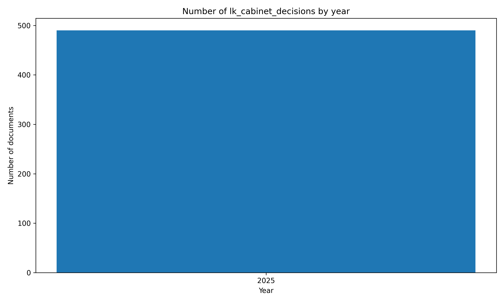

# 🏛️#SriLanka 🇱🇰 Cabinet Decisions `Dataset`


[https://github.com/nuuuwan/lk_cabinet_decisions/tree/data/data/lk_cabinet_decisions](https://github.com/nuuuwan/lk_cabinet_decisions/tree/data/data/lk_cabinet_decisions)

A Sri Lanka Cabinet Decision is an official policy or action agreed by the Cabinet of Ministers, shaping governance, law, and national development in the country.

- [**702** documents](https://github.com/nuuuwan/lk_cabinet_decisions/tree/data/data/lk_cabinet_decisions) (**20.9 MB**), from **2025-01-06** to **2025-08-11**, scraped from **[https://www.cabinetoffice.gov.lk/cab/index.php](https://www.cabinetoffice.gov.lk/cab/index.php)**

- In **JSON**, **TXT** & **🤗 Hugging Face**

- In **සිංහල**, **தமிழ்** & **English**

## 📝 Example Metadata

```json
{
    "doc_type": "lk_cabinet_decisions",
    "doc_id": "2025-08-11-001-si",
    "num": "1",
    "date_str": "2025-08-11",
    "description": "\"\u0daf\u0dd2\u0dc3\u0dca\u0dad\u0dca\u200d\u0dbb\u0dd2\u0d9a\u0dca \u0dc3\u0d82\u0dc0\u0dbb\u0dca\u0db0\u0db1 \u0dc0\u0dd0\u0da9\u0dc3\u0da7\u0dc4\u0db1 - 2025\" \u0d9a\u0dca\u200d\u0dbb\u0dd2\u0dba\u0dcf\u0dad\u0dca\u0db8\u0d9a \u0d9a\u0dd2\u0dbb\u0dd3\u0db8",
    "url_metadata": "https://www.cabinetoffice.gov.lk/cab/index.php?option=com_content&view=article&id=16&Itemid=49&lang=si&dID=13343",
    "lang": "si",
    "decision_details_title": "2025-08-11 \u0daf\u0dd2\u0db1\u0dd0\u0dad\u0dd2 \u0d85\u0db8\u0dcf\u0dad\u0dca\u200d\u0dba \u0db8\u0dab\u0dca\u0da9\u0dbd \u0dad\u0dd3\u0dbb\u0dab\u0dba \u0db4\u0dd2\u0dbd\u0dd2\u0db6\u0db3 \u0db8\u0dcf\u0db0\u0dca\u200d\u0dba \u0db4\u0dca\u200d\u0dbb\u0d9a\u0dcf\u0dc1\u0dba (\u0db8\u0dd3\u0dbd\u0d9c \u0dbb\u0dd0\u0dc3\u0dca\u0dc0\u0dd3\u0db8\u0dda\u0daf\u0dd3 \u0dc3\u0db8\u0dca\u0db8\u0dad \u0d9a\u0dd2\u0dbb\u0dd3\u0db8\u0da7 \u0dba\u0da7\u0dad\u0dca\u0dc0)",
    "decision_details_body": "- \u0dc1\u0dca\u200d\u0dbb\u0dd3 \u0dbd\u0d82\u0d9a\u0dcf\u0dc0\u0dda \u0dc3\u0dd2\u0dba\u0dbd\u0dd4\u0db8 \u0daf\u0dd2\u0dc3\u0dca\u0dad\u0dca\u200d\u0dbb\u0dd2\u0d9a\u0dca\u0d9a \u0d86\u0dc0\u0dbb\u0dab\u0dba \u0dc0\u0db1 \u0db4\u0dbb\u0dd2\u0daf\u0dd2 \u0da2\u0dcf\u0dad\u0dd2\u0d9a \u0db8\u0da7\u0dca\u0da7\u0db8\u0dda \u0dc3\u0d82\u0dc0\u0dbb\u0dca\u0db0\u0db1 \u0dc0\u0dd0\u0da9\u0dc3\u0da7\u0dc4\u0db1\u0d9a\u0dca \u0dbd\u0dd9\u0dc3 \u0daf\u0dd2\u0dc3\u0dca\u0dad\u0dca\u200d\u0dbb\u0dd2\u0d9a\u0dca \u0dc3\u0d82\u0dc0\u0dbb\u0dca\u0db0\u0db1 \u0dc0\u0dd0\u0da9\u0dc3\u0da7\u0dc4\u0db1 \u0d9a\u0dca\u200d\u0dbb\u0dd2\u0dba\u0dcf\u0dad\u0dca\u0db8\u0d9a \u0d9a\u0dd2\u0dbb\u0dd3\u0db8 \u0dc3\u0db3\u0dc4\u0dcf 2025 \u0d85\u0dba\u0dc0\u0dd0\u0dba\u0dd9\u0db1\u0dca \u0dbb\u0dd4\u0db4\u0dd2\u0dba\u0dbd\u0dca \u0db8\u0dd2\u0dbd\u0dd2\u0dba\u0db1 2,000\u0d9a \u0db4\u0dca\u200d\u0dbb\u0dad\u0dd2\u0db4\u0dcf\u0daf\u0db1 \u0dc0\u0dd9\u0db1\u0dca \u0d9a\u0dbb \u0dad\u0dd2\u0db6\u0dda. \u0d91\u0db8 \u0dc0\u0dd0\u0da9\u0dc3\u0da7\u0dc4\u0db1 \u0dba\u0da7\u0dad\u0dda,\u00a0\u00a0 *\u00a0 \u0dba\u0da7\u0dd2\u0dad\u0dbd \u0db4\u0dc4\u0dc3\u0dd4\u0d9a\u0db8\u0dca \u0d89\u0dc4\u0dc5 \u0db1\u0dd0\u0d82\u0dc0\u0dd3\u0db8\u00a0 *\u00a0 \u0daf\u0dda\u0dc1\u0dd3\u0dba \u0db1\u0dd2\u0dc2\u0dca\u0db4\u0dcf\u0daf\u0db1 \u0dc4\u0dd0\u0d9a\u0dd2\u0dba\u0dcf\u0dc0\u0db1\u0dca \u0db4\u0dca\u200d\u0dbb\u0dc0\u0dbb\u0dca\u0db0\u0db1\u0dba\u00a0 *\u00a0 \u0dc3\u0dda\u0dc0\u0dcf \u0dc3\u0dd0\u0db4\u0dba\u0dd4\u0db8\u0dca \u0dba\u0dcf\u0db1\u0dca\u0dad\u0dca\u200d\u0dbb\u0dab\u0dba \u0d9a\u0dcf\u0dbb\u0dca\u0dba\u0d9a\u0dca\u0dc2\u0db8 \u0d9a\u0dd2\u0dbb\u0dd3\u0db8\u00a0 *\u00a0 \u0dc0\u0dd9\u0dc5\u0dd9\u0db3 \u0dc3\u0dc4 \u0d85\u0dbd\u0dd9\u0dc0\u0dd2\u0d9a\u0dbb\u0dab \u0db4\u0dc4\u0dc3\u0dd4\u0d9a\u0db8\u0dca \u0dc0\u0dd0\u0da9\u0dd2\u0daf\u0dd2\u0dba\u0dd4\u0dab\u0dd4 \u0d9a\u0dd2\u0dbb\u0dd3\u0db8\u00a0 *\u00a0 \u0d86\u0dba\u0dad\u0db1\u0dd2\u0d9a \u0db0\u0dcf\u0dbb\u0dd2\u0dad\u0dcf \u0dc1\u0d9a\u0dca\u0dad\u0dd2\u0db8\u0dad\u0dca \u0d9a\u0dd2\u0dbb\u0dd3\u0db8\u0dba\u0db1 \u0d85\u0dbb\u0db8\u0dd4\u0dab\u0dd4 \u0dc3\u0dcf\u0d9a\u0dca\u0dc2\u0dcf\u0dad\u0dca \u0d9a\u0dbb \u0d9c\u0dd0\u0db1\u0dd3\u0db8\u0da7 \u0d85\u0db4\u0dda\u0d9a\u0dca\u0dc2\u0dcf \u0d9a\u0dd9\u0dbb\u0dda. \u0daf\u0dbb\u0dd2\u0daf\u0dca\u200d\u0dbb\u0dad\u0dcf\u0dc0 \u0dc4\u0db3\u0dd4\u0db1\u0dcf\u0d9c\u0dd0\u0db1\u0dd3\u0db8 \u0dc3\u0db3\u0dc4\u0dcf \u0db7\u0dcf\u0dc0\u0dd2\u0dad \u0d9a\u0dbb\u0db1\u0dd4 \u0dbd\u0db6\u0db1 \u0d9c\u0ddd\u0dbd\u0dd3\u0dba \u0daf\u0dbb\u0dca\u0dc1\u0d9a\u0dba\u0d9a\u0dca \u0dc0\u0db1 \u0db6\u0dc4\u0dd4\u0db8\u0dcf\u0db1 \u0daf\u0dbb\u0dd2\u0daf\u0dca\u200d\u0dbb\u0dad\u0dcf \u0daf\u0dbb\u0dca\u0dc1\u0d9a\u0dba \u0d87\u0dc3\u0dd4\u0dbb\u0dd2\u0db1\u0dca \u0da2\u0db1\u0dbd\u0dda\u0d9b\u0db1 \u0dc4\u0dcf \u0dc3\u0d82\u0d9b\u0dca\u200d\u0dba\u0dcf\u0dbd\u0dda\u0d9b\u0db1 \u0daf\u0dd9\u0db4\u0dcf\u0dbb\u0dca\u0dad\u0db8\u0dda\u0db1\u0dca\u0dad\u0dd4\u0dc0 \u0dc0\u0dd2\u0dc3\u0dd2\u0db1\u0dca \u0db4\u0dca\u200d\u0dbb\u0d9a\u0dcf\u0dc1\u0dba\u0da7 \u0db4\u0dad\u0dca \u0d9a\u0dbb\u0db1\u0dd4 \u0dbd\u0dd0\u0db6 \u0d87\u0dad\u0dd2 \u0dc1\u0dca\u200d\u0dbb\u0dd3 \u0dbd\u0d82\u0d9a\u0dcf\u0dc0\u0dda \u0daf\u0dd2\u0dc3\u0dca\u0dad\u0dca\u200d\u0dbb\u0dd2\u0d9a\u0dca \u0daf\u0dbb\u0dd2\u0daf\u0dca\u200d\u0dbb\u0dad\u0dcf \u0db8\u0da7\u0dca\u0da7\u0db8 \u0db4\u0dcf\u0daf\u0d9a \u0d9a\u0dbb \u0d9c\u0db1\u0dd2\u0db8\u0dd2\u0db1\u0dca, \u0daf\u0dd2\u0dc3\u0dca\u0dad\u0dca\u200d\u0dbb\u0dd2\u0d9a\u0dca \u0dc3\u0d82\u0dc0\u0dbb\u0dca\u0db0\u0db1 \u0dc0\u0dd0\u0da9\u0dc3\u0da7\u0dc4\u0db1 - 2025 \u0d9a\u0dca\u200d\u0dbb\u0dd2\u0dba\u0dcf\u0dad\u0dca\u0db8\u0d9a \u0d9a\u0dd2\u0dbb\u0dd3\u0db8 \u0dc3\u0db3\u0dc4\u0dcf 2025 \u0d85\u0dba\u0dc0\u0dd0\u0dba \u0db8\u0d9f\u0dd2\u0db1\u0dca \u0dc3\u0dbd\u0dc3\u0dcf \u0d87\u0dad\u0dd2 \u0db4\u0dca\u200d\u0dbb\u0dad\u0dd2\u0db4\u0dcf\u0daf\u0db1 \u0d91\u0d9a\u0dca \u0d91\u0d9a\u0dca \u0daf\u0dd2\u0dc3\u0dca\u0dad\u0dca\u200d\u0dbb\u0dd2\u0d9a\u0dca\u0d9a\u0dba \u0dc0\u0dd9\u0dad \u0dc0\u0dd9\u0db1\u0dca \u0d9a\u0dbb \u0daf\u0dd3\u0db8 \u0db4\u0dd2\u0dab\u0dd2\u0dc3 \u0db8\u0dd4\u0daf\u0dbd\u0dca, \u0d9a\u0dca\u200d\u0dbb\u0db8\u0dc3\u0db8\u0dca\u0db4\u0dcf\u0daf\u0db1 \u0dc3\u0dc4 \u0d86\u0dbb\u0dca\u0dae\u0dd2\u0d9a \u0dc3\u0d82\u0dc0\u0dbb\u0dca\u0db0\u0db1 \u0d85\u0db8\u0dcf\u0dad\u0dca\u200d\u0dba \u0dc0\u0dc1\u0dba\u0dd9\u0db1\u0dca \u0d9c\u0dbb\u0dd4 \u0da2\u0db1\u0dcf\u0db0\u0dd2\u0db4\u0dad\u0dd2\u0dad\u0dd4\u0db8\u0dcf \u0d89\u0daf\u0dd2\u0dbb\u0dd2\u0db4\u0dad\u0dca \u0d9a\u0dc5 \u0dba\u0ddd\u0da2\u0db1\u0dcf\u0dc0 \u0d85\u0db8\u0dcf\u0dad\u0dca\u200d\u0dba \u0db8\u0dab\u0dca\u0da9\u0dbd\u0dba \u0dc0\u0dd2\u0dc3\u0dd2\u0db1\u0dca \u0d85\u0db1\u0dd4\u0db8\u0dad \u0d9a\u0dbb\u0db1 \u0dbd\u0daf\u0dd3."
}
```

## Documents By Year



## 🤗 Hugging Face Datasets


- [nuuuwan/lk-cabinet-decisions-docs](https://huggingface.co/datasets/nuuuwan/lk-cabinet-decisions-docs)
- [nuuuwan/lk-cabinet-decisions-chunks](https://huggingface.co/datasets/nuuuwan/lk-cabinet-decisions-chunks)

## 🆕 20 Latest documents

- 2025-08-11 | `1` | "දිස්ත්‍රික් සංවර්ධන වැඩසටහන - 2025" ක්‍රියාත්මක කිරීම | [data](https://github.com/nuuuwan/lk_cabinet_decisions/tree/data/data/lk_cabinet_decisions/2020s/2025/2025-08-11-001-si)
- 2025-08-04 | `19` | ටෙනෙක්ටිප්ලේස් එන්නත් මිලිග්‍රෑම් 40න් (40mg) වයල් ‍‍10,000ක් සැපයීම සඳහා වූ ප්‍රසම්පාදනය | [data](https://github.com/nuuuwan/lk_cabinet_decisions/tree/data/data/lk_cabinet_decisions/2020s/2025/2025-08-04-019-si)
- 2025-08-04 | `18` | ශ්‍රී ලංකා සංචාරක සංවර්ධන වැඩසටහන ක්‍රියාත්මක කිරීම සඳහා ජනාධිපති කාර්යසාධක බලකායක් ස්ථාපිත කිරීම | [data](https://github.com/nuuuwan/lk_cabinet_decisions/tree/data/data/lk_cabinet_decisions/2020s/2025/2025-08-04-018-si)
- 2025-08-04 | `17` | 1998 අංක 50 දරන ජාතික ළමා ආරක්ෂක අධිකාරිය පනත සංශෝධන කිරීම | [data](https://github.com/nuuuwan/lk_cabinet_decisions/tree/data/data/lk_cabinet_decisions/2020s/2025/2025-08-04-017-si)
- 2025-08-04 | `16` | ක්‍රීඩා යටිතල පහසුකම් සංවර්ධන ව්‍යාපෘති ක්‍රියාත්මක කිරීම | [data](https://github.com/nuuuwan/lk_cabinet_decisions/tree/data/data/lk_cabinet_decisions/2020s/2025/2025-08-04-016-si)
- 2025-08-04 | `15` | පොලිඇක්සියල් එම්ආර්අයි අනුකූල (ටයිටේනියම්/කොබෝල්ට් ක්‍රෝම්) ලම්බර් පෙඩිකල් ඉස්කුරුප්පු 50ක් සහ පසුපස තොරකෝ ලම්බර් විලයනය සඳහා (ස්කෝලියෝසිස් නිවැරදි කිරීම සඳහා) උපකරණ කට්ටල 20ක් සැපයීම | [data](https://github.com/nuuuwan/lk_cabinet_decisions/tree/data/data/lk_cabinet_decisions/2020s/2025/2025-08-04-015-si)
- 2025-08-04 | `14` | පෙර පුරවා ඇති එනොක්සපාරින් සෝඩියම් එන්නත් 6,000 අයියූ, මිලිලීටර් 0.6 සිරින්ජර්/වයල් 450,000ක් සැපයීම සඳහා වන ප්‍රසම්පාදනය | [data](https://github.com/nuuuwan/lk_cabinet_decisions/tree/data/data/lk_cabinet_decisions/2020s/2025/2025-08-04-014-si)
- 2025-08-04 | `13` | පෙර පුරවා ඇති එනොක්සපාරින් සෝඩියම් එන්නත් 4,000 අයියූ, මිලිලීටර් 0.4 සිරින්ජර්/වයල් 900,000ක් සැපයීම සඳහා වන ප්‍රසම්පාදනය | [data](https://github.com/nuuuwan/lk_cabinet_decisions/tree/data/data/lk_cabinet_decisions/2020s/2025/2025-08-04-013-si)
- 2025-08-04 | `12` | නාගරික පුනර්ජීවන ව්‍යාපෘතිය යටතේ කොළඹගේ මාවත හා ටොරිංටන් මාවත නිවාස ව්‍යාපෘති නැවත ක්‍රියාත්මක කිරීම | [data](https://github.com/nuuuwan/lk_cabinet_decisions/tree/data/data/lk_cabinet_decisions/2020s/2025/2025-08-04-012-si)
- 2025-08-04 | `11` | ලංකා ධීවර වරාය නීතිගත සංස්ථාව සඳහා ඩ්‍රෙජරයක් මිල දී ගැනීම | [data](https://github.com/nuuuwan/lk_cabinet_decisions/tree/data/data/lk_cabinet_decisions/2020s/2025/2025-08-04-011-si)
- 2025-08-04 | `10` | 'Clean Sri Lanka' වැඩසටහන යටතේ පිටකොටුව මධ්‍යම බස් රථ නැවතුම්පොළ සංවර්ධනය කිරීම | [data](https://github.com/nuuuwan/lk_cabinet_decisions/tree/data/data/lk_cabinet_decisions/2020s/2025/2025-08-04-010-si)
- 2025-08-04 | `9` | ශ්‍රී ලංකා ඉන්ස්ටිටියුට් ඔෆ් බයෝටෙක්නොලොජි ප්‍රයිවට් ලිමිටඩ් සහ ඇමෙරිකා එක්සත් ජනපදයේ University of Illinois අතර අවබෝධතා ගිවිසුමකට අත්සන් තැබීම | [data](https://github.com/nuuuwan/lk_cabinet_decisions/tree/data/data/lk_cabinet_decisions/2020s/2025/2025-08-04-009-si)
- 2025-08-04 | `8` | පාර්ලිමේන්තු මන්ත්‍රීවරුන් සඳහා වූ සමූහ රක්ෂණාවරණ සීමාව සංශෝධනය කිරීම | [data](https://github.com/nuuuwan/lk_cabinet_decisions/tree/data/data/lk_cabinet_decisions/2020s/2025/2025-08-04-008-si)
- 2025-08-04 | `7` | කාන්තාවන්ට එරෙහි සියලු ආකාරයේ වෙනස් කොට සැලකීම් පිටුදැකීමේ සම්මුතිය යටතේ ශ්‍රී ලංකාවේ බැඳීම්වලට අදාළව කටයුතු කිරීම පිණිස අන්තර් අමාත්‍යාංශ ස්ථාවර කමිටුවක් පිහිටුවීම | [data](https://github.com/nuuuwan/lk_cabinet_decisions/tree/data/data/lk_cabinet_decisions/2020s/2025/2025-08-04-007-si)
- 2025-08-04 | `6` | ප්‍රතිසන්ධානය සහ සහජීවනය පිළිබඳ ජාතික ප්‍රතිපත්තියක් සහ ක්‍රියාකාරී සැලැස්මක් සකස් කිරීම | [data](https://github.com/nuuuwan/lk_cabinet_decisions/tree/data/data/lk_cabinet_decisions/2020s/2025/2025-08-04-006-si)
- 2025-08-04 | `5` | 2012 හා 2021 වර්ෂයන්හි පැවති සීමා නිර්ණය කමිටු නිර්දේශයන් සමාලෝචනය කර නිර්දේශ ඉදිරිපත් කිරීම සඳහා නව සීමා නිර්ණය කමිටුවක් පත් කිරීම | [data](https://github.com/nuuuwan/lk_cabinet_decisions/tree/data/data/lk_cabinet_decisions/2020s/2025/2025-08-04-005-si)
- 2025-08-04 | `4` | කොළඹ කොටුව, ඕල්කට් මාවතේ පිහිටි නාගරික සංවර්ධන අධිකාරියට අයත් චාමර්ස් ධාන්‍යාගාරය නමැති ඉඩම සඳහා ආයෝජන යෝජනා කැඳවීම | [data](https://github.com/nuuuwan/lk_cabinet_decisions/tree/data/data/lk_cabinet_decisions/2020s/2025/2025-08-04-004-si)
- 2025-08-04 | `3` | අතත්‍ය නගර (Virtual City) නිර්මාණය කිරීමේ ව්‍යාපෘතිය යටතේ Virtual City in Kandy නිර්මාණය කිරීම | [data](https://github.com/nuuuwan/lk_cabinet_decisions/tree/data/data/lk_cabinet_decisions/2020s/2025/2025-08-04-003-si)
- 2025-08-04 | `2` | තෝරාගත් කුළුබඩු ප්‍රතිඅපනයනය සඳහා ආනයන සමාගම්වලට ‘අනුමත ව්‍යවසාය’ තත්ත්වය ලබා දීම | [data](https://github.com/nuuuwan/lk_cabinet_decisions/tree/data/data/lk_cabinet_decisions/2020s/2025/2025-08-04-002-si)
- 2025-08-04 | `1` | 2025 දෙවන කාර්තුව සඳහා වන රජයේ මූල්‍ය කාර්යසාධනය පිළිබඳ ප්‍රකාශය | [data](https://github.com/nuuuwan/lk_cabinet_decisions/tree/data/data/lk_cabinet_decisions/2020s/2025/2025-08-04-001-si)

---

### [More Datasets about 🇱🇰 #SriLanka](https://github.com/nuuuwan/lk_datasets)


[](https://opensource.org/licenses/MIT)
