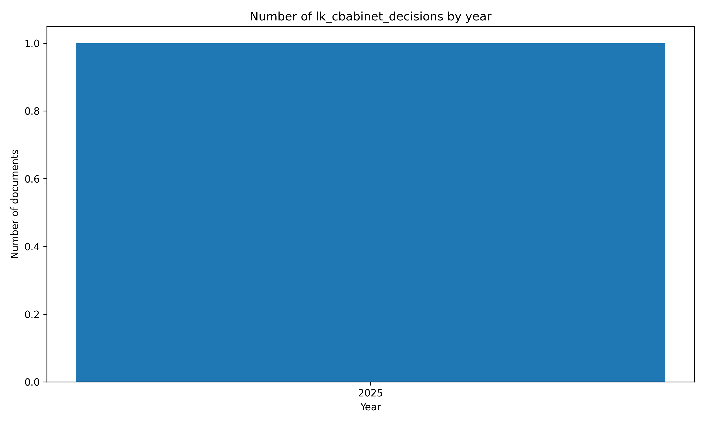

# 🏛️#SriLanka 🇱🇰 Cbabinet Decisions `Dataset`


[https://github.com/nuuuwan/lk_cbabinet_decisions/tree/data/data/lk_cbabinet_decisions](https://github.com/nuuuwan/lk_cbabinet_decisions/tree/data/data/lk_cbabinet_decisions)

A Sri Lanka Cabinet Decision is an official policy or action agreed by the Cabinet of Ministers, shaping governance, law, and national development in the country.

- [**1** documents](https://github.com/nuuuwan/lk_cbabinet_decisions/tree/data/data/lk_cbabinet_decisions) (**38.0 kB**), from **2025-01-06** to **2025-01-06**, scraped from **[https://www.cabinetoffice.gov.lk/cab/index.php](https://www.cabinetoffice.gov.lk/cab/index.php)**

- In **JSON**

- In **English**

## 📝 Example Metadata

```json
{
    "doc_type": "lk_cbabinet_decisions",
    "doc_id": "2025-01-06-1",
    "num": "1",
    "date_str": "2025-01-06",
    "description": "Agreement on Co-operation and Mutual Assistance in Customs Matters between Sri Lanka and Vietnam",
    "url_metadata": "https://www.cabinetoffice.gov.lk/cab/index.php?option=com_content&view=article&id=16&Itemid=49&lang=en&dID=12973",
    "lang": "en",
    "decision_details": "- Although approval of the Cabinet had been granted at its meeting held on 2021\u201111\u201123 to sign an Agreement on Co-operation and Mutual Assistance in Customs Matters between Sri Lanka and Vietnam, the relevant Agreement has not yet been signed. The proposed Agreement is expected to achieve the objectives such as; reducing the cost of trade transactions between the two countries, accurate valuation and collection of taxes related to border taxes and imposing regulations on prohibition, restriction and control of the movement of restricted goods. The clearance of the Attorney General has been received for the Agreement, which has been agreed upon by both parties. Accordingly, the proposal made by the Hon. President in his capacity as the Minister of Finance, Planning and Economic Development, to sign the said Agreement between Sri Lanka and Vietnam, was approved by the Cabinet."
}
```

## Documents By Year



## 🤗 Hugging Face Datasets


- [nuuuwan/lk-cbabinet-decisions-docs](https://huggingface.co/datasets/nuuuwan/lk-cbabinet-decisions-docs)
- [nuuuwan/lk-cbabinet-decisions-chunks](https://huggingface.co/datasets/nuuuwan/lk-cbabinet-decisions-chunks)

## 🆕 20 Latest documents

- 2025-01-06 | `1` | Agreement on Co-operation and Mutual Assistance in Customs Matters between Sri Lanka and Vietnam | [data](https://github.com/nuuuwan/lk_cbabinet_decisions/tree/data/data/lk_cbabinet_decisions/2020s/2025/2025-01-06-1)

---

### [More Datasets about 🇱🇰 #SriLanka](https://github.com/nuuuwan/lk_datasets)


[](https://opensource.org/licenses/MIT)
